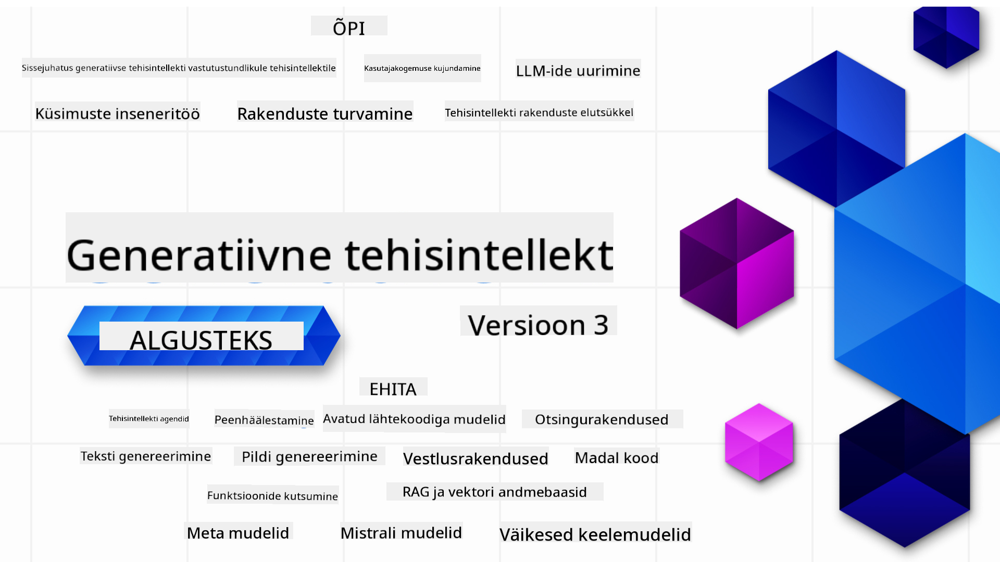

<!--
CO_OP_TRANSLATOR_METADATA:
{
  "original_hash": "f71b15f52ad5f493f2d0fca9c2c6832c",
  "translation_date": "2025-10-11T11:12:45+00:00",
  "source_file": "README.md",
  "language_code": "et"
}
-->

### 21 õppetundi, mis õpetavad kõike, mida on vaja teada generatiivse tehisintellekti rakenduste loomiseks

### 🌐 Mitmekeelne tugi

#### Toetatud GitHub Actioni kaudu (automaatne ja alati ajakohane)

<!-- CO-OP TRANSLATOR LANGUAGES TABLE START -->
[Araabia](../ar/README.md) | [Bengali](../bn/README.md) | [Bulgaaria](../bg/README.md) | [Birma (Myanmar)](../my/README.md) | [Hiina (lihtsustatud)](../zh/README.md) | [Hiina (traditsiooniline, Hongkong)](../hk/README.md) | [Hiina (traditsiooniline, Macau)](../mo/README.md) | [Hiina (traditsiooniline, Taiwan)](../tw/README.md) | [Horvaatia](../hr/README.md) | [Tšehhi](../cs/README.md) | [Taani](../da/README.md) | [Hollandi](../nl/README.md) | [Eesti](./README.md) | [Soome](../fi/README.md) | [Prantsuse](../fr/README.md) | [Saksa](../de/README.md) | [Kreeka](../el/README.md) | [Heebrea](../he/README.md) | [Hindi](../hi/README.md) | [Ungari](../hu/README.md) | [Indoneesia](../id/README.md) | [Itaalia](../it/README.md) | [Jaapani](../ja/README.md) | [Korea](../ko/README.md) | [Leedu](../lt/README.md) | [Malai](../ms/README.md) | [Marathi](../mr/README.md) | [Nepali](../ne/README.md) | [Norra](../no/README.md) | [Pärsia (Farsi)](../fa/README.md) | [Poola](../pl/README.md) | [Portugali (Brasiilia)](../br/README.md) | [Portugali (Portugal)](../pt/README.md) | [Punjabi (Gurmukhi)](../pa/README.md) | [Rumeenia](../ro/README.md) | [Vene](../ru/README.md) | [Serbia (kirillitsa)](../sr/README.md) | [Slovaki](../sk/README.md) | [Sloveeni](../sl/README.md) | [Hispaania](../es/README.md) | [Suahiili](../sw/README.md) | [Rootsi](../sv/README.md) | [Tagalogi (Filipino)](../tl/README.md) | [Tamili](../ta/README.md) | [Tai](../th/README.md) | [Türgi](../tr/README.md) | [Ukraina](../uk/README.md) | [Urdu](../ur/README.md) | [Vietnami](../vi/README.md)
<!-- CO-OP TRANSLATOR LANGUAGES TABLE END -->

# Generatiivne tehisintellekt algajatele (Versioon 3) - Kursus

Õpi generatiivse tehisintellekti rakenduste loomise põhitõdesid meie 21-õppetunniga Microsofti Cloud Advocates'i kursusel.

## 🌱 Alustamine

Kursus sisaldab 21 õppetundi. Iga õppetund käsitleb oma teemat, seega alusta sealt, kus soovid!

Õppetunnid on märgistatud kas "Õpi" õppetundidena, mis selgitavad generatiivse tehisintellekti kontseptsiooni, või "Loo" õppetundidena, mis sisaldavad kontseptsiooni ja koodinäiteid nii **Pythonis** kui **TypeScriptis**, kui võimalik.

.NET arendajatele: vaata [Generatiivne tehisintellekt algajatele (.NET versioon)](https://github.com/microsoft/Generative-AI-for-beginners-dotnet?WT.mc_id=academic-105485-koreyst)!

Iga õppetund sisaldab ka "Jätka õppimist" sektsiooni täiendavate õppematerjalidega.

## Mida on vaja
### Kursuse koodi käivitamiseks võid kasutada:
 - [Azure OpenAI teenust](https://aka.ms/genai-beginners/azure-open-ai?WT.mc_id=academic-105485-koreyst) - **Õppetunnid:** "aoai-assignment"
 - [GitHub Marketplace mudelikataloogi](https://aka.ms/genai-beginners/gh-models?WT.mc_id=academic-105485-koreyst) - **Õppetunnid:** "githubmodels"
 - [OpenAI API-d](https://aka.ms/genai-beginners/open-ai?WT.mc_id=academic-105485-koreyst) - **Õppetunnid:** "oai-assignment" 

- Põhiteadmised Pythonist või TypeScriptist on kasulikud - \*Algajatele soovitame neid [Python](https://aka.ms/genai-beginners/python?WT.mc_id=academic-105485-koreyst) ja [TypeScript](https://aka.ms/genai-beginners/typescript?WT.mc_id=academic-105485-koreyst) kursusi
- GitHubi konto, et [forkida kogu see repo](https://aka.ms/genai-beginners/github?WT.mc_id=academic-105485-koreyst) oma GitHubi kontole

Oleme loonud **[Kursuse seadistamise](./00-course-setup/README.md?WT.mc_id=academic-105485-koreyst)** õppetunni, mis aitab sul arenduskeskkonda seadistada.

Ära unusta [tähtede (🌟) lisamist sellele repole](https://docs.github.com/en/get-started/exploring-projects-on-github/saving-repositories-with-stars?WT.mc_id=academic-105485-koreyst), et seda hiljem lihtsamini leida.

## 🧠 Valmis juurutamiseks?

Kui otsid keerukamaid koodinäiteid, vaata meie [Generatiivse tehisintellekti koodinäidete kogumikku](https://aka.ms/genai-beg-code?WT.mc_id=academic-105485-koreyst) nii **Pythonis** kui **TypeScriptis**.

## 🗣️ Kohtu teiste õppijatega, saa tuge

Liitu meie [ametliku Azure AI Foundry Discord serveriga](https://aka.ms/genai-discord?WT.mc_id=academic-105485-koreyst), et kohtuda ja suhelda teiste õppijatega, kes seda kursust läbivad, ning saada tuge.

Esita küsimusi või jaga tagasisidet meie [Azure AI Foundry arendajate foorumis](https://aka.ms/azureaifoundry/forum) GitHubis.

## 🚀 Kas ehitad idufirmat?

Külasta [Microsoft for Startups](https://www.microsoft.com/startups), et saada teada, kuidas alustada Azure'i krediitidega juba täna.

## 🙏 Soovid aidata?

Kas sul on ettepanekuid või leidsid kirjavigu või koodivigu? [Esita probleem](https://github.com/microsoft/generative-ai-for-beginners/issues?WT.mc_id=academic-105485-koreyst) või [Loo tõmbepäring](https://github.com/microsoft/generative-ai-for-beginners/pulls?WT.mc_id=academic-105485-koreyst)

## 📂 Iga õppetund sisaldab:

- Lühikest video sissejuhatust teemasse
- Kirjalikku õppetundi README-s
- Python ja TypeScript koodinäiteid, mis toetavad Azure OpenAI ja OpenAI API-d
- Linke lisamaterjalidele, et jätkata õppimist

## 🗃️ Õppetunnid

| #   | **Õppetunni link**                                                                                                                              | **Kirjeldus**                                                                                 | **Video**                                                                   | **Lisamaterjalid**                                                             |
| --- | -------------------------------------------------------------------------------------------------------------------------------------------- | ----------------------------------------------------------------------------------------------- | --------------------------------------------------------------------------- | ------------------------------------------------------------------------------ |
| 00  | [Kursuse seadistamine](./00-course-setup/README.md?WT.mc_id=academic-105485-koreyst)                                                                 | **Õpi:** Kuidas seadistada oma arenduskeskkonda                                            | Video tulekul                                                                 | [Loe rohkem](https://aka.ms/genai-collection?WT.mc_id=academic-105485-koreyst) |
| 01  | [Sissejuhatus generatiivsesse tehisintellekti ja LLM-idesse](./01-introduction-to-genai/README.md?WT.mc_id=academic-105485-koreyst)                              | **Õpi:** Mis on generatiivne tehisintellekt ja kuidas töötavad suured keelemudelid (LLM-id).       | [Video](https://aka.ms/gen-ai-lesson-1-gh?WT.mc_id=academic-105485-koreyst) | [Loe rohkem](https://aka.ms/genai-collection?WT.mc_id=academic-105485-koreyst) |
| 02  | [Erinevate LLM-ide uurimine ja võrdlemine](./02-exploring-and-comparing-different-llms/README.md?WT.mc_id=academic-105485-koreyst)             | **Õpi:** Kuidas valida oma kasutusjuhtumi jaoks sobiv mudel                                      | [Video](https://aka.ms/gen-ai-lesson2-gh?WT.mc_id=academic-105485-koreyst)  | [Loe rohkem](https://aka.ms/genai-collection?WT.mc_id=academic-105485-koreyst) |
| 03  | [Generatiivse tehisintellekti vastutustundlik kasutamine](./03-using-generative-ai-responsibly/README.md?WT.mc_id=academic-105485-koreyst)                           | **Õpi:** Kuidas luua generatiivse tehisintellekti rakendusi vastutustundlikult                                  | [Video](https://aka.ms/gen-ai-lesson3-gh?WT.mc_id=academic-105485-koreyst)  | [Loe rohkem](https://aka.ms/genai-collection?WT.mc_id=academic-105485-koreyst) |
| 04  | [Prompt Engineering'i põhialuste mõistmine](./04-prompt-engineering-fundamentals/README.md?WT.mc_id=academic-105485-koreyst)             | **Õpi:** Praktilised parimad tavad Prompt Engineering'is                                           | [Video](https://aka.ms/gen-ai-lesson4-gh?WT.mc_id=academic-105485-koreyst)  | [Loe rohkem](https://aka.ms/genai-collection?WT.mc_id=academic-105485-koreyst) |
| 05  | [Täiustatud promptide loomine](./05-advanced-prompts/README.md?WT.mc_id=academic-105485-koreyst)                                                | **Õpi:** Kuidas rakendada promptide inseneritehnikaid, mis parandavad promptide tulemusi. | [Video](https://aka.ms/gen-ai-lesson5-gh?WT.mc_id=academic-105485-koreyst)  | [Loe rohkem](https://aka.ms/genai-collection?WT.mc_id=academic-105485-koreyst) |
| 06  | [Tekstiloome rakenduste loomine](./06-text-generation-apps/README.md?WT.mc_id=academic-105485-koreyst)                                | **Loo:** Tekstiloome rakendus, kasutades Azure OpenAI / OpenAI API                                | [Video](https://aka.ms/gen-ai-lesson6-gh?WT.mc_id=academic-105485-koreyst)  | [Loe lähemalt](https://aka.ms/genai-collection?WT.mc_id=academic-105485-koreyst) |
| 07  | [Vestlusrakenduste loomine](./07-building-chat-applications/README.md?WT.mc_id=academic-105485-koreyst)                                     | **Loo:** Tehnikad vestlusrakenduste tõhusaks loomiseks ja integreerimiseks.                       | [Video](https://aka.ms/gen-ai-lessons7-gh?WT.mc_id=academic-105485-koreyst) | [Loe lähemalt](https://aka.ms/genai-collection?WT.mc_id=academic-105485-koreyst) |
| 08  | [Otsingurakenduste loomine vektorpõhiste andmebaasidega](./08-building-search-applications/README.md?WT.mc_id=academic-105485-koreyst)      | **Loo:** Otsingurakendus, mis kasutab andmete otsimiseks vektorpõhiseid sisendeid.                | [Video](https://aka.ms/gen-ai-lesson8-gh?WT.mc_id=academic-105485-koreyst)  | [Loe lähemalt](https://aka.ms/genai-collection?WT.mc_id=academic-105485-koreyst) |
| 09  | [Pildiloome rakenduste loomine](./09-building-image-applications/README.md?WT.mc_id=academic-105485-koreyst)                              | **Loo:** Pildiloome rakendus                                                                     | [Video](https://aka.ms/gen-ai-lesson9-gh?WT.mc_id=academic-105485-koreyst)  | [Loe lähemalt](https://aka.ms/genai-collection?WT.mc_id=academic-105485-koreyst) |
| 10  | [Madalakoodiliste tehisintellekti rakenduste loomine](./10-building-low-code-ai-applications/README.md?WT.mc_id=academic-105485-koreyst)   | **Loo:** Generatiivse tehisintellekti rakendus, kasutades madalakoodilisi tööriistu              | [Video](https://aka.ms/gen-ai-lesson10-gh?WT.mc_id=academic-105485-koreyst) | [Loe lähemalt](https://aka.ms/genai-collection?WT.mc_id=academic-105485-koreyst) |
| 11  | [Väliste rakenduste integreerimine funktsioonikutsumisega](./11-integrating-with-function-calling/README.md?WT.mc_id=academic-105485-koreyst) | **Loo:** Mis on funktsioonikutsumine ja selle kasutusvõimalused rakendustes                     | [Video](https://aka.ms/gen-ai-lesson11-gh?WT.mc_id=academic-105485-koreyst) | [Loe lähemalt](https://aka.ms/genai-collection?WT.mc_id=academic-105485-koreyst) |
| 12  | [Kasutajakogemuse kujundamine tehisintellekti rakendustele](./12-designing-ux-for-ai-applications/README.md?WT.mc_id=academic-105485-koreyst) | **Õpi:** Kuidas rakendada kasutajakogemuse disaini põhimõtteid generatiivse tehisintellekti rakenduste arendamisel | [Video](https://aka.ms/gen-ai-lesson12-gh?WT.mc_id=academic-105485-koreyst) | [Loe lähemalt](https://aka.ms/genai-collection?WT.mc_id=academic-105485-koreyst) |
| 13  | [Generatiivse tehisintellekti rakenduste turvamine](./13-securing-ai-applications/README.md?WT.mc_id=academic-105485-koreyst)              | **Õpi:** Tehisintellekti süsteemide ohud ja riskid ning meetodid nende turvamiseks.              | [Video](https://aka.ms/gen-ai-lesson13-gh?WT.mc_id=academic-105485-koreyst) | [Loe lähemalt](https://aka.ms/genai-collection?WT.mc_id=academic-105485-koreyst) |
| 14  | [Generatiivse tehisintellekti rakenduste elutsükkel](./14-the-generative-ai-application-lifecycle/README.md?WT.mc_id=academic-105485-koreyst) | **Õpi:** Tööriistad ja mõõdikud LLM-i elutsükli ja LLMOpsi haldamiseks                           | [Video](https://aka.ms/gen-ai-lesson14-gh?WT.mc_id=academic-105485-koreyst) | [Loe lähemalt](https://aka.ms/genai-collection?WT.mc_id=academic-105485-koreyst) |
| 15  | [Retrieval Augmented Generation (RAG) ja vektorpõhised andmebaasid](./15-rag-and-vector-databases/README.md?WT.mc_id=academic-105485-koreyst) | **Loo:** Rakendus, mis kasutab RAG-raamistikku vektorpõhistest andmebaasidest sisendite hankimiseks | [Video](https://aka.ms/gen-ai-lesson15-gh?WT.mc_id=academic-105485-koreyst) | [Loe lähemalt](https://aka.ms/genai-collection?WT.mc_id=academic-105485-koreyst) |
| 16  | [Avatud lähtekoodiga mudelid ja Hugging Face](./16-open-source-models/README.md?WT.mc_id=academic-105485-koreyst)                         | **Loo:** Rakendus, mis kasutab Hugging Face'i avatud lähtekoodiga mudeleid                       | [Video](https://aka.ms/gen-ai-lesson16-gh?WT.mc_id=academic-105485-koreyst) | [Loe lähemalt](https://aka.ms/genai-collection?WT.mc_id=academic-105485-koreyst) |
| 17  | [Tehisintellekti agendid](./17-ai-agents/README.md?WT.mc_id=academic-105485-koreyst)                                                      | **Loo:** Rakendus, mis kasutab tehisintellekti agentide raamistikku                              | [Video](https://aka.ms/gen-ai-lesson17-gh?WT.mc_id=academic-105485-koreyst) | [Loe lähemalt](https://aka.ms/genai-collection?WT.mc_id=academic-105485-koreyst) |
| 18  | [LLM-ide peenhäälestamine](./18-fine-tuning/README.md?WT.mc_id=academic-105485-koreyst)                                                   | **Õpi:** Mis on LLM-ide peenhäälestamine, miks ja kuidas seda teha                              | [Video](https://aka.ms/gen-ai-lesson18-gh?WT.mc_id=academic-105485-koreyst) | [Loe lähemalt](https://aka.ms/genai-collection?WT.mc_id=academic-105485-koreyst) |
| 19  | [SLM-idega ehitamine](./19-slm/README.md?WT.mc_id=academic-105485-koreyst)                                                                | **Õpi:** Väikeste keelemudelitega ehitamise eelised                                              | Video tulekul | [Loe lähemalt](https://aka.ms/genai-collection?WT.mc_id=academic-105485-koreyst) |
| 20  | [Mistrali mudelitega ehitamine](./20-mistral/README.md?WT.mc_id=academic-105485-koreyst)                                                  | **Õpi:** Mistrali mudeliperekonna omadused ja erinevused                                         | Video tulekul | [Loe lähemalt](https://aka.ms/genai-collection?WT.mc_id=academic-105485-koreyst) |
| 21  | [Meta mudelitega ehitamine](./21-meta/README.md?WT.mc_id=academic-105485-koreyst)                                                         | **Õpi:** Meta mudeliperekonna omadused ja erinevused                                             | Video tulekul | [Loe lähemalt](https://aka.ms/genai-collection?WT.mc_id=academic-105485-koreyst) |

### 🌟 Erilised tänud

Erilised tänud [**John Aziz**](https://www.linkedin.com/in/john0isaac/) kõigi GitHub Actions'i ja töövoogude loomise eest.

[**Bernhard Merkle**](https://www.linkedin.com/in/bernhard-merkle-738b73/) oluliste panuste eest igasse õppetundi, et parandada õppija ja koodi kogemust.

## 🎒 Teised kursused

Meie meeskond loob ka teisi kursusi! Vaata:

- [**UUS** Edge AI algajatele](https://github.com/microsoft/edgeai-for-beginners)
- [Mudeli konteksti protokoll algajatele](https://github.com/microsoft/mcp-for-beginners)
- [Tehisintellekti agendid algajatele](https://github.com/microsoft/ai-agents-for-beginners)
- [Generatiivne tehisintellekt algajatele, kasutades .NET-i](https://github.com/microsoft/Generative-AI-for-beginners-dotnet)
- [Generatiivne tehisintellekt algajatele, kasutades JavaScripti](https://aka.ms/genai-js-course)
- [Generatiivne tehisintellekt algajatele, kasutades Java-t](https://aka.ms/genaijava)
- [Masinõpe algajatele](https://aka.ms/ml-beginners)
- [Andmeteadus algajatele](https://aka.ms/datascience-beginners)
- [Tehisintellekt algajatele](https://aka.ms/ai-beginners)
- [Küberjulgeolek algajatele](https://github.com/microsoft/Security-101)
- [Veebiarendus algajatele](https://aka.ms/webdev-beginners)
- [IoT algajatele](https://aka.ms/iot-beginners)
- [XR-arendus algajatele](https://github.com/microsoft/xr-development-for-beginners)
- [GitHub Copiloti meistriklass AI paarisprogrammeerimiseks](https://aka.ms/GitHubCopilotAI)
- [GitHub Copiloti meistriklass C#/.NET arendajatele](https://github.com/microsoft/mastering-github-copilot-for-dotnet-csharp-developers)
- [Vali oma Copiloti seiklus](https://github.com/microsoft/CopilotAdventures)

## Abi saamine

Kui jääd hätta või sul on küsimusi tehisintellekti rakenduste loomise kohta, liitu:

Kui sul on tootetagasisidet või esineb vigu ehitamise ajal, külasta:

---

**Lahtiütlus**:  
See dokument on tõlgitud AI tõlketeenuse [Co-op Translator](https://github.com/Azure/co-op-translator) abil. Kuigi püüame tagada täpsust, palume arvestada, et automaatsed tõlked võivad sisaldada vigu või ebatäpsusi. Algne dokument selle algses keeles tuleks pidada autoriteetseks allikaks. Olulise teabe puhul soovitame kasutada professionaalset inimtõlget. Me ei vastuta selle tõlke kasutamisest tulenevate arusaamatuste või valesti tõlgenduste eest.