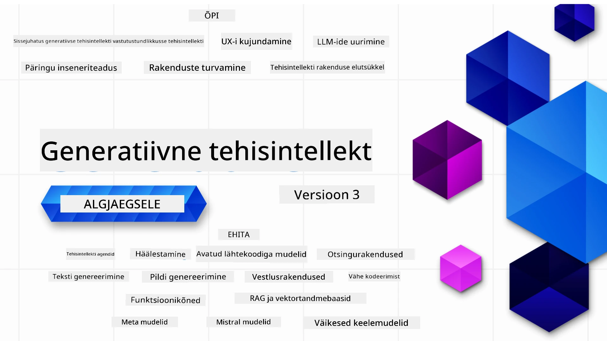

### 21 õppetundi, mis õpetavad kõike, mida pead teadma generatiivsete tehisintellekti rakenduste ehitamiseks

[](https://github.com/microsoft/Generative-AI-For-Beginners/blob/master/LICENSE?WT.mc_id=academic-105485-koreyst)
[](https://GitHub.com/microsoft/Generative-AI-For-Beginners/graphs/contributors/?WT.mc_id=academic-105485-koreyst)
[](https://GitHub.com/microsoft/Generative-AI-For-Beginners/issues/?WT.mc_id=academic-105485-koreyst)
[](https://GitHub.com/microsoft/Generative-AI-For-Beginners/pulls/?WT.mc_id=academic-105485-koreyst)
[](http://makeapullrequest.com?WT.mc_id=academic-105485-koreyst)

[](https://GitHub.com/microsoft/Generative-AI-For-Beginners/watchers/?WT.mc_id=academic-105485-koreyst)
[](https://GitHub.com/microsoft/Generative-AI-For-Beginners/network/?WT.mc_id=academic-105485-koreyst)
[](https://GitHub.com/microsoft/Generative-AI-For-Beginners/stargazers/?WT.mc_id=academic-105485-koreyst)

[](https://discord.gg/nTYy5BXMWG)

### 🌐 Mitmekeelne tugi

#### Toetatud GitHub Action abil (automatiseeritud ja alati ajakohane)

<!-- CO-OP TRANSLATOR LANGUAGES TABLE START -->
[Araabia](../ar/README.md) | [Bengali](../bn/README.md) | [Bulgaaria](../bg/README.md) | [Birma (Myanmar)](../my/README.md) | [Hiina (lihtsustatud)](../zh-CN/README.md) | [Hiina (traditsiooniline, Hongkong)](../zh-HK/README.md) | [Hiina (traditsiooniline, Macau)](../zh-MO/README.md) | [Hiina (traditsiooniline, Taiwan)](../zh-TW/README.md) | [Horvaadi](../hr/README.md) | [Tšehhi](../cs/README.md) | [Taani](../da/README.md) | [Hollandi](../nl/README.md) | [Eesti](./README.md) | [Soome](../fi/README.md) | [Prantsuse](../fr/README.md) | [Saksa](../de/README.md) | [Kreeka](../el/README.md) | [Heebrea](../he/README.md) | [Hindi](../hi/README.md) | [Ungari](../hu/README.md) | [Indoneesia](../id/README.md) | [Itaalia](../it/README.md) | [Jaapani](../ja/README.md) | [Kannada](../kn/README.md) | [Korea](../ko/README.md) | [Leedu](../lt/README.md) | [Malai](../ms/README.md) | [Malajalami](../ml/README.md) | [Marathi](../mr/README.md) | [Nepali](../ne/README.md) | [Nigeeria pidgin](../pcm/README.md) | [Norra](../no/README.md) | [Pärsia (Farsi)](../fa/README.md) | [Poola](../pl/README.md) | [Portugali (Brasiilia)](../pt-BR/README.md) | [Portugali (Portugal)](../pt-PT/README.md) | [Panjabi (Gurmukhi)](../pa/README.md) | [Rumeenia](../ro/README.md) | [Vene](../ru/README.md) | [Serbia (kirilitsa)](../sr/README.md) | [Slovaki](../sk/README.md) | [Sloveeni](../sl/README.md) | [Hispaania](../es/README.md) | [Suahiili](../sw/README.md) | [Rootsi](../sv/README.md) | [Tagalogi (filipino)](../tl/README.md) | [Tamili](../ta/README.md) | [Telugu](../te/README.md) | [Tai](../th/README.md) | [Türgi](../tr/README.md) | [Ukraina](../uk/README.md) | [Urdu](../ur/README.md) | [Vietnam](../vi/README.md)

> **Eelistad kloonimist lokaalselt?**

> See hoidla sisaldab üle 50 keele tõlkeid, mis suurendavad oluliselt allalaadimise mahtu. Tõlgeteta kloonimiseks kasuta spaarset checkouti:
> ```bash
> git clone --filter=blob:none --sparse https://github.com/microsoft/generative-ai-for-beginners.git
> cd generative-ai-for-beginners
> git sparse-checkout set --no-cone '/*' '!translations' '!translated_images'
> ```
> See annab sulle kõik vajaliku kursuse läbimiseks palju kiirema allalaadimiskiirusega.
<!-- CO-OP TRANSLATOR LANGUAGES TABLE END -->

# Generatiivne tehisintellekt algajatele (versioon 3) – kursus

Õpi generatiivsete tehisintellekti rakenduste ehitamise põhialuseid meie Microsoft Cloud Advocatesi 21-õppetunnise põhjaliku kursusega.

## 🌱 Alustamine

Sellel kursusel on 21 õppetundi. Iga õppetund käsitleb omaette teemat, nii et alusta sealt, kus soovid!

Õppetunnid on märgistatud kas "Õpi" õppetundidena, mis seletavad generatiivse tehisintellekti kontseptsioone, või "Ehita" õppetundidena, mis seletavad kontseptsiooni ja näitavad koodi nii **Pythonis** kui **TypeScriptis**, kui võimalik.

.NET arendajatele vaata [Generatiivne tehisintellekt algajatele (.NET väljaanne)](https://github.com/microsoft/Generative-AI-for-beginners-dotnet?WT.mc_id=academic-105485-koreyst)!

Iga õppetund sisaldab ka jaotist "Jätka õppimist" täiendavate õppematerjalidega.

## Mida vajad
### Selle kursuse koodi käitamiseks võid kasutada üht järgmistest: 
 - [Azure OpenAI teenus](https://aka.ms/genai-beginners/azure-open-ai?WT.mc_id=academic-105485-koreyst) - **Õppetunnid:** "aoai-assignment"
 - [GitHub Marketplace mudelite kataloog](https://aka.ms/genai-beginners/gh-models?WT.mc_id=academic-105485-koreyst) - **Õppetunnid:** "githubmodels"
 - [OpenAI API](https://aka.ms/genai-beginners/open-ai?WT.mc_id=academic-105485-koreyst) - **Õppetunnid:** "oai-assignment" 
   
- Põhilised teadmised Pythonist või TypeScriptist on kasulikud – *absoluutsetele algajatele soovitame neid [Python](https://aka.ms/genai-beginners/python?WT.mc_id=academic-105485-koreyst) ja [TypeScript](https://aka.ms/genai-beginners/typescript?WT.mc_id=academic-105485-koreyst) kursusi
- GitHubi konto, et [forkida see kogu hoidla](https://aka.ms/genai-beginners/github?WT.mc_id=academic-105485-koreyst) oma GitHubi kontole

Olemas on ka **[Kursuse seadistamine](./00-course-setup/README.md?WT.mc_id=academic-105485-koreyst)** õppetund, mis aitab sul seadistada arenduskeskkonda.

Ära unusta hiljem selle hoidla [tähti (🌟) lisada](https://docs.github.com/en/get-started/exploring-projects-on-github/saving-repositories-with-stars?WT.mc_id=academic-105485-koreyst), et seda lihtsamini üles leida.

## 🧠 Valmis juurutamiseks?

Kui otsid veelgi arenenumaid koodinäiteid, vaata meie [generatiivse tehisintellekti koodinäidete kogu](https://aka.ms/genai-beg-code?WT.mc_id=academic-105485-koreyst) nii **Pythonis** kui **TypeScriptis**.

## 🗣️ Kohtu teiste õppijatega, saa tuge

Liitu meie [ametliku Azure AI Foundry Discordi serveriga](https://aka.ms/genai-discord?WT.mc_id=academic-105485-koreyst), et kohtuda ja suhelda teiste seda kursust läbivate õppijatega ning saada tuge.

Esita küsimusi või jaga toodete tagasisidet meie [Azure AI Foundry arendajate foorumis](https://aka.ms/azureaifoundry/forum) GitHubis.

## 🚀 Startup’i ehitamine?

Külasta [Microsoft for Startups](https://www.microsoft.com/startups), et teada saada, kuidas alustada Azure krediitidega juba täna.

## 🙏 Tahad aidata?

Kas sul on ettepanekuid või leidsid kirjavigu või koodivigu? [Ava probleem](https://github.com/microsoft/generative-ai-for-beginners/issues?WT.mc_id=academic-105485-koreyst) või [loo tõmbepäring](https://github.com/microsoft/generative-ai-for-beginners/pulls?WT.mc_id=academic-105485-koreyst).

## 📂 Iga õppetund sisaldab:

- Lühikest video sissejuhatust teemasse
- Kirjalikku õppetundi README-s
- Python ja TypeScript koodinäited, mis toetavad Azure OpenAI ning OpenAI API-t
- Lingid lisamaterjalidele, et oma õppimist jätkata

## 🗃️ Õppetunnid

| #   | **Õppetunni link**                                                                                                                          | **Kirjeldus**                                                                                  | **Video**                                                                   | **Täiendav õppematerjal**                                                      |
| --- | -------------------------------------------------------------------------------------------------------------------------------------------- | --------------------------------------------------------------------------------------------- | --------------------------------------------------------------------------- | ------------------------------------------------------------------------------ |
| 00  | [Kursuse seadistamine](./00-course-setup/README.md?WT.mc_id=academic-105485-koreyst)                                                         | **Õpi:** Kuidas seadistada oma arenduskeskkond                                               | Video varsti tulekul                                                          | [Loe edasi](https://aka.ms/genai-collection?WT.mc_id=academic-105485-koreyst)  |
| 01  | [Sissejuhatus generatiivsesse tehisintellekti ja LLM-i](./01-introduction-to-genai/README.md?WT.mc_id=academic-105485-koreyst)                 | **Õpi:** Mis on generatiivne tehisintellekt ja kuidas toimivad suured keelemudelid (LLM-id)  | [Video](https://aka.ms/gen-ai-lesson-1-gh?WT.mc_id=academic-105485-koreyst) | [Loe edasi](https://aka.ms/genai-collection?WT.mc_id=academic-105485-koreyst)  |
| 02  | [Erinevate LLM-ide uurimine ja võrdlemine](./02-exploring-and-comparing-different-llms/README.md?WT.mc_id=academic-105485-koreyst)             | **Õpi:** Kuidas valida oma kasutusjuhtumile õige mudel                                       | [Video](https://aka.ms/gen-ai-lesson2-gh?WT.mc_id=academic-105485-koreyst)  | [Loe edasi](https://aka.ms/genai-collection?WT.mc_id=academic-105485-koreyst)  |
| 03  | [Generatiivse tehisintellekti vastutustundlik kasutamine](./03-using-generative-ai-responsibly/README.md?WT.mc_id=academic-105485-koreyst)       | **Õpi:** Kuidas ehitada generatiivseid AI-rakendusi vastutustundlikult                        | [Video](https://aka.ms/gen-ai-lesson3-gh?WT.mc_id=academic-105485-koreyst)  | [Loe edasi](https://aka.ms/genai-collection?WT.mc_id=academic-105485-koreyst)  |
| 04  | [Põhitõdede mõistmine promptide inseneritehnikas](./04-prompt-engineering-fundamentals/README.md?WT.mc_id=academic-105485-koreyst)             | **Õpi:** Praktilised parimad tavad promptide inseneritehnikas                                  | [Video](https://aka.ms/gen-ai-lesson4-gh?WT.mc_id=academic-105485-koreyst)  | [Loe lisaks](https://aka.ms/genai-collection?WT.mc_id=academic-105485-koreyst) |
| 05  | [Arenenud promptide loomine](./05-advanced-prompts/README.md?WT.mc_id=academic-105485-koreyst)                                                | **Õpi:** Kuidas rakendada promptide inseneritehnikaid, mis parandavad promptide tulemust.      | [Video](https://aka.ms/gen-ai-lesson5-gh?WT.mc_id=academic-105485-koreyst)  | [Loe lisaks](https://aka.ms/genai-collection?WT.mc_id=academic-105485-koreyst) |
| 06  | [Teksti genereerimise rakenduste loomine](./06-text-generation-apps/README.md?WT.mc_id=academic-105485-koreyst)                                | **Räägi:** Teksti genereerimise rakenduse loomine Azure OpenAI / OpenAI API abil                | [Video](https://aka.ms/gen-ai-lesson6-gh?WT.mc_id=academic-105485-koreyst)  | [Loe lisaks](https://aka.ms/genai-collection?WT.mc_id=academic-105485-koreyst) |
| 07  | [Vestlusrakenduste loomine](./07-building-chat-applications/README.md?WT.mc_id=academic-105485-koreyst)                                     | **Räägi:** Meetodid vestlusrakenduste efektiivseks ehitamiseks ja integreerimiseks             | [Video](https://aka.ms/gen-ai-lessons7-gh?WT.mc_id=academic-105485-koreyst) | [Loe lisaks](https://aka.ms/genai-collection?WT.mc_id=academic-105485-koreyst) |
| 08  | [Otsingurakenduste ja vektandmebaaside loomine](./08-building-search-applications/README.md?WT.mc_id=academic-105485-koreyst)                        | **Räägi:** Otsingurakenduse loomine, mis kasutab sisendite loomist andmete otsimiseks          | [Video](https://aka.ms/gen-ai-lesson8-gh?WT.mc_id=academic-105485-koreyst)  | [Loe lisaks](https://aka.ms/genai-collection?WT.mc_id=academic-105485-koreyst) |
| 09  | [Pildigeneratsiooni rakenduste loomine](./09-building-image-applications/README.md?WT.mc_id=academic-105485-koreyst)                        | **Räägi:** Pildigeneratsiooni rakendus                                                        | [Video](https://aka.ms/gen-ai-lesson9-gh?WT.mc_id=academic-105485-koreyst)  | [Loe lisaks](https://aka.ms/genai-collection?WT.mc_id=academic-105485-koreyst) |
| 10  | [Vähese koodiga tehisintellekti rakenduste loomine](./10-building-low-code-ai-applications/README.md?WT.mc_id=academic-105485-koreyst)                       | **Räägi:** Generatiivse tehisintellekti rakendus vähese koodiga tööriistade abil               | [Video](https://aka.ms/gen-ai-lesson10-gh?WT.mc_id=academic-105485-koreyst) | [Loe lisaks](https://aka.ms/genai-collection?WT.mc_id=academic-105485-koreyst) |
| 11  | [Välist rakendust funktsioonikõne abil integreerimine](./11-integrating-with-function-calling/README.md?WT.mc_id=academic-105485-koreyst) | **Räägi:** Mis on funktsioonikõne ja kuidas seda rakendustes kasutatakse                       | [Video](https://aka.ms/gen-ai-lesson11-gh?WT.mc_id=academic-105485-koreyst) | [Loe lisaks](https://aka.ms/genai-collection?WT.mc_id=academic-105485-koreyst) |
| 12  | [UX disaini loomine tehisintellekti rakendustele](./12-designing-ux-for-ai-applications/README.md?WT.mc_id=academic-105485-koreyst)                         | **Õpi:** Kuidas rakendada UX disaini põhimõtteid generatiivsete tehisintellekti rakenduste arendamisel | [Video](https://aka.ms/gen-ai-lesson12-gh?WT.mc_id=academic-105485-koreyst) | [Loe lisaks](https://aka.ms/genai-collection?WT.mc_id=academic-105485-koreyst) |
| 13  | [Sinu generatiivsete tehisintellekti rakenduste turvamine](./13-securing-ai-applications/README.md?WT.mc_id=academic-105485-koreyst)                         | **Õpi:** Tehisintellekti süsteemide ohud ja riskid ning meetodid nende turvamiseks             | [Video](https://aka.ms/gen-ai-lesson13-gh?WT.mc_id=academic-105485-koreyst) | [Loe lisaks](https://aka.ms/genai-collection?WT.mc_id=academic-105485-koreyst) |
| 14  | [Generatiivsete tehisintellekti rakenduste elutsükkel](./14-the-generative-ai-application-lifecycle/README.md?WT.mc_id=academic-105485-koreyst)           | **Õpi:** Tööriistad ja mõõdikud LLM elutsükli ja LLMOps juhtimiseks                            | [Video](https://aka.ms/gen-ai-lesson14-gh?WT.mc_id=academic-105485-koreyst) | [Loe lisaks](https://aka.ms/genai-collection?WT.mc_id=academic-105485-koreyst) |
| 15  | [Taastamisega rikastatud genereerimine (RAG) ja vektandmebaasid](./15-rag-and-vector-databases/README.md?WT.mc_id=academic-105485-koreyst)        | **Räägi:** Rakendus, mis kasutab RAG raamistikku sisendite otsimiseks vektandmebaasist        | [Video](https://aka.ms/gen-ai-lesson15-gh?WT.mc_id=academic-105485-koreyst) | [Loe lisaks](https://aka.ms/genai-collection?WT.mc_id=academic-105485-koreyst) |
| 16  | [Avatud lähtekoodiga mudelid ja Hugging Face](./16-open-source-models/README.md?WT.mc_id=academic-105485-koreyst)                                    | **Räägi:** Rakendus, mis kasutab Hugging Face’i avatud lähtekoodiga mudeleid                 | [Video](https://aka.ms/gen-ai-lesson16-gh?WT.mc_id=academic-105485-koreyst) | [Loe lisaks](https://aka.ms/genai-collection?WT.mc_id=academic-105485-koreyst) |
| 17  | [Tehisintellekti agendid](./17-ai-agents/README.md?WT.mc_id=academic-105485-koreyst)                                                                       | **Räägi:** Rakendus, mis kasutab tehisintellekti agendi raamistikku                         | [Video](https://aka.ms/gen-ai-lesson17-gh?WT.mc_id=academic-105485-koreyst) | [Loe lisaks](https://aka.ms/genai-collection?WT.mc_id=academic-105485-koreyst) |
| 18  | [LLM-ide täpsustamine](./18-fine-tuning/README.md?WT.mc_id=academic-105485-koreyst)                                                              | **Õpi:** Mida, miks ja kuidas LLM-e täpsustada                                              | [Video](https://aka.ms/gen-ai-lesson18-gh?WT.mc_id=academic-105485-koreyst) | [Loe lisaks](https://aka.ms/genai-collection?WT.mc_id=academic-105485-koreyst) |
| 19  | [Väikeste keelemudelitega ehitamine](./19-slm/README.md?WT.mc_id=academic-105485-koreyst)                                                              | **Õpi:** Väikeste keelemudelitega ehitamise eelised                                         | Video Varsti Tulemas | [Loe lisaks](https://aka.ms/genai-collection?WT.mc_id=academic-105485-koreyst) |
| 20  | [Mistral mudelitega ehitamine](./20-mistral/README.md?WT.mc_id=academic-105485-koreyst)                                                              | **Õpi:** Mistral pere mudelite omadused ja erinevused                                      | Video Varsti Tulemas | [Loe lisaks](https://aka.ms/genai-collection?WT.mc_id=academic-105485-koreyst) |
| 21  | [Meta mudelitega ehitamine](./21-meta/README.md?WT.mc_id=academic-105485-koreyst)                                                              | **Õpi:** Meta pere mudelite omadused ja erinevused                                        | Video Varsti Tulemas | [Loe lisaks](https://aka.ms/genai-collection?WT.mc_id=academic-105485-koreyst) |

### 🌟 Eriti suur tänu

Suur tänu [**John Azizile**](https://www.linkedin.com/in/john0isaac/) kõigi GitHub Actionsi ja töövoogude loomise eest

[**Bernhard Merklele**](https://www.linkedin.com/in/bernhard-merkle-738b73/) iga õppetunni oluliste panuste eest, mis parandasid õppimise ja koodi kasutuskogemust.

## 🎒 Muud kursused

Meie meeskond annab välja ka teisi kursuseid! Tutvu:

<!-- CO-OP TRANSLATOR OTHER COURSES START -->
### LangChain
[](https://aka.ms/langchain4j-for-beginners)
[](https://aka.ms/langchainjs-for-beginners?WT.mc_id=m365-94501-dwahlin)
[](https://github.com/microsoft/langchain-for-beginners?WT.mc_id=m365-94501-dwahlin)
---

### Azure / Edge / MCP / Agendid
[](https://github.com/microsoft/AZD-for-beginners?WT.mc_id=academic-105485-koreyst)
[](https://github.com/microsoft/edgeai-for-beginners?WT.mc_id=academic-105485-koreyst)
[](https://github.com/microsoft/mcp-for-beginners?WT.mc_id=academic-105485-koreyst)
[](https://github.com/microsoft/ai-agents-for-beginners?WT.mc_id=academic-105485-koreyst)

---
 
### Generatiivse AI seeria
[](https://github.com/microsoft/generative-ai-for-beginners?WT.mc_id=academic-105485-koreyst)
[-9333EA?style=for-the-badge&labelColor=E5E7EB&color=9333EA)](https://github.com/microsoft/Generative-AI-for-beginners-dotnet?WT.mc_id=academic-105485-koreyst)
[-C084FC?style=for-the-badge&labelColor=E5E7EB&color=C084FC)](https://github.com/microsoft/generative-ai-for-beginners-java?WT.mc_id=academic-105485-koreyst)
[-E879F9?style=for-the-badge&labelColor=E5E7EB&color=E879F9)](https://github.com/microsoft/generative-ai-with-javascript?WT.mc_id=academic-105485-koreyst)

---
 
### Põhiline õpe
[](https://aka.ms/ml-beginners?WT.mc_id=academic-105485-koreyst)
[](https://aka.ms/datascience-beginners?WT.mc_id=academic-105485-koreyst)
[](https://aka.ms/ai-beginners?WT.mc_id=academic-105485-koreyst)
[](https://github.com/microsoft/Security-101?WT.mc_id=academic-96948-sayoung)
[](https://aka.ms/webdev-beginners?WT.mc_id=academic-105485-koreyst)
[](https://aka.ms/iot-beginners?WT.mc_id=academic-105485-koreyst)
[](https://github.com/microsoft/xr-development-for-beginners?WT.mc_id=academic-105485-koreyst)

---
 
### Copiloti sari
[](https://aka.ms/GitHubCopilotAI?WT.mc_id=academic-105485-koreyst)
[](https://github.com/microsoft/mastering-github-copilot-for-dotnet-csharp-developers?WT.mc_id=academic-105485-koreyst)
[](https://github.com/microsoft/CopilotAdventures?WT.mc_id=academic-105485-koreyst)
<!-- CO-OP TRANSLATOR OTHER COURSES END -->

## Abi saamine

Kui takistud või sul on küsimusi AI rakenduste loomise kohta. Liitu teiste õppurite ja kogenud arendajatega MCP aruteludes. See on toetav kogukond, kus küsimused on teretulnud ja teadmisi jagatakse vabalt.

[](https://discord.gg/nTYy5BXMWG)

Kui sul on toodete tagasisidet või ehitamisel esineb vigu, külasta:

[](https://aka.ms/foundry/forum)

---

<!-- CO-OP TRANSLATOR DISCLAIMER START -->
**Vastutusest loobumine**:  
See dokument on tõlgitud kasutades tehisintellektil põhinevat tõlketeenust [Co-op Translator](https://github.com/Azure/co-op-translator). Kuigi püüame täpsust, võivad automaatsed tõlked sisaldada vigu või ebatäpsusi. Originaaldokument selle emakeeles tuleks pidada autoriteetseks allikaks. Olulise teabe puhul soovitatakse kasutada professionaalset inimtõlget. Me ei vastuta selle tõlke kasutamisest tingitud arusaamatuste ega moonutuste eest.
<!-- CO-OP TRANSLATOR DISCLAIMER END -->