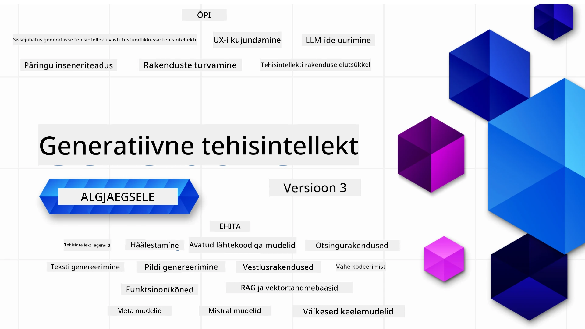

### 21 õppetundi, mis õpetavad kõike, mida on vaja generatiivsete tehisintellekti rakenduste loomiseks

[](https://github.com/microsoft/Generative-AI-For-Beginners/blob/master/LICENSE?WT.mc_id=academic-105485-koreyst)
[](https://GitHub.com/microsoft/Generative-AI-For-Beginners/graphs/contributors/?WT.mc_id=academic-105485-koreyst)
[](https://GitHub.com/microsoft/Generative-AI-For-Beginners/issues/?WT.mc_id=academic-105485-koreyst)
[](https://GitHub.com/microsoft/Generative-AI-For-Beginners/pulls/?WT.mc_id=academic-105485-koreyst)
[](http://makeapullrequest.com?WT.mc_id=academic-105485-koreyst)

[](https://GitHub.com/microsoft/Generative-AI-For-Beginners/watchers/?WT.mc_id=academic-105485-koreyst)
[](https://GitHub.com/microsoft/Generative-AI-For-Beginners/network/?WT.mc_id=academic-105485-koreyst)
[](https://GitHub.com/microsoft/Generative-AI-For-Beginners/stargazers/?WT.mc_id=academic-105485-koreyst)

[](https://discord.gg/nTYy5BXMWG)

### 🌐 Mitmekeelne tugi

#### Toetatud läbi GitHub Actioni (automaatne ja alati uusim)

<!-- CO-OP TRANSLATOR LANGUAGES TABLE START -->
[Araabia](../ar/README.md) | [Bengali](../bn/README.md) | [Bulgaaria](../bg/README.md) | [Burma (Myanmar)](../my/README.md) | [Hiina (lihtsustatud)](../zh-CN/README.md) | [Hiina (traditsiooniline, Hongkong)](../zh-HK/README.md) | [Hiina (traditsiooniline, Macau)](../zh-MO/README.md) | [Hiina (traditsiooniline, Taiwan)](../zh-TW/README.md) | [Horvaadi](../hr/README.md) | [Tšehhi](../cs/README.md) | [Taani](../da/README.md) | [Hollandi](../nl/README.md) | [Eesti](./README.md) | [Soome](../fi/README.md) | [Prantsuse](../fr/README.md) | [Saksa](../de/README.md) | [Kreeka](../el/README.md) | [Heebrea](../he/README.md) | [Hindi](../hi/README.md) | [Ungari](../hu/README.md) | [Indoneesia](../id/README.md) | [Itaalia](../it/README.md) | [Jaapani](../ja/README.md) | [Kannada](../kn/README.md) | [Khmeri](../km/README.md) | [Korea](../ko/README.md) | [Leedu](../lt/README.md) | [Malai](../ms/README.md) | [Malajalami](../ml/README.md) | [Marathi](../mr/README.md) | [Nepali](../ne/README.md) | [Nigeeria pidžin](../pcm/README.md) | [Norra](../no/README.md) | [Pärsia (Farsi)](../fa/README.md) | [Poola](../pl/README.md) | [Portugali (Brasiilia)](../pt-BR/README.md) | [Portugali (Portugal)](../pt-PT/README.md) | [Pandžabi (Gurmukhi)](../pa/README.md) | [Rumeenia](../ro/README.md) | [Vene](../ru/README.md) | [Serbia (kirilitsa)](../sr/README.md) | [Slovaki](../sk/README.md) | [Sloveeni](../sl/README.md) | [Hispaania](../es/README.md) | [Suaheli](../sw/README.md) | [Rootsi](../sv/README.md) | [Tagalogi (Filipino)](../tl/README.md) | [Tamili](../ta/README.md) | [Telugu](../te/README.md) | [Tai](../th/README.md) | [Türgi](../tr/README.md) | [Ukraina](../uk/README.md) | [Urdu](../ur/README.md) | [Vietnami](../vi/README.md)

> **Eelistad kloonida lokaalselt?**
>
> See hoidla sisaldab üle 50 keele tõlkeid, mis suurendab oluliselt allalaaditavat mahtu. Kui soovid kloneerida ilma tõlgeteta, kasuta sparse checkouti:
>
> **Bash / macOS / Linux:**
> ```bash
> git clone --filter=blob:none --sparse https://github.com/microsoft/generative-ai-for-beginners.git
> cd generative-ai-for-beginners
> git sparse-checkout set --no-cone '/*' '!translations' '!translated_images'
> ```
>
> **CMD (Windows):**
> ```cmd
> git clone --filter=blob:none --sparse https://github.com/microsoft/generative-ai-for-beginners.git
> cd generative-ai-for-beginners
> git sparse-checkout set --no-cone "/*" "!translations" "!translated_images"
> ```
>
> See annab sulle kõik vajaliku kursuse läbimiseks palju kiiremalt.
<!-- CO-OP TRANSLATOR LANGUAGES TABLE END -->

# Generatiivne tehisintellekt algajatele (versioon 3) - kursus

Õpi generatiivsete tehisintellekti rakenduste loomise aluseid meie Microsoft Cloud Advocatesi 21-õppetunniga põhjalikus kursuses.

## 🌱 Alustamine

Selles kursuses on 21 õppetundi. Iga õppetund käsitleb oma teemat, alusta sealt, kus soovid!

Õppetunnid on märgistatud kas "Õpi" õppetundidena, mis selgitavad generatiivse AI kontseptsiooni või "Loo" õppetundidena, mis seletavad kontseptsiooni ja annavad koodinäiteid nii **Pythonis** kui ka **TypeScriptis**, kui võimalik.

.NET arendajatele soovitame vaadata [Generatiivne AI algajatele (.NET väljaanne)](https://github.com/microsoft/Generative-AI-for-beginners-dotnet?WT.mc_id=academic-105485-koreyst)!

Iga õppetunni juures on samuti "Jätka õppimist" sektsioon täiendavate õppematerjalidega.

## Mida vajad
### Selle kursuse koodi jooksutamiseks võid kasutada:
 - [Azure OpenAI teenust](https://aka.ms/genai-beginners/azure-open-ai?WT.mc_id=academic-105485-koreyst) - **Õppetunnid:** "aoai-assignment"
 - [GitHub Marketplace mudeliladu](https://aka.ms/genai-beginners/gh-models?WT.mc_id=academic-105485-koreyst) - **Õppetunnid:** "githubmodels"
 - [OpenAI API](https://aka.ms/genai-beginners/open-ai?WT.mc_id=academic-105485-koreyst) - **Õppetunnid:** "oai-assignment"
   
- Põhitõed Python või TypeScripti osas on kasulikud - \*Täielikele algajatele soovitame neid [Python](https://aka.ms/genai-beginners/python?WT.mc_id=academic-105485-koreyst) ja [TypeScripti](https://aka.ms/genai-beginners/typescript?WT.mc_id=academic-105485-koreyst) kursuseid
- GitHubi konto, et [forkida see kogu hoidla](https://aka.ms/genai-beginners/github?WT.mc_id=academic-105485-koreyst) omaenda GitHubi kontole

Olemegi loonud **[Kursuse seadistamise](./00-course-setup/README.md?WT.mc_id=academic-105485-koreyst)** õppetunni, mis aitab sul arenduskeskkonna üles seada.

Ära unusta sellele hoidla [tähte (🌟) lisada](https://docs.github.com/en/get-started/exploring-projects-on-github/saving-repositories-with-stars?WT.mc_id=academic-105485-koreyst), et Hiljem oleks seda lihtsam leida.

## 🧠 Valmis juurutamiseks?

Kui otsid keerukamaid koodinäiteid, vaata meie [generatiivse AI koodinäidiste kogu](https://aka.ms/genai-beg-code?WT.mc_id=academic-105485-koreyst) nii **Pythonis** kui ka **TypeScriptis**.

## 🗣️ Tutvu teiste õppijatega, saa tuge

Liitu meie [ametliku Azure AI Foundry Discord serveriga](https://aka.ms/genai-discord?WT.mc_id=academic-105485-koreyst), et kohtuda ja suhelda teiste kursust läbivate õppijatega ja saada tuge.

Esita küsimusi või jaga tagasisidet toote kohta meie [Azure AI Foundry arendajate foorumis](https://aka.ms/azureaifoundry/forum) GitHubis.

## 🚀 Startapi ehitamine?

Külasta [Microsoft for Startups](https://www.microsoft.com/startups), et teada saada, kuidas alustada Azure krediitidega arendamist juba täna.

## 🙏 Tahad aidata?

Kas sul on ettepanekuid või oled leidnud kirjavigu või koodivigu? [Esita probleem](https://github.com/microsoft/generative-ai-for-beginners/issues?WT.mc_id=academic-105485-koreyst) või [loo tõmbepäring](https://github.com/microsoft/generative-ai-for-beginners/pulls?WT.mc_id=academic-105485-koreyst)

## 📂 Igas õppetunnis on:

- Lühike video sissejuhatus teemasse
- Kirjalik õppetund README failis
- Python ja TypeScripti koodinäited, mis toetavad Azure OpenAI ja OpenAI API-t
- Lingid täiendavatele ressurssidele, et oma õpinguid jätkata

## 🗃️ Õppetunnid

| #   | **Õppetunni link**                                                                                                                              | **Kirjeldus**                                                                                 | **Video**                                                                   | **Lisalugemine**                                                             |
| --- | ----------------------------------------------------------------------------------------------------------------------------------------------- | -------------------------------------------------------------------------------------------- | --------------------------------------------------------------------------- | --------------------------------------------------------------------------- |
| 00  | [Kursuse seadistamine](./00-course-setup/README.md?WT.mc_id=academic-105485-koreyst)                                                             | **Õpi:** Kuidas arenduskeskkond üles seada                                                  | Video varsti tulekul                                                        | [Loe rohkem](https://aka.ms/genai-collection?WT.mc_id=academic-105485-koreyst) |
| 01  | [Sissejuhatus generatiivsesse AI-sse ja LLM-idesse](./01-introduction-to-genai/README.md?WT.mc_id=academic-105485-koreyst)                        | **Õpi:** Mõista, mis on generatiivne AI ja kuidas suured keelemudelid (LLM-id) töötavad      | [Video](https://aka.ms/gen-ai-lesson-1-gh?WT.mc_id=academic-105485-koreyst) | [Loe rohkem](https://aka.ms/genai-collection?WT.mc_id=academic-105485-koreyst) |
| 02  | [Erinevate LLM-ide uurimine ja võrdlemine](./02-exploring-and-comparing-different-llms/README.md?WT.mc_id=academic-105485-koreyst)                | **Õpi:** Kuidas valida sobiv mudel oma kasutusjuhtumi jaoks                               | [Video](https://aka.ms/gen-ai-lesson2-gh?WT.mc_id=academic-105485-koreyst)  | [Loe rohkem](https://aka.ms/genai-collection?WT.mc_id=academic-105485-koreyst) |
| 03  | [Kuidas kasutada generatiivset AI-d vastutustundlikult](./03-using-generative-ai-responsibly/README.md?WT.mc_id=academic-105485-koreyst)             | **Õpi:** Kuidas ehitada generatiivseid AI rakendusi vastutustundlikult                        | [Video](https://aka.ms/gen-ai-lesson3-gh?WT.mc_id=academic-105485-koreyst)  | [Loe rohkem](https://aka.ms/genai-collection?WT.mc_id=academic-105485-koreyst) |
| 04  | [Arusaamine tekstikäskluse inseneritöö põhialustest](./04-prompt-engineering-fundamentals/README.md?WT.mc_id=academic-105485-koreyst)             | **Õpi:** Tekstikäskluse inseneritöö parimad praktikad                                         | [Video](https://aka.ms/gen-ai-lesson4-gh?WT.mc_id=academic-105485-koreyst)  | [Loe lähemalt](https://aka.ms/genai-collection?WT.mc_id=academic-105485-koreyst) |
| 05  | [Arendatud tekstikäskluste loomine](./05-advanced-prompts/README.md?WT.mc_id=academic-105485-koreyst)                                                | **Õpi:** Kuidas rakendada tekstikäskluse inseneritöö tehnikaid, mis parandavad tekstikäskluste tulemusi. | [Video](https://aka.ms/gen-ai-lesson5-gh?WT.mc_id=academic-105485-koreyst)  | [Loe lähemalt](https://aka.ms/genai-collection?WT.mc_id=academic-105485-koreyst) |
| 06  | [Teksti genereerimise rakenduste loomine](./06-text-generation-apps/README.md?WT.mc_id=academic-105485-koreyst)                                | **Loo:** Tekstigeneratsiooni rakendus kasutades Azure OpenAI / OpenAI API-d                   | [Video](https://aka.ms/gen-ai-lesson6-gh?WT.mc_id=academic-105485-koreyst)  | [Loe lähemalt](https://aka.ms/genai-collection?WT.mc_id=academic-105485-koreyst) |
| 07  | [Vestlusrakenduste loomine](./07-building-chat-applications/README.md?WT.mc_id=academic-105485-koreyst)                                     | **Loo:** Tõhusad tehnoloogiad vestlusrakenduste ehitamiseks ja integreerimiseks.              | [Video](https://aka.ms/gen-ai-lessons7-gh?WT.mc_id=academic-105485-koreyst) | [Loe lähemalt](https://aka.ms/genai-collection?WT.mc_id=academic-105485-koreyst) |
| 08  | [Otsingurakenduste ja vektorandmebaaside loomine](./08-building-search-applications/README.md?WT.mc_id=academic-105485-koreyst)               | **Loo:** Otsingurakendus, mis kasutab manuseid andmete otsimiseks.                            | [Video](https://aka.ms/gen-ai-lesson8-gh?WT.mc_id=academic-105485-koreyst)  | [Loe lähemalt](https://aka.ms/genai-collection?WT.mc_id=academic-105485-koreyst) |
| 09  | [Pildigeneratsiooni rakenduste loomine](./09-building-image-applications/README.md?WT.mc_id=academic-105485-koreyst)                        | **Loo:** Pildigeneratsiooni rakendus                                                    | [Video](https://aka.ms/gen-ai-lesson9-gh?WT.mc_id=academic-105485-koreyst)  | [Loe lähemalt](https://aka.ms/genai-collection?WT.mc_id=academic-105485-koreyst) |
| 10  | [Madalakoodiliste tehisintellekti rakenduste loomine](./10-building-low-code-ai-applications/README.md?WT.mc_id=academic-105485-koreyst)       | **Loo:** Generatiivse tehisintellekti rakendus, kasutades madalakoodilisi tööriistu          | [Video](https://aka.ms/gen-ai-lesson10-gh?WT.mc_id=academic-105485-koreyst) | [Loe lähemalt](https://aka.ms/genai-collection?WT.mc_id=academic-105485-koreyst) |
| 11  | [Väliste rakenduste integreerimine funktsioonikõnede abil](./11-integrating-with-function-calling/README.md?WT.mc_id=academic-105485-koreyst)  | **Loo:** Mis on funktsioonikõne ja kuidas seda rakendustes kasutada                         | [Video](https://aka.ms/gen-ai-lesson11-gh?WT.mc_id=academic-105485-koreyst) | [Loe lähemalt](https://aka.ms/genai-collection?WT.mc_id=academic-105485-koreyst) |
| 12  | [Kasutajakogemuse disain tehisintellektrakendustes](./12-designing-ux-for-ai-applications/README.md?WT.mc_id=academic-105485-koreyst)         | **Õpi:** Kuidas rakendada kasutajakogemuse disaini põhimõtteid generatiivsete tehisintellektrakenduste arendamisel | [Video](https://aka.ms/gen-ai-lesson12-gh?WT.mc_id=academic-105485-koreyst) | [Loe lähemalt](https://aka.ms/genai-collection?WT.mc_id=academic-105485-koreyst) |
| 13  | [Sinu generatiivsete tehisintellektrakenduste turvamine](./13-securing-ai-applications/README.md?WT.mc_id=academic-105485-koreyst)             | **Õpi:** Tehisintellektisüsteemide ohud ja riskid ning meetodid nende turvamiseks.           | [Video](https://aka.ms/gen-ai-lesson13-gh?WT.mc_id=academic-105485-koreyst) | [Loe lähemalt](https://aka.ms/genai-collection?WT.mc_id=academic-105485-koreyst) |
| 14  | [Generatiivse tehisintellektrakenduse elutsükkel](./14-the-generative-ai-application-lifecycle/README.md?WT.mc_id=academic-105485-koreyst)     | **Õpi:** Tööriistad ja mõõdikud suurkeelemudelite elutsükli ja LLMOps haldamiseks            | [Video](https://aka.ms/gen-ai-lesson14-gh?WT.mc_id=academic-105485-koreyst) | [Loe lähemalt](https://aka.ms/genai-collection?WT.mc_id=academic-105485-koreyst) |
| 15  | [Päringu-põhine genereerimine (RAG) ja vektorandmebaasid](./15-rag-and-vector-databases/README.md?WT.mc_id=academic-105485-koreyst)           | **Loo:** Rakendus, mis kasutab RAG raamistiku manuste pärimiseks vektorandmebaasidest       | [Video](https://aka.ms/gen-ai-lesson15-gh?WT.mc_id=academic-105485-koreyst) | [Loe lähemalt](https://aka.ms/genai-collection?WT.mc_id=academic-105485-koreyst) |
| 16  | [Avatud lähtekoodiga mudelid ja Hugging Face](./16-open-source-models/README.md?WT.mc_id=academic-105485-koreyst)                            | **Loo:** Rakendus, mis kasutab Hugging Face’i avatud lähtekoodiga mudeleid                 | [Video](https://aka.ms/gen-ai-lesson16-gh?WT.mc_id=academic-105485-koreyst) | [Loe lähemalt](https://aka.ms/genai-collection?WT.mc_id=academic-105485-koreyst) |
| 17  | [Tehisintellekti agendid](./17-ai-agents/README.md?WT.mc_id=academic-105485-koreyst)                                                         | **Loo:** Rakendus, mis kasutab tehisintellekti agentide raamistikku                        | [Video](https://aka.ms/gen-ai-lesson17-gh?WT.mc_id=academic-105485-koreyst) | [Loe lähemalt](https://aka.ms/genai-collection?WT.mc_id=academic-105485-koreyst) |
| 18  | [Suurkeelemudelite täpsustamine](./18-fine-tuning/README.md?WT.mc_id=academic-105485-koreyst)                                                | **Õpi:** Mis, miks ja kuidas suurkeelemudeleid täpsustada                                  | [Video](https://aka.ms/gen-ai-lesson18-gh?WT.mc_id=academic-105485-koreyst) | [Loe lähemalt](https://aka.ms/genai-collection?WT.mc_id=academic-105485-koreyst) |
| 19  | [Väikeste keelemudelitega ehitamine](./19-slm/README.md?WT.mc_id=academic-105485-koreyst)                                                  | **Õpi:** Väikeste keelemudelitega ehitamise eelised                                        | Video Tulekul | [Loe lähemalt](https://aka.ms/genai-collection?WT.mc_id=academic-105485-koreyst) |
| 20  | [Mistral-mudelitega ehitamine](./20-mistral/README.md?WT.mc_id=academic-105485-koreyst)                                                    | **Õpi:** Mistral-pere mudelite omadused ja erinevused                                     | Video Tulekul | [Loe lähemalt](https://aka.ms/genai-collection?WT.mc_id=academic-105485-koreyst) |
| 21  | [Meta-mudelitega ehitamine](./21-meta/README.md?WT.mc_id=academic-105485-koreyst)                                                          | **Õpi:** Meta-pere mudelite omadused ja erinevused                                       | Video Tulekul | [Loe lähemalt](https://aka.ms/genai-collection?WT.mc_id=academic-105485-koreyst) |

### 🌟 Eriti suur tänu

Suur tänu [**John Azizile**](https://www.linkedin.com/in/john0isaac/), kes lõi kõik GitHub Actions ja töölõigud.

[**Bernhard Merkle'ile**](https://www.linkedin.com/in/bernhard-merkle-738b73/) oluliste panuste eest iga õppetunni juures, et parandada õppija kogemust ja koodi.

## 🎒 Teised kursused

Meie meeskond toodab ka teisi kursuseid! Vaata:

<!-- CO-OP TRANSLATOR OTHER COURSES START -->
### LangChain
[](https://aka.ms/langchain4j-for-beginners)
[](https://aka.ms/langchainjs-for-beginners?WT.mc_id=m365-94501-dwahlin)
[](https://github.com/microsoft/langchain-for-beginners?WT.mc_id=m365-94501-dwahlin)
---

### Azure / Edge / MCP / Agendid
[](https://github.com/microsoft/AZD-for-beginners?WT.mc_id=academic-105485-koreyst)
[](https://github.com/microsoft/edgeai-for-beginners?WT.mc_id=academic-105485-koreyst)
[](https://github.com/microsoft/mcp-for-beginners?WT.mc_id=academic-105485-koreyst)
[](https://github.com/microsoft/ai-agents-for-beginners?WT.mc_id=academic-105485-koreyst)

---
 
### Generatiivse AI seeria
[](https://github.com/microsoft/generative-ai-for-beginners?WT.mc_id=academic-105485-koreyst)
[-9333EA?style=for-the-badge&labelColor=E5E7EB&color=9333EA)](https://github.com/microsoft/Generative-AI-for-beginners-dotnet?WT.mc_id=academic-105485-koreyst)
[-C084FC?style=for-the-badge&labelColor=E5E7EB&color=C084FC)](https://github.com/microsoft/generative-ai-for-beginners-java?WT.mc_id=academic-105485-koreyst)
[-E879F9?style=for-the-badge&labelColor=E5E7EB&color=E879F9)](https://github.com/microsoft/generative-ai-with-javascript?WT.mc_id=academic-105485-koreyst)

---
 
### Põhiteadmised
[](https://aka.ms/ml-beginners?WT.mc_id=academic-105485-koreyst)
[](https://aka.ms/datascience-beginners?WT.mc_id=academic-105485-koreyst)
[](https://aka.ms/ai-beginners?WT.mc_id=academic-105485-koreyst)
[](https://github.com/microsoft/Security-101?WT.mc_id=academic-96948-sayoung)
[](https://aka.ms/webdev-beginners?WT.mc_id=academic-105485-koreyst)
[](https://aka.ms/iot-beginners?WT.mc_id=academic-105485-koreyst)
[](https://github.com/microsoft/xr-development-for-beginners?WT.mc_id=academic-105485-koreyst)

---
 
### Copiloti sari
[](https://aka.ms/GitHubCopilotAI?WT.mc_id=academic-105485-koreyst)
[](https://github.com/microsoft/mastering-github-copilot-for-dotnet-csharp-developers?WT.mc_id=academic-105485-koreyst)
[](https://github.com/microsoft/CopilotAdventures?WT.mc_id=academic-105485-koreyst)
<!-- CO-OP TRANSLATOR OTHER COURSES END -->

## Abi saamine

Kui jääd hätta või sul on küsimusi tehisintellekti rakenduste loomise kohta, ühine teiste õppijate ja kogenud arendajatega MCP aruteludes. See on toetav kogukond, kus küsimusi võib esitada ja teadmisi vabalt jagada.

[](https://discord.gg/nTYy5BXMWG)

Kui sul on tooteressursi tagasisidet või leiad vigu arendamise ajal, külastage:

[](https://aka.ms/foundry/forum)

---

<!-- CO-OP TRANSLATOR DISCLAIMER START -->
**Vastutusest loobumine**:  
See dokument on tõlgitud kasutades tehisintellektil põhinevat tõlketeenust [Co-op Translator](https://github.com/Azure/co-op-translator). Kuigi me püüame tagada täpsust, palun arvestage, et automatiseeritud tõlgetes võib esineda vigu või ebatäpsusi. Originaaldokument oma emakeeles tuleks pidada autoriteetseks allikaks. Kriitilise teabe puhul soovitatakse kasutada professionaalset inimtõlget. Me ei vastuta selle tõlkega seotud arusaamatuste või valesti mõistmiste eest.
<!-- CO-OP TRANSLATOR DISCLAIMER END -->