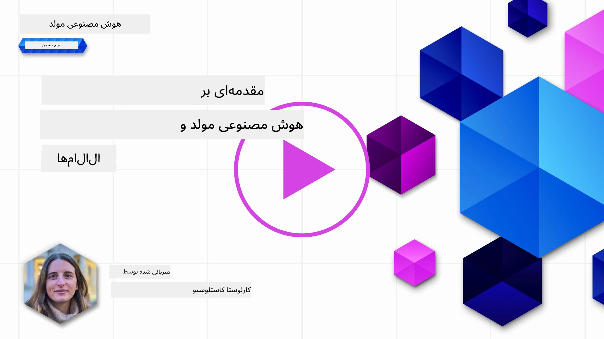
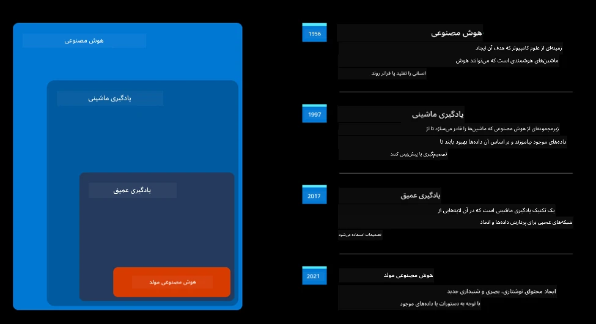
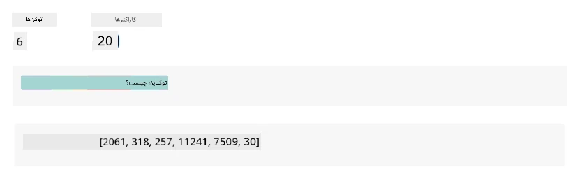
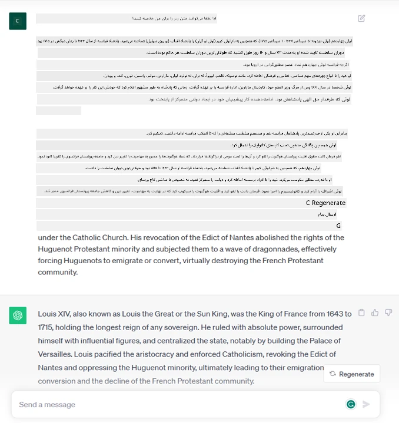
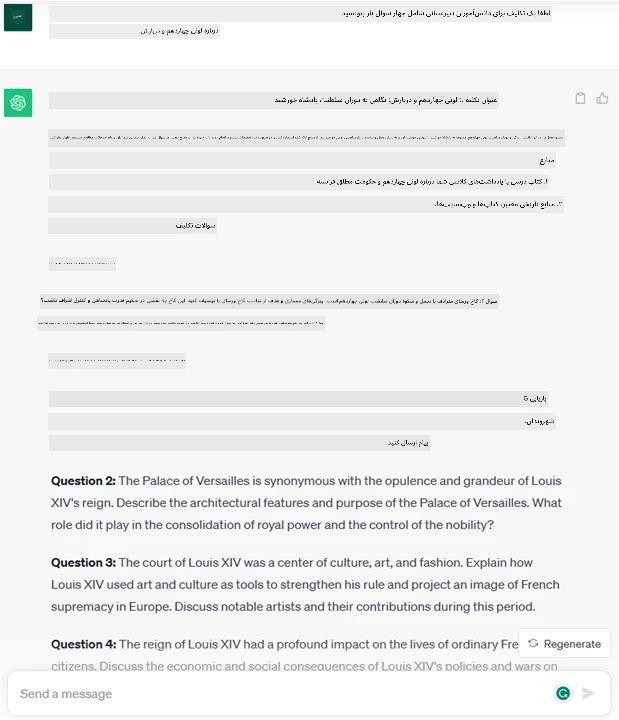
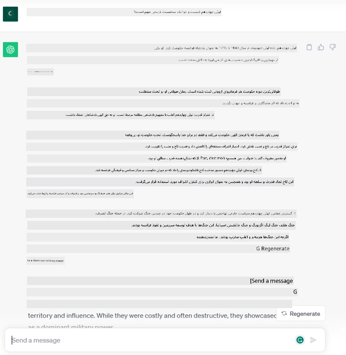
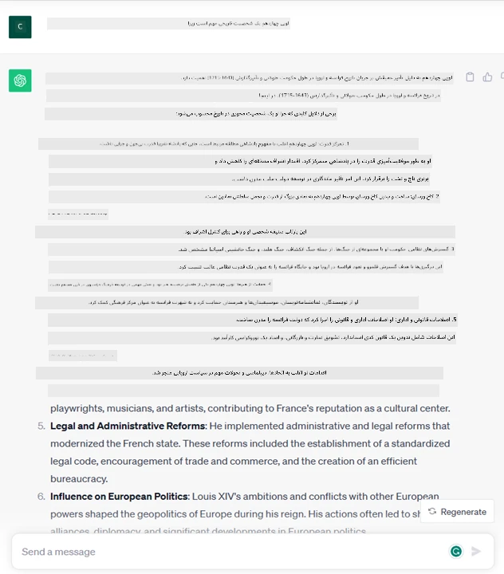
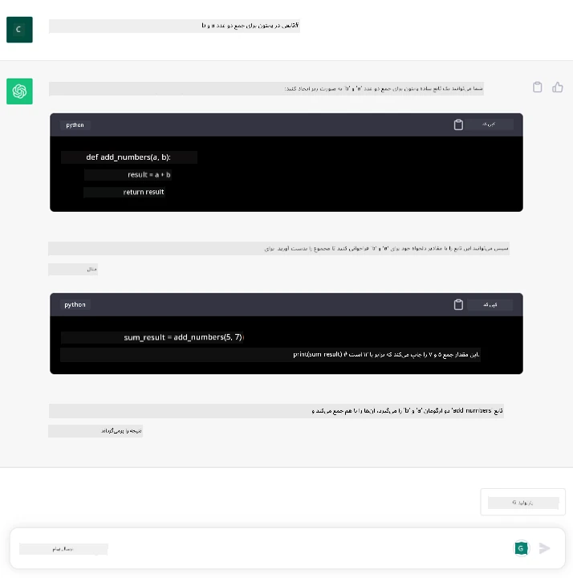

# مقدمه‌ای بر هوش مصنوعی مولد و مدل‌های زبان بزرگ

_(برای دیدن ویدئوی این درس روی تصویر بالا کلیک کنید)_

هوش مصنوعی مولد هوش مصنوعی‌ای است که قادر به تولید متن، تصویر و انواع دیگر محتوا است. چیزی که این فناوری را شگفت‌انگیز می‌کند این است که هوش مصنوعی را برای همه قابل دسترس می‌کند؛ هر کسی می‌تواند فقط با ارسال یک پیام متنی، یک جمله به زبان طبیعی، از آن استفاده کند. نیازی نیست زبان‌هایی مانند جاوا یا SQL را یاد بگیرید تا کاری ارزشمند انجام دهید، تنها کافی است زبان خود را به کار گیرید، بگویید چه می‌خواهید و یک پیشنهاد از مدل هوش مصنوعی دریافت کنید. کاربردها و تأثیرات این فناوری بسیار گسترده است، شما می‌توانید گزارش بنویسید یا بفهمید، برنامه‌های کاربردی بنویسید و خیلی بیشتر، همه فقط در چند ثانیه.

در این برنامه آموزشی، ما بررسی خواهیم کرد که چگونه استارتاپ ما از هوش مصنوعی مولد برای بازکردن سناریوهای جدید در دنیای آموزش بهره می‌برد و چگونه با چالش‌های اجتناب‌ناپذیر مرتبط با پیامدهای اجتماعی استفاده از آن و محدودیت‌های فناوری مقابله می‌کنیم.

## مقدمه

این درس شامل موارد زیر خواهد بود:

- معرفی سناریوی کسب‌وکار: ایده و مأموریت استارتاپ ما.
- هوش مصنوعی مولد و نحوه رسیدن ما به چشم‌انداز فناوری کنونی.
- عملکرد داخلی یک مدل زبان بزرگ.
- قابلیت‌های اصلی و موارد کاربرد عملی مدل‌های زبان بزرگ.

## اهداف آموزشی

پس از اتمام این درس، شما درک خواهید داشت از:

- ماهیت هوش مصنوعی مولد و نحوه عملکرد مدل‌های زبان بزرگ.
- چگونگی بهره‌برداری از مدل‌های زبان بزرگ برای کاربردهای مختلف، با تمرکز بر سناریوهای آموزشی.

## سناریو: استارتاپ آموزشی ما

هوش مصنوعی مولد نمایانگر اوج فناوری هوش مصنوعی است که مرزهای آنچه زمانی غیرممکن تصور می‌شد را جابه‌جا کرده است. مدل‌های هوش مصنوعی مولد دارای قابلیت‌ها و کاربردهای متعددی هستند، اما در این برنامه آموزشی ما بررسی خواهیم کرد که چگونه این فناوری آموزش را دگرگون می‌کند از طریق یک استارتاپ داستانی. ما این استارتاپ را _استارتاپ ما_ نام خواهیم گذاشت. استارتاپ ما در حوزه آموزش فعالیت می‌کند با بیانیه مأموریتی بلندپروازانه:

> _افزایش دسترسی به یادگیری در مقیاسی جهانی، تضمین دسترسی عادلانه به آموزش و فراهم کردن تجربیات یادگیری شخصی‌سازی شده برای هر یادگیرنده، متناسب با نیازهایش_.

تیم استارتاپ ما می‌داند که بدون بهره گرفتن از یکی از قدرتمندترین ابزارهای زمانه – مدل‌های زبان بزرگ (LLM) – رسیدن به این هدف امکان‌پذیر نیست.

پیش‌بینی می‌شود هوش مصنوعی مولد نحوه یادگیری و آموزش امروزی را دگرگون کند، با در دسترس بودن معلمان مجازی برای دانش‌آموزان به صورت ۲۴ ساعته که حجم زیادی از اطلاعات و مثال‌ها را ارائه می‌دهند، و معلمان نیز قادر خواهند بود از ابزارهای نوآورانه برای ارزیابی دانش‌آموزانشان و ارائه بازخورد استفاده کنند.

برای شروع، اجازه دهید برخی مفاهیم و اصطلاحات پایه را که در سرتاسر برنامه آموزشی استفاده خواهیم کرد تعریف کنیم.

## چگونه به هوش مصنوعی مولد رسیدیم؟

با وجود هیجان فوق‌العاده‌ای که اخیراً با اعلام مدل‌های هوش مصنوعی مولد ایجاد شده است، این فناوری دهه‌ها سابقه دارد و اولین تلاش‌های پژوهشی به دهه ۶۰ میلادی بازمی‌گردد. امروزه ما به نقطه‌ای رسیده‌ایم که هوش مصنوعی دارای توانایی‌های شناختی انسانی مانند گفتگو است، همان‌طور که برای نمونه [OpenAI ChatGPT](https://openai.com/chatgpt) یا [Microsoft Copilot](https://copilot.microsoft.com/?WT.mc_id=academic-105485-koreyst) نشان داده‌اند؛ این‌ها همچنین از مدل GPT برای تجربه جستجوی مکالمه‌ای وب استفاده می‌کنند.

کمی برمی‌گردیم به عقب، نخستین نمونه‌های اولیه هوش مصنوعی شامل چت‌بات‌هایی بودند که به صورت تایپی ساخته شده بودند، مبتنی بر یک پایگاه دانش استخراج شده از گروهی از کارشناسان و نمایانده شده در کامپیوتر. پاسخ‌ها در پایگاه دانش با کلمات کلیدی موجود در متن ورودی تحریک می‌شدند.
با این حال، به زودی مشخص شد که چنین رویکردی، استفاده از چت‌بات‌های تایپی، به خوبی مقیاس‌پذیر نیست.

### رویکرد آماری به هوش مصنوعی: یادگیری ماشین

نقطه عطفی در دهه ۹۰ پیش آمد با به کارگیری رویکرد آماری در تحلیل متن. این منجر به توسعه الگوریتم‌های جدیدی به نام یادگیری ماشین شد که قادر به یادگیری الگوها از داده‌ها بدون برنامه‌نویسی صریح هستند. این رویکرد به ماشین‌ها اجازه می‌دهد تا درک زبان انسان را شبیه‌سازی کنند: مدل آماری بر اساس جفت‌های متن-برچسب آموزش می‌بیند و این امکان را می‌دهد که متن ورودی ناشناخته را با برچسبی از پیش تعیین شده، که نمایانگر نیت پیام است، طبقه‌بندی کند.

### شبکه‌های عصبی و دستیاران مجازی مدرن

در سال‌های اخیر، پیشرفت فناوری سخت‌افزار که می‌تواند مقادیر بیشتری از داده‌ها و محاسبات پیچیده‌تر را پردازش کند، پژوهش در حوزه هوش مصنوعی را تشویق کرده و منجر به توسعه الگوریتم‌های پیشرفته یادگیری ماشین به‌نام شبکه‌های عصبی یا الگوریتم‌های یادگیری عمیق شده است.

شبکه‌های عصبی (به ویژه شبکه‌های عصبی بازگشتی – RNN‌ها) به طور چشمگیری پردازش زبان طبیعی را بهبود بخشیده‌اند، به طوری که معنای متن را به طور معنادارتری بازنمایی می‌کنند و اهمیت زمینه یک کلمه در جمله را می‌سنجند.

این فناوری است که دستیاران مجازی متولد شده در دهه اول قرن جدید را توانمند کرده، که بسیار ماهر در تفسیر زبان انسانی، شناسایی نیاز و انجام عملی برای رفع آن هستند – مانند پاسخ دادن با یک اسکریپت از پیش تعریف‌شده یا استفاده از سرویس‌های شخص ثالث.

### عصر حاضر، هوش مصنوعی مولد

بنابراین، این است نحوه رسیدن ما به هوش مصنوعی مولد امروزی، که می‌توان آن را زیرمجموعه‌ای از یادگیری عمیق دانست.

پس از دهه‌ها پژوهش در زمینه هوش مصنوعی، یک معماری مدل جدید به نام _ترنسفورمر_ توانست محدودیت‌های RNN‌ها را پشت سر بگذارد، به گونه‌ای که قادر به دریافت توالی‌های طولانی‌تری از متن به عنوان ورودی است. ترنسفورمرها بر اساس مکانیزم توجه ساخته شده‌اند، که امکان می‌دهد مدل به ورودی‌های دریافتی وزن‌های متفاوتی بدهد و «توجه بیشتری» به جایی بکند که اطلاعات مهم‌تر متمرکز شده‌اند، فارغ از ترتیب آن‌ها در توالی متن.

بیشتر مدل‌های هوش مصنوعی مولد اخیر – که به نام مدل‌های زبان بزرگ (LLM) نیز شناخته می‌شوند، چون با ورودی‌ها و خروجی‌های متنی کار می‌کنند – در واقع بر اساس این معماری ساخته شده‌اند. نکته جالب درباره این مدل‌ها که روی مقدار زیادی داده بی‌برچسب از منابع مختلف مانند کتاب‌ها، مقالات و وب‌سایت‌ها آموزش دیده‌اند، این است که قادرند به طیف گسترده‌ای از وظایف تطبیق پیدا کنند و متنی گرامری صحیح و تا حدی خلاقانه تولید کنند. بنابراین، نه تنها ظرفیت ماشین برای «درک» متن ورودی به شکل شگفت‌انگیزی افزایش یافته، بلکه توانایی آن‌ها برای تولید پاسخ اصیل به زبان انسانی نیز ممکن شده است.

## مدل‌های زبان بزرگ چطور کار می‌کنند؟

در فصل بعدی انواع مختلف مدل‌های هوش مصنوعی مولد را بررسی خواهیم کرد، اما فعلاً بیایید نگاه کنیم که مدل‌های زبان بزرگ چگونه کار می‌کنند، به ویژه با تمرکز بر مدل‌های OpenAI GPT (ترنسفورمر آموزش‌دیده مولد).

- **توکن‌ساز، تبدیل متن به عدد**: مدل‌های زبان بزرگ متنی را به عنوان ورودی دریافت و متنی را به عنوان خروجی تولید می‌کنند. اما چون مدل‌های آماری هستند، با اعداد بهتر از توالی‌های متنی کار می‌کنند. به همین دلیل هر ورودی توسط توکن‌ساز پردازش می‌شود، قبل از اینکه به مدل اصلی داده شود. توکن، بخش کوچکی از متن است – که شامل تعداد متغیری از کاراکترهاست، بنابراین وظیفه اصلی توکن‌ساز تقسیم ورودی به آرایه‌ای از توکن‌هاست. سپس هر توکن با یک شاخص توکن – که کدگذاری عددی آن بخش متن اصلی است – نگاشت می‌شود.

- **پیش‌بینی توکن‌های خروجی**: داده شده n توکن به عنوان ورودی (که حداکثر n از مدلی به مدل دیگر متفاوت است)، مدل قادر است یک توکن را به عنوان خروجی پیش‌بینی کند. سپس این توکن وارد ورودی مرحله بعدی می‌شود، در الگوی پنجره فزاینده، که تجربه بهتری از دریافت یک یا چند جمله به عنوان پاسخ ایجاد می‌کند. این توضیح می‌دهد چرا اگر با ChatGPT بازی کرده باشید، گاهی به نظر می‌رسد وسط جمله کارش را متوقف می‌کند.

- **فرایند انتخاب، توزیع احتمال**: توکن خروجی توسط مدل بر اساس احتمال وقوع آن پس از توالی متن فعلی انتخاب می‌شود. زیرا مدل توزیع احتمال را روی همه «توکن‌های بعدی» ممکن پیش‌بینی می‌کند، که بر اساس آموزش آن محاسبه شده است. اما همیشه توکنی که بالاترین احتمال را دارد، از توزیع نهایی انتخاب نمی‌شود. مقداری تصادفی بودن به این انتخاب اضافه می‌شود، به طوری که مدل به شکل غیرقطعی عمل می‌کند - ما برای همان ورودی همیشه خروجی یکسان نمی‌گیریم. این میزان تصادفی بودن به منظور شبیه‌سازی فرایند تفکر خلاق افزوده می‌شود و می‌توان آن را با پارامتری به نام دما (temperature) در مدل تنظیم کرد.

## چگونه استارتاپ ما می‌تواند از مدل‌های زبان بزرگ بهره ببرد؟

حال که درک بهتری از عملکرد درونی مدل زبان بزرگ داریم، بیایید چند مثال عملی از کارهای رایجی که این مدل‌ها به خوبی انجام می‌دهند را با نگاه به سناریوی کسب‌وکارمان ببینیم.
گفتیم که قابلیت اصلی یک مدل زبان بزرگ، _تولید متن از صفر، شروع از ورودی متنی به زبان طبیعی است_.

اما چه نوع ورودی و خروجی متنی؟
ورودی مدل زبان بزرگ به عنوان «پرامپت» شناخته می‌شود، در حالی که خروجی به عنوان «تکمیل» نامیده می‌شود، اصطلاحی که به مکانیزم مدل برای تولید توکن بعدی برای کامل کردن ورودی فعلی اشاره دارد. ما عمیق‌تر به معنای پرامپت و نحوه طراحی آن به گونه‌ای که بیشترین بهره را از مدل ببریم، خواهیم پرداخت. اما فعلاً بگوییم که پرامپت می‌تواند شامل موارد زیر باشد:

- یک **دستورالعمل** که نوع خروجی مورد انتظار از مدل را مشخص می‌کند. این دستور گاهی ممکن است شامل چند مثال یا داده اضافی باشد.

  1. خلاصه‌سازی مقاله، کتاب، نقد و بررسی محصول و بیشتر، همراه با استخراج بینش‌ها از داده‌های بدون ساختار.
    
    
  
  2. ایده‌پردازی خلاقانه و طراحی مقاله، انشاء، تکلیف یا بیشتر.
      
     

- یک **سوال** به صورت مکالمه با یک عامل (نماینده).
  
  

- بخشی از **متن برای تکمیل** که به طور ضمنی درخواست کمک برای نوشتن است.
  
  

- قسمتی از **کد** همراه با درخواست توضیح و مستندسازی آن، یا نظری که درخواست می‌کند قطعه‌ای کد بنویسد که وظیفه خاصی را انجام می‌دهد.
  
  

مثال‌های بالا ساده هستند و هدفشان نشان دادن کامل قابلیت‌های مدل‌های زبان بزرگ نیست. بلکه هدف نمایش پتانسیل استفاده از هوش مصنوعی مولد، به ویژه در زمینه‌های آموزشی، اما نه محدود به آن است.

همچنین، خروجی مدل هوش مصنوعی مولد کامل نیست و گاهی خلاقیت مدل ممکن است به ضد خودش تبدیل شود و خروجی‌ای داشته باشد که کاربر انسانی آن را به عنوان تحریف واقعیت تفسیر کند یا ممکن است توهین‌آمیز باشد. هوش مصنوعی مولد هوشمند نیست – حداقل در تعریف جامع‌تری از هوش که شامل تفکر نقادانه، خلاقانه یا هوش هیجانی است؛ غیرقطعی است و قابل اعتماد نیست، چون ممکن است ساختگی‌هایی مانند ارجاعات نادرست، محتوا و گزاره‌هایی همراه با اطلاعات صحیح ترکیب شده و به روشی قانع‌کننده و با اعتماد به نفس ارائه شوند. در درس‌های آینده به همه این محدودیت‌ها خواهیم پرداخت و می‌بینیم چه کارهایی می‌توانیم برای کاهش آن‌ها انجام دهیم.

## تمرین

تمرین شما این است که بیشتر درباره [هوش مصنوعی مولد](https://en.wikipedia.org/wiki/Generative_artificial_intelligence?WT.mc_id=academic-105485-koreyst) مطالعه کنید و سعی کنید زمینه‌ای را شناسایی کنید که امروز فاقد هوش مصنوعی مولد است و شما می‌خواهید آن را اضافه کنید. تأثیر آن نسبت به روش «قدیمی» چگونه متفاوت خواهد بود؟ آیا می‌توانید کاری انجام دهید که قبلاً نمی‌توانستید یا سریع‌تر هستید؟ یک خلاصه ۳۰۰ کلمه‌ای بنویسید درباره اینکه استارتاپ هوش مصنوعی رویایی شما چگونه خواهد بود و شامل عناوینی مانند «مسئله»، «چگونه از هوش مصنوعی استفاده می‌کنم»، «تأثیر» و اختیاری یک برنامه کسب‌وکار باشد.

اگر این کار را انجام دادید، حتی ممکن است آماده باشید که برای شتاب‌دهنده مایکروسافت، [Microsoft for Startups Founders Hub](https://www.microsoft.com/startups?WT.mc_id=academic-105485-koreyst) درخواست دهید. ما اعتبار برای سرویس‌های Azure، OpenAI، راهنمایی و چیزهای بیشتر ارائه می‌کنیم، حتماً بررسی کنید!

## بررسی دانش

درباره مدل‌های زبان بزرگ چه چیزی درست است؟

1. شما هر بار پاسخ دقیقا یکسانی دریافت می‌کنید.
1. این مدل‌ها کارها را بی‌نقص انجام می‌دهند، در جمع اعداد عالی هستند، کد کارا تولید می‌کنند و غیره.
1. پاسخ‌ها می‌توانند متفاوت باشند حتی اگر همان پرامپت استفاده شود. همچنین این مدل‌ها در ارائه پیش‌نویس اولیه چیزی، چه متن یا کد، عالی هستند. اما شما باید نتایج را بهبود بخشید.

پاسخ: ۳، یک مدل زبان بزرگ غیرقطعی است، پاسخ‌ها متفاوت‌اند، اما شما می‌توانید میزان آن را از طریق تنظیمات دما کنترل کنید. همچنین نباید انتظار داشته باشید که کارها را کاملاً بی‌نقص انجام دهد، بلکه برای انجام کارهای سنگین برای شما آمده است که معمولاً به این معنی است که شما یک تلاش اول خوب دریافت می‌کنید که باید به تدریج بهترش کنید.

## کار عالی! ادامه مسیر

پس از اتمام این درس، مجموعه [یادگیری هوش مصنوعی مولد](https://aka.ms/genai-collection?WT.mc_id=academic-105485-koreyst) ما را بررسی کنید تا دانش خود در زمینه هوش مصنوعی مولد را ارتقا دهید!

به درس ۲ بروید جایی که بررسی خواهیم کرد چگونه [انواع مختلف مدل‌های زبانی بزرگ (LLM) را کاوش و مقایسه کنیم](../02-exploring-and-comparing-different-llms/README.md?WT.mc_id=academic-105485-koreyst)!

---

<!-- CO-OP TRANSLATOR DISCLAIMER START -->
**سلب مسئولیت**:
این سند با استفاده از سرویس ترجمه هوش مصنوعی [Co-op Translator](https://github.com/Azure/co-op-translator) ترجمه شده است. در حالی که ما در تلاش برای دقت هستیم، لطفاً توجه داشته باشید که ترجمه‌های خودکار ممکن است شامل خطاها یا نادرستی‌هایی باشند. سند اصلی به زبان مادری خود باید به عنوان منبع معتبر در نظر گرفته شود. برای اطلاعات حیاتی، ترجمه حرفه‌ای انسانی توصیه می‌شود. ما در قبال هرگونه سوء تفاهم یا برداشت نادرست ناشی از استفاده از این ترجمه مسئولیتی نداریم.
<!-- CO-OP TRANSLATOR DISCLAIMER END -->