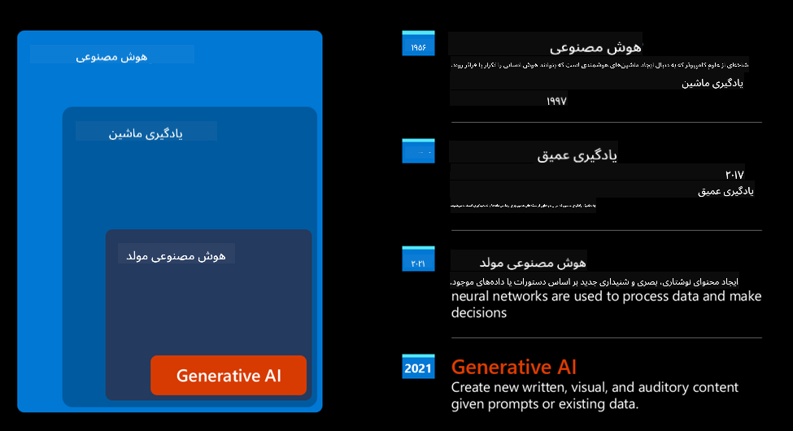
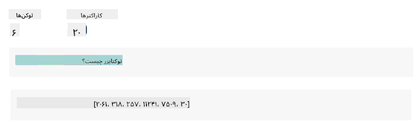
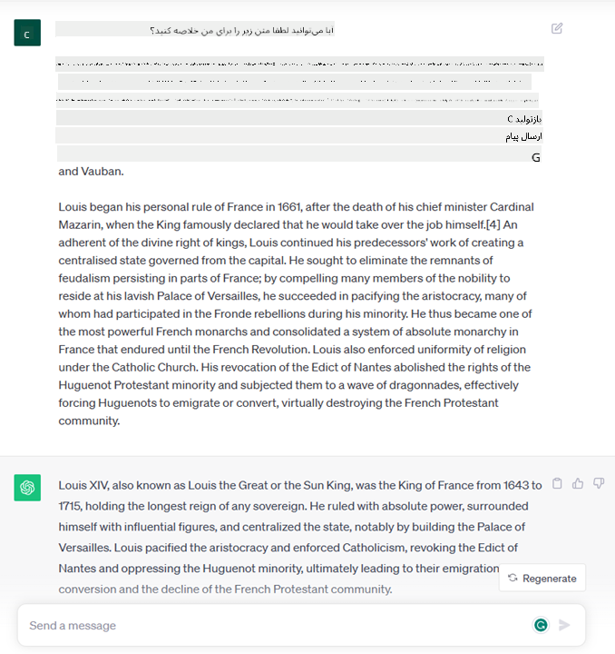
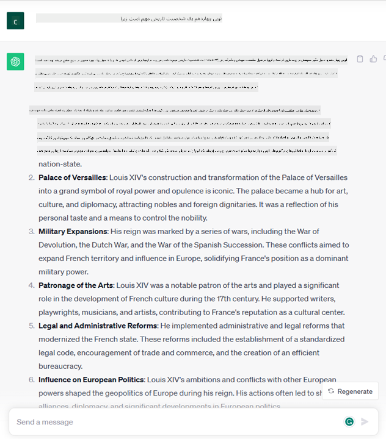

<!--
CO_OP_TRANSLATOR_METADATA:
{
  "original_hash": "bfb7901bdbece1ba3e9f35c400ca33e8",
  "translation_date": "2025-10-17T23:13:52+00:00",
  "source_file": "01-introduction-to-genai/README.md",
  "language_code": "fa"
}
-->
# مقدمه‌ای بر هوش مصنوعی مولد و مدل‌های زبانی بزرگ

_(برای مشاهده ویدئوی این درس، روی تصویر بالا کلیک کنید)_

هوش مصنوعی مولد، نوعی هوش مصنوعی است که قادر به تولید متن، تصاویر و انواع دیگر محتوا می‌باشد. چیزی که این فناوری را شگفت‌انگیز می‌کند این است که هوش مصنوعی را برای همه قابل دسترس می‌کند؛ هر کسی می‌تواند تنها با یک درخواست متنی، یک جمله نوشته شده به زبان طبیعی، از آن استفاده کند. نیازی نیست که شما زبان‌هایی مانند جاوا یا SQL را یاد بگیرید تا به چیزی ارزشمند دست یابید، تنها کافی است از زبان خود استفاده کنید، خواسته خود را بیان کنید و مدل هوش مصنوعی پیشنهادی را ارائه دهد. کاربردها و تأثیرات این فناوری بسیار گسترده است؛ شما می‌توانید گزارش‌ها را بنویسید یا درک کنید، برنامه‌ها بنویسید و بسیاری کارهای دیگر را تنها در چند ثانیه انجام دهید.

در این دوره آموزشی، بررسی خواهیم کرد که چگونه استارتاپ ما از هوش مصنوعی مولد برای باز کردن سناریوهای جدید در دنیای آموزش استفاده می‌کند و چگونه با چالش‌های اجتناب‌ناپذیر مرتبط با پیامدهای اجتماعی کاربرد آن و محدودیت‌های فناوری مواجه می‌شویم.

## مقدمه

این درس شامل موارد زیر خواهد بود:

- معرفی سناریوی کسب‌وکار: ایده و مأموریت استارتاپ ما.
- هوش مصنوعی مولد و چگونگی رسیدن به چشم‌انداز فناوری فعلی.
- نحوه عملکرد داخلی یک مدل زبانی بزرگ.
- قابلیت‌های اصلی و موارد استفاده عملی مدل‌های زبانی بزرگ.

## اهداف یادگیری

پس از تکمیل این درس، شما خواهید فهمید:

- هوش مصنوعی مولد چیست و مدل‌های زبانی بزرگ چگونه کار می‌کنند.
- چگونه می‌توانید از مدل‌های زبانی بزرگ برای موارد استفاده مختلف، با تمرکز بر سناریوهای آموزشی، بهره ببرید.

## سناریو: استارتاپ آموزشی ما

هوش مصنوعی مولد نمایانگر اوج فناوری هوش مصنوعی است که مرزهای آنچه زمانی غیرممکن به نظر می‌رسید را گسترش می‌دهد. مدل‌های هوش مصنوعی مولد دارای قابلیت‌ها و کاربردهای متعددی هستند، اما در این دوره آموزشی بررسی خواهیم کرد که چگونه این فناوری آموزش را از طریق یک استارتاپ خیالی متحول می‌کند. ما به این استارتاپ به عنوان _استارتاپ خودمان_ اشاره خواهیم کرد. استارتاپ ما در حوزه آموزش فعالیت می‌کند و مأموریت بلندپروازانه‌ای دارد:

> _بهبود دسترسی به یادگیری در سطح جهانی، تضمین دسترسی برابر به آموزش و ارائه تجربیات یادگیری شخصی‌سازی شده به هر یادگیرنده، بر اساس نیازهایشان._

تیم استارتاپ ما آگاه است که بدون استفاده از یکی از قدرتمندترین ابزارهای زمان حال – مدل‌های زبانی بزرگ (LLMs) – قادر به دستیابی به این هدف نخواهیم بود.

انتظار می‌رود هوش مصنوعی مولد روش یادگیری و آموزش امروز را متحول کند، به طوری که دانش‌آموزان معلمان مجازی در اختیار داشته باشند که ۲۴ ساعت شبانه‌روز اطلاعات و مثال‌های فراوانی ارائه دهند و معلمان بتوانند از ابزارهای نوآورانه برای ارزیابی دانش‌آموزان خود و ارائه بازخورد استفاده کنند.

برای شروع، بیایید برخی مفاهیم و اصطلاحات پایه‌ای را که در طول این دوره آموزشی استفاده خواهیم کرد تعریف کنیم.

## چگونه به هوش مصنوعی مولد رسیدیم؟

با وجود _تب_ فوق‌العاده‌ای که اخیراً با اعلام مدل‌های هوش مصنوعی مولد ایجاد شده است، این فناوری دهه‌ها در حال شکل‌گیری بوده است و اولین تلاش‌های تحقیقاتی آن به دهه ۶۰ میلادی بازمی‌گردد. اکنون به نقطه‌ای رسیده‌ایم که هوش مصنوعی دارای قابلیت‌های شناختی انسانی است، مانند مکالمه، همانطور که توسط [OpenAI ChatGPT](https://openai.com/chatgpt) یا [Bing Chat](https://www.microsoft.com/edge/features/bing-chat?WT.mc_id=academic-105485-koreyst) نشان داده شده است، که از مدل GPT برای مکالمات جستجوی وب Bing استفاده می‌کند.

اگر کمی به عقب برگردیم، اولین نمونه‌های اولیه هوش مصنوعی شامل چت‌بات‌های تایپی بودند که به یک پایگاه دانش استخراج شده از گروهی از کارشناسان متکی بودند و در یک کامپیوتر نمایش داده می‌شدند. پاسخ‌های موجود در پایگاه دانش با کلمات کلیدی موجود در متن ورودی فعال می‌شدند.  
با این حال، به زودی مشخص شد که چنین رویکردی، با استفاده از چت‌بات‌های تایپی، به خوبی مقیاس‌پذیر نیست.

### رویکرد آماری به هوش مصنوعی: یادگیری ماشین

یک نقطه عطف در دهه ۹۰ رخ داد، زمانی که رویکرد آماری به تحلیل متن اعمال شد. این امر منجر به توسعه الگوریتم‌های جدیدی – که به عنوان یادگیری ماشین شناخته می‌شوند – شد که قادر به یادگیری الگوها از داده‌ها بدون برنامه‌ریزی صریح بودند. این رویکرد به ماشین‌ها اجازه داد تا شبیه به انسان زبان را درک کنند: یک مدل آماری بر اساس جفت‌های متن-برچسب آموزش داده می‌شود و به مدل امکان می‌دهد تا متن ورودی ناشناخته را با یک برچسب از پیش تعریف شده که نمایانگر قصد پیام است، طبقه‌بندی کند.

### شبکه‌های عصبی و دستیاران مجازی مدرن

در سال‌های اخیر، تکامل فناوری سخت‌افزار، که قادر به پردازش حجم بیشتری از داده‌ها و محاسبات پیچیده‌تر است، تحقیقات در زمینه هوش مصنوعی را تشویق کرده و منجر به توسعه الگوریتم‌های پیشرفته یادگیری ماشین شده است که به عنوان شبکه‌های عصبی یا الگوریتم‌های یادگیری عمیق شناخته می‌شوند.

شبکه‌های عصبی (و به ویژه شبکه‌های عصبی بازگشتی – RNNs) پردازش زبان طبیعی را به طور قابل توجهی بهبود بخشیدند و امکان نمایش معنای متن را به شکلی معنادارتر فراهم کردند، به طوری که به زمینه یک کلمه در جمله اهمیت داده شد.

این فناوری، دستیاران مجازی را که در دهه اول قرن جدید متولد شدند، قدرت بخشید و آن‌ها را در تفسیر زبان انسانی، شناسایی نیازها و انجام اقداماتی برای برآورده کردن آن‌ها – مانند پاسخ دادن با یک اسکریپت از پیش تعریف شده یا استفاده از یک سرویس شخص ثالث – بسیار ماهر کرد.

### امروز، هوش مصنوعی مولد

این‌گونه بود که به هوش مصنوعی مولد امروز رسیدیم، که می‌توان آن را به عنوان زیرمجموعه‌ای از یادگیری عمیق در نظر گرفت.

پس از دهه‌ها تحقیق در زمینه هوش مصنوعی، یک معماری مدل جدید – به نام _Transformer_ – محدودیت‌های RNNs را پشت سر گذاشت و توانست دنباله‌های طولانی‌تر متن را به عنوان ورودی دریافت کند. ترانسفورمرها بر اساس مکانیزم توجه عمل می‌کنند، که به مدل امکان می‌دهد وزن‌های مختلفی به ورودی‌هایی که دریافت می‌کند اختصاص دهد، به طوری که به اطلاعات مهم‌تر توجه بیشتری کند، بدون توجه به ترتیب آن‌ها در دنباله متن.

بیشتر مدل‌های هوش مصنوعی مولد اخیر – که به عنوان مدل‌های زبانی بزرگ (LLMs) نیز شناخته می‌شوند، زیرا با ورودی‌ها و خروجی‌های متنی کار می‌کنند – واقعاً بر اساس این معماری هستند. چیزی که در مورد این مدل‌ها جالب است – که بر اساس حجم عظیمی از داده‌های بدون برچسب از منابع متنوعی مانند کتاب‌ها، مقالات و وب‌سایت‌ها آموزش داده شده‌اند – این است که می‌توان آن‌ها را برای وظایف مختلفی تطبیق داد و متنی گرامری صحیح با شباهتی به خلاقیت تولید کرد. بنابراین، نه تنها ظرفیت ماشین برای "درک" متن ورودی به طور قابل توجهی افزایش یافته است، بلکه توانایی آن‌ها برای تولید پاسخ اصلی به زبان انسانی نیز ممکن شده است.

## مدل‌های زبانی بزرگ چگونه کار می‌کنند؟

در فصل بعدی، انواع مختلف مدل‌های هوش مصنوعی مولد را بررسی خواهیم کرد، اما فعلاً بیایید نگاهی به نحوه عملکرد مدل‌های زبانی بزرگ بیندازیم، با تمرکز بر مدل‌های GPT (Generative Pre-trained Transformer) از OpenAI.

- **توکن‌ساز، تبدیل متن به اعداد**: مدل‌های زبانی بزرگ یک متن را به عنوان ورودی دریافت کرده و یک متن را به عنوان خروجی تولید می‌کنند. با این حال، به عنوان مدل‌های آماری، آن‌ها با اعداد بهتر از دنباله‌های متنی کار می‌کنند. به همین دلیل، هر ورودی به مدل قبل از استفاده توسط مدل اصلی، توسط یک توکن‌ساز پردازش می‌شود. توکن یک بخش از متن است – که شامل تعداد متغیری از کاراکترها می‌باشد، بنابراین وظیفه اصلی توکن‌ساز تقسیم ورودی به آرایه‌ای از توکن‌ها است. سپس، هر توکن با یک شاخص توکن مطابقت داده می‌شود، که کدگذاری عددی بخش اصلی متن است.

- **پیش‌بینی توکن‌های خروجی**: با دریافت n توکن به عنوان ورودی (با حداکثر n که از یک مدل به مدل دیگر متفاوت است)، مدل قادر است یک توکن را به عنوان خروجی پیش‌بینی کند. این توکن سپس در ورودی تکرار بعدی گنجانده می‌شود، در یک الگوی پنجره گسترش‌یافته، که تجربه کاربری بهتری از دریافت یک (یا چند) جمله به عنوان پاسخ را امکان‌پذیر می‌کند. این توضیح می‌دهد که چرا، اگر تا به حال با ChatGPT کار کرده باشید، ممکن است متوجه شده باشید که گاهی اوقات به نظر می‌رسد که در وسط یک جمله متوقف می‌شود.

- **فرآیند انتخاب، توزیع احتمالی**: توکن خروجی توسط مدل بر اساس احتمال وقوع آن پس از دنباله متن فعلی انتخاب می‌شود. این به این دلیل است که مدل یک توزیع احتمالی را بر روی تمام "توکن‌های بعدی" ممکن پیش‌بینی می‌کند، که بر اساس آموزش آن محاسبه شده است. با این حال، همیشه توکن با بالاترین احتمال از توزیع حاصل انتخاب نمی‌شود. درجه‌ای از تصادف به این انتخاب اضافه می‌شود، به گونه‌ای که مدل به صورت غیرقطعی عمل می‌کند - ما برای یک ورودی مشخص، همیشه خروجی یکسانی دریافت نمی‌کنیم. این درجه تصادف به منظور شبیه‌سازی فرآیند تفکر خلاقانه اضافه می‌شود و می‌توان آن را با استفاده از یک پارامتر مدل به نام دما تنظیم کرد.

## استارتاپ ما چگونه می‌تواند از مدل‌های زبانی بزرگ بهره ببرد؟

اکنون که درک بهتری از نحوه عملکرد داخلی یک مدل زبانی بزرگ داریم، بیایید برخی مثال‌های عملی از رایج‌ترین وظایفی که آن‌ها می‌توانند به خوبی انجام دهند را بررسی کنیم، با توجه به سناریوی کسب‌وکار ما.  
گفتیم که قابلیت اصلی یک مدل زبانی بزرگ _تولید متن از ابتدا، با شروع از یک ورودی متنی، نوشته شده به زبان طبیعی_ است.

اما چه نوع ورودی و خروجی متنی؟  
ورودی یک مدل زبانی بزرگ به عنوان یک درخواست (prompt) شناخته می‌شود، در حالی که خروجی به عنوان تکمیل (completion) شناخته می‌شود، اصطلاحی که به مکانیزم مدل برای تولید توکن بعدی برای تکمیل ورودی فعلی اشاره دارد. ما به طور عمیق بررسی خواهیم کرد که درخواست چیست و چگونه می‌توان آن را طراحی کرد تا بیشترین بهره را از مدل خود ببریم. اما فعلاً فقط بگوییم که یک درخواست ممکن است شامل موارد زیر باشد:

- یک **دستورالعمل** که نوع خروجی مورد انتظار از مدل را مشخص می‌کند. این دستورالعمل گاهی ممکن است شامل چند مثال یا داده‌های اضافی باشد.

  1. خلاصه‌سازی یک مقاله، کتاب، نظرات محصول و موارد دیگر، همراه با استخراج نکات از داده‌های غیرساختاریافته.
    
    
  
  2. ایده‌پردازی خلاقانه و طراحی یک مقاله، انشا، تکلیف یا موارد دیگر.
      
     

- یک **سؤال**، که به صورت مکالمه با یک عامل پرسیده می‌شود.
  
  

- یک بخش **متن برای تکمیل**، که به طور ضمنی درخواست کمک برای نوشتن است.
  
  

- یک بخش **کد** همراه با درخواست توضیح و مستندسازی آن، یا یک نظر که درخواست تولید یک قطعه کد برای انجام یک وظیفه خاص را دارد.
  
  

مثال‌های بالا بسیار ساده هستند و به عنوان یک نمایش جامع از قابلیت‌های مدل‌های زبانی بزرگ در نظر گرفته نشده‌اند. هدف آن‌ها نشان دادن پتانسیل استفاده از هوش مصنوعی مولد است، به ویژه اما نه محدود به زمینه‌های آموزشی.

همچنین، خروجی یک مدل هوش مصنوعی مولد کامل نیست و گاهی اوقات خلاقیت مدل می‌تواند علیه آن عمل کند، و منجر به خروجی شود که ترکیبی از کلمات است که کاربر انسانی می‌تواند آن را به عنوان تحریف واقعیت تفسیر کند، یا ممکن است توهین‌آمیز باشد. هوش مصنوعی مولد هوشمند نیست - حداقل در تعریف جامع‌تر هوش، شامل استدلال انتقادی و خلاقانه یا هوش هیجانی؛ قطعی نیست و قابل اعتماد نیست، زیرا ممکن است ترکیباتی از اطلاعات نادرست، مانند ارجاعات اشتباه، محتوا و اظهارات، با اطلاعات صحیح ترکیب شود و به صورت متقاعدکننده و با اعتماد به نفس ارائه شود. در درس‌های بعدی، با تمام این محدودیت‌ها روبرو خواهیم شد و خواهیم دید که چه کاری می‌توانیم برای کاهش آن‌ها انجام دهیم.

## تکلیف

تکلیف شما این است که درباره [هوش مصنوعی مولد](https://en.wikipedia.org/wiki/Generative_artificial_intelligence?WT.mc_id=academic-105485-koreyst) بیشتر مطالعه کنید و سعی کنید یک حوزه را شناسایی کنید که در حال حاضر هوش مصنوعی مولد در آن استفاده نمی‌شود و شما می‌خواهید آن را اضافه کنید. تفاوت تأثیر آن با روش "قدیمی" چگونه خواهد بود، آیا می‌توانید کاری انجام دهید که قبلاً نمی‌توانستید، یا سریع‌تر عمل کنید؟ یک خلاصه ۳۰۰ کلمه‌ای درباره اینکه استارتاپ رویایی شما چگونه خواهد بود بنویسید و شامل سرفصل‌هایی مانند "مشکل"، "چگونه از هوش مصنوعی استفاده می‌کنم"، "تأثیر" و در صورت تمایل یک برنامه کسب‌وکار باشد.

اگر این وظیفه را انجام دادید، ممکن است حتی آماده باشید تا به انکوباتور مایکروسافت، [Microsoft for Startups Founders Hub](https://www.microsoft.com/startups?WT.mc_id=academic-105485-koreyst) درخواست دهید. ما اعتباراتی برای Azure، OpenAI، مشاوره و موارد دیگر ارائه می‌دهیم، آن را بررسی کنید!

## بررسی دانش

چه چیزی درباره مدل‌های زبانی بزرگ درست است؟

1. شما هر بار پاسخ یکسانی دریافت می‌کنید.  
2. آن‌ها همه چیز را به طور کامل انجام می‌دهند، در جمع زدن اعداد، تولید کد کارآمد و غیره عالی هستند.  
3. پاسخ ممکن است با وجود استفاده از همان درخواست متفاوت باشد. همچنین در ارائه پیش‌نویس اولیه برای چیزی، چه متن یا کد، عالی هستند. اما شما باید نتایج را بهبود دهید.

پاسخ: ۳، یک مدل زبانی بزرگ غیرقطعی است، پاسخ‌ها متفاوت هستند، با این حال، شما می‌توانید تغییرات آن را از طریق تنظیم دما کنترل کنید. همچنین نباید انتظار داشته باشید که همه چیز را به طور کامل انجام دهد، این مدل برای انجام کارهای سنگین برای شما طراحی شده است که اغلب به معنای دریافت یک تلاش اولیه خوب است که باید به تدریج بهبود یابد.

## کار عالی! ادامه مسیر

پس از تکمیل این درس، مجموعه [آموزش هوش مصنوعی مولد](https://aka.ms/genai-collection?WT.mc_id=academic-105485-koreyst) ما را بررسی کنید تا دانش خود را در زمینه هوش مصنوعی مولد ارتقا دهید!
به درس ۲ بروید، جایی که به بررسی و مقایسه انواع مختلف LLM خواهیم پرداخت: [بررسی و مقایسه انواع مختلف LLM](../02-exploring-and-comparing-different-llms/README.md?WT.mc_id=academic-105485-koreyst)!

---

**سلب مسئولیت**:  
این سند با استفاده از سرویس ترجمه هوش مصنوعی [Co-op Translator](https://github.com/Azure/co-op-translator) ترجمه شده است. در حالی که ما تلاش می‌کنیم دقت را حفظ کنیم، لطفاً توجه داشته باشید که ترجمه‌های خودکار ممکن است شامل خطاها یا نادرستی‌ها باشند. سند اصلی به زبان اصلی آن باید به عنوان منبع معتبر در نظر گرفته شود. برای اطلاعات حیاتی، ترجمه حرفه‌ای انسانی توصیه می‌شود. ما مسئولیتی در قبال سوء تفاهم‌ها یا تفسیرهای نادرست ناشی از استفاده از این ترجمه نداریم.