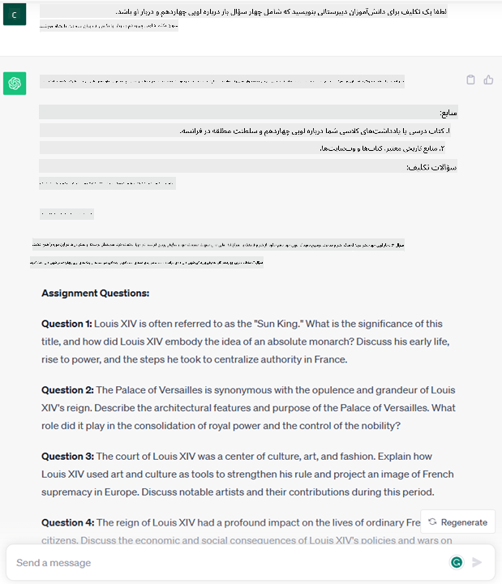
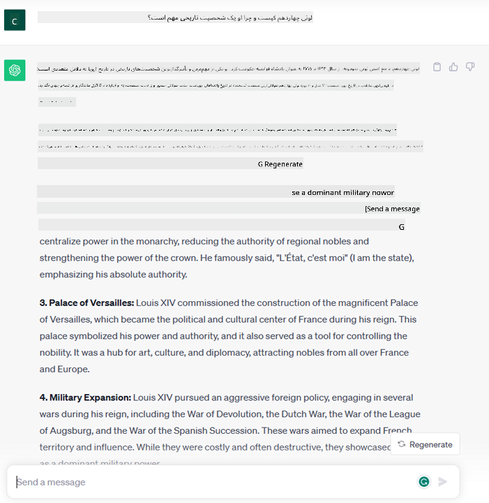
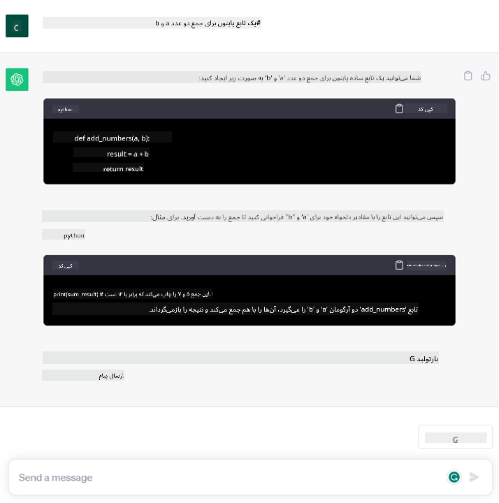

<!--
CO_OP_TRANSLATOR_METADATA:
{
  "original_hash": "f53ba0fa49164f9323043f1c6b11f2b1",
  "translation_date": "2025-07-09T07:42:51+00:00",
  "source_file": "01-introduction-to-genai/README.md",
  "language_code": "fa"
}
-->
# مقدمه‌ای بر هوش مصنوعی مولد و مدل‌های زبان بزرگ

_(برای مشاهده ویدئوی این درس روی تصویر بالا کلیک کنید)_

هوش مصنوعی مولد، هوش مصنوعی‌ای است که قادر به تولید متن، تصویر و انواع دیگر محتوا است. چیزی که این فناوری را فوق‌العاده می‌کند، دموکراتیک کردن هوش مصنوعی است؛ هر کسی می‌تواند تنها با یک دستور متنی، جمله‌ای به زبان طبیعی، از آن استفاده کند. نیازی نیست زبان‌هایی مثل Java یا SQL را یاد بگیرید تا کاری ارزشمند انجام دهید، کافی است زبان خود را به کار ببرید، خواسته‌تان را بیان کنید و مدل هوش مصنوعی پیشنهادی ارائه می‌دهد. کاربردها و تأثیرات این فناوری بسیار گسترده است؛ شما می‌توانید گزارش بنویسید یا درک کنید، برنامه بنویسید و خیلی کارهای دیگر را در عرض چند ثانیه انجام دهید.

در این دوره، بررسی می‌کنیم که چگونه استارتاپ ما از هوش مصنوعی مولد برای باز کردن سناریوهای جدید در دنیای آموزش استفاده می‌کند و چگونه با چالش‌های اجتناب‌ناپذیر مرتبط با پیامدهای اجتماعی کاربرد آن و محدودیت‌های فناوری مقابله می‌کنیم.

## مقدمه

این درس شامل موارد زیر است:

- معرفی سناریوی کسب‌وکار: ایده و مأموریت استارتاپ ما.
- هوش مصنوعی مولد و چگونگی رسیدن به چشم‌انداز فناوری فعلی.
- عملکرد داخلی یک مدل زبان بزرگ.
- قابلیت‌های اصلی و کاربردهای عملی مدل‌های زبان بزرگ.

## اهداف یادگیری

پس از اتمام این درس، شما درک خواهید کرد:

- هوش مصنوعی مولد چیست و مدل‌های زبان بزرگ چگونه کار می‌کنند.
- چگونه می‌توانید از مدل‌های زبان بزرگ برای کاربردهای مختلف، با تمرکز بر سناریوهای آموزشی، بهره ببرید.

## سناریو: استارتاپ آموزشی ما

هوش مصنوعی مولد نمایانگر اوج فناوری هوش مصنوعی است که مرزهای آنچه قبلاً غیرممکن تصور می‌شد را جابه‌جا کرده است. مدل‌های هوش مصنوعی مولد قابلیت‌ها و کاربردهای متعددی دارند، اما در این دوره بررسی می‌کنیم که چگونه این فناوری از طریق یک استارتاپ فرضی، آموزش را متحول می‌کند. ما این استارتاپ را _استارتاپ ما_ می‌نامیم. استارتاپ ما در حوزه آموزش فعالیت می‌کند و مأموریتی بلندپروازانه دارد:

> _بهبود دسترسی به یادگیری در سطح جهانی، تضمین دسترسی عادلانه به آموزش و ارائه تجربیات یادگیری شخصی‌سازی شده به هر یادگیرنده، متناسب با نیازهای او_.

تیم استارتاپ ما آگاه است که بدون بهره‌گیری از یکی از قدرتمندترین ابزارهای زمانه ما – مدل‌های زبان بزرگ (LLMs) – قادر به رسیدن به این هدف نخواهیم بود.

انتظار می‌رود هوش مصنوعی مولد روش یادگیری و آموزش امروز را متحول کند، به طوری که دانش‌آموزان در تمام ساعات روز معلمان مجازی در اختیار داشته باشند که حجم زیادی از اطلاعات و مثال‌ها را ارائه می‌دهند و معلمان بتوانند از ابزارهای نوآورانه برای ارزیابی دانش‌آموزان و ارائه بازخورد استفاده کنند.

برای شروع، بیایید برخی مفاهیم و اصطلاحات پایه‌ای را که در طول دوره استفاده خواهیم کرد تعریف کنیم.

## چگونه به هوش مصنوعی مولد رسیدیم؟

با وجود هیجان فوق‌العاده‌ای که اخیراً با معرفی مدل‌های هوش مصنوعی مولد ایجاد شده، این فناوری دهه‌ها در حال توسعه بوده است و اولین تلاش‌های پژوهشی به دهه ۶۰ میلادی بازمی‌گردد. اکنون به نقطه‌ای رسیده‌ایم که هوش مصنوعی دارای قابلیت‌های شناختی انسانی است، مانند مکالمه که نمونه‌هایی از آن را می‌توان در [OpenAI ChatGPT](https://openai.com/chatgpt) یا [Bing Chat](https://www.microsoft.com/edge/features/bing-chat?WT.mc_id=academic-105485-koreyst) دید، که از مدل GPT برای جستجوی وب در مکالمات Bing استفاده می‌کند.

کمی به عقب برگردیم، اولین نمونه‌های اولیه هوش مصنوعی شامل چت‌بات‌های تایپ‌شده بودند که بر اساس پایگاه دانشی استخراج شده از گروهی از کارشناسان و وارد شده به کامپیوتر کار می‌کردند. پاسخ‌ها در پایگاه دانش با کلیدواژه‌هایی که در متن ورودی ظاهر می‌شدند، فعال می‌شدند. اما به زودی مشخص شد که چنین رویکردی، استفاده از چت‌بات‌های تایپ‌شده، مقیاس‌پذیر نیست.

### رویکرد آماری به هوش مصنوعی: یادگیری ماشین

نقطه عطفی در دهه ۹۰ رخ داد، با به‌کارگیری رویکرد آماری در تحلیل متن. این منجر به توسعه الگوریتم‌های جدیدی شد که به یادگیری ماشین معروفند و قادرند الگوها را از داده‌ها بدون برنامه‌نویسی صریح یاد بگیرند. این رویکرد به ماشین‌ها اجازه می‌دهد تا فهم زبان انسانی را شبیه‌سازی کنند: یک مدل آماری روی جفت‌های متن-برچسب آموزش می‌بیند و قادر می‌شود متن ورودی ناشناخته را با برچسبی از پیش تعریف شده که نشان‌دهنده هدف پیام است، طبقه‌بندی کند.

### شبکه‌های عصبی و دستیارهای مجازی مدرن

در سال‌های اخیر، پیشرفت فناوری سخت‌افزار که قادر به پردازش داده‌های بیشتر و محاسبات پیچیده‌تر است، تحقیقات در حوزه هوش مصنوعی را تشویق کرده و منجر به توسعه الگوریتم‌های پیشرفته یادگیری ماشین به نام شبکه‌های عصبی یا یادگیری عمیق شده است.

شبکه‌های عصبی (به ویژه شبکه‌های عصبی بازگشتی – RNNها) پردازش زبان طبیعی را به طور قابل توجهی بهبود بخشیدند و امکان نمایش معانی متن را به شکلی معنادارتر فراهم کردند، به طوری که زمینه کلمات در جمله را در نظر می‌گیرند.

این فناوری، دستیارهای مجازی را که در دهه اول قرن جدید متولد شدند، توانمند ساخت؛ دستیارهایی که در تفسیر زبان انسانی، شناسایی نیاز و انجام عملی برای رفع آن بسیار ماهرند – مانند پاسخ دادن با اسکریپت از پیش تعریف شده یا استفاده از سرویس‌های شخص ثالث.

### هوش مصنوعی مولد در زمان حال

پس این‌گونه است که به هوش مصنوعی مولد امروز رسیدیم، که می‌توان آن را زیرمجموعه‌ای از یادگیری عمیق دانست.

پس از دهه‌ها تحقیق در حوزه هوش مصنوعی، معماری جدیدی به نام _Transformer_ محدودیت‌های RNNها را پشت سر گذاشت و قادر شد توالی‌های طولانی‌تری از متن را به عنوان ورودی دریافت کند. ترنسفورمرها بر اساس مکانیزم توجه ساخته شده‌اند که به مدل اجازه می‌دهد وزن‌های متفاوتی به ورودی‌ها بدهد و «بیشتر توجه کند» به جایی که اطلاعات مرتبط‌تر متمرکز شده‌اند، بدون توجه به ترتیب آن‌ها در توالی متن.

اکثر مدل‌های هوش مصنوعی مولد اخیر – که به مدل‌های زبان بزرگ (LLMs) نیز معروفند، چون با ورودی‌ها و خروجی‌های متنی کار می‌کنند – بر اساس این معماری ساخته شده‌اند. نکته جالب درباره این مدل‌ها که روی حجم عظیمی از داده‌های بدون برچسب از منابع متنوع مانند کتاب‌ها، مقالات و وب‌سایت‌ها آموزش دیده‌اند، این است که می‌توان آن‌ها را برای طیف وسیعی از وظایف تطبیق داد و متنی با دستور زبان صحیح و ظاهری خلاقانه تولید کرد. بنابراین، نه تنها ظرفیت ماشین برای «درک» متن ورودی به طرز شگفت‌انگیزی افزایش یافته، بلکه توانایی آن‌ها برای تولید پاسخ اصلی به زبان انسانی نیز ممکن شده است.

## مدل‌های زبان بزرگ چگونه کار می‌کنند؟

در فصل بعدی به انواع مختلف مدل‌های هوش مصنوعی مولد می‌پردازیم، اما فعلاً نگاهی به نحوه کار مدل‌های زبان بزرگ، با تمرکز بر مدل‌های OpenAI GPT (Generative Pre-trained Transformer) می‌اندازیم.

- **توکنایزر، تبدیل متن به اعداد**: مدل‌های زبان بزرگ متنی را به عنوان ورودی دریافت و متنی را به عنوان خروجی تولید می‌کنند. اما چون مدل‌های آماری هستند، با اعداد بهتر کار می‌کنند تا توالی‌های متنی. به همین دلیل هر ورودی قبل از استفاده توسط مدل اصلی، توسط توکنایزر پردازش می‌شود. توکن یک بخش از متن است – شامل تعداد متغیری از کاراکترها – بنابراین وظیفه اصلی توکنایزر تقسیم ورودی به آرایه‌ای از توکن‌ها است. سپس هر توکن به یک اندیس توکن نگاشت می‌شود که کدگذاری عددی بخش اصلی متن است.

- **پیش‌بینی توکن‌های خروجی**: با دریافت n توکن به عنوان ورودی (حداکثر n بسته به مدل متفاوت است)، مدل قادر است یک توکن را به عنوان خروجی پیش‌بینی کند. این توکن سپس در ورودی تکرار بعدی وارد می‌شود، به صورت پنجره‌ای در حال گسترش، که تجربه کاربری بهتری برای دریافت یک یا چند جمله به عنوان پاسخ فراهم می‌کند. این توضیح می‌دهد که چرا اگر با ChatGPT کار کرده باشید، گاهی اوقات به نظر می‌رسد وسط جمله متوقف می‌شود.

- **فرآیند انتخاب، توزیع احتمال**: توکن خروجی توسط مدل بر اساس احتمال وقوع آن پس از توالی متن فعلی انتخاب می‌شود. مدل توزیع احتمالی روی تمام «توکن‌های بعدی ممکن» را پیش‌بینی می‌کند که بر اساس آموزش آن محاسبه شده است. اما همیشه توکنی که بیشترین احتمال را دارد انتخاب نمی‌شود. درجه‌ای از تصادفی بودن به این انتخاب اضافه می‌شود، به طوری که مدل به صورت غیرقطعی عمل می‌کند – یعنی برای ورودی یکسان، خروجی دقیقاً یکسانی دریافت نمی‌کنیم. این درجه تصادفی بودن برای شبیه‌سازی فرآیند تفکر خلاقانه اضافه شده و می‌توان آن را با پارامتری به نام temperature تنظیم کرد.

## استارتاپ ما چگونه می‌تواند از مدل‌های زبان بزرگ بهره ببرد؟

حالا که درک بهتری از عملکرد داخلی مدل زبان بزرگ داریم، بیایید چند مثال عملی از رایج‌ترین وظایفی که این مدل‌ها به خوبی انجام می‌دهند را با نگاه به سناریوی کسب‌وکارمان ببینیم.
گفتیم که قابلیت اصلی مدل زبان بزرگ، _تولید متن از صفر، شروع از ورودی متنی به زبان طبیعی_ است.

اما چه نوع ورودی و خروجی متنی؟
ورودی مدل زبان بزرگ به عنوان prompt شناخته می‌شود و خروجی به عنوان completion، اصطلاحی که به مکانیزم مدل برای تولید توکن بعدی برای تکمیل ورودی فعلی اشاره دارد. ما عمیق‌تر به مفهوم prompt و نحوه طراحی آن برای بهره‌برداری حداکثری از مدل خواهیم پرداخت. اما فعلاً بگوییم که یک prompt ممکن است شامل موارد زیر باشد:

- یک **دستورالعمل** که نوع خروجی مورد انتظار از مدل را مشخص می‌کند. این دستورالعمل گاهی شامل چند مثال یا داده‌های اضافی است.

  1. خلاصه‌سازی یک مقاله، کتاب، نقد محصول و غیره، همراه با استخراج بینش از داده‌های بدون ساختار.
    
    
  
  2. ایده‌پردازی خلاقانه و طراحی مقاله، انشاء، تکلیف یا بیشتر.
      
     

- یک **سؤال** که به صورت مکالمه با یک عامل پرسیده می‌شود.
  
  

- بخشی از **متن برای تکمیل** که به طور ضمنی درخواست کمک در نوشتن است.
  
  

- بخشی از **کد** همراه با درخواست توضیح و مستندسازی آن، یا کامنتی که درخواست تولید قطعه کدی برای انجام وظیفه خاصی دارد.
  
  

مثال‌های بالا بسیار ساده هستند و قصد ندارند نمایش کاملی از قابلیت‌های مدل‌های زبان بزرگ باشند. هدف آن‌ها نشان دادن پتانسیل استفاده از هوش مصنوعی مولد، به ویژه اما نه محدود به زمینه‌های آموزشی است.

همچنین، خروجی مدل هوش مصنوعی مولد کامل نیست و گاهی خلاقیت مدل می‌تواند علیه آن عمل کند، به گونه‌ای که خروجی ترکیبی از کلماتی باشد که کاربر انسانی آن را به عنوان تحریف واقعیت یا حتی توهین‌آمیز تفسیر کند. هوش مصنوعی مولد هوشمند نیست – حداقل در تعریف جامع‌تر هوش که شامل استدلال انتقادی و خلاقانه یا هوش هیجانی است؛ این مدل قطعی نیست و قابل اعتماد هم نیست، چون ممکن است ساختگی‌هایی مانند ارجاعات نادرست، محتوا و اظهارات اشتباه با اطلاعات صحیح ترکیب شده و به شکلی قانع‌کننده و با اعتماد به نفس ارائه شوند. در درس‌های بعدی با همه این محدودیت‌ها مواجه خواهیم شد و می‌بینیم چه کارهایی می‌توانیم برای کاهش آن‌ها انجام دهیم.

## تمرین

تمرین شما این است که بیشتر درباره [هوش مصنوعی مولد](https://en.wikipedia.org/wiki/Generative_artificial_intelligence?WT.mc_id=academic-105485-koreyst) مطالعه کنید و حوزه‌ای را شناسایی کنید که امروز هوش مصنوعی مولد در آن وجود ندارد و شما می‌خواهید آن را اضافه کنید. تأثیر آن چگونه با روش «قدیمی» متفاوت خواهد بود؟ آیا کاری می‌توانید انجام دهید که قبلاً نمی‌توانستید یا سریع‌تر هستید؟ یک خلاصه ۳۰۰ کلمه‌ای بنویسید درباره اینکه استارتاپ هوش مصنوعی رویایی شما چگونه خواهد بود و عناوینی مانند «مسئله»، «چگونه از هوش مصنوعی استفاده می‌کنم»، «تأثیر» و در صورت تمایل یک طرح کسب‌وکار را درج کنید.

اگر این تمرین را انجام دادید، ممکن است حتی آماده باشید که در برنامه شتاب‌دهنده مایکروسافت، [Microsoft for Startups Founders Hub](https://www.microsoft.com/startups?WT.mc_id=academic-105485-koreyst) ثبت‌نام کنید. ما اعتباراتی برای Azure، OpenAI، مشاوره و خیلی موارد دیگر ارائه می‌دهیم، حتماً بررسی کنید!

## آزمون دانش

کدام مورد درباره مدل‌های زبان بزرگ درست است؟

1. هر بار پاسخ دقیقاً یکسانی دریافت می‌کنید.
2. کارها را به طور کامل و بی‌نقص انجام می‌دهد، در جمع اعداد عالی است، کد کارآمد تولید می‌کند و غیره.
3. پاسخ ممکن است با وجود استفاده از همان prompt متفاوت باشد. همچنین در ارائه پیش‌نویس اولیه متن یا کد بسیار خوب است، اما شما باید نتایج را بهبود دهید.

پاسخ: ۳، یک LLM غیرقطعی است، پاسخ‌ها متفاوت است، اما می‌توانید میزان تغییر آن را با تنظیم پارامتر temperature کنترل کنید. همچنین نباید انتظار داشته باشید که کارها را بی‌نقص انجام دهد، بلکه برای انجام کارهای سنگین به شما کمک می‌کند که اغلب به معنای دریافت یک تلاش اولیه خوب است که باید به تدریج بهبود یابد.

## کار عالی! ادامه مسیر

پس از اتمام این درس، مجموعه [یادگیری هوش مصنوعی مولد](https://aka.ms/genai-collection?WT.mc_id=academic-105485-koreyst) ما را بررسی کنید تا دانش خود در زمینه هوش مصنوعی مولد را ارتقا دهید!
به درس ۲ مراجعه کنید که در آن به بررسی و مقایسه انواع مختلف LLM خواهیم پرداخت [explore and compare different LLM types](../02-exploring-and-comparing-different-llms/README.md?WT.mc_id=academic-105485-koreyst)!

**سلب مسئولیت**:  
این سند با استفاده از سرویس ترجمه هوش مصنوعی [Co-op Translator](https://github.com/Azure/co-op-translator) ترجمه شده است. در حالی که ما در تلاش برای دقت هستیم، لطفاً توجه داشته باشید که ترجمه‌های خودکار ممکن است حاوی خطاها یا نواقصی باشند. سند اصلی به زبان بومی خود باید به عنوان منبع معتبر در نظر گرفته شود. برای اطلاعات حیاتی، ترجمه حرفه‌ای انسانی توصیه می‌شود. ما مسئول هیچ گونه سوءتفاهم یا تفسیر نادرستی که از استفاده این ترجمه ناشی شود، نیستیم.