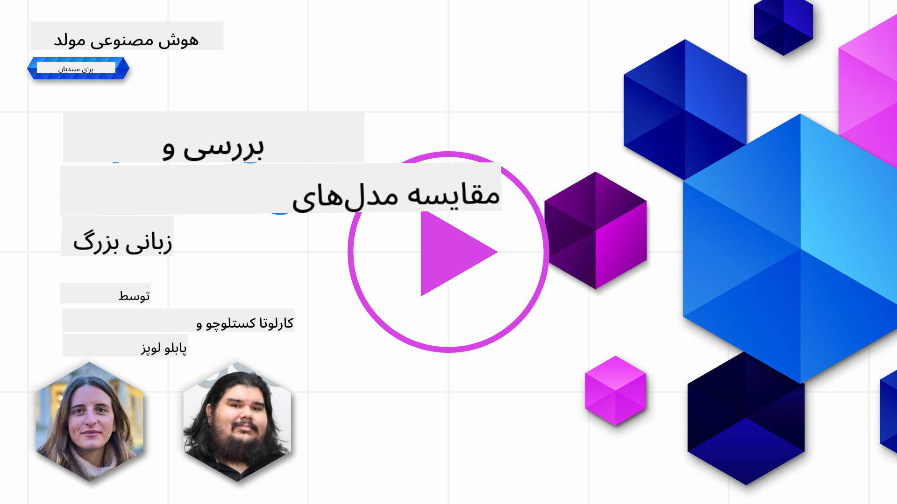
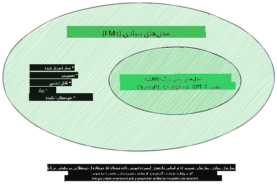
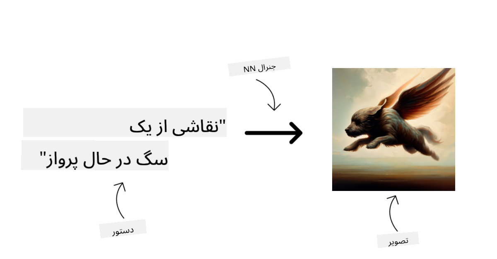
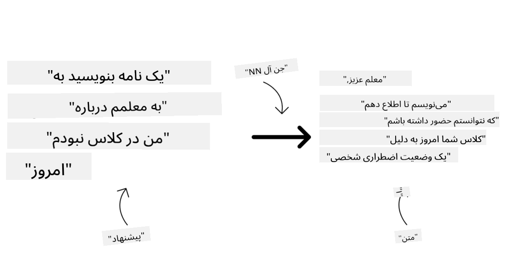
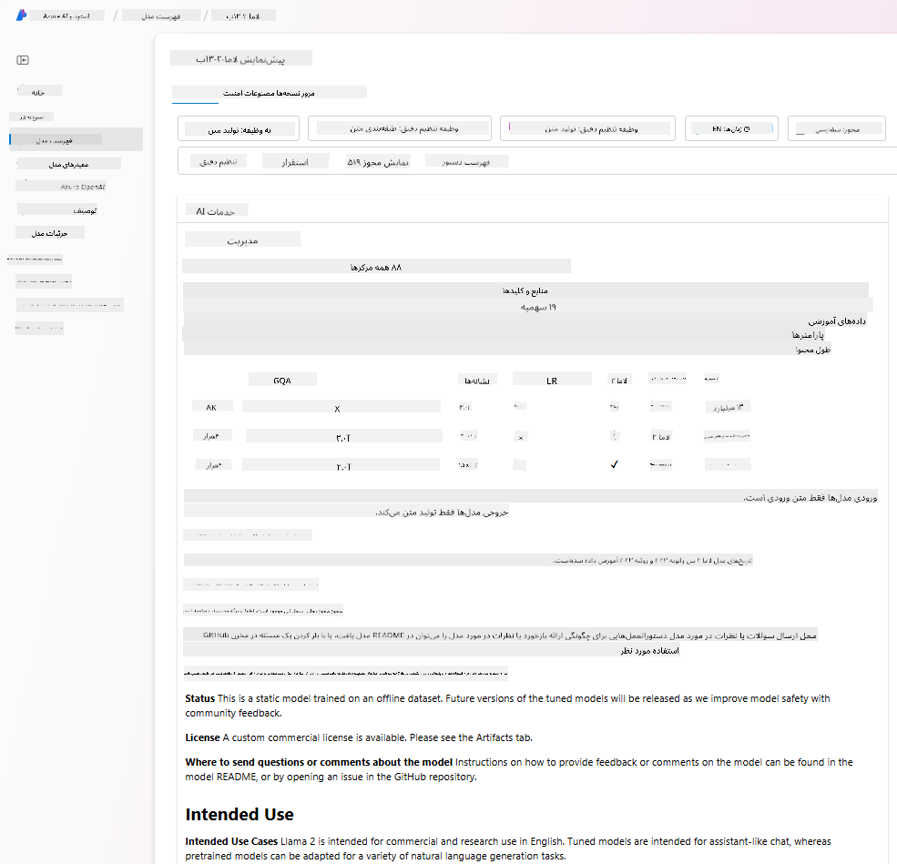
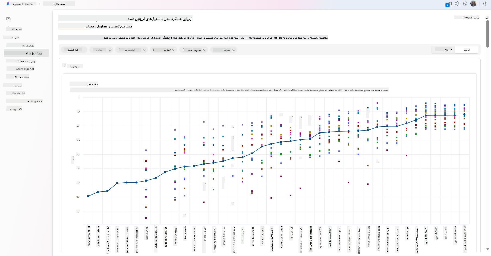
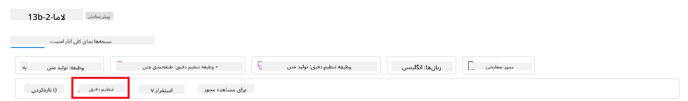
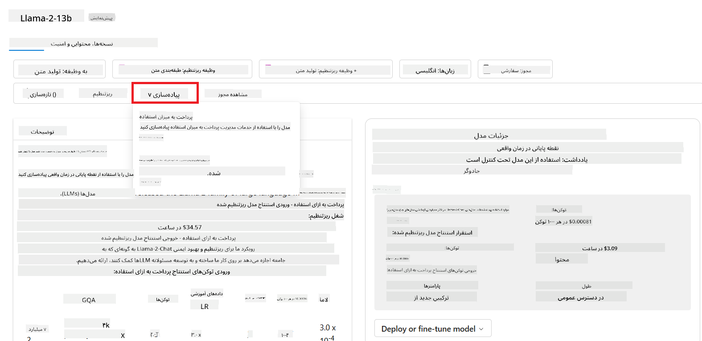
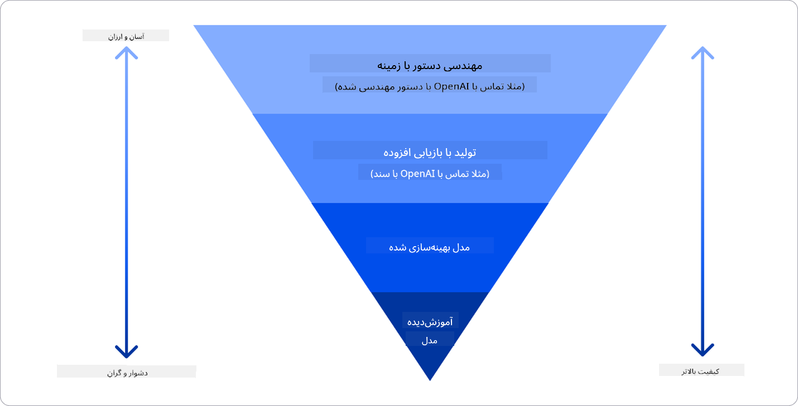

<!--
CO_OP_TRANSLATOR_METADATA:
{
  "original_hash": "e2f686f2eb794941761252ac5e8e090b",
  "translation_date": "2025-07-09T08:11:05+00:00",
  "source_file": "02-exploring-and-comparing-different-llms/README.md",
  "language_code": "fa"
}
-->
# بررسی و مقایسه مدل‌های بزرگ زبان (LLM) مختلف

> _برای مشاهده ویدئوی این درس روی تصویر بالا کلیک کنید_

در درس قبلی دیدیم که چگونه هوش مصنوعی مولد در حال تغییر چشم‌انداز فناوری است، مدل‌های بزرگ زبان (LLM) چگونه کار می‌کنند و یک کسب‌وکار - مانند استارتاپ ما - چگونه می‌تواند آن‌ها را در موارد استفاده خود به کار گیرد و رشد کند! در این فصل، قصد داریم انواع مختلف مدل‌های بزرگ زبان را با هم مقایسه و تفاوت‌های آن‌ها را بررسی کنیم تا مزایا و معایب هر کدام را بهتر درک کنیم.

گام بعدی در مسیر استارتاپ ما، بررسی وضعیت فعلی مدل‌های بزرگ زبان و فهمیدن این است که کدام مدل‌ها برای مورد استفاده ما مناسب‌تر هستند.

## مقدمه

این درس شامل موارد زیر است:

- انواع مختلف مدل‌های بزرگ زبان در وضعیت فعلی.
- آزمایش، تکرار و مقایسه مدل‌های مختلف برای مورد استفاده شما در Azure.
- نحوه استقرار یک مدل بزرگ زبان.

## اهداف یادگیری

پس از اتمام این درس، قادر خواهید بود:

- مدل مناسب برای مورد استفاده خود را انتخاب کنید.
- نحوه آزمایش، تکرار و بهبود عملکرد مدل خود را درک کنید.
- بدانید کسب‌وکارها چگونه مدل‌ها را مستقر می‌کنند.

## درک انواع مختلف مدل‌های بزرگ زبان

مدل‌های بزرگ زبان می‌توانند بر اساس معماری، داده‌های آموزشی و مورد استفاده، دسته‌بندی‌های مختلفی داشته باشند. درک این تفاوت‌ها به استارتاپ ما کمک می‌کند تا مدل مناسب برای سناریو را انتخاب کند و بداند چگونه باید مدل را آزمایش، تکرار و عملکرد آن را بهبود بخشد.

انواع مختلفی از مدل‌های LLM وجود دارد و انتخاب شما به هدف استفاده، داده‌ها، میزان بودجه و موارد دیگر بستگی دارد.

بسته به اینکه قصد دارید مدل‌ها را برای متن، صدا، ویدئو، تولید تصویر و غیره استفاده کنید، ممکن است نوع متفاوتی از مدل را انتخاب کنید.

- **تشخیص صدا و گفتار**. برای این منظور، مدل‌های نوع Whisper گزینه‌ای عالی هستند چون کاربرد عمومی دارند و برای تشخیص گفتار طراحی شده‌اند. این مدل‌ها روی داده‌های صوتی متنوع آموزش دیده‌اند و قادر به تشخیص گفتار چندزبانه هستند. برای اطلاعات بیشتر درباره [مدل‌های نوع Whisper اینجا را ببینید](https://platform.openai.com/docs/models/whisper?WT.mc_id=academic-105485-koreyst).

- **تولید تصویر**. برای تولید تصویر، DALL-E و Midjourney دو گزینه بسیار شناخته شده هستند. DALL-E توسط Azure OpenAI ارائه می‌شود. [اطلاعات بیشتر درباره DALL-E اینجا](https://platform.openai.com/docs/models/dall-e?WT.mc_id=academic-105485-koreyst) و همچنین در فصل ۹ این دوره آموزشی موجود است.

- **تولید متن**. بیشتر مدل‌ها برای تولید متن آموزش دیده‌اند و شما انتخاب‌های زیادی از GPT-3.5 تا GPT-4 دارید. این مدل‌ها هزینه‌های متفاوتی دارند که GPT-4 گران‌ترین آن‌هاست. ارزش دارد که به [محیط آزمایشی Azure OpenAI](https://oai.azure.com/portal/playground?WT.mc_id=academic-105485-koreyst) سر بزنید تا ببینید کدام مدل‌ها از نظر قابلیت و هزینه بهتر به نیازهای شما می‌خورند.

- **چندرسانه‌ای**. اگر می‌خواهید چند نوع داده را در ورودی و خروجی مدیریت کنید، ممکن است بخواهید مدل‌هایی مانند [gpt-4 turbo با قابلیت دید یا gpt-4o](https://learn.microsoft.com/azure/ai-services/openai/concepts/models#gpt-4-and-gpt-4-turbo-models?WT.mc_id=academic-105485-koreyst) را بررسی کنید - جدیدترین مدل‌های OpenAI - که قادر به ترکیب پردازش زبان طبیعی با درک بصری هستند و امکان تعامل از طریق رابط‌های چندرسانه‌ای را فراهم می‌کنند.

انتخاب یک مدل به معنای دریافت برخی قابلیت‌های پایه است که ممکن است کافی نباشد. اغلب داده‌های خاص شرکت وجود دارد که باید به نحوی به مدل بزرگ زبان منتقل شود. چند راه مختلف برای این کار وجود دارد که در بخش‌های بعدی بیشتر توضیح داده خواهد شد.

### مدل‌های بنیادین در مقابل مدل‌های بزرگ زبان

اصطلاح مدل بنیادین توسط [پژوهشگران استنفورد ابداع شده است](https://arxiv.org/abs/2108.07258?WT.mc_id=academic-105485-koreyst) و به مدلی از هوش مصنوعی گفته می‌شود که معیارهایی مانند موارد زیر را دارد:

- **با استفاده از یادگیری بدون نظارت یا یادگیری خودنظارتی آموزش دیده‌اند**، یعنی روی داده‌های چندرسانه‌ای بدون برچسب آموزش دیده‌اند و نیازی به برچسب‌گذاری یا حاشیه‌نویسی انسانی برای فرایند آموزش ندارند.
- **مدل‌های بسیار بزرگی هستند** که بر اساس شبکه‌های عصبی عمیق با میلیاردها پارامتر آموزش دیده‌اند.
- **معمولاً به عنوان «بنیاد» برای مدل‌های دیگر در نظر گرفته می‌شوند**، یعنی می‌توانند به عنوان نقطه شروع برای ساخت مدل‌های دیگر استفاده شوند که با تنظیم دقیق (fine-tuning) انجام می‌شود.

منبع تصویر: [راهنمای ضروری مدل‌های بنیادین و مدل‌های بزرگ زبان | توسط Babar M Bhatti | Medium](https://thebabar.medium.com/essential-guide-to-foundation-models-and-large-language-models-27dab58f7404)

برای روشن‌تر شدن این تفاوت، بیایید ChatGPT را مثال بزنیم. برای ساخت اولین نسخه ChatGPT، مدلی به نام GPT-3.5 به عنوان مدل بنیادین استفاده شد. این یعنی OpenAI از داده‌های خاص چت برای ایجاد نسخه‌ای تنظیم شده از GPT-3.5 استفاده کرد که در سناریوهای مکالمه‌ای مانند چت‌بات‌ها عملکرد خوبی داشته باشد.

منبع تصویر: [2108.07258.pdf (arxiv.org)](https://arxiv.org/pdf/2108.07258.pdf?WT.mc_id=academic-105485-koreyst)

### مدل‌های متن‌باز در مقابل مدل‌های اختصاصی

راه دیگر دسته‌بندی مدل‌های بزرگ زبان، این است که ببینیم مدل‌ها متن‌باز هستند یا اختصاصی.

مدل‌های متن‌باز مدل‌هایی هستند که در دسترس عموم قرار دارند و هر کسی می‌تواند از آن‌ها استفاده کند. معمولاً این مدل‌ها توسط شرکتی که آن‌ها را ساخته یا جامعه پژوهشی ارائه می‌شوند. این مدل‌ها اجازه بررسی، تغییر و سفارشی‌سازی برای موارد مختلف استفاده را دارند. اما همیشه برای استفاده در تولید بهینه نیستند و ممکن است به اندازه مدل‌های اختصاصی عملکرد نداشته باشند. همچنین بودجه برای مدل‌های متن‌باز محدود است و ممکن است به‌روزرسانی یا نگهداری بلندمدت نداشته باشند. نمونه‌های محبوب مدل‌های متن‌باز شامل [Alpaca](https://crfm.stanford.edu/2023/03/13/alpaca.html?WT.mc_id=academic-105485-koreyst)، [Bloom](https://huggingface.co/bigscience/bloom) و [LLaMA](https://llama.meta.com) هستند.

مدل‌های اختصاصی مدل‌هایی هستند که متعلق به یک شرکت هستند و در دسترس عموم قرار ندارند. این مدل‌ها معمولاً برای استفاده در تولید بهینه شده‌اند. اما اجازه بررسی، تغییر یا سفارشی‌سازی برای موارد مختلف استفاده را ندارند. همچنین همیشه رایگان نیستند و ممکن است نیاز به اشتراک یا پرداخت داشته باشند. کاربران کنترل مستقیمی روی داده‌های آموزشی ندارند و باید به مالک مدل برای حفظ حریم خصوصی داده‌ها و استفاده مسئولانه از هوش مصنوعی اعتماد کنند. نمونه‌های محبوب مدل‌های اختصاصی شامل [مدل‌های OpenAI](https://platform.openai.com/docs/models/overview?WT.mc_id=academic-105485-koreyst)، [Google Bard](https://sapling.ai/llm/bard?WT.mc_id=academic-105485-koreyst) و [Claude 2](https://www.anthropic.com/index/claude-2?WT.mc_id=academic-105485-koreyst) هستند.

### جاسازی (Embedding) در مقابل تولید تصویر در مقابل تولید متن و کد

مدل‌های بزرگ زبان همچنین می‌توانند بر اساس خروجی که تولید می‌کنند دسته‌بندی شوند.

جاسازی‌ها مجموعه‌ای از مدل‌ها هستند که می‌توانند متن را به شکل عددی تبدیل کنند، که به آن جاسازی گفته می‌شود و نمایشی عددی از متن ورودی است. جاسازی‌ها فهم ماشین‌ها از روابط بین کلمات یا جملات را آسان‌تر می‌کنند و می‌توانند به عنوان ورودی برای مدل‌های دیگر مانند مدل‌های طبقه‌بندی یا خوشه‌بندی که عملکرد بهتری روی داده‌های عددی دارند، استفاده شوند. مدل‌های جاسازی اغلب برای یادگیری انتقالی استفاده می‌شوند، جایی که مدلی برای یک کار جانشین با داده‌های فراوان ساخته می‌شود و سپس وزن‌های مدل (جاسازی‌ها) برای کارهای پایین‌دستی دیگر استفاده می‌شوند. نمونه‌ای از این دسته مدل‌های [OpenAI embeddings](https://platform.openai.com/docs/models/embeddings?WT.mc_id=academic-105485-koreyst) است.

مدل‌های تولید تصویر مدل‌هایی هستند که تصاویر تولید می‌کنند. این مدل‌ها معمولاً برای ویرایش تصویر، سنتز تصویر و ترجمه تصویر استفاده می‌شوند. مدل‌های تولید تصویر معمولاً روی مجموعه داده‌های بزرگی از تصاویر مانند [LAION-5B](https://laion.ai/blog/laion-5b/?WT.mc_id=academic-105485-koreyst) آموزش دیده‌اند و می‌توانند تصاویر جدید تولید کنند یا تصاویر موجود را با تکنیک‌هایی مانند inpainting، افزایش وضوح و رنگ‌آمیزی ویرایش کنند. نمونه‌ها شامل [DALL-E-3](https://openai.com/dall-e-3?WT.mc_id=academic-105485-koreyst) و [مدل‌های Stable Diffusion](https://github.com/Stability-AI/StableDiffusion?WT.mc_id=academic-105485-koreyst) هستند.

مدل‌های تولید متن و کد مدل‌هایی هستند که متن یا کد تولید می‌کنند. این مدل‌ها معمولاً برای خلاصه‌سازی متن، ترجمه و پاسخ به سوالات استفاده می‌شوند. مدل‌های تولید متن معمولاً روی مجموعه داده‌های بزرگی از متن مانند [BookCorpus](https://www.cv-foundation.org/openaccess/content_iccv_2015/html/Zhu_Aligning_Books_and_ICCV_2015_paper.html?WT.mc_id=academic-105485-koreyst) آموزش دیده‌اند و می‌توانند متن جدید تولید کنند یا به سوالات پاسخ دهند. مدل‌های تولید کد مانند [CodeParrot](https://huggingface.co/codeparrot?WT.mc_id=academic-105485-koreyst) معمولاً روی مجموعه داده‌های بزرگی از کد مانند GitHub آموزش دیده‌اند و می‌توانند کد جدید تولید کنند یا اشکالات کد موجود را رفع کنند.

### Encoder-Decoder در مقابل فقط Decoder

برای صحبت درباره انواع معماری‌های مدل‌های بزرگ زبان، بیایید از یک تشبیه استفاده کنیم.

فرض کنید مدیر شما وظیفه‌ای به شما داده تا یک آزمون برای دانش‌آموزان بنویسید. شما دو همکار دارید؛ یکی مسئول ایجاد محتوا و دیگری مسئول بازبینی آن است.

ایجادکننده محتوا مانند مدل فقط Decoder است، او می‌تواند موضوع را ببیند و آنچه شما نوشته‌اید را مرور کند و سپس بر اساس آن یک درس بنویسد. آن‌ها در نوشتن محتوای جذاب و آموزنده بسیار خوب هستند، اما در درک موضوع و اهداف یادگیری چندان قوی نیستند. برخی نمونه‌های مدل‌های فقط Decoder خانواده GPT هستند، مانند GPT-3.

بازبین مانند مدل فقط Encoder است، او درس نوشته شده و پاسخ‌ها را بررسی می‌کند، رابطه بین آن‌ها را می‌فهمد و زمینه را درک می‌کند، اما در تولید محتوا خوب نیست. نمونه‌ای از مدل فقط Encoder، BERT است.

فرض کنید کسی باشد که هم بتواند آزمون را ایجاد کند و هم بازبینی کند، این مدل Encoder-Decoder است. نمونه‌هایی مانند BART و T5 هستند.

### سرویس در مقابل مدل

حالا بیایید درباره تفاوت سرویس و مدل صحبت کنیم. سرویس محصولی است که توسط ارائه‌دهنده خدمات ابری ارائه می‌شود و معمولاً ترکیبی از مدل‌ها، داده‌ها و اجزای دیگر است. مدل هسته اصلی یک سرویس است و معمولاً یک مدل بنیادین مانند LLM است.

سرویس‌ها معمولاً برای استفاده در تولید بهینه شده‌اند و استفاده از آن‌ها از طریق رابط کاربری گرافیکی آسان‌تر است. اما سرویس‌ها همیشه رایگان نیستند و ممکن است نیاز به اشتراک یا پرداخت داشته باشند، در ازای استفاده از تجهیزات و منابع مالک سرویس، بهینه‌سازی هزینه‌ها و مقیاس‌پذیری آسان. نمونه‌ای از سرویس‌ها [Azure OpenAI Service](https://learn.microsoft.com/azure/ai-services/openai/overview?WT.mc_id=academic-105485-koreyst) است که طرح پرداخت به ازای مصرف را ارائه می‌دهد، یعنی کاربران متناسب با میزان استفاده خود هزینه پرداخت می‌کنند. همچنین Azure OpenAI Service امنیت سازمانی و چارچوب هوش مصنوعی مسئولانه را در کنار قابلیت‌های مدل‌ها ارائه می‌دهد.

مدل‌ها فقط شبکه عصبی هستند، با پارامترها، وزن‌ها و غیره. شرکت‌ها می‌توانند آن‌ها را به صورت محلی اجرا کنند، اما نیاز به خرید تجهیزات، ساختار مقیاس‌پذیر و خرید مجوز یا استفاده از مدل متن‌باز دارند. مدلی مانند LLaMA در دسترس است و نیاز به قدرت محاسباتی برای اجرای مدل دارد.

## چگونه مدل‌های مختلف را در Azure آزمایش و تکرار کنیم تا عملکرد آن‌ها را بسنجیم

وقتی تیم ما وضعیت فعلی مدل‌های بزرگ زبان را بررسی کرد و چند گزینه مناسب برای سناریوهای خود پیدا کرد، گام بعدی آزمایش آن‌ها روی داده‌ها و بار کاری خود است. این یک فرایند تکراری است که با آزمایش‌ها و اندازه‌گیری‌ها انجام می‌شود.
اکثر مدل‌هایی که در پاراگراف‌های قبلی ذکر کردیم (مدل‌های OpenAI، مدل‌های متن‌باز مانند Llama2 و ترنسفورمرهای Hugging Face) در [کاتالوگ مدل](https://learn.microsoft.com/azure/ai-studio/how-to/model-catalog-overview?WT.mc_id=academic-105485-koreyst) در [Azure AI Studio](https://ai.azure.com/?WT.mc_id=academic-105485-koreyst) در دسترس هستند.

[Azure AI Studio](https://learn.microsoft.com/azure/ai-studio/what-is-ai-studio?WT.mc_id=academic-105485-koreyst) یک پلتفرم ابری است که برای توسعه‌دهندگان طراحی شده تا برنامه‌های هوش مصنوعی مولد بسازند و کل چرخه توسعه را مدیریت کنند - از آزمایش تا ارزیابی - با ترکیب تمام سرویس‌های Azure AI در یک مرکز واحد با رابط کاربری آسان. کاتالوگ مدل در Azure AI Studio به کاربر امکان می‌دهد:

- مدل پایه مورد نظر خود را در کاتالوگ پیدا کند - چه اختصاصی و چه متن‌باز، با فیلتر کردن بر اساس وظیفه، مجوز یا نام. برای بهبود قابلیت جستجو، مدل‌ها در مجموعه‌هایی سازماندهی شده‌اند، مانند مجموعه Azure OpenAI، مجموعه Hugging Face و غیره.

- کارت مدل را بررسی کند، شامل توضیح مفصل درباره کاربرد مورد نظر و داده‌های آموزشی، نمونه کدها و نتایج ارزیابی در کتابخانه ارزیابی داخلی.

- معیارهای مقایسه‌ای بین مدل‌ها و مجموعه داده‌های موجود در صنعت را برای ارزیابی اینکه کدام مدل با سناریوی کسب‌وکار مطابقت دارد، از طریق پنل [Model Benchmarks](https://learn.microsoft.com/azure/ai-studio/how-to/model-benchmarks?WT.mc_id=academic-105485-koreyst) مشاهده کند.

- مدل را روی داده‌های آموزشی سفارشی فاین‌تیون کند تا عملکرد مدل در یک بار کاری خاص بهبود یابد، با استفاده از قابلیت‌های آزمایش و پیگیری Azure AI Studio.

- مدل پیش‌آموزش‌دیده اصلی یا نسخه فاین‌تیون شده را روی یک نقطه استنتاج زمان واقعی از راه دور - محاسبات مدیریت‌شده - یا نقطه پایانی API بدون سرور - [پرداخت به ازای مصرف](https://learn.microsoft.com/azure/ai-studio/how-to/model-catalog-overview#model-deployment-managed-compute-and-serverless-api-pay-as-you-go?WT.mc_id=academic-105485-koreyst) - مستقر کند تا برنامه‌ها بتوانند از آن استفاده کنند.

> [!NOTE]
> همه مدل‌های موجود در کاتالوگ در حال حاضر برای فاین‌تیون و/یا استقرار پرداخت به ازای مصرف در دسترس نیستند. برای جزئیات درباره قابلیت‌ها و محدودیت‌های مدل، کارت مدل را بررسی کنید.

## بهبود نتایج LLM

ما با تیم استارتاپ خود انواع مختلفی از LLMها و یک پلتفرم ابری (Azure Machine Learning) را بررسی کردیم که به ما امکان می‌دهد مدل‌های مختلف را مقایسه کنیم، آن‌ها را روی داده‌های آزمایشی ارزیابی کنیم، عملکردشان را بهبود دهیم و روی نقاط استنتاج مستقر کنیم.

اما چه زمانی باید به جای استفاده از مدل پیش‌آموزش‌دیده، مدل را فاین‌تیون کنیم؟ آیا روش‌های دیگری برای بهبود عملکرد مدل در بارهای کاری خاص وجود دارد؟

روش‌های مختلفی وجود دارد که یک کسب‌وکار می‌تواند برای رسیدن به نتایج مورد نیاز از یک LLM استفاده کند. هنگام استقرار LLM در محیط تولید، می‌توانید انواع مختلفی از مدل‌ها را با درجات مختلف آموزش انتخاب کنید، با سطوح متفاوتی از پیچیدگی، هزینه و کیفیت. در اینجا چند رویکرد مختلف آورده شده است:

- **مهندسی پرامپت با زمینه**. ایده این است که هنگام پرامپت دادن، زمینه کافی ارائه دهید تا پاسخ‌های مورد نیاز را دریافت کنید.

- **تولید تقویت‌شده با بازیابی (RAG)**. داده‌های شما ممکن است در یک پایگاه داده یا نقطه انتهایی وب وجود داشته باشد، برای اطمینان از اینکه این داده‌ها یا بخشی از آن‌ها هنگام پرامپت گنجانده شده‌اند، می‌توانید داده‌های مرتبط را بازیابی کرده و آن را بخشی از پرامپت کاربر کنید.

- **مدل فاین‌تیون شده**. در این حالت، مدل را بیشتر روی داده‌های خودتان آموزش داده‌اید که باعث می‌شود مدل دقیق‌تر و پاسخگوتر به نیازهای شما باشد، اما ممکن است هزینه‌بر باشد.

منبع تصویر: [چهار روش استقرار LLM توسط شرکت‌ها | وبلاگ Fiddler AI](https://www.fiddler.ai/blog/four-ways-that-enterprises-deploy-llms?WT.mc_id=academic-105485-koreyst)

### مهندسی پرامپت با زمینه

LLMهای پیش‌آموزش‌دیده در وظایف زبان طبیعی عمومی بسیار خوب عمل می‌کنند، حتی با یک پرامپت کوتاه، مانند جمله‌ای برای تکمیل یا یک سوال – که به آن یادگیری «صفر-شات» گفته می‌شود.

با این حال، هرچه کاربر بتواند پرسش خود را با درخواست دقیق‌تر و مثال‌های بیشتر – یعنی زمینه – چارچوب‌بندی کند، پاسخ دقیق‌تر و نزدیک‌تر به انتظارات کاربر خواهد بود. در این حالت، اگر پرامپت فقط یک مثال داشته باشد، به آن «یادگیری یک-شات» و اگر چندین مثال داشته باشد، «یادگیری چند-شات» گفته می‌شود.
مهندسی پرامپت با زمینه، مقرون‌به‌صرفه‌ترین روش برای شروع است.

### تولید تقویت‌شده با بازیابی (RAG)

LLMها محدودیت دارند که فقط می‌توانند از داده‌هایی که در طول آموزش استفاده شده‌اند برای تولید پاسخ بهره ببرند. این یعنی آن‌ها هیچ اطلاعی از وقایعی که پس از آموزش رخ داده‌اند ندارند و نمی‌توانند به اطلاعات غیرعمومی (مانند داده‌های شرکت) دسترسی داشته باشند.
این محدودیت با استفاده از RAG برطرف می‌شود، تکنیکی که پرامپت را با داده‌های خارجی به صورت بخش‌هایی از اسناد تقویت می‌کند، با در نظر گرفتن محدودیت طول پرامپت. این کار توسط ابزارهای پایگاه داده برداری (مانند [Azure Vector Search](https://learn.microsoft.com/azure/search/vector-search-overview?WT.mc_id=academic-105485-koreyst)) پشتیبانی می‌شود که بخش‌های مفید را از منابع داده از پیش تعریف‌شده بازیابی کرده و به زمینه پرامپت اضافه می‌کنند.

این تکنیک زمانی بسیار مفید است که کسب‌وکار داده، زمان یا منابع کافی برای فاین‌تیون LLM نداشته باشد، اما همچنان بخواهد عملکرد را در یک بار کاری خاص بهبود دهد و ریسک تولید اطلاعات نادرست یا محتوای مضر را کاهش دهد.

### مدل فاین‌تیون شده

فاین‌تیون فرایندی است که از یادگیری انتقالی استفاده می‌کند تا مدل را برای یک وظیفه خاص یا حل یک مشکل خاص «سفارشی» کند. برخلاف یادگیری چند-شات و RAG، این فرایند منجر به تولید یک مدل جدید با وزن‌ها و بایاس‌های به‌روزشده می‌شود. این کار نیازمند مجموعه‌ای از نمونه‌های آموزشی است که شامل یک ورودی (پرامپت) و خروجی مرتبط با آن (تکمیل) باشد.
این روش ترجیح داده می‌شود اگر:

- **استفاده از مدل‌های فاین‌تیون شده**. کسب‌وکار بخواهد از مدل‌های فاین‌تیون شده با قابلیت کمتر (مانند مدل‌های embedding) به جای مدل‌های با عملکرد بالا استفاده کند که راه‌حلی مقرون‌به‌صرفه‌تر و سریع‌تر است.

- **ملاحظات تأخیر زمانی**. تأخیر برای یک مورد استفاده خاص اهمیت دارد، بنابراین نمی‌توان از پرامپت‌های بسیار طولانی استفاده کرد یا تعداد مثال‌هایی که مدل باید از آن‌ها یاد بگیرد با محدودیت طول پرامپت سازگار نیست.

- **به‌روز ماندن**. کسب‌وکار داده‌های باکیفیت و برچسب‌های حقیقت میدانی زیادی دارد و منابع لازم برای به‌روزرسانی مداوم این داده‌ها را در طول زمان فراهم می‌کند.

### مدل آموزش‌دیده

آموزش یک LLM از ابتدا بدون شک سخت‌ترین و پیچیده‌ترین روش است که نیازمند حجم عظیمی از داده، منابع ماهر و قدرت محاسباتی مناسب است. این گزینه تنها زمانی باید در نظر گرفته شود که کسب‌وکار یک مورد استفاده خاص حوزه‌ای داشته باشد و داده‌های زیادی متمرکز بر آن حوزه در اختیار داشته باشد.

## آزمون دانش

کدام رویکرد می‌تواند برای بهبود نتایج تکمیل LLM مناسب باشد؟

1. مهندسی پرامپت با زمینه  
2. RAG  
3. مدل فاین‌تیون شده

پاسخ: ۳، اگر زمان، منابع و داده‌های باکیفیت دارید، فاین‌تیون بهترین گزینه برای به‌روز ماندن است. اما اگر به دنبال بهبود هستید و زمان کافی ندارید، ابتدا RAG را در نظر بگیرید.

## 🚀 چالش

بیشتر درباره نحوه [استفاده از RAG](https://learn.microsoft.com/azure/search/retrieval-augmented-generation-overview?WT.mc_id=academic-105485-koreyst) برای کسب‌وکار خود مطالعه کنید.

## کار عالی، به یادگیری ادامه دهید

پس از اتمام این درس، مجموعه [Generative AI Learning](https://aka.ms/genai-collection?WT.mc_id=academic-105485-koreyst) ما را بررسی کنید تا دانش خود در زمینه هوش مصنوعی مولد را ارتقا دهید!

به درس ۳ بروید که در آن به نحوه [ساخت مسئولانه با هوش مصنوعی مولد](../03-using-generative-ai-responsibly/README.md?WT.mc_id=academic-105485-koreyst) می‌پردازیم!

**سلب مسئولیت**:  
این سند با استفاده از سرویس ترجمه هوش مصنوعی [Co-op Translator](https://github.com/Azure/co-op-translator) ترجمه شده است. در حالی که ما در تلاش برای دقت هستیم، لطفاً توجه داشته باشید که ترجمه‌های خودکار ممکن است حاوی خطاها یا نواقصی باشند. سند اصلی به زبان بومی خود باید به عنوان منبع معتبر در نظر گرفته شود. برای اطلاعات حیاتی، ترجمه حرفه‌ای انسانی توصیه می‌شود. ما مسئول هیچ گونه سوءتفاهم یا تفسیر نادرستی که از استفاده این ترجمه ناشی شود، نیستیم.