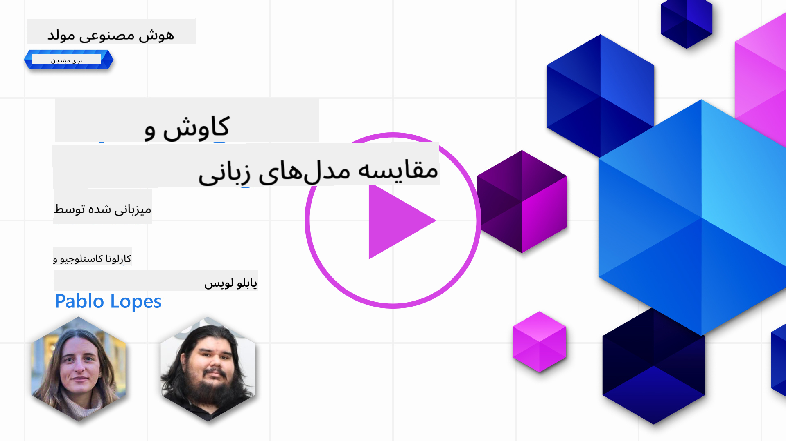
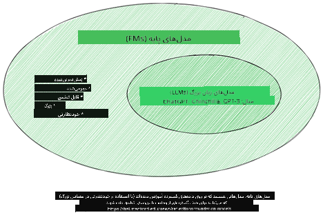
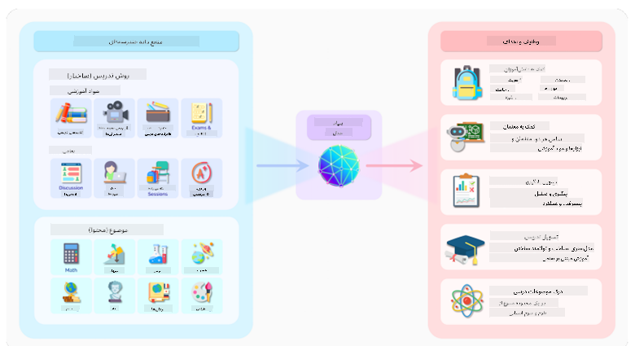
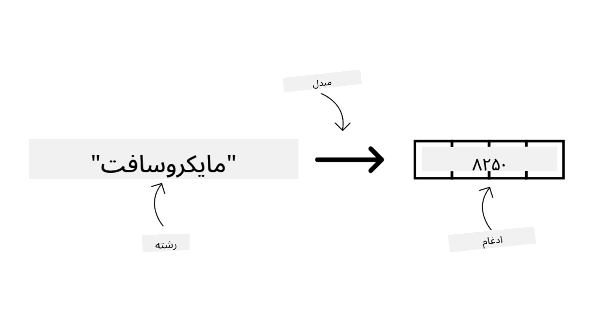
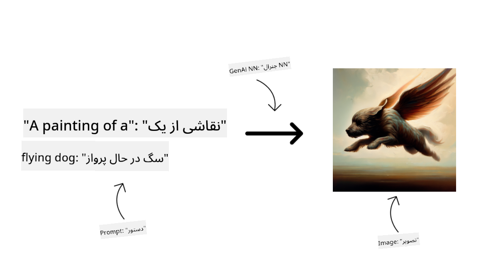
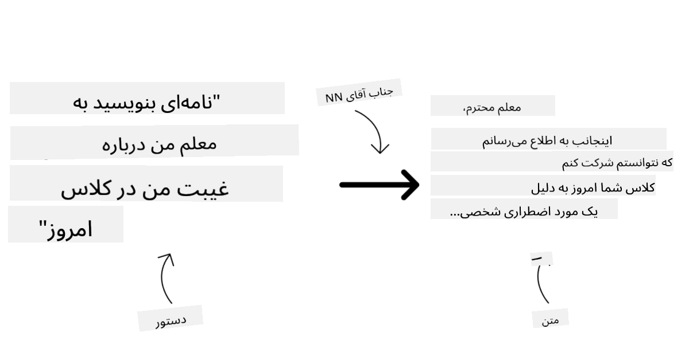
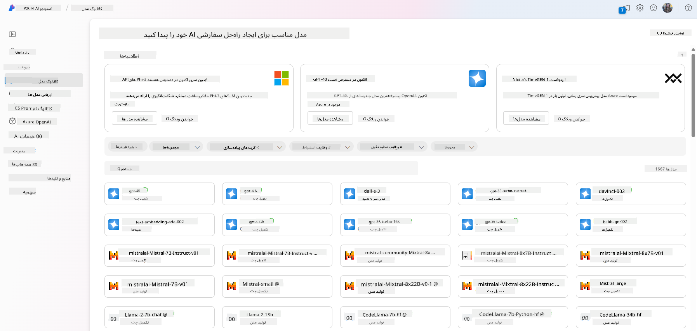
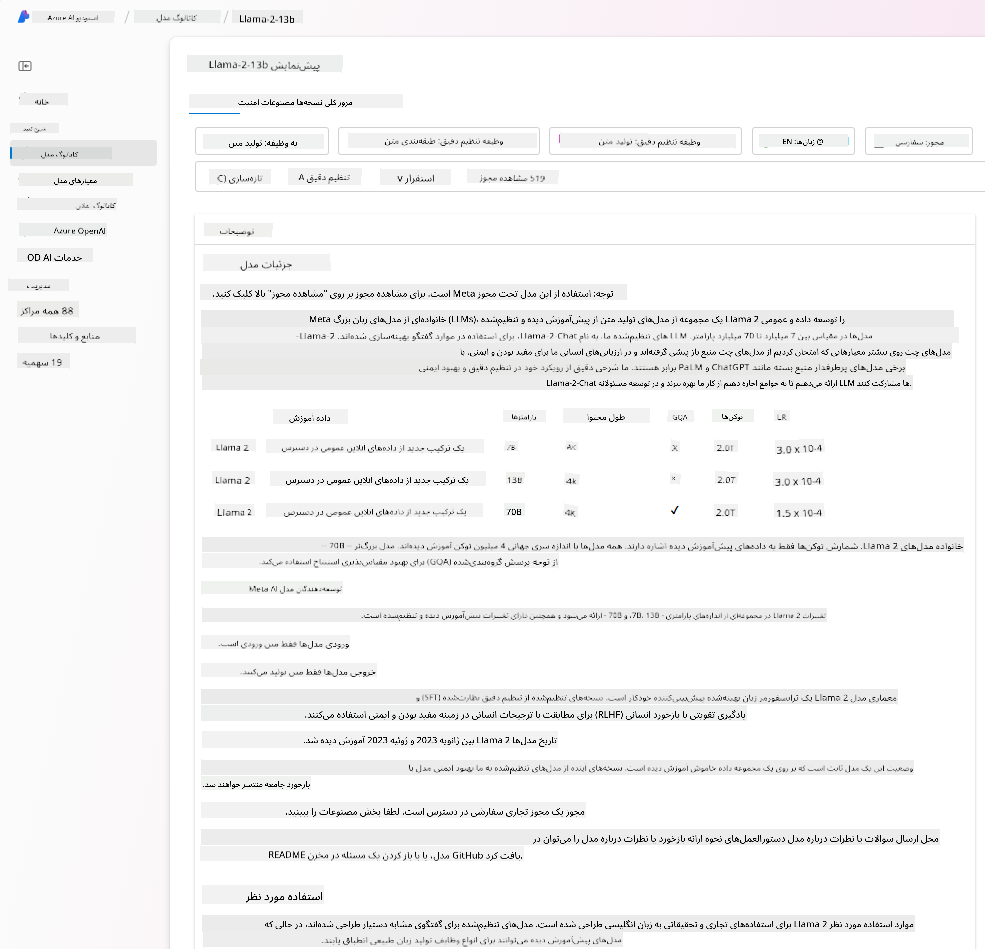
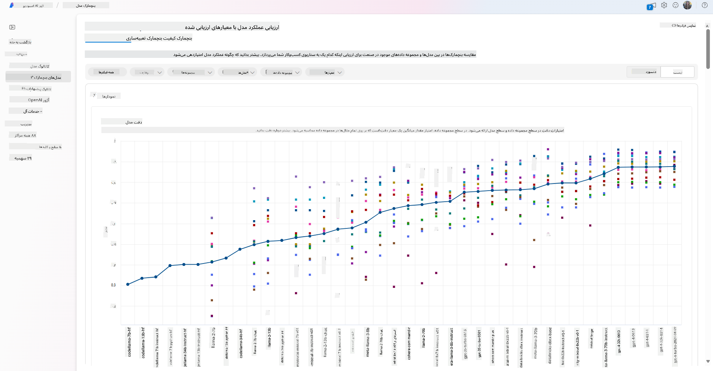
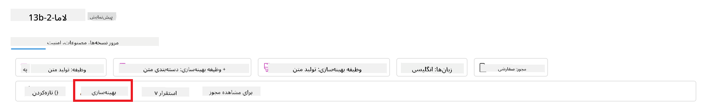

<!--
CO_OP_TRANSLATOR_METADATA:
{
  "original_hash": "e2f686f2eb794941761252ac5e8e090b",
  "translation_date": "2025-05-19T13:45:05+00:00",
  "source_file": "02-exploring-and-comparing-different-llms/README.md",
  "language_code": "fa"
}
-->
# بررسی و مقایسه مدل‌های مختلف LLM

> _برای مشاهده ویدئوی این درس روی تصویر بالا کلیک کنید_

در درس قبلی، دیدیم که چگونه هوش مصنوعی مولد در حال تغییر چشم‌انداز فناوری است، چگونه مدل‌های زبان بزرگ (LLMs) کار می‌کنند و چگونه یک کسب‌وکار - مانند استارتاپ ما - می‌تواند آنها را در موارد استفاده خود به کار گیرد و رشد کند! در این فصل، قصد داریم انواع مختلف مدل‌های زبان بزرگ (LLMs) را مقایسه و تضاد کنیم تا مزایا و معایب آنها را درک کنیم.

گام بعدی در مسیر استارتاپ ما، بررسی چشم‌انداز فعلی LLM‌ها و درک اینکه کدام یک برای موارد استفاده ما مناسب هستند.

## مقدمه

این درس شامل موارد زیر خواهد بود:

- انواع مختلف LLM‌ها در چشم‌انداز فعلی.
- آزمایش، تکرار و مقایسه مدل‌های مختلف برای موارد استفاده شما در Azure.
- چگونه یک LLM را پیاده‌سازی کنیم.

## اهداف یادگیری

پس از تکمیل این درس، شما قادر خواهید بود:

- مدل مناسب را برای موارد استفاده خود انتخاب کنید.
- درک کنید چگونه عملکرد مدل خود را آزمایش، تکرار و بهبود بخشید.
- بدانید که کسب‌وکارها چگونه مدل‌ها را پیاده‌سازی می‌کنند.

## درک انواع مختلف LLM‌ها

LLM‌ها می‌توانند بر اساس معماری، داده‌های آموزشی و موارد استفاده خود دارای دسته‌بندی‌های مختلفی باشند. درک این تفاوت‌ها به استارتاپ ما کمک می‌کند تا مدل مناسب را برای سناریو انتخاب کند و بفهمد چگونه عملکرد را آزمایش، تکرار و بهبود بخشد.

انواع مختلفی از مدل‌های LLM وجود دارد، انتخاب شما از مدل بستگی به آنچه که قصد استفاده از آنها را دارید، داده‌های شما، میزان هزینه‌ای که آماده پرداخت هستید و موارد دیگر دارد.

بسته به اینکه قصد دارید مدل‌ها را برای متن، صدا، ویدئو، تولید تصویر و غیره استفاده کنید، ممکن است نوع متفاوتی از مدل را انتخاب کنید.

- **تشخیص صدا و گفتار**. برای این منظور، مدل‌های نوع Whisper انتخاب عالی هستند زیرا آنها عمومی هستند و به تشخیص گفتار می‌پردازند. آنها بر روی صداهای متنوع آموزش دیده‌اند و می‌توانند تشخیص گفتار چندزبانه انجام دهند. بیشتر درباره [مدل‌های نوع Whisper اینجا بخوانید](https://platform.openai.com/docs/models/whisper?WT.mc_id=academic-105485-koreyst).

- **تولید تصویر**. برای تولید تصویر، DALL-E و Midjourney دو انتخاب بسیار شناخته شده هستند. DALL-E توسط Azure OpenAI ارائه می‌شود. [بیشتر درباره DALL-E اینجا بخوانید](https://platform.openai.com/docs/models/dall-e?WT.mc_id=academic-105485-koreyst) و همچنین در فصل 9 این برنامه درسی.

- **تولید متن**. بیشتر مدل‌ها بر روی تولید متن آموزش دیده‌اند و شما انتخاب‌های زیادی از GPT-3.5 تا GPT-4 دارید. آنها با هزینه‌های مختلفی عرضه می‌شوند که GPT-4 گران‌ترین است. ارزش دارد که به [زمین بازی Azure OpenAI](https://oai.azure.com/portal/playground?WT.mc_id=academic-105485-koreyst) نگاهی بیندازید تا ارزیابی کنید کدام مدل‌ها بهترین نیازهای شما را از نظر قابلیت و هزینه برآورده می‌کنند.

- **چندحالتی**. اگر به دنبال مدیریت انواع مختلف داده در ورودی و خروجی هستید، ممکن است بخواهید به مدل‌هایی مانند [gpt-4 turbo با vision یا gpt-4o](https://learn.microsoft.com/azure/ai-services/openai/concepts/models#gpt-4-and-gpt-4-turbo-models?WT.mc_id=academic-105485-koreyst) - آخرین نسخه‌های مدل‌های OpenAI - که قادر به ترکیب پردازش زبان طبیعی با درک بصری هستند و امکان تعامل از طریق رابط‌های چندحالتی را فراهم می‌کنند، نگاه کنید.

انتخاب یک مدل به معنای دریافت برخی قابلیت‌های پایه است که ممکن است کافی نباشد. اغلب شما داده‌های خاص شرکت دارید که به نوعی باید به LLM بگویید. چند انتخاب مختلف در مورد چگونگی نزدیک شدن به آن وجود دارد، بیشتر در بخش‌های آینده.

### مدل‌های پایه در مقابل LLM‌ها

اصطلاح مدل پایه توسط [پژوهشگران استنفورد](https://arxiv.org/abs/2108.07258?WT.mc_id=academic-105485-koreyst) ابداع شد و به عنوان یک مدل AI تعریف شد که برخی معیارها را دنبال می‌کند، مانند:

- **آنها با استفاده از یادگیری بدون نظارت یا یادگیری خودنظارت آموزش داده می‌شوند**، به این معنی که آنها بر روی داده‌های چندحالتی بدون برچسب آموزش داده می‌شوند و نیازی به برچسب‌گذاری یا نشانه‌گذاری انسانی داده‌ها برای فرآیند آموزش خود ندارند.
- **آنها مدل‌های بسیار بزرگی هستند**، بر اساس شبکه‌های عصبی بسیار عمیق که بر روی میلیاردها پارامتر آموزش دیده‌اند.
- **آنها معمولاً به عنوان یک "پایه" برای مدل‌های دیگر طراحی شده‌اند**، به این معنی که می‌توانند به عنوان نقطه شروع برای ساخت مدل‌های دیگر بر روی آنها استفاده شوند، که می‌توان با تنظیم دقیق انجام داد.

منبع تصویر: [راهنمای ضروری برای مدل‌های پایه و مدل‌های زبان بزرگ | توسط بابار م بهاتی | Medium
](https://thebabar.medium.com/essential-guide-to-foundation-models-and-large-language-models-27dab58f7404)

برای روشن‌تر کردن این تفاوت، بیایید ChatGPT را به عنوان مثال در نظر بگیریم. برای ساخت نسخه اول ChatGPT، مدلی به نام GPT-3.5 به عنوان مدل پایه خدمت کرد. این به این معناست که OpenAI از برخی داده‌های خاص چت استفاده کرد تا نسخه تنظیم‌شده‌ای از GPT-3.5 ایجاد کند که در عملکرد خوب در سناریوهای مکالمه‌ای، مانند چت‌بات‌ها، تخصص داشت.

منبع تصویر: [2108.07258.pdf (arxiv.org)](https://arxiv.org/pdf/2108.07258.pdf?WT.mc_id=academic-105485-koreyst)

### مدل‌های متن‌باز در مقابل مدل‌های مالکیتی

راه دیگری برای دسته‌بندی LLM‌ها این است که آیا آنها متن‌باز یا مالکیتی هستند.

مدل‌های متن‌باز مدل‌هایی هستند که در دسترس عموم قرار داده شده‌اند و می‌توانند توسط هر کسی استفاده شوند. آنها اغلب توسط شرکتی که آنها را ایجاد کرده است یا توسط جامعه پژوهشی در دسترس قرار می‌گیرند. این مدل‌ها اجازه بررسی، تغییر و سفارشی‌سازی برای موارد استفاده مختلف در LLM‌ها را می‌دهند. با این حال، آنها همیشه برای استفاده در تولید بهینه‌سازی نشده‌اند و ممکن است به اندازه مدل‌های مالکیتی عملکردی نداشته باشند. علاوه بر این، تأمین مالی برای مدل‌های متن‌باز ممکن است محدود باشد و ممکن است طولانی‌مدت نگهداری نشوند یا با آخرین پژوهش‌ها به‌روزرسانی نشوند. نمونه‌هایی از مدل‌های متن‌باز محبوب شامل [Alpaca](https://crfm.stanford.edu/2023/03/13/alpaca.html?WT.mc_id=academic-105485-koreyst)، [Bloom](https://huggingface.co/bigscience/bloom) و [LLaMA](https://llama.meta.com).

مدل‌های مالکیتی مدل‌هایی هستند که توسط یک شرکت مالکیت دارند و در دسترس عموم قرار نمی‌گیرند. این مدل‌ها اغلب برای استفاده در تولید بهینه‌سازی شده‌اند. با این حال، آنها اجازه بررسی، تغییر یا سفارشی‌سازی برای موارد استفاده مختلف را نمی‌دهند. علاوه بر این، آنها همیشه رایگان نیستند و ممکن است نیاز به اشتراک یا پرداخت برای استفاده داشته باشند. همچنین، کاربران کنترل بر داده‌هایی که برای آموزش مدل استفاده می‌شود ندارند، که به این معناست که باید به مالک مدل اعتماد کنند تا تعهد به حفظ حریم خصوصی داده‌ها و استفاده مسئولانه از AI را تضمین کند. نمونه‌هایی از مدل‌های مالکیتی محبوب شامل [مدل‌های OpenAI](https://platform.openai.com/docs/models/overview?WT.mc_id=academic-105485-koreyst)، [Google Bard](https://sapling.ai/llm/bard?WT.mc_id=academic-105485-koreyst) یا [Claude 2](https://www.anthropic.com/index/claude-2?WT.mc_id=academic-105485-koreyst).

### جاسازی در مقابل تولید تصویر در مقابل تولید متن و کد

LLM‌ها همچنین می‌توانند بر اساس خروجی‌ای که تولید می‌کنند دسته‌بندی شوند.

جاسازی‌ها مجموعه‌ای از مدل‌ها هستند که می‌توانند متن را به صورت عددی تبدیل کنند، که به عنوان جاسازی شناخته می‌شود و یک نمایش عددی از متن ورودی است. جاسازی‌ها فهم روابط بین کلمات یا جملات را برای ماشین‌ها آسان‌تر می‌کنند و می‌توانند به عنوان ورودی توسط مدل‌های دیگر مصرف شوند، مانند مدل‌های طبقه‌بندی یا مدل‌های خوشه‌بندی که عملکرد بهتری بر روی داده‌های عددی دارند. مدل‌های جاسازی اغلب برای یادگیری انتقالی استفاده می‌شوند، جایی که یک مدل برای یک وظیفه جانشین که داده‌های زیادی برای آن وجود دارد ساخته می‌شود و سپس وزن‌های مدل (جاسازی‌ها) برای وظایف پایین‌دستی دیگر دوباره استفاده می‌شوند. نمونه‌ای از این دسته‌بندی [جاسازی‌های OpenAI](https://platform.openai.com/docs/models/embeddings?WT.mc_id=academic-105485-koreyst) است.

مدل‌های تولید تصویر مدل‌هایی هستند که تصاویر تولید می‌کنند. این مدل‌ها اغلب برای ویرایش تصویر، سنتز تصویر و ترجمه تصویر استفاده می‌شوند. مدل‌های تولید تصویر اغلب بر روی مجموعه داده‌های بزرگ تصاویر، مانند [LAION-5B](https://laion.ai/blog/laion-5b/?WT.mc_id=academic-105485-koreyst)، آموزش داده می‌شوند و می‌توانند برای تولید تصاویر جدید یا ویرایش تصاویر موجود با تکنیک‌های نقاشی، فوق‌وضوح و رنگ‌آمیزی استفاده شوند. نمونه‌ها شامل [مدل‌های DALL-E-3](https://openai.com/dall-e-3?WT.mc_id=academic-105485-koreyst) و [مدل‌های انتشار پایدار](https://github.com/Stability-AI/StableDiffusion?WT.mc_id=academic-105485-koreyst) هستند.

مدل‌های تولید متن و کد مدل‌هایی هستند که متن یا کد تولید می‌کنند. این مدل‌ها اغلب برای خلاصه‌سازی متن، ترجمه و پاسخ به سوالات استفاده می‌شوند. مدل‌های تولید متن اغلب بر روی مجموعه داده‌های بزرگ متن، مانند [BookCorpus](https://www.cv-foundation.org/openaccess/content_iccv_2015/html/Zhu_Aligning_Books_and_ICCV_2015_paper.html?WT.mc_id=academic-105485-koreyst)، آموزش داده می‌شوند و می‌توانند برای تولید متن جدید یا پاسخ به سوالات استفاده شوند. مدل‌های تولید کد، مانند [CodeParrot](https://huggingface.co/codeparrot?WT.mc_id=academic-105485-koreyst)، اغلب بر روی مجموعه داده‌های بزرگ کد، مانند GitHub، آموزش داده می‌شوند و می‌توانند برای تولید کد جدید یا رفع خطاهای موجود در کد استفاده شوند.

### رمزگذار-رمزگشا در مقابل فقط رمزگشا

برای صحبت در مورد انواع مختلف معماری‌های LLM‌ها، بیایید از یک تشبیه استفاده کنیم.

تصور کنید مدیر شما وظیفه‌ای برای نوشتن یک آزمون برای دانش‌آموزان به شما داده است. شما دو همکار دارید؛ یکی مسئول ایجاد محتوا و دیگری مسئول بررسی آنها است.

سازنده محتوا مانند یک مدل فقط رمزگشا است، او می‌تواند به موضوع نگاه کند و ببیند که شما چه چیزی قبلاً نوشته‌اید و سپس بر اساس آن یک دوره بنویسد. او در نوشتن محتوای جذاب و آموزنده بسیار خوب است، اما در درک موضوع و اهداف یادگیری چندان خوب نیست. برخی مثال‌های مدل‌های رمزگشا خانواده GPT هستند، مانند GPT-3.

بازبین مانند یک مدل فقط رمزگذار است، او به دوره نوشته شده و پاسخ‌ها نگاه می‌کند، رابطه بین آنها را متوجه می‌شود و زمینه را درک می‌کند، اما در تولید محتوا خوب نیست. مثالی از مدل فقط رمزگذار BERT خواهد بود.

تصور کنید که ما می‌توانیم کسی را نیز داشته باشیم که بتواند آزمون را ایجاد و بررسی کند، این یک مدل رمزگذار-رمزگشا است. برخی مثال‌ها BART و T5 خواهند بود.

### سرویس در مقابل مدل

حالا، بیایید درباره تفاوت بین سرویس و مدل صحبت کنیم. سرویس محصولی است که توسط یک ارائه‌دهنده سرویس ابری ارائه می‌شود و اغلب ترکیبی از مدل‌ها، داده‌ها و اجزای دیگر است. مدل هسته یک سرویس است و اغلب یک مدل پایه، مانند یک LLM است.

سرویس‌ها اغلب برای استفاده در تولید بهینه‌سازی شده‌اند و اغلب آسان‌تر از مدل‌ها استفاده می‌شوند، از طریق یک رابط کاربری گرافیکی. با این حال، سرویس‌ها همیشه رایگان نیستند و ممکن است نیاز به اشتراک یا پرداخت برای استفاده داشته باشند، در ازای استفاده از تجهیزات و منابع مالک سرویس، بهینه‌سازی هزینه‌ها و مقیاس‌پذیری آسان. مثالی از سرویس [Azure OpenAI Service](https://learn.microsoft.com/azure/ai-services/openai/overview?WT.mc_id=academic-105485-koreyst) است که یک برنامه نرخ پرداخت به‌ازای‌استفاده ارائه می‌دهد، به این معنی که کاربران به‌طور متناسب با میزان استفاده از سرویس شارژ می‌شوند. همچنین، Azure OpenAI Service امنیت درجه‌سازمانی و چارچوب AI مسئولانه‌ای را بر روی قابلیت‌های مدل‌ها ارائه می‌دهد.

مدل‌ها فقط شبکه عصبی هستند، با پارامترها، وزن‌ها و غیره. اجازه می‌دهند شرکت‌ها به صورت محلی اجرا کنند، اما نیاز به خرید تجهیزات، ساختار برای مقیاس‌پذیری و خرید مجوز یا استفاده از مدل متن‌باز دارند. مدل LLaMA به صورت قابل استفاده در دسترس است و نیاز به قدرت محاسباتی برای اجرای مدل دارد.

## چگونه با مدل‌های مختلف در Azure عملکرد را آزمایش و تکرار کنیم

پس از اینکه تیم ما چشم‌انداز فعلی LLM‌ها را بررسی کرده و برخی کاندیدای خوب برای سناریوهای خود شناسایی کرده است، گام بعدی آزمایش آنها بر روی داده‌ها و بار کاری آنها است. این یک فرآیند تکراری است که توسط آزمایش‌ها و اندازه‌گیری‌ها انجام می‌شود.
بیشتر مدل‌هایی که در پاراگراف‌های قبلی ذکر کردیم (مدل‌های OpenAI، مدل‌های متن‌باز مانند Llama2، و ترانسفورمرهای Hugging Face) در [کاتالوگ مدل](https://learn.microsoft.com/azure/ai-studio/how-to/model-catalog-overview?WT.mc_id=academic-105485-koreyst) در [Azure AI Studio](https://ai.azure.com/?WT.mc_id=academic-105485-koreyst) موجود هستند.

[Azure AI Studio](https://learn.microsoft.com/azure/ai-studio/what-is-ai-studio?WT.mc_id=academic-105485-koreyst) یک پلتفرم ابری است که برای توسعه‌دهندگان طراحی شده تا برنامه‌های AI مولد بسازند و کل چرخه توسعه را مدیریت کنند - از آزمایش تا ارزیابی - با ترکیب تمام خدمات AI Azure در یک مرکز واحد با یک رابط کاربری گرافیکی مناسب. کاتالوگ مدل در Azure AI Studio به کاربر امکان می‌دهد:

- مدل پایه مورد نظر را در کاتالوگ پیدا کند - چه مالکیتی یا متن‌باز، با فیلتر کردن بر اساس وظیفه، مجوز یا نام. برای بهبود قابلیت جستجو، مدل‌ها به مجموعه‌هایی سازماندهی شده‌اند، مانند مجموعه Azure OpenAI، مجموعه Hugging Face و بیشتر.

- کارت مدل را مرور کنید، شامل توضیحات دقیق استفاده مورد نظر و داده‌های آموزشی، نمونه‌های کد و نتایج ارزیابی در کتابخانه ارزیابی داخلی.

- مقایسه معیارها بین مدل‌ها و مجموعه داده‌های موجود در صنعت برای ارزیابی اینکه کدام یک نیازهای کسب‌وکار را برآورده می‌کند، از طریق پنل [معیارهای مدل](https://learn.microsoft.com/azure/ai-studio/how-to/model-benchmarks?WT.mc_id=academic-105485-koreyst).

- مدل را بر روی داده‌های آموزشی سفارشی تنظیم کنید تا عملکرد مدل در یک بار کاری خاص بهبود یابد، با استفاده از قابلیت‌های آزمایش و ردیابی Azure AI Studio.

- مدل اولیه از پیش‌آموزش داده شده یا نسخه تنظیم دقیق شده را به استنتاج واقعی از راه دور - محاسبه مدیریت شده - یا نقطه پایانی API بدون سرور - [پرداخت به ازای استفاده](https://learn.microsoft.com/azure/ai-studio/how-to/model-catalog-overview#model-deployment-managed-compute-and-serverless-api-pay-as-you-go?WT.mc_id=academic-105485-koreyst) - برای امکان مصرف آن توسط برنامه‌ها، مستقر کنید.

> [!NOTE]
> همه مدل‌ها در کاتالوگ در حال حاضر برای تنظیم دقیق و/یا استقرار پرداخت به ازای استفاده در دسترس نیستند. جزئیات مربوط به قابلیت‌ها و محدودیت‌های مدل را در کارت مدل بررسی کنید.

## بهبود نتایج LLM

ما با تیم استارتاپی خود انواع مختلفی از LLMها و یک پلتفرم ابری (Azure Machine Learning) را بررسی کرده‌ایم که به ما امکان می‌دهد مدل‌های مختلف را مقایسه کنیم، آنها را بر روی داده‌های آزمایشی ارزیابی کنیم، عملکرد را بهبود دهیم و آنها را بر روی نقاط پایانی استنتاج مستقر کنیم.

اما چه زمانی باید تنظیم دقیق یک مدل را به جای استفاده از یک مدل از پیش‌آموزش داده شده در نظر بگیرند؟ آیا رویکردهای دیگری برای بهبود عملکرد مدل در بارهای کاری خاص وجود دارد؟

چندین رویکرد وجود دارد که یک کسب‌وکار می‌تواند از آنها برای دستیابی به نتایج مورد نیاز از یک LLM استفاده کند. شما می‌توانید انواع مختلفی از مدل‌ها را با درجات مختلف آموزش انتخاب کنید که هنگام استقرار یک LLM در تولید، با سطوح مختلف پیچیدگی، هزینه و کیفیت همراه است. در اینجا برخی از رویکردهای مختلف وجود دارد:

- **مهندسی پرامپت با زمینه**. ایده این است که هنگام پرامپت دادن، زمینه کافی ارائه دهید تا اطمینان حاصل کنید که پاسخ‌های مورد نیاز خود را دریافت می‌کنید.

- **تولید تقویت‌شده با بازیابی، RAG**. داده‌های شما ممکن است در یک پایگاه داده یا نقطه پایانی وب وجود داشته باشد، به عنوان مثال، برای اطمینان از اینکه این داده‌ها یا زیرمجموعه‌ای از آن‌ها در زمان پرامپت‌دهی شامل می‌شود، می‌توانید داده‌های مربوطه را بازیابی کرده و آن را به عنوان بخشی از پرامپت کاربر قرار دهید.

- **مدل تنظیم دقیق شده**. در اینجا، شما مدل را بیشتر بر روی داده‌های خود آموزش داده‌اید که منجر به مدل دقیق‌تر و پاسخگوتر به نیازهای شما شده است، اما ممکن است هزینه‌بر باشد.

منبع تصویر: [چهار راه که شرکت‌ها LLMها را مستقر می‌کنند | وبلاگ Fiddler AI](https://www.fiddler.ai/blog/four-ways-that-enterprises-deploy-llms?WT.mc_id=academic-105485-koreyst)

### مهندسی پرامپت با زمینه

LLMهای از پیش‌آموزش داده شده در وظایف زبان طبیعی عمومی بسیار خوب عمل می‌کنند، حتی با یک پرامپت کوتاه مانند یک جمله برای تکمیل یا یک سوال - یادگیری "بدون شات" نامیده می‌شود.

با این حال، هرچه کاربر بتواند درخواست خود را با یک درخواست دقیق و مثال‌ها - زمینه - بهتر فریم کند، پاسخ دقیق‌تر و نزدیک‌تر به انتظارات کاربر خواهد بود. در این حالت، اگر پرامپت تنها یک مثال داشته باشد، از یادگیری "یک شات" صحبت می‌کنیم و اگر چندین مثال داشته باشد، از یادگیری "چند شات" صحبت می‌کنیم. مهندسی پرامپت با زمینه، مقرون به صرفه‌ترین رویکرد برای شروع است.

### تولید تقویت‌شده با بازیابی (RAG)

LLMها محدودیت دارند که فقط می‌توانند از داده‌هایی که در طول آموزش‌شان استفاده شده است، برای تولید پاسخ استفاده کنند. این بدان معناست که آنها چیزی درباره واقعیت‌هایی که پس از فرآیند آموزش‌شان اتفاق افتاده‌اند نمی‌دانند و نمی‌توانند به اطلاعات غیرعمومی (مانند داده‌های شرکت) دسترسی پیدا کنند.
این محدودیت می‌تواند از طریق RAG، تکنیکی که پرامپت را با داده‌های خارجی به صورت قطعاتی از اسناد تقویت می‌کند، برطرف شود، با توجه به محدودیت طول پرامپت. این تکنیک توسط ابزارهای پایگاه داده برداری (مانند [Azure Vector Search](https://learn.microsoft.com/azure/search/vector-search-overview?WT.mc_id=academic-105485-koreyst)) پشتیبانی می‌شود که قطعات مفید را از منابع داده متنوع از پیش تعریف شده بازیابی کرده و آنها را به زمینه پرامپت اضافه می‌کنند.

این تکنیک بسیار مفید است زمانی که یک کسب‌وکار داده کافی، زمان کافی یا منابع کافی برای تنظیم دقیق یک LLM ندارد، اما همچنان می‌خواهد عملکرد را در یک بار کاری خاص بهبود دهد و خطرات ساختگی، یعنی تحریف واقعیت یا محتوای مضر را کاهش دهد.

### مدل تنظیم دقیق شده

تنظیم دقیق یک فرآیند است که از یادگیری انتقالی برای "تطبیق" مدل با یک وظیفه پایین‌دستی یا حل یک مشکل خاص استفاده می‌کند. برخلاف یادگیری چند شات و RAG، منجر به تولید یک مدل جدید با وزن‌ها و بایاس‌های به‌روز شده می‌شود. این نیاز به مجموعه‌ای از مثال‌های آموزشی دارد که شامل یک ورودی واحد (پرامپت) و خروجی مرتبط با آن (تکمیل) است.
این رویکرد ترجیحی خواهد بود اگر:

- **استفاده از مدل‌های تنظیم دقیق شده**. یک کسب‌وکار بخواهد از مدل‌های تنظیم دقیق شده کمتر توانمند (مانند مدل‌های جاسازی) به جای مدل‌های با عملکرد بالا استفاده کند، که منجر به یک راه‌حل مقرون به صرفه‌تر و سریع‌تر می‌شود.

- **در نظر گرفتن تأخیر**. تأخیر برای یک مورد استفاده خاص مهم است، بنابراین امکان استفاده از پرامپت‌های بسیار طولانی وجود ندارد یا تعداد مثال‌هایی که باید از مدل یاد گرفته شود با محدودیت طول پرامپت سازگار نیست.

- **به‌روز بودن**. یک کسب‌وکار داده‌های با کیفیت بالا و برچسب‌های حقیقت زمین زیادی دارد و منابع مورد نیاز برای نگهداری این داده‌ها به‌روز است.

### مدل آموزش‌دیده

آموزش یک LLM از ابتدا بدون شک دشوارترین و پیچیده‌ترین رویکردی است که باید اتخاذ کرد، که نیاز به مقادیر عظیمی از داده، منابع ماهر و قدرت محاسباتی مناسب دارد. این گزینه باید فقط در سناریویی در نظر گرفته شود که یک کسب‌وکار دارای یک مورد استفاده خاص دامنه و مقدار زیادی از داده‌های متمرکز بر دامنه باشد.

## بررسی دانش

چه رویکرد خوبی برای بهبود نتایج تکمیل LLM می‌تواند باشد؟

1. مهندسی پرامپت با زمینه
1. RAG
1. مدل تنظیم دقیق شده

A:3، اگر زمان و منابع و داده‌های با کیفیت بالا دارید، تنظیم دقیق گزینه بهتری برای به‌روز بودن است. با این حال، اگر به دنبال بهبود چیزها هستید و زمان کافی ندارید، ابتدا ارزش دارد RAG را در نظر بگیرید.

## 🚀 چالش

بیشتر بخوانید که چگونه می‌توانید [از RAG استفاده کنید](https://learn.microsoft.com/azure/search/retrieval-augmented-generation-overview?WT.mc_id=academic-105485-koreyst) برای کسب‌وکار خود.

## کار عالی، ادامه یادگیری

پس از تکمیل این درس، مجموعه [یادگیری هوش مصنوعی تولیدی](https://aka.ms/genai-collection?WT.mc_id=academic-105485-koreyst) ما را بررسی کنید تا به یادگیری خود در زمینه هوش مصنوعی تولیدی ادامه دهید!

به درس 3 بروید که در آن خواهیم دید چگونه [با مسئولیت‌پذیری با هوش مصنوعی تولیدی بسازیم](../03-using-generative-ai-responsibly/README.md?WT.mc_id=academic-105485-koreyst)!

**سلب مسئولیت**:  
این سند با استفاده از سرویس ترجمه هوش مصنوعی [Co-op Translator](https://github.com/Azure/co-op-translator) ترجمه شده است. در حالی که ما برای دقت تلاش می‌کنیم، لطفاً توجه داشته باشید که ترجمه‌های خودکار ممکن است حاوی خطاها یا نادرستی‌ها باشند. سند اصلی به زبان مادری آن باید به عنوان منبع معتبر در نظر گرفته شود. برای اطلاعات حیاتی، ترجمه حرفه‌ای انسانی توصیه می‌شود. ما مسئولیتی در قبال هرگونه سوء تفاهم یا تفسیر اشتباه ناشی از استفاده از این ترجمه نداریم.