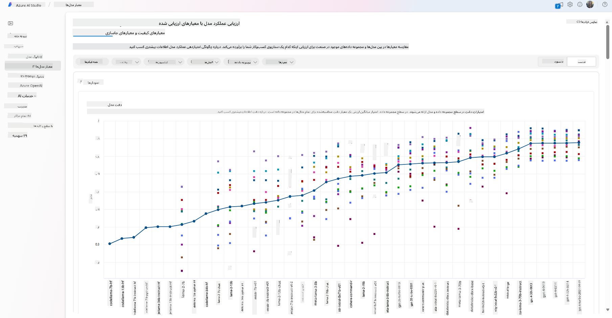
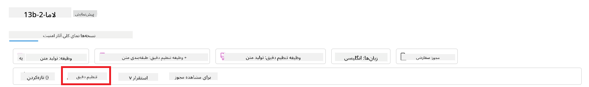
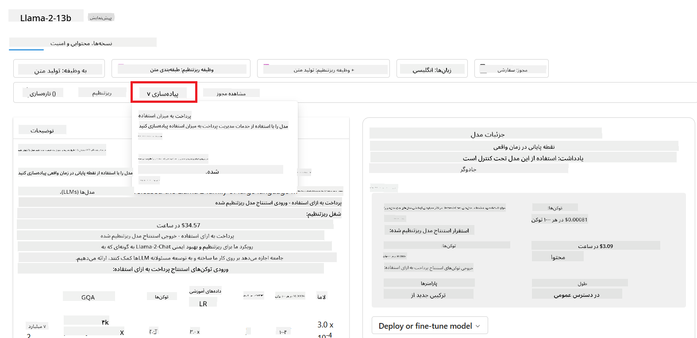
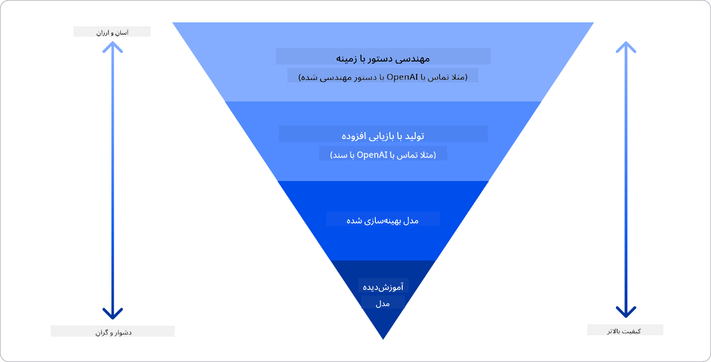

<!--
CO_OP_TRANSLATOR_METADATA:
{
  "original_hash": "e2f686f2eb794941761252ac5e8e090b",
  "translation_date": "2025-06-25T10:17:41+00:00",
  "source_file": "02-exploring-and-comparing-different-llms/README.md",
  "language_code": "fa"
}
-->
# بررسی و مقایسه مدل‌های مختلف LLM

> _روی تصویر بالا کلیک کنید تا ویدئوی این درس را مشاهده کنید_

در درس قبلی، دیدیم که چگونه هوش مصنوعی مولد در حال تغییر چشم‌انداز فناوری است، مدل‌های زبان بزرگ (LLM) چگونه کار می‌کنند و چگونه یک کسب‌وکار - مانند استارتاپ ما - می‌تواند آن‌ها را در موارد استفاده خود به کار ببرد و رشد کند! در این فصل، قصد داریم انواع مختلف مدل‌های زبان بزرگ (LLM) را مقایسه و تفاوت‌های آن‌ها را بررسی کنیم تا مزایا و معایب آن‌ها را درک کنیم.

گام بعدی در سفر استارتاپ ما، بررسی چشم‌انداز فعلی LLMها و درک اینکه کدام یک برای مورد استفاده ما مناسب هستند، است.

## مقدمه

این درس شامل موارد زیر خواهد بود:

- انواع مختلف LLMها در چشم‌انداز فعلی.
- تست، تکرار و مقایسه مدل‌های مختلف برای مورد استفاده شما در Azure.
- نحوه استقرار یک LLM.

## اهداف یادگیری

پس از تکمیل این درس، شما قادر خواهید بود:

- مدل مناسب برای مورد استفاده خود را انتخاب کنید.
- درک کنید چگونه عملکرد مدل خود را تست، تکرار و بهبود دهید.
- بدانید چگونه کسب‌وکارها مدل‌ها را مستقر می‌کنند.

## درک انواع مختلف LLMها

LLMها می‌توانند بر اساس معماری، داده‌های آموزشی و مورد استفاده خود به دسته‌های مختلفی تقسیم شوند. درک این تفاوت‌ها به استارتاپ ما کمک می‌کند مدل مناسب برای سناریو را انتخاب کند و نحوه تست، تکرار و بهبود عملکرد را درک کند.

انواع مختلفی از مدل‌های LLM وجود دارد و انتخاب مدل شما بستگی به هدف استفاده، داده‌های شما، میزان هزینه‌ای که آماده پرداخت آن هستید و موارد دیگر دارد.

بسته به اینکه آیا قصد دارید از مدل‌ها برای تولید متن، صدا، ویدئو، تصویر و غیره استفاده کنید، ممکن است نوع متفاوتی از مدل را انتخاب کنید.

- **تشخیص صدا و گفتار**. برای این منظور، مدل‌های نوع Whisper انتخاب بسیار خوبی هستند زیرا آنها عمومی هستند و به تشخیص گفتار می‌پردازند. این مدل‌ها بر روی صداهای متنوعی آموزش دیده‌اند و می‌توانند تشخیص گفتار چند زبانه را انجام دهند. بیشتر درباره [مدل‌های نوع Whisper اینجا بخوانید](https://platform.openai.com/docs/models/whisper?WT.mc_id=academic-105485-koreyst).

- **تولید تصویر**. برای تولید تصویر، DALL-E و Midjourney دو انتخاب بسیار شناخته شده هستند. DALL-E توسط Azure OpenAI ارائه می‌شود. [بیشتر درباره DALL-E اینجا بخوانید](https://platform.openai.com/docs/models/dall-e?WT.mc_id=academic-105485-koreyst) و همچنین در فصل 9 این برنامه درسی.

- **تولید متن**. بیشتر مدل‌ها بر روی تولید متن آموزش دیده‌اند و شما انتخاب‌های زیادی از GPT-3.5 تا GPT-4 دارید. آن‌ها با هزینه‌های مختلفی ارائه می‌شوند که GPT-4 گران‌ترین است. ارزش بررسی [پلی‌گراند Azure OpenAI](https://oai.azure.com/portal/playground?WT.mc_id=academic-105485-koreyst) را دارد تا ارزیابی کنید کدام مدل‌ها بهترین تناسب را از نظر قابلیت و هزینه برای نیازهای شما دارند.

- **چند حالته**. اگر به دنبال مدیریت انواع مختلف داده در ورودی و خروجی هستید، ممکن است بخواهید به مدل‌هایی مانند [gpt-4 turbo با قابلیت دیداری یا gpt-4o](https://learn.microsoft.com/azure/ai-services/openai/concepts/models#gpt-4-and-gpt-4-turbo-models?WT.mc_id=academic-105485-koreyst) نگاه کنید - آخرین نسخه‌های مدل‌های OpenAI - که قادر به ترکیب پردازش زبان طبیعی با درک بصری هستند و امکان تعامل از طریق رابط‌های چند حالته را فراهم می‌کنند.

انتخاب یک مدل به معنای دریافت برخی قابلیت‌های پایه است که ممکن است کافی نباشد. اغلب شما داده‌های خاص شرکت دارید که باید به نوعی به LLM اطلاع دهید. چندین انتخاب مختلف برای نزدیک شدن به این موضوع وجود دارد که در بخش‌های بعدی بیشتر به آن پرداخته می‌شود.

### مدل‌های پایه در مقابل LLMها

اصطلاح مدل پایه توسط [پژوهشگران استنفورد](https://arxiv.org/abs/2108.07258?WT.mc_id=academic-105485-koreyst) معرفی شد و به عنوان یک مدل هوش مصنوعی تعریف شد که معیارهایی مانند:

- **آن‌ها با استفاده از یادگیری بدون نظارت یا یادگیری خود نظارتی آموزش داده می‌شوند**، به این معنی که بر روی داده‌های چند حالته بدون برچسب آموزش دیده‌اند و نیازی به حاشیه‌نویسی یا برچسب‌گذاری انسانی برای فرآیند آموزشی خود ندارند.
- **آن‌ها مدل‌های بسیار بزرگی هستند**، بر اساس شبکه‌های عصبی بسیار عمیق که بر روی میلیاردها پارامتر آموزش دیده‌اند.
- **آن‌ها معمولاً به عنوان یک "پایه" برای مدل‌های دیگر در نظر گرفته می‌شوند**، به این معنی که می‌توانند به عنوان نقطه شروعی برای ساخت مدل‌های دیگر استفاده شوند که می‌توان با تنظیم دقیق آن‌ها انجام داد.

برای روشن‌تر کردن این تمایز، بیایید ChatGPT را به عنوان یک مثال در نظر بگیریم. برای ساخت نسخه اول ChatGPT، مدلی به نام GPT-3.5 به عنوان مدل پایه عمل کرد. این به این معنی است که OpenAI از برخی داده‌های خاص چت برای ایجاد یک نسخه تنظیم شده از GPT-3.5 استفاده کرد که در انجام خوب در سناریوهای مکالمه‌ای، مانند چت‌بات‌ها، تخصص داشت.

### مدل‌های متن باز در مقابل مدل‌های اختصاصی

یکی دیگر از روش‌های دسته‌بندی LLMها این است که آیا آن‌ها متن باز یا اختصاصی هستند.

مدل‌های متن باز مدل‌هایی هستند که به عموم ارائه می‌شوند و می‌توانند توسط هر کسی استفاده شوند. آن‌ها اغلب توسط شرکتی که آن‌ها را ایجاد کرده است یا جامعه پژوهشی ارائه می‌شوند. این مدل‌ها اجازه دارند که بررسی، تغییر و برای موارد استفاده مختلف در LLMها سفارشی شوند. با این حال، آن‌ها همیشه برای استفاده تولیدی بهینه‌سازی نشده‌اند و ممکن است به اندازه مدل‌های اختصاصی کارآمد نباشند. علاوه بر این، تأمین مالی برای مدل‌های متن باز ممکن است محدود باشد و ممکن است به طور بلندمدت نگهداری نشوند یا با جدیدترین پژوهش‌ها به‌روزرسانی نشوند. نمونه‌هایی از مدل‌های متن باز محبوب شامل [Alpaca](https://crfm.stanford.edu/2023/03/13/alpaca.html?WT.mc_id=academic-105485-koreyst)، [Bloom](https://huggingface.co/bigscience/bloom) و [LLaMA](https://llama.meta.com) هستند.

مدل‌های اختصاصی مدل‌هایی هستند که توسط یک شرکت مالکیت می‌شوند و به عموم ارائه نمی‌شوند. این مدل‌ها اغلب برای استفاده تولیدی بهینه‌سازی شده‌اند. با این حال، آن‌ها اجازه بررسی، تغییر یا سفارشی‌سازی برای موارد استفاده مختلف را ندارند. علاوه بر این، آن‌ها همیشه به صورت رایگان در دسترس نیستند و ممکن است نیاز به اشتراک یا پرداخت برای استفاده داشته باشند. همچنین، کاربران کنترلی بر داده‌هایی که برای آموزش مدل استفاده می‌شود ندارند، که به این معنی است که باید به مالک مدل اعتماد کنند تا به تعهدات مربوط به حریم خصوصی داده و استفاده مسئولانه از هوش مصنوعی پایبند باشد. نمونه‌هایی از مدل‌های اختصاصی محبوب شامل [مدل‌های OpenAI](https://platform.openai.com/docs/models/overview?WT.mc_id=academic-105485-koreyst)، [Google Bard](https://sapling.ai/llm/bard?WT.mc_id=academic-105485-koreyst) یا [Claude 2](https://www.anthropic.com/index/claude-2?WT.mc_id=academic-105485-koreyst) هستند.

### تعبیه در مقابل تولید تصویر در مقابل تولید متن و کد

LLMها همچنین می‌توانند بر اساس خروجی که تولید می‌کنند دسته‌بندی شوند.

تعبیه‌ها مجموعه‌ای از مدل‌ها هستند که می‌توانند متن را به صورت عددی تبدیل کنند، که به آن تعبیه گفته می‌شود، که یک نمایش عددی از متن ورودی است. تعبیه‌ها درک روابط بین کلمات یا جملات را برای ماشین‌ها آسان‌تر می‌کنند و می‌توانند به عنوان ورودی توسط مدل‌های دیگر، مانند مدل‌های طبقه‌بندی یا مدل‌های خوشه‌بندی که عملکرد بهتری بر روی داده‌های عددی دارند، مصرف شوند. مدل‌های تعبیه اغلب برای یادگیری انتقالی استفاده می‌شوند، جایی که یک مدل برای یک وظیفه جانشین که برای آن داده‌های زیادی وجود دارد ساخته می‌شود و سپس وزن‌های مدل (تعبیه‌ها) برای وظایف پایین‌دستی دیگر استفاده می‌شوند. نمونه‌ای از این دسته [تعبیه‌های OpenAI](https://platform.openai.com/docs/models/embeddings?WT.mc_id=academic-105485-koreyst) است.

مدل‌های تولید تصویر مدل‌هایی هستند که تصاویر تولید می‌کنند. این مدل‌ها اغلب برای ویرایش تصویر، سنتز تصویر و ترجمه تصویر استفاده می‌شوند. مدل‌های تولید تصویر اغلب بر روی مجموعه‌های داده بزرگی از تصاویر، مانند [LAION-5B](https://laion.ai/blog/laion-5b/?WT.mc_id=academic-105485-koreyst)، آموزش دیده‌اند و می‌توانند برای تولید تصاویر جدید یا ویرایش تصاویر موجود با تکنیک‌های نقاشی درون، ابررزولوشن و رنگ‌آمیزی استفاده شوند. نمونه‌هایی شامل [DALL-E-3](https://openai.com/dall-e-3?WT.mc_id=academic-105485-koreyst) و [مدل‌های Stable Diffusion](https://github.com/Stability-AI/StableDiffusion?WT.mc_id=academic-105485-koreyst) هستند.

مدل‌های تولید متن و کد مدل‌هایی هستند که متن یا کد تولید می‌کنند. این مدل‌ها اغلب برای خلاصه‌سازی متن، ترجمه و پاسخ به سوالات استفاده می‌شوند. مدل‌های تولید متن اغلب بر روی مجموعه‌های داده بزرگی از متن، مانند [BookCorpus](https://www.cv-foundation.org/openaccess/content_iccv_2015/html/Zhu_Aligning_Books_and_ICCV_2015_paper.html?WT.mc_id=academic-105485-koreyst)، آموزش دیده‌اند و می‌توانند برای تولید متن جدید یا پاسخ به سوالات استفاده شوند. مدل‌های تولید کد، مانند [CodeParrot](https://huggingface.co/codeparrot?WT.mc_id=academic-105485-koreyst)، اغلب بر روی مجموعه‌های داده بزرگی از کد، مانند GitHub، آموزش دیده‌اند و می‌توانند برای تولید کد جدید یا رفع اشکال در کد موجود استفاده شوند.

### مدل‌های رمزگذار-رمزگشا در مقابل تنها رمزگشا

برای صحبت در مورد انواع مختلف معماری‌های LLMها، بیایید از یک تشبیه استفاده کنیم.

تصور کنید مدیر شما به شما وظیفه داده است که یک آزمون برای دانش‌آموزان بنویسید. شما دو همکار دارید؛ یکی مسئول ایجاد محتوا و دیگری مسئول بازبینی آن‌ها است.

ایجاد کننده محتوا مانند یک مدل تنها رمزگشا است، آن‌ها می‌توانند به موضوع نگاه کنند و ببینند که شما چه چیزی قبلاً نوشته‌اید و سپس می‌توانند یک دوره بر اساس آن بنویسند. آن‌ها در نوشتن محتوای جذاب و آموزنده بسیار خوب هستند، اما در درک موضوع و اهداف یادگیری خیلی خوب نیستند. برخی از نمونه‌های مدل‌های رمزگشا، مدل‌های خانواده GPT هستند، مانند GPT-3.

بازبین مانند یک مدل تنها رمزگذار است، آن‌ها به دوره نوشته شده و پاسخ‌ها نگاه می‌کنند، روابط بین آن‌ها را درک کرده و زمینه را درک می‌کنند، اما در تولید محتوا خوب نیستند. نمونه‌ای از مدل تنها رمزگذار BERT است.

تصور کنید که ما می‌توانیم کسی را نیز داشته باشیم که بتواند آزمون را ایجاد و بازبینی کند، این یک مدل رمزگذار-رمزگشا است. برخی از نمونه‌ها BART و T5 هستند.

### سرویس در مقابل مدل

حالا، بیایید در مورد تفاوت بین یک سرویس و یک مدل صحبت کنیم. یک سرویس محصولی است که توسط یک ارائه‌دهنده خدمات ابری ارائه می‌شود و اغلب ترکیبی از مدل‌ها، داده‌ها و اجزای دیگر است. یک مدل هسته اصلی یک سرویس است و اغلب یک مدل پایه، مانند یک LLM، است.

سرویس‌ها اغلب برای استفاده تولیدی بهینه‌سازی شده‌اند و اغلب از طریق یک رابط کاربری گرافیکی آسان‌تر از مدل‌ها استفاده می‌شوند. با این حال، سرویس‌ها همیشه به صورت رایگان در دسترس نیستند و ممکن است نیاز به اشتراک یا پرداخت برای استفاده داشته باشند، در ازای استفاده از تجهیزات و منابع مالک سرویس، بهینه‌سازی هزینه‌ها و مقیاس‌پذیری آسان. نمونه‌ای از یک سرویس [سرویس Azure OpenAI](https://learn.microsoft.com/azure/ai-services/openai/overview?WT.mc_id=academic-105485-koreyst) است که یک طرح پرداخت به میزان استفاده ارائه می‌دهد، به این معنی که کاربران به تناسب میزان استفاده خود از سرویس هزینه می‌کنند. همچنین، سرویس Azure OpenAI امنیت درجه یک برای شرکت‌ها و یک چارچوب هوش مصنوعی مسئولانه را بر روی قابلیت‌های مدل‌ها ارائه می‌دهد.

مدل‌ها تنها شبکه عصبی هستند، با پارامترها، وزن‌ها و دیگر موارد. این امکان را به شرکت‌ها می‌دهد که به صورت محلی اجرا کنند، با این حال، نیاز به خرید تجهیزات، ساختار برای مقیاس‌پذیری و خرید مجوز یا استفاده از یک مدل متن باز دارند. مدلی مانند LLaMA برای استفاده در دسترس است و نیاز به قدرت محاسباتی برای اجرای مدل دارد.

## چگونه با مدل‌های مختلف تست و تکرار کنیم تا عملکرد را در Azure درک کنیم

پس از اینکه تیم ما چشم‌انداز فعلی LLMها را بررسی کرد و برخی از نامزدهای خوب برای سناریوهای خود شناسایی کرد، گام بعدی تست آن‌ها بر روی داده‌ها و بار کاری خود است. این یک فرآیند تکراری است که با آزمایش‌ها و اندازه‌گیری‌ها انجام می‌شود.
بیشتر مدل‌هایی که در پاراگراف‌های قبلی به آن‌ها اشاره کردیم (مدل‌های OpenAI، مدل‌های متن باز مانند Llama2 و تبدیل‌کننده‌های Hugging Face) در [کاتالوگ مدل](https://learn.microsoft.com/azure/ai-studio/how-to/model-catalog-overview?WT.mc_id=academic-105485-koreyst) در [Azure AI Studio](https://ai.azure.com/?WT.mc_id=academic-105485-koreyst) در دسترس هستند.

[Azure AI Studio](https://learn.microsoft.com/azure/ai-studio/what-is-ai-studio?WT.mc_id=academic-105485-koreyst) یک پلتفرم ابری است که برای توسعه‌دهندگان طراحی شده است تا برنامه‌های هوش مصنوعی مولد را بسازند و کل چرخه توسعه را مدیریت کنند - از آزمایش تا ارزیابی - با ترکیب همه خدمات Azure AI در یک هاب واحد با یک رابط کاربری گرافیکی راحت. کاتالوگ مدل در Azure AI Studio به کاربر امکان می‌دهد:

- مدل پایه مورد نظر را در کاتالوگ پیدا کند - چه اختصاصی و چه متن باز، با فیلتر کردن بر اساس وظیفه، مجوز یا نام. برای بهبود جستجوپذیری، مدل‌ها به مجموعه‌هایی مانند مجموعه Azure OpenAI، مجموعه Hugging Face و غیره سازماندهی شده‌اند.

- کارت مدل را مرور کند، شامل توضیحات دقیق از استفاده مورد نظر و داده‌های آموزشی، نمونه‌های کد و نتایج ارزیابی در کتابخانه ارزیابی داخلی.
- مقایسه‌ی معیارها در مدل‌ها و مجموعه داده‌های موجود در صنعت برای ارزیابی اینکه کدام یک با سناریوی کسب‌وکار هماهنگ است، از طریق پنل [معیارهای مدل](https://learn.microsoft.com/azure/ai-studio/how-to/model-benchmarks?WT.mc_id=academic-105485-koreyst).

- مدل را بر روی داده‌های آموزشی سفارشی بهینه‌سازی کنید تا عملکرد مدل را در یک کار خاص بهبود بخشید، با استفاده از قابلیت‌های آزمایش و ردیابی Azure AI Studio.

- مدل پیش‌آموزش‌دیده اصلی یا نسخه بهینه‌سازی شده را به یک پیش‌بینی زمان واقعی از راه دور - محاسبه مدیریت شده - یا نقطه پایانی API بدون سرور - [پرداخت به اندازه مصرف](https://learn.microsoft.com/azure/ai-studio/how-to/model-catalog-overview#model-deployment-managed-compute-and-serverless-api-pay-as-you-go?WT.mc_id=academic-105485-koreyst) - مستقر کنید تا برنامه‌ها بتوانند از آن استفاده کنند.

> [!NOTE]
> همه مدل‌های موجود در کاتالوگ در حال حاضر برای بهینه‌سازی و/یا استقرار به صورت پرداخت به اندازه مصرف در دسترس نیستند. برای جزئیات درباره قابلیت‌ها و محدودیت‌های مدل، کارت مدل را بررسی کنید.

## بهبود نتایج LLM

ما با تیم استارتاپ خود انواع مختلفی از LLM‌ها و یک پلتفرم ابری (Azure Machine Learning) را بررسی کرده‌ایم که به ما امکان می‌دهد مدل‌های مختلف را مقایسه کنیم، آنها را بر روی داده‌های آزمایشی ارزیابی کنیم، عملکرد را بهبود بخشیم و آنها را بر روی نقاط پایانی پیش‌بینی مستقر کنیم.

اما چه زمانی باید بهینه‌سازی یک مدل را به جای استفاده از یک مدل پیش‌آموزش‌دیده در نظر بگیرند؟ آیا روش‌های دیگری برای بهبود عملکرد مدل در کارهای خاص وجود دارد؟

روش‌های مختلفی وجود دارد که یک کسب‌وکار می‌تواند از آنها برای دستیابی به نتایج مورد نیاز خود از یک LLM استفاده کند. شما می‌توانید انواع مختلفی از مدل‌ها با درجات مختلفی از آموزش را هنگام استقرار یک LLM در تولید انتخاب کنید، با سطوح مختلفی از پیچیدگی، هزینه و کیفیت. در اینجا برخی از روش‌های مختلف آورده شده است:

- **مهندسی درخواست با زمینه**. ایده این است که هنگام درخواست، زمینه کافی فراهم کنید تا اطمینان حاصل شود که پاسخ‌های مورد نیاز را دریافت می‌کنید.

- **تولید افزوده با بازیابی، RAG**. داده‌های شما ممکن است در یک پایگاه داده یا نقطه پایانی وب وجود داشته باشد، به عنوان مثال، برای اطمینان از اینکه این داده‌ها یا بخشی از آن در زمان درخواست شامل می‌شود، می‌توانید داده‌های مربوطه را واکشی کرده و آن را بخشی از درخواست کاربر کنید.

- **مدل بهینه‌سازی شده**. در اینجا، شما مدل را بیشتر بر روی داده‌های خودتان آموزش داده‌اید که منجر به دقیق‌تر و پاسخگوتر شدن مدل به نیازهای شما شده است اما ممکن است هزینه‌بر باشد.

منبع تصویر: [چهار روش که شرکت‌ها LLM‌ها را مستقر می‌کنند | وبلاگ Fiddler AI](https://www.fiddler.ai/blog/four-ways-that-enterprises-deploy-llms?WT.mc_id=academic-105485-koreyst)

### مهندسی درخواست با زمینه

LLM‌های پیش‌آموزش‌دیده در کارهای عمومی زبان طبیعی بسیار خوب عمل می‌کنند، حتی با فراخوانی آنها با یک درخواست کوتاه، مانند یک جمله برای تکمیل یا یک سؤال - به اصطلاح یادگیری "بدون شات".

با این حال، هر چه کاربر بتواند پرسش خود را با یک درخواست دقیق و مثال‌ها - زمینه - بهتر ارائه دهد، پاسخ دقیق‌تر و نزدیک‌تر به انتظارات کاربر خواهد بود. در این حالت، اگر درخواست شامل فقط یک مثال باشد، ما از یادگیری "یک‌شات" صحبت می‌کنیم و اگر شامل چندین مثال باشد، از یادگیری "چند‌شات" صحبت می‌کنیم. مهندسی درخواست با زمینه، مقرون به صرفه‌ترین روش برای شروع است.

### تولید افزوده با بازیابی (RAG)

LLM‌ها محدودیت دارند که فقط می‌توانند از داده‌هایی که در طول آموزششان استفاده شده است برای تولید پاسخ استفاده کنند. این به این معناست که آنها هیچ اطلاعی از واقعیت‌هایی که بعد از فرآیند آموزششان اتفاق افتاده است ندارند و نمی‌توانند به اطلاعات غیرعمومی (مانند داده‌های شرکت) دسترسی پیدا کنند.
این محدودیت را می‌توان از طریق RAG، یک تکنیک که درخواست را با داده‌های خارجی به شکل قطعاتی از اسناد تکمیل می‌کند، با در نظر گرفتن محدودیت‌های طول درخواست، برطرف کرد. این کار توسط ابزارهای پایگاه داده برداری (مانند [جستجوی برداری Azure](https://learn.microsoft.com/azure/search/vector-search-overview?WT.mc_id=academic-105485-koreyst)) پشتیبانی می‌شود که قطعات مفید را از منابع داده متنوع از پیش تعریف شده واکشی کرده و آنها را به زمینه درخواست اضافه می‌کنند.

این تکنیک زمانی بسیار مفید است که یک کسب‌وکار داده کافی، زمان کافی یا منابع کافی برای بهینه‌سازی یک LLM نداشته باشد، اما همچنان بخواهد عملکرد را در یک کار خاص بهبود بخشد و خطرات جعل، یعنی تحریف واقعیت یا محتوای مضر را کاهش دهد.

### مدل بهینه‌سازی شده

بهینه‌سازی یک فرآیند است که از یادگیری انتقالی استفاده می‌کند تا مدل را به یک کار پایین‌دستی یا حل یک مسئله خاص "تطبیق" دهد. برخلاف یادگیری چند‌شات و RAG، این فرآیند منجر به تولید یک مدل جدید با وزن‌ها و بایاس‌های به‌روزشده می‌شود. این فرآیند نیازمند مجموعه‌ای از مثال‌های آموزشی است که شامل یک ورودی واحد (درخواست) و خروجی مرتبط آن (تکمیل) است.
این روش ترجیح داده می‌شود اگر:

- **استفاده از مدل‌های بهینه‌سازی شده**. یک کسب‌وکار بخواهد از مدل‌های بهینه‌سازی شده کمتر قدرتمند (مانند مدل‌های جاسازی) به جای مدل‌های با عملکرد بالا استفاده کند، که منجر به یک راه‌حل مقرون به صرفه‌تر و سریع‌تر می‌شود.

- **در نظر گرفتن تأخیر**. تأخیر برای یک مورد استفاده خاص مهم است، بنابراین نمی‌توان از درخواست‌های بسیار طولانی یا تعداد مثال‌هایی که باید از مدل آموخته شود و با محدودیت طول درخواست هماهنگ نیست، استفاده کرد.

- **به‌روز ماندن**. یک کسب‌وکار داده‌های با کیفیت بالا و برچسب‌های حقیقت زمینی زیادی دارد و منابع مورد نیاز برای نگهداری این داده‌ها را به مرور زمان دارد.

### مدل آموزش‌دیده

آموزش یک LLM از ابتدا بدون شک دشوارترین و پیچیده‌ترین رویکرد برای اتخاذ است، که نیازمند حجم زیادی از داده‌ها، منابع ماهر و قدرت محاسباتی مناسب است. این گزینه باید فقط در سناریویی در نظر گرفته شود که یک کسب‌وکار یک مورد استفاده خاص دامنه‌ای و حجم زیادی از داده‌های متمرکز بر دامنه داشته باشد.

## بررسی دانش

چه رویکردی می‌تواند یک روش خوب برای بهبود نتایج تکمیل LLM باشد؟

1. مهندسی درخواست با زمینه
2. RAG
3. مدل بهینه‌سازی شده

A:3، اگر شما زمان و منابع و داده‌های با کیفیت بالا دارید، بهینه‌سازی گزینه بهتری برای به‌روز ماندن است. با این حال، اگر به دنبال بهبود هستید و زمان کافی ندارید، ابتدا ارزش دارد که RAG را در نظر بگیرید.

## 🚀 چالش

بیشتر بخوانید درباره اینکه چگونه می‌توانید [از RAG استفاده کنید](https://learn.microsoft.com/azure/search/retrieval-augmented-generation-overview?WT.mc_id=academic-105485-koreyst) برای کسب‌وکارتان.

## کار عالی، به یادگیری خود ادامه دهید

پس از تکمیل این درس، مجموعه [یادگیری هوش مصنوعی تولیدی](https://aka.ms/genai-collection?WT.mc_id=academic-105485-koreyst) ما را بررسی کنید تا به ارتقاء دانش هوش مصنوعی تولیدی خود ادامه دهید!

به درس ۳ بروید، جایی که به نحوه [ساخت با هوش مصنوعی تولیدی به‌صورت مسئولانه](../03-using-generative-ai-responsibly/README.md?WT.mc_id=academic-105485-koreyst) خواهیم پرداخت!

**سلب مسئولیت**:
این سند با استفاده از خدمات ترجمه هوش مصنوعی [Co-op Translator](https://github.com/Azure/co-op-translator) ترجمه شده است. در حالی که ما برای دقت تلاش می‌کنیم، لطفاً توجه داشته باشید که ترجمه‌های خودکار ممکن است شامل خطاها یا نادرستی‌ها باشند. سند اصلی به زبان مادری خود باید به عنوان منبع معتبر در نظر گرفته شود. برای اطلاعات حیاتی، ترجمه انسانی حرفه‌ای توصیه می‌شود. ما مسئولیتی در قبال سوء تفاهم‌ها یا تفسیرهای نادرست ناشی از استفاده از این ترجمه نداریم.