# کاوش و مقایسه مدل‌های زبانی بزرگ مختلف

[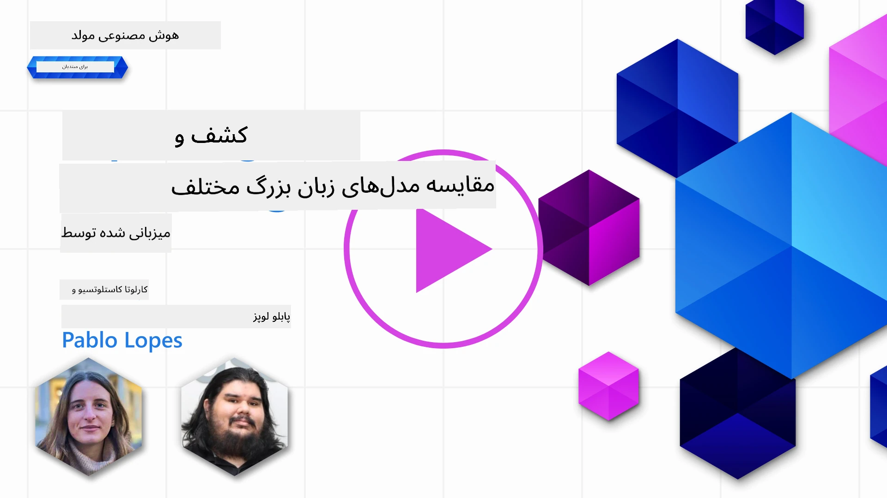](https://youtu.be/KIRUeDKscfI?si=8BHX1zvwzQBn-PlK)

> _برای تماشای ویدئوی این درس روی تصویر بالا کلیک کنید_

در درس قبلی دیدیم که چگونه هوش مصنوعی مولد، چشم‌انداز فناوری را تغییر می‌دهد، مدل‌های زبانی بزرگ (LLMs) چگونه کار می‌کنند و چگونه کسب‌وکاری مانند استارتاپ ما می‌تواند از آن‌ها در موارد کاربردی خود استفاده کرده و رشد کند! در این فصل، قصد داریم انواع مختلف مدل‌های زبانی بزرگ (LLMs) را مقایسه و تفاوت‌های آن‌ها را بررسی کنیم تا مزایا و معایب آن‌ها را درک کنیم.

گام بعدی در مسیر استارتاپ ما، کاوش در چشم‌انداز فعلی مدل‌های زبانی بزرگ و درک این است که کدام یک برای مورد استفاده ما مناسب است.

## مقدمه

این درس موارد زیر را پوشش خواهد داد:

- انواع مختلف مدل‌های زبانی بزرگ در چشم‌انداز فعلی.
- آزمایش، تکرار و مقایسه مدل‌های مختلف برای مورد استفاده شما در Azure.
- نحوه استقرار یک مدل زبانی بزرگ.

## اهداف یادگیری

پس از اتمام این درس، قادر خواهید بود:

- مدل مناسب برای مورد استفاده خود را انتخاب کنید.
- نحوه آزمایش، تکرار و بهبود عملکرد مدل خود را درک کنید.
- بدانید چگونه کسب‌وکارها مدل‌ها را استقرار می‌دهند.

## درک انواع مختلف مدل‌های زبانی بزرگ

مدل‌های زبانی بزرگ می‌توانند بر اساس معماری، داده‌های آموزشی و مورد استفادهشان دسته‌بندی‌های متعددی داشته باشند. درک این تفاوت‌ها به استارتاپ ما کمک می‌کند مدل مناسب برای سناریو را انتخاب کرده و نحوه آزمایش، تکرار و بهبود عملکرد را بفهمد.

مدل‌های زبانی بزرگ انواع مختلفی دارند، انتخاب مدل شما بستگی به هدف استفاده، داده‌های شما، میزان پرداخت توان شما و موارد دیگر دارد.

بسته به این که قصد دارید مدل‌ها را برای تولید متن، صدا، ویدئو، تصویر و غیره استفاده کنید، ممکن است نوع متفاوتی از مدل را انتخاب کنید.

- **شناخت صدا و گفتار**. مدل‌های سبک Whisper هنوز مدل‌های تشخیص گفتار عمومی مفیدی هستند، اما گزینه‌های تولیدی اکنون شامل مدل‌های جدید تبدیل گفتار به متن مانند `gpt-4o-transcribe`، `gpt-4o-mini-transcribe` و تنوع‌های دیاریزیشن هستند. پوشش زبان، دیاریزیشن، پشتیبانی زنده، تأخیر و هزینه برای سناریو خود را ارزیابی کنید. اطلاعات بیشتر در [مستندات تبدیل گفتار به متن OpenAI](https://platform.openai.com/docs/guides/speech-to-text?WT.mc_id=academic-105485-koreyst).

- **تولید تصویر**. DALL-E و Midjourney گزینه‌های شناخته‌شده تولید تصویر هستند، اما APIهای تصویر فعلی OpenAI بر اساس مدل‌های GPT Image مانند `gpt-image-2` متمرکزند، در حالی که Stable Diffusion، Imagen، Flux و خانواده‌های مدل دیگر نیز گزینه‌های رایج هستند. تطابق با درخواست، پشتیبانی ویرایش، کنترل سبک، نیازهای ایمنی و مجوزها را مقایسه کنید. بیشتر در [راهنمای تولید تصویر OpenAI](https://platform.openai.com/docs/guides/images?WT.mc_id=academic-105485-koreyst) و فصل نهم این دوره آموزشی بخوانید.

- **تولید متن**. مدل‌های متنی اکنون شامل مدل‌های پیشرفته، مدل‌های استدلال، مدل‌های کوچک با تأخیر کم و مدل‌های متن‌باز هستند. نمونه‌های فعلی شامل مدل‌های OpenAI GPT-5.x، Anthropic Claude 4.x، Google Gemini 3.x، Meta Llama 4 و مدل‌های Mistral هستند. فقط براساس تاریخ انتشار یا قیمت انتخاب نکنید؛ کیفیت وظیفه، تأخیر، پنجره متنی، استفاده از ابزارها، رفتار ایمنی، دسترسی منطقه‌ای و هزینه کل را مقایسه کنید. [فهرست مدل‌های Microsoft Foundry](https://ai.azure.com/catalog?WT.mc_id=academic-105485-koreyst) مکان خوبی برای مقایسه مدل‌های موجود در Azure است.

- **چندگانه بودن مدیا**. بسیاری از مدل‌های فعلی بیش از متن را پردازش می‌کنند. برخی ورودی تصویر، صدا یا ویدئو را می‌پذیرند؛ برخی می‌توانند ابزارها را فراخوانی کنند؛ و مدل‌های تخصصی قادر به تولید تصویر، صدا یا ویدئو هستند. برای مثال، مدل‌های فعلی OpenAI از ورودی متن و تصویر پشتیبانی می‌کنند، مدل‌های Gemini می‌توانند بسته به نوعشان ورودی متن، کد، تصویر، صدا و ویدئو را پشتیبانی کنند، و Llama 4 Scout و Maverick مدل‌های چندرسانه‌ای متن‌باز هستند. همیشه کارت مدل هر مدل را برای ورودی و خروجی‌های پشتیبانی شده بررسی کنید قبل از ساخت گردش کاری حول آن.

انتخاب یک مدل به این معنی است که شما برخی قابلیت‌های پایه را دریافت می‌کنید، اما ممکن است کافی نباشد. اغلب داده‌های خاص شرکت دارید که باید به گونه‌ای به LLM گفته شود. چند گزینه مختلف برای این موضوع وجود دارد، که در بخش‌های بعدی بیشتر توضیح داده خواهد شد.

### مدل‌های بنیادین در مقابل مدل‌های زبانی بزرگ

اصطلاح مدل بنیادین توسط [پژوهشگران استنفورد](https://arxiv.org/abs/2108.07258?WT.mc_id=academic-105485-koreyst) ابداع شده و به مدل هوش مصنوعی اطلاق می‌شود که معیارهایی مانند موارد زیر را داشته باشد:

- **آن‌ها با یادگیری بدون نظارت یا خودنظارتی آموزش دیده‌اند**، به این معنی که روی داده‌های چندرسانه‌ای بدون برچسب آموزش دیده‌اند و نیازی به حاشیه‌نویسی یا برچسب‌گذاری انسانی برای فرایند آموزش ندارند.
- **مدل‌های بسیار بزرگی هستند**، مبتنی بر شبکه‌های عصبی عمیق که روی میلیاردها پارامتر آموزش دیده‌اند.
- **معمولاً به عنوان ‘بنیاد’ برای مدل‌های دیگر در نظر گرفته می‌شوند**، یعنی می‌توانند به عنوان نقطه شروع برای مدل‌های دیگر استفاده شوند که با تنظیم دقیق ساخته می‌شوند.

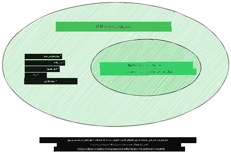

منبع تصویر: [راهنمای ضروری مدل‌های بنیادین و مدل‌های زبانی بزرگ | توسط بابار م بهاتی | Medium
](https://thebabar.medium.com/essential-guide-to-foundation-models-and-large-language-models-27dab58f7404)

برای روشن‌تر کردن این تمایز، بیایید ChatGPT را به عنوان یک مثال تاریخی در نظر بگیریم. نسخه‌های اولیه ChatGPT از GPT-3.5 به عنوان مدل بنیاد استفاده می‌کردند. سپس OpenAI با استفاده از داده‌ها و تکنیک‌های تطابق مکالمه‌ای نسخه‌ای تنظیم شده ساخت که در سناریوهای گفت‌وگو مانند چت‌بات‌ها عملکرد بهتری داشت. خدمات هوش مصنوعی مدرن اغلب بین چند نوع مدل مسیریابی می‌کنند، بنابراین اسم سرویس و نام مدل زیرساخت همیشه یکسان نیستند.

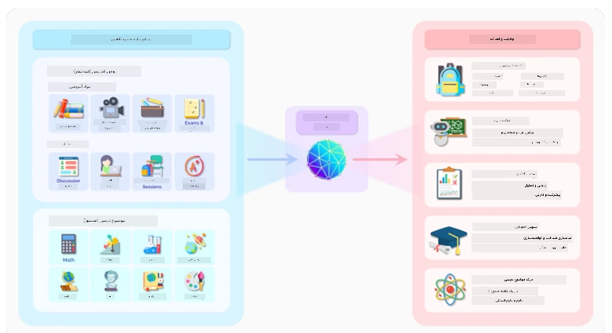

منبع تصویر: [2108.07258.pdf (arxiv.org)](https://arxiv.org/pdf/2108.07258.pdf?WT.mc_id=academic-105485-koreyst)

### مدل‌های وزن‌باز/متن‌باز در مقابل مدل‌های اختصاصی

یک راه دیگر برای دسته‌بندی مدل‌های زبانی بزرگ، بودن آن‌ها به صورت وزن‌باز، متن‌باز یا اختصاصی است.

مدل‌های متن‌باز و وزن‌باز آثار مدل را برای بررسی، دانلود یا سفارشی‌سازی فراهم می‌کنند، اما مجوزهای آن‌ها متفاوت است. برخی کاملاً متن‌باز هستند، در حالی که دیگران مدل‌های وزن‌باز با محدودیت‌های استفاده هستند. این مدل‌ها زمانی مفیدند که کسب‌وکار به کنترل بیشتر بر استقرار، محل داده، هزینه یا سفارشی‌سازی نیاز داشته باشد. با این حال، تیم‌ها هنوز باید شرایط مجوز، هزینه‌های سرویس‌دهی، نگهداری، به‌روزرسانی‌های امنیتی و کیفیت ارزیابی را قبل از استفاده در تولید بررسی کنند. مثال‌ها شامل [Meta Llama 4](https://ai.meta.com/blog/llama-4-multimodal-intelligence/?WT.mc_id=academic-105485-koreyst)، برخی مدل‌های [Mistral](https://docs.mistral.ai/models/overview?WT.mc_id=academic-105485-koreyst) و بسیاری مدل‌های میزبانی شده در [Hugging Face](https://huggingface.co/models?WT.mc_id=academic-105485-koreyst) هستند.

مدل‌های اختصاصی متعلق به و میزبانی شده توسط یک ارائه‌دهنده هستند. این مدل‌ها اغلب برای استفاده تولیدی مدیریت‌شده بهینه شده‌اند و می‌توانند پشتیبانی قوی، سیستم‌های ایمنی، یکپارچه‌سازی ابزارها و مقیاس‌پذیری ارائه دهند. با این حال، مشتریان معمولاً نمی‌توانند وزن‌های مدل را بررسی یا تغییر دهند و باید شرایط ارائه‌دهنده برای حریم خصوصی، نگهداری، تطبیق و استفاده قابل قبول را بررسی کنند. مثال‌ها شامل [مدل‌های OpenAI](https://platform.openai.com/docs/models?WT.mc_id=academic-105485-koreyst)، [Google Gemini](https://deepmind.google/models/gemini/pro/?WT.mc_id=academic-105485-koreyst) و [Anthropic Claude](https://platform.claude.com/docs/en/about-claude/models/overview?WT.mc_id=academic-105485-koreyst) هستند.

### درج (Embedding) در مقابل تولید تصویر در مقابل تولید متن و کد

مدل‌های زبانی بزرگ همچنین می‌توانند بر اساس خروجی تولیدی دسته‌بندی شوند.

مدل‌های درج، مجموعه‌ای از مدل‌ها هستند که می‌توانند متن را به شکل عددی تبدیل کنند که به آن درج گفته می‌شود، و این نمایشی عددی از متن ورودی است. درج‌ها درک رابطه بین کلمات یا جملات را برای ماشین‌ها آسان می‌کنند و می‌توانند به عنوان ورودی برای مدل‌های دیگری مانند مدل‌های طبقه‌بندی یا خوشه‌بندی که عملکرد بهتری روی داده‌های عددی دارند، استفاده شوند. مدل‌های درج اغلب در یادگیری انتقال استفاده می‌شوند، جایی که مدلی برای وظیفه جانشین ساخته می‌شود که داده‌های فراوانی دارد، و سپس وزن‌های مدل (درج‌ها) برای وظایف بعدی دوباره استفاده می‌شوند. مثالی از این دسته [درج‌های OpenAI](https://platform.openai.com/docs/models/embeddings?WT.mc_id=academic-105485-koreyst) است.

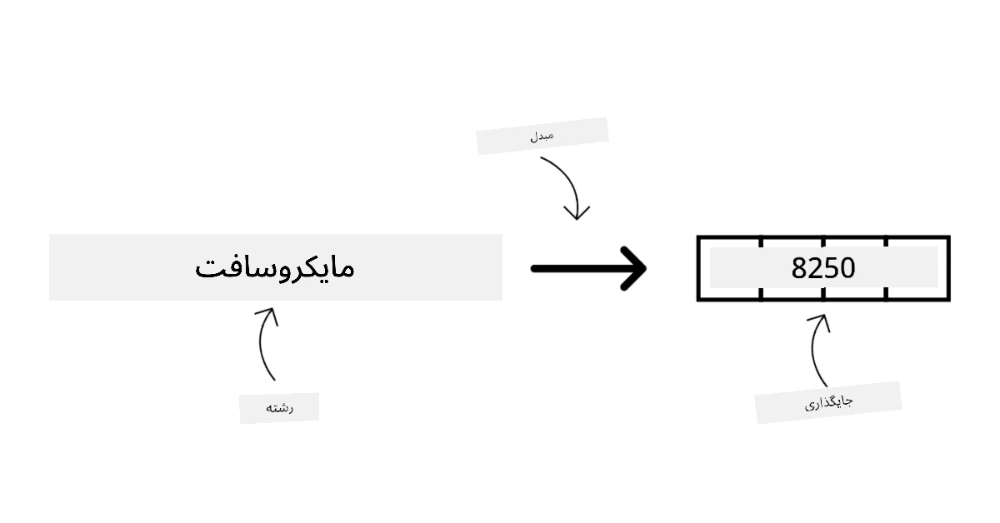

مدل‌های تولید تصویر، مدل‌هایی هستند که تصاویر تولید می‌کنند. این مدل‌ها اغلب برای ویرایش تصویر، سنتز تصویر و ترجمه تصویر استفاده می‌شوند. مدل‌های تولید تصویر اغلب بر روی مجموعه داده‌های بزرگ تصویری مانند [LAION-5B](https://laion.ai/blog/laion-5b/?WT.mc_id=academic-105485-koreyst) آموزش دیده‌اند و می‌توانند تصاویر جدید تولید کنند یا تصاویر موجود را با تکنیک‌هایی مانند درون‌نگاری، فوق‌وضوح و رنگ‌آمیزی ویرایش کنند. نمونه‌ها شامل مدل‌های [GPT Image](https://platform.openai.com/docs/guides/images?WT.mc_id=academic-105485-koreyst)، مدل‌های [Stable Diffusion](https://github.com/Stability-AI/StableDiffusion?WT.mc_id=academic-105485-koreyst) و مدل‌های Imagen هستند.

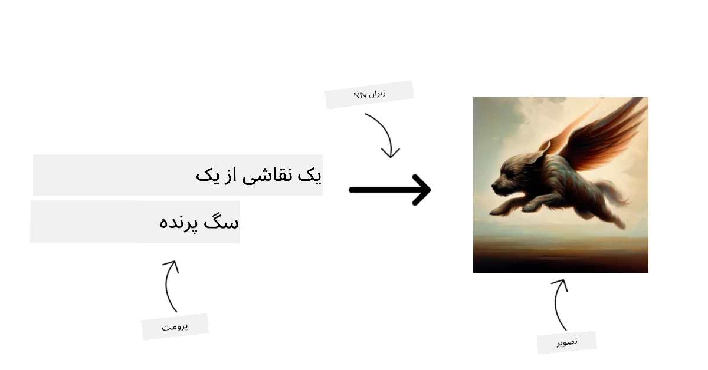

مدل‌های تولید متن و کد، مدل‌هایی هستند که متن یا کد تولید می‌کنند. این مدل‌ها اغلب برای خلاصه‌سازی متن، ترجمه و پاسخ به سوالات استفاده می‌شوند. مدل‌های تولید متن اغلب روی مجموعه داده‌های بزرگ متنی مانند [BookCorpus](https://www.cv-foundation.org/openaccess/content_iccv_2015/html/Zhu_Aligning_Books_and_ICCV_2015_paper.html?WT.mc_id=academic-105485-koreyst) آموزش دیده‌اند و می‌توانند متن جدید تولید کنند یا به سوالات پاسخ دهند. مدل‌های تولید کد، مانند [CodeParrot](https://huggingface.co/codeparrot?WT.mc_id=academic-105485-koreyst)، اغلب روی داده‌های بزرگ کد مانند GitHub آموزش دیده‌اند و می‌توانند کد جدید تولید کنند یا باگ‌ها را در کد موجود اصلاح کنند.

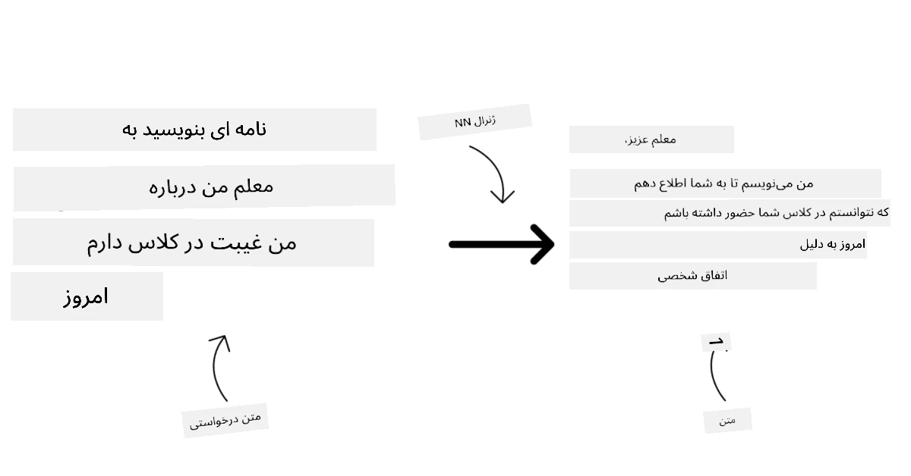

### مدل‌های انکودر-دیکودر در مقابل فقط دیکودر

برای صحبت درباره انواع معماری‌های مدل‌های زبانی بزرگ، اجازه دهید از یک تشبیه استفاده کنیم.

تصور کنید مدیر شما مأموریتی برای نوشتن یک آزمون برای دانش‌آموزان داده است. شما دو همکار دارید؛ یکی مسئول ایجاد محتوا و دیگری مسئول بازبینی آن‌ها.

سازنده محتوا مانند یک مدل فقط دیکودر است: آنها می‌توانند به موضوع نگاه کنند، ببینند شما قبلاً چه نوشته‌اید و سپس تولید محتوا را بر اساس آن بافت ادامه دهند. آن‌ها بسیار خوب در نوشتن محتوای جذاب و آموزنده هستند، اما همیشه بهترین گزینه برای وظایفی مانند طبقه‌بندی، بازیابی یا رمزگذاری اطلاعات نیستند. خانواده مدل‌های فقط دیکودر شامل مدل‌های GPT و Llama است.

بازبینی‌کننده مانند مدل فقط انکودر است، آن‌ها به دوره نوشته شده و پاسخ‌ها نگاه می‌کنند، رابطه میان آن‌ها را متوجه می‌شوند و بافت را درک می‌کنند، اما در تولید محتوا مهارت ندارند. یک مثال از مدل فقط انکودر، مدل BERT است.

تصور کنید کسی را هم داریم که می‌تواند آزمون را هم ایجاد و هم بازبینی کند؛ این یک مدل انکودر-دیکودر است. برخی نمونه‌ها شامل BART و T5 هستند.

### سرویس در مقابل مدل

اکنون، بیایید تفاوت بین سرویس و مدل را بررسی کنیم. سرویس محصولی است که توسط ارائه‌دهنده خدمات ابری ارائه می‌شود و اغلب ترکیبی از مدل‌ها، داده‌ها و اجزای دیگر است. مدل هسته اصلی یک سرویس است و اغلب یک مدل بنیادین مانند یک مدل زبانی بزرگ است.

سرویس‌ها اغلب برای استفاده تولیدی بهینه‌ شده‌اند و از طریق رابط کاربری گرافیکی استفاده آسان‌تری نسبت به مدل‌ها دارند. با این حال، سرویس‌ها همیشه رایگان نیستند و ممکن است نیاز به اشتراک یا پرداخت برای استفاده داشته باشند، در ازای بهره‌گیری از تجهیزات و منابع مالک سرویس، بهینه‌سازی هزینه‌ها و مقیاس‌پذیری آسان. مثال یک سرویس، [Azure OpenAI Service](https://learn.microsoft.com/azure/ai-services/openai/overview?WT.mc_id=academic-105485-koreyst) است که طرح پرداخت به‌ازای استفاده را ارائه می‌دهد، یعنی کاربران متناسب با میزان استفاده هزینه پرداخت می‌کنند. Azure OpenAI Service همچنین امنیت سازمانی و چارچوب هوش مصنوعی مسئولانه را بر اساس قابلیت‌های مدل‌ها فراهم می‌کند.

مدل‌ها شامل پارامترها، وزن‌ها، معماری، توکنایزر و تنظیمات پشتیبانی هستند. اجرای مدل به صورت محلی یا در محیط خصوصی نیازمند سخت‌افزار مناسب، زیرساخت سرویس‌دهی، نظارت و مجوز متن‌باز/وزن‌باز سازگار یا مجوز تجاری است. مدل‌های وزن‌باز مانند Llama 4 یا مدل‌های Mistral را می‌توان خود میزبانی کرد، اما هنوز به قدرت محاسباتی و تخصص عملیاتی نیاز دارند.

## نحوه آزمایش و تکرار با مدل‌های مختلف برای درک عملکرد در Azure

وقتی تیم ما منظره فعلی مدل‌های زبان بزرگ (LLM) را بررسی کرده و چند نامزد خوب برای سناریوهای خود شناسایی کرد، گام بعدی آزمایش آن‌ها روی داده‌ها و بار کاری‌شان است. این یک فرآیند تکراری است که توسط آزمایش‌ها و اندازه‌گیری‌ها انجام می‌شود.
بیشتر مدل‌هایی که در پاراگراف‌های قبلی ذکر کردیم (مدل‌های OpenAI، مدل‌های دارای وزن باز مانند Llama 4 و Mistral، و مدل‌های Hugging Face) در [Microsoft Foundry Models](https://learn.microsoft.com/azure/foundry/concepts/foundry-models-overview?WT.mc_id=academic-105485-koreyst) موجود هستند.

[Microsoft Foundry](https://learn.microsoft.com/azure/foundry/what-is-foundry?WT.mc_id=academic-105485-koreyst)، که قبلاً Azure AI Studio/Azure AI Foundry نام داشت، یک پلتفرم یکپارچه Azure برای ساخت برنامه‌ها و عامل‌های هوش مصنوعی است. این پلتفرم به توسعه‌دهندگان کمک می‌کند تا چرخه عمر از آزمایش و ارزیابی تا استقرار، نظارت و حاکمیت را مدیریت کنند. کاتالوگ مدل در Microsoft Foundry به کاربر امکان می‌دهد:

- مدل پایه مورد نظر خود را در کاتالوگ بیابد، شامل مدل‌هایی که توسط Azure فروخته می‌شوند و مدل‌های شرکاء و ارائه‌دهندگان جامعه. کاربران می‌توانند بر اساس وظیفه، ارائه‌دهنده، مجوز، گزینه استقرار یا نام فیلتر کنند.

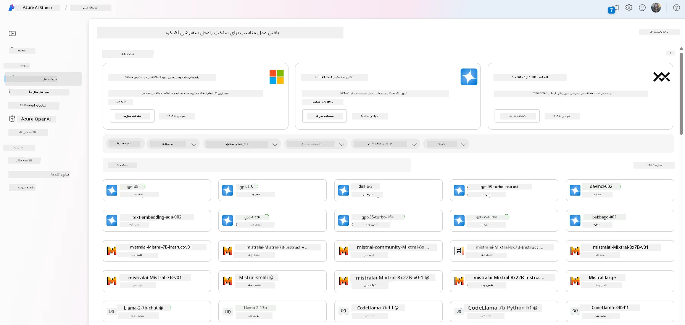

- بررسی کارت مدل، شامل توضیح دقیق در مورد استفاده مدنظر و داده‌های آموزشی، نمونه کدها و نتایج ارزیابی در کتابخانه ارزیابی داخلی.

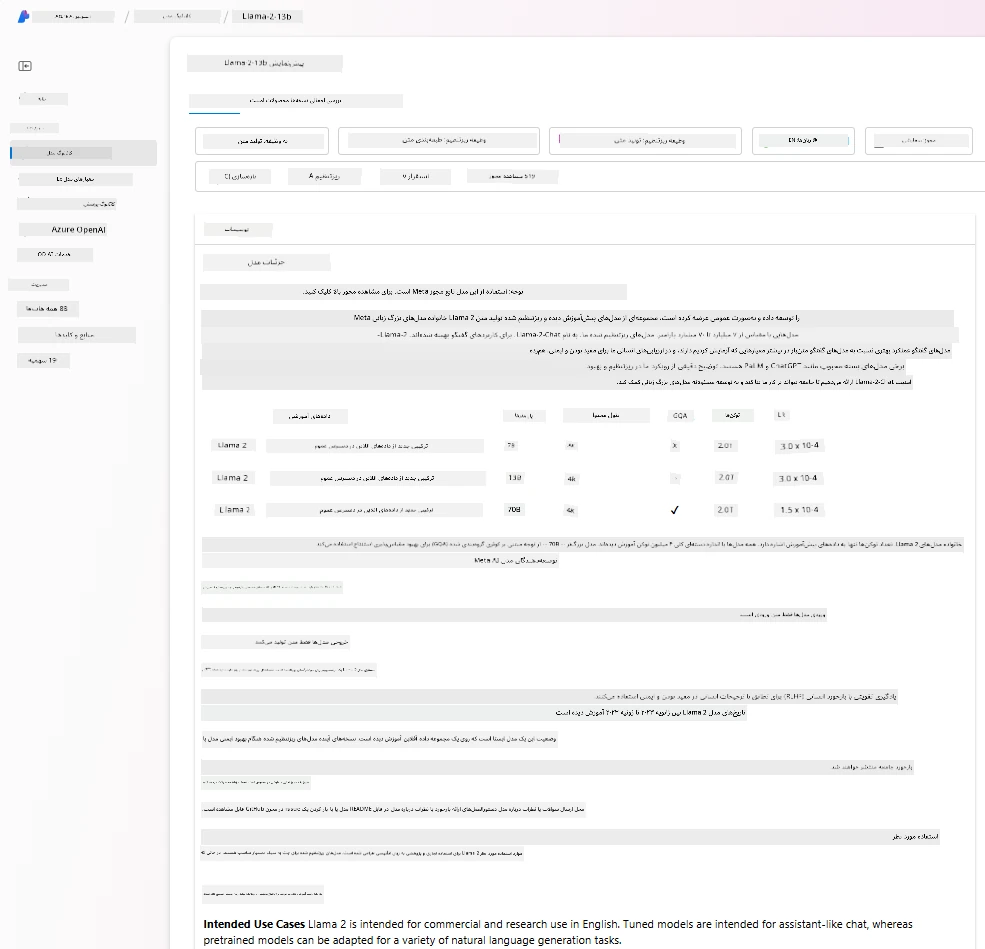

- مقایسه بنچمارک‌ها در میان مدل‌ها و داده‌مجموعه‌های موجود در صنعت به منظور ارزیابی کدام یک با سناریوی کسب‌وکار مطابقت دارد، از طریق پنل [Model Benchmarks](https://learn.microsoft.com/azure/ai-studio/how-to/model-benchmarks?WT.mc_id=academic-105485-koreyst).

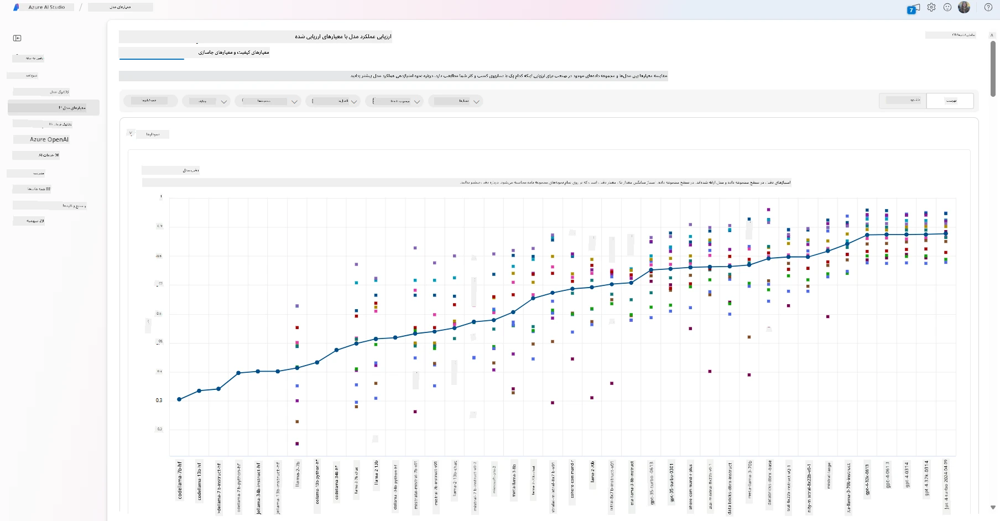

- تنظیم دقیق مدل‌های پشتیبانی‌شده روی داده‌های آموزشی سفارشی برای بهبود عملکرد مدل در بار کاری خاص، با بهره‌گیری از امکانات آزمایش و پیگیری Microsoft Foundry.

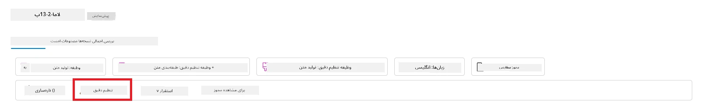

- استقرار مدل پیش‌آموزش‌دیده اصلی یا نسخه تنظیم‌شده در نقطه استنتاج راه دور و در زمان واقعی، با استفاده از گزینه‌های محاسبات مدیریت‌شده یا بدون سرور، تا برنامه‌ها بتوانند از آن استفاده کنند.

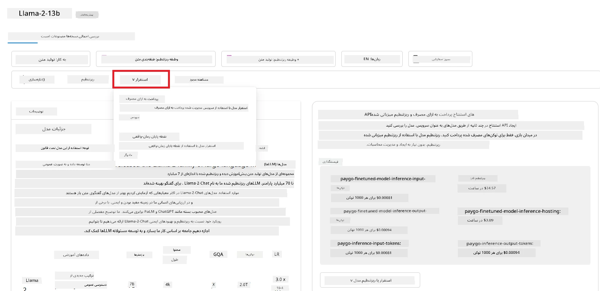

> [!NOTE]
> همه مدل‌های موجود در کاتالوگ در حال حاضر برای تنظیم دقیق و/یا استقرار پرداخت به ازای استفاده در دسترس نیستند. جزئیات قابلیت‌ها و محدودیت‌های مدل را در کارت مدل بررسی کنید.

## بهبود نتایج LLM

تیم استارتاپی ما انواع مختلفی از LLMها و یک پلتفرم ابری (Microsoft Foundry) را بررسی کرده است که به ما امکان مقایسه مدل‌های مختلف، ارزیابی آن‌ها روی داده‌های آزمایشی، بهبود عملکرد و استقرار آن‌ها در نقاط استنتاج را می‌دهد.

اما چه زمانی باید به جای استفاده از یک مدل پیش‌آموزش‌دیده، مدل را تنظیم دقیق کنند؟ آیا روش‌های دیگری برای بهبود عملکرد مدل روی بارهای کاری خاص وجود دارد؟

کسب‌وکارها می‌توانند از چندین روش برای گرفتن نتایج مورد نیاز از LLM استفاده کنند. هنگام استقرار LLM در محیط عملیاتی، می‌توانید مدل‌های مختلفی با درجات مختلف آموزش انتخاب کنید که سطح پیچیدگی، هزینه و کیفیت متفاوتی دارند. در اینجا برخی از رویکردهای مختلف آمده است:

- **مهندسی درخواست با زمینه**. ایده این است که هنگام درخواست زمینه کافی فراهم کنید تا پاسخ‌های مورد نیاز خود را دریافت کنید.

- **تولید با تقویت بازیابی، RAG**. داده‌های شما ممکن است در یک پایگاه داده یا نقطه انتهایی وب وجود داشته باشد، به منظور تضمین اینکه این داده‌ها یا زیرمجموعه‌ای از آن‌ها هنگام درخواست گنجانده شده‌اند، می‌توانید داده‌های مرتبط را بازیابی کرده و آن را بخشی از درخواست کاربر کنید.

- **مدل تنظیم دقیق شده**. در اینجا، مدل را با داده‌های خود بیشتر آموزش داده‌اید که منجر به مدل دقیق‌تر و پاسخگوتر به نیازهای شما شده اما ممکن است هزینه‌بر باشد.

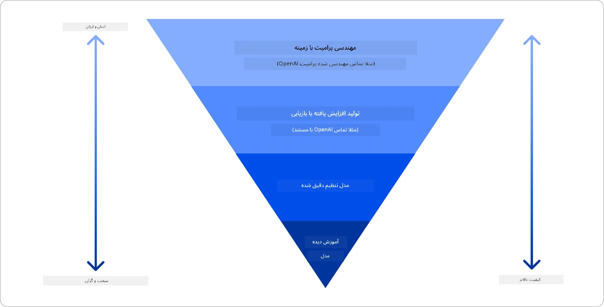

منبع تصویر: [چهار روش که سازمان‌ها LLMها را استقرار می‌دهند | وبلاگ Fiddler AI](https://www.fiddler.ai/blog/four-ways-that-enterprises-deploy-llms?WT.mc_id=academic-105485-koreyst)

### مهندسی درخواست با زمینه

مدل‌های پیش‌آموزش‌دیده LLM در وظایف زبان طبیعی عمومی بسیار خوب عمل می‌کنند، حتی با استفاده از یک درخواست کوتاه، مانند جمله‌ای برای کامل کردن یا یک سؤال – که به آن آموزش «صفر نمونه» گفته می‌شود.

با این حال، هر چه کاربر بتواند پرسش خود را با درخواست دقیق‌تر و مثال‌های بیشتر – یعنی زمینه – چارچوب‌بندی کند، پاسخ دقیق‌تر و نزدیک‌تر به انتظارات کاربر خواهد بود. در این حالت، اگر درخواست فقط شامل یک مثال باشد «آموزش تک نمونه» و اگر چند مثال داشته باشد «آموزش چند نمونه» است.
مهندسی درخواست با زمینه اقتصادی‌ترین روش برای شروع است.

### تولید با تقویت بازیابی (RAG)

LLMها محدودیت دارند که فقط می‌توانند از داده‌هایی که طی آموزش استفاده شده است برای تولید پاسخ بهره ببرند. این به این معنی است که آن‌ها چیزی در مورد وقایعی که پس از آموزش‌شان اتفاق افتاده نمی‌دانند و نمی‌توانند به اطلاعات غیرعمومی (مانند داده‌های شرکت) دسترسی داشته باشند.
این محدودیت با استفاده از RAG قابل غلبه است، روشی که درخواست را با داده‌های خارجی به شکل قطعاتی از اسناد تقویت می‌کند، با در نظر گرفتن محدودیت طول درخواست. این فناوری توسط ابزارهای پایگاه داده وکتور (مانند [Azure Vector Search](https://learn.microsoft.com/azure/search/vector-search-overview?WT.mc_id=academic-105485-koreyst)) پشتیبانی می‌شود که قطعات مفید را از منابع داده از پیش تعریف‌شده بازیابی کرده و به زمینه درخواست اضافه می‌کنند.

این تکنیک زمانی مفید است که کسب‌وکار داده، زمان یا منابع کافی برای تنظیم دقیق LLM نداشته باشد، اما همچنان بخواهد عملکرد روی بار کاری خاص را بهبود بخشد و ریسک پاسخ‌های خیالی، منسوخ یا غیرپشتیبانی‌شده را کاهش دهد.

### مدل تنظیم دقیق شده

تنظیم دقیق فرایندی است که با استفاده از یادگیری انتقالی مدل را برای یک وظیفه پایین‌دستی یا حل یک مشکل خاص «سفارشی» می‌کند. برخلاف آموزش چند نمونه و RAG، این فرایند منجر به تولید یک مدل جدید با وزن‌ها و بایاس‌های به‌روزرسانی شده می‌شود. این فرایند نیازمند مجموعه‌ای از نمونه‌های آموزشی شامل ورودی واحد (درخواست) و خروجی متناظر (تکمیل) است.
این رویکرد ترجیح داده می‌شود اگر:

- **استفاده از مدل‌های کوچک‌تر مختص وظیفه**. کسب‌وکار تمایل دارد مدل کوچک‌تری را برای یک وظیفه محدود تنظیم دقیق کند تا اینکه به طور مکرر از یک مدل بزرگ‌تر استفاده کند، که این منجر به راه‌حلی اقتصادی‌تر و سریع‌تر می‌شود.

- **توجه به تأخیر (Latency)**. تأخیر در مورد یک مورد استفاده خاص مهم است، بنابراین استفاده از درخواست‌های بسیار طولانی یا تعداد مثال‌های یادگیری شده که با محدودیت طول درخواست نمی‌خواند، ممکن نیست.

- **سفارشی‌سازی رفتار پایدار**. کسب‌وکار نمونه‌های باکیفیت زیادی دارد و می‌خواهد مدل به طور مداوم الگوی وظیفه، قالب خروجی، لحن یا سبک خاص دامنه را دنبال کند. اگر مشکل اصلی، اطلاعات تازه یا دانش خصوصی است که اغلب تغییر می‌کند، به جای تکیه صرف بر تنظیم دقیق، از RAG استفاده کنید.

### مدل آموزش‌دیده

آموزش یک LLM از ابتدا بدون شک دشوارترین و پیچیده‌ترین روش است که نیازمند حجم عظیمی از داده‌ها، منابع ماهر و قدرت محاسباتی مناسب است. این گزینه باید فقط زمانی در نظر گرفته شود که کسب‌وکار یک مورد استفاده دامنه‌محور داشته باشد و داده‌های زیادی متمرکز بر آن دامنه در اختیار داشته باشد.

## بررسی دانش

چه رویکرد خوبی می‌تواند برای بهبود نتایج تکمیل LLM استفاده شود؟

1. مهندسی درخواست با زمینه
1. RAG
1. مدل تنظیم دقیق شده

پاسخ: هر سه می‌توانند کمک کنند. با مهندسی درخواست و زمینه برای بهبود سریع شروع کنید، و وقتی مدل به حقایق جاری یا داده‌های خصوصی کسب‌وکار نیاز دارد از RAG استفاده کنید. زمانی که نمونه‌های باکیفیت کافی دارید و می‌خواهید مدل به طور مداوم الگو، قالب، لحن یا دامنه وظیفه را دنبال کند، تنظیم دقیق را انتخاب کنید.

## 🚀 چالش

درباره اینکه چگونه می‌توانید از [RAG](https://learn.microsoft.com/azure/search/retrieval-augmented-generation-overview?WT.mc_id=academic-105485-koreyst) برای کسب‌وکارتان استفاده کنید بیشتر بخوانید.

## کار عالی، یادگیری خود را ادامه دهید

پس از اتمام این درس، مجموعه [Generative AI Learning](https://aka.ms/genai-collection?WT.mc_id=academic-105485-koreyst) ما را برای ادامه ارتقای دانش خود در زمینه هوش مصنوعی مولد بررسی کنید!

به درس ۳ بروید که در آن به نحوه [ساختن با هوش مصنوعی مولد به صورت مسئولانه](../03-using-generative-ai-responsibly/README.md?WT.mc_id=academic-105485-koreyst) می‌پردازیم!

---

<!-- CO-OP TRANSLATOR DISCLAIMER START -->
**سلب مسئولیت**:
این سند با استفاده از سرویس ترجمه هوش مصنوعی [Co-op Translator](https://github.com/Azure/co-op-translator) ترجمه شده است. در حالی که ما در تلاش برای دقت هستیم، لطفاً توجه داشته باشید که ترجمه‌های خودکار ممکن است شامل خطاها یا نادرستی‌هایی باشند. سند اصلی به زبان مادری خود باید به عنوان منبع معتبر در نظر گرفته شود. برای اطلاعات حیاتی، ترجمه حرفه‌ای انسانی توصیه می‌شود. ما در قبال هرگونه سوء تفاهم یا برداشت نادرست ناشی از استفاده از این ترجمه مسئولیتی نداریم.
<!-- CO-OP TRANSLATOR DISCLAIMER END -->