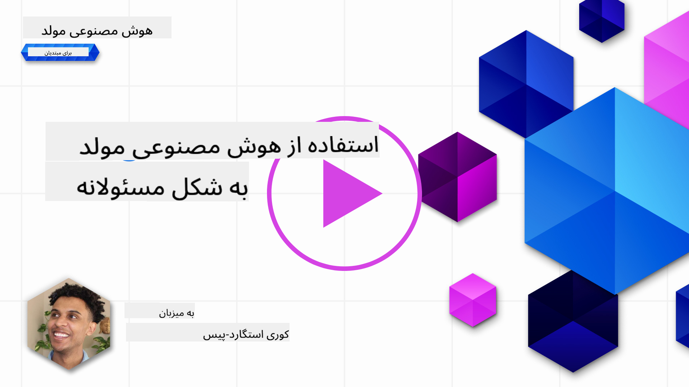
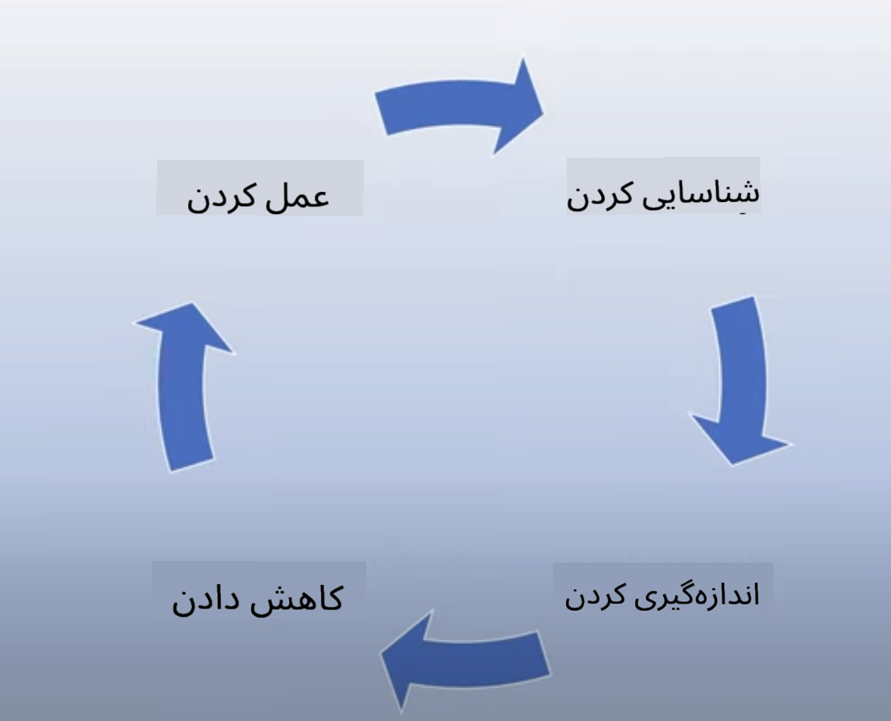
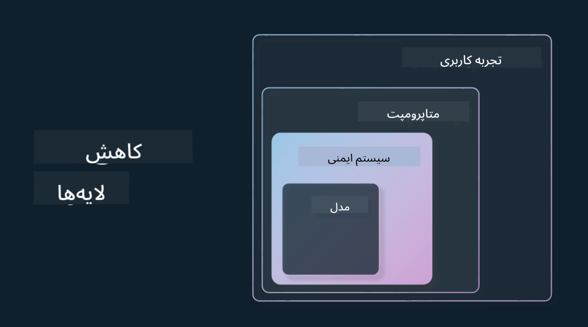

<!--
CO_OP_TRANSLATOR_METADATA:
{
  "original_hash": "7f8f4c11f8c1cb6e1794442dead414ea",
  "translation_date": "2025-07-09T08:47:50+00:00",
  "source_file": "03-using-generative-ai-responsibly/README.md",
  "language_code": "fa"
}
-->
# استفاده مسئولانه از هوش مصنوعی مولد

> _برای مشاهده ویدئوی این درس روی تصویر بالا کلیک کنید_

جذابیت هوش مصنوعی و به‌ویژه هوش مصنوعی مولد بسیار زیاد است، اما باید به این فکر کنید که چگونه می‌توانید از آن به‌صورت مسئولانه استفاده کنید. باید مواردی مانند اطمینان از عادلانه بودن خروجی، عدم آسیب‌رسانی و موارد دیگر را در نظر بگیرید. هدف این فصل ارائه زمینه‌های لازم، نکاتی که باید مد نظر قرار دهید و چگونگی برداشتن گام‌های عملی برای بهبود استفاده از هوش مصنوعی است.

## مقدمه

این درس شامل موارد زیر است:

- چرا باید هنگام ساخت برنامه‌های هوش مصنوعی مولد، مسئولیت‌پذیری هوش مصنوعی را در اولویت قرار دهید.
- اصول اصلی هوش مصنوعی مسئول و ارتباط آن‌ها با هوش مصنوعی مولد.
- چگونگی به‌کارگیری این اصول مسئولانه از طریق استراتژی و ابزارها.

## اهداف یادگیری

پس از اتمام این درس، شما خواهید دانست:

- اهمیت هوش مصنوعی مسئول هنگام ساخت برنامه‌های هوش مصنوعی مولد.
- چه زمانی باید اصول اصلی هوش مصنوعی مسئول را در ساخت برنامه‌های هوش مصنوعی مولد در نظر گرفت و به کار برد.
- چه ابزارها و استراتژی‌هایی برای عملی کردن مفهوم هوش مصنوعی مسئول در اختیار شماست.

## اصول هوش مصنوعی مسئول

هیجان پیرامون هوش مصنوعی مولد هرگز به این اندازه بالا نبوده است. این هیجان باعث جذب تعداد زیادی توسعه‌دهنده جدید، توجه و سرمایه‌گذاری به این حوزه شده است. در حالی که این موضوع برای هر کسی که می‌خواهد محصولات و شرکت‌هایی با استفاده از هوش مصنوعی مولد بسازد بسیار مثبت است، اما مهم است که با مسئولیت پیش برویم.

در طول این دوره، تمرکز ما بر ساخت استارتاپ و محصول آموزشی هوش مصنوعی خودمان است. ما از اصول هوش مصنوعی مسئول استفاده خواهیم کرد: عدالت، فراگیری، قابلیت اطمینان/ایمنی، امنیت و حریم خصوصی، شفافیت و پاسخگویی. با این اصول، بررسی خواهیم کرد که چگونه این موارد با استفاده ما از هوش مصنوعی مولد در محصولاتمان مرتبط است.

## چرا باید هوش مصنوعی مسئول را در اولویت قرار دهید

هنگام ساخت یک محصول، اتخاذ رویکردی انسان‌محور و در نظر گرفتن منافع بهترین کاربر، به بهترین نتایج منجر می‌شود.

ویژگی منحصر به فرد هوش مصنوعی مولد، قدرت آن در ایجاد پاسخ‌های مفید، اطلاعات، راهنمایی و محتوا برای کاربران است. این کار می‌تواند بدون مراحل دستی زیاد انجام شود که منجر به نتایج بسیار چشمگیر می‌شود. اما بدون برنامه‌ریزی و استراتژی‌های مناسب، متأسفانه ممکن است به نتایج آسیب‌رسانی برای کاربران، محصول و جامعه منجر شود.

بیایید به برخی (نه همه) از این نتایج بالقوه آسیب‌رسان نگاهی بیندازیم:

### توهمات (Hallucinations)

توهمات اصطلاحی است که برای توصیف زمانی به کار می‌رود که یک مدل زبان بزرگ (LLM) محتوایی تولید می‌کند که یا کاملاً بی‌معنی است یا چیزی است که بر اساس منابع اطلاعاتی دیگر می‌دانیم از نظر واقعی نادرست است.

برای مثال، فرض کنیم ویژگی‌ای برای استارتاپ خود ساخته‌ایم که به دانش‌آموزان اجازه می‌دهد سوالات تاریخی از مدل بپرسند. یک دانش‌آموز سوال می‌پرسد: `تنها بازمانده کشتی تایتانیک کی بود؟`

مدل پاسخی مانند نمونه زیر تولید می‌کند:

> _(منبع: [Flying bisons](https://flyingbisons.com?WT.mc_id=academic-105485-koreyst))_

این پاسخ بسیار مطمئن و کامل است. متأسفانه، نادرست است. حتی با کمترین تحقیق، مشخص می‌شود که بیش از یک بازمانده از فاجعه تایتانیک وجود داشته است. برای دانش‌آموزی که تازه شروع به تحقیق در این موضوع کرده، این پاسخ می‌تواند به اندازه کافی قانع‌کننده باشد که مورد سوال قرار نگیرد و به عنوان حقیقت پذیرفته شود. پیامد این موضوع می‌تواند باعث شود سیستم هوش مصنوعی غیرقابل اعتماد شود و به اعتبار استارتاپ ما آسیب بزند.

با هر نسخه جدید از هر مدل زبان بزرگ، شاهد بهبود عملکرد در کاهش توهمات بوده‌ایم. حتی با این پیشرفت، ما به عنوان سازندگان برنامه و کاربران باید همچنان از این محدودیت‌ها آگاه باشیم.

### محتوای آسیب‌رسان

در بخش قبلی درباره تولید پاسخ‌های نادرست یا بی‌معنی توسط مدل صحبت کردیم. خطر دیگری که باید به آن توجه کنیم، زمانی است که مدل با محتوای آسیب‌رسان پاسخ می‌دهد.

محتوای آسیب‌رسان می‌تواند به صورت زیر تعریف شود:

- ارائه دستورالعمل یا تشویق به خودآزاری یا آسیب رساندن به گروه‌های خاص.
- محتوای نفرت‌انگیز یا تحقیرآمیز.
- راهنمایی برای برنامه‌ریزی هر نوع حمله یا اعمال خشونت‌آمیز.
- ارائه دستورالعمل برای یافتن محتوای غیرقانونی یا انجام اعمال غیرقانونی.
- نمایش محتوای جنسی صریح.

برای استارتاپ خود، می‌خواهیم مطمئن شویم ابزارها و استراتژی‌های مناسبی داریم تا از دیده شدن این نوع محتوا توسط دانش‌آموزان جلوگیری کنیم.

### کمبود عدالت

عدالت به معنای «اطمینان از این است که یک سیستم هوش مصنوعی عاری از تعصب و تبعیض باشد و با همه به صورت عادلانه و برابر رفتار کند.» در دنیای هوش مصنوعی مولد، می‌خواهیم مطمئن شویم که دیدگاه‌های تبعیض‌آمیز نسبت به گروه‌های حاشیه‌ای توسط خروجی مدل تقویت نشود.

این نوع خروجی‌ها نه تنها به ایجاد تجربه‌های مثبت محصول برای کاربران آسیب می‌زنند، بلکه به جامعه نیز آسیب بیشتری وارد می‌کنند. به عنوان سازندگان برنامه، باید همیشه یک پایگاه کاربری گسترده و متنوع را در نظر داشته باشیم هنگام ساخت راه‌حل‌ها با هوش مصنوعی مولد.

## چگونه هوش مصنوعی مولد را مسئولانه استفاده کنیم

حالا که اهمیت هوش مصنوعی مولد مسئول را شناسایی کردیم، بیایید به ۴ گامی که می‌توانیم برای ساخت راه‌حل‌های هوش مصنوعی مسئولانه برداریم نگاه کنیم:

### اندازه‌گیری آسیب‌های احتمالی

در تست نرم‌افزار، رفتارهای مورد انتظار کاربر روی یک برنامه را آزمایش می‌کنیم. به همین ترتیب، آزمایش مجموعه‌ای متنوع از درخواست‌هایی که کاربران احتمالاً استفاده می‌کنند، راه خوبی برای اندازه‌گیری آسیب احتمالی است.

از آنجا که استارتاپ ما در حال ساخت محصول آموزشی است، خوب است فهرستی از درخواست‌های مرتبط با آموزش آماده کنیم. این می‌تواند شامل موضوعات خاص، حقایق تاریخی و سوالاتی درباره زندگی دانش‌آموزی باشد.

### کاهش آسیب‌های احتمالی

حالا زمان آن است که راه‌هایی پیدا کنیم تا بتوانیم از آسیب احتمالی ناشی از مدل و پاسخ‌های آن جلوگیری کنیم یا آن را محدود کنیم. می‌توانیم این کار را در ۴ لایه مختلف بررسی کنیم:

- **مدل**. انتخاب مدل مناسب برای کاربرد مناسب. مدل‌های بزرگ‌تر و پیچیده‌تر مانند GPT-4 ممکن است در کاربردهای کوچک‌تر و خاص‌تر خطر تولید محتوای آسیب‌رسان بیشتری داشته باشند. استفاده از داده‌های آموزشی خود برای تنظیم دقیق مدل نیز ریسک محتوای آسیب‌رسان را کاهش می‌دهد.

- **سیستم ایمنی**. سیستم ایمنی مجموعه‌ای از ابزارها و تنظیمات روی پلتفرمی است که مدل را ارائه می‌دهد و به کاهش آسیب کمک می‌کند. نمونه‌ای از این سیستم، سیستم فیلتر محتوای سرویس Azure OpenAI است. این سیستم‌ها باید حملات jailbreak و فعالیت‌های ناخواسته مانند درخواست‌های ربات‌ها را نیز شناسایی کنند.

- **متاپرامپت**. متاپرامپت‌ها و پایه‌گذاری روش‌هایی هستند که می‌توانیم مدل را بر اساس رفتارها و اطلاعات خاص هدایت یا محدود کنیم. این می‌تواند شامل استفاده از ورودی‌های سیستمی برای تعریف محدودیت‌های مشخص مدل باشد. همچنین ارائه خروجی‌هایی که مرتبط‌تر با حوزه یا دامنه سیستم هستند.

همچنین می‌توان از تکنیک‌هایی مانند تولید افزوده بازیابی‌شده (RAG) استفاده کرد تا مدل فقط اطلاعات را از منابع معتبر انتخاب شده استخراج کند. در این دوره، درسی درباره [ساخت برنامه‌های جستجو](../08-building-search-applications/README.md?WT.mc_id=academic-105485-koreyst) وجود دارد.

- **تجربه کاربری**. لایه نهایی جایی است که کاربر به طور مستقیم از طریق رابط برنامه با مدل تعامل دارد. در اینجا می‌توانیم UI/UX را طوری طراحی کنیم که کاربر را در نوع ورودی‌هایی که می‌تواند به مدل ارسال کند و همچنین متن یا تصاویری که به کاربر نمایش داده می‌شود محدود کنیم. هنگام استقرار برنامه هوش مصنوعی، باید شفاف باشیم درباره اینکه برنامه هوش مصنوعی مولد ما چه کاری می‌تواند انجام دهد و چه کاری نمی‌تواند.

ما یک درس کامل به [طراحی UX برای برنامه‌های هوش مصنوعی](../12-designing-ux-for-ai-applications/README.md?WT.mc_id=academic-105485-koreyst) اختصاص داده‌ایم.

- **ارزیابی مدل**. کار با مدل‌های زبان بزرگ می‌تواند چالش‌برانگیز باشد چون همیشه کنترل کاملی روی داده‌های آموزشی مدل نداریم. با این حال، باید همیشه عملکرد و خروجی‌های مدل را ارزیابی کنیم. اندازه‌گیری دقت، شباهت، پایه‌گذاری و مرتبط بودن خروجی همچنان مهم است. این کار به ایجاد شفافیت و اعتماد برای ذینفعان و کاربران کمک می‌کند.

### راه‌اندازی یک راه‌حل هوش مصنوعی مولد مسئولانه

ساخت یک رویه عملیاتی پیرامون برنامه‌های هوش مصنوعی شما مرحله نهایی است. این شامل همکاری با بخش‌های دیگر استارتاپ مانند بخش حقوقی و امنیت برای اطمینان از رعایت تمام سیاست‌های قانونی است. قبل از راه‌اندازی، همچنین باید برنامه‌هایی برای تحویل، مدیریت حوادث و بازگردانی داشته باشیم تا از آسیب به کاربران جلوگیری شود.

## ابزارها

اگرچه توسعه راه‌حل‌های هوش مصنوعی مسئول ممکن است کار زیادی به نظر برسد، اما ارزش تلاش را دارد. با رشد حوزه هوش مصنوعی مولد، ابزارهای بیشتری برای کمک به توسعه‌دهندگان در ادغام مسئولیت در جریان کاری‌شان بهبود می‌یابد. به عنوان مثال، [Azure AI Content Safety](https://learn.microsoft.com/azure/ai-services/content-safety/overview?WT.mc_id=academic-105485-koreyst) می‌تواند از طریق درخواست API محتوای آسیب‌رسان و تصاویر را شناسایی کند.

## بررسی دانش

چه مواردی را باید رعایت کنید تا استفاده مسئولانه از هوش مصنوعی تضمین شود؟

1. اینکه پاسخ درست باشد.
1. استفاده آسیب‌رسان، اینکه هوش مصنوعی برای اهداف مجرمانه استفاده نشود.
1. اطمینان از اینکه هوش مصنوعی عاری از تعصب و تبعیض باشد.

پاسخ: گزینه‌های ۲ و ۳ درست هستند. هوش مصنوعی مسئول به شما کمک می‌کند تا نحوه کاهش اثرات آسیب‌رسان و تعصبات و موارد دیگر را در نظر بگیرید.

## 🚀 چالش

مطالعه کنید درباره [Azure AI Content Safety](https://learn.microsoft.com/azure/ai-services/content-safety/overview?WT.mc_id=academic-105485-koreyst) و ببینید چه مواردی را می‌توانید برای استفاده خود به کار ببرید.

## کار عالی، ادامه یادگیری

پس از اتمام این درس، مجموعه [یادگیری هوش مصنوعی مولد](https://aka.ms/genai-collection?WT.mc_id=academic-105485-koreyst) را بررسی کنید تا دانش خود را در زمینه هوش مصنوعی مولد ارتقا دهید!

به درس ۴ بروید که در آن به [مبانی مهندسی پرامپت](../04-prompt-engineering-fundamentals/README.md?WT.mc_id=academic-105485-koreyst) خواهیم پرداخت!

**سلب مسئولیت**:  
این سند با استفاده از سرویس ترجمه هوش مصنوعی [Co-op Translator](https://github.com/Azure/co-op-translator) ترجمه شده است. در حالی که ما در تلاش برای دقت هستیم، لطفاً توجه داشته باشید که ترجمه‌های خودکار ممکن است حاوی خطاها یا نواقصی باشند. سند اصلی به زبان بومی خود باید به عنوان منبع معتبر در نظر گرفته شود. برای اطلاعات حیاتی، ترجمه حرفه‌ای انسانی توصیه می‌شود. ما مسئول هیچ گونه سوءتفاهم یا تفسیر نادرستی که از استفاده این ترجمه ناشی شود، نیستیم.