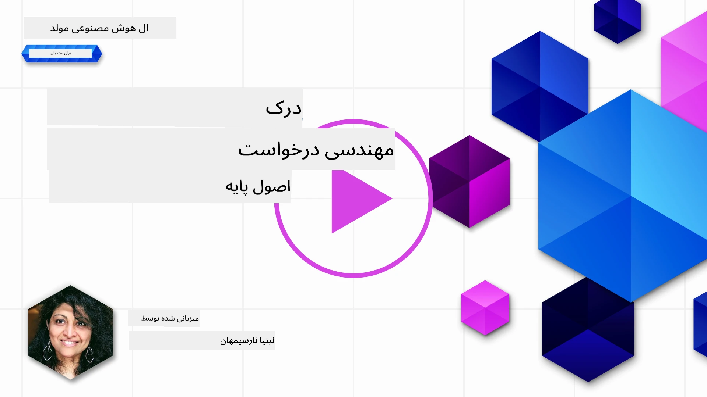
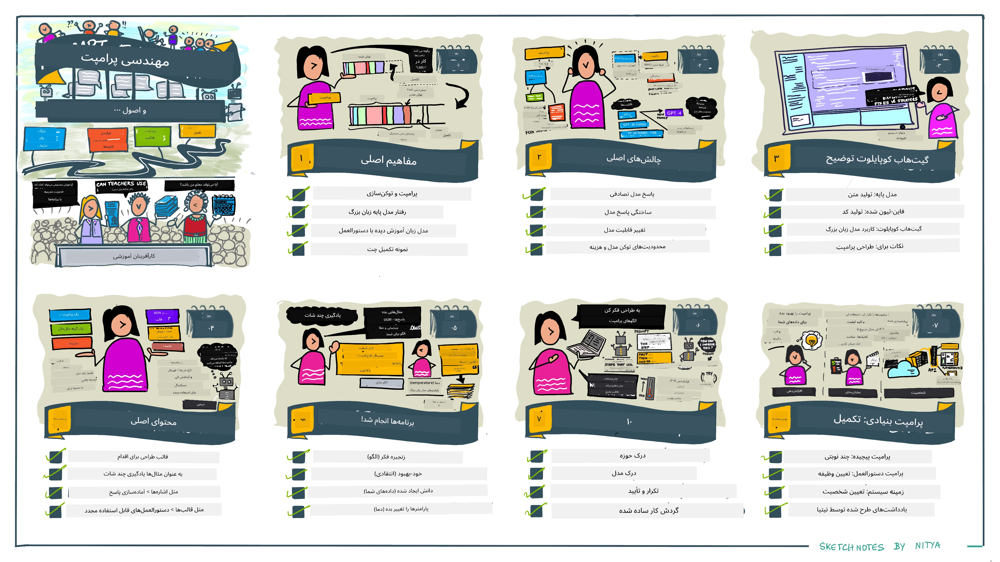
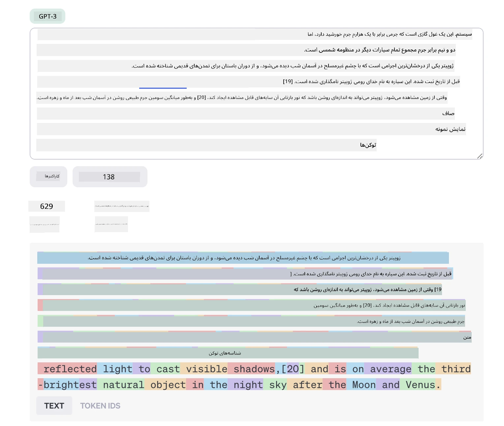
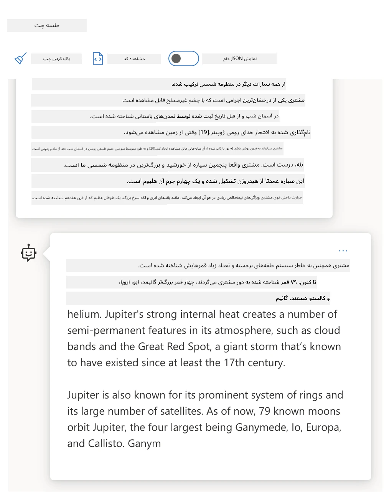
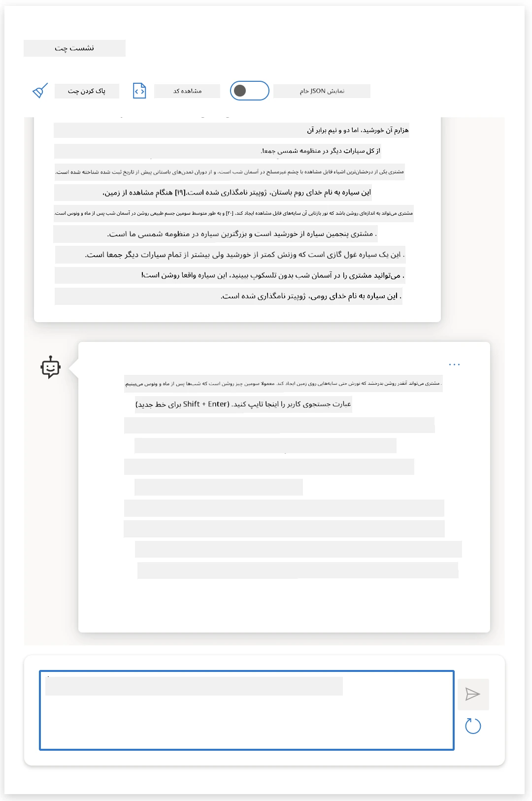
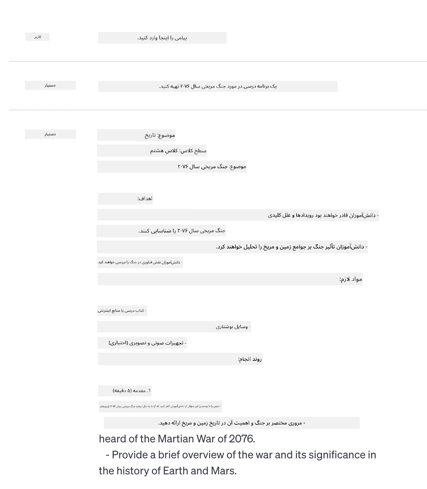
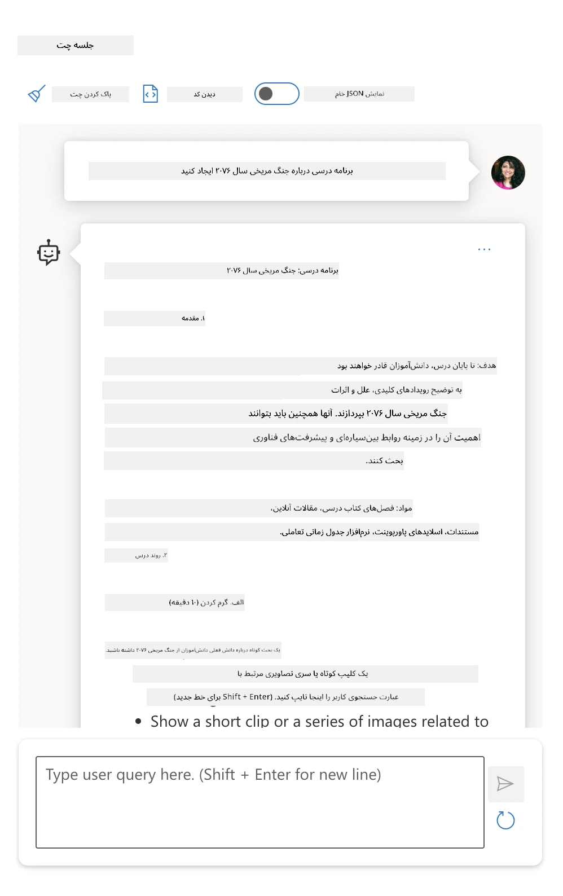
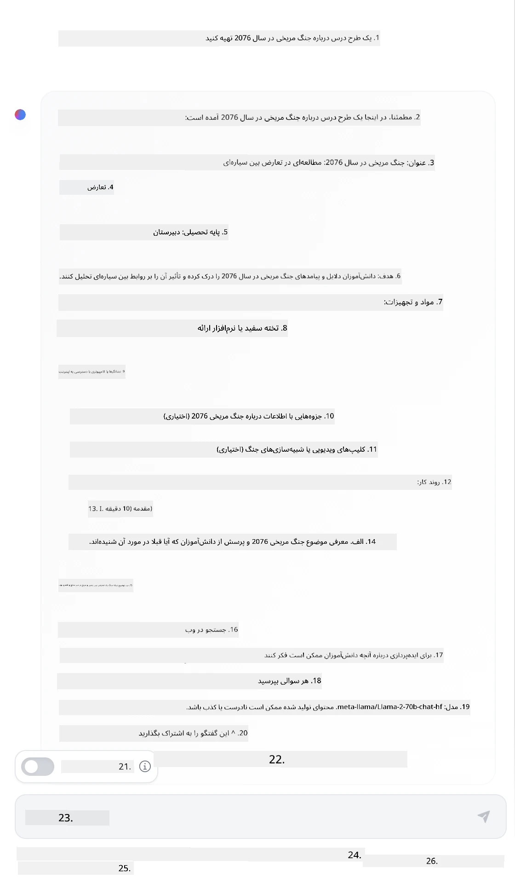

# اصول مهندسی پرسش

[](https://youtu.be/GElCu2kUlRs?si=qrXsBvXnCW12epb8)

## مقدمه
این ماژول مفاهیم و تکنیک‌های ضروری برای ایجاد پرسش‌های مؤثر در مدل‌های هوش مصنوعی تولیدی را پوشش می‌دهد. نحوه نگارش پرسش شما به یک مدل زبان بزرگ (LLM) نیز اهمیت دارد. یک پرسش با طراحی دقیق می‌تواند کیفیت پاسخ را بهبود بخشد. اما دقیقا واژگانی مانند _پرسش_ و _مهندسی پرسش_ چه معنایی دارند؟ و چگونه می‌توان ورودی پرسش را که به مدل زبان بزرگ می‌فرستیم بهبود داد؟ این‌ها سؤالاتی است که در این فصل و فصل بعدی سعی خواهیم کرد به آن‌ها پاسخ دهیم.

_هوش مصنوعی تولیدی_ قادر است محتوای جدیدی (مثلاً متن، تصویر، صدا، کد و غیره) در پاسخ به درخواست‌های کاربر ایجاد کند. این کار را با استفاده از _مدل‌های زبان بزرگ_ مانند سری GPT شرکت OpenAI ("Generative Pre-trained Transformer") انجام می‌دهد که برای استفاده از زبان طبیعی و کد آموزش دیده‌اند.

کاربران اکنون می‌توانند با این مدل‌ها به شیوه‌هایی آشنا مانند چت تعامل داشته باشند، بدون نیاز به تخصص فنی یا آموزش. این مدل‌ها _بر پایه پرسش_ هستند؛ کاربران ورودی متنی (پرسش) می‌فرستند و پاسخ هوش مصنوعی (تکمیل) را دریافت می‌کنند. سپس می‌توانند به طور تکراری «با هوش مصنوعی چت کنند» و در گفتگوهای چند مرحله‌ای، پرسش خود را اصلاح کنند تا پاسخ مطابق انتظارشان شود.

«پرسش‌ها» اکنون به رابط برنامه‌نویسی اصلی برای برنامه‌های هوش مصنوعی تولیدی تبدیل شده‌اند که به مدل‌ها می‌گویند چه کاری انجام دهند و بر کیفیت پاسخ‌های بازگشتی تأثیر می‌گذارند. «مهندسی پرسش» حوزه‌ای در حال رشد سریع است که بر _طراحی و بهینه‌سازی_ پرسش‌ها تمرکز دارد تا پاسخ‌هایی سازگار و با کیفیت در مقیاس بزرگ ارائه دهد.

## اهداف یادگیری

در این درس، می‌آموزیم مهندسی پرسش چیست، چرا اهمیت دارد، و چگونه می‌توانیم پرسش‌های مؤثرتری برای یک مدل و هدف کاربردی طراحی کنیم. مفاهیم اصلی و بهترین شیوه‌های مهندسی پرسش را درک خواهیم کرد و با محیط تعاملی دفترچه‌های Jupyter آشنا می‌شویم که در آن می‌توانیم این مفاهیم را روی مثال‌های واقعی ببینیم.

تا پایان این درس قادر خواهیم بود:

1. تعریف مهندسی پرسش و اهمیت آن را توضیح دهیم.
2. اجزای یک پرسش را شرح دهیم و نحوه استفاده آن‌ها را بیان کنیم.
3. بهترین شیوه‌ها و تکنیک‌های مهندسی پرسش را یاد بگیریم.
4. تکنیک‌های یادگرفته شده را روی مثال‌های واقعی با استفاده از نقطه پایان OpenAI به کار ببریم.

## اصطلاحات کلیدی

مهندسی پرسش: عملی که ورودی‌ها را طراحی و اصلاح می‌کند تا مدل‌های هوش مصنوعی را به سمت تولید خروجی‌های مطلوب هدایت کند.  
توکنیزه‌سازی: فرایند تبدیل متن به واحدهای کوچکتر به نام توکن که مدل می‌تواند آن‌ها را درک و پردازش کند.  
مدل‌های زبان بزرگ تنظیم شده با دستورالعمل: مدل‌های زبان بزرگ که با دستورالعمل‌های خاص برای بهبود دقت و مرتبط بودن پاسخ‌ها تنظیم دقیق شده‌اند.

## محیط تمرینی

مهندسی پرسش فعلاً بیشتر هنر است تا علم. بهترین راه برای بهبود شهود خود در این زمینه، _تمرین بیشتر_ و پذیرش رویکرد آزمون و خطاست که ترکیبی از تخصص حوزه کاربرد با تکنیک‌های توصیه شده و بهینه‌سازی‌های مخصوص مدل است.

دفترچه Jupyter همراه این درس محیط _تمرینی_ فراهم می‌کند که می‌توانید آموخته‌های خود را همزمان یا به عنوان بخشی از چالش کدنویسی پایان درس امتحان کنید. برای اجرای تمرین‌ها به موارد زیر نیاز دارید:

1. **کلید API اوپن‌ای‌آی آژور** - نقطه پایان سرویس برای مدل زبان بزرگ مستقر شده.  
2. **زمان اجرای پایتون** - که دفترچه در آن اجرا می‌شود.  
3. **متغیرهای محیطی محلی** - _اکنون مراحل [راه‌اندازی](./../00-course-setup/02-setup-local.md?WT.mc_id=academic-105485-koreyst) را کامل کنید تا آماده شوید_.

این دفترچه با تمرین‌های _آغازگر_ ارائه شده است - اما شما تشویق می‌شوید بخش Markdown (توضیح) و Code (درخواست پرسش) خود را اضافه کنید تا مثال‌ها یا ایده‌های بیشتری را آزمایش کنید و شهود طراحی پرسش خود را بسازید.

## راهنمای مصور

می‌خواهید پیش‌نمایش کلی از موضوعاتی که این درس پوشش می‌دهد قبل از شروع داشته باشید؟ این راهنمای مصور را ببینید که حس بهتری از موضوعات اصلی و نکات کلیدی برای هر یک به شما می‌دهد. نقشه راه درس شما را از درک مفاهیم و چالش‌های اصلی تا رسیدگی به آن‌ها با تکنیک‌ها و بهترین شیوه‌های مهندسی پرسش هدایت می‌کند. توجه داشته باشید که بخش «تکنیک‌های پیشرفته» در این راهنما به محتوای فصل بعدی این دوره اشاره دارد.



## استارتاپ ما

حال، بیایید درباره چگونگی ارتباط _این موضوع_ با مأموریت استارتاپ خودمان برای [آوردن نوآوری هوش مصنوعی به آموزش](https://educationblog.microsoft.com/2023/06/collaborating-to-bring-ai-innovation-to-education?WT.mc_id=academic-105485-koreyst) صحبت کنیم. ما می‌خواهیم برنامه‌های مبتنی بر هوش مصنوعی برای _یادگیری شخصی‌سازی‌شده_ بسازیم - پس بیایید فکر کنیم چگونه کاربران مختلف برنامه ما ممکن است پرسش‌ها را «طراحی» کنند:

- **مدیران** ممکن است از هوش مصنوعی بخواهند _داده‌های برنامه درسی را برای شناسایی شکاف‌های پوشش تحلیل کند_. هوش مصنوعی می‌تواند نتایج را خلاصه کند یا با کد آن‌ها را تصویری‌سازی کند.  
- **مدرسان** ممکن است از هوش مصنوعی بخواهند _یک برنامه درس برای مخاطب و موضوع هدف تولید کند_. هوش مصنوعی می‌تواند برنامه شخصی‌سازی‌شده را در قالب مشخصی بسازد.  
- **دانش‌آموزان** ممکن است از هوش مصنوعی بخواهند _در یک موضوع دشوار به آن‌ها آموزش دهد_. هوش مصنوعی می‌تواند دانش‌آموزان را با درس‌ها، نکات و مثال‌هایی متناسب با سطح آن‌ها راهنمایی کند.

این تنها نوک کوه یخ است. به [پرسش‌ها برای آموزش](https://github.com/microsoft/prompts-for-edu/tree/main?WT.mc_id=academic-105485-koreyst) نگاه کنید - یک کتابخانه پرسش متن‌باز که توسط کارشناسان آموزش گردآوری شده - تا دید وسیع‌تری از امکانات داشته باشید! _سعی کنید برخی از آن پرسش‌ها را در محیط تمرینی یا با استفاده از OpenAI Playground اجرا کنید و ببینید چه اتفاقی می‌افتد!_

<!--
LESSON TEMPLATE:
This unit should cover core concept #1.
Reinforce the concept with examples and references.

CONCEPT #1:
Prompt Engineering.
Define it and explain why it is needed.
-->

## مهندسی پرسش چیست؟

درس را با تعریف **مهندسی پرسش** شروع کردیم به عنوان فرایند _طراحی و بهینه‌سازی_ ورودی‌های متنی (پرسش‌ها) برای ارائه پاسخ‌های سازگار و با کیفیت (تکمیل) برای یک هدف کاربردی و مدل مشخص. می‌توانیم این را به عنوان یک فرآیند دو مرحله‌ای در نظر بگیریم:

- _طراحی_ پرسش اولیه برای مدل و هدف داده شده  
- _اصلاح_ پرسش به صورت تکراری برای بهبود کیفیت پاسخ

این فرایند الزاما آزمون و خطاست که نیازمند شهود و تلاش کاربر برای دستیابی به نتایج بهینه است. پس چرا این مهم است؟ برای پاسخ به این سؤال، ابتدا باید سه مفهوم را درک کنیم:

- _توکنیزه‌سازی_ = نحوه «دیدن» پرسش توسط مدل  
- _مدل‌های پایه_ = نحوه «پردازش» پرسش توسط مدل پایه  
- _مدل‌های زبان بزرگ تنظیم شده با دستورالعمل_ = نحوه «دیدن کارها» توسط مدل اکنون

### توکنیزه‌سازی

یک مدل زبان بزرگ پرسش‌ها را به صورت _دنباله‌ای از توکن‌ها_ می‌بیند که مدل‌ها (یا نسخه‌های مختلف یک مدل) می‌توانند همان پرسش را به روش‌های مختلف تبدیل به توکن کنند. از آنجا که مدل‌ها روی توکن‌ها (نه متن خام) آموزش دیده‌اند، نحوه توکنیزه کردن پرسش‌ها تأثیر مستقیمی روی کیفیت پاسخ تولید شده دارد.

برای درک نحوه کار توکنیزه‌سازی، ابزارهایی مانند [OpenAI Tokenizer](https://platform.openai.com/tokenizer?WT.mc_id=academic-105485-koreyst) را امتحان کنید که در زیر نشان داده شده است. پرسش خود را وارد کنید و ببینید چگونه به توکن تبدیل می‌شود، به شیوه کنترل شده فضاهای خالی و علائم نگارشی توجه کنید. توجه داشته باشید این مثال مربوط به یک مدل قدیمی‌تر (GPT-3) است - بنابراین امتحان آن با مدل جدیدتر ممکن است نتیجه متفاوتی دهد.



### مفهوم: مدل‌های پایه

وقتی یک پرسش توکنیزه شد، عملکرد اصلی ["مدل پایه"](https://blog.gopenai.com/an-introduction-to-base-and-instruction-tuned-large-language-models-8de102c785a6?WT.mc_id=academic-105485-koreyst) (یا مدل بنیادین) پیش‌بینی توکن بعدی در آن دنباله است. از آنجا که مدل‌ها روی دیتاست‌های متنی عظیم آموزش یافته‌اند، آن‌ها رابطه‌های آماری بین توکن‌ها را به خوبی می‌شناسند و می‌توانند آن پیش‌بینی را با اطمینان نسبی انجام دهند. توجه داشته باشید آن‌ها _معنای_ واژه‌ها را درک نمی‌کنند؛ فقط الگویی می‌بینند که می‌توانند با پیش‌بینی بعدی تکمیل کنند. می‌توانند پیش‌بینی دنباله را تا زمانی که توسط کاربر متوقف شود یا شرط از پیش تعیین شده‌ای فعال شود ادامه دهند.

می‌خواهید ببینید تکمیل مبتنی بر پرسش چگونه کار می‌کند؟ پرسش بالا را در [محیط چت Azure OpenAI Studio](https://oai.azure.com/playground?WT.mc_id=academic-105485-koreyst) با تنظیمات پیش‌فرض وارد کنید. سیستم به گونه‌ای پیکربندی شده که پرسش‌ها را به عنوان درخواست‌های اطلاعاتی در نظر بگیرد - پس باید پاسخ مناسبی ببینید.

اما اگر کاربر می‌خواست چیزی مشخص را که معیار یا هدف کاری خاصی دارد ببیند چطور؟ اینجا مدل‌های _تنظیم شده با دستورالعمل_ وارد تصویر می‌شوند.



### مفهوم: مدل‌های تنظیم‌شده با دستورالعمل

یک [مدل تنظیم‌شده با دستورالعمل](https://blog.gopenai.com/an-introduction-to-base-and-instruction-tuned-large-language-models-8de102c785a6?WT.mc_id=academic-105485-koreyst) از مدل پایه شروع می‌کند و آن را با مثال‌ها یا زوج‌های ورودی/خروجی (مثلاً پیام‌های چند مرحله‌ای) که می‌توانند شامل دستورالعمل‌های واضح باشند، بهینه‌سازی دقیق می‌کند - و پاسخ‌های هوش مصنوعی تلاش می‌کند آن دستورالعمل‌ها را دنبال کند.

از تکنیک‌هایی مانند یادگیری تقویتی با بازخورد انسانی (RLHF) استفاده می‌شود که می‌تواند مدل را آموزش دهد _دستورالعمل‌ها را دنبال کند_ و _از بازخورد بیاموزد_ به گونه‌ای که پاسخ‌هایی مناسب‌تر برای کاربردهای عملی و مرتبط‌تر با اهداف کاربر تولید کند.

بیایید امتحان کنیم - به پرسش بالا برگردید، اما اکنون پیام _سیستم را_ تغییر دهید تا دستورالعمل زیر را به عنوان زمینه ارائه دهید:

> _محتوایی که به شما داده می‌شود را برای دانش‌آموز کلاس دوم خلاصه کنید. نتیجه را در یک پاراگراف با ۳-۵ نکته بولت‌شده نگه دارید._

ببینید چگونه نتیجه اکنون برای بازتاب هدف و قالب مورد نظر تنظیم شده است؟ یک مدرس می‌تواند مستقیماً از این پاسخ در اسلایدهای کلاس خود استفاده کند.



## چرا به مهندسی پرسش نیاز داریم؟

حال که می‌دانیم چگونه مدل‌ها پرسش‌ها را پردازش می‌کنند، بیایید درباره _چرا_ به مهندسی پرسش نیاز داریم صحبت کنیم. پاسخ در این است که مدل‌های زبان بزرگ فعلی چالش‌هایی دارند که _ارائه پاسخ‌های قابل اعتماد و سازگار_ بدون تلاش در ساختار و بهینه‌سازی پرسش را دشوار می‌سازد. برای مثال:

1. **پاسخ مدل‌ها تصادفی است.** ممکن است یک _پرسش_ یکسان با مدل‌ها یا نسخه‌های مختلف نتایج متفاوتی تولید کند. و حتی ممکن است با همان مدل در زمان‌های مختلف نتایج متفاوتی دهد. _تکنیک‌های مهندسی پرسش می‌توانند با فراهم کردن محدودیت‌های بهتر این نوسانات را کاهش دهند._

1. **مدل‌ها می‌توانند پاسخ‌های ساختگی بسازند.** مدل‌ها با دیتاست‌هایی _بزرگ اما محدود_ آموزش دیده‌اند، به این معنی که دانش آن‌ها درباره مفاهیمی خارج از دامنه آموزش ناقص است. در نتیجه، ممکن است پاسخ‌هایی نادرست، خیالی یا متناقض با حقایق شناخته شده تولید کنند. _تکنیک‌های مهندسی پرسش به کاربران کمک می‌کند چنین ساختگی‌ها را شناسایی و کاهش دهند، مثلاً با درخواست استناد یا استدلال از هوش مصنوعی._

1. **قابلیت‌های مدل‌ها متفاوت خواهد بود.** مدل‌های جدیدتر یا نسل‌های مدل توانایی‌های غنی‌تری دارند اما همچنین ویژگی‌ها و پیچیدگی‌ها و هزینه‌های مخصوص خود را دارند. _مهندسی پرسش می‌تواند به ما کمک کند بهترین شیوه‌ها و جریان‌های کاری را توسعه دهیم که تفاوت‌ها را انتزاع کرده و به نیازهای مخصوص مدل‌ها به صورت مقیاس‌پذیر و بی‌وقفه سازگار شود._

بیایید این را در عمل در Playground اوپن‌ای‌آی یا Azure OpenAI ببینیم:

- از همان پرسش با استقرارهای مختلف مدل زبان بزرگ (مثلاً OpenAI، Azure OpenAI، Hugging Face) استفاده کنید - آیا تفاوت‌ها را مشاهده کردید؟  
- از همان پرسش به طور مکرر با _همان_ استقرار مدل زبان بزرگ (مثلاً Azure OpenAI playground) استفاده کنید - این تفاوت‌ها چگونه بودند؟

### مثال ساختگی

در این دوره، ما از اصطلاح **«ساختگی»** برای اشاره به پدیده‌ای استفاده می‌کنیم که در آن مدل‌های زبان بزرگ گاهی اطلاعات نادرست تولید می‌کنند به دلیل محدودیت‌های آموزش یا عوامل دیگر. ممکن است این پدیده را در مقالات یا تحقیقات تحت عنوان «توهمات» شنیده باشید. با این‌حال ما قویاً توصیه می‌کنیم از اصطلاح _«ساختگی»_ استفاده شود تا از انسان‌انگاری رفتار ماشین جلوگیری شود و به نتیجه‌ای صورت انسانی نسبت داده نشود. این همچنین از نظر اصطلاح‌شناسی با [خط‌مشی‌های هوش مصنوعی مسئول](https://www.microsoft.com/ai/responsible-ai?WT.mc_id=academic-105485-koreyst) هماهنگ است و اصطلاحاتی که ممکن است توهین‌آمیز یا غیرشامل در برخی زمینه‌ها تلقی شوند را حذف می‌کند.

می‌خواهید درک کنید ساختگی‌ها چگونه کار می‌کنند؟ فرض کنید پرسشی وجود دارد که به هوش مصنوعی دستور می‌دهد محتوایی درباره موضوعی غیرواقعی تولید کند (برای اطمینان از اینکه در مجموعه آموزشی وجود ندارد). برای مثال، من این پرسش را امتحان کردم:

> **پرسش:** یک برنامه درس درباره جنگ مریخی در سال ۲۰۷۶ تولید کن.
یک جستجوی وب به من نشان داد که داستان‌های تخیلی (مثلاً سریال‌های تلویزیونی یا کتاب‌ها) درباره جنگ‌های مریخی وجود دارد - اما هیچ‌کدام در سال ۲۰۷۶ نیستند. عقل سلیم نیز به ما می‌گوید که ۲۰۷۶ _در آینده_ است و بنابراین نمی‌تواند به یک رویداد واقعی نسبت داده شود.

حالا وقتی این پرسش را با ارائه‌دهندگان مختلف مدل‌های زبانی بزرگ (LLM) اجرا کنیم، چه اتفاقی می‌افتد؟

> **پاسخ ۱**: OpenAI Playground (GPT-35)



> **پاسخ ۲**: Azure OpenAI Playground (GPT-35)



> **پاسخ ۳**: : Hugging Face Chat Playground (LLama-2)



همانطور که انتظار می‌رود، هر مدل (یا نسخه مدل) پاسخ‌هایی کمی متفاوت تولید می‌کند که ناشی از رفتار تصادفی و تفاوت‌های توانایی مدل‌ها است. مثلاً یک مدل برای مخاطب کلاس هشتم هدف‌گذاری شده در حالی که مدل دیگر فرض می‌کند دانش‌آموز دبیرستانی است. اما هر سه مدل پاسخ‌هایی تولید کردند که می‌تواند کاربری ناآگاه را به واقعی بودن آن رویداد متقاعد کند.

تکنیک‌های مهندسی پرسش مثل _متاپرامپتینگ_ و _تنظیم دما_ ممکن است تا حدی تولید تخیلی مدل‌ها را کاهش دهند. معماری‌های جدید مهندسی پرسش همچنین ابزارها و تکنیک‌های جدید را به طور روان در جریان پرسش ادغام می‌کنند تا برخی از این اثرات کاهش یا مهار شوند.

## مطالعه موردی: GitHub Copilot

این بخش را با بررسی نحوه استفاده از مهندسی پرسش در راه‌حل‌های دنیای واقعی با نگاه به یک مطالعه موردی به پایان می‌رسانیم: [GitHub Copilot](https://github.com/features/copilot?WT.mc_id=academic-105485-koreyst).

GitHub Copilot «برنامه‌نویس جفت هوش مصنوعی» شماست - این ابزار متون وارد شده را به تکمیل کد تبدیل می‌کند و در محیط توسعه شما (مثلاً Visual Studio Code) یکپارچه شده است تا تجربه کاربری روانی ارائه دهد. همانطور که در مجموعه بلاگ‌های زیر مستند شده است، نسخه اولیه بر اساس مدل OpenAI Codex بود - و مهندسین خیلی زود نیاز به تنظیم دقیق مدل و توسعه تکنیک‌های بهتر مهندسی پرسش برای بهبود کیفیت کد را درک کردند. در ماه جولای، آن‌ها [مدل هوش مصنوعی بهبودیافته‌ای ارائه کردند که فراتر از Codex می‌رود](https://github.blog/2023-07-28-smarter-more-efficient-coding-github-copilot-goes-beyond-codex-with-improved-ai-model/?WT.mc_id=academic-105485-koreyst) و پیشنهادات سریع‌تری را ممکن می‌سازد.

مطالب را به ترتیب بخوانید تا روند یادگیری آن‌ها را دنبال کنید.

- **مه ۲۰۲۳** | [GitHub Copilot در فهم کد شما بهتر می‌شود](https://github.blog/2023-05-17-how-github-copilot-is-getting-better-at-understanding-your-code/?WT.mc_id=academic-105485-koreyst)
- **مه ۲۰۲۳** | [درون GitHub: کار با مدل‌های زبانی بزرگ پشت GitHub Copilot](https://github.blog/2023-05-17-inside-github-working-with-the-llms-behind-github-copilot/?WT.mc_id=academic-105485-koreyst)
- **ژوئن ۲۰۲۳** | [چگونه پرامپت‌های بهتری برای GitHub Copilot بنویسیم](https://github.blog/2023-06-20-how-to-write-better-prompts-for-github-copilot/?WT.mc_id=academic-105485-koreyst)
- **جولای ۲۰۲۳** | [.. GitHub Copilot فراتر از Codex می‌رود با مدل هوش مصنوعی بهبودیافته](https://github.blog/2023-07-28-smarter-more-efficient-coding-github-copilot-goes-beyond-codex-with-improved-ai-model/?WT.mc_id=academic-105485-koreyst)
- **جولای ۲۰۲۳** | [راهنمای توسعه‌دهنده برای مهندسی پرامپت و مدل‌های زبانی بزرگ](https://github.blog/2023-07-17-prompt-engineering-guide-generative-ai-llms/?WT.mc_id=academic-105485-koreyst)
- **سپتامبر ۲۰۲۳** | [چگونه یک اپلیکیشن مدل زبانی بزرگ سازمانی بسازیم: درس‌هایی از GitHub Copilot](https://github.blog/2023-09-06-how-to-build-an-enterprise-llm-application-lessons-from-github-copilot/?WT.mc_id=academic-105485-koreyst)

همچنین می‌توانید بلاگ مهندسی آن‌ها را مرور کنید [Engineering blog](https://github.blog/category/engineering/?WT.mc_id=academic-105485-koreyst) برای پست‌های بیشتری مانند [این](https://github.blog/2023-09-27-how-i-used-github-copilot-chat-to-build-a-reactjs-gallery-prototype/?WT.mc_id=academic-105485-koreyst) که نشان می‌دهد چگونه این مدل‌ها و تکنیک‌ها برای پیشبرد برنامه‌های دنیای واقعی _به کار گرفته شده‌اند_.

---

<!--
LESSON TEMPLATE:
This unit should cover core concept #2.
Reinforce the concept with examples and references.

CONCEPT #2:
Prompt Design.
Illustrated with examples.
-->

## ساخت پرامپت

دیدیم چرا مهندسی پرامپت اهمیت دارد - حالا بیایید بفهمیم پرامپت‌ها چگونه _ساخته_ می‌شوند تا بتوانیم تکنیک‌های مختلف طراحی پرامپت مؤثرتر را ارزیابی کنیم.

### پرامپت پایه

ابتدا با پرامپت پایه شروع کنیم: ورودی متنی که بدون هیچ زمینه دیگری به مدل ارسال می‌شود. این یک مثال است - وقتی چند کلمه نخست سرود ملی آمریکا را به OpenAI [Completion API](https://platform.openai.com/docs/api-reference/completions?WT.mc_id=academic-105485-koreyst) می‌فرستیم، مدل بلافاصله پاسخ را با چند خط بعدی _تکمیل_ می‌کند که رفتار پیش‌بینی پایه را نشان می‌دهد.

| پرامپت (ورودی)          | تکمیل (خروجی)                                                                                                                                            |
| :---------------------- | :-------------------------------------------------------------------------------------------------------------------------------------------------------- |
| Oh say can you see       | به نظر می‌رسد شروع به خواندن متن «The Star-Spangled Banner»، سرود ملی ایالات متحده کرده‌اید. متن کامل این سرود ...                                     |

### پرامپت پیچیده

حالا به آن پرامپت پایه زمینه و دستورالعمل اضافه کنیم. [Chat Completion API](https://learn.microsoft.com/azure/ai-services/openai/how-to/chatgpt?WT.mc_id=academic-105485-koreyst) به ما اجازه می‌دهد پرامپت پیچیده‌ای را به صورت مجموعه‌ای از _پیام‌ها_ بسازیم با:

- جفت‌های ورودی/خروجی که ورودی _کاربر_ و پاسخ _دستیار_ را نشان می‌دهند.
- پیام سیستم که زمینه رفتار یا شخصیت دستیار را تعیین می‌کند.

درخواستی که حالا به شکل زیر است، جایی که _تکنیک توکنیزیشن_ اطلاعات مرتبط با زمینه و مکالمه را به‌خوبی استخراج می‌کند. تغییر زمینه سیستم می‌تواند به همان اندازه ورودی‌های کاربر روی کیفیت تکمیل‌ها تأثیر داشته باشد.

```python
response = openai.chat.completions.create(
    model="gpt-3.5-turbo",
    messages=[
        {"role": "system", "content": "You are a helpful assistant."},
        {"role": "user", "content": "Who won the world series in 2020?"},
        {"role": "assistant", "content": "The Los Angeles Dodgers won the World Series in 2020."},
        {"role": "user", "content": "Where was it played?"}
    ]
)
```

### پرامپت دستوری

در مثال‌های بالا، پرامپت کاربر یک پرسش متنی ساده بود که می‌توان آن را به عنوان درخواست اطلاعات تفسیر کرد. با پرامپت‌های _دستوری_، می‌توانیم آن متن را برای مشخص کردن یک وظیفه با جزئیات بیشتر استفاده کنیم و راهنمایی بهتری به هوش مصنوعی بدهیم. اینجا یک مثال است:

| پرامپت (ورودی)                                                                                                                                                                                                                         | تکمیل (خروجی)                                                                                                         | نوع دستور                     |
| :------------------------------------------------------------------------------------------------------------------------------------------------------------------------------------------------------------------------------------- | :--------------------------------------------------------------------------------------------------------------------- | :---------------------------- |
| توضیحی درباره جنگ داخلی بنویس                                                                                                                                                                                                             | _یک پاراگراف ساده بازگرداند_                                                                                         | ساده                         |
| توضیحی درباره جنگ داخلی بنویس. تاریخ‌ها و رویدادهای کلیدی را ارائه کن و اهمیت آن‌ها را شرح بده                                                                                                                                             | _یک پاراگراف همراه با فهرستی از تاریخ‌های رویدادهای کلیدی به همراه توضیحات بازگرداند_                                | پیچیده                       |
| توضیحی درباره جنگ داخلی در یک پاراگراف بنویس. ۳ نکته کلیدی درباره تاریخ‌ها و اهمیتشان ارائه کن. ۳ نکته دیگر درباره شخصیت‌های تاریخی مهم و سهم آن‌ها ارائه کن. خروجی را به صورت فایل JSON برگردان | _جزئیات بیشتر در جعبه متنی به صورت JSON که می‌توانید آن را کپی-پیست کنید و در صورت نیاز اعتبارسنجی کنید_            | پیچیده. قالب‌بندی شده.       |

## محتوای اصلی

در مثال‌های بالا، پرامپت هنوز نسبتا باز بود و اجازه می‌داد مدل زبانی بزرگ تصمیم بگیرد کدام بخش از داده‌های از پیش‌آموزش دیده مرتبط است. با الگوی طراحی _محتوای اصلی_، متن ورودی به دو بخش تقسیم می‌شود:

- دستورالعمل (عمل)
- محتوای مرتبط (که بر عمل تأثیر می‌گذارد)

در اینجا مثال داریم که دستورالعمل آن «خلاصه کردن در ۲ جمله» است.

| پرامپت (ورودی)                                                                                                                                                                                                                                                                                                                                                                                                                                                                                                                                                                                                                                                                                   | تکمیل (خروجی)                                                                                                                                                                                                                                                                                                    |
| :------------------------------------------------------------------------------------------------------------------------------------------------------------------------------------------------------------------------------------------------------------------------------------------------------------------------------------------------------------------------------------------------------------------------------------------------------------------------------------------------------------------------------------------------------------------------------------------------------------------------------------------------------------------------------------------------- | :----------------------------------------------------------------------------------------------------------------------------------------------------------------------------------------------------------------------------------------------------------------------------------------------------------------- |
| سیاره مشتری پنجمین سیاره از خورشید و بزرگ‌ترین در منظومه شمسی است. این یک سیاره غول‌پیکر گازی با جرمی معادل یک‌هزارم جرم خورشید، اما دو و نیم برابر همه سیارات دیگر منظومه شمسی است. مشتری یکی از روشن‌ترین اجرام قابل مشاهده با چشم غیرمسلح در آسمان شب است و از زمان‌های بسیار دور برای تمدن‌های باستانی شناخته شده است. این سیاره به نام خدای رومی، مشتری نام‌گذاری شده است.[۱۹] وقتی از زمین مشاهده می‌شود، مشتری می‌تواند به اندازه‌ای روشن باشد که سایه‌های قابل مشاهده بیندازد[۲۰] و به طور متوسط سومین جرم طبیعی روشن در آسمان شب پس از ماه و زهره است. <br/> **این را در ۲ جمله کوتاه خلاصه کن** | مشتری، پنجمین سیاره از خورشید، بزرگ‌ترین در منظومه شمسی است و به عنوان یکی از روشن‌ترین اجرام آسمان شب شناخته می‌شود. به نام خدای رومی مشتری نام‌گذاری شده، و این غول گازی جرمی دو و نیم برابر همه سیارات دیگر منظومه شمسی دارد. |

قسمت محتوای اصلی می‌تواند به روش‌های مختلفی برای هدایت دستورالعمل‌های مؤثرتر به کار رود:

- **مثال‌ها** – به جای اینکه به مدل به صورت دستور صریح بگوییم چه کاری انجام دهد، نمونه‌هایی از آنچه می‌خواهیم بدهیم و اجازه دهیم الگوریتم الگو را استخراج کند.
- **سرنخ‌ها** – دستور را با «سرنخ» دنبال می‌کنیم که شروع پاسخ را نشان می‌دهد و مدل را به سمت پاسخ‌های مرتبط‌تر هدایت می‌کند.
- **قالب‌ها** – این‌ها «دستور پخت»های تکرارشونده برای پرامپت با جایگزین‌هایی (متغیرها) هستند که برای موارد خاص با داده سفارشی می‌شوند.

بیایید این موارد را در عمل بررسی کنیم.

### استفاده از مثال‌ها

این روشی است که در آن محتوای اصلی برای «تغذیه مدل» با نمونه‌هایی از خروجی موردنظر برای یک دستور خاص استفاده می‌شود و اجازه داده می‌شود الگو برای خروجی مطلوب استنتاج شود. بر اساس تعداد مثال‌های داده شده، می‌توانیم پرامپت صفر-شات، یک-شات، چند-شات و غیره داشته باشیم.

پرامپت اکنون متشکل از سه جزء است:

- توصیف وظیفه
- چند مثال از خروجی مطلوب
- شروع یک مثال جدید (که به شکل ضمنی توصیف وظیفه می‌شود)

| نوع یادگیری  | پرامپت (ورودی)                                                                                                                                             | تکمیل (خروجی)               |
| :----------- | :--------------------------------------------------------------------------------------------------------------------------------------------------------- | :--------------------------- |
| صفر-شات      | "The Sun is Shining". به اسپانیایی ترجمه کن                                                                                                              | "El Sol está brillando".     |
| یک-شات       | "The Sun is Shining" => ""El Sol está brillando". <br> "It's a Cold and Windy Day" =>                                                                       | "Es un día frío y ventoso".  |
| چند-شات      | بازیکن پای‌ها را دوید => بیسبال <br/> بازیکن توپ سرویس زد => تنیس <br/> بازیکن شش زد => کریکت <br/> بازیکن اسلم دانک کرد => بسکتبال                        | بسکتبال                      |
|              |                                                                                                                                                            |                             |

دقت کنید که در پرامپت صفر-شات باید دستور صریح «به اسپانیایی ترجمه کن» داشته باشیم، اما این دستور در مثال یک-شات استنتاج می‌شود. مثال چند-شات نشان می‌دهد افزودن نمونه‌های بیشتر باعث می‌شود مدل‌ها بتوانند استنتاج‌های دقیق‌تری بدون دستور اضافه انجام دهند.

### سرنخ‌های پرامپت

روش دیگر برای استفاده از محتوای اصلی، ارائه سرنخ است نه نمونه‌ها. در این حالت، ما با یک قطعه که فرمت پاسخ موردنظر را نشان می‌دهد، مدل را _شروع_ می‌کنیم و مدل سپس «سرنخ را گرفته» و در همان مسیر ادامه می‌دهد.

| تعداد سرنخ‌ها | پرامپت (ورودی)                                                                                                                                                                                                                                                                                                                                                                                                    | تکمیل (خروجی)                                                                                                                                                                                                                                                                                          |
| :------------- | :---------------------------------------------------------------------------------------------------------------------------------------------------------------------------------------------------------------------------------------------------------------------------------------------------------------------------------------------------------------------------------------------------------------- | :---------------------------------------------------------------------------------------------------------------------------------------------------------------------------------------------------------------------------------------------------------------------------------------------------- |
| ۰              | سیاره مشتری پنجمین سیاره از خورشید و بزرگ‌ترین در منظومه شمسی است. این یک غول گازی با جرمی معادل یک‌هزارم جرم خورشید، اما دو و نیم برابر تمام سیارات دیگر منظومه شمسی است. مشتری یکی از روشن‌ترین اجرام قابل مشاهده با چشم غیرمسلح در آسمان شب است و از زمان‌های بسیار دور برای تمدن‌های باستانی شناخته شده است. <br/>**این را خلاصه کن**                                        | مشتری بزرگ‌ترین سیاره در منظومه شمسی ما و پنجمین سیاره از خورشید است. این غول گازی جرمی یک‌هزارم جرم خورشید دارد اما سنگین‌تر از تمام سیارات دیگر است. تمدن‌های باستانی مدت‌هاست مشتری را می‌شناسند و به راحتی در آسمان شب دیده می‌شود. |
| 1              | مشتری پنجمین سیاره از خورشید و بزرگ‌ترین در منظومه شمسی است. این یک غول گازی با جرمی برابر یک هزارم جرم خورشید است، اما دو و نیم برابر جرم تمام سیاره‌های دیگر در منظومه شمسی به‌طور مجموع است. مشتری یکی از درخشان‌ترین اجرامی است که با چشم غیرمسلح در آسمان شب دیده می‌شود و از زمان‌های قدیم برای تمدن‌های باستان شناخته شده است. <br/>**خلاصه این مطلب** <br/> آنچه آموختیم این است که مشتری | پنجمین سیاره از خورشید و بزرگ‌ترین در منظومه شمسی است. این یک غول گازی با جرمی برابر یک هزارم جرم خورشید است، اما دو و نیم برابر جرم تمام سیاره‌های دیگر در مجموع است. به راحتی با چشم غیرمسلح قابل رؤیت است و از زمان‌های باستان شناخته شده است.                        |
| 2              | مشتری پنجمین سیاره از خورشید و بزرگ‌ترین در منظومه شمسی است. این یک غول گازی با جرمی برابر یک هزارم جرم خورشید است، اما دو و نیم برابر جرم تمام سیاره‌های دیگر در منظومه شمسی به‌طور مجموع است. مشتری یکی از درخشان‌ترین اجرامی است که با چشم غیرمسلح در آسمان شب دیده می‌شود و از زمان‌های قدیم برای تمدن‌های باستان شناخته شده است. <br/>**خلاصه این مطلب** <br/> سه حقیقت برتر که آموختیم:         | 1. مشتری پنجمین سیاره از خورشید و بزرگ‌ترین در منظومه شمسی است. <br/> 2. این یک غول گازی با جرمی برابر یک هزارم جرم خورشید است...<br/> 3. مشتری از زمان‌های باستان با چشم غیرمسلح دیده شده است ...                                                                       |
|                |                                                                                                                                                                                                                                                                                                                                                                                                                                                              |                                                                                                                                                                                                                                                                                                           |

### قالب‌های پرامپت

قالب پرامپت یک _دستورالعمل از پیش تعریف شده برای یک پرامپت_ است که می‌تواند ذخیره شده و در صورت نیاز مجدداً استفاده شود تا تجربه‌های کاربری سازگارتر در مقیاس وسیع ایجاد کند. در ساده‌ترین شکل، این فقط مجموعه‌ای از نمونه‌های پرامپت مانند [این نمونه از OpenAI](https://platform.openai.com/examples?WT.mc_id=academic-105485-koreyst) است که شامل اجزای تعاملی پرامپت (پیام‌های کاربر و سیستم) و فرمت درخواست API می‌باشد - برای پشتیبانی از استفاده مجدد.

در شکل پیچیده‌ترش مانند [این مثال از LangChain](https://python.langchain.com/docs/concepts/prompt_templates/?WT.mc_id=academic-105485-koreyst) شامل _موارد جایگزین_ است که می‌توان آن‌ها را با داده‌هایی از منابع مختلف (ورودی کاربر، متن سیستم، منابع داده خارجی و غیره) جایگزین کرد تا به صورت پویا پرامپت تولید شود. این امکان را به ما می‌دهد تا کتابخانه‌ای از پرامپت‌های قابل استفاده مجدد بسازیم که بتوانند تجربه‌های کاربری سازگار را به صورت **برنامه‌ریزی شده** و در مقیاس ارائه دهند.

در نهایت، ارزش واقعی قالب‌ها در توانایی ایجاد و انتشار _کتابخانه‌های پرامپت_ برای حوزه‌های کاربردی عمودی است—جایی که قالب پرامپت بهینه شده است تا متن یا مثال‌های خاص حوزه برنامه را منعکس کند که پاسخ‌ها را برای مخاطبان هدف مرتبط‌تر و دقیق‌تر می‌کند. مخزن [Prompts For Edu](https://github.com/microsoft/prompts-for-edu?WT.mc_id=academic-105485-koreyst) نمونه‌ای عالی از این رویکرد است که کتابخانه‌ای از پرامپت‌ها برای حوزه آموزش با تمرکز بر اهداف کلیدی مانند برنامه‌ریزی درس، طراحی برنامه درسی، آموزش دانش‌آموزان و غیره گردآوری کرده است.

## محتوای پشتیبان

اگر ساخت پرامپت را به عنوان داشتن یک دستورالعمل (کار) و یک هدف (محتوای اصلی) در نظر بگیریم، در این صورت _محتوای ثانویه_ مانند زمینه اضافی است که برای **تأثیرگذاری بر خروجی به نوعی** ارائه می‌دهیم. این می‌تواند پارامترهای تنظیم، دستورالعمل‌های قالب‌بندی، طبقه‌بندی‌های موضوعی و غیره باشد که به مدل کمک می‌کند پاسخ خود را منطبق با اهداف یا انتظارات کاربر سفارشی‌سازی کند.

برای مثال: فرض کنید یک کاتالوگ دوره با متاداده‌های گسترده (نام، توضیح، سطح، برچسب‌های متاداده، مدرس و غیره) برای همه دوره‌های موجود در برنامه درسی داریم:

- می‌توانیم یک دستورالعمل تعریف کنیم برای "خلاصه کاتالوگ دوره‌های پاییز ۲۰۲۳"
- می‌توانیم از محتوای اصلی برای ارائه چند نمونه از خروجی مورد نظر استفاده کنیم
- می‌توانیم از محتوای ثانویه برای شناسایی ۵ "برچسب" برتر مورد علاقه استفاده کنیم.

اکنون، مدل می‌تواند خلاصه‌ای در قالب نشان داده شده توسط چند نمونه ارائه دهد - اما اگر نتیجه چندین برچسب داشته باشد، می‌تواند ۵ برچسب مشخص شده در محتوای ثانویه را اولویت‌بندی کند.

---

<!--
LESSON TEMPLATE:
This unit should cover core concept #1.
Reinforce the concept with examples and references.

CONCEPT #3:
Prompt Engineering Techniques.
What are some basic techniques for prompt engineering?
Illustrate it with some exercises.
-->

## بهترین روش‌های پرامپت‌نویسی

حال که می‌دانیم پرامپت‌ها چگونه می‌توانند _ساخته شوند_، می‌توانیم به نحوه _طراحی_ آن‌ها برای بهینه‌سازی بهترین روش‌ها فکر کنیم. می‌توانیم این را در دو بخش در نظر بگیریم - داشتن ذهنیت درست و به‌کارگیری تکنیک‌های مناسب.

### ذهنیت مهندسی پرامپت

مهندسی پرامپت یک فرآیند آزمون و خطا است، پس سه عامل کلی هدایت‌کننده را به خاطر بسپارید:

1. **درک حوزه اهمیت دارد.** دقت و مرتبط بودن پاسخ تابعی از _حوزه_ است که آن برنامه یا کاربر در آن عمل می‌کند. از شهود و تخصص حوزه‌ای خود برای **سفارشی‌سازی تکنیک‌ها** استفاده کنید. برای مثال، شخصیت‌های خاص حوزه را در پرامپت‌های سیستمی تعریف کنید، یا از قالب‌های خاص حوزه برای پرامپت‌های کاربران بهره ببرید. محتوای ثانویه‌ای ارائه دهید که زمینه‌های خاص حوزه را انعکاس دهد، یا از نشانه‌ها و مثال‌های خاص حوزه برای هدایت مدل به سمت الگوهای استفاده آشنا بهره ببرید.

2. **درک مدل اهمیت دارد.** می‌دانیم که مدل‌ها ذاتاً احتمال‌محور هستند. اما پیاده‌سازی مدل‌ها می‌تواند از نظر مجموعه داده‌های آموزشی (دانش پیش‌آموزش)، قابلیت‌هایی که ارائه می‌دهند (مثلاً از طریق API یا SDK) و نوع محتوایی که برای آن بهینه شده‌اند (کد، تصاویر، متن و غیره) متفاوت باشد. نقاط قوت و محدودیت‌های مدلی را که استفاده می‌کنید درک کنید و از آن دانش برای _اولویت‌بندی وظایف_ یا ساخت قالب‌های سفارشی که برای قابلیت‌های مدل بهینه شده‌اند، بهره ببرید.

3. **تکرار و اعتبارسنجی اهمیت دارد.** مدل‌ها به سرعت در حال تکامل هستند، و تکنیک‌های مهندسی پرامپت نیز همین‌طور. به عنوان یک متخصص حوزه، ممکن است زمینه یا معیارهای خاص خود را برای برنامه خاصتان داشته باشید که ممکن است برای جامعه گسترده‌تر صدق نکند. از ابزارها و تکنیک‌های مهندسی پرامپت برای "راه‌اندازی سریع" ساخت پرامپت استفاده کنید، سپس نتایج را با شهود و تخصص حوزه‌ای خود تکرار و اعتبارسنجی کنید. بینش‌های خود را ثبت کرده و یک **پایگاه دانش** (مثلاً کتابخانه‌های پرامپت) بسازید که سایرین بتوانند به عنوان مبنای جدید برای تکرار‌های سریع‌تر در آینده از آن استفاده کنند.

## بهترین روش‌ها

اکنون بیایید به بهترین روش‌های رایج که توسط [OpenAI](https://help.openai.com/en/articles/6654000-best-practices-for-prompt-engineering-with-openai-api?WT.mc_id=academic-105485-koreyst) و [Azure OpenAI](https://learn.microsoft.com/azure/ai-services/openai/concepts/prompt-engineering#best-practices?WT.mc_id=academic-105485-koreyst) توصیه شده‌اند نگاه کنیم.

| چه چیزی                           | چرا                                                                                                                                                                                                                                               |
| :-------------------------------- | :------------------------------------------------------------------------------------------------------------------------------------------------------------------------------------------------------------------------------------------------ |
| آخرین مدل‌ها را ارزیابی کنید       | نسل‌های جدید مدل احتمالاً ویژگی‌ها و کیفیت بهتری دارند - اما ممکن است هزینه‌های بیشتری نیز داشته باشند. آن‌ها را از نظر تاثیر ارزیابی کرده و سپس تصمیمات مهاجرت بگیرید.                                                                        |
| دستورالعمل‌ها و زمینه را جدا کنید | بررسی کنید آیا مدل/ارائه‌دهنده شما _مرزبندی_‌هایی برای متمایز کردن دستورالعمل‌ها، محتوای اصلی و ثانویه تعریف می‌کند یا خیر. این می‌تواند به مدل‌ها کمک کند وزن‌ها را دقیق‌تر به توکن‌ها اختصاص دهند.                                          |
| خاص و واضح باشید                 | جزئیات بیشتری درباره زمینه مورد نظر، نتیجه، طول، قالب، سبک و غیره بدهید. این هم کیفیت و هم ثبات پاسخ‌ها را بهبود می‌بخشد. دستورالعمل‌ها را در قالب‌های قابل استفاده مجدد ثبت کنید.                                                             |
| توصیفی باشید، از مثال استفاده کنید | مدل‌ها ممکن است بهتر به رویکرد "نمایش و توضیح" پاسخ دهند. با یک رویکرد `صفر-نمونه` شروع کنید که فقط دستورالعمل بدهید (بدون نمونه) سپس با `چند-نمونه` آن را دقیق‌تر کنید، چند نمونه از خروجی مورد نظر ارائه دهید. از استعاره استفاده کنید.          |
| از نشانه‌ها برای شروع تکمیل‌ها استفاده کنید | مدل را به سمت نتیجه دلخواه با دادن چند کلمه یا عبارت راهنما سوق دهید تا بتواند آن‌ها را به عنوان نقطه شروع پاسخ استفاده کند.                                                                                                               |
| تکرار کنید                       | گاهی اوقات ممکن است لازم باشد دستور را به مدل تکرار کنید. دستورالعمل‌ها را قبل و بعد از محتوای اصلی بدهید، از یک دستورالعمل و نشانه استفاده کنید و غیره. تکرار و اعتبارسنجی کنید تا ببینید چه چیزی موثر است.                                      |
| ترتیب اهمیت دارد                 | ترتیب ارائه اطلاعات به مدل ممکن است بر خروجی تأثیرگذار باشد، حتی در نمونه‌های آموزشی، به دلیل اثر تازگی. گزینه‌های مختلف را امتحان کنید تا ببینید چه چیزی بهترین پاسخ را می‌دهد.                                                               |
| به مدل یک "خروج امن" بدهید       | به مدل یک پاسخ _پشتیبان_ بدهید که اگر به هر دلیلی نتوانست کار را کامل کند ارائه دهد. این می‌تواند احتمال تولید پاسخ‌های نادرست یا ساختگی توسط مدل را کاهش دهد.                                                                             |
|                                   |                                                                                                                                                                                                                                                   |

همانند هر بهترین روش دیگر، به یاد داشته باشید که _نتایج شما ممکن است متفاوت باشد_ بسته به مدل، کار و حوزه. این‌ها را به عنوان نقطه شروع استفاده کنید و برای پیدا کردن بهترین روش برای خودتان تکرار کنید. به صورت مداوم فرآیند مهندسی پرامپت خود را هنگام عرضه مدل‌ها و ابزارهای جدید بازبینی کنید، با تمرکز بر قابلیت توسعه فرآیند و کیفیت پاسخ.

<!--
LESSON TEMPLATE:
This unit should provide a code challenge if applicable

CHALLENGE:
Link to a Jupyter Notebook with only the code comments in the instructions (code sections are empty).

SOLUTION:
Link to a copy of that Notebook with the prompts filled in and run, showing what one example could be.
-->

## تمرین

تبریک! شما به پایان درس رسیدید! وقت آن است که برخی از این مفاهیم و تکنیک‌ها را با مثال‌های واقعی به آزمایش بگذارید!

برای تمرین، از یک دفترچه یادداشت Jupyter با تمرین‌هایی که می‌توانید به صورت تعاملی تکمیل کنید استفاده خواهیم کرد. همچنین می‌توانید دفترچه را با سلول‌های Markdown و کد خود برای کاوش ایده‌ها و تکنیک‌ها گسترش دهید.

### برای شروع، مخزن را فورک کنید، سپس

- (توصیه‌شده) محیط GitHub Codespaces را راه‌اندازی کنید
- (به طور جایگزین) مخزن را در دستگاه محلی کلون کنید و از آن با Docker Desktop استفاده کنید
- (به طور جایگزین) دفترچه یادداشت را با محیط اجرای مورد علاقه خود باز کنید.

### سپس، متغیرهای محیطی خود را پیکربندی کنید

- فایل `.env.copy` در ریشه مخزن را به `.env` کپی کرده و مقادیر `AZURE_OPENAI_API_KEY`، `AZURE_OPENAI_ENDPOINT` و `AZURE_OPENAI_DEPLOYMENT` را پر کنید. سپس به بخش [Learning Sandbox](../../../04-prompt-engineering-fundamentals) بازگردید تا نحوه انجام را یاد بگیرید.

### سپس دفترچه یادداشت Jupyter را باز کنید

- کرنل اجرای مناسب را انتخاب کنید. اگر از گزینه‌های ۱ یا ۲ استفاده می‌کنید، به سادگی کرنل Python 3.10.x پیش‌فرض که توسط کانتینر توسعه ارائه شده را انتخاب کنید.

همه چیز آماده است تا تمرین‌ها را اجرا کنید. توجه داشته باشید که در اینجا پاسخ‌های _صحیح و نادرست_ وجود ندارد - فقط کاوش گزینه‌ها با آزمون و خطا و ساخت شهود برای آنچه برای یک مدل و حوزه کاربردی خاص کارآمد است.

_به همین دلیل در این درس قطعات راهکار کد وجود ندارد. در عوض، دفترچه یادداشت دارای سلول‌های Markdown به نام "راهکار من:" است که یک نمونه خروجی را برای مرجع نشان می‌دهد._

 <!--
LESSON TEMPLATE:
Wrap the section with a summary and resources for self-guided learning.
-->

## بررسی دانش

کدام یک از پرامپت‌های زیر با رعایت برخی بهترین روش‌های معقول پرامپت خوبی است؟

1. به من تصویر یک ماشین قرمز را نشان بده
2. به من تصویر یک ماشین قرمز از برند ولوو و مدل XC90 که کنار صخره پارک شده و خورشید در حال غروب است نشان بده
3. به من تصویر یک ماشین قرمز از برند ولوو و مدل XC90 نشان بده

پاسخ: ۲، بهترین پرامپت است زیرا جزئیاتی درباره "چه چیزی" ارائه می‌دهد و به مشخصات می‌پردازد (فقط هر ماشینی نیست بلکه برند و مدل خاصی است) و همچنین تنظیم کلی را توصیف می‌کند. گزینه ۳ بعدی است زیرا آن هم توصیف زیادی دارد.

## 🚀 چالش

ببینید آیا می‌توانید از تکنیک "نشانه" استفاده کنید با پرامپت: جمله را کامل کنید "به من تصویر یک ماشین قرمز از برند ولوو و ". پاسخ آن چیست و چگونه آن را بهبود می‌بخشید؟

## کار عالی! یادگیری خود را ادامه دهید

می‌خواهید درباره مفاهیم مختلف مهندسی پرامپت بیشتر بدانید؟ به [صفحه یادگیری ادامه‌دار](https://aka.ms/genai-collection?WT.mc_id=academic-105485-koreyst) بروید تا منابع عالی دیگر در این موضوع پیدا کنید.

به درس ۵ بروید که در آن [تکنیک‌های پیشرفته پرامپت](../05-advanced-prompts/README.md?WT.mc_id=academic-105485-koreyst) را بررسی خواهیم کرد!

---

<!-- CO-OP TRANSLATOR DISCLAIMER START -->
**سلب مسئولیت**:  
این سند با استفاده از سرویس ترجمه ماشینی [Co-op Translator](https://github.com/Azure/co-op-translator) ترجمه شده است. در حالی که ما در تلاش برای دقت هستیم، لطفاً آگاه باشید که ترجمه‌های خودکار ممکن است حاوی خطاها یا نواقصی باشند. سند اصلی به زبان بومی خود باید به عنوان منبع معتبر در نظر گرفته شود. برای اطلاعات حیاتی، ترجمه حرفه‌ای انسانی توصیه می‌شود. ما مسئول هیچ گونه سوء تفاهم یا برداشت نادرستی که ناشی از استفاده از این ترجمه باشد، نیستیم.
<!-- CO-OP TRANSLATOR DISCLAIMER END -->