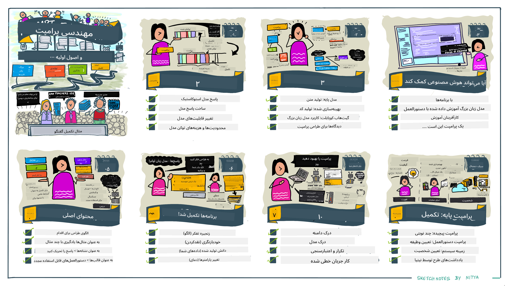
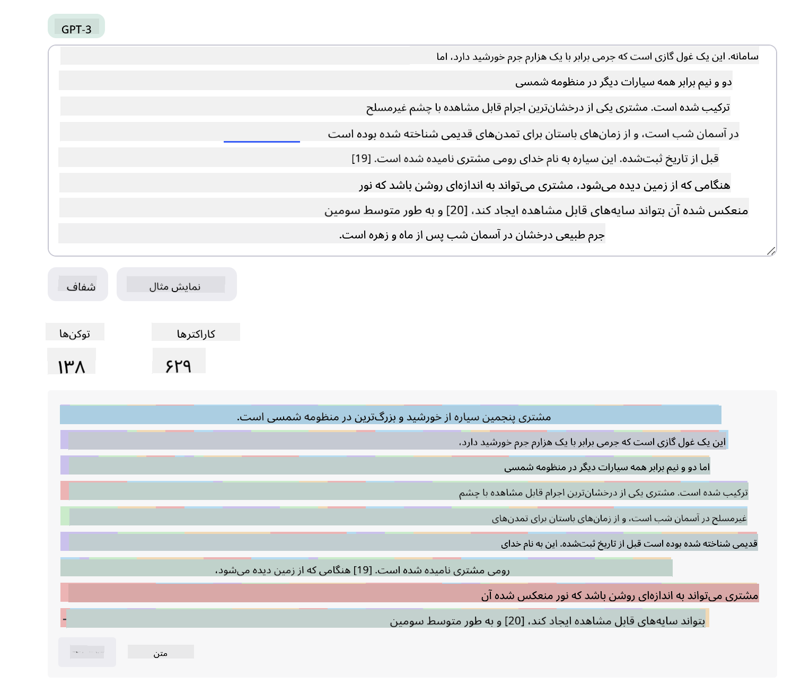
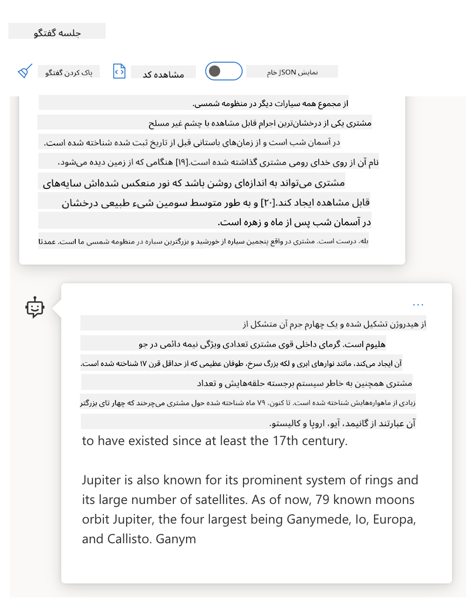
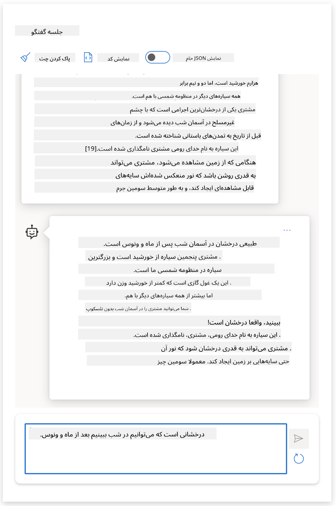

<!--
CO_OP_TRANSLATOR_METADATA:
{
  "original_hash": "a45c318dc6ebc2604f35b8b829f93af2",
  "translation_date": "2025-05-19T15:03:24+00:00",
  "source_file": "04-prompt-engineering-fundamentals/README.md",
  "language_code": "fa"
}
-->
# اصول مهندسی پرامپت

## مقدمه
این ماژول مفاهیم و تکنیک‌های اساسی برای ایجاد پرامپت‌های مؤثر در مدل‌های هوش مصنوعی تولیدی را پوشش می‌دهد. نحوه نوشتن پرامپت شما به یک مدل زبان بزرگ (LLM) نیز اهمیت دارد. یک پرامپت که با دقت طراحی شده باشد می‌تواند کیفیت پاسخ بهتری را به دست آورد. اما اصطلاحاتی مانند _پرامپت_ و _مهندسی پرامپت_ دقیقاً به چه معنا هستند؟ و چگونه می‌توانم ورودی پرامپت را که به LLM ارسال می‌کنم بهبود بخشم؟ این‌ها سؤالاتی هستند که در این فصل و فصل بعدی سعی خواهیم کرد به آن‌ها پاسخ دهیم.

هوش مصنوعی تولیدی قادر به ایجاد محتوای جدید (مثلاً متن، تصاویر، صدا، کد و غیره) در پاسخ به درخواست‌های کاربر است. این کار را با استفاده از مدل‌های زبان بزرگ مانند سری GPT ("تبدیل‌کننده پیش‌آموزش‌دیده تولیدی") OpenAI که برای استفاده از زبان طبیعی و کد آموزش دیده‌اند، انجام می‌دهد.

کاربران اکنون می‌توانند با استفاده از الگوهای آشنایی مانند چت، بدون نیاز به تخصص فنی یا آموزش، با این مدل‌ها تعامل داشته باشند. مدل‌ها بر اساس پرامپت هستند - کاربران یک ورودی متنی (پرامپت) ارسال می‌کنند و پاسخ هوش مصنوعی (تکمیل) را دریافت می‌کنند. آن‌ها سپس می‌توانند به صورت تکراری با هوش مصنوعی "چت کنند"، در مکالمات چند نوبتی، پرامپت خود را تصحیح کنند تا زمانی که پاسخ مطابق با انتظاراتشان باشد.

"پرامپت‌ها" اکنون به رابط اصلی برنامه‌نویسی برای برنامه‌های هوش مصنوعی تولیدی تبدیل می‌شوند، به مدل‌ها می‌گویند چه کاری انجام دهند و کیفیت پاسخ‌های بازگشتی را تحت تأثیر قرار می‌دهند. "مهندسی پرامپت" یک حوزه مطالعه در حال رشد سریع است که بر طراحی و بهینه‌سازی پرامپت‌ها برای ارائه پاسخ‌های با کیفیت و پایدار در مقیاس تمرکز دارد.

## اهداف یادگیری

در این درس، ما یاد می‌گیریم که مهندسی پرامپت چیست، چرا اهمیت دارد و چگونه می‌توانیم پرامپت‌های مؤثرتری برای یک مدل و هدف برنامه خاص ایجاد کنیم. ما مفاهیم اصلی و بهترین روش‌ها برای مهندسی پرامپت را درک خواهیم کرد - و درباره یک محیط "sandbox" تعاملی Jupyter Notebooks یاد خواهیم گرفت که در آن می‌توانیم این مفاهیم را به نمونه‌های واقعی اعمال کنیم.

تا پایان این درس ما قادر خواهیم بود:

1. توضیح دهیم مهندسی پرامپت چیست و چرا اهمیت دارد.
2. اجزای یک پرامپت و نحوه استفاده از آن‌ها را توصیف کنیم.
3. بهترین روش‌ها و تکنیک‌های مهندسی پرامپت را یاد بگیریم.
4. تکنیک‌های یادگرفته‌شده را به نمونه‌های واقعی اعمال کنیم، با استفاده از یک نقطه پایانی OpenAI.

## اصطلاحات کلیدی

مهندسی پرامپت: تمرین طراحی و اصلاح ورودی‌ها برای هدایت مدل‌های هوش مصنوعی به سمت تولید خروجی‌های مطلوب.
تبدیل به توکن: فرآیند تبدیل متن به واحدهای کوچکتر، به نام توکن‌ها، که یک مدل می‌تواند آن‌ها را بفهمد و پردازش کند.
مدل‌های LLM تنظیم‌شده با دستورالعمل: مدل‌های زبان بزرگ (LLM) که با دستورالعمل‌های خاصی تنظیم‌شده‌اند تا دقت و مرتبط بودن پاسخ‌هایشان را بهبود بخشند.

## محیط یادگیری

مهندسی پرامپت در حال حاضر بیشتر هنر است تا علم. بهترین راه برای بهبود شهود ما برای آن، تمرین بیشتر و اتخاذ رویکرد آزمون و خطا است که تخصص در حوزه کاربردی را با تکنیک‌های توصیه‌شده و بهینه‌سازی‌های مدل خاص ترکیب می‌کند.

دفترچه Jupyter همراه با این درس یک محیط "sandbox" را فراهم می‌کند که در آن می‌توانید آنچه را که یاد می‌گیرید امتحان کنید - همانطور که می‌روید یا به عنوان بخشی از چالش کد در پایان. برای اجرای تمرینات، شما به موارد زیر نیاز دارید:

1. **یک کلید API Azure OpenAI** - نقطه پایانی سرویس برای یک LLM مستقر.
2. **یک محیط اجرایی پایتون** - که در آن دفترچه قابل اجرا باشد.
3. **متغیرهای محیطی محلی** - اکنون مراحل [SETUP](./../00-course-setup/SETUP.md?WT.mc_id=academic-105485-koreyst) را تکمیل کنید تا آماده شوید.

دفترچه با تمرینات شروعی ارائه می‌شود - اما شما تشویق می‌شوید تا بخش‌های خود را به Markdown (توضیحات) و Code (درخواست‌های پرامپت) اضافه کنید تا مثال‌ها یا ایده‌های بیشتری را امتحان کنید - و شهود خود را برای طراحی پرامپت بسازید.

## راهنمای مصور

می‌خواهید تصویر کلی از آنچه این درس پوشش می‌دهد قبل از شروع به کار بگیرید؟ این راهنمای مصور را بررسی کنید، که به شما احساسی از موضوعات اصلی پوشش داده شده و نکات کلیدی برای فکر کردن به هر یک می‌دهد. نقشه درس شما را از درک مفاهیم و چالش‌های اصلی به پرداختن به آن‌ها با تکنیک‌های مهندسی پرامپت مرتبط و بهترین روش‌ها می‌برد. توجه داشته باشید که بخش "تکنیک‌های پیشرفته" در این راهنما به محتوای پوشش داده شده در فصل بعدی این برنامه درسی اشاره دارد.

## استارتاپ ما

اکنون، بیایید صحبت کنیم که چگونه _این موضوع_ به مأموریت استارتاپ ما برای [آوردن نوآوری هوش مصنوعی به آموزش](https://educationblog.microsoft.com/2023/06/collaborating-to-bring-ai-innovation-to-education?WT.mc_id=academic-105485-koreyst) مرتبط است. ما می‌خواهیم برنامه‌های آموزشی شخصی‌سازی‌شده با هوش مصنوعی بسازیم - بنابراین بیایید به این فکر کنیم که چگونه کاربران مختلف برنامه ما ممکن است پرامپت‌ها را "طراحی" کنند:

- **مدیران** ممکن است از هوش مصنوعی بخواهند که _داده‌های برنامه درسی را برای شناسایی شکاف‌های پوشش تجزیه و تحلیل کند_. هوش مصنوعی می‌تواند نتایج را خلاصه کند یا آن‌ها را با کد تجسم کند.
- **آموزگاران** ممکن است از هوش مصنوعی بخواهند که _یک برنامه درسی برای یک مخاطب هدف و موضوع تولید کند_. هوش مصنوعی می‌تواند برنامه شخصی‌سازی‌شده را در قالب مشخص‌شده بسازد.
- **دانش‌آموزان** ممکن است از هوش مصنوعی بخواهند که _آن‌ها را در یک موضوع دشوار تدریس کند_. هوش مصنوعی اکنون می‌تواند با درس‌ها، نکات و مثال‌هایی که به سطح آن‌ها تنظیم شده است، به دانش‌آموزان راهنمایی کند.

این فقط نوک کوه یخ است. [پرامپت‌ها برای آموزش](https://github.com/microsoft/prompts-for-edu/tree/main?WT.mc_id=academic-105485-koreyst) - یک کتابخانه پرامپت‌های منبع باز که توسط کارشناسان آموزشی گردآوری شده است - را بررسی کنید تا حس گسترده‌تری از امکانات به دست آورید! برخی از آن پرامپت‌ها را در sandbox اجرا کنید یا از OpenAI Playground استفاده کنید تا ببینید چه اتفاقی می‌افتد!

## مهندسی پرامپت چیست؟

ما این درس را با تعریف **مهندسی پرامپت** به عنوان فرآیند _طراحی و بهینه‌سازی_ ورودی‌های متنی (پرامپت‌ها) برای ارائه پاسخ‌های با کیفیت و پایدار (تکمیل‌ها) برای یک هدف برنامه خاص و مدل آغاز کردیم. می‌توانیم این را به عنوان یک فرآیند دو مرحله‌ای در نظر بگیریم:

- _طراحی_ پرامپت اولیه برای یک مدل و هدف خاص
- _اصلاح_ پرامپت به صورت تکراری برای بهبود کیفیت پاسخ

این به طور ضروری یک فرآیند آزمون و خطا است که نیاز به شهود و تلاش کاربر دارد تا به نتایج بهینه برسد. پس چرا مهم است؟ برای پاسخ به این سؤال، ابتدا باید سه مفهوم را درک کنیم:

- _تبدیل به توکن_ = چگونه مدل پرامپت را "می‌بیند"
- _مدل‌های پایه_ = چگونه مدل پایه پرامپت را "پردازش" می‌کند
- _مدل‌های تنظیم‌شده با دستورالعمل_ = چگونه مدل اکنون می‌تواند "وظایف" را ببیند

### تبدیل به توکن

یک مدل زبان بزرگ پرامپت‌ها را به عنوان _توالی توکن‌ها_ می‌بیند که مدل‌های مختلف (یا نسخه‌های یک مدل) می‌توانند همان پرامپت را به روش‌های مختلف تبدیل به توکن کنند. از آنجا که مدل‌های زبان بزرگ بر روی توکن‌ها آموزش دیده‌اند (و نه بر روی متن خام)، نحوه تبدیل به توکن پرامپت‌ها تأثیر مستقیمی بر کیفیت پاسخ تولید شده دارد.

برای درک نحوه کار تبدیل به توکن، ابزارهایی مانند [تبدیل‌کننده توکن OpenAI](https://platform.openai.com/tokenizer?WT.mc_id=academic-105485-koreyst) را امتحان کنید که در زیر نشان داده شده است. پرامپت خود را کپی کنید - و ببینید چگونه به توکن‌ها تبدیل می‌شود، به نحوه پردازش کاراکترهای فاصله و علائم نگارشی توجه کنید. توجه داشته باشید که این مثال یک مدل زبان بزرگ قدیمی‌تر (GPT-3) را نشان می‌دهد - بنابراین امتحان این با یک مدل جدیدتر ممکن است نتیجه متفاوتی بدهد.

### مفهوم: مدل‌های پایه

هنگامی که یک پرامپت به توکن تبدیل شد، عملکرد اصلی ["مدل پایه"](https://blog.gopenai.com/an-introduction-to-base-and-instruction-tuned-large-language-models-8de102c785a6?WT.mc_id=academic-105485-koreyst) (یا مدل پایه) پیش‌بینی توکن در آن توالی است. از آنجا که مدل‌های زبان بزرگ بر روی مجموعه داده‌های متنی بزرگ آموزش دیده‌اند، آن‌ها حس خوبی از روابط آماری بین توکن‌ها دارند و می‌توانند با اطمینان این پیش‌بینی را انجام دهند. توجه داشته باشید که آن‌ها _معنای_ کلمات در پرامپت یا توکن را درک نمی‌کنند؛ آن‌ها فقط یک الگو را می‌بینند که می‌توانند با پیش‌بینی بعدی خود "تکمیل" کنند. آن‌ها می‌توانند پیش‌بینی توالی را ادامه دهند تا زمانی که توسط مداخله کاربر یا یک شرط از پیش تعیین‌شده خاتمه یابد.

می‌خواهید ببینید چگونه تکمیل بر اساس پرامپت کار می‌کند؟ پرامپت بالا را در [_Chat Playground_](https://oai.azure.com/playground?WT.mc_id=academic-105485-koreyst) Azure OpenAI Studio با تنظیمات پیش‌فرض وارد کنید. سیستم به گونه‌ای پیکربندی شده است که پرامپت‌ها را به عنوان درخواست‌های اطلاعاتی تلقی کند - بنابراین باید یک تکمیل را ببینید که این زمینه را برآورده می‌کند.

اما اگر کاربر بخواهد چیزی خاصی را ببیند که برخی از معیارها یا اهداف وظیفه را برآورده کند؟ اینجاست که مدل‌های تنظیم‌شده با دستورالعمل وارد تصویر می‌شوند.

### مفهوم: مدل‌های تنظیم‌شده با دستورالعمل

یک [مدل تنظیم‌شده با دستورالعمل](https://blog.gopenai.com/an-introduction-to-base-and-instruction-tuned-large-language-models-8de102c785a6?WT.mc_id=academic-105485-koreyst) با مدل پایه شروع می‌شود و آن را با مثال‌ها یا جفت‌های ورودی/خروجی (مثلاً "پیام‌های" چند نوبتی) که می‌توانند دستورالعمل‌های واضحی داشته باشند، تنظیم می‌کند - و پاسخ از تلاش هوش مصنوعی برای پیروی از آن دستورالعمل است.

این از تکنیک‌هایی مانند یادگیری تقویتی با بازخورد انسانی (RLHF) استفاده می‌کند که می‌تواند مدل را آموزش دهد تا _از دستورالعمل‌ها پیروی کند_ و _از بازخورد یاد بگیرد_ تا پاسخ‌هایی تولید کند که برای کاربردهای عملی بهتر مناسب هستند و به اهداف کاربر مرتبط‌تر هستند.

بیایید آن را امتحان کنیم - پرامپت بالا را بازبینی کنید، اما اکنون _پیام سیستم_ را تغییر دهید تا دستورالعمل زیر را به عنوان زمینه فراهم کنید:

> _محتوایی که به شما ارائه می‌شود را برای یک دانش‌آموز کلاس دوم خلاصه کنید. نتیجه را به یک پاراگراف با 3-5 نکته خلاصه کنید._

ببینید چگونه نتیجه اکنون به هدف و قالب مطلوب تنظیم شده است؟ یک معلم اکنون می‌تواند به طور مستقیم از این پاسخ در اسلایدهای خود برای آن کلاس استفاده کند.

## چرا به مهندسی پرامپت نیاز داریم؟

اکنون که می‌دانیم پرامپت‌ها چگونه توسط مدل‌های زبان بزرگ پردازش می‌شوند، بیایید درباره _چرا_ به مهندسی پرامپت نیاز داریم صحبت کنیم. پاسخ در این واقعیت نهفته است که مدل‌های زبان بزرگ فعلی تعدادی چالش را به همراه دارند که دستیابی به _تکمیل‌های قابل اعتماد و پایدار_ را بدون تلاش در ساخت و بهینه‌سازی پرامپت دشوارتر می‌کند. برای مثال:

1. **پاسخ‌های مدل تصادفی هستند.** _همان پرامپت_ احتمالاً پاسخ‌های مختلفی با مدل‌های مختلف یا نسخه‌های مدل مختلف تولید می‌کند. و حتی ممکن است نتایج متفاوتی با _همان مدل_ در زمان‌های مختلف تولید کند. _تکنیک‌های مهندسی پرامپت می‌توانند به ما کمک کنند تا این تغییرات را به حداقل برسانیم با ارائه راهنماهای بهتر_.

2. **مدل‌ها می‌توانند پاسخ‌های ساختگی تولید کنند.** مدل‌ها با مجموعه داده‌های _بزرگ اما محدود_ پیش‌آموزش‌دیده شده‌اند، به این معنا که آن‌ها فاقد دانش درباره مفاهیم خارج از آن دامنه آموزشی هستند. در نتیجه، آن‌ها می‌توانند تکمیل‌هایی تولید کنند که نادرست، خیالی یا به طور مستقیم متناقض با واقعیت‌های شناخته شده باشند. _تکنیک‌های مهندسی پرامپت به کاربران کمک می‌کنند تا این ساختگی‌ها را شناسایی و کاهش دهند، مثلاً با درخواست منابع یا استدلال از هوش مصنوعی_.

3. **قابلیت‌های مدل‌ها متفاوت خواهد بود.** مدل‌های جدیدتر یا نسل‌های مدل‌ها قابلیت‌های بیشتری خواهند داشت اما همچنین ویژگی‌های خاص و معاوضه‌های منحصر به فردی در هزینه و پیچیدگی به همراه خواهند داشت. _مهندسی پرامپت می‌تواند به ما کمک کند تا بهترین روش‌ها و جریان‌های کاری را توسعه دهیم که تفاوت‌ها را انتزاع کند و به نیازهای مدل خاص به صورت مقیاس‌پذیر و بدون درز تطبیق دهد_.

بیایید این را در عمل در OpenAI یا Azure OpenAI Playground ببینیم:

- از همان پرامپت با استقرارهای مختلف LLM استفاده کنید (مثلاً OpenAI، Azure OpenAI، Hugging Face) - آیا تفاوت‌ها را دیدید؟
- از همان پرامپت به طور مکرر با _همان_ استقرار LLM استفاده کنید (مثلاً Azure OpenAI playground) - چگونه این تفاوت‌ها متفاوت بودند؟

### مثال ساختگی‌ها

در این دوره، ما از اصطلاح **"ساختگی"** برای اشاره به پدیده‌ای استفاده می‌کنیم که در آن مدل‌های زبان بزرگ گاهی اطلاعات نادرست واقعی تولید می‌کنند به دلیل محدودیت‌های آموزشی یا سایر محدودیت‌ها. ممکن است این را به عنوان _"توهمات"_ در مقالات محبوب یا مقالات پژوهشی شنیده باشید. با این حال، ما به شدت توصیه می‌کنیم از اصطلاح _"ساختگی"_ استفاده کنید تا به طور تصادفی رفتار را انسان‌گونه نکنیم با اختصاص یک ویژگی انسانی به یک نتیجه ماشینی. این همچنین از [راهنمایی‌های هوش مصنوعی مسئولانه](https://www.microsoft.com/ai/responsible-ai?WT.mc_id=academic-105485-koreyst) از نظر اصطلاح‌شناسی پشتیبانی می‌کند، با حذف اصطلاحاتی که ممکن است در برخی از زمینه‌ها نیز به عنوان توهین‌آمیز یا غیرشامل در نظر گرفته شوند.

می‌خواهید حس کنید چگونه ساختگی‌ها کار می‌کنند؟ به یک پرامپت فکر کنید که هوش مصنوعی را دستور می‌دهد محتوایی برای یک موضوع غیرواقعی تولید کند (تا اطمینان حاصل شود که در مجموعه داده آموزشی یافت نمی‌شود). برای مثال - من این پرامپت را امتحان کردم:

> **پرامپت:** یک برنامه درسی درباره جنگ مریخی 2076 تولید کنید.

یک جستجوی وب به من نشان داد که داستان‌های خیالی (مثلاً سریال‌های تلویزیونی یا کتاب‌ها) درباره جنگ‌های مریخی وجود داشتند - اما هیچ‌کدام در سال 2076. عقل س
در نهایت، ارزش واقعی قالب‌ها در توانایی ایجاد و انتشار _کتابخانه‌های پرامپت_ برای حوزه‌های کاربردی عمودی نهفته است - جایی که قالب پرامپت اکنون _بهینه‌سازی_ شده است تا زمینه‌ها یا مثال‌های خاص برنامه را منعکس کند که پاسخ‌ها را برای مخاطبان هدف کاربر مرتبط‌تر و دقیق‌تر می‌سازد. مخزن [Prompts For Edu](https://github.com/microsoft/prompts-for-edu?WT.mc_id=academic-105485-koreyst) نمونه‌ای عالی از این رویکرد است که کتابخانه‌ای از پرامپت‌ها برای حوزه آموزش را با تأکید بر اهداف کلیدی مانند برنامه‌ریزی دروس، طراحی برنامه‌های درسی، آموزش دانش‌آموزان و غیره جمع‌آوری می‌کند.

## محتوای پشتیبانی

اگر به ساختار پرامپت به عنوان داشتن یک دستورالعمل (وظیفه) و یک هدف (محتوای اصلی) فکر کنیم، _محتوای ثانویه_ مانند زمینه اضافی است که برای **تأثیرگذاری بر خروجی به نحوی** ارائه می‌دهیم. می‌تواند شامل تنظیم پارامترها، دستورالعمل‌های قالب‌بندی، طبقه‌بندی موضوعات و غیره باشد که می‌تواند به مدل کمک کند پاسخ خود را به گونه‌ای _تطبیق دهد_ که با اهداف یا انتظارات کاربر مطابقت داشته باشد.

به عنوان مثال: با توجه به یک کاتالوگ دوره با متادیتای گسترده (نام، توضیحات، سطح، برچسب‌های متادیتا، مدرس و غیره) در مورد تمام دوره‌های موجود در برنامه درسی:

- می‌توانیم یک دستورالعمل برای "خلاصه کردن کاتالوگ دوره برای پاییز 2023" تعریف کنیم
- می‌توانیم از محتوای اصلی برای ارائه چند نمونه از خروجی مورد نظر استفاده کنیم
- می‌توانیم از محتوای ثانویه برای شناسایی 5 "برچسب" برتر مورد علاقه استفاده کنیم.

اکنون، مدل می‌تواند یک خلاصه را در قالب نشان‌داده‌شده توسط چند مثال ارائه دهد - اما اگر نتیجه دارای چندین برچسب باشد، می‌تواند 5 برچسب شناسایی‌شده در محتوای ثانویه را اولویت‌بندی کند.

---

## بهترین روش‌های پرامپتینگ

اکنون که می‌دانیم چگونه پرامپت‌ها می‌توانند _ساخته شوند_، می‌توانیم شروع به فکر کردن در مورد نحوه _طراحی_ آن‌ها کنیم تا بهترین شیوه‌ها را منعکس کنند. می‌توانیم به این موضوع در دو بخش فکر کنیم - داشتن _ذهنیت_ درست و به‌کارگیری _تکنیک‌های_ درست.

### ذهنیت مهندسی پرامپت

مهندسی پرامپت یک فرآیند آزمون و خطاست، بنابراین سه عامل راهنمایی گسترده را در نظر داشته باشید:

1. **درک حوزه مهم است.** دقت و ارتباط پاسخ‌ها تابعی از _حوزه_ است که در آن آن برنامه یا کاربر عمل می‌کند. شهود و تخصص حوزه خود را به کار ببرید تا تکنیک‌ها را **سفارشی‌سازی** کنید. برای مثال، _شخصیت‌های خاص حوزه_ را در پرامپت‌های سیستم خود تعریف کنید، یا از _قالب‌های خاص حوزه_ در پرامپت‌های کاربر خود استفاده کنید. محتوای ثانویه‌ای ارائه دهید که زمینه‌های خاص حوزه را منعکس کند، یا از _اشارات و مثال‌های خاص حوزه_ استفاده کنید تا مدل را به سمت الگوهای استفاده آشنا هدایت کنید.

2. **درک مدل مهم است.** می‌دانیم که مدل‌ها به‌طور ذاتی تصادفی هستند. اما پیاده‌سازی مدل‌ها می‌تواند از نظر مجموعه داده آموزشی که استفاده می‌کنند (دانش پیش‌آموزشی)، قابلیت‌هایی که ارائه می‌دهند (مثلاً از طریق API یا SDK) و نوع محتوایی که برای آن بهینه شده‌اند (مثلاً کد در مقابل تصاویر در مقابل متن) نیز متفاوت باشد. نقاط قوت و محدودیت‌های مدلی را که استفاده می‌کنید، درک کنید و از آن دانش برای _اولویت‌بندی وظایف_ یا ساخت _قالب‌های سفارشی‌سازی‌شده_ که برای قابلیت‌های مدل بهینه شده‌اند، استفاده کنید.

3. **تکرار و اعتبارسنجی مهم است.** مدل‌ها به‌سرعت در حال تکامل هستند و تکنیک‌های مهندسی پرامپت نیز همین‌طور. به‌عنوان یک کارشناس حوزه، ممکن است زمینه یا معیارهای دیگری برای برنامه خاص خود داشته باشید که ممکن است برای جامعه گسترده‌تر اعمال نشود. از ابزارها و تکنیک‌های مهندسی پرامپت برای "شروع سریع" ساخت پرامپت استفاده کنید، سپس نتایج را با استفاده از شهود و تخصص حوزه خود تکرار و اعتبارسنجی کنید. بینش‌های خود را ثبت کنید و یک **پایگاه دانش** (مثلاً کتابخانه‌های پرامپت) ایجاد کنید که می‌تواند به‌عنوان یک مبنای جدید برای دیگران استفاده شود، برای تکرارهای سریع‌تر در آینده.

## بهترین شیوه‌ها

اکنون بیایید به بهترین شیوه‌های رایج که توسط [OpenAI](https://help.openai.com/en/articles/6654000-best-practices-for-prompt-engineering-with-openai-api?WT.mc_id=academic-105485-koreyst) و متخصصان [Azure OpenAI](https://learn.microsoft.com/azure/ai-services/openai/concepts/prompt-engineering#best-practices?WT.mc_id=academic-105485-koreyst) توصیه شده‌اند، نگاهی بیندازیم.

| چه چیزی                              | چرا                                                                                                                                                                                                                                               |
| :-------------------------------- | :------------------------------------------------------------------------------------------------------------------------------------------------------------------------------------------------------------------------------------------------ |
| مدل‌های جدیدتر را ارزیابی کنید.       | نسل‌های جدید مدل‌ها احتمالاً دارای ویژگی‌ها و کیفیت بهبود یافته هستند - اما ممکن است هزینه‌های بیشتری نیز داشته باشند. آن‌ها را برای تأثیر ارزیابی کنید، سپس تصمیمات مهاجرتی بگیرید.                                                                                |
| دستورالعمل‌ها و زمینه را جدا کنید   | بررسی کنید که آیا مدل/ارائه‌دهنده شما _مرزهایی_ را برای تمایز دستورالعمل‌ها، محتوای اصلی و ثانویه به وضوح تعریف می‌کند. این می‌تواند به مدل‌ها کمک کند تا به‌طور دقیق‌تری وزن‌ها را به توکن‌ها اختصاص دهند.                                                         |
| مشخص و واضح باشید             | جزئیات بیشتری درباره زمینه، نتیجه، طول، قالب، سبک و غیره مورد نظر ارائه دهید. این کار کیفیت و ثبات پاسخ‌ها را بهبود می‌بخشد. دستورالعمل‌ها را در قالب‌های قابل استفاده مجدد ضبط کنید.                                                          |
| توصیفی باشید، از مثال‌ها استفاده کنید      | مدل‌ها ممکن است به رویکرد "نشان‌دادن و گفتن" بهتر پاسخ دهند. با `zero-shot` approach where you give it an instruction (but no examples) then try `few-shot` as a refinement, providing a few examples of the desired output. Use analogies. |
| Use cues to jumpstart completions | Nudge it towards a desired outcome by giving it some leading words or phrases that it can use as a starting point for the response.                                                                                                               |
| Double Down                       | Sometimes you may need to repeat yourself to the model. Give instructions before and after your primary content, use an instruction and a cue, etc. Iterate & validate to see what works.                                                         |
| Order Matters                     | The order in which you present information to the model may impact the output, even in the learning examples, thanks to recency bias. Try different options to see what works best.                                                               |
| Give the model an “out”           | Give the model a _fallback_ completion response it can provide if it cannot complete the task for any reason. This can reduce chances of models generating false or fabricated responses.                                                         |
|                                   |                                                                                                                                                                                                                                                   |

As with any best practice, remember that _your mileage may vary_ based on the model, the task and the domain. Use these as a starting point, and iterate to find what works best for you. Constantly re-evaluate your prompt engineering process as new models and tools become available, with a focus on process scalability and response quality.

<!--
LESSON TEMPLATE:
This unit should provide a code challenge if applicable

CHALLENGE:
Link to a Jupyter Notebook with only the code comments in the instructions (code sections are empty).

SOLUTION:
Link to a copy of that Notebook with the prompts filled in and run, showing what one example could be.
-->

## Assignment

Congratulations! You made it to the end of the lesson! It's time to put some of those concepts and techniques to the test with real examples!

For our assignment, we'll be using a Jupyter Notebook with exercises you can complete interactively. You can also extend the Notebook with your own Markdown and Code cells to explore ideas and techniques on your own.

### To get started, fork the repo, then

- (Recommended) Launch GitHub Codespaces
- (Alternatively) Clone the repo to your local device and use it with Docker Desktop
- (Alternatively) Open the Notebook with your preferred Notebook runtime environment.

### Next, configure your environment variables

- Copy the `.env.copy` file in repo root to `.env` and fill in the `AZURE_OPENAI_API_KEY`, `AZURE_OPENAI_ENDPOINT` and `AZURE_OPENAI_DEPLOYMENT` مقادیر شروع کنید. به [بخش Learning Sandbox](../../../04-prompt-engineering-fundamentals/04-prompt-engineering-fundamentals) برگردید تا یاد بگیرید چگونه.

### در مرحله بعد، نوت‌بوک Jupyter را باز کنید

- هسته زمان اجرا را انتخاب کنید. اگر از گزینه‌های 1 یا 2 استفاده می‌کنید، به سادگی هسته پیش‌فرض Python 3.10.x ارائه شده توسط کانتینر توسعه را انتخاب کنید.

همه چیز برای اجرای تمرین‌ها آماده است. توجه داشته باشید که در اینجا _پاسخ‌های درست و غلط_ وجود ندارد - فقط با آزمون و خطا گزینه‌ها را کاوش کنید و شهود خود را برای آنچه که برای یک مدل و حوزه کاربردی خاص کار می‌کند، بسازید.

_به همین دلیل، در این درس هیچ بخش راه‌حل کدی وجود ندارد. در عوض، نوت‌بوک دارای سلول‌های Markdown با عنوان "راه‌حل من:" خواهد بود که یک نمونه خروجی برای مرجع نشان می‌دهد._

## بررسی دانش

کدام‌یک از موارد زیر یک پرامپت خوب است که برخی از بهترین شیوه‌های منطقی را دنبال می‌کند؟

1. به من تصویری از یک ماشین قرمز نشان بده
2. به من تصویری از یک ماشین قرمز ساخت ولوو و مدل XC90 نشان بده که در کنار یک صخره با غروب آفتاب پارک شده است
3. به من تصویری از یک ماشین قرمز ساخت ولوو و مدل XC90 نشان بده

A: 2، این بهترین پرامپت است زیرا جزئیاتی درباره "چه چیزی" ارائه می‌دهد و به جزئیات می‌پردازد (نه فقط هر ماشینی بلکه یک ساخت و مدل خاص) و همچنین محیط کلی را توصیف می‌کند. 3 بعدی بهترین است زیرا همچنین شامل بسیاری از توصیفات است.

## 🚀 چالش

ببینید آیا می‌توانید از تکنیک "اشاره" با پرامپت استفاده کنید: جمله "به من تصویری از یک ماشین قرمز ساخت ولوو و " را کامل کنید. با چه پاسخی مواجه می‌شوید و چگونه می‌توانید آن را بهبود دهید؟

## کار عالی! به یادگیری خود ادامه دهید

آیا می‌خواهید بیشتر درباره مفاهیم مختلف مهندسی پرامپت بیاموزید؟ به [صفحه یادگیری ادامه‌دار](https://aka.ms/genai-collection?WT.mc_id=academic-105485-koreyst) بروید تا منابع عالی دیگری در این موضوع پیدا کنید.

به درس 5 بروید که در آن به [تکنیک‌های پیشرفته پرامپتینگ](../05-advanced-prompts/README.md?WT.mc_id=academic-105485-koreyst) خواهیم پرداخت!

**سلب مسئولیت**:  
این سند با استفاده از سرویس ترجمه هوش مصنوعی [Co-op Translator](https://github.com/Azure/co-op-translator) ترجمه شده است. در حالی که ما برای دقت تلاش می‌کنیم، لطفاً توجه داشته باشید که ترجمه‌های خودکار ممکن است حاوی خطاها یا نادرستی‌ها باشند. سند اصلی به زبان اصلی باید به عنوان منبع معتبر در نظر گرفته شود. برای اطلاعات حیاتی، ترجمه انسانی حرفه‌ای توصیه می‌شود. ما مسئولیتی در قبال هرگونه سوء تفاهم یا سوء تفسیر ناشی از استفاده از این ترجمه نداریم.