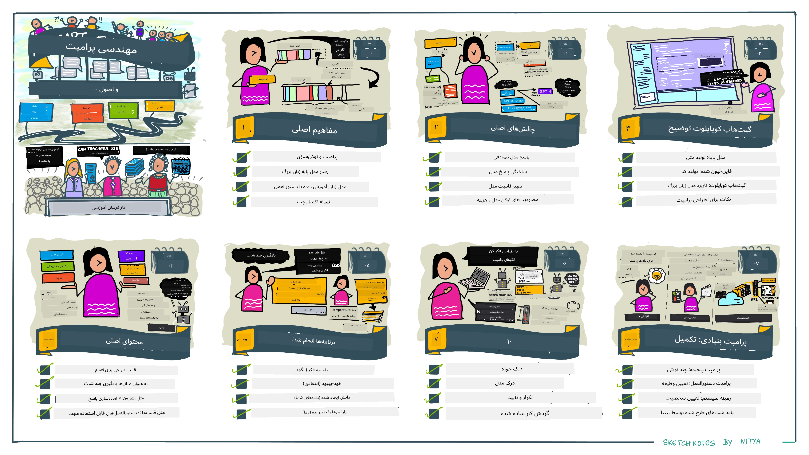
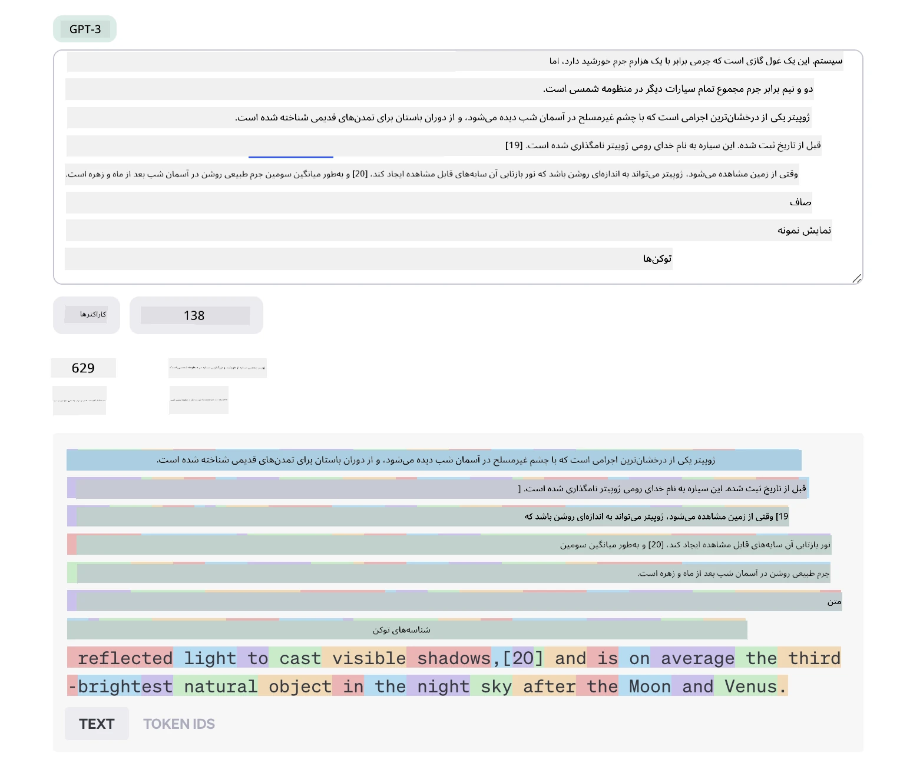
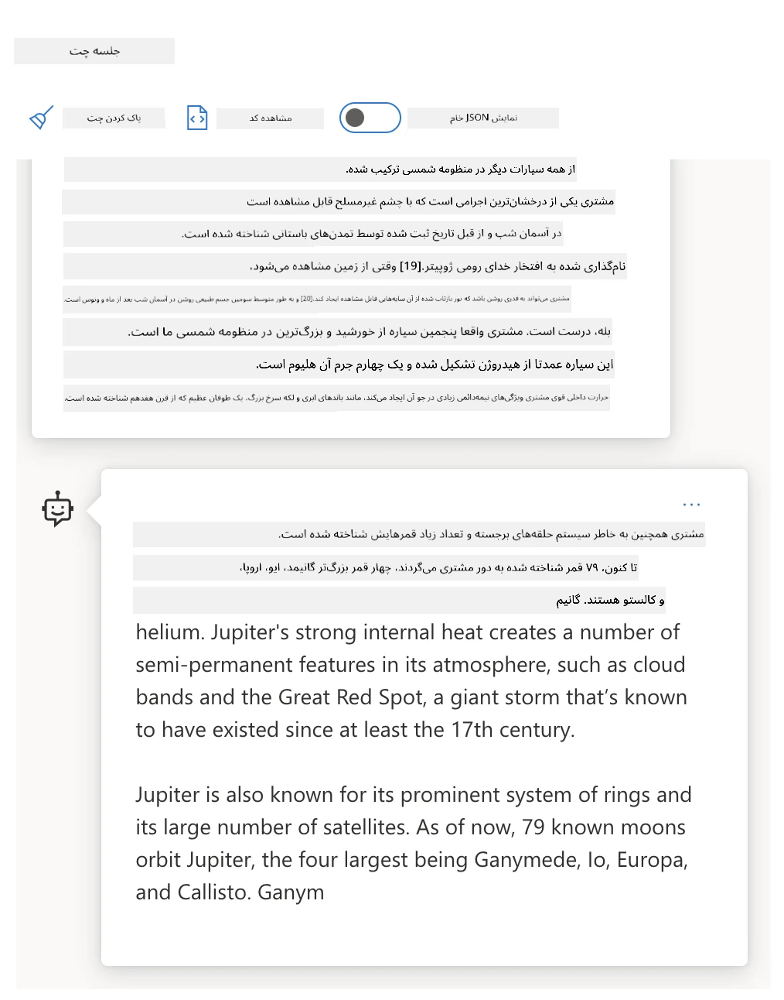
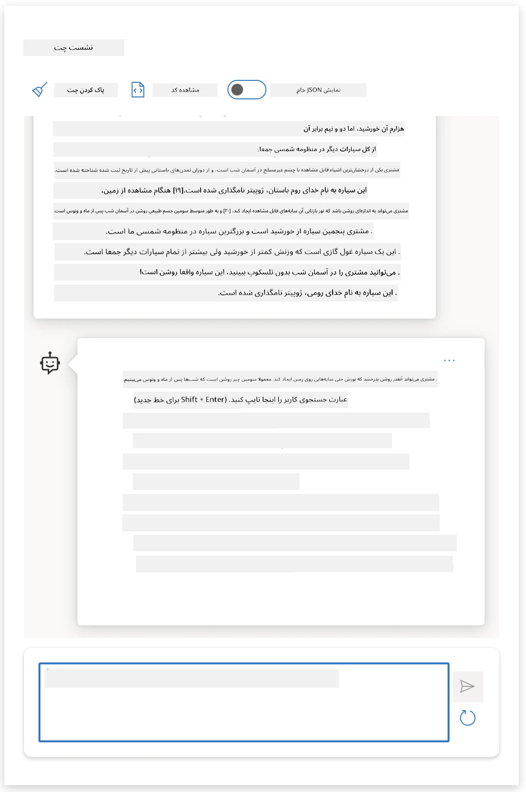
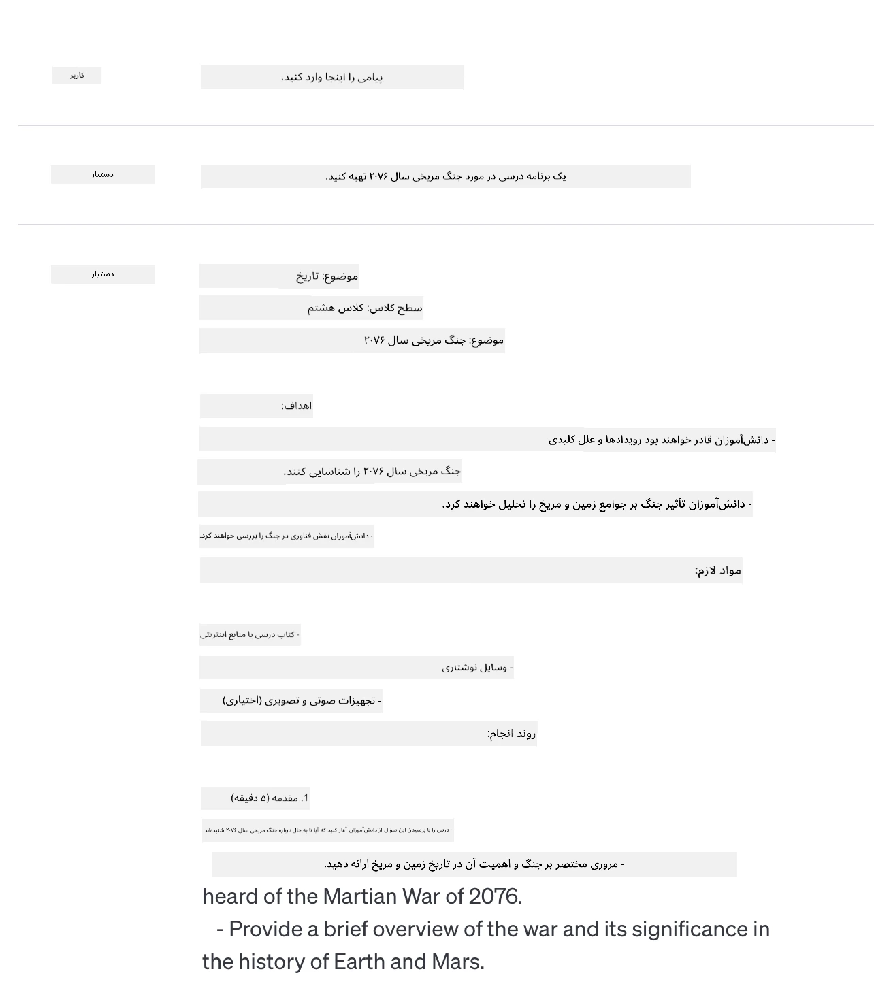
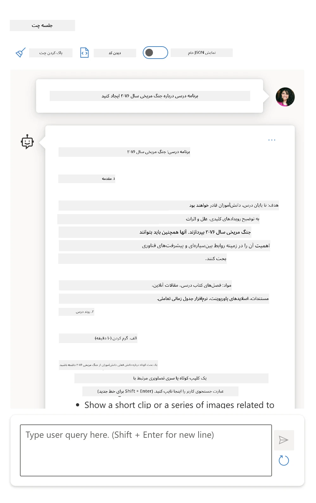
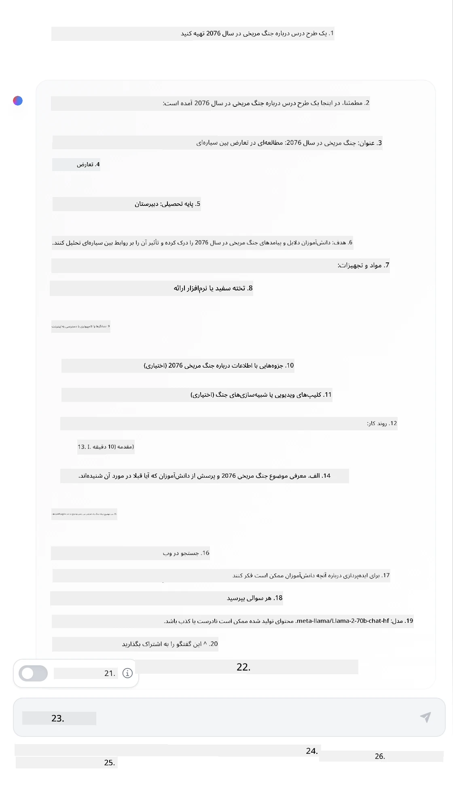

# اصول مهندسی پرامپت

[](https://youtu.be/GElCu2kUlRs?si=qrXsBvXnCW12epb8)

## مقدمه
این ماژول مفاهیم و تکنیک‌های اساسی در ایجاد پرامپت‌های مؤثر در مدل‌های هوش مصنوعی مولد را پوشش می‌دهد. نحوه نوشتن پرامپت برای یک LLM نیز اهمیت دارد. یک پرامپت به‌دقت طراحی‌شده می‌تواند کیفیت پاسخ را بهبود بخشد. اما دقیقا اصطلاحاتی مثل _پرامپت_ و _مهندسی پرامپت_ به چه معنا هستند؟ و چگونه می‌توانم ورودی پرامپتی که به LLM ارسال می‌کنم را بهبود دهم؟ این‌ها سوالاتی هستند که در این فصل و فصل بعدی سعی در پاسخ‌دهی به آن‌ها داریم.

_هوش مصنوعی مولد_ قادر به ایجاد محتوای جدید (مثلاً متن، تصویر، صدا، کد و غیره) در پاسخ به درخواست‌های کاربران است. این کار را با استفاده از _مدل‌های زبان بزرگ_ مثل سری GPT («ترنسفورمر پیش‌آموزش داده شده مولد») اوپن‌ای‌آی که برای استفاده از زبان طبیعی و کد آموزش دیده‌اند، انجام می‌دهد.

کاربران اکنون می‌توانند از مدل‌ها با پارادایم‌های آشنا مانند چت تعامل داشته باشند، بدون نیاز به تخصص فنی یا آموزش. این مدل‌ها بر اساس _پرامپت_ کار می‌کنند - کاربران یک ورودی متنی (پرامپت) ارسال می‌کنند و پاسخ هوش مصنوعی (تکمیل) را دریافت می‌کنند. سپس می‌توانند به صورت تعاملی و چندمرحله‌ای با هوش مصنوعی «چت» کنند و پرامپت خود را تا زمانی که پاسخ مطابق انتظارشان باشد، اصلاح کنند.

«پرامپت‌ها» اکنون به رابط اصلی _برنامه‌نویسی_ برای اپلیکیشن‌های هوش مصنوعی مولد تبدیل شده‌اند که به مدل‌ها می‌گویند چه کاری انجام دهند و کیفیت پاسخ‌های بازگردانده شده را تحت تأثیر قرار می‌دهند. «مهندسی پرامپت» یک حوزه در حال رشد سریع است که بر _طراحی و بهینه‌سازی_ پرامپت‌ها برای ارائه پاسخ‌های مداوم و با کیفیت در مقیاس تمرکز دارد.

## اهداف یادگیری

در این درس، می‌آموزیم مهندسی پرامپت چیست، چرا اهمیت دارد و چگونه می‌توانیم پرامپت‌های مؤثرتر برای یک مدل و هدف کاربردی خاص طراحی کنیم. مفاهیم اصلی و بهترین روش‌های مهندسی پرامپت را درک می‌کنیم و با محیط تعاملی Jupyter Notebooks «سندباکس» آشنا می‌شویم که در آن می‌توانیم این مفاهیم را در مثال‌های عملی ببینیم.

در پایان این درس قادر خواهیم بود:

1. توضیح دهیم مهندسی پرامپت چیست و چرا مهم است.
2. اجزای یک پرامپت را شرح داده و نحوه استفاده آن‌ها را بیان کنیم.
3. بهترین روش‌ها و تکنیک‌های مهندسی پرامپت را بیاموزیم.
4. تکنیک‌های یاد گرفته شده را در مثال‌های واقعی با استفاده از یک نقطه انتهایی OpenAI به کار ببریم.

## اصطلاحات کلیدی

مهندسی پرامپت: عمل طراحی و پالایش ورودی‌ها برای هدایت مدل‌های هوش مصنوعی به سمت تولید خروجی‌های مطلوب.

توکنیزاسیون: فرایند تبدیل متن به واحدهای کوچکتر به نام توکن که مدل می‌تواند آنها را بفهمد و پردازش کند.

مدل‌های زبان بزرگ آموزش‌دیده با دستورالعمل: مدل‌های زبان بزرگ که با دستورالعمل‌های خاص برای بهبود دقت و ارتباط پاسخ‌ها تنظیم دقیق شده‌اند.

## محیط تمرینی

مهندسی پرامپت در حال حاضر بیشتر یک هنر است تا علم. بهترین راه برای بهبود درک ما از آن، _تمرین بیشتر_ و اتخاذ رویکرد آزمون و خطا است که تخصص در حوزه کاربرد را با تکنیک‌های پیشنهادی و بهینه‌سازی‌های خاص مدل ترکیب می‌کند.

دفترچه Jupyter Notebook همراه این درس یک محیط _سندباکس_ فراهم می‌کند که می‌توانید آنچه را یاد می‌گیرید امتحان کنید - به صورت مرحله به مرحله یا در قالب چالش کد در انتها. برای اجرای تمرین‌ها به موارد زیر نیاز دارید:

1. **کلید API Azure OpenAI** - نقطه انتهایی خدمات برای یک LLM مستقر شده.

2. **محیط اجرای Python** - که در آن دفترچه قابل اجرا باشد.

3. **متغیرهای محیطی محلی** - _همین حالا مراحل [SETUP](./../00-course-setup/02-setup-local.md?WT.mc_id=academic-105485-koreyst) را کامل کنید تا آماده شوید_.

دفترچه با تمرین‌های _آغازی_ ارائه شده، اما تشویق می‌شوید بخش‌های _Markdown_ (توضیح) و _Code_ (درخواست‌های پرامپت) خود را اضافه کنید تا نمونه‌ها یا ایده‌های بیشتری را امتحان کنید و درک بهتری از طراحی پرامپت پیدا کنید.

## راهنمای مصور

می‌خواهید تصویر کلی آنچه این درس پوشش می‌دهد را قبل از شروع ببینید؟ این راهنمای مصور را بررسی کنید که موضوعات اصلی و نکات کلیدی برای تفکر در هر بخش را به شما نشان می‌دهد. نقشه راه درس شما را از درک مفاهیم اصلی و چالش‌ها به سمت پرداختن به آن‌ها با تکنیک‌ها و روش‌های برتر مهندسی پرامپت می‌برد. توجه داشته باشید بخش «تکنیک‌های پیشرفته» در این راهنما به محتوای فصل _بعدی_ این برنامه آموزشی اشاره دارد.



## استارتاپ ما

حالا بیایید درباره اینکه چگونه _این موضوع_ با ماموریت استارتاپ ما برای [آوردن نوآوری هوش مصنوعی به آموزش](https://educationblog.microsoft.com/2023/06/collaborating-to-bring-ai-innovation-to-education?WT.mc_id=academic-105485-koreyst) مرتبط است صحبت کنیم. ما می‌خواهیم برنامه‌های هوش مصنوعی مبتنی بر _یادگیری شخصی‌سازی‌شده_ بسازیم - پس بیایید درباره اینکه چگونه کاربران مختلف برنامه ما ممکن است پرامپت‌ها را «طراحی» کنند فکر کنیم:

- **مدیران** ممکن است از هوش مصنوعی بخواهند _داده‌های برنامه درسی را تحلیل کرده و کاستی‌های پوشش را شناسایی کنند_. هوش مصنوعی می‌تواند نتایج را خلاصه کند یا با کد آن‌ها را مصور سازی کند.
- **مربیان** ممکن است از هوش مصنوعی بخواهند _برنامه درسی برای مخاطب هدف و موضوع خاص تولید کند_. هوش مصنوعی می‌تواند طرح شخصی‌شده را در قالب مشخصی بسازد.
- **دانش‌آموزان** ممکن است از هوش مصنوعی بخواهند _در موضوعی دشوار به آن‌ها آموزش دهد_. حالا هوش مصنوعی می‌تواند دانش‌آموزان را با درس‌ها، راهنمایی‌ها و مثال‌های متناسب با سطح آن‌ها هدایت کند.

این فقط نوک کوه یخ است. به [Prompts For Education](https://github.com/microsoft/prompts-for-edu/tree/main?WT.mc_id=academic-105485-koreyst) - کتابخانه پرامپت منبع باز که توسط کارشناسان آموزش گردآوری شده - نگاهی بیندازید تا دامنه گسترده‌تری از امکانات را ببینید! _پرامپت‌های آن‌ها را در سندباکس اجرا کنید یا از OpenAI Playground استفاده کنید تا ببینید چه اتفاقی می‌افتد!_

<!--
LESSON TEMPLATE:
This unit should cover core concept #1.
Reinforce the concept with examples and references.

CONCEPT #1:
Prompt Engineering.
Define it and explain why it is needed.
-->

## مهندسی پرامپت چیست؟

ما این درس را با تعریف **مهندسی پرامپت** شروع کردیم به عنوان فرایند _طراحی و بهینه‌سازی_ ورودی‌های متنی (پرامپت‌ها) برای ارائه پاسخ‌های مداوم و با کیفیت (تکمیل‌ها) برای هدف کاربردی و مدل مشخص. می‌توانیم این را به عنوان یک فرایند دو مرحله‌ای در نظر بگیریم:

- _طراحی_ پرامپت اولیه برای مدل و هدف داده‌شده
- _اصلاح_ پرامپت به صورت تکراری برای بهبود کیفیت پاسخ

این ضرورتاً فرایندی آزمون و خطا است که نیازمند شهود و تلاش کاربر برای رسیدن به نتایج بهینه است. پس چرا این مهم است؟ برای پاسخ به این سوال، ابتدا باید سه مفهوم را درک کنیم:

- _توکنیزاسیون_ = چگونه مدل پرامپت را "می‌بیند"
- _مدل‌های پایه LLM_ = چگونه مدل بنیادین پرامپت را "پردازش" می‌کند
- _مدل‌های LLM آموزش‌داده شده با دستورالعمل_ = چگونه مدل اکنون "وظایف" را می‌فهمد

### توکنیزاسیون

یک مدل زبان بزرگ (LLM) پرامپت‌ها را به عنوان _دنباله‌ای از توکن‌ها_ می‌بیند که مدل‌های مختلف (یا نسخه‌های مختلف یک مدل) می‌توانند یک پرامپت را به روش‌های متفاوت به توکن تبدیل کنند. از آنجا که LLM‌ها روی توکن‌ها (نه متن خام) آموزش دیده‌اند، نحوه توکنیزاسیون پرامپت‌ها تأثیر مستقیم بر کیفیت پاسخ تولید شده دارد.

برای درک نحوه کار توکنیزاسیون، ابزارهایی مثل [OpenAI Tokenizer](https://platform.openai.com/tokenizer?WT.mc_id=academic-105485-koreyst) زیر را امتحان کنید. پرامپت خود را کپی کنید و ببینید چگونه به توکن‌ها تبدیل می‌شود، با دقت به نحوه برخورد با فضای سفید و علائم نگارشی توجه کنید. توجه داشته باشید این مثال مدل قدیمی (GPT-3) را نشان می‌دهد - در نتیجه امتحان با مدل جدیدتر ممکن است نتایج متفاوتی بدهد.



### مفهوم: مدل‌های بنیادین

زمانی که پرامپت به توکن تبدیل شد، وظیفه اصلی ["مدل پایه LLM"](https://blog.gopenai.com/an-introduction-to-base-and-instruction-tuned-large-language-models-8de102c785a6?WT.mc_id=academic-105485-koreyst) (یا مدل بنیادین) پیش‌بینی توکن بعدی در دنباله است. از آنجا که LLM‌ها روی مجموعه داده‌های متنی عظیم آموزش دیده‌اند، شناخت خوبی از روابط آماری بین توکن‌ها دارند و می‌توانند این پیش‌بینی را با اطمینان نسبتاً خوب انجام دهند. توجه کنید آن‌ها معنای _کلمات_ در پرامپت یا توکن را درک نمی‌کنند، فقط الگویی می‌بینند که می‌توانند با پیش‌بینی بعدی آن را «تکمیل» کنند. آن‌ها می‌توانند پیش‌بینی را تا زمانی که کاربر متوقف کند یا شرط از پیش تعیین‌شده اجرا شود، ادامه دهند.

می‌خواهید ببینید چگونه تکمیل بر اساس پرامپت کار می‌کند؟ پرامپت بالا را در Azure OpenAI Studio [_Chat Playground_](https://oai.azure.com/playground?WT.mc_id=academic-105485-koreyst) با تنظیمات پیش‌فرض وارد کنید. سیستم طوری پیکربندی شده که پرامپت‌ها را درخواست اطلاعات بداند - بنابراین باید پاسخ تکمیل‌شده‌ای که با این متن مربوط است را ببینید.

اما اگر کاربر بخواهد چیزی خاص ببیند که معیار یا هدف وظیفه‌ای دارد چه؟ اینجاست که مدل‌های آموزش‌داده شده با دستورالعمل وارد صحنه می‌شوند.



### مفهوم: مدل‌های آموزش‌داده شده با دستورالعمل

یک [مدل آموزش‌داده شده با دستورالعمل](https://blog.gopenai.com/an-introduction-to-base-and-instruction-tuned-large-language-models-8de102c785a6?WT.mc_id=academic-105485-koreyst) با شروع از مدل پایه و تنظیم دقیق آن با مثال‌ها یا جفت‌های ورودی/خروجی (مانند «پیغام‌های» چند مرحله‌ای) انجام می‌شود که می‌توانند شامل دستورالعمل‌های روشن باشند - و پاسخ هوش مصنوعی در تلاش برای پیروی از آن دستورالعمل است.

این از تکنیک‌هایی مثل یادگیری تقویتی با بازخورد انسانی (RLHF) استفاده می‌کند که مدل را آموزش می‌دهد تا _از دستورالعمل‌ها پیروی کند_ و _از بازخورد یاد بگیرد_ تا پاسخ‌هایی تولید کند که مناسب‌تر برای کاربردهای عملی و مرتبط با اهداف کاربر باشند.

بیایید امتحان کنیم - پرامپت بالا را دوباره ببینید، ولی حالا پیام _سیستم_ را تغییر دهید تا دستورالعمل زیر را به عنوان متن زمینه‌ای ارائه دهد:

> _محتوایی که دریافت می‌کنی را برای دانش‌آموز کلاس دوم خلاصه کن. خروجی را در یک پاراگراف با ۳-۵ نقطه برجسته نگه دار._

می‌بینید که نتیجه حالا متناسب با هدف و قالب دلخواه تنظیم شده است؟ یک معلم می‌تواند حالا مستقیماً این پاسخ را در اسلایدهای آن کلاس استفاده کند.



## چرا به مهندسی پرامپت نیاز داریم؟

حالا که می‌دانیم چگونه پرامپت‌ها توسط LLM‌ها پردازش می‌شوند، بیایید درباره این _چرا_ مهندسی پرامپت صحبت کنیم. پاسخ در این واقعیت نهفته است که LLM‌های فعلی چالش‌هایی دارند که باعث می‌شود _تکمیل‌های قابل اعتماد و مداوم_ بدون تلاش در ساختار و بهینه‌سازی پرامپت، سخت‌تر به دست آیند. به عنوان مثال:

1. **پاسخ‌های مدل‌ها تصادفی هستند.** _همان پرامپت_ احتمالاً جواب‌های مختلفی با مدل‌ها یا نسخه‌های مختلف مدل تولید می‌کند. حتی ممکن است با _همان مدل_ در زمان‌های مختلف جواب‌های متفاوتی بدهد. _تکنیک‌های مهندسی پرامپت می‌توانند این تغییرات را با ارائه راهنماهای بهتر کاهش دهند_.

1. **مدل‌ها ممکن است پاسخ‌های ساختگی تولید کنند.** مدل‌ها با داده‌های آموزش _بزرگ اما محدود_ آموزش دیده‌اند، یعنی دانش درباره مفاهیم خارج از آن دامنه آموزش را ندارند. بنابراین ممکن است پاسخ‌هایی تولید کنند که نادرست، تخیلی یا مستقیماً متناقض با حقایق شناخته شده باشد. _تکنیک‌های مهندسی پرامپت به کاربران کمک می‌کند این ساختگی‌ها را شناسایی و کاهش دهند؛ مثلاً با درخواست ارجاع یا استدلال از AI_.

1. **توانایی‌های مدل‌ها متفاوت است.** مدل‌ها یا نسل‌های جدیدتر مدل امکانات بیشتری دارند، اما همچنین ویژگی‌ها و چالش‌های خاصی در هزینه و پیچیدگی به همراه می‌آورند. _مهندسی پرامپت می‌تواند به ما در توسعه بهترین روش‌ها و گردش کارهایی کمک کند که تفاوت‌ها را انتزاعی کنند و متناسب با الزامات خاص مدل‌ها به صورت مقیاس‌پذیر و بدون دردسر تطبیق یابند_.

بیایید این را در عمل در OpenAI یا Azure OpenAI Playground ببینیم:

- از یک پرامپت یکسان در استقرارهای مختلف LLM (مثلاً OpenAI، Azure OpenAI، Hugging Face) استفاده کنید - آیا تنوع‌های آن را دیدید؟
- از یک پرامپت یکسان به صورت مکرر با همان استقرار LLM (مثلاً Azure OpenAI playground) استفاده کنید - این تنوع‌ها چگونه متفاوت بودند؟

### نمونه ساختگی‌ها

در این دوره، اصطلاح **«ساختگی»** را برای اشاره به پدیده‌ای به کار می‌بریم که گاهی LLMها اطلاعات نادرست و واقعاً اشتباه تولید می‌کنند به دلیل محدودیت‌های آموزش یا موارد دیگر. ممکن است در مقالات یا تحقیقات این را به عنوان _«توهمات»_ شنیده باشید. اما ما به شدت توصیه می‌کنیم از اصطلاح _«ساختگی»_ استفاده شود تا به طور تصادفی رفتار را انسانی‌سازی نکنیم و صفات انسانی را به نتیجه‌ای که توسط ماشین تولید شده نسبت ندهیم. این همچنین از دیدگاه [راهنمایی هوش مصنوعی مسئول](https://www.microsoft.com/ai/responsible-ai?WT.mc_id=academic-105485-koreyst) مهم است و اصطلاحاتی را حذف می‌کند که ممکن است توهین‌آمیز یا نامناسب در برخی امور باشند.

می‌خواهید درک کنید ساختگی‌ها چگونه کار می‌کنند؟ فرض کنید پرامپتی که به AI دستور می‌دهد محتوایی درباره موضوعی غیرواقعی تولید کند (تا اطمینان حاصل شود که در داده‌های آموزشی وجود ندارد). به عنوان مثال - من این پرامپت را امتحان کردم:

> **پرامپت:** یک برنامه درسی درباره جنگ مریخی در سال ۲۰۷۶ تولید کن.
یک جستجوی وب به من نشان داد که حساب‌های داستانی (مثلاً سریال‌های تلویزیونی یا کتاب‌ها) درباره جنگ‌های مریخی وجود داشت - اما هیچ‌کدام در سال 2076 نبود. عقل سلیم نیز به ما می‌گوید که سال 2076 _در آینده_ است و بنابراین نمی‌تواند با یک رویداد واقعی مرتبط باشد.

پس وقتی این پرامپت را با ارائه‌دهندگان مختلف مدل‌های زبانی بزرگ اجرا کنیم، چه اتفاقی می‌افتد؟

> **پاسخ ۱**: OpenAI Playground (GPT-35)



> **پاسخ ۲**: Azure OpenAI Playground (GPT-35)



> **پاسخ ۳**: : Hugging Face Chat Playground (LLama-2)



همان‌طور که انتظار می‌رفت، هر مدل (یا نسخه مدل) به دلیل رفتار احتمالاتی و تفاوت‌های توانایی مدل، پاسخ‌های کمی متفاوت تولید می‌کند. برای مثال، یک مدل مخاطب کلاس هشتم را هدف گرفته در حالی که دیگر مدل فرض می‌کند کاربر دانش‌آموز دبیرستانی است. اما هر سه مدل پاسخ‌هایی تولید کردند که می‌توانست یک کاربر ناآگاه را قانع کند که این رویداد واقعی بوده است.

تکنیک‌های مهندسی پرامپت مثل _متاپرامپتینگ_ و _تنظیم دما_ ممکن است تا حدی جعل‌های مدل را کاهش دهند. معماری‌های جدید مهندسی پرامپت همچنین به‌طور یکپارچه ابزارها و تکنیک‌های جدید را در جریان پرامپت وارد می‌کنند تا برخی از این اثرات را کاهش دهند یا تخفیف دهند.

## مطالعه موردی: GitHub Copilot

بیایید این بخش را با آشنایی با نحوه استفاده از مهندسی پرامپت در راه‌حل‌های دنیای واقعی از طریق یک مطالعه موردی به پایان برسانیم: [GitHub Copilot](https://github.com/features/copilot?WT.mc_id=academic-105485-koreyst).

GitHub Copilot «برنامه‌نویس جفت هوش مصنوعی» شما است - متن پرامپت را به تکمیل کد تبدیل می‌کند و در محیط توسعه شما (مثلاً Visual Studio Code) ادغام شده تا تجربه کاربری یکپارچه ایجاد کند. همانطور که در مجموعه بلاگ‌های زیر مستند شده، نسخه اولیه بر اساس مدل OpenAI Codex بود - با این که مهندسان خیلی زود نیاز به تنظیم دقیق مدل و توسعه تکنیک‌های بهتر مهندسی پرامپت برای بهبود کیفیت کد را درک کردند. در جولای، آن‌ها [یک مدل هوش مصنوعی بهبود یافته که از Codex فراتر می‌رود را رونمایی کردند](https://github.blog/2023-07-28-smarter-more-efficient-coding-github-copilot-goes-beyond-codex-with-improved-ai-model/?WT.mc_id=academic-105485-koreyst) تا پیشنهادهای سریع‌تری ارائه دهند.

مطالب را به ترتیب بخوانید تا مسیر یادگیری آن‌ها را دنبال کنید.

- **می ۲۰۲۳** | [GitHub Copilot در درک بهتر کد شما بهبود یافته است](https://github.blog/2023-05-17-how-github-copilot-is-getting-better-at-understanding-your-code/?WT.mc_id=academic-105485-koreyst)
- **می ۲۰۲۳** | [درون GitHub: کار با مدل‌های زبانی بزرگ پشت GitHub Copilot](https://github.blog/2023-05-17-inside-github-working-with-the-llms-behind-github-copilot/?WT.mc_id=academic-105485-koreyst)
- **ژوئن ۲۰۲۳** | [چگونه پرامپت‌های بهتری برای GitHub Copilot بنویسیم](https://github.blog/2023-06-20-how-to-write-better-prompts-for-github-copilot/?WT.mc_id=academic-105485-koreyst)
- **جولای ۲۰۲۳** | [.. GitHub Copilot با مدل هوش مصنوعی بهبود یافته از Codex فراتر می‌رود](https://github.blog/2023-07-28-smarter-more-efficient-coding-github-copilot-goes-beyond-codex-with-improved-ai-model/?WT.mc_id=academic-105485-koreyst)
- **جولای ۲۰۲۳** | [راهنمای توسعه‌دهنده برای مهندسی پرامپت و مدل‌های زبانی بزرگ](https://github.blog/2023-07-17-prompt-engineering-guide-generative-ai-llms/?WT.mc_id=academic-105485-koreyst)
- **سپتامبر ۲۰۲۳** | [چگونه یک اپ مدل زبانی بزرگ سازمانی بسازیم: درس‌هایی از GitHub Copilot](https://github.blog/2023-09-06-how-to-build-an-enterprise-llm-application-lessons-from-github-copilot/?WT.mc_id=academic-105485-koreyst)

همچنین می‌توانید برای خواندن مطالب بیشتر شبیه [این](https://github.blog/2023-09-27-how-i-used-github-copilot-chat-to-build-a-reactjs-gallery-prototype/?WT.mc_id=academic-105485-koreyst) که نشان می‌دهد چطور این مدل‌ها و تکنیک‌ها برای ساخت برنامه‌های واقعی _به کار گرفته شده‌اند_، به [بلاگ مهندسی آن‌ها](https://github.blog/category/engineering/?WT.mc_id=academic-105485-koreyst) سر بزنید.

---

<!--
LESSON TEMPLATE:
This unit should cover core concept #2.
Reinforce the concept with examples and references.

CONCEPT #2:
Prompt Design.
Illustrated with examples.
-->

## ساخت پرامپت

دیدیم چرا مهندسی پرامپت اهمیت دارد - حالا بیایید بفهمیم پرامپت‌ها چگونه _ساخته_ می‌شوند تا بتوانیم تکنیک‌های مختلف را برای طراحی پرامپت مؤثرتر ارزیابی کنیم.

### پرامپت ساده

بیایید با پرامپت ساده شروع کنیم: ورودی متنی که بدون هیچ زمینه‌ای به مدل ارسال می‌شود. اینجا یک مثال است - وقتی اولین چند کلمه سرود ملی آمریکا را به OpenAI [Completion API](https://platform.openai.com/docs/api-reference/completions?WT.mc_id=academic-105485-koreyst) می‌فرستیم، بلافاصله پاسخ را با چند خط بعدی _تکمیل_ می‌کند، که رفتار پیش‌بینی پایه را نشان می‌دهد.

| پرامپت (ورودی)       | پاسخ (خروجی)                                                                                                                        |
| :----------------- | :----------------------------------------------------------------------------------------------------------------------------------------- |
| Oh say can you see | به نظر می‌رسد شما سرود ملی «پرچم ستاره‌دار» را شروع کرده‌اید، سرود ملی ایالات متحده. متن کامل سرود اینگونه است... |

### پرامپت پیچیده

حال بیایید به آن پرامپت ساده، زمینه و دستورالعمل اضافه کنیم. [Chat Completion API](https://learn.microsoft.com/azure/ai-services/openai/how-to/chatgpt?WT.mc_id=academic-105485-koreyst) به ما اجازه می‌دهد پرامپت پیچیده‌ای به صورت مجموعه‌ای از _پیام‌ها_ بسازیم شامل:

- جفت‌های ورودی/خروجی که منعکس‌کننده ورودی _کاربر_ و پاسخ _دستیار_ باشند.
- پیام سیستم که زمینه رفتار یا شخصیت دستیار را تنظیم می‌کند.

درخواستی که اکنون به شکل زیر است، جایی که _توکن‌سازی_ به طور مؤثر اطلاعات مرتبط را از زمینه و گفتگو استخراج می‌کند. تغییر زمینه سیستم می‌تواند همانقدر روی کیفیت پاسخ‌ها تأثیرگذار باشد که ورودی‌های کاربر ارائه شده.

```python
response = openai.chat.completions.create(
    model="gpt-3.5-turbo",
    messages=[
        {"role": "system", "content": "You are a helpful assistant."},
        {"role": "user", "content": "Who won the world series in 2020?"},
        {"role": "assistant", "content": "The Los Angeles Dodgers won the World Series in 2020."},
        {"role": "user", "content": "Where was it played?"}
    ]
)
```

### پرامپت دستورالعملی

در مثال‌های بالا، پرامپت کاربر پرسشی ساده متنی بود که می‌توان آن را به عنوان درخواست اطلاعات تفسیر کرد. با پرامپت‌های _دستورالعملی_ می‌توانیم از آن متن برای مشخص کردن دقیق‌تر یک کار استفاده کنیم و راهنمایی بهتری به هوش مصنوعی بدهیم. اینجا یک نمونه است:

| پرامپت (ورودی)                                                                                                                                                                                                                         | پاسخ (خروجی)                                                                                                        | نوع دستورالعمل    |
| :------------------------------------------------------------------------------------------------------------------------------------------------------------------------------------------------------------------------------------- | :------------------------------------------------------------------------------------------------------------------------- | :------------------ |
| یک توضیح درباره جنگ داخلی بنویسید                                                                                                                                                                                                   | _یک پاراگراف ساده برگرداند_                                                                                              | ساده              |
| یک توضیح درباره جنگ داخلی بنویسید. تاریخ‌ها و رویدادهای کلیدی را ذکر کنید و اهمیت آن‌ها را شرح دهید                                                                                                                                     | _یک پاراگراف و سپس فهرستی از تاریخ‌های رویدادهای کلیدی با توضیحات برگرداند_                                             | پیچیده             |
| یک توضیح درباره جنگ داخلی در ۱ پاراگراف بنویسید. ۳ نکته کلیدی با تاریخ‌ها و اهمیتشان ارائه دهید. ۳ نکته دیگر درباره شخصیت‌های تاریخی مهم و سهم آن‌ها ارائه کنید. خروجی را به صورت یک فایل JSON بازگردانید | _جزئیات پیچیده‌تری در یک کادر متن برگردانده می‌شود، فرمت شده به صورت JSON که می‌توانید کپی و در صورت نیاز اعتبارسنجی کنید_ | پیچیده. قالب‌بندی شده. |

## محتوای اصلی

در مثال‌های بالا، پرامپت همچنان نسبتاً باز بود و به مدل اجازه می‌داد خودش تصمیم بگیرد کدام بخش از داده‌های آموزش دیده مرتبط است. در الگوی طراحی _محتوای اصلی_، متن ورودی به دو بخش تقسیم می‌شود:

- یک دستورالعمل (عمل)
- محتوای مرتبط (که روی عمل تأثیر می‌گذارد)

این یک مثال است که دستورالعمل در آن «خلاصه کردن این در ۲ جمله» است.

| پرامپت (ورودی)                                                                                                                                                                                                                                                                                                                                                                                                                                                                                                                                                                                                                                                                                      | پاسخ (خروجی)                                                                                                                                                                                                                                                                             |
| :-------------------------------------------------------------------------------------------------------------------------------------------------------------------------------------------------------------------------------------------------------------------------------------------------------------------------------------------------------------------------------------------------------------------------------------------------------------------------------------------------------------------------------------------------------------------------------------------------------------------------------------------------------------------------------------------------- | :---------------------------------------------------------------------------------------------------------------------------------------------------------------------------------------------------------------------------------------------------------------------------------------------- |
| مشتری پنجمین سیاره از خورشید و بزرگ‌ترین در منظومه شمسی است. این یک غول گازی است با جرمی یک هزارم جرم خورشید، اما دو و نیم برابر جرم تمام سیارات دیگر منظومه شمسی است. مشتری یکی از درخشان‌ترین اجسام قابل مشاهده با چشم غیرمسلح در آسمان شب است و از زمان‌های قدیم توسط تمدن‌های باستانی شناخته شده است. نام آن از خدای رومی مشتری گرفته شده است.[19] وقتی از زمین مشاهده می‌شود، مشتری می‌تواند به حدی روشن باشد که نور بازتابی‌اش سایه‌های قابل مشاهده بیندازد,[20] و به طور متوسط سومین جسم طبیعی درخشان آسمان شب پس از ماه و زهره است. <br/> **این را در ۲ جمله کوتاه خلاصه کن** | مشتری، پنجمین سیاره از خورشید، بزرگ‌ترین سیاره در منظومه شمسی است و به خاطر یکی از درخشان‌ترین اجسام آسمان شب بودن شناخته می‌شود. این سیاره که نام خود را از خدای رومی مشتری گرفته، یک غول گازی است با جرمی دو و نیم برابر مجموع جرم سیارات دیگر منظومه شمسی. |

بخش محتوای اصلی را می‌توان به روش‌های مختلفی برای اجرای دستورالعمل‌های مؤثرتر استفاده کرد:

- **مثال‌ها** - به جای گفتن صریح به مدل چه باید بکند، چند مثال از جواب مطلوب بدهید و اجازه دهید الگو را استنباط کند.
- **اشارات** - دستورالعمل را با یک «اشاره» دنبال کنید که جواب را شرطی می‌کند و مدل را به سمت پاسخ‌های مرتبط‌تر هدایت می‌کند.
- **قالب‌ها** - این‌ها ‘دستور‌العمل‌های’ قابل تکرار پرامپت هستند با جاهای خالی (متغیرها) که می‌توانند با داده‌های خاص پر شوند.

بیایید این موارد را در عمل بررسی کنیم.

### استفاده از مثال‌ها

این روشی است که شما با استفاده از محتوای اصلی، چند مثال از خروجی مطلوب برای یک دستورالعمل معین به مدل می‌دهید و اجازه می‌دهید الگو را استنباط کند. بسته به تعداد مثال‌ها، می‌توان پرامپت را صفر‌-شات (بدون مثال)، یک‌-شات (یک مثال)، چند‌-شات (چند مثال) و غیره انجام داد.

پرامپت اکنون از سه بخش تشکیل شده:

- توصیف کار
- چند مثال از خروجی مورد نظر
- شروع یک مثال جدید (که ضمنی توصیف کار جدید است)

| نوع یادگیری | پرامپت (ورودی)                                                                                                                                        | پاسخ (خروجی)         |
| :------------ | :---------------------------------------------------------------------------------------------------------------------------------------------------- | :-------------------------- |
| صفر-شات     | "خورشید درخشان است". به اسپانیایی ترجمه کن                                                                                                            | "El Sol está brillando".    |
| یک‌-شات      | "خورشید درخشان است" => "El Sol está brillando". <br> "امروز روزی سرد و بادخیز است" =>                                                                 | "Es un día frío y ventoso". |
| چند-شات      | بازیکن دوید به اطراف پایه‌ها => بیسبال <br/> بازیکن یک سرویس برنده زد => تنیس <br/> بازیکن یک شش زد => کریکت <br/> بازیکن یک دَک‌شَلَم زد => | بسکتبال                  |
|               |                                                                                                                                                       |                             |

توجه کنید که در حالت صفر-شات، نیاز بود دستور صریح («به اسپانیایی ترجمه کن») داده شود، ولی در یک‌-شات این دستورالعمل ضمنی شده است. مثال چند-شات نشان می‌دهد که افزودن نمونه‌های بیشتر اجازه می‌دهد مدل‌ها با دقت بیشتری استنباط کنند بدون نیاز به دستور اضافی.

### اشاره پرامپت

یک تکنیک دیگر برای استفاده از محتوای اصلی، دادن _اشاره‌ها_ به جای مثال‌ها است. در این حالت، ما به مدل با یک بخش آغازین که فرمت پاسخ مطلوب را نشان می‌دهد، _اشاره‌ای_ می‌دهیم. مدل سپس «اشاره را می‌گیرد» و ادامه می‌دهد.

| تعداد اشاره‌ها | پرامپت (ورودی)                                                                                                                                                                                                                                                                                                                                                                                                                                               | پاسخ (خروجی)                                                                                                                                                                                                                                                                                       |
| :------------- | :----------------------------------------------------------------------------------------------------------------------------------------------------------------------------------------------------------------------------------------------------------------------------------------------------------------------------------------------------------------------------------------------------------------------------------------------------------- | :-------------------------------------------------------------------------------------------------------------------------------------------------------------------------------------------------------------------------------------------------------------------------------------------------------- |
| ۰              | مشتری پنجمین سیاره از خورشید و بزرگ‌ترین در منظومه شمسی است. این یک غول گازی است با جرمی یک هزارم جرم خورشید، اما دو و نیم برابر جرم تمام سیارات دیگر منظومه شمسی است. مشتری یکی از درخشان‌ترین اجسام قابل مشاهده با چشم غیرمسلح در آسمان شب است و از زمان‌های قدیم توسط تمدن‌های باستانی شناخته شده است. <br/>**این را خلاصه کن**                                       | مشتری بزرگ‌ترین سیاره در منظومه شمسی و پنجمین سیاره از خورشید است. این یک غول گازی با جرمی برابر یک هزارم جرم خورشید است، اما سنگین‌تر از تمام سیارات دیگر است. تمدن‌های باستانی مدت‌هاست مشتری را می‌شناسند و این سیاره به راحتی در آسمان شب قابل مشاهده است. |
| 1              | مشتری پنجمین سیاره از خورشید و بزرگ‌ترین در سامانه شمسی است. این یک غول گازی با جرمی برابر یک هزارم جرم خورشید، اما دو و نیم برابر مجموع جرم سایر سیارات در سامانه شمسی است. مشتری یکی از درخشان‌ترین اجرامی است که با چشم غیرمسلح در آسمان شب قابل مشاهده است و از زمان تمدن‌های باستانی و قبل از تاریخ مکتوب شناخته شده است. <br/>**خلاصه کنید** <br/> آنچه آموختیم این است که مشتری | پنجمین سیاره از خورشید و بزرگ‌ترین در سامانه شمسی است. این یک غول گازی با جرمی برابر یک هزارم جرم خورشید، اما دو و نیم برابر مجموع جرم سایر سیارات است. به‌راحتی با چشم غیرمسلح دیده می‌شود و از زمان‌های باستان شناخته شده است.                        |
| 2              | مشتری پنجمین سیاره از خورشید و بزرگ‌ترین در سامانه شمسی است. این یک غول گازی با جرمی برابر یک هزارم جرم خورشید، اما دو و نیم برابر مجموع جرم سایر سیارات در سامانه شمسی است. مشتری یکی از درخشان‌ترین اجرامی است که با چشم غیرمسلح در آسمان شب قابل مشاهده است و از زمان تمدن‌های باستانی و قبل از تاریخ مکتوب شناخته شده است. <br/>**خلاصه کنید** <br/> سه واقعیت برتر که آموختیم:         | 1. مشتری پنجمین سیاره از خورشید و بزرگ‌ترین در سامانه شمسی است. <br/> 2. این یک غول گازی با جرمی برابر یک هزارم جرم خورشید است...<br/> 3. مشتری از زمان‌های باستان با چشم غیرمسلح قابل مشاهده بوده است...                                                                       |
|                |                                                                                                                                                                                                                                                                                                                                                                                                                                                              |                                                                                                                                                                                                                                                                                                           |

### الگوهای درخواست

یک الگوی درخواست، _دستورالعمل از پیش تعریف‌شده برای یک درخواست_ است که می‌توان آن را ذخیره و در صورت نیاز دوباره استفاده کرد، تا تجربه‌های کاربری سازگارتر را در مقیاس گسترده ممکن سازد. در ساده‌ترین شکل، این مجموعه‌ای از مثال‌های درخواست مانند [این نمونه از OpenAI](https://cookbook.openai.com/examples/gpt4-1_prompting_guide?WT.mc_id=academic-105485-koreyst) است که هم اجزای تعاملی درخواست‌ها (پیام‌های کاربر و سیستم) و هم قالب درخواست های API را فراهم می‌کند - برای پشتیبانی از استفاده مجدد.

در شکل پیچیده‌تر مانند [این مثال از LangChain](https://python.langchain.com/docs/concepts/prompt_templates/?WT.mc_id=academic-105485-koreyst) شامل _جایگزین‌هایی_ است که می‌توان آن‌ها را با داده‌هایی از منابع مختلف (ورودی کاربر، زمینه سیستم، منابع داده خارجی و غیره) جایگزین کرد تا به صورت دینامیک درخواست تولید شود. این به ما اجازه می‌دهد کتابخانه‌ای از درخواست‌های قابل استفاده مجدد ایجاد کنیم که به صورت **برنامه‌ریزی شده** بتوانند تجربه‌های کاربری سازگار را ایجاد کنند.

در نهایت، ارزش واقعی الگوها در توانایی ایجاد و انتشار _کتابخانه‌های درخواست_ برای حوزه‌های کاربردی خاص است - جایی که الگوی درخواست اکنون _بهینه_ شده است تا زمینه و مثال‌های مرتبط با برنامه را منعکس کند که پاسخ‌ها را برای مخاطب هدف مرتبط‌تر و دقیق‌تر می‌سازد. مخزن [Prompts For Edu](https://github.com/microsoft/prompts-for-edu?WT.mc_id=academic-105485-koreyst) نمونه‌ی عالی این رویکرد است که کتابخانه‌ای از درخواست‌ها برای حوزه آموزش با تأکید بر اهداف کلیدی مانند برنامه‌ریزی درس، طراحی برنامه درسی، آموزش دانش‌آموزان و غیره گردآوری می‌کند.

## محتوای پشتیبان

اگر به ساختار درخواست به عنوان داشتن یک دستورالعمل (کار) و یک هدف (محتوای اصلی) فکر کنیم، سپس _محتوای ثانویه_ مانند زمینه اضافی است که برای **تأثیر بر خروجی به شکلی خاص** فراهم می‌کنیم. این می‌تواند شامل پارامترهای تنظیم، دستورالعمل‌های قالب‌بندی، طبقه‌بندی موضوعات و غیره باشد که به مدل کمک می‌کند پاسخ خود را متناسب با اهداف یا انتظارات مورد نظر کاربر _شخصی‌سازی_ کند.

برای مثال: با فرض اینکه یک فهرست دوره با متاداده گسترده (نام، توضیح، سطح، برچسب‌های متاداده، مدرس و غیره) برای همه دوره‌های موجود در برنامه درسی داریم:

- می‌توانیم دستوری تعریف کنیم برای "خلاصه فهرست دوره‌های ترم پاییز ۲۰۲۳"
- می‌توانیم از محتوای اصلی برای ارائه چند نمونه از خروجی مورد نظر استفاده کنیم
- می‌توانیم از محتوای ثانویه برای شناسایی ۵ برچسب برتر مورد علاقه بهره بگیریم.

اکنون، مدل می‌تواند خلاصه‌ای در قالب نمونه‌های ارائه‌شده تولید کند - اما اگر نتیجه حاوی چندین برچسب باشد، می‌تواند اولویت را به ۵ برچسب شناسایی‌شده در محتوای ثانویه اختصاص دهد.

---

<!--
LESSON TEMPLATE:
این واحد باید مفهوم اصلی شماره ۱ را پوشش دهد.
با مثال‌ها و منابع مفهوم را تقویت کنید.

CONCEPT #3:
روش‌های مهندسی درخواست.
برخی از تکنیک‌های پایه برای مهندسی درخواست چیست؟
آن را با چند تمرین نشان دهید.
-->

## بهترین شیوه‌های درخواست‌نویسی

حالا که می‌دانیم چگونه درخواست‌ها می‌توانند _ساخته شوند_، می‌توانیم شروع به فکر کردن در مورد چگونگی _طراحی_ آن‌ها با رعایت بهترین شیوه‌ها کنیم. می‌توانیم این را در دو بخش در نظر بگیریم - داشتن _طرز فکر_ مناسب و به‌کارگیری _تکنیک_ مناسب.

### طرز فکر مهندسی درخواست

مهندسی درخواست یک روند آزمون و خطا است، پس سه عامل کلی راهنما را در ذهن داشته باشید:

1. **درک حوزه اهمیت دارد.** دقت و مرتبط بودن پاسخ تابعی از _حوزه_ ای است که اپلیکیشن یا کاربر در آن فعالیت می‌کند. از شهود و تخصص حوزه خود برای **شخصی‌سازی تکنیک‌ها** بیشتر استفاده کنید. مثلاً شخصیت‌های ویژه حوزه را در درخواست‌های سیستمی تعریف کنید، یا از قالب‌های ویژه حوزه در درخواست‌های کاربری بهره بگیرید. محتوای ثانویه‌ای فراهم کنید که زمینه‌های خاص حوزه را نشان دهد، یا از نشانه‌ها و مثال‌های حوزه‌محور برای هدایت مدل به سمت الگوهای استفاده آشنا استفاده کنید.

2. **درک مدل اهمیت دارد.** می‌دانیم مدل‌ها به طور ذاتی تصادفی هستند. اما پیاده‌سازی‌های مدل نیز می‌توانند از نظر مجموعه داده‌های آموزشی استفاده‌شده (دانش پیش‌آموزش)، قابلیت‌هایی که ارائه می‌دهند (مثلاً از طریق API یا SDK) و نوع محتوایی که به آن بهینه شده‌اند (مانند کد، تصاویر یا متن) متفاوت باشند. نقاط قوت و محدودیت‌های مدل خود را بشناسید و از آن دانش برای _اولویت‌بندی وظایف_ یا ساخت _قالب‌های سفارشی_ استفاده کنید که برای قابلیت‌های مدل بهینه شده‌اند.

3. **تکرار و اعتبارسنجی مهم است.** مدل‌ها به سرعت در حال پیشرفت هستند، و تکنیک‌های مهندسی درخواست نیز همینطور. به عنوان یک متخصص حوزه ممکن است زمینه یا معیارهای خاصی برای اپلیکیشن _ویژه شما_ داشته باشید که برای جامعه عمومی کاربرد نداشته باشد. از ابزارها و تکنیک‌های مهندسی درخواست استفاده کنید تا "شروع سریع" ایجاد درخواست انجام دهید، سپس نتایج را با استفاده از شهود و تخصص حوزه خود تکرار و اعتبارسنجی کنید. یافته‌های خود را ثبت کرده و یک **پایگاه دانش** (مثلاً کتابخانه درخواست‌ها) ایجاد کنید که دیگران بتوانند به عنوان پایه‌ای جدید برای تکرارهای سریع‌تر در آینده استفاده کنند.

## بهترین شیوه‌ها

حالا به مرسوم‌ترین بهترین شیوه‌هایی که توسط [OpenAI](https://help.openai.com/en/articles/6654000-best-practices-for-prompt-engineering-with-openai-api?WT.mc_id=academic-105485-koreyst) و [Azure OpenAI](https://learn.microsoft.com/azure/ai-services/openai/concepts/prompt-engineering#best-practices?WT.mc_id=academic-105485-koreyst) توصیه شده‌اند، نگاه کنیم.

| چه چیزی                           | چرا                                                                                                                                                                                                                                               |
| :-------------------------------- | :------------------------------------------------------------------------------------------------------------------------------------------------------------------------------------------------------------------------------------------------ |
| آخرین مدل‌ها را ارزیابی کنید.     | نسل‌های جدید مدل‌ها احتمالاً ویژگی‌ها و کیفیت بهتری دارند - اما ممکن است هزینه بالاتری داشته باشند. آن‌ها را ارزیابی کنید، سپس تصمیم‌های مهاجرت را بگیرید.                                                                                  |
| دستورالعمل‌ها و زمینه را جدا کنید | بررسی کنید آیا مدل یا ارائه‌دهنده شما _مرزگذارهایی_ تعریف می‌کند تا دستورالعمل‌ها، محتوای اصلی و ثانویه را واضح‌تر از هم متمایز کند. این کمک می‌کند مدل‌ها وزن‌ها را دقیق‌تر به توکن‌ها اختصاص دهند.                                         |
| خاص و واضح باشید                 | جزئیات بیشتری درباره زمینه، نتیجه، طول، قالب، سبک موردنظر بدهید. این کیفیت و سازگاری پاسخ‌ها را بهبود می‌بخشد. دستورالعمل‌ها را در قالب‌های قابل استفاده مجدد ذخیره کنید.                                                                |
| توصیفی باشید، از مثال‌ها استفاده کنید | مدل‌ها ممکن است به رویکرد "نمایش و توضیح" بهتر پاسخ دهند. با رویکرد `صفر-نمونه` شروع کنید که در آن فقط دستورالعمل می‌دهید (بدون مثال) سپس برای اصلاح، `چند-نمونه` را امتحان کنید و چند مثال از خروجی مطلوب ارائه دهید. از قیاس استفاده کنید. |
| از نشانه‌ها برای راه‌اندازی استفاده کنید | مدل را با چند کلمه یا عبارت پیشرو به سمت خروجی مطلوب سوق دهید تا نقطه شروعی برای پاسخ باشد.                                                                                                                                                |
| تکرار کنید                       | گاهی لازم است به مدل تکرار کنید. دستورالعمل‌ها را قبل و بعد از محتوای اصلی بدهید، از دستورالعمل و نشانه استفاده کنید و غیره. تکرار کنید و اعتبارسنجی کنید تا ببینید چه چیزی بهتر است.                                                         |
| ترتیب مهم است                   | ترتیب ارائه اطلاعات به مدل می‌تواند خروجی را تحت تأثیر قرار دهد، حتی در نمونه‌های یادگیری، به دلیل گرایش به تازه‌بودن اطلاعات. گزینه‌های مختلف را امتحان کنید تا ببینید کدام بهتر است.                                                       |
| به مدل «راه فرار» بدهید          | به مدل یک پاسخ جایگزین بدهید که اگر به هر دلیلی نتواند وظیفه را کامل کند ارائه دهد. این می‌تواند احتمال تولید پاسخ‌های نادرست یا ساخته‌شده توسط مدل را کاهش دهد.                                                                         |
|                                  |                                                                                                                                                                                                                                                   |

مانند هر بهترین روش، به یاد داشته باشید که _تجربه شما ممکن است بسته به مدل، وظیفه و حوزه متفاوت باشد_. از این‌ها به عنوان نقطه شروع استفاده کنید و تکرار کنید تا بهترین روش برای خود را بیابید. فرآیند مهندسی درخواست خود را به طور مستمر با ظهور مدل‌ها و ابزارهای جدید بازبینی کنید، با تمرکز بر مقیاس‌پذیری فرآیند و کیفیت پاسخ.

<!--
LESSON TEMPLATE:
این واحد باید در صورت امکان یک چالش کدنویسی ارائه دهد.

CHALLENGE:
لینک به یک دفترچه جوییتر با فقط نظرات کد در دستورالعمل‌ها (بخش‌های کد خالی هستند).

SOLUTION:
لینک به نسخه‌ای از همان دفترچه که درخواست‌ها پر شده و اجرا شده است و مثالی را نشان می‌دهد.
-->

## تکلیف

تبریک! به انتهای درس رسیدید! اکنون وقت آن است که برخی از آن مفاهیم و تکنیک‌ها را با مثال‌های واقعی امتحان کنید!

برای تمرین، از یک دفترچه Jupyter استفاده خواهیم کرد که تمرین‌هایی دارد که می‌توانید به صورت تعاملی کامل کنید. همچنین می‌توانید آن دفترچه را با سلول‌های Markdown و کد خودتان گسترش دهید تا ایده‌ها و تکنیک‌ها را خودتان بررسی کنید.

### برای شروع، مخزن را فورک کنید، سپس

- (توصیه شده) GitHub Codespaces را راه‌اندازی کنید
- (جایگزین) مخزن را روی دستگاه محلی خود کلون کرده و با Docker Desktop استفاده کنید
- (جایگزین) دفترچه را با محیط اجرای مورد علاقه خود باز کنید.

### سپس، متغیرهای محیطی خود را پیکربندی کنید

- فایل `.env.copy` در ریشه مخزن را به `.env` کپی کرده و مقادیر `AZURE_OPENAI_API_KEY`، `AZURE_OPENAI_ENDPOINT` و `AZURE_OPENAI_DEPLOYMENT` را پر کنید. سپس به بخش [محیط یادگیری](#محیط-تمرینی) مراجعه کنید تا روش کار را بیاموزید.

### سپس دفترچه Jupyter را باز کنید

- هسته اجرای پایتون را انتخاب کنید. اگر از گزینه‌های ۱ یا ۲ استفاده می‌کنید، به سادگی هسته پیش‌فرض Python 3.10.x ارائه شده توسط کانتینر توسعه را انتخاب کنید.

همه چیز آماده است تا تمرین‌ها را اجرا کنید. توجه کنید که در اینجا پاسخ‌های _صحیح یا غلط_ وجود ندارد - فقط گزینه‌ها را با آزمون و خطا بررسی کنید و شهود خود را برای آنچه برای مدل و حوزه کاربردی مشخص کار می‌کند بسازید.

_به همین دلیل در این درس بخش راه‌حل کد وجود ندارد. در عوض، دفترچه حاوی سلول‌های Markdown با عنوان "راه‌حل من:" است که یک نمونه خروجی برای مرجع نشان می‌دهد._

 <!--
LESSON TEMPLATE:
این بخش را با خلاصه و منابع برای یادگیری خودراهبری شده ببندید.
-->

## بررسی دانش

کدام یک از درخواست‌های زیر با رعایت برخی بهترین شیوه‌های معقول، درخواست مناسبی است؟

1. به من یک تصویر از ماشین قرمز نشان بده
2. به من یک تصویر از ماشین قرمز مارک ولوو و مدل XC90 که کنار صخره پارک شده با غروب خورشید نشان بده
3. به من یک تصویر از ماشین قرمز مارک ولوو و مدل XC90 نشان بده

پاسخ: ۲، بهترین درخواست است زیرا جزئیاتی درباره "چه چیزی" ارائه می‌دهد و به موارد خاص می‌پردازد (نه هر ماشینی بلکه مدل و مارک خاص) و همچنین محیط کلی را توصیف می‌کند. شماره ۳ بعدی است زیرا توضیح زیادی هم دارد.

## 🚀 چالش

ببینید آیا می‌توانید از تکنیک "نشانه" با درخواست زیر استفاده کنید: جمله را کامل کن "به من یک تصویر از ماشین قرمز مارک ولوو و ..." مدل با چه چیزی پاسخ می‌دهد و چگونه آن را بهبود می‌دهید؟

## عالی کار کردید! ادامه یادگیری خود را دنبال کنید

می‌خواهید درباره مفاهیم مختلف مهندسی درخواست بیشتر بیاموزید؟ به [صفحه یادگیری ادامه‌دار](https://aka.ms/genai-collection?WT.mc_id=academic-105485-koreyst) مراجعه کنید تا منابع عالی دیگری درباره این موضوع بیابید.

به درس ۵ مراجعه کنید جایی که به [تکنیک‌های پیشرفته درخواست‌نویسی](../05-advanced-prompts/README.md?WT.mc_id=academic-105485-koreyst) خواهیم پرداخت!

---

<!-- CO-OP TRANSLATOR DISCLAIMER START -->
**سلب مسئولیت**:
این سند با استفاده از سرویس ترجمه هوش مصنوعی [Co-op Translator](https://github.com/Azure/co-op-translator) ترجمه شده است. در حالی که ما در تلاش برای دقت هستیم، لطفاً توجه داشته باشید که ترجمه‌های خودکار ممکن است شامل خطاها یا نادرستی‌هایی باشند. سند اصلی به زبان مادری خود باید به عنوان منبع معتبر در نظر گرفته شود. برای اطلاعات حیاتی، ترجمه حرفه‌ای انسانی توصیه می‌شود. ما در قبال هرگونه سوء تفاهم یا برداشت نادرست ناشی از استفاده از این ترجمه مسئولیتی نداریم.
<!-- CO-OP TRANSLATOR DISCLAIMER END -->