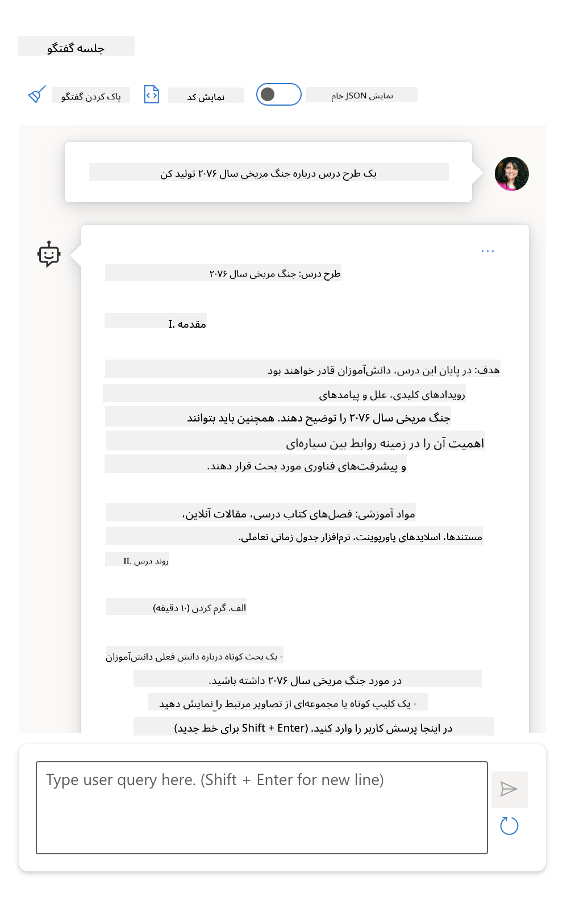
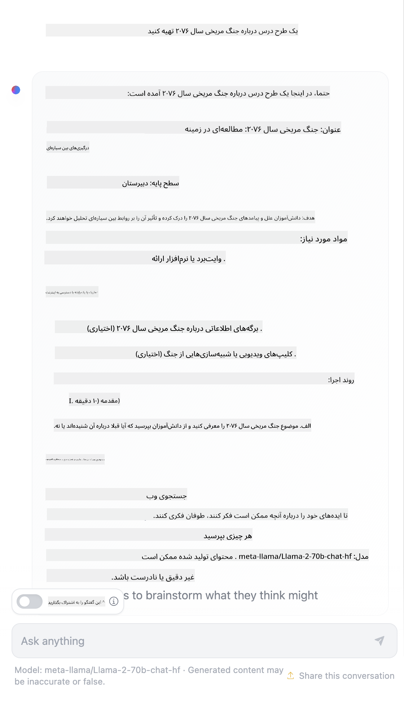

<!--
CO_OP_TRANSLATOR_METADATA:
{
  "original_hash": "dcbaaae026cb50fee071e690685b5843",
  "translation_date": "2025-08-26T14:14:13+00:00",
  "source_file": "04-prompt-engineering-fundamentals/README.md",
  "language_code": "fa"
}
-->
# مبانی مهندسی پرامپت

[](https://aka.ms/gen-ai-lesson4-gh?WT.mc_id=academic-105485-koreyst)

## مقدمه
در این ماژول، مفاهیم و تکنیک‌های اساسی برای ساخت پرامپت‌های مؤثر در مدل‌های هوش مصنوعی مولد را بررسی می‌کنیم. نحوه نوشتن پرامپت برای یک LLM نیز اهمیت دارد. یک پرامپت با دقت طراحی‌شده می‌تواند کیفیت پاسخ را بهبود دهد. اما دقیقاً اصطلاحاتی مثل _پرامپت_ و _مهندسی پرامپت_ به چه معناست؟ و چطور می‌توانم ورودی پرامپت را که به LLM می‌فرستم بهبود دهم؟ این‌ها سوالاتی هستند که در این فصل و فصل بعدی به آن‌ها پاسخ خواهیم داد.

_هوش مصنوعی مولد_ قادر است محتوای جدید (مانند متن، تصویر، صدا، کد و غیره) را در پاسخ به درخواست کاربر تولید کند. این کار را با استفاده از _مدل‌های زبانی بزرگ_ مثل سری GPT ("Generative Pre-trained Transformer") شرکت OpenAI انجام می‌دهد که برای کار با زبان طبیعی و کد آموزش دیده‌اند.

امروزه کاربران می‌توانند با این مدل‌ها از طریق روش‌های آشنایی مثل چت تعامل داشته باشند، بدون اینکه نیاز به تخصص فنی یا آموزش خاصی داشته باشند. این مدل‌ها _مبتنی بر پرامپت_ هستند - کاربران یک ورودی متنی (پرامپت) ارسال می‌کنند و پاسخ هوش مصنوعی (completion) را دریافت می‌کنند. سپس می‌توانند به صورت تعاملی و در چندین نوبت با هوش مصنوعی گفتگو کنند و پرامپت خود را اصلاح کنند تا پاسخ به انتظاراتشان نزدیک‌تر شود.

"پرامپت‌ها" اکنون به عنوان رابط اصلی _برنامه‌نویسی_ برای اپلیکیشن‌های هوش مصنوعی مولد عمل می‌کنند و به مدل‌ها می‌گویند چه کاری انجام دهند و کیفیت پاسخ‌ها را تحت تأثیر قرار می‌دهند. "مهندسی پرامپت" حوزه‌ای در حال رشد است که بر _طراحی و بهینه‌سازی_ پرامپت‌ها برای ارائه پاسخ‌های باکیفیت و پایدار در مقیاس تمرکز دارد.

## اهداف یادگیری

در این درس، یاد می‌گیریم مهندسی پرامپت چیست، چرا اهمیت دارد و چگونه می‌توانیم پرامپت‌های مؤثرتری برای یک مدل و هدف اپلیکیشن خاص بسازیم. با مفاهیم اصلی و بهترین روش‌های مهندسی پرامپت آشنا می‌شویم و محیط تعاملی Jupyter Notebooks را می‌بینیم که این مفاهیم را روی مثال‌های واقعی پیاده‌سازی می‌کند.

در پایان این درس قادر خواهیم بود:

1. توضیح دهیم مهندسی پرامپت چیست و چرا اهمیت دارد.
2. اجزای یک پرامپت و نحوه استفاده از آن‌ها را شرح دهیم.
3. بهترین روش‌ها و تکنیک‌های مهندسی پرامپت را یاد بگیریم.
4. تکنیک‌های آموخته‌شده را روی مثال‌های واقعی با استفاده از یک endpoint اوپن‌ای‌آی به کار ببریم.

## واژه‌های کلیدی

مهندسی پرامپت: هنر طراحی و اصلاح ورودی‌ها برای هدایت مدل‌های هوش مصنوعی به سمت تولید خروجی‌های مطلوب.
توکنیزاسیون: فرایند تبدیل متن به واحدهای کوچکتر به نام توکن که مدل بتواند آن‌ها را درک و پردازش کند.
مدل‌های زبانی بزرگ تنظیم‌شده با دستورالعمل: مدل‌های زبانی بزرگی که با دستورالعمل‌های خاص برای بهبود دقت و ارتباط پاسخ‌ها تنظیم شده‌اند.

## محیط تمرینی (Learning Sandbox)

مهندسی پرامپت در حال حاضر بیشتر یک هنر است تا علم. بهترین راه برای تقویت شهود خود در این زمینه، _تمرین بیشتر_ و اتخاذ رویکرد آزمون و خطا است که تخصص حوزه کاربرد را با تکنیک‌های پیشنهادی و بهینه‌سازی‌های خاص مدل ترکیب می‌کند.

Jupyter Notebook همراه این درس یک محیط _sandbox_ فراهم می‌کند که می‌توانید آنچه یاد می‌گیرید را همان لحظه یا در چالش کدنویسی انتهایی امتحان کنید. برای اجرای تمرین‌ها به موارد زیر نیاز دارید:

1. **کلید API اوپن‌ای‌آی در آژور** - endpoint سرویس برای یک LLM مستقرشده.
2. **محیط اجرایی پایتون** - که Notebook در آن اجرا شود.
3. **متغیرهای محیطی محلی** - _همین حالا مراحل [SETUP](./../00-course-setup/02-setup-local.md?WT.mc_id=academic-105485-koreyst) را کامل کنید تا آماده شوید_.

این نوت‌بوک با تمرین‌های _آغازین_ ارائه شده است - اما توصیه می‌شود بخش‌های _Markdown_ (توضیحات) و _Code_ (درخواست‌های پرامپت) خودتان را اضافه کنید تا مثال‌ها یا ایده‌های بیشتری را امتحان کنید و شهود خود را در طراحی پرامپت تقویت کنید.

## راهنمای تصویری

دوست دارید قبل از شروع، یک دید کلی از مباحث این درس داشته باشید؟ این راهنمای تصویری را ببینید که موضوعات اصلی و نکات کلیدی هر بخش را به شما نشان می‌دهد. نقشه راه درس شما را از درک مفاهیم و چالش‌های اصلی تا پرداختن به آن‌ها با تکنیک‌ها و بهترین روش‌های مهندسی پرامپت هدایت می‌کند. توجه داشته باشید که بخش "تکنیک‌های پیشرفته" در این راهنما به محتوایی اشاره دارد که در فصل _بعدی_ این دوره پوشش داده می‌شود.


## استارتاپ ما

حالا بیایید ببینیم _این موضوع_ چه ارتباطی با مأموریت استارتاپ ما برای [آوردن نوآوری هوش مصنوعی به آموزش](https://educationblog.microsoft.com/2023/06/collaborating-to-bring-ai-innovation-to-education?WT.mc_id=academic-105485-koreyst) دارد. ما می‌خواهیم اپلیکیشن‌های آموزشی مبتنی بر هوش مصنوعی و _یادگیری شخصی‌سازی‌شده_ بسازیم - پس بیایید فکر کنیم کاربران مختلف اپلیکیشن ما چطور ممکن است پرامپت طراحی کنند:

- **مدیران** ممکن است از هوش مصنوعی بخواهند _داده‌های برنامه درسی را تحلیل کند تا شکاف‌های پوشش را شناسایی کند_. هوش مصنوعی می‌تواند نتایج را خلاصه یا با کد آن‌ها را بصری‌سازی کند.
- **معلمان** ممکن است از هوش مصنوعی بخواهند _یک طرح درس برای یک گروه هدف و موضوع خاص تولید کند_. هوش مصنوعی می‌تواند طرح شخصی‌سازی‌شده را در قالب مشخص بسازد.
- **دانش‌آموزان** ممکن است از هوش مصنوعی بخواهند _در یک موضوع دشوار به آن‌ها آموزش دهد_. هوش مصنوعی می‌تواند با درس‌ها، نکته‌ها و مثال‌های متناسب با سطح دانش‌آموز راهنمایی کند.

این فقط بخش کوچکی از امکانات است. به [Prompts For Education](https://github.com/microsoft/prompts-for-edu/tree/main?WT.mc_id=academic-105485-koreyst) سر بزنید - یک کتابخانه متن‌باز از پرامپت‌ها که توسط متخصصان آموزش گردآوری شده - تا دید وسیع‌تری از قابلیت‌ها پیدا کنید! _برخی از این پرامپت‌ها را در sandbox یا OpenAI Playground اجرا کنید و نتیجه را ببینید!_

<!--
قالب درس:
این بخش باید مفهوم اصلی شماره ۱ را پوشش دهد.
مفهوم را با مثال‌ها و منابع تقویت کنید.

مفهوم #۱:
مهندسی پرامپت.
تعریف کنید و توضیح دهید چرا لازم است.
-->

## مهندسی پرامپت چیست؟

این درس را با تعریف **مهندسی پرامپت** آغاز کردیم: فرایند _طراحی و بهینه‌سازی_ ورودی‌های متنی (پرامپت‌ها) برای ارائه پاسخ‌های باکیفیت و پایدار (completion) برای یک هدف و مدل خاص. می‌توان این فرایند را دو مرحله‌ای در نظر گرفت:

- _طراحی_ پرامپت اولیه برای یک مدل و هدف مشخص
- _اصلاح_ تدریجی پرامپت برای بهبود کیفیت پاسخ

این فرایند ذاتاً مبتنی بر آزمون و خطا است و برای رسیدن به نتیجه مطلوب به شهود و تلاش کاربر نیاز دارد. اما چرا این موضوع مهم است؟ برای پاسخ به این سوال، ابتدا باید سه مفهوم را درک کنیم:

- _توکنیزاسیون_ = مدل چگونه پرامپت را "می‌بیند"
- _مدل‌های پایه LLM_ = مدل پایه چگونه یک پرامپت را "پردازش" می‌کند
- _مدل‌های تنظیم‌شده با دستورالعمل_ = مدل چگونه "وظایف" را می‌بیند

### توکنیزاسیون

یک LLM پرامپت‌ها را به صورت _دنباله‌ای از توکن‌ها_ می‌بیند که مدل‌های مختلف (یا نسخه‌های مختلف یک مدل) ممکن است یک پرامپت را به شکل‌های متفاوتی توکنیزه کنند. از آنجا که LLMها بر اساس توکن‌ها (و نه متن خام) آموزش دیده‌اند، نحوه توکنیزه شدن پرامپت‌ها تأثیر مستقیمی بر کیفیت پاسخ تولیدشده دارد.

برای درک بهتر نحوه کار توکنیزاسیون، ابزارهایی مثل [OpenAI Tokenizer](https://platform.openai.com/tokenizer?WT.mc_id=academic-105485-koreyst) را امتحان کنید. پرامپت خود را وارد کنید و ببینید چگونه به توکن‌ها تبدیل می‌شود و به نحوه برخورد با فاصله‌ها و علائم نگارشی توجه کنید. توجه داشته باشید که این مثال مربوط به یک LLM قدیمی‌تر (GPT-3) است - بنابراین امتحان این کار با یک مدل جدیدتر ممکن است نتیجه متفاوتی بدهد.


### مفهوم: مدل‌های پایه

پس از توکنیزه شدن پرامپت، عملکرد اصلی ["مدل پایه LLM"](https://blog.gopenai.com/an-introduction-to-base-and-instruction-tuned-large-language-models-8de102c785a6?WT.mc_id=academic-105485-koreyst) (یا مدل Foundation) پیش‌بینی توکن بعدی در آن دنباله است. چون LLMها با داده‌های متنی عظیم آموزش دیده‌اند، روابط آماری بین توکن‌ها را به خوبی می‌شناسند و می‌توانند این پیش‌بینی را با اطمینان انجام دهند. توجه داشته باشید که آن‌ها _معنای_ کلمات یا توکن‌ها را درک نمی‌کنند؛ فقط الگوهایی را می‌بینند که می‌توانند با پیش‌بینی بعدی خود "تکمیل" کنند. آن‌ها می‌توانند این دنباله را تا زمانی که کاربر متوقف کند یا شرطی از پیش تعیین‌شده برقرار شود ادامه دهند.

دوست دارید ببینید تکمیل مبتنی بر پرامپت چگونه کار می‌کند؟ پرامپت بالا را در [_Chat Playground_](https://oai.azure.com/playground?WT.mc_id=academic-105485-koreyst) آژور اوپن‌ای‌آی با تنظیمات پیش‌فرض وارد کنید. سیستم طوری پیکربندی شده که پرامپت‌ها را به عنوان درخواست اطلاعات در نظر می‌گیرد - بنابراین باید یک completion متناسب با این زمینه ببینید.

اما اگر کاربر بخواهد چیزی خاص ببیند که معیار یا هدف خاصی را برآورده کند چه؟ اینجاست که مدل‌های LLM تنظیم‌شده با دستورالعمل وارد عمل می‌شوند.


### مفهوم: مدل‌های تنظیم‌شده با دستورالعمل

یک [مدل LLM تنظیم‌شده با دستورالعمل](https://blog.gopenai.com/an-introduction-to-base-and-instruction-tuned-large-language-models-8de102c785a6?WT.mc_id=academic-105485-koreyst) با مدل پایه شروع می‌شود و با مثال‌ها یا جفت‌های ورودی/خروجی (مثلاً پیام‌های چندمرحله‌ای) که می‌توانند شامل دستورالعمل‌های واضح باشند، به صورت دقیق‌تر تنظیم می‌شود - و پاسخ هوش مصنوعی تلاش می‌کند آن دستورالعمل را دنبال کند.

در این روش از تکنیک‌هایی مثل یادگیری تقویتی با بازخورد انسانی (RLHF) استفاده می‌شود که مدل را برای _پیروی از دستورالعمل‌ها_ و _یادگیری از بازخورد_ آموزش می‌دهد تا پاسخ‌هایی تولید کند که برای کاربردهای عملی مناسب‌تر و مرتبط‌تر با اهداف کاربر باشند.

بیایید امتحان کنیم - دوباره به پرامپت بالا برگردید، اما این بار _system message_ را تغییر دهید و دستور زیر را به عنوان زمینه قرار دهید:

> _محتوایی که دریافت می‌کنی را برای یک دانش‌آموز کلاس دوم خلاصه کن. نتیجه را در یک پاراگراف با ۳ تا ۵ نکته کلیدی ارائه بده._

می‌بینید که نتیجه اکنون متناسب با هدف و قالب مورد نظر تنظیم شده است؟ یک معلم می‌تواند این پاسخ را مستقیماً در اسلایدهای کلاس خود استفاده کند.


## چرا به مهندسی پرامپت نیاز داریم؟

حالا که می‌دانیم پرامپت‌ها چگونه توسط LLMها پردازش می‌شوند، بیایید درباره _چرایی_ نیاز به مهندسی پرامپت صحبت کنیم. پاسخ در این است که LLMهای فعلی چالش‌هایی دارند که دستیابی به _completionهای قابل اعتماد و پایدار_ را بدون صرف وقت برای ساخت و بهینه‌سازی پرامپت دشوار می‌کند. برای مثال:

1. **پاسخ‌های مدل تصادفی هستند.** _یک پرامپت یکسان_ احتمالاً پاسخ‌های متفاوتی با مدل‌ها یا نسخه‌های مختلف مدل تولید می‌کند. حتی ممکن است با _همان مدل_ در زمان‌های مختلف نتایج متفاوتی بدهد. _تکنیک‌های مهندسی پرامپت می‌توانند این نوسانات را با ایجاد چارچوب‌های بهتر کاهش دهند_.

1. **مدل‌ها ممکن است پاسخ‌های ساختگی تولید کنند.** مدل‌ها با داده‌های _بزرگ اما محدود_ آموزش دیده‌اند، یعنی درباره مفاهیم خارج از این داده‌ها اطلاعی ندارند. در نتیجه ممکن است completionهایی تولید کنند که نادرست، خیالی یا حتی متناقض با واقعیت باشند. _تکنیک‌های مهندسی پرامپت به کاربران کمک می‌کند این ساختگی‌ها را شناسایی و کاهش دهند، مثلاً با درخواست استناد یا استدلال از هوش مصنوعی_.

1. **قابلیت مدل‌ها متفاوت خواهد بود.** مدل‌های جدیدتر یا نسل‌های مختلف مدل‌ها قابلیت‌های بیشتری دارند اما ویژگی‌ها و پیچیدگی‌های خاص خود را نیز به همراه می‌آورند. _مهندسی پرامپت می‌تواند به ما کمک کند بهترین روش‌ها و جریان‌های کاری را توسعه دهیم که تفاوت‌ها را انتزاع کرده و به طور مقیاس‌پذیر با نیازهای خاص هر مدل سازگار شوند_.

بیایید این موضوع را در OpenAI یا Azure OpenAI Playground امتحان کنیم:

- از یک پرامپت یکسان با استقرارهای مختلف LLM (مثلاً OpenAI، Azure OpenAI، Hugging Face) استفاده کنید - آیا تفاوت‌ها را مشاهده کردید؟
- همان پرامپت را چندین بار با _یک_ استقرار LLM (مثلاً Azure OpenAI playground) اجرا کنید - این تفاوت‌ها چگونه بودند؟

### مثال ساختگی‌ها

در این دوره، از اصطلاح **"ساختگی"** برای اشاره به پدیده‌ای استفاده می‌کنیم که LLMها گاهی به دلیل محدودیت‌های آموزشی یا سایر عوامل، اطلاعات نادرست تولید می‌کنند. شاید این موضوع را در مقالات یا پژوهش‌ها با عنوان _"توهم"_ شنیده باشید. با این حال، اکیداً توصیه می‌کنیم از واژه _"ساختگی"_ استفاده کنید تا به اشتباه این رفتار را انسانی جلوه ندهیم و ویژگی انسانی به نتیجه‌ای که توسط ماشین ایجاد شده نسبت ندهیم. این کار همچنین با [راهنمای هوش مصنوعی مسئولانه](https://www.microsoft.com/ai/responsible-ai?WT.mc_id=academic-105485-koreyst) از نظر واژه‌گزینی همسو است و اصطلاحاتی را حذف می‌کند که ممکن است در برخی زمینه‌ها توهین‌آمیز یا غیرشامل باشند.

دوست دارید ببینید ساختگی‌ها چگونه رخ می‌دهند؟ یک پرامپت طراحی کنید که از هوش مصنوعی بخواهد درباره موضوعی غیرواقعی محتوا تولید کند (تا مطمئن شوید در داده‌های آموزشی وجود ندارد). برای مثال - من این پرامپت را امتحان کردم:
# طرح درس: جنگ مریخی سال ۲۰۷۶

## اهداف یادگیری

- آشنایی با دلایل و پیامدهای جنگ مریخی سال ۲۰۷۶
- بررسی نقش فناوری و سیاست در این جنگ
- تحلیل تاثیرات جنگ بر جوامع انسانی و مریخی

## مقدمه

جنگ مریخی سال ۲۰۷۶ یکی از مهم‌ترین رویدادهای تاریخ بشر و مریخ بود. این جنگ نه تنها روابط بین سیاره‌ای را تغییر داد، بلکه باعث پیشرفت‌های چشمگیری در فناوری و سیاست شد.

## فعالیت‌های کلاسی

### بحث گروهی

- دانش‌آموزان درباره دلایل آغاز جنگ مریخی گفتگو می‌کنند.
- بررسی نقش منابع مریخ و رقابت قدرت‌ها در شروع جنگ.

### مطالعه موردی

- تحلیل استراتژی‌های نظامی استفاده شده توسط انسان‌ها و مریخی‌ها.
- بررسی تاثیرات جنگ بر زندگی روزمره ساکنان مریخ.

### فعالیت عملی

- دانش‌آموزان یک نقشه زمانی از رویدادهای مهم جنگ تهیه می‌کنند.
- شبیه‌سازی مذاکرات صلح بین طرفین جنگ.

## منابع پیشنهادی

- کتاب "تاریخچه جنگ مریخی"
- مقاله "تاثیرات اجتماعی جنگ مریخی ۲۰۷۶"
- مستند "نبرد برای مریخ"

## تکلیف

- یک مقاله کوتاه درباره مهم‌ترین درس‌هایی که از جنگ مریخی سال ۲۰۷۶ می‌توان گرفت بنویسید.
- یک پوستر درباره پیامدهای جنگ مریخی طراحی کنید.

## جمع‌بندی

در پایان این درس، دانش‌آموزان باید بتوانند دلایل، روند و پیامدهای جنگ مریخی سال ۲۰۷۶ را توضیح دهند و تاثیرات آن را بر آینده بشر و مریخ تحلیل کنند.
یک جستجوی وب به من نشان داد که روایت‌های تخیلی (مثلاً سریال‌های تلویزیونی یا کتاب‌ها) درباره جنگ‌های مریخی وجود دارد - اما هیچ‌کدام در سال ۲۰۷۶ رخ نداده‌اند. عقل سلیم هم به ما می‌گوید که سال ۲۰۷۶ _در آینده_ است و بنابراین نمی‌تواند به یک رویداد واقعی مرتبط باشد.

پس وقتی این پرامپت را با ارائه‌دهندگان مختلف LLM اجرا کنیم چه اتفاقی می‌افتد؟

> **پاسخ ۱**: OpenAI Playground (GPT-35)


> **پاسخ ۲**: Azure OpenAI Playground (GPT-35)



> **پاسخ ۳**: : Hugging Face Chat Playground (LLama-2)



همان‌طور که انتظار می‌رفت، هر مدل (یا نسخه مدل) به دلیل رفتار تصادفی و تفاوت‌های توانایی مدل، پاسخ‌های کمی متفاوت تولید می‌کند. مثلاً یک مدل مخاطب خود را دانش‌آموز کلاس هشتم فرض می‌کند و دیگری دانش‌آموز دبیرستانی. اما هر سه مدل پاسخی تولید کردند که می‌تواند یک کاربر ناآگاه را قانع کند که این رویداد واقعی بوده است.

تکنیک‌های مهندسی پرامپت مانند _متاپرامپتینگ_ و _تنظیم دما (temperature)_ می‌توانند تا حدی از جعل مدل جلوگیری کنند. معماری‌های جدید مهندسی پرامپت نیز ابزارها و تکنیک‌های جدید را به طور یکپارچه وارد جریان پرامپت می‌کنند تا برخی از این اثرات را کاهش دهند یا از بین ببرند.

## مطالعه موردی: GitHub Copilot

بیایید این بخش را با بررسی یک نمونه واقعی از کاربرد مهندسی پرامپت در راهکارهای دنیای واقعی جمع‌بندی کنیم: [GitHub Copilot](https://github.com/features/copilot?WT.mc_id=academic-105485-koreyst).

GitHub Copilot برنامه‌نویس جفت هوشمند شماست - متن پرامپت را به تکمیل کد تبدیل می‌کند و در محیط توسعه شما (مثلاً Visual Studio Code) یکپارچه شده تا تجربه کاربری روانی ارائه دهد. همان‌طور که در مجموعه بلاگ‌های زیر آمده، نسخه اولیه آن بر پایه مدل OpenAI Codex بود - اما مهندسان خیلی زود متوجه شدند که باید مدل را بهینه‌سازی کنند و تکنیک‌های بهتری برای مهندسی پرامپت توسعه دهند تا کیفیت کد را افزایش دهند. در ماه جولای، آن‌ها [مدل هوش مصنوعی بهبودیافته‌ای معرفی کردند که فراتر از Codex عمل می‌کند](https://github.blog/2023-07-28-smarter-more-efficient-coding-github-copilot-goes-beyond-codex-with-improved-ai-model/?WT.mc_id=academic-105485-koreyst) و پیشنهادات سریع‌تری ارائه می‌دهد.

برای دنبال کردن مسیر یادگیری آن‌ها، پست‌ها را به ترتیب بخوانید.

- **مه ۲۰۲۳** | [GitHub Copilot در درک کد شما بهتر شده است](https://github.blog/2023-05-17-how-github-copilot-is-getting-better-at-understanding-your-code/?WT.mc_id=academic-105485-koreyst)
- **مه ۲۰۲۳** | [درون گیت‌هاب: کار با LLMهای پشت Copilot](https://github.blog/2023-05-17-inside-github-working-with-the-llms-behind-github-copilot/?WT.mc_id=academic-105485-koreyst).
- **ژوئن ۲۰۲۳** | [چگونه پرامپت‌های بهتری برای Copilot بنویسیم](https://github.blog/2023-06-20-how-to-write-better-prompts-for-github-copilot/?WT.mc_id=academic-105485-koreyst).
- **جولای ۲۰۲۳** | [.. Copilot با مدل هوش مصنوعی بهبودیافته فراتر از Codex می‌رود](https://github.blog/2023-07-28-smarter-more-efficient-coding-github-copilot-goes-beyond-codex-with-improved-ai-model/?WT.mc_id=academic-105485-koreyst)
- **جولای ۲۰۲۳** | [راهنمای توسعه‌دهنده برای مهندسی پرامپت و LLMها](https://github.blog/2023-07-17-prompt-engineering-guide-generative-ai-llms/?WT.mc_id=academic-105485-koreyst)
- **سپتامبر ۲۰۲۳** | [چگونه یک اپلیکیشن LLM سازمانی بسازیم: درس‌هایی از Copilot](https://github.blog/2023-09-06-how-to-build-an-enterprise-llm-application-lessons-from-github-copilot/?WT.mc_id=academic-105485-koreyst)

همچنین می‌توانید بلاگ [مهندسی گیت‌هاب](https://github.blog/category/engineering/?WT.mc_id=academic-105485-koreyst) را برای پست‌های بیشتری مانند [این پست](https://github.blog/2023-09-27-how-i-used-github-copilot-chat-to-build-a-reactjs-gallery-prototype/?WT.mc_id=academic-105485-koreyst) مرور کنید که نشان می‌دهد این مدل‌ها و تکنیک‌ها چگونه _در عمل_ برای ساخت اپلیکیشن‌های واقعی به کار می‌روند.

---

## ساخت پرامپت

دیدیم که چرا مهندسی پرامپت اهمیت دارد - حالا بیایید بفهمیم پرامپت‌ها چگونه _ساخته_ می‌شوند تا بتوانیم تکنیک‌های مختلف را برای طراحی مؤثرتر پرامپت ارزیابی کنیم.

### پرامپت پایه

بیایید با پرامپت پایه شروع کنیم: یک ورودی متنی که بدون هیچ زمینه‌ای به مدل ارسال می‌شود. مثلاً وقتی چند کلمه اول سرود ملی آمریکا را به [Completion API](https://platform.openai.com/docs/api-reference/completions?WT.mc_id=academic-105485-koreyst) می‌فرستیم، مدل بلافاصله پاسخ را با چند خط بعدی _تکمیل_ می‌کند و رفتار پیش‌بینی پایه را نشان می‌دهد.

| پرامپت (ورودی)     | تکمیل (خروجی)                                                                                                                        |
| :----------------- | :------------------------------------------------------------------------------------------------------------------------------------ |
| Oh say can you see | به نظر می‌رسد شما در حال شروع شعر "The Star-Spangled Banner"، سرود ملی ایالات متحده هستید. متن کامل آن چنین است ... |

### پرامپت پیچیده

حالا به آن پرامپت پایه، زمینه و دستورالعمل اضافه می‌کنیم. [Chat Completion API](https://learn.microsoft.com/azure/ai-services/openai/how-to/chatgpt?WT.mc_id=academic-105485-koreyst) به ما اجازه می‌دهد یک پرامپت پیچیده را به صورت مجموعه‌ای از _پیام‌ها_ بسازیم که شامل موارد زیر است:

- جفت‌های ورودی/خروجی که بازتاب‌دهنده ورودی _کاربر_ و پاسخ _دستیار_ هستند.
- پیام سیستمی که زمینه رفتار یا شخصیت دستیار را تعیین می‌کند.

درخواست اکنون به شکل زیر است که _توکنیزه شدن_ اطلاعات مرتبط را از زمینه و مکالمه استخراج می‌کند. حالا تغییر زمینه سیستم می‌تواند به اندازه ورودی‌های کاربر بر کیفیت تکمیل‌ها تأثیرگذار باشد.

```python
response = openai.chat.completions.create(
    model="gpt-3.5-turbo",
    messages=[
        {"role": "system", "content": "You are a helpful assistant."},
        {"role": "user", "content": "Who won the world series in 2020?"},
        {"role": "assistant", "content": "The Los Angeles Dodgers won the World Series in 2020."},
        {"role": "user", "content": "Where was it played?"}
    ]
)
```

### پرامپت دستوری

در مثال‌های بالا، پرامپت کاربر یک پرسش متنی ساده بود که می‌توان آن را به عنوان درخواست اطلاعات تفسیر کرد. با پرامپت‌های _دستوری_ می‌توانیم با جزئیات بیشتری وظیفه را مشخص کنیم و راهنمایی بهتری به هوش مصنوعی بدهیم. مثال:

| پرامپت (ورودی)                                                                                                                                                                                                                         | تکمیل (خروجی)                                                                                                        | نوع دستورالعمل    |
| :------------------------------------------------------------------------------------------------------------------------------------------------------------------------------------------------------------------------------------- | :-------------------------------------------------------------------------------------------------------------------- | :---------------- |
| Write a description of the Civil War                                                                                                                                                                                                   | _یک پاراگراف ساده بازگردانده شد_                                                                                     | ساده              |
| Write a description of the Civil War. Provide key dates and events and describe their significance                                                                                                                                     | _یک پاراگراف و سپس فهرستی از تاریخ رویدادهای کلیدی با توضیحات بازگردانده شد_                                         | پیچیده            |
| Write a description of the Civil War in 1 paragraph. Provide 3 bullet points with key dates and their significance. Provide 3 more bullet points with key historical figures and their contributions. Return the output as a JSON file | _جزئیات بیشتری در یک جعبه متنی بازگردانده شد که به صورت JSON فرمت شده و می‌توانید آن را کپی و اعتبارسنجی کنید_        | پیچیده. فرمت شده. |

## محتوای اصلی

در مثال‌های بالا، پرامپت هنوز نسبتاً باز بود و به LLM اجازه می‌داد خودش تصمیم بگیرد کدام بخش از داده‌های پیش‌آموزش‌دیده مرتبط است. با الگوی طراحی _محتوای اصلی_، متن ورودی به دو بخش تقسیم می‌شود:

- یک دستورالعمل (عمل)
- محتوای مرتبط (که بر عمل تأثیر می‌گذارد)

مثلاً در این مثال، دستورالعمل این است که "این را در دو جمله خلاصه کن".

| پرامپت (ورودی)                                                                                                                                                                                                                                                                                                                                                                                                                                                                                                                                                                                                                                                                                      | تکمیل (خروجی)                                                                                                                                                                                                                                                                             |
| :-------------------------------------------------------------------------------------------------------------------------------------------------------------------------------------------------------------------------------------------------------------------------------------------------------------------------------------------------------------------------------------------------------------------------------------------------------------------------------------------------------------------------------------------------------------------------------------------------------------------------------------------------------------------------------------------------- | :---------------------------------------------------------------------------------------------------------------------------------------------------------------------------------------------------------------------------------------------------------------------------------------- |
| Jupiter is the fifth planet from the Sun and the largest in the Solar System. It is a gas giant with a mass one-thousandth that of the Sun, but two-and-a-half times that of all the other planets in the Solar System combined. Jupiter is one of the brightest objects visible to the naked eye in the night sky, and has been known to ancient civilizations since before recorded history. It is named after the Roman god Jupiter.[19] When viewed from Earth, Jupiter can be bright enough for its reflected light to cast visible shadows,[20] and is on average the third-brightest natural object in the night sky after the Moon and Venus. <br/> **Summarize this in 2 short sentences** | مشتری، پنجمین سیاره از خورشید و بزرگ‌ترین سیاره منظومه شمسی است و به عنوان یکی از درخشان‌ترین اجرام آسمان شب شناخته می‌شود. این سیاره که به نام خدای رومی مشتری نام‌گذاری شده، یک غول گازی است که جرم آن دو و نیم برابر مجموع سایر سیارات منظومه شمسی است. |

بخش محتوای اصلی را می‌توان به روش‌های مختلفی برای ارائه دستورالعمل مؤثرتر به کار برد:

- **مثال‌ها** - به جای اینکه به مدل بگویید چه کاری انجام دهد، با مثال به آن نشان دهید و اجازه دهید الگو را استنباط کند.
- **سرنخ‌ها** - بعد از دستورالعمل، یک "سرنخ" قرار دهید که تکمیل را جهت‌دهی کند و مدل را به سمت پاسخ‌های مرتبط‌تر هدایت کند.
- **قالب‌ها** - این‌ها دستورالعمل‌های تکرارشونده با جای‌خالی (متغیر) هستند که می‌توان آن‌ها را برای کاربردهای خاص با داده سفارشی کرد.

بیایید این موارد را در عمل ببینیم.

### استفاده از مثال‌ها

در این روش، شما با استفاده از محتوای اصلی، چند مثال از خروجی مطلوب را برای یک دستورالعمل خاص به مدل می‌دهید و اجازه می‌دهید الگو را استنباط کند. بسته به تعداد مثال‌ها، می‌توانیم پرامپت بدون مثال (zero-shot)، تک‌مثال (one-shot)، چندمثال (few-shot) و غیره داشته باشیم.

پرامپت اکنون سه بخش دارد:

- شرح وظیفه
- چند مثال از خروجی مطلوب
- شروع یک مثال جدید (که به نوعی شرح وظیفه ضمنی می‌شود)

| نوع یادگیری | پرامپت (ورودی)                                                                                                                                        | تکمیل (خروجی)         |
| :---------- | :----------------------------------------------------------------------------------------------------------------------------------------------------- | :--------------------- |
| بدون مثال   | "The Sun is Shining". Translate to Spanish                                                                                                            | "El Sol está brillando".    |
| تک‌مثال     | "The Sun is Shining" => ""El Sol está brillando". <br> "It's a Cold and Windy Day" =>                                                                 | "Es un día frío y ventoso". |
| چندمثال     | The player ran the bases => Baseball <br/> The player hit an ace => Tennis <br/> The player hit a six => Cricket <br/> The player made a slam-dunk => | Basketball                  |
|             |                                                                                                                                                       |                         |

توجه کنید که در پرامپت بدون مثال مجبور بودیم دستور صریح ("Translate to Spanish") بدهیم، اما در تک‌مثال مدل خودش آن را استنباط کرد. مثال چندمثال نشان می‌دهد که با افزودن مثال‌های بیشتر، مدل می‌تواند بدون دستور اضافی، استنباط دقیق‌تری انجام دهد.

### سرنخ در پرامپت

تکنیک دیگر برای استفاده از محتوای اصلی، ارائه _سرنخ_ به جای مثال است. در این حالت، با یک قطعه کوتاه که فرمت پاسخ مطلوب را نشان می‌دهد، مدل را در مسیر درست قرار می‌دهیم. مدل سپس "سرنخ را می‌گیرد" و ادامه می‌دهد.

| تعداد سرنخ | پرامپت (ورودی)                                                                                                                                                                                                                                                                                                                                                                                                                                               | تکمیل (خروجی)                                                                                                                                                                                                                                                                                       |
| :--------- | :----------------------------------------------------------------------------------------------------------------------------------------------------------------------------------------------------------------------------------------------------------------------------------------------------------------------------------------------------------------------------------------------------------------------------------------------------------- | :-------------------------------------------------------------------------------------------------------------------------------------------------------------------------------------------------------------------------------------------------------------------------------------------------- |
| ۰          | Jupiter is the fifth planet from the Sun and the largest in the Solar System. It is a gas giant with a mass one-thousandth that of the Sun, but two-and-a-half times that of all the other planets in the Solar System combined. Jupiter is one of the brightest objects visible to the naked eye in the night sky, and has been known to ancient civilizations since before recorded history.

**خلاصه کن**                                       | مشتری بزرگ‌ترین سیاره منظومه شمسی و پنجمین سیاره از خورشید است. این سیاره یک غول گازی با جرمی برابر با یک هزارم خورشید است، اما از مجموع جرم همه سیارات دیگر سنگین‌تر است. تمدن‌های باستانی مدت‌هاست مشتری را می‌شناسند و این سیاره به راحتی در آسمان شب دیده می‌شود. |
| ۱              | مشتری پنجمین سیاره از خورشید و بزرگ‌ترین سیاره منظومه شمسی است. این سیاره یک غول گازی با جرمی برابر با یک هزارم خورشید است، اما دو و نیم برابر مجموع جرم همه سیارات دیگر منظومه شمسی جرم دارد. مشتری یکی از درخشان‌ترین اجرام قابل مشاهده با چشم غیرمسلح در آسمان شب است و از دوران باستان شناخته شده است. <br/>**خلاصه کن** <br/> آنچه یاد گرفتیم این است که مشتری | پنجمین سیاره از خورشید و بزرگ‌ترین سیاره منظومه شمسی است. یک غول گازی با جرمی برابر با یک هزارم خورشید، اما دو و نیم برابر مجموع جرم همه سیارات دیگر. به راحتی با چشم غیرمسلح دیده می‌شود و از زمان‌های قدیم شناخته شده است.                        |
| ۲              | مشتری پنجمین سیاره از خورشید و بزرگ‌ترین سیاره منظومه شمسی است. این سیاره یک غول گازی با جرمی برابر با یک هزارم خورشید است، اما دو و نیم برابر مجموع جرم همه سیارات دیگر منظومه شمسی جرم دارد. مشتری یکی از درخشان‌ترین اجرام قابل مشاهده با چشم غیرمسلح در آسمان شب است و از دوران باستان شناخته شده است. <br/>**خلاصه کن** <br/> سه نکته مهمی که یاد گرفتیم:         | ۱. مشتری پنجمین سیاره از خورشید و بزرگ‌ترین سیاره منظومه شمسی است. <br/> ۲. یک غول گازی با جرمی برابر با یک هزارم خورشید...<br/> ۳. مشتری از زمان‌های قدیم با چشم غیرمسلح قابل مشاهده بوده است ...                                                                       |
|                |                                                                                                                                                                                                                                                                                                                                                                                                                                                              |                                                                                                                                                                                                                                                                                                           |

### قالب‌های پرامپت

قالب پرامپت یک _دستورالعمل از پیش تعریف شده برای یک پرامپت_ است که می‌توان آن را ذخیره و در مواقع نیاز دوباره استفاده کرد تا تجربه کاربری یکدست‌تری در مقیاس بالا ایجاد شود. در ساده‌ترین حالت، مجموعه‌ای از نمونه‌های پرامپت مانند [این نمونه از OpenAI](https://platform.openai.com/examples?WT.mc_id=academic-105485-koreyst) است که هم اجزای تعاملی پرامپت (پیام‌های کاربر و سیستم) و هم فرمت درخواست مبتنی بر API را ارائه می‌دهد تا امکان استفاده مجدد فراهم شود.

در حالت پیچیده‌تر مانند [این نمونه از LangChain](https://python.langchain.com/docs/concepts/prompt_templates/?WT.mc_id=academic-105485-koreyst)، قالب شامل _جای‌نگهدارهایی_ است که می‌توان آن‌ها را با داده‌هایی از منابع مختلف (ورودی کاربر، زمینه سیستم، منابع داده خارجی و غیره) جایگزین کرد تا پرامپت به صورت پویا ساخته شود. این کار به ما اجازه می‌دهد کتابخانه‌ای از پرامپت‌های قابل استفاده مجدد بسازیم که می‌توانند تجربه کاربری یکدست را **برنامه‌نویسی شده** در مقیاس بالا ارائه دهند.

در نهایت، ارزش واقعی قالب‌ها در توانایی ساخت و انتشار _کتابخانه‌های پرامپت_ برای حوزه‌های کاربردی تخصصی است؛ جایی که قالب پرامپت حالا _بهینه‌سازی شده_ تا زمینه یا نمونه‌های خاص آن حوزه را منعکس کند و پاسخ‌ها را برای مخاطب هدف مرتبط‌تر و دقیق‌تر کند. مخزن [Prompts For Edu](https://github.com/microsoft/prompts-for-edu?WT.mc_id=academic-105485-koreyst) نمونه خوبی از این رویکرد است که کتابخانه‌ای از پرامپت‌ها را برای حوزه آموزش با تاکید بر اهداف کلیدی مانند برنامه‌ریزی درس، طراحی برنامه درسی، آموزش دانش‌آموز و غیره گردآوری کرده است.

## محتوای پشتیبان

اگر ساخت پرامپت را شامل یک دستور (وظیفه) و یک هدف (محتوای اصلی) بدانیم، _محتوای ثانویه_ مثل زمینه اضافی است که برای **تاثیرگذاری بر خروجی به نوعی** ارائه می‌دهیم. این محتوا می‌تواند شامل پارامترهای تنظیمی، دستورالعمل‌های قالب‌بندی، طبقه‌بندی موضوعی و غیره باشد که به مدل کمک می‌کند پاسخ خود را _متناسب با اهداف یا انتظارات کاربر_ تنظیم کند.

مثال: فرض کنید یک فهرست دوره با متادیتای گسترده (نام، توضیحات، سطح، برچسب‌ها، مدرس و غیره) برای همه دوره‌های موجود در برنامه درسی داریم:

- می‌توانیم دستوری تعریف کنیم که "فهرست دوره‌های پاییز ۲۰۲۳ را خلاصه کن"
- می‌توانیم محتوای اصلی را برای ارائه چند نمونه از خروجی مطلوب استفاده کنیم
- می‌توانیم محتوای ثانویه را برای شناسایی ۵ "برچسب" مهم به کار ببریم.

حالا مدل می‌تواند خلاصه‌ای در قالب نمونه‌های ارائه‌شده بدهد - اما اگر نتیجه‌ای چند برچسب داشته باشد، می‌تواند ۵ برچسب مشخص‌شده در محتوای ثانویه را اولویت دهد.

---

<!--
قالب درس:
این واحد باید مفهوم اصلی شماره ۱ را پوشش دهد.
مفهوم را با مثال‌ها و منابع تقویت کنید.

مفهوم شماره ۳:
تکنیک‌های مهندسی پرامپت.
چه تکنیک‌های پایه‌ای برای مهندسی پرامپت وجود دارد؟
با تمرین‌هایی آن را نشان دهید.
-->

## بهترین روش‌های پرامپت‌نویسی

حالا که فهمیدیم پرامپت‌ها چگونه _ساخته_ می‌شوند، می‌توانیم به این فکر کنیم که چطور آن‌ها را _طراحی_ کنیم تا بهترین روش‌ها را منعکس کنند. این موضوع را می‌توان به دو بخش تقسیم کرد - داشتن _نگرش_ درست و به‌کارگیری _تکنیک‌های_ مناسب.

### نگرش مهندسی پرامپت

مهندسی پرامپت یک فرآیند آزمون و خطا است، پس سه عامل راهنما را در نظر داشته باشید:

۱. **شناخت حوزه اهمیت دارد.** دقت و مرتبط بودن پاسخ تابعی از _حوزه_ کاری آن برنامه یا کاربر است. از شهود و تخصص خود برای **سفارشی‌سازی تکنیک‌ها** استفاده کنید. مثلا شخصیت‌های خاص حوزه را در پرامپت‌های سیستمی تعریف کنید، یا قالب‌های مخصوص حوزه را در پرامپت‌های کاربری به کار ببرید. محتوای ثانویه‌ای ارائه دهید که زمینه‌های خاص حوزه را منعکس کند، یا از نشانه‌ها و مثال‌های حوزه برای هدایت مدل به سمت الگوهای آشنا استفاده کنید.

۲. **شناخت مدل اهمیت دارد.** می‌دانیم مدل‌ها ذاتاً تصادفی هستند. اما پیاده‌سازی مدل‌ها می‌تواند از نظر داده‌های آموزشی (دانش پیش‌آموزش)، قابلیت‌ها (مثلاً از طریق API یا SDK) و نوع محتوایی که برای آن بهینه شده‌اند (مثلاً کد، تصویر یا متن) متفاوت باشد. نقاط قوت و محدودیت‌های مدل مورد استفاده را بشناسید و از این دانش برای _اولویت‌بندی وظایف_ یا ساخت _قالب‌های سفارشی_ که برای قابلیت‌های مدل بهینه شده‌اند، استفاده کنید.

۳. **تکرار و اعتبارسنجی اهمیت دارد.** مدل‌ها به سرعت در حال تحول‌اند و تکنیک‌های مهندسی پرامپت هم همین‌طور. به عنوان متخصص حوزه، ممکن است زمینه یا معیارهایی داشته باشید که فقط برای برنامه شما کاربرد دارد و نه برای جامعه گسترده‌تر. از ابزارها و تکنیک‌های مهندسی پرامپت برای "شروع سریع" ساخت پرامپت استفاده کنید، سپس با شهود و تخصص خود تکرار و اعتبارسنجی کنید. یافته‌های خود را ثبت کنید و یک **پایگاه دانش** (مثلاً کتابخانه پرامپت) بسازید تا دیگران بتوانند از آن به عنوان نقطه شروع برای تکرارهای سریع‌تر در آینده استفاده کنند.

## بهترین روش‌ها

حالا بیایید به برخی از بهترین روش‌های رایج که توسط متخصصان [OpenAI](https://help.openai.com/en/articles/6654000-best-practices-for-prompt-engineering-with-openai-api?WT.mc_id=academic-105485-koreyst) و [Azure OpenAI](https://learn.microsoft.com/azure/ai-services/openai/concepts/prompt-engineering#best-practices?WT.mc_id=academic-105485-koreyst) توصیه شده‌اند، نگاه کنیم.

| چه چیزی                              | چرا                                                                                                                                                                                                                                               |
| :-------------------------------- | :------------------------------------------------------------------------------------------------------------------------------------------------------------------------------------------------------------------------------------------------ |
| مدل‌های جدید را ارزیابی کنید.       | نسل‌های جدید مدل‌ها معمولاً ویژگی‌ها و کیفیت بهتری دارند - اما ممکن است هزینه بیشتری هم داشته باشند. تاثیر آن‌ها را بسنجید و سپس درباره مهاجرت تصمیم بگیرید.                                                                                |
| دستورالعمل و زمینه را جدا کنید   | بررسی کنید آیا مدل/ارائه‌دهنده شما _جداسازهایی_ برای تفکیک دستورالعمل، محتوای اصلی و محتوای ثانویه تعریف کرده است یا نه. این کار به مدل کمک می‌کند وزن‌دهی دقیق‌تری به توکن‌ها داشته باشد.                                                         |
| دقیق و شفاف باشید             | جزئیات بیشتری درباره زمینه، نتیجه مطلوب، طول، قالب، سبک و غیره بدهید. این کار کیفیت و یکدستی پاسخ‌ها را بهبود می‌بخشد. دستورالعمل‌ها را در قالب‌های قابل استفاده مجدد ثبت کنید.                                                          |
| توصیفی باشید، از مثال استفاده کنید      | مدل‌ها معمولاً به رویکرد "نشان بده و توضیح بده" بهتر پاسخ می‌دهند. با رویکرد `zero-shot` شروع کنید که فقط دستور می‌دهید (بدون مثال)، سپس با رویکرد `few-shot` و ارائه چند نمونه خروجی مطلوب آن را اصلاح کنید. از قیاس‌ها استفاده کنید. |
| از نشانه‌ها برای شروع پاسخ استفاده کنید | مدل را با دادن چند کلمه یا عبارت ابتدایی به سمت نتیجه مطلوب هدایت کنید تا از آن‌ها به عنوان نقطه شروع پاسخ استفاده کند.                                                                                                               |
| تاکید دوباره                       | گاهی لازم است حرف خود را برای مدل تکرار کنید. دستورالعمل را قبل و بعد از محتوای اصلی بدهید، یا دستور و نشانه را با هم استفاده کنید. تکرار و اعتبارسنجی کنید تا ببینید چه چیزی بهتر جواب می‌دهد.                                                         |
| ترتیب مهم است                     | ترتیب ارائه اطلاعات به مدل می‌تواند بر خروجی تاثیر بگذارد، حتی در مثال‌های آموزشی، به خاطر سوگیری تازگی. گزینه‌های مختلف را امتحان کنید تا بهترین را پیدا کنید.                                                               |
| برای مدل راه خروج بگذارید           | یک پاسخ _جایگزین_ به مدل بدهید تا اگر به هر دلیلی نتوانست وظیفه را انجام دهد، آن را ارائه کند. این کار احتمال تولید پاسخ‌های نادرست یا ساختگی را کاهش می‌دهد.                                                         |
|                                   |                                                                                                                                                                                                                                                   |

مثل هر بهترین روش دیگر، به یاد داشته باشید که _تجربه شما ممکن است متفاوت باشد_ و بستگی به مدل، وظیفه و حوزه دارد. این‌ها را نقطه شروع قرار دهید و تکرار کنید تا بهترین روش را برای خود پیدا کنید. فرآیند مهندسی پرامپت خود را با ظهور مدل‌ها و ابزارهای جدید دائماً بازبینی کنید و بر مقیاس‌پذیری فرآیند و کیفیت پاسخ تمرکز داشته باشید.

<!--
قالب درس:
این واحد باید در صورت امکان یک چالش کدنویسی ارائه دهد

چالش:
لینک به یک نوت‌بوک Jupyter که فقط کامنت‌های کد در دستورالعمل‌ها دارد (بخش‌های کد خالی هستند).

راه‌حل:
لینک به نسخه‌ای از آن نوت‌بوک که پرامپت‌ها در آن نوشته و اجرا شده‌اند و یک نمونه خروجی را نشان می‌دهد.
-->

## تمرین

تبریک! تا انتهای درس رسیدید! حالا وقت آن است که برخی از این مفاهیم و تکنیک‌ها را با مثال‌های واقعی امتحان کنید!

برای این تمرین، از یک نوت‌بوک Jupyter با تمرین‌هایی استفاده می‌کنیم که می‌توانید به صورت تعاملی انجام دهید. همچنین می‌توانید نوت‌بوک را با سلول‌های Markdown و کد خودتان گسترش دهید تا ایده‌ها و تکنیک‌ها را به صورت شخصی بررسی کنید.

### برای شروع، مخزن را fork کنید، سپس

- (توصیه می‌شود) GitHub Codespaces را اجرا کنید
- (یا) مخزن را روی دستگاه خود کلون کنید و با Docker Desktop استفاده کنید
- (یا) نوت‌بوک را با محیط اجرایی دلخواه خود باز کنید.

### سپس متغیرهای محیطی را تنظیم کنید

- فایل `.env.copy` را از ریشه مخزن به `.env` کپی کنید و مقادیر `AZURE_OPENAI_API_KEY`، `AZURE_OPENAI_ENDPOINT` و `AZURE_OPENAI_DEPLOYMENT` را وارد کنید. برای یادگیری بیشتر به بخش [Learning Sandbox](../../../04-prompt-engineering-fundamentals/04-prompt-engineering-fundamentals) مراجعه کنید.

### سپس نوت‌بوک Jupyter را باز کنید

- هسته اجرایی را انتخاب کنید. اگر گزینه ۱ یا ۲ را استفاده می‌کنید، کافی است هسته پیش‌فرض Python 3.10.x را که توسط dev container ارائه شده انتخاب کنید.

همه چیز آماده است تا تمرین‌ها را اجرا کنید. توجه داشته باشید که اینجا _پاسخ درست یا غلط_ وجود ندارد - فقط با آزمون و خطا گزینه‌ها را بررسی می‌کنید و برای مدل و حوزه کاربردی خود شهود می‌سازید.

_به همین دلیل در این درس بخش راه‌حل کد وجود ندارد. در عوض، نوت‌بوک سلول‌های Markdown با عنوان "راه‌حل من:" دارد که یک نمونه خروجی را برای مرجع نشان می‌دهد._

 <!--
قالب درس:
بخش را با خلاصه و منابع یادگیری خودمحور جمع‌بندی کنید.
-->

## سنجش دانش

کدام یک از گزینه‌های زیر یک پرامپت خوب با رعایت برخی بهترین روش‌هاست؟

۱. یک تصویر از ماشین قرمز را نشان بده
۲. یک تصویر از ماشین قرمز با برند Volvo و مدل XC90 که کنار صخره‌ای پارک شده و خورشید در حال غروب است را نشان بده
۳. یک تصویر از ماشین قرمز با برند Volvo و مدل XC90 را نشان بده

پاسخ: گزینه ۲، بهترین پرامپت است چون جزئیات "چه چیزی" را مشخص می‌کند و وارد جزئیات می‌شود (نه فقط هر ماشینی بلکه برند و مدل خاص) و همچنین محیط کلی را توصیف می‌کند. گزینه ۳ هم خوب است چون توصیف زیادی دارد.

## 🚀 چالش

ببینید آیا می‌توانید از تکنیک "نشانه" با پرامپت: جمله "Show me an image of red car of make Volvo and " را کامل کن، استفاده کنید. مدل چه پاسخی می‌دهد و چطور می‌توانید آن را بهتر کنید؟

## عالی بود! یادگیری خود را ادامه دهید

دوست دارید درباره مفاهیم مختلف مهندسی پرامپت بیشتر یاد بگیرید؟ به [صفحه یادگیری بیشتر](https://aka.ms/genai-collection?WT.mc_id=academic-105485-koreyst) بروید تا منابع عالی دیگری در این زمینه پیدا کنید.

به درس ۵ بروید تا با [تکنیک‌های پیشرفته پرامپت‌نویسی](../05-advanced-prompts/README.md?WT.mc_id=academic-105485-koreyst) آشنا شوید!

---

**سلب مسئولیت**:
این سند با استفاده از سرویس ترجمه هوش مصنوعی [Co-op Translator](https://github.com/Azure/co-op-translator) ترجمه شده است. اگرچه ما برای دقت تلاش می‌کنیم، لطفاً توجه داشته باشید که ترجمه‌های خودکار ممکن است شامل خطا یا نادرستی باشند. نسخه اصلی سند به زبان مادری آن باید به عنوان منبع معتبر در نظر گرفته شود. برای اطلاعات حساس، ترجمه حرفه‌ای انسانی توصیه می‌شود. ما هیچ مسئولیتی در قبال سوء تفاهم یا تفسیر نادرست ناشی از استفاده از این ترجمه نداریم.