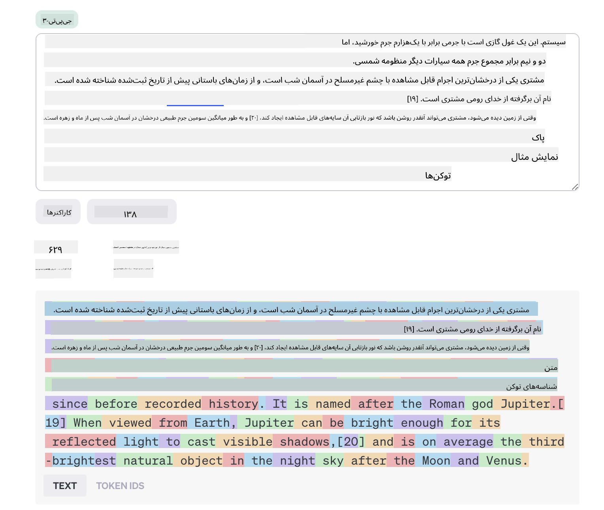

<!--
CO_OP_TRANSLATOR_METADATA:
{
  "original_hash": "a45c318dc6ebc2604f35b8b829f93af2",
  "translation_date": "2025-07-09T09:24:17+00:00",
  "source_file": "04-prompt-engineering-fundamentals/README.md",
  "language_code": "fa"
}
-->
# اصول مهندسی پرامپت

[](https://aka.ms/gen-ai-lesson4-gh?WT.mc_id=academic-105485-koreyst)

## مقدمه  
این ماژول مفاهیم و تکنیک‌های اساسی برای ایجاد پرامپت‌های مؤثر در مدل‌های هوش مصنوعی مولد را پوشش می‌دهد. نحوه نوشتن پرامپت برای یک LLM نیز اهمیت دارد. یک پرامپت با دقت طراحی شده می‌تواند کیفیت پاسخ را بهبود بخشد. اما دقیقاً منظور از اصطلاحاتی مانند _پرامپت_ و _مهندسی پرامپت_ چیست؟ و چگونه می‌توانم ورودی پرامپتی که به LLM ارسال می‌کنم را بهتر کنم؟ این‌ها سوالاتی هستند که در این فصل و فصل بعدی سعی می‌کنیم به آن‌ها پاسخ دهیم.

_هوش مصنوعی مولد_ قادر است محتوای جدیدی (مثلاً متن، تصویر، صدا، کد و غیره) در پاسخ به درخواست‌های کاربر ایجاد کند. این کار را با استفاده از _مدل‌های زبان بزرگ_ مانند سری GPT شرکت OpenAI ("Generative Pre-trained Transformer") انجام می‌دهد که برای استفاده از زبان طبیعی و کد آموزش دیده‌اند.

کاربران اکنون می‌توانند با این مدل‌ها با استفاده از الگوهای آشنا مانند چت تعامل داشته باشند، بدون نیاز به تخصص فنی یا آموزش خاص. این مدل‌ها مبتنی بر _پرامپت_ هستند - کاربران یک ورودی متنی (پرامپت) ارسال می‌کنند و پاسخ هوش مصنوعی (تکمیل) را دریافت می‌کنند. سپس می‌توانند به صورت تعاملی و چند مرحله‌ای با هوش مصنوعی "گفتگو" کنند و پرامپت خود را تا زمانی که پاسخ مطابق انتظارشان شود، اصلاح کنند.

"پرامپت‌ها" اکنون به رابط اصلی _برنامه‌نویسی_ برای برنامه‌های هوش مصنوعی مولد تبدیل شده‌اند، که به مدل‌ها می‌گویند چه کاری انجام دهند و کیفیت پاسخ‌های بازگشتی را تحت تأثیر قرار می‌دهند. "مهندسی پرامپت" حوزه‌ای در حال رشد است که بر _طراحی و بهینه‌سازی_ پرامپت‌ها برای ارائه پاسخ‌های با کیفیت و پایدار در مقیاس تمرکز دارد.

## اهداف یادگیری

در این درس، یاد می‌گیریم مهندسی پرامپت چیست، چرا اهمیت دارد و چگونه می‌توانیم پرامپت‌های مؤثرتری برای یک مدل و هدف کاربردی خاص بسازیم. مفاهیم اصلی و بهترین روش‌های مهندسی پرامپت را درک خواهیم کرد و با محیط تعاملی Jupyter Notebooks آشنا می‌شویم که در آن می‌توانیم این مفاهیم را در مثال‌های واقعی ببینیم.

در پایان این درس قادر خواهیم بود:

1. توضیح دهیم مهندسی پرامپت چیست و چرا اهمیت دارد.  
2. اجزای یک پرامپت را شرح دهیم و نحوه استفاده از آن‌ها را بیان کنیم.  
3. بهترین روش‌ها و تکنیک‌های مهندسی پرامپت را یاد بگیریم.  
4. تکنیک‌های آموخته شده را در مثال‌های واقعی با استفاده از یک نقطه انتهایی OpenAI به کار ببریم.

## اصطلاحات کلیدی

مهندسی پرامپت: فرایند طراحی و اصلاح ورودی‌ها برای هدایت مدل‌های هوش مصنوعی به سمت تولید خروجی‌های مطلوب.  
توکنیزاسیون: فرایند تبدیل متن به واحدهای کوچکتر به نام توکن‌ها که مدل می‌تواند آن‌ها را درک و پردازش کند.  
LLMهای تنظیم‌شده با دستورالعمل: مدل‌های زبان بزرگ (LLM) که با دستورالعمل‌های خاص برای بهبود دقت و مرتبط بودن پاسخ‌ها بهینه‌سازی شده‌اند.

## محیط تمرینی

مهندسی پرامپت در حال حاضر بیشتر یک هنر است تا علم. بهترین راه برای بهبود درک ما از آن، _تمرین بیشتر_ و اتخاذ رویکرد آزمون و خطا است که تخصص حوزه کاربرد را با تکنیک‌های پیشنهادی و بهینه‌سازی‌های خاص مدل ترکیب می‌کند.

دفترچه Jupyter همراه این درس یک محیط _تمرینی_ فراهم می‌کند که می‌توانید آنچه یاد می‌گیرید را در آن امتحان کنید - همزمان یا به عنوان بخشی از چالش کد در پایان درس. برای اجرای تمرین‌ها به موارد زیر نیاز دارید:

1. **کلید API Azure OpenAI** - نقطه انتهایی سرویس برای یک LLM مستقر شده.  
2. **محیط اجرای پایتون** - که دفترچه بتواند در آن اجرا شود.  
3. **متغیرهای محیطی محلی** - _هم‌اکنون مراحل [SETUP](./../00-course-setup/SETUP.md?WT.mc_id=academic-105485-koreyst) را کامل کنید تا آماده شوید_.

دفترچه با تمرین‌های _آغازین_ ارائه می‌شود - اما تشویق می‌شوید که بخش‌های _Markdown_ (توضیح) و _کد_ (درخواست‌های پرامپت) خود را اضافه کنید تا مثال‌ها یا ایده‌های بیشتری را امتحان کنید و درک خود را از طراحی پرامپت تقویت کنید.

## راهنمای مصور

می‌خواهید قبل از شروع، تصویر کلی آنچه این درس پوشش می‌دهد را ببینید؟ این راهنمای مصور را بررسی کنید که موضوعات اصلی و نکات کلیدی هر بخش را به شما نشان می‌دهد تا درباره آن‌ها فکر کنید. نقشه راه درس شما را از درک مفاهیم و چالش‌های اصلی تا پرداختن به آن‌ها با تکنیک‌ها و بهترین روش‌های مهندسی پرامپت هدایت می‌کند. توجه داشته باشید که بخش "تکنیک‌های پیشرفته" در این راهنما به محتوای فصل _بعدی_ این دوره اشاره دارد.


## استارتاپ ما

حالا بیایید درباره ارتباط _این موضوع_ با ماموریت استارتاپ خود برای [آوردن نوآوری هوش مصنوعی به آموزش](https://educationblog.microsoft.com/2023/06/collaborating-to-bring-ai-innovation-to-education?WT.mc_id=academic-105485-koreyst) صحبت کنیم. ما می‌خواهیم برنامه‌های هوش مصنوعی مبتنی بر _یادگیری شخصی‌سازی شده_ بسازیم - پس بیایید فکر کنیم کاربران مختلف برنامه ما چگونه ممکن است پرامپت‌ها را "طراحی" کنند:

- **مدیران** ممکن است از هوش مصنوعی بخواهند _داده‌های برنامه درسی را تحلیل کند تا شکاف‌های پوشش را شناسایی کند_. هوش مصنوعی می‌تواند نتایج را خلاصه کند یا با کد آن‌ها را به صورت تصویری نمایش دهد.  
- **معلمان** ممکن است از هوش مصنوعی بخواهند _طرح درس برای یک مخاطب و موضوع خاص تولید کند_. هوش مصنوعی می‌تواند طرح شخصی‌سازی شده را در قالب مشخصی بسازد.  
- **دانش‌آموزان** ممکن است از هوش مصنوعی بخواهند _در یک موضوع دشوار به آن‌ها آموزش دهد_. هوش مصنوعی اکنون می‌تواند با درس‌ها، نکات و مثال‌های متناسب با سطح آن‌ها راهنمایی کند.

این فقط نوک کوه یخ است. کتابخانه [Prompts For Education](https://github.com/microsoft/prompts-for-edu/tree/main?WT.mc_id=academic-105485-koreyst) را بررسی کنید - یک مجموعه متن‌باز از پرامپت‌ها که توسط کارشناسان آموزش گردآوری شده است - تا دید گسترده‌تری از امکانات به دست آورید! _سعی کنید برخی از این پرامپت‌ها را در محیط تمرینی یا OpenAI Playground اجرا کنید و ببینید چه اتفاقی می‌افتد!_

<!--  
الگوی درس:  
این واحد باید مفهوم اصلی #1 را پوشش دهد.  
مفهوم را با مثال‌ها و منابع تقویت کنید.  

مفهوم #1:  
مهندسی پرامپت.  
آن را تعریف کنید و توضیح دهید چرا لازم است.  
-->

## مهندسی پرامپت چیست؟

ما این درس را با تعریف **مهندسی پرامپت** به عنوان فرایند _طراحی و بهینه‌سازی_ ورودی‌های متنی (پرامپت‌ها) برای ارائه پاسخ‌های پایدار و با کیفیت (تکمیل‌ها) برای یک هدف کاربردی و مدل خاص شروع کردیم. می‌توانیم این را به عنوان یک فرایند دو مرحله‌ای در نظر بگیریم:

- _طراحی_ پرامپت اولیه برای یک مدل و هدف مشخص  
- _اصلاح_ پرامپت به صورت تکراری برای بهبود کیفیت پاسخ

این فرایند لزوماً آزمون و خطا است که نیاز به شهود و تلاش کاربر برای رسیدن به نتایج بهینه دارد. پس چرا این مهم است؟ برای پاسخ به این سوال، ابتدا باید سه مفهوم را درک کنیم:

- _توکنیزاسیون_ = نحوه "دیدن" پرامپت توسط مدل  
- _مدل‌های پایه LLM_ = نحوه "پردازش" پرامپت توسط مدل پایه  
- _LLMهای تنظیم‌شده با دستورالعمل_ = نحوه "دیدن وظایف" توسط مدل

### توکنیزاسیون

یک LLM پرامپت‌ها را به صورت _دنباله‌ای از توکن‌ها_ می‌بیند که مدل‌های مختلف (یا نسخه‌های مختلف یک مدل) می‌توانند یک پرامپت را به روش‌های متفاوتی توکنیزه کنند. از آنجا که LLMها بر اساس توکن‌ها (و نه متن خام) آموزش دیده‌اند، نحوه توکنیزه شدن پرامپت‌ها تأثیر مستقیمی بر کیفیت پاسخ تولید شده دارد.

برای درک بهتر نحوه کار توکنیزاسیون، ابزارهایی مانند [OpenAI Tokenizer](https://platform.openai.com/tokenizer?WT.mc_id=academic-105485-koreyst) را امتحان کنید. پرامپت خود را کپی کنید و ببینید چگونه به توکن‌ها تبدیل می‌شود، به نحوه برخورد با فاصله‌ها و علائم نگارشی توجه کنید. توجه داشته باشید که این مثال مربوط به یک LLM قدیمی‌تر (GPT-3) است - بنابراین امتحان آن با مدل جدیدتر ممکن است نتیجه متفاوتی بدهد.



### مفهوم: مدل‌های پایه

پس از توکنیزه شدن پرامپت، عملکرد اصلی ["مدل پایه LLM"](https://blog.gopenai.com/an-introduction-to-base-and-instruction-tuned-large-language-models-8de102c785a6?WT.mc_id=academic-105485-koreyst) (یا مدل بنیادین) پیش‌بینی توکن بعدی در آن دنباله است. از آنجا که LLMها روی مجموعه داده‌های متنی عظیم آموزش دیده‌اند، درک خوبی از روابط آماری بین توکن‌ها دارند و می‌توانند این پیش‌بینی را با اطمینان نسبی انجام دهند. توجه داشته باشید که آن‌ها _معنای_ کلمات در پرامپت یا توکن را نمی‌فهمند؛ فقط الگویی را می‌بینند که می‌توانند با پیش‌بینی بعدی خود آن را "تکمیل" کنند. آن‌ها می‌توانند پیش‌بینی دنباله را تا زمانی که کاربر متوقف کند یا شرط از پیش تعیین شده‌ای برقرار شود، ادامه دهند.

می‌خواهید ببینید تکمیل مبتنی بر پرامپت چگونه کار می‌کند؟ پرامپت بالا را در Azure OpenAI Studio [_Chat Playground_](https://oai.azure.com/playground?WT.mc_id=academic-105485-koreyst) با تنظیمات پیش‌فرض وارد کنید. سیستم به گونه‌ای پیکربندی شده که پرامپت‌ها را به عنوان درخواست اطلاعات در نظر بگیرد - بنابراین باید پاسخی ببینید که این زمینه را برآورده می‌کند.

اما اگر کاربر بخواهد چیزی خاص ببیند که معیار یا هدف وظیفه‌ای را برآورده کند چه؟ اینجاست که LLMهای _تنظیم‌شده با دستورالعمل_ وارد می‌شوند.


### مفهوم: LLMهای تنظیم‌شده با دستورالعمل

یک [LLM تنظیم‌شده با دستورالعمل](https://blog.gopenai.com/an-introduction-to-base-and-instruction-tuned-large-language-models-8de102c785a6?WT.mc_id=academic-105485-koreyst) با شروع از مدل پایه، با مثال‌ها یا جفت‌های ورودی/خروجی (مثلاً "پیام‌های" چند مرحله‌ای) که شامل دستورالعمل‌های واضح هستند، بهینه‌سازی می‌شود - و پاسخ هوش مصنوعی تلاش می‌کند آن دستورالعمل را دنبال کند.

این از تکنیک‌هایی مانند یادگیری تقویتی با بازخورد انسانی (RLHF) استفاده می‌کند که می‌تواند مدل را آموزش دهد تا _دستورالعمل‌ها را دنبال کند_ و _از بازخورد بیاموزد_ تا پاسخ‌هایی تولید کند که بهتر با کاربردهای عملی سازگار و مرتبط با اهداف کاربر باشند.

بیایید امتحان کنیم - پرامپت بالا را دوباره ببینید، اما اکنون پیام _سیستم_ را تغییر دهید تا دستورالعمل زیر را به عنوان زمینه ارائه دهد:

> _محتوایی که به شما داده می‌شود را برای یک دانش‌آموز کلاس دوم خلاصه کنید. نتیجه را در یک پاراگراف با ۳ تا ۵ نکته گلوله‌ای نگه دارید._

می‌بینید که نتیجه اکنون برای بازتاب هدف و قالب مورد نظر تنظیم شده است؟ یک معلم می‌تواند این پاسخ را مستقیماً در اسلایدهای کلاس خود استفاده کند.


## چرا به مهندسی پرامپت نیاز داریم؟

حالا که می‌دانیم پرامپت‌ها چگونه توسط LLMها پردازش می‌شوند، بیایید درباره _چرا_ به مهندسی پرامپت نیاز داریم صحبت کنیم. پاسخ در این واقعیت نهفته است که LLMهای فعلی چالش‌هایی دارند که دستیابی به _تکمیل‌های قابل اعتماد و پایدار_ را بدون صرف تلاش در ساختاردهی و بهینه‌سازی پرامپت دشوار می‌کند. برای مثال:

1. **پاسخ‌های مدل تصادفی هستند.** _همان پرامپت_ احتمالاً پاسخ‌های متفاوتی با مدل‌ها یا نسخه‌های مختلف مدل تولید می‌کند. و حتی ممکن است در زمان‌های مختلف با _همان مدل_ نتایج متفاوتی بدهد. _تکنیک‌های مهندسی پرامپت می‌توانند به ما کمک کنند این تغییرات را با ارائه چارچوب‌های بهتر به حداقل برسانیم_.

1. **مدل‌ها ممکن است پاسخ‌های ساختگی تولید کنند.** مدل‌ها با مجموعه داده‌های _بزرگ اما محدود_ آموزش دیده‌اند، به این معنی که دانش آن‌ها درباره مفاهیمی خارج از دامنه آموزش محدود است. در نتیجه، ممکن است تکمیل‌هایی تولید کنند که نادرست، خیالی یا مستقیماً متناقض با حقایق شناخته شده باشند. _تکنیک‌های مهندسی پرامپت به کاربران کمک می‌کند چنین ساختگی‌هایی را شناسایی و کاهش دهند، مثلاً با درخواست استناد یا استدلال از هوش مصنوعی_.

1. **قابلیت‌های مدل‌ها متفاوت خواهد بود.** مدل‌ها یا نسل‌های جدیدتر مدل‌ها قابلیت‌های غنی‌تری دارند اما همچنین ویژگی‌ها و محدودیت‌های خاص خود را در هزینه و پیچیدگی به همراه می‌آورند. _مهندسی پرامپت می‌تواند به ما کمک کند بهترین روش‌ها و جریان‌های کاری را توسعه دهیم که تفاوت‌ها را انتزاعی کرده و به نیازهای خاص مدل به صورت مقیاس‌پذیر و بدون درز سازگار شوند_.

بیایید این را در عمل در OpenAI یا Azure OpenAI Playground ببینیم:

- از همان پرامپت با استقرارهای مختلف LLM (مثلاً OpenAI، Azure OpenAI، Hugging Face) استفاده کنید - آیا تفاوت‌ها را دیدید؟  
- از همان پرامپت به طور مکرر با _همان_ استقرار LLM (مثلاً Azure OpenAI playground) استفاده کنید - این تفاوت‌ها چگونه بودند؟

### مثال ساختگی

در این دوره، ما از اصطلاح **"ساختگی"** برای اشاره به پدیده‌ای استفاده می‌کنیم که در آن LLMها گاهی اطلاعات نادرست تولید می‌کنند به دلیل محدودیت‌های آموزش یا سایر محدودیت‌ها. ممکن است این پدیده را در مقالات یا پژوهش‌های عمومی به عنوان _"توهم"_ شنیده باشید. با این حال، ما قویاً توصیه می‌کنیم از اصطلاح _"ساختگی"_ استفاده کنید تا به طور ناخواسته رفتار را انسان‌وار نکنیم و ویژگی انسانی به نتیجه‌ای که توسط ماشین تولید شده نسبت ندهیم. این همچنین از منظر اصطلاح‌شناسی، [راهنمایی‌های هوش مصنوعی مسئول](https://www.microsoft.com/ai/responsible-ai?WT.mc_id=academic-105485-koreyst) را تقویت می‌کند و اصطلاحاتی را حذف می‌کند که ممکن است در برخی زمینه‌ها توهین‌آمیز یا غیرشامل تلقی شوند.

می‌خواهید بفهمید ساختگی‌ها چگونه کار می‌کنند؟ به پرامپتی فکر کنید که از هوش مصنوعی می‌خواهد محتوایی برای موضوعی غیرواقعی تولید کند (تا مطمئن شوید در مجموعه داده آموزش وجود ندارد). برای مثال - من این پرامپت را امتحان کردم:
# برنامه درس: جنگ مریخی ۲۰۷۶

## مقدمه
در این درس، به بررسی جنگ مریخی که در سال ۲۰۷۶ رخ داد، می‌پردازیم. هدف این است که دانش‌آموزان با دلایل، رویدادها و پیامدهای این جنگ آشنا شوند و تأثیرات آن بر تاریخ بشر را درک کنند.

## اهداف یادگیری
- شناخت علل اصلی جنگ مریخی ۲۰۷۶  
- بررسی مراحل و رویدادهای کلیدی جنگ  
- تحلیل پیامدهای سیاسی، اجتماعی و فناوری جنگ  
- تشویق به تفکر انتقادی درباره پیامدهای جنگ‌های فضایی  

## مواد و منابع
- نقشه‌های جنگ مریخی  
- تصاویر و فیلم‌های مستند مربوط به جنگ  
- مقالات و گزارش‌های تاریخی  
- اسلایدهای آموزشی  

## مراحل درس

### ۱. معرفی جنگ مریخی
- توضیح زمینه‌های تاریخی و سیاسی قبل از جنگ  
- معرفی طرف‌های درگیر و اهداف هر کدام  

### ۲. بررسی رویدادهای کلیدی
- شرح نبردهای مهم و استراتژی‌های به کار رفته  
- تحلیل نقش فناوری‌های نوین در جنگ  

### ۳. پیامدهای جنگ
- تأثیرات سیاسی و تغییرات در روابط بین سیاره‌ای  
- پیامدهای اجتماعی و فرهنگی برای انسان‌ها  
- پیشرفت‌های فناوری ناشی از جنگ  

### ۴. بحث و نتیجه‌گیری
- پرسش و پاسخ درباره درس  
- تشویق دانش‌آموزان به بیان نظرات و تحلیل‌های خود  
- جمع‌بندی نکات مهم درس  

## فعالیت‌های تکمیلی
- نوشتن مقاله کوتاه درباره یکی از نبردهای جنگ مریخی  
- ساخت یک مدل سه‌بعدی از یکی از تجهیزات جنگی  
- ارائه گروهی درباره تأثیرات جنگ بر آینده بشر  

## ارزیابی
- آزمون کتبی شامل سوالات چندگزینه‌ای و تشریحی  
- ارزیابی فعالیت‌های عملی و مشارکت در بحث‌ها  

## منابع بیشتر
- کتاب‌های مرجع درباره تاریخ فضایی  
- مستندهای علمی و تاریخی  
- مقالات پژوهشی در زمینه جنگ‌های فضایی و فناوری‌های مرتبط
یک جستجوی وب به من نشان داد که حساب‌های داستانی (مثلاً سریال‌های تلویزیونی یا کتاب‌ها) درباره جنگ‌های مریخی وجود دارد - اما هیچ‌کدام مربوط به سال ۲۰۷۶ نیستند. عقل سلیم هم به ما می‌گوید که ۲۰۷۶ _در آینده_ است و بنابراین نمی‌تواند به یک رویداد واقعی مرتبط باشد.

پس وقتی این پرامپت را با ارائه‌دهندگان مختلف LLM اجرا می‌کنیم، چه اتفاقی می‌افتد؟

> **پاسخ ۱**: OpenAI Playground (GPT-35)


> **پاسخ ۲**: Azure OpenAI Playground (GPT-35)


> **پاسخ ۳**: : Hugging Face Chat Playground (LLama-2)


همان‌طور که انتظار می‌رفت، هر مدل (یا نسخه مدل) پاسخ‌های کمی متفاوتی تولید می‌کند که ناشی از رفتار تصادفی و تفاوت‌های قابلیت مدل است. برای مثال، یک مدل مخاطب کلاس هشتم را هدف قرار می‌دهد در حالی که مدل دیگر فرض می‌کند کاربر دانش‌آموز دبیرستان است. اما هر سه مدل پاسخ‌هایی تولید کردند که می‌توانست یک کاربر ناآگاه را قانع کند که این رویداد واقعی بوده است.

تکنیک‌های مهندسی پرامپت مانند _متاپرامپتینگ_ و _تنظیم دما_ ممکن است تا حدی از ساختگی بودن مدل بکاهند. معماری‌های جدید مهندسی پرامپت همچنین ابزارها و تکنیک‌های جدید را به‌طور یکپارچه در جریان پرامپت وارد می‌کنند تا برخی از این اثرات را کاهش دهند.

## مطالعه موردی: GitHub Copilot

بیایید این بخش را با نگاهی به نحوه استفاده از مهندسی پرامپت در راه‌حل‌های دنیای واقعی با یک مطالعه موردی به پایان برسانیم: [GitHub Copilot](https://github.com/features/copilot?WT.mc_id=academic-105485-koreyst).

GitHub Copilot «برنامه‌نویس جفت هوش مصنوعی» شماست - که پرامپت‌های متنی را به تکمیل کد تبدیل می‌کند و در محیط توسعه شما (مثلاً Visual Studio Code) ادغام شده تا تجربه کاربری روانی فراهم کند. همان‌طور که در سری وبلاگ‌های زیر مستند شده، نسخه اولیه بر اساس مدل OpenAI Codex بود - و مهندسان به سرعت نیاز به تنظیم دقیق مدل و توسعه تکنیک‌های بهتر مهندسی پرامپت برای بهبود کیفیت کد را درک کردند. در ماه ژوئیه، آن‌ها [یک مدل هوش مصنوعی بهبود یافته که فراتر از Codex است را معرفی کردند](https://github.blog/2023-07-28-smarter-more-efficient-coding-github-copilot-goes-beyond-codex-with-improved-ai-model/?WT.mc_id=academic-105485-koreyst) تا پیشنهادات سریع‌تری ارائه دهند.

مطالب را به ترتیب بخوانید تا مسیر یادگیری آن‌ها را دنبال کنید.

- **مه ۲۰۲۳** | [GitHub Copilot در درک کد شما بهتر می‌شود](https://github.blog/2023-05-17-how-github-copilot-is-getting-better-at-understanding-your-code/?WT.mc_id=academic-105485-koreyst)
- **مه ۲۰۲۳** | [درون GitHub: کار با LLMهای پشت GitHub Copilot](https://github.blog/2023-05-17-inside-github-working-with-the-llms-behind-github-copilot/?WT.mc_id=academic-105485-koreyst)
- **ژوئن ۲۰۲۳** | [چگونه پرامپت‌های بهتری برای GitHub Copilot بنویسیم](https://github.blog/2023-06-20-how-to-write-better-prompts-for-github-copilot/?WT.mc_id=academic-105485-koreyst)
- **ژوئیه ۲۰۲۳** | [.. GitHub Copilot فراتر از Codex با مدل هوش مصنوعی بهبود یافته می‌رود](https://github.blog/2023-07-28-smarter-more-efficient-coding-github-copilot-goes-beyond-codex-with-improved-ai-model/?WT.mc_id=academic-105485-koreyst)
- **ژوئیه ۲۰۲۳** | [راهنمای توسعه‌دهنده برای مهندسی پرامپت و LLMها](https://github.blog/2023-07-17-prompt-engineering-guide-generative-ai-llms/?WT.mc_id=academic-105485-koreyst)
- **سپتامبر ۲۰۲۳** | [چگونه یک اپلیکیشن LLM سازمانی بسازیم: درس‌هایی از GitHub Copilot](https://github.blog/2023-09-06-how-to-build-an-enterprise-llm-application-lessons-from-github-copilot/?WT.mc_id=academic-105485-koreyst)

همچنین می‌توانید وبلاگ [مهندسی آن‌ها](https://github.blog/category/engineering/?WT.mc_id=academic-105485-koreyst) را برای پست‌های بیشتری مانند [این](https://github.blog/2023-09-27-how-i-used-github-copilot-chat-to-build-a-reactjs-gallery-prototype/?WT.mc_id=academic-105485-koreyst) مرور کنید که نشان می‌دهد چگونه این مدل‌ها و تکنیک‌ها برای پیشبرد برنامه‌های دنیای واقعی _به‌کار گرفته شده‌اند_.

---

<!--
الگوی درس:
این واحد باید مفهوم اصلی شماره ۲ را پوشش دهد.
مفهوم را با مثال‌ها و منابع تقویت کنید.

مفهوم شماره ۲:
طراحی پرامپت.
با مثال‌هایی توضیح داده شده است.
-->

## ساختار پرامپت

دیدیم چرا مهندسی پرامپت مهم است - حالا بیایید بفهمیم پرامپت‌ها چگونه _ساخته می‌شوند_ تا بتوانیم تکنیک‌های مختلف را برای طراحی مؤثرتر پرامپت ارزیابی کنیم.

### پرامپت ساده

با پرامپت ساده شروع کنیم: ورودی متنی که بدون هیچ زمینه دیگری به مدل ارسال می‌شود. اینجا یک مثال است - وقتی چند کلمه اول سرود ملی آمریکا را به OpenAI [Completion API](https://platform.openai.com/docs/api-reference/completions?WT.mc_id=academic-105485-koreyst) می‌فرستیم، بلافاصله پاسخ را با چند خط بعدی _تکمیل_ می‌کند که رفتار پیش‌بینی پایه را نشان می‌دهد.

| پرامپت (ورودی)     | تکمیل (خروجی)                                                                                                                        |
| :----------------- | :----------------------------------------------------------------------------------------------------------------------------------- |
| Oh say can you see | به نظر می‌رسد که شما در حال شروع خواندن متن سرود ملی «The Star-Spangled Banner» هستید، سرود ملی ایالات متحده. متن کامل این سرود ... |

### پرامپت پیچیده

حالا بیایید به آن پرامپت ساده، زمینه و دستورالعمل اضافه کنیم. [Chat Completion API](https://learn.microsoft.com/azure/ai-services/openai/how-to/chatgpt?WT.mc_id=academic-105485-koreyst) به ما اجازه می‌دهد پرامپت پیچیده‌ای به صورت مجموعه‌ای از _پیام‌ها_ بسازیم که شامل:

- جفت‌های ورودی/خروجی که ورودی _کاربر_ و پاسخ _دستیار_ را نشان می‌دهند.
- پیام سیستم که زمینه رفتار یا شخصیت دستیار را تعیین می‌کند.

درخواست اکنون به شکل زیر است، جایی که _توکنیزاسیون_ به طور مؤثر اطلاعات مرتبط از زمینه و گفتگو را استخراج می‌کند. تغییر زمینه سیستم می‌تواند به اندازه ورودی‌های کاربر در کیفیت تکمیل‌ها تأثیرگذار باشد.

```python
response = openai.chat.completions.create(
    model="gpt-3.5-turbo",
    messages=[
        {"role": "system", "content": "You are a helpful assistant."},
        {"role": "user", "content": "Who won the world series in 2020?"},
        {"role": "assistant", "content": "The Los Angeles Dodgers won the World Series in 2020."},
        {"role": "user", "content": "Where was it played?"}
    ]
)
```

### پرامپت دستوری

در مثال‌های بالا، پرامپت کاربر یک پرسش متنی ساده بود که می‌توانست به عنوان درخواست اطلاعات تفسیر شود. با پرامپت‌های _دستوری_، می‌توانیم از آن متن برای مشخص کردن دقیق‌تر یک کار استفاده کنیم و راهنمایی بهتری به هوش مصنوعی بدهیم. اینجا یک مثال است:

| پرامپت (ورودی)                                                                                                                                                                                                                         | تکمیل (خروجی)                                                                                                        | نوع دستورالعمل    |
| :------------------------------------------------------------------------------------------------------------------------------------------------------------------------------------------------------------------------------------- | :------------------------------------------------------------------------------------------------------------------- | :----------------- |
| Write a description of the Civil War                                                                                                                                                                                                   | _یک پاراگراف ساده بازگرداند_                                                                                        | ساده               |
| Write a description of the Civil War. Provide key dates and events and describe their significance                                                                                                                                     | _یک پاراگراف به همراه فهرستی از تاریخ‌های مهم رویدادها با توضیحات بازگرداند_                                        | پیچیده             |
| Write a description of the Civil War in 1 paragraph. Provide 3 bullet points with key dates and their significance. Provide 3 more bullet points with key historical figures and their contributions. Return the output as a JSON file | _جزئیات بیشتری را در یک کادر متنی به صورت JSON بازمی‌گرداند که می‌توانید آن را کپی و در صورت نیاز اعتبارسنجی کنید_ | پیچیده. قالب‌بندی شده. |

## محتوای اصلی

در مثال‌های بالا، پرامپت هنوز نسبتاً باز بود و به LLM اجازه می‌داد خودش تصمیم بگیرد کدام بخش از داده‌های پیش‌آموزش دیده‌اش مرتبط است. با الگوی طراحی _محتوای اصلی_، متن ورودی به دو بخش تقسیم می‌شود:

- یک دستورالعمل (عمل)
- محتوای مرتبط (که بر عمل تأثیر می‌گذارد)

در اینجا مثالی است که دستورالعمل آن «خلاصه کردن این در ۲ جمله» است.

| پرامپت (ورودی)                                                                                                                                                                                                                                                                                                                                                                                                                                                                                                                                                                                                                                                                                      | تکمیل (خروجی)                                                                                                                                                                                                                                                                             |
| :-------------------------------------------------------------------------------------------------------------------------------------------------------------------------------------------------------------------------------------------------------------------------------------------------------------------------------------------------------------------------------------------------------------------------------------------------------------------------------------------------------------------------------------------------------------------------------------------------------------------------------------------------------------------------------------------------- | :---------------------------------------------------------------------------------------------------------------------------------------------------------------------------------------------------------------------------------------------------------------------------------------------- |
| Jupiter is the fifth planet from the Sun and the largest in the Solar System. It is a gas giant with a mass one-thousandth that of the Sun, but two-and-a-half times that of all the other planets in the Solar System combined. Jupiter is one of the brightest objects visible to the naked eye in the night sky, and has been known to ancient civilizations since before recorded history. It is named after the Roman god Jupiter.[19] When viewed from Earth, Jupiter can be bright enough for its reflected light to cast visible shadows,[20] and is on average the third-brightest natural object in the night sky after the Moon and Venus. <br/> **Summarize this in 2 short sentences** | مشتری، پنجمین سیاره از خورشید، بزرگ‌ترین سیاره در منظومه شمسی است و به عنوان یکی از درخشان‌ترین اجرام قابل مشاهده در آسمان شب شناخته می‌شود. این سیاره که به نام خدای رومی مشتری نام‌گذاری شده، یک غول گازی است که جرم آن دو و نیم برابر مجموع جرم سایر سیارات منظومه شمسی است. |

بخش محتوای اصلی را می‌توان به روش‌های مختلفی برای هدایت دستورالعمل‌های مؤثرتر به کار برد:

- **مثال‌ها** - به جای اینکه به مدل بگوییم دقیقاً چه کاری انجام دهد، چند نمونه از خروجی مورد نظر را به آن بدهیم و اجازه دهیم الگو را استنباط کند.
- **اشارات** - دستورالعمل را با یک «اشاره» دنبال کنیم که تکمیل را آماده می‌کند و مدل را به سمت پاسخ‌های مرتبط‌تر هدایت می‌کند.
- **قالب‌ها** - این‌ها «دستورالعمل‌های» تکرارپذیر برای پرامپت‌ها هستند که شامل جایگزین‌هایی (متغیرها) می‌شوند و می‌توان آن‌ها را با داده‌های خاص برای موارد استفاده مختلف سفارشی کرد.

بیایید این موارد را در عمل بررسی کنیم.

### استفاده از مثال‌ها

این روشی است که در آن از محتوای اصلی برای «تغذیه مدل» با چند نمونه از خروجی مورد نظر برای یک دستورالعمل مشخص استفاده می‌کنیم و اجازه می‌دهیم الگو را استنباط کند. بر اساس تعداد مثال‌های ارائه شده، می‌توانیم پرامپت صفر-شات، یک-شات، چند-شات و غیره داشته باشیم.

پرامپت اکنون از سه بخش تشکیل شده است:

- شرح کار
- چند نمونه از خروجی مورد نظر
- شروع یک نمونه جدید (که به صورت ضمنی شرح کار جدید است)

| نوع یادگیری | پرامپت (ورودی)                                                                                                                                        | تکمیل (خروجی)         |
| :------------ | :---------------------------------------------------------------------------------------------------------------------------------------------------- | :--------------------- |
| صفر-شات     | "The Sun is Shining". Translate to Spanish                                                                                                            | "El Sol está brillando".    |
| یک-شات      | "The Sun is Shining" => ""El Sol está brillando". <br> "It's a Cold and Windy Day" =>                                                                 | "Es un día frío y ventoso". |
| چند-شات      | The player ran the bases => Baseball <br/> The player hit an ace => Tennis <br/> The player hit a six => Cricket <br/> The player made a slam-dunk => | Basketball                  |
|               |                                                                                                                                                       |                             |

توجه کنید که در پرامپت صفر-شات باید دستورالعمل صریح ("Translate to Spanish") داده می‌شد، اما در مثال یک-شات این دستورالعمل به صورت ضمنی استنباط می‌شود. مثال چند-شات نشان می‌دهد که افزودن نمونه‌های بیشتر به مدل‌ها اجازه می‌دهد بدون دستورالعمل اضافی استنباط‌های دقیق‌تری داشته باشند.

### اشارات پرامپت

تکنیک دیگری برای استفاده از محتوای اصلی، ارائه _اشارات_ به جای مثال‌ها است. در این حالت، با شروع یک قطعه که قالب پاسخ مورد نظر را نشان می‌دهد، مدل را به سمت پاسخ مناسب هدایت می‌کنیم. مدل سپس «اشاره» را گرفته و در همان راستا ادامه می‌دهد.

| تعداد اشارات | پرامپت (ورودی)                                                                                                                                                                                                                                                                                                                                                                                                                                               | تکمیل (خروجی)                                                                                                                                                                                                                                                                                       |
| :------------- | :----------------------------------------------------------------------------------------------------------------------------------------------------------------------------------------------------------------------------------------------------------------------------------------------------------------------------------------------------------------------------------------------------------------------------------------------------------- | :-------------------------------------------------------------------------------------------------------------------------------------------------------------------------------------------------------------------------------------------------------------------------------------------------------- |
| ۰              | مشتری، پنجمین سیاره از خورشید و بزرگ‌ترین سیاره در منظومه شمسی است. این یک غول گازی با جرمی برابر یک هزارم جرم خورشید است، اما دو و نیم برابر مجموع جرم سایر سیارات منظومه شمسی است. مشتری یکی از درخشان‌ترین اجرامی است که با چشم غیرمسلح در آسمان شب دیده می‌شود و از زمان‌های بسیار قدیم برای تمدن‌های باستانی شناخته شده است. |

**خلاصه این مطلب**                                       | مشتری بزرگ‌ترین سیاره در منظومه شمسی ما و پنجمین سیاره از خورشید است. این سیاره یک غول گازی است که جرمی برابر با یک هزارم جرم خورشید دارد، اما از مجموع جرم تمام سیارات دیگر سنگین‌تر است. تمدن‌های باستانی مدت‌هاست که مشتری را می‌شناسند و به راحتی در آسمان شب قابل مشاهده است. |
| 1              | مشتری پنجمین سیاره از خورشید و بزرگ‌ترین سیاره در منظومه شمسی است. این سیاره یک غول گازی با جرمی برابر با یک هزارم جرم خورشید است، اما دو و نیم برابر مجموع جرم تمام سیارات دیگر منظومه شمسی است. مشتری یکی از درخشان‌ترین اجرامی است که با چشم غیرمسلح در آسمان شب دیده می‌شود و از زمان‌های بسیار قدیم برای تمدن‌های باستان شناخته شده است. <br/>**خلاصه این مطلب** <br/> آنچه آموختیم این است که مشتری | پنجمین سیاره از خورشید و بزرگ‌ترین سیاره در منظومه شمسی است. این سیاره یک غول گازی با جرمی برابر با یک هزارم جرم خورشید است، اما دو و نیم برابر مجموع جرم تمام سیارات دیگر است. به راحتی با چشم غیرمسلح دیده می‌شود و از دوران باستان شناخته شده است.                        |
| 2              | مشتری پنجمین سیاره از خورشید و بزرگ‌ترین سیاره در منظومه شمسی است. این سیاره یک غول گازی با جرمی برابر با یک هزارم جرم خورشید است، اما دو و نیم برابر مجموع جرم تمام سیارات دیگر منظومه شمسی است. مشتری یکی از درخشان‌ترین اجرامی است که با چشم غیرمسلح در آسمان شب دیده می‌شود و از زمان‌های بسیار قدیم برای تمدن‌های باستان شناخته شده است. <br/>**خلاصه این مطلب** <br/> سه حقیقت برتر که آموختیم:         | 1. مشتری پنجمین سیاره از خورشید و بزرگ‌ترین سیاره در منظومه شمسی است. <br/> 2. این سیاره یک غول گازی با جرمی برابر با یک هزارم جرم خورشید است...<br/> 3. مشتری از دوران باستان با چشم غیرمسلح قابل مشاهده بوده است ...                                                                       |
|                |                                                                                                                                                                                                                                                                                                                                                                                                                                                              |                                                                                                                                                                                                                                                                                                           |

### قالب‌های پرامپت

قالب پرامپت یک _دستورالعمل از پیش تعریف شده برای پرامپت_ است که می‌توان آن را ذخیره و در صورت نیاز مجدداً استفاده کرد تا تجربه‌های کاربری سازگارتر و مقیاس‌پذیرتری ایجاد شود. در ساده‌ترین شکل، این قالب صرفاً مجموعه‌ای از نمونه‌های پرامپت مانند [این نمونه از OpenAI](https://platform.openai.com/examples?WT.mc_id=academic-105485-koreyst) است که هم اجزای تعاملی پرامپت (پیام‌های کاربر و سیستم) و هم فرمت درخواست مبتنی بر API را ارائه می‌دهد - تا امکان استفاده مجدد فراهم شود.

در شکل پیچیده‌تر مانند [این مثال از LangChain](https://python.langchain.com/docs/concepts/prompt_templates/?WT.mc_id=academic-105485-koreyst) شامل _جایگزین‌هایی_ است که می‌توان آن‌ها را با داده‌هایی از منابع مختلف (ورودی کاربر، زمینه سیستم، منابع داده خارجی و غیره) جایگزین کرد تا پرامپت به صورت پویا ساخته شود. این امکان را به ما می‌دهد که کتابخانه‌ای از پرامپت‌های قابل استفاده مجدد ایجاد کنیم که بتوانند به صورت **برنامه‌ریزی شده** تجربه‌های کاربری سازگار را در مقیاس بزرگ هدایت کنند.

در نهایت، ارزش واقعی قالب‌ها در توانایی ایجاد و انتشار _کتابخانه‌های پرامپت_ برای حوزه‌های کاربردی خاص است - جایی که قالب پرامپت اکنون _بهینه‌سازی شده_ تا زمینه یا مثال‌های خاص برنامه را منعکس کند و پاسخ‌ها را برای مخاطب هدف مرتبط‌تر و دقیق‌تر سازد. مخزن [Prompts For Edu](https://github.com/microsoft/prompts-for-edu?WT.mc_id=academic-105485-koreyst) نمونه‌ای عالی از این رویکرد است که کتابخانه‌ای از پرامپت‌ها برای حوزه آموزش با تأکید بر اهداف کلیدی مانند برنامه‌ریزی درس، طراحی برنامه درسی، آموزش دانش‌آموز و غیره را گردآوری کرده است.

## محتوای پشتیبان

اگر ساختار پرامپت را شامل یک دستورالعمل (وظیفه) و یک هدف (محتوای اصلی) بدانیم، آنگاه _محتوای ثانویه_ مانند زمینه اضافی است که برای **تأثیرگذاری بر خروجی به شکلی خاص** ارائه می‌دهیم. این می‌تواند پارامترهای تنظیم، دستورالعمل‌های قالب‌بندی، طبقه‌بندی موضوعات و غیره باشد که به مدل کمک می‌کند پاسخ خود را متناسب با اهداف یا انتظارات کاربر تنظیم کند.

برای مثال: با داشتن یک فهرست دوره با متادیتای گسترده (نام، توضیح، سطح، برچسب‌های متادیتا، مدرس و غیره) برای تمام دوره‌های موجود در برنامه درسی:

- می‌توانیم یک دستورالعمل تعریف کنیم برای "خلاصه کردن فهرست دوره‌های پاییز ۲۰۲۳"
- می‌توانیم از محتوای اصلی برای ارائه چند نمونه از خروجی مورد نظر استفاده کنیم
- می‌توانیم از محتوای ثانویه برای شناسایی ۵ برچسب برتر مورد علاقه استفاده کنیم.

اکنون، مدل می‌تواند خلاصه‌ای در قالب نمونه‌های ارائه شده ارائه دهد - اما اگر نتیجه چندین برچسب داشته باشد، می‌تواند ۵ برچسب شناسایی شده در محتوای ثانویه را اولویت‌بندی کند.

---

<!--
الگوی درس:
این واحد باید مفهوم اصلی شماره ۱ را پوشش دهد.
مفهوم را با مثال‌ها و منابع تقویت کنید.

مفهوم شماره ۳:
تکنیک‌های مهندسی پرامپت.
برخی از تکنیک‌های پایه برای مهندسی پرامپت چیست؟
آن را با چند تمرین نشان دهید.
-->

## بهترین روش‌های پرامپت‌نویسی

حالا که می‌دانیم چگونه پرامپت‌ها می‌توانند _ساخته شوند_، می‌توانیم به طراحی آن‌ها برای بازتاب بهترین روش‌ها فکر کنیم. می‌توانیم این موضوع را در دو بخش در نظر بگیریم - داشتن _ذهنیت_ درست و به‌کارگیری _تکنیک‌های_ مناسب.

### ذهنیت مهندسی پرامپت

مهندسی پرامپت یک فرآیند آزمون و خطاست، پس سه عامل کلی را در ذهن داشته باشید:

1. **درک حوزه اهمیت دارد.** دقت و مرتبط بودن پاسخ تابعی از _حوزه_ ای است که آن برنامه یا کاربر در آن فعالیت می‌کند. از شهود و تخصص حوزه خود برای **شخصی‌سازی تکنیک‌ها** استفاده کنید. برای مثال، شخصیت‌های _خاص حوزه_ را در پرامپت‌های سیستمی تعریف کنید، یا از قالب‌های _خاص حوزه_ در پرامپت‌های کاربر بهره ببرید. محتوای ثانویه‌ای ارائه دهید که زمینه‌های خاص حوزه را منعکس کند، یا از نشانه‌ها و مثال‌های _خاص حوزه_ برای هدایت مدل به الگوهای آشنا استفاده کنید.

2. **درک مدل اهمیت دارد.** می‌دانیم مدل‌ها ذاتاً تصادفی هستند. اما پیاده‌سازی مدل‌ها می‌تواند از نظر داده‌های آموزشی (دانش پیش‌آموزش)، قابلیت‌ها (مثلاً از طریق API یا SDK) و نوع محتوایی که برای آن بهینه شده‌اند (کد، تصویر، متن و غیره) متفاوت باشد. نقاط قوت و محدودیت‌های مدل مورد استفاده خود را بشناسید و از این دانش برای _اولویت‌بندی وظایف_ یا ساخت _قالب‌های سفارشی_ که برای قابلیت‌های مدل بهینه شده‌اند، استفاده کنید.

3. **تکرار و اعتبارسنجی اهمیت دارد.** مدل‌ها به سرعت در حال پیشرفت هستند و تکنیک‌های مهندسی پرامپت نیز همینطور. به عنوان یک کارشناس حوزه، ممکن است زمینه یا معیارهای خاصی برای _برنامه کاربردی خودتان_ داشته باشید که برای جامعه گسترده‌تر صدق نکند. از ابزارها و تکنیک‌های مهندسی پرامپت برای "شروع سریع" ساخت پرامپت استفاده کنید، سپس نتایج را با شهود و تخصص حوزه خود تکرار و اعتبارسنجی کنید. بینش‌های خود را ثبت کنید و یک **پایگاه دانش** (مثلاً کتابخانه‌های پرامپت) ایجاد کنید که دیگران بتوانند به عنوان مبنای جدید برای تکرارهای سریع‌تر در آینده از آن استفاده کنند.

## بهترین روش‌ها

حالا به بهترین روش‌های رایجی که توسط [OpenAI](https://help.openai.com/en/articles/6654000-best-practices-for-prompt-engineering-with-openai-api?WT.mc_id=academic-105485-koreyst) و [Azure OpenAI](https://learn.microsoft.com/azure/ai-services/openai/concepts/prompt-engineering#best-practices?WT.mc_id=academic-105485-koreyst) توصیه شده‌اند، نگاهی بیندازیم.

| چه کاری انجام دهیم               | چرا                                                                                                                                                                                                                                               |
| :------------------------------ | :------------------------------------------------------------------------------------------------------------------------------------------------------------------------------------------------------------------------------------------------ |
| جدیدترین مدل‌ها را ارزیابی کنید | نسل‌های جدید مدل‌ها احتمالاً ویژگی‌ها و کیفیت بهتری دارند - اما ممکن است هزینه‌های بیشتری هم داشته باشند. آن‌ها را از نظر تأثیر ارزیابی کنید و سپس تصمیم به مهاجرت بگیرید.                                                                    |
| دستورالعمل‌ها و زمینه را جدا کنید | بررسی کنید آیا مدل/ارائه‌دهنده شما _مرزگذارهایی_ تعریف کرده است تا دستورالعمل‌ها، محتوای اصلی و ثانویه را واضح‌تر از هم جدا کند. این می‌تواند به مدل‌ها کمک کند وزن‌ها را دقیق‌تر به توکن‌ها اختصاص دهند.                                   |
| مشخص و واضح باشید               | جزئیات بیشتری درباره زمینه، نتیجه، طول، قالب، سبک و غیره ارائه دهید. این کار کیفیت و سازگاری پاسخ‌ها را بهبود می‌بخشد. دستورالعمل‌ها را در قالب‌های قابل استفاده مجدد ثبت کنید.                                                              |
| توصیفی باشید، از مثال استفاده کنید | مدل‌ها ممکن است به رویکرد "نمایش و توضیح" بهتر پاسخ دهند. با رویکرد `zero-shot` شروع کنید که فقط دستورالعمل می‌دهید (بدون مثال) و سپس با `few-shot` بهبود دهید، چند نمونه از خروجی مورد نظر ارائه کنید. از قیاس‌ها استفاده کنید.               |
| از نشانه‌ها برای شروع پاسخ‌ها استفاده کنید | با دادن چند کلمه یا عبارت آغازین که مدل می‌تواند به عنوان نقطه شروع پاسخ استفاده کند، آن را به سمت نتیجه دلخواه سوق دهید.                                                                                                                   |
| تکرار کنید                      | گاهی لازم است به مدل تکرار کنید. دستورالعمل‌ها را قبل و بعد از محتوای اصلی بدهید، از دستورالعمل و نشانه استفاده کنید و غیره. تکرار و اعتبارسنجی کنید تا ببینید چه چیزی بهتر جواب می‌دهد.                                                        |
| ترتیب اهمیت دارد               | ترتیب ارائه اطلاعات به مدل ممکن است بر خروجی تأثیر بگذارد، حتی در نمونه‌های آموزشی، به دلیل سوگیری تازگی. گزینه‌های مختلف را امتحان کنید تا بهترین را بیابید.                                                                                   |
| به مدل یک "خروجی جایگزین" بدهید | به مدل یک پاسخ _پشتیبان_ بدهید که اگر به هر دلیلی نتواند وظیفه را کامل کند، ارائه دهد. این می‌تواند احتمال تولید پاسخ‌های نادرست یا ساختگی را کاهش دهد.                                                                                         |
|                                |                                                                                                                                                                                                                                                   |

مانند هر بهترین روش دیگری، به یاد داشته باشید که _نتایج شما ممکن است بسته به مدل، وظیفه و حوزه متفاوت باشد_. این‌ها را به عنوان نقطه شروع در نظر بگیرید و تکرار کنید تا بهترین روش را برای خود بیابید. فرآیند مهندسی پرامپت خود را به طور مداوم با ورود مدل‌ها و ابزارهای جدید بازبینی کنید، با تمرکز بر مقیاس‌پذیری فرآیند و کیفیت پاسخ.

<!--
الگوی درس:
این واحد باید یک چالش کدنویسی ارائه دهد در صورت امکان

چالش:
لینک به یک دفترچه Jupyter که فقط نظرات کد در دستورالعمل‌ها موجود است (بخش‌های کد خالی هستند).

راه‌حل:
لینک به نسخه‌ای از آن دفترچه که پرامپت‌ها در آن پر شده و اجرا شده، که یک نمونه خروجی را نشان می‌دهد.
-->

## تمرین

تبریک! به پایان درس رسیدید! حالا وقت آن است که برخی از این مفاهیم و تکنیک‌ها را با مثال‌های واقعی امتحان کنید!

برای تمرین، از یک دفترچه Jupyter با تمریناتی استفاده خواهیم کرد که می‌توانید به صورت تعاملی انجام دهید. همچنین می‌توانید دفترچه را با سلول‌های Markdown و کد خودتان گسترش دهید تا ایده‌ها و تکنیک‌ها را به صورت مستقل بررسی کنید.

### برای شروع، مخزن را فورک کنید، سپس

- (توصیه شده) GitHub Codespaces را راه‌اندازی کنید
- (گزینه دیگر) مخزن را روی دستگاه محلی خود کلون کنید و با Docker Desktop استفاده کنید
- (گزینه دیگر) دفترچه را با محیط اجرای مورد علاقه خود باز کنید.

### سپس، متغیرهای محیطی خود را تنظیم کنید

- فایل `.env.copy` در ریشه مخزن را به `.env` کپی کنید و مقادیر `AZURE_OPENAI_API_KEY`، `AZURE_OPENAI_ENDPOINT` و `AZURE_OPENAI_DEPLOYMENT` را پر کنید. سپس به بخش [Learning Sandbox](../../../04-prompt-engineering-fundamentals/04-prompt-engineering-fundamentals) بازگردید تا نحوه انجام آن را بیاموزید.

### سپس، دفترچه Jupyter را باز کنید

- هسته اجرای مناسب را انتخاب کنید. اگر از گزینه‌های ۱ یا ۲ استفاده می‌کنید، به سادگی هسته پیش‌فرض Python 3.10.x ارائه شده توسط کانتینر توسعه را انتخاب کنید.

همه چیز آماده است تا تمرین‌ها را اجرا کنید. توجه داشته باشید که در اینجا پاسخ‌های _درست و غلط_ وجود ندارد - فقط کاوش گزینه‌ها از طریق آزمون و خطا و ساخت شهود برای آنچه برای یک مدل و حوزه کاربردی خاص کار می‌کند.

_به همین دلیل در این درس بخش‌های راه‌حل کد وجود ندارد. در عوض، دفترچه شامل سلول‌های Markdown با عنوان "راه‌حل من:" است که یک نمونه خروجی را برای مرجع نشان می‌دهد._

 <!--
الگوی درس:
بخش را با خلاصه و منابع برای یادگیری خودآموز جمع‌بندی کنید.
-->

## بررسی دانش

کدام یک از پرامپت‌های زیر با رعایت برخی بهترین روش‌های معقول، پرامپت خوبی است؟

1. یک تصویر از ماشین قرمز به من نشان بده
2. یک تصویر از ماشین قرمز با برند ولوو و مدل XC90 که کنار صخره پارک شده و خورشید در حال غروب است به من نشان بده
3. یک تصویر از ماشین قرمز با برند ولوو و مدل XC90 به من نشان بده

پاسخ: ۲، بهترین پرامپت است چون جزئیات "چه چیزی" را ارائه می‌دهد و به مشخصات دقیق می‌پردازد (نه فقط هر ماشینی بلکه یک برند و مدل خاص) و همچنین محیط کلی را توصیف می‌کند. ۳ در رتبه بعدی است چون توصیف زیادی دارد.

## 🚀 چالش

ببینید آیا می‌توانید از تکنیک "نشانه" با پرامپت زیر استفاده کنید: جمله را کامل کن "یک تصویر از ماشین قرمز با برند ولوو و ". پاسخ آن چیست و چگونه آن را بهبود می‌دهید؟

## کار عالی! یادگیری خود را ادامه دهید

می‌خواهید درباره مفاهیم مختلف مهندسی پرامپت بیشتر بدانید؟ به [صفحه یادگیری ادامه‌دار](https://aka.ms/genai-collection?WT.mc_id=academic-105485-koreyst) مراجعه کنید تا منابع عالی دیگری در این زمینه بیابید.

به درس ۵ بروید که در آن به [تکنیک‌های پیشرفته پرامپت‌نویسی](../05-advanced-prompts/README.md?WT.mc_id=academic-105485-koreyst) می‌پردازیم!

**سلب مسئولیت**:  
این سند با استفاده از سرویس ترجمه هوش مصنوعی [Co-op Translator](https://github.com/Azure/co-op-translator) ترجمه شده است. در حالی که ما در تلاش برای دقت هستیم، لطفاً توجه داشته باشید که ترجمه‌های خودکار ممکن است حاوی خطاها یا نواقصی باشند. سند اصلی به زبان بومی خود باید به عنوان منبع معتبر در نظر گرفته شود. برای اطلاعات حیاتی، ترجمه حرفه‌ای انسانی توصیه می‌شود. ما مسئول هیچ گونه سوءتفاهم یا تفسیر نادرستی که از استفاده این ترجمه ناشی شود، نیستیم.