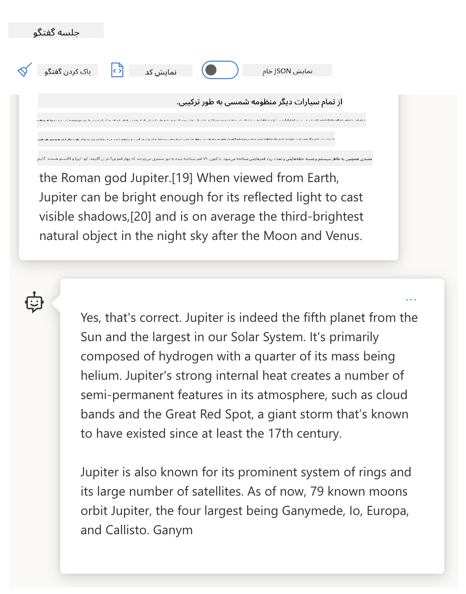
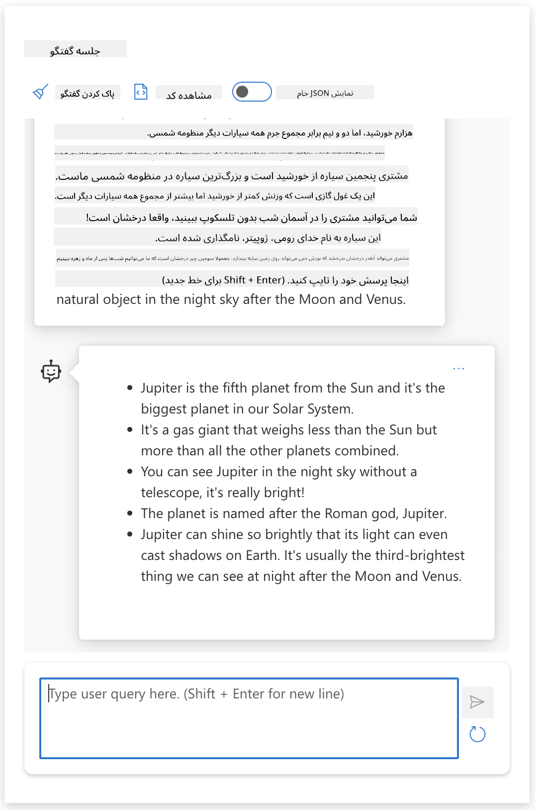
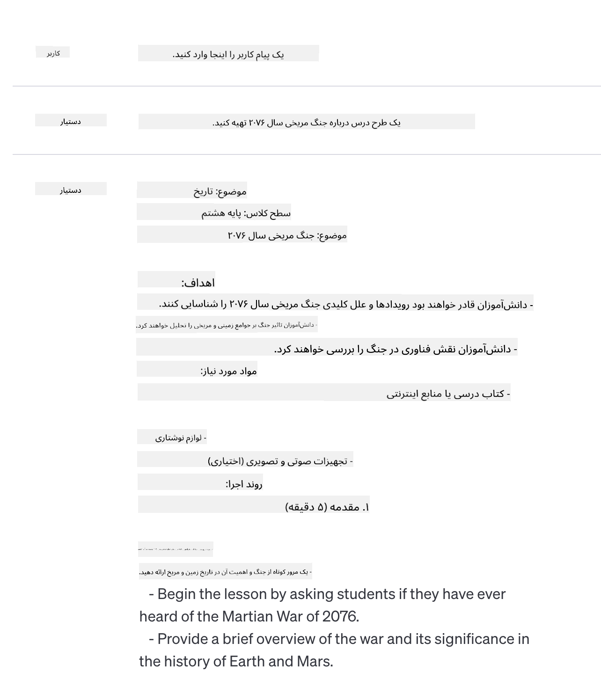

<!--
CO_OP_TRANSLATOR_METADATA:
{
  "original_hash": "8b3cb38518cf4fe7714d2f5e74dfa3eb",
  "translation_date": "2025-10-03T08:21:15+00:00",
  "source_file": "04-prompt-engineering-fundamentals/README.md",
  "language_code": "fa"
}
-->
# اصول مهندسی پرامپت

[](https://aka.ms/gen-ai-lesson4-gh?WT.mc_id=academic-105485-koreyst)

## مقدمه
این ماژول مفاهیم و تکنیک‌های اساسی برای ایجاد پرامپت‌های مؤثر در مدل‌های هوش مصنوعی مولد را پوشش می‌دهد. نحوه نوشتن پرامپت برای یک LLM نیز اهمیت دارد. یک پرامپت با دقت طراحی‌شده می‌تواند کیفیت پاسخ بهتری را به دست آورد. اما دقیقاً اصطلاحاتی مانند _پرامپت_ و _مهندسی پرامپت_ به چه معنا هستند؟ و چگونه می‌توانم ورودی پرامپت را که به LLM ارسال می‌کنم بهبود دهم؟ این‌ها سوالاتی هستند که سعی می‌کنیم در این فصل و فصل بعدی به آن‌ها پاسخ دهیم.

_هوش مصنوعی مولد_ قادر به ایجاد محتوای جدید (مانند متن، تصاویر، صدا، کد و غیره) در پاسخ به درخواست‌های کاربران است. این کار را با استفاده از _مدل‌های زبان بزرگ_ مانند سری GPT ("Generative Pre-trained Transformer") شرکت OpenAI انجام می‌دهد که برای استفاده از زبان طبیعی و کد آموزش دیده‌اند.

اکنون کاربران می‌توانند با این مدل‌ها از طریق پارادایم‌های آشنا مانند چت تعامل داشته باشند، بدون نیاز به تخصص فنی یا آموزش. این مدل‌ها _مبتنی بر پرامپت_ هستند - کاربران یک ورودی متنی (پرامپت) ارسال می‌کنند و پاسخ هوش مصنوعی (تکمیل) را دریافت می‌کنند. سپس می‌توانند به صورت تکراری با هوش مصنوعی "چت کنند"، پرامپت خود را اصلاح کنند تا پاسخ مطابق با انتظاراتشان باشد.

"پرامپت‌ها" اکنون به رابط اصلی _برنامه‌نویسی_ برای برنامه‌های هوش مصنوعی مولد تبدیل شده‌اند، که به مدل‌ها می‌گویند چه کاری انجام دهند و کیفیت پاسخ‌های بازگشتی را تحت تأثیر قرار می‌دهند. "مهندسی پرامپت" یک حوزه مطالعاتی در حال رشد سریع است که بر _طراحی و بهینه‌سازی_ پرامپت‌ها برای ارائه پاسخ‌های با کیفیت و سازگار در مقیاس تمرکز دارد.

## اهداف یادگیری

در این درس، یاد می‌گیریم که مهندسی پرامپت چیست، چرا اهمیت دارد، و چگونه می‌توانیم پرامپت‌های مؤثرتری برای یک مدل و هدف برنامه‌سازی طراحی کنیم. مفاهیم اصلی و بهترین روش‌ها برای مهندسی پرامپت را درک خواهیم کرد - و درباره یک محیط "sandbox" تعاملی در Jupyter Notebooks یاد خواهیم گرفت که در آن می‌توانیم این مفاهیم را در مثال‌های واقعی اعمال کنیم.

تا پایان این درس قادر خواهیم بود:

1. توضیح دهیم که مهندسی پرامپت چیست و چرا اهمیت دارد.
2. اجزای یک پرامپت و نحوه استفاده از آن‌ها را شرح دهیم.
3. بهترین روش‌ها و تکنیک‌های مهندسی پرامپت را یاد بگیریم.
4. تکنیک‌های آموخته‌شده را در مثال‌های واقعی، با استفاده از یک endpoint OpenAI اعمال کنیم.

## اصطلاحات کلیدی

مهندسی پرامپت: طراحی و اصلاح ورودی‌ها برای هدایت مدل‌های هوش مصنوعی به سمت تولید خروجی‌های مطلوب.
توکن‌سازی: فرآیند تبدیل متن به واحدهای کوچکتر، به نام توکن‌ها، که یک مدل می‌تواند آن‌ها را درک و پردازش کند.
مدل‌های زبان بزرگ تنظیم‌شده با دستورالعمل: مدل‌های زبان بزرگ (LLMs) که با دستورالعمل‌های خاص تنظیم‌شده‌اند تا دقت و ارتباط پاسخ‌هایشان را بهبود دهند.

## محیط یادگیری Sandbox

مهندسی پرامپت در حال حاضر بیشتر هنر است تا علم. بهترین راه برای بهبود شهود ما در این زمینه _تمرین بیشتر_ و اتخاذ رویکرد آزمون و خطا است که تخصص در حوزه کاربرد را با تکنیک‌های توصیه‌شده و بهینه‌سازی‌های خاص مدل ترکیب می‌کند.

دفترچه Jupyter همراه این درس یک محیط _sandbox_ فراهم می‌کند که در آن می‌توانید آنچه را که یاد می‌گیرید امتحان کنید - در حین پیشرفت یا به عنوان بخشی از چالش کدنویسی در پایان. برای اجرای تمرین‌ها، به موارد زیر نیاز دارید:

1. **کلید API Azure OpenAI** - نقطه پایانی سرویس برای یک LLM مستقر.
2. **محیط اجرایی پایتون** - که دفترچه در آن اجرا شود.
3. **متغیرهای محیطی محلی** - _مراحل [SETUP](./../00-course-setup/02-setup-local.md?WT.mc_id=academic-105485-koreyst) را اکنون کامل کنید تا آماده شوید_.

دفترچه با تمرین‌های _آغازین_ ارائه می‌شود - اما شما تشویق می‌شوید که بخش‌های _Markdown_ (توضیحات) و _Code_ (درخواست‌های پرامپت) خود را اضافه کنید تا مثال‌ها یا ایده‌های بیشتری را امتحان کنید - و شهود خود را برای طراحی پرامپت بسازید.

## راهنمای تصویری

می‌خواهید قبل از شروع، تصویر کلی از آنچه این درس پوشش می‌دهد داشته باشید؟ این راهنمای تصویری را بررسی کنید که به شما حس موضوعات اصلی پوشش داده‌شده و نکات کلیدی برای تفکر در هر یک را می‌دهد. نقشه راه درس شما را از درک مفاهیم و چالش‌های اصلی به حل آن‌ها با تکنیک‌ها و بهترین روش‌های مهندسی پرامپت هدایت می‌کند. توجه داشته باشید که بخش "تکنیک‌های پیشرفته" در این راهنما به محتوای پوشش داده‌شده در فصل _بعدی_ این برنامه درسی اشاره دارد.


## استارتاپ ما

حالا بیایید درباره اینکه _این موضوع_ چگونه به مأموریت استارتاپ ما برای [آوردن نوآوری هوش مصنوعی به آموزش](https://educationblog.microsoft.com/2023/06/collaborating-to-bring-ai-innovation-to-education?WT.mc_id=academic-105485-koreyst) مرتبط است صحبت کنیم. ما می‌خواهیم برنامه‌های کاربردی هوش مصنوعی برای _یادگیری شخصی‌سازی‌شده_ بسازیم - پس بیایید فکر کنیم که چگونه کاربران مختلف برنامه ما ممکن است "پرامپت‌ها" را طراحی کنند:

- **مدیران** ممکن است از هوش مصنوعی بخواهند که _داده‌های برنامه درسی را برای شناسایی شکاف‌های پوشش تحلیل کند_. هوش مصنوعی می‌تواند نتایج را خلاصه کند یا آن‌ها را با کد تجسم کند.
- **آموزگاران** ممکن است از هوش مصنوعی بخواهند که _یک طرح درس برای یک مخاطب هدف و موضوع تولید کند_. هوش مصنوعی می‌تواند طرح شخصی‌سازی‌شده را در قالب مشخصی بسازد.
- **دانش‌آموزان** ممکن است از هوش مصنوعی بخواهند که _آن‌ها را در یک موضوع دشوار آموزش دهد_. هوش مصنوعی اکنون می‌تواند دانش‌آموزان را با درس‌ها، نکات و مثال‌هایی که به سطح آن‌ها متناسب است راهنمایی کند.

این فقط نوک کوه یخ است. [پرامپت‌ها برای آموزش](https://github.com/microsoft/prompts-for-edu/tree/main?WT.mc_id=academic-105485-koreyst) - یک کتابخانه پرامپت منبع باز که توسط کارشناسان آموزش گردآوری شده است - را بررسی کنید تا حس گسترده‌تری از امکانات به دست آورید! _برخی از آن پرامپت‌ها را در sandbox یا با استفاده از OpenAI Playground اجرا کنید تا ببینید چه اتفاقی می‌افتد!_

## مهندسی پرامپت چیست؟

این درس را با تعریف **مهندسی پرامپت** به عنوان فرآیند _طراحی و بهینه‌سازی_ ورودی‌های متنی (پرامپت‌ها) برای ارائه پاسخ‌های سازگار و با کیفیت (تکمیل‌ها) برای یک هدف برنامه‌سازی و مدل آغاز کردیم. می‌توانیم این را به عنوان یک فرآیند دو مرحله‌ای در نظر بگیریم:

- _طراحی_ پرامپت اولیه برای یک مدل و هدف مشخص
- _اصلاح_ پرامپت به صورت تکراری برای بهبود کیفیت پاسخ

این فرآیند لزوماً آزمون و خطا است که نیاز به شهود و تلاش کاربر دارد تا نتایج بهینه به دست آید. پس چرا مهم است؟ برای پاسخ به این سوال، ابتدا باید سه مفهوم را درک کنیم:

- _توکن‌سازی_ = چگونه مدل پرامپت را "می‌بیند"
- _مدل‌های پایه LLM_ = چگونه مدل پایه پرامپت را "پردازش" می‌کند
- _مدل‌های تنظیم‌شده با دستورالعمل LLM_ = چگونه مدل اکنون "وظایف" را می‌بیند

### توکن‌سازی

یک LLM پرامپت‌ها را به عنوان یک _توالی توکن‌ها_ می‌بیند که مدل‌های مختلف (یا نسخه‌های یک مدل) می‌توانند همان پرامپت را به روش‌های مختلف توکن‌سازی کنند. از آنجا که LLM‌ها بر اساس توکن‌ها (و نه متن خام) آموزش دیده‌اند، نحوه توکن‌سازی پرامپت‌ها تأثیر مستقیمی بر کیفیت پاسخ تولیدشده دارد.

برای به دست آوردن شهود درباره نحوه کار توکن‌سازی، ابزارهایی مانند [توکن‌ساز OpenAI](https://platform.openai.com/tokenizer?WT.mc_id=academic-105485-koreyst) را امتحان کنید که در زیر نشان داده شده است. پرامپت خود را کپی کنید - و ببینید چگونه به توکن‌ها تبدیل می‌شود، به نحوه برخورد با کاراکترهای فاصله و علائم نگارشی توجه کنید. توجه داشته باشید که این مثال یک LLM قدیمی‌تر (GPT-3) را نشان می‌دهد - بنابراین امتحان این با یک مدل جدیدتر ممکن است نتیجه متفاوتی تولید کند.


### مفهوم: مدل‌های پایه

پس از توکن‌سازی پرامپت، عملکرد اصلی ["مدل پایه LLM"](https://blog.gopenai.com/an-introduction-to-base-and-instruction-tuned-large-language-models-8de102c785a6?WT.mc_id=academic-105485-koreyst) پیش‌بینی توکن در آن توالی است. از آنجا که LLM‌ها بر اساس مجموعه داده‌های متنی عظیم آموزش دیده‌اند، آن‌ها حس خوبی از روابط آماری بین توکن‌ها دارند و می‌توانند با اطمینان این پیش‌بینی را انجام دهند. توجه داشته باشید که آن‌ها _معنای_ کلمات در پرامپت یا توکن را درک نمی‌کنند؛ آن‌ها فقط الگویی را می‌بینند که می‌توانند با پیش‌بینی بعدی خود "تکمیل" کنند. آن‌ها می‌توانند پیش‌بینی توالی را ادامه دهند تا زمانی که توسط مداخله کاربر یا یک شرط از پیش تعیین‌شده خاتمه یابد.

می‌خواهید ببینید چگونه تکمیل مبتنی بر پرامپت کار می‌کند؟ پرامپت بالا را با تنظیمات پیش‌فرض در [_Chat Playground_](https://oai.azure.com/playground?WT.mc_id=academic-105485-koreyst) Azure OpenAI Studio وارد کنید. سیستم برای برخورد با پرامپت‌ها به عنوان درخواست‌های اطلاعات پیکربندی شده است - بنابراین باید تکمیلی را ببینید که این زمینه را برآورده می‌کند.

اما اگر کاربر بخواهد چیزی خاص ببیند که معیارها یا هدف وظیفه‌ای را برآورده کند؟ اینجاست که _مدل‌های تنظیم‌شده با دستورالعمل_ وارد تصویر می‌شوند.



### مفهوم: مدل‌های تنظیم‌شده با دستورالعمل LLM

یک [مدل تنظیم‌شده با دستورالعمل LLM](https://blog.gopenai.com/an-introduction-to-base-and-instruction-tuned-large-language-models-8de102c785a6?WT.mc_id=academic-105485-koreyst) با مدل پایه شروع می‌شود و آن را با مثال‌ها یا جفت‌های ورودی/خروجی (مانند "پیام‌های" چند نوبتی) که می‌توانند دستورالعمل‌های واضحی داشته باشند - و پاسخ از تلاش هوش مصنوعی برای پیروی از آن دستورالعمل تنظیم می‌کند.

این از تکنیک‌هایی مانند یادگیری تقویتی با بازخورد انسانی (RLHF) استفاده می‌کند که می‌تواند مدل را آموزش دهد تا _دستورالعمل‌ها را دنبال کند_ و _از بازخورد یاد بگیرد_ تا پاسخ‌هایی تولید کند که برای کاربردهای عملی مناسب‌تر و برای اهداف کاربر مرتبط‌تر باشند.

بیایید امتحان کنیم - پرامپت بالا را دوباره بررسی کنید، اما اکنون پیام _سیستم_ را تغییر دهید تا دستورالعمل زیر را به عنوان زمینه ارائه دهد:

> _محتوایی که به شما ارائه شده است را برای یک دانش‌آموز کلاس دوم خلاصه کنید. نتیجه را به یک پاراگراف با 3-5 نکته محدود کنید._

ببینید چگونه نتیجه اکنون تنظیم شده است تا هدف و قالب مطلوب را منعکس کند؟ یک آموزگار اکنون می‌تواند مستقیماً از این پاسخ در اسلایدهای کلاس خود استفاده کند.



## چرا به مهندسی پرامپت نیاز داریم؟

حالا که می‌دانیم پرامپت‌ها چگونه توسط LLM‌ها پردازش می‌شوند، بیایید درباره _چرا_ نیاز به مهندسی پرامپت صحبت کنیم. پاسخ در این واقعیت نهفته است که LLM‌های فعلی تعدادی چالش ایجاد می‌کنند که دستیابی به _تکمیل‌های قابل اعتماد و سازگار_ را بدون تلاش در ساخت و بهینه‌سازی پرامپت دشوارتر می‌کند. برای مثال:

1. **پاسخ‌های مدل تصادفی هستند.** _همان پرامپت_ احتمالاً پاسخ‌های متفاوتی با مدل‌های مختلف یا نسخه‌های مدل مختلف تولید می‌کند. و حتی ممکن است با _همان مدل_ در زمان‌های مختلف نتایج متفاوتی تولید کند. _تکنیک‌های مهندسی پرامپت می‌توانند به ما کمک کنند این تغییرات را با ارائه محافظ‌های بهتر به حداقل برسانیم_.

1. **مدل‌ها می‌توانند پاسخ‌ها را جعل کنند.** مدل‌ها با مجموعه داده‌های _بزرگ اما محدود_ آموزش دیده‌اند، به این معنی که آن‌ها فاقد دانش درباره مفاهیم خارج از محدوده آموزش هستند. در نتیجه، آن‌ها می‌توانند تکمیل‌هایی تولید کنند که نادرست، خیالی، یا مستقیماً متناقض با حقایق شناخته‌شده باشند. _تکنیک‌های مهندسی پرامپت به کاربران کمک می‌کنند چنین جعل‌هایی را شناسایی و کاهش دهند، مثلاً با درخواست استناد یا استدلال از هوش مصنوعی_.

1. **قابلیت‌های مدل‌ها متفاوت خواهد بود.** مدل‌های جدیدتر یا نسل‌های مدل قابلیت‌های غنی‌تری خواهند داشت اما همچنین ویژگی‌های منحصر به فرد و معاوضه‌هایی در هزینه و پیچیدگی به همراه خواهند آورد. _مهندسی پرامپت می‌تواند به ما کمک کند بهترین روش‌ها و جریان‌های کاری را توسعه دهیم که تفاوت‌ها را انتزاع کنند و به الزامات خاص مدل به روش‌های مقیاس‌پذیر و یکپارچه سازگار شوند_.

بیایید این را در OpenAI یا Azure OpenAI Playground ببینیم:

- از همان پرامپت با استقرارهای مختلف LLM (مانند OpenAI، Azure OpenAI، Hugging Face) استفاده کنید - آیا تغییرات را مشاهده کردید؟
- از همان پرامپت به طور مکرر با _همان_ استقرار LLM (مانند Azure OpenAI Playground) استفاده کنید - این تغییرات چگونه متفاوت بودند؟

### مثال جعل‌ها

در این دوره، ما از اصطلاح **"جعل"** برای اشاره به پدیده‌ای استفاده می‌کنیم که در آن LLM‌ها گاهی اطلاعات نادرست تولید می‌کنند به دلیل محدودیت‌های آموزش یا سایر محدودیت‌ها. ممکن است این را به عنوان _"توهمات"_ در مقالات محبوب یا مقالات پژوهشی شنیده باشید. با این حال، ما به شدت توصیه می‌کنیم از اصطلاح _"جعل"_ استفاده کنید تا به طور تصادفی رفتار را انسان‌گونه نکنیم و ویژگی انسانی را به یک نتیجه ماشین‌محور نسبت ندهیم. این همچنین از نظر اصطلاح‌شناسی دستورالعمل‌های [هوش مصنوعی مسئولانه](https://www.microsoft.com/ai/responsible-ai?WT.mc_id=academic-105485-koreyst) را تقویت می‌کند، و اصطلاحاتی را حذف می‌کند که ممکن است در برخی زمینه‌ها توهین‌آمیز یا غیرشامل باشند.

می‌خواهید حس کنید جعل‌ها چگونه کار می‌کنند؟ به یک پرامپت فکر کنید که هوش مصنوعی را دستور می‌دهد محتوایی برای یک موضوع غیرواقعی تولید کند (تا مطمئن شوید که در مجموعه داده‌های آموزشی یافت نمی‌شود). برای مثال - من این پرامپت را امتحان کردم:

> **پرامپت:** یک طرح درس درباره جنگ مریخی سال 2076 تولید کنید.
یک جستجوی وب به من نشان داد که داستان‌های تخیلی (مانند سریال‌های تلویزیونی یا کتاب‌ها) درباره جنگ‌های مریخی وجود داشته‌اند - اما هیچ‌کدام در سال ۲۰۷۶. عقل سلیم نیز به ما می‌گوید که سال ۲۰۷۶ _در آینده_ است و بنابراین نمی‌تواند به یک رویداد واقعی مرتبط باشد.

پس چه اتفاقی می‌افتد وقتی این درخواست را با ارائه‌دهندگان مختلف مدل‌های زبانی اجرا کنیم؟

> **پاسخ ۱**: OpenAI Playground (GPT-35)



> **پاسخ ۲**: Azure OpenAI Playground (GPT-35)


> **پاسخ ۳**: Hugging Face Chat Playground (LLama-2)


همان‌طور که انتظار می‌رفت، هر مدل (یا نسخه مدل) پاسخ‌های کمی متفاوت تولید می‌کند که به رفتار تصادفی و تفاوت‌های قابلیت مدل مربوط می‌شود. به عنوان مثال، یک مدل مخاطب کلاس هشتم را هدف قرار می‌دهد، در حالی که دیگری فرض می‌کند که مخاطب دانش‌آموز دبیرستانی است. اما هر سه مدل پاسخ‌هایی تولید کردند که می‌توانستند یک کاربر ناآگاه را متقاعد کنند که این رویداد واقعی است.

تکنیک‌های مهندسی درخواست مانند _متاپرومتینگ_ و _پیکربندی دما_ ممکن است تا حدی جعل‌های مدل را کاهش دهند. معماری‌های جدید مهندسی درخواست نیز ابزارها و تکنیک‌های جدید را به‌طور یکپارچه در جریان درخواست ادغام می‌کنند تا برخی از این اثرات را کاهش دهند.

## مطالعه موردی: GitHub Copilot

بیایید این بخش را با بررسی نحوه استفاده از مهندسی درخواست در راه‌حل‌های واقعی به پایان برسانیم. به عنوان مثال، مطالعه موردی: [GitHub Copilot](https://github.com/features/copilot?WT.mc_id=academic-105485-koreyst).

GitHub Copilot "برنامه‌نویس جفت هوش مصنوعی" شماست - متن درخواست‌ها را به تکمیل‌های کد تبدیل می‌کند و در محیط توسعه شما (مانند Visual Studio Code) برای تجربه کاربری یکپارچه ادغام شده است. همان‌طور که در مجموعه‌ای از وبلاگ‌ها مستند شده است، نسخه اولیه بر اساس مدل OpenAI Codex بود - با این حال مهندسان به سرعت نیاز به تنظیم دقیق مدل و توسعه تکنیک‌های بهتر مهندسی درخواست را برای بهبود کیفیت کد تشخیص دادند. در ماه جولای، آن‌ها [مدل هوش مصنوعی بهبودیافته‌ای را معرفی کردند که فراتر از Codex است](https://github.blog/2023-07-28-smarter-more-efficient-coding-github-copilot-goes-beyond-codex-with-improved-ai-model/?WT.mc_id=academic-105485-koreyst) برای پیشنهادات سریع‌تر.

پست‌ها را به ترتیب بخوانید تا سفر یادگیری آن‌ها را دنبال کنید.

- **می ۲۰۲۳** | [GitHub Copilot در درک کد شما بهتر می‌شود](https://github.blog/2023-05-17-how-github-copilot-is-getting-better-at-understanding-your-code/?WT.mc_id=academic-105485-koreyst)
- **می ۲۰۲۳** | [درون GitHub: کار با مدل‌های زبانی پشت GitHub Copilot](https://github.blog/2023-05-17-inside-github-working-with-the-llms-behind-github-copilot/?WT.mc_id=academic-105485-koreyst).
- **ژوئن ۲۰۲۳** | [چگونه درخواست‌های بهتری برای GitHub Copilot بنویسیم](https://github.blog/2023-06-20-how-to-write-better-prompts-for-github-copilot/?WT.mc_id=academic-105485-koreyst).
- **جولای ۲۰۲۳** | [GitHub Copilot فراتر از Codex با مدل هوش مصنوعی بهبودیافته](https://github.blog/2023-07-28-smarter-more-efficient-coding-github-copilot-goes-beyond-codex-with-improved-ai-model/?WT.mc_id=academic-105485-koreyst)
- **جولای ۲۰۲۳** | [راهنمای توسعه‌دهندگان برای مهندسی درخواست و مدل‌های زبانی](https://github.blog/2023-07-17-prompt-engineering-guide-generative-ai-llms/?WT.mc_id=academic-105485-koreyst)
- **سپتامبر ۲۰۲۳** | [چگونه یک اپلیکیشن سازمانی مدل زبانی بسازیم: درس‌هایی از GitHub Copilot](https://github.blog/2023-09-06-how-to-build-an-enterprise-llm-application-lessons-from-github-copilot/?WT.mc_id=academic-105485-koreyst)

همچنین می‌توانید وبلاگ [مهندسی آن‌ها](https://github.blog/category/engineering/?WT.mc_id=academic-105485-koreyst) را برای پست‌های بیشتر مانند [این یکی](https://github.blog/2023-09-27-how-i-used-github-copilot-chat-to-build-a-reactjs-gallery-prototype/?WT.mc_id=academic-105485-koreyst) مرور کنید که نشان می‌دهد چگونه این مدل‌ها و تکنیک‌ها برای هدایت برنامه‌های واقعی استفاده می‌شوند.

---

## ساخت درخواست

دیدیم که چرا مهندسی درخواست مهم است - حالا بیایید بفهمیم چگونه درخواست‌ها _ساخته_ می‌شوند تا بتوانیم تکنیک‌های مختلف را برای طراحی درخواست‌های مؤثرتر ارزیابی کنیم.

### درخواست پایه

بیایید با درخواست پایه شروع کنیم: یک ورودی متنی که بدون هیچ زمینه‌ای به مدل ارسال می‌شود. در اینجا یک مثال آورده شده است - وقتی چند کلمه اول سرود ملی ایالات متحده را به [Completion API](https://platform.openai.com/docs/api-reference/completions?WT.mc_id=academic-105485-koreyst) OpenAI ارسال می‌کنیم، مدل بلافاصله پاسخ را با چند خط بعدی _تکمیل_ می‌کند و رفتار پیش‌بینی پایه را نشان می‌دهد.

| درخواست (ورودی)     | تکمیل (خروجی)                                                                                                                        |
| :----------------- | :----------------------------------------------------------------------------------------------------------------------------------------- |
| Oh say can you see | به نظر می‌رسد که شما در حال شروع به خواندن متن "The Star-Spangled Banner"، سرود ملی ایالات متحده هستید. متن کامل آن عبارت است از ... |

### درخواست پیچیده

حالا بیایید زمینه و دستورالعمل‌ها را به آن درخواست پایه اضافه کنیم. [Chat Completion API](https://learn.microsoft.com/azure/ai-services/openai/how-to/chatgpt?WT.mc_id=academic-105485-koreyst) به ما امکان می‌دهد یک درخواست پیچیده را به عنوان مجموعه‌ای از _پیام‌ها_ بسازیم که شامل موارد زیر است:

- جفت‌های ورودی/خروجی که منعکس‌کننده ورودی _کاربر_ و پاسخ _دستیار_ هستند.
- پیام سیستمی که زمینه رفتار یا شخصیت دستیار را تنظیم می‌کند.

درخواست اکنون به شکل زیر است، جایی که _توکن‌سازی_ به طور مؤثر اطلاعات مرتبط را از زمینه و مکالمه ثبت می‌کند. اکنون، تغییر زمینه سیستم می‌تواند به اندازه ورودی‌های کاربر ارائه‌شده بر کیفیت تکمیل‌ها تأثیرگذار باشد.

```python
response = openai.chat.completions.create(
    model="gpt-3.5-turbo",
    messages=[
        {"role": "system", "content": "You are a helpful assistant."},
        {"role": "user", "content": "Who won the world series in 2020?"},
        {"role": "assistant", "content": "The Los Angeles Dodgers won the World Series in 2020."},
        {"role": "user", "content": "Where was it played?"}
    ]
)
```

### درخواست دستوری

در مثال‌های بالا، درخواست کاربر یک پرسش متنی ساده بود که می‌توان آن را به عنوان یک درخواست اطلاعات تفسیر کرد. با درخواست‌های _دستوری_، می‌توانیم از آن متن برای مشخص کردن یک وظیفه با جزئیات بیشتر استفاده کنیم و راهنمایی بهتری به هوش مصنوعی ارائه دهیم. در اینجا یک مثال آورده شده است:

| درخواست (ورودی)                                                                                                                                                                                                                         | تکمیل (خروجی)                                                                                                        | نوع دستورالعمل    |
| :------------------------------------------------------------------------------------------------------------------------------------------------------------------------------------------------------------------------------------- | :------------------------------------------------------------------------------------------------------------------------- | :------------------ |
| یک توضیح درباره جنگ داخلی بنویسید                                                                                                                                                                                                   | _یک پاراگراف ساده بازگردانده شد_                                                                                              | ساده              |
| یک توضیح درباره جنگ داخلی بنویسید. تاریخ‌ها و رویدادهای کلیدی را ارائه دهید و اهمیت آن‌ها را توضیح دهید                                                                                                                                     | _یک پاراگراف به همراه لیستی از تاریخ‌های کلیدی رویدادها با توضیحات بازگردانده شد_                                             | پیچیده             |
| یک توضیح درباره جنگ داخلی در یک پاراگراف بنویسید. ۳ نکته کلیدی با تاریخ‌ها و اهمیت آن‌ها ارائه دهید. ۳ نکته دیگر با شخصیت‌های تاریخی کلیدی و مشارکت‌های آن‌ها ارائه دهید. خروجی را به صورت یک فایل JSON بازگردانید | _جزئیات بیشتری در یک جعبه متن بازگردانده شد، به صورت JSON قالب‌بندی شده که می‌توانید آن را کپی-پیست کنید و در صورت نیاز اعتبارسنجی کنید_ | پیچیده. قالب‌بندی شده. |

## محتوای اصلی

در مثال‌های بالا، درخواست هنوز نسبتاً باز بود و به مدل اجازه می‌داد تصمیم بگیرد که کدام بخش از مجموعه داده‌های پیش‌آموزش‌دیده مرتبط است. با الگوی طراحی _محتوای اصلی_، متن ورودی به دو بخش تقسیم می‌شود:

- یک دستورالعمل (عمل)
- محتوای مرتبط (که بر عمل تأثیر می‌گذارد)

در اینجا یک مثال آورده شده است که دستورالعمل "این را در ۲ جمله خلاصه کنید" است.

| درخواست (ورودی)                                                                                                                                                                                                                                                                                                                                                                                                                                                                                                                                                                                                                                                                                      | تکمیل (خروجی)                                                                                                                                                                                                                                                                             |
| :-------------------------------------------------------------------------------------------------------------------------------------------------------------------------------------------------------------------------------------------------------------------------------------------------------------------------------------------------------------------------------------------------------------------------------------------------------------------------------------------------------------------------------------------------------------------------------------------------------------------------------------------------------------------------------------------------- | :---------------------------------------------------------------------------------------------------------------------------------------------------------------------------------------------------------------------------------------------------------------------------------------------- |
| مشتری پنجمین سیاره از خورشید و بزرگ‌ترین در منظومه شمسی است. این یک غول گازی با جرمی برابر با یک‌هزارم جرم خورشید است، اما دو و نیم برابر جرم تمام سیارات دیگر در منظومه شمسی است. مشتری یکی از درخشان‌ترین اجرام قابل مشاهده با چشم غیرمسلح در آسمان شب است و از زمان‌های باستانی توسط تمدن‌های قدیمی شناخته شده است. این سیاره به نام خدای رومی مشتری نام‌گذاری شده است. هنگامی که از زمین مشاهده می‌شود، مشتری می‌تواند به اندازه‌ای روشن باشد که نور منعکس‌شده آن سایه‌های قابل مشاهده ایجاد کند و به طور متوسط سومین جسم طبیعی درخشان در آسمان شب پس از ماه و زهره است. <br/> **این را در ۲ جمله کوتاه خلاصه کنید** | مشتری، پنجمین سیاره از خورشید، بزرگ‌ترین در منظومه شمسی است و به عنوان یکی از درخشان‌ترین اجرام در آسمان شب شناخته می‌شود. این سیاره که به نام خدای رومی مشتری نام‌گذاری شده، یک غول گازی است که جرم آن دو و نیم برابر جرم تمام سیارات دیگر در منظومه شمسی است. |

بخش محتوای اصلی می‌تواند به روش‌های مختلفی برای هدایت دستورالعمل‌های مؤثرتر استفاده شود:

- **مثال‌ها** - به جای گفتن به مدل که با یک دستورالعمل صریح چه کاری انجام دهد، به آن مثال‌هایی از کاری که باید انجام دهد بدهید و اجازه دهید الگو را استنباط کند.
- **نشانه‌ها** - دستورالعمل را با یک "نشانه" دنبال کنید که تکمیل را آماده می‌کند و مدل را به سمت پاسخ‌های مرتبط‌تر هدایت می‌کند.
- **قالب‌ها** - این‌ها "دستورالعمل‌های" قابل تکرار برای درخواست‌ها با جای‌گذاری‌ها (متغیرها) هستند که می‌توانند با داده‌ها برای موارد استفاده خاص سفارشی شوند.

بیایید این موارد را در عمل بررسی کنیم.

### استفاده از مثال‌ها

این یک روش است که در آن از محتوای اصلی برای "تغذیه مدل" با چند مثال از خروجی مطلوب برای یک دستورالعمل داده شده استفاده می‌کنید و اجازه می‌دهید الگو برای خروجی مطلوب استنباط شود. بر اساس تعداد مثال‌های ارائه‌شده، می‌توانیم درخواست بدون مثال، درخواست با یک مثال، درخواست با چند مثال و غیره داشته باشیم.

درخواست اکنون شامل سه مؤلفه است:

- توضیح وظیفه
- چند مثال از خروجی مطلوب
- شروع یک مثال جدید (که به یک توضیح وظیفه ضمنی تبدیل می‌شود)

| نوع یادگیری | درخواست (ورودی)                                                                                                                                        | تکمیل (خروجی)         |
| :------------ | :---------------------------------------------------------------------------------------------------------------------------------------------------- | :-------------------------- |
| بدون مثال     | "خورشید می‌درخشد". به اسپانیایی ترجمه کنید                                                                                                            | "El Sol está brillando".    |
| یک مثال      | "خورشید می‌درخشد" => ""El Sol está brillando". <br> "روز سرد و بادی است" =>                                                                 | "Es un día frío y ventoso". |
| چند مثال      | بازیکن به دور پایگاه‌ها دوید => بیسبال <br/> بازیکن یک آس زد => تنیس <br/> بازیکن یک شش زد => کریکت <br/> بازیکن یک ضربه اسلم دانک زد => | بسکتبال                  |
|               |                                                                                                                                                       |                             |

توجه کنید که چگونه در درخواست بدون مثال مجبور بودیم دستورالعمل صریح ("به اسپانیایی ترجمه کنید") ارائه دهیم، اما این دستورالعمل در درخواست با یک مثال استنباط می‌شود. مثال چندگانه نشان می‌دهد که چگونه افزودن مثال‌های بیشتر به مدل اجازه می‌دهد استنباط‌های دقیق‌تری بدون دستورالعمل‌های اضافی انجام دهد.

### نشانه‌های درخواست

تکنیک دیگری برای استفاده از محتوای اصلی این است که به جای مثال‌ها، _نشانه‌ها_ ارائه دهید. در این حالت، شما به مدل یک اشاره در جهت درست می‌دهید با _شروع کردن_ آن با یک قطعه که منعکس‌کننده قالب پاسخ مطلوب است. مدل سپس "نشانه را می‌گیرد" تا به همان سبک ادامه دهد.

| تعداد نشانه‌ها | درخواست (ورودی)                                                                                                                                                                                                                                                                                                                                                                                                                                               | تکمیل (خروجی)                                                                                                                                                                                                                                                                                       |
| :------------- | :----------------------------------------------------------------------------------------------------------------------------------------------------------------------------------------------------------------------------------------------------------------------------------------------------------------------------------------------------------------------------------------------------------------------------------------------------------- | :-------------------------------------------------------------------------------------------------------------------------------------------------------------------------------------------------------------------------------------------------------------------------------------------------------- |
| ۰              | مشتری پنجمین سیاره از خورشید و بزرگ‌ترین در منظومه شمسی است. این یک غول گازی با جرمی برابر با یک‌هزارم جرم خورشید است، اما دو و نیم برابر جرم تمام سیارات دیگر در منظومه شمسی است. مشتری یکی از درخشان‌ترین اجرام قابل مشاهده با چشم غیرمسلح در آسمان شب است و از زمان‌های باستانی توسط تمدن‌های قدیمی شناخته شده است. <br/>**این را خلاصه کنید**                                       | مشتری بزرگ‌ترین سیاره در منظومه شمسی و پنجمین سیاره از خورشید است. این یک غول گازی است که جرم آن ۱/۱۰۰۰ جرم خورشید است، اما سنگین‌تر از تمام سیارات دیگر است. تمدن‌های باستانی مدت‌هاست مشتری را می‌شناسند و این سیاره به راحتی در آسمان شب قابل مشاهده است. |
| 1              | مشتری پنجمین سیاره از خورشید و بزرگ‌ترین سیاره در منظومه شمسی است. این سیاره یک غول گازی است که جرم آن یک‌هزارم جرم خورشید است، اما دو و نیم برابر جرم تمام سیارات دیگر در منظومه شمسی است. مشتری یکی از درخشان‌ترین اجرام قابل مشاهده با چشم غیرمسلح در آسمان شب است و از زمان‌های باستانی شناخته شده است. <br/>**خلاصه کنید** <br/> آنچه یاد گرفتیم این است که مشتری | پنجمین سیاره از خورشید و بزرگ‌ترین سیاره در منظومه شمسی است. این یک غول گازی است که جرم آن یک‌هزارم جرم خورشید است، اما دو و نیم برابر جرم تمام سیارات دیگر است. این سیاره به راحتی با چشم غیرمسلح قابل مشاهده است و از زمان‌های باستانی شناخته شده است.                        |
| 2              | مشتری پنجمین سیاره از خورشید و بزرگ‌ترین سیاره در منظومه شمسی است. این سیاره یک غول گازی است که جرم آن یک‌هزارم جرم خورشید است، اما دو و نیم برابر جرم تمام سیارات دیگر در منظومه شمسی است. مشتری یکی از درخشان‌ترین اجرام قابل مشاهده با چشم غیرمسلح در آسمان شب است و از زمان‌های باستانی شناخته شده است. <br/>**خلاصه کنید** <br/> سه نکته مهمی که یاد گرفتیم:         | 1. مشتری پنجمین سیاره از خورشید و بزرگ‌ترین سیاره در منظومه شمسی است. <br/> 2. این یک غول گازی است که جرم آن یک‌هزارم جرم خورشید است...<br/> 3. مشتری از زمان‌های باستانی با چشم غیرمسلح قابل مشاهده بوده است ...                                                                       |
|                |                                                                                                                                                                                                                                                                                                                                                                                                                                                              |                                                                                                                                                                                                                                                                                                           |

### قالب‌های درخواست

یک قالب درخواست، _دستورالعمل از پیش تعریف‌شده برای یک درخواست_ است که می‌توان آن را ذخیره و در صورت نیاز استفاده کرد تا تجربه‌های کاربری سازگارتر در مقیاس ایجاد شود. در ساده‌ترین شکل خود، این فقط مجموعه‌ای از نمونه‌های درخواست مانند [این نمونه از OpenAI](https://platform.openai.com/examples?WT.mc_id=academic-105485-koreyst) است که هم اجزای تعاملی درخواست (پیام‌های کاربر و سیستم) و هم قالب درخواست مبتنی بر API را فراهم می‌کند - برای پشتیبانی از استفاده مجدد.

در شکل پیچیده‌تر خود مانند [این نمونه از LangChain](https://python.langchain.com/docs/concepts/prompt_templates/?WT.mc_id=academic-105485-koreyst)، این قالب شامل _جای‌گذاری‌هایی_ است که می‌توانند با داده‌هایی از منابع مختلف (ورودی کاربر، زمینه سیستم، منابع داده خارجی و غیره) جایگزین شوند تا درخواست به صورت پویا تولید شود. این امکان را فراهم می‌کند که کتابخانه‌ای از درخواست‌های قابل استفاده مجدد ایجاد کنیم که می‌توانند برای ایجاد تجربه‌های کاربری سازگار **به صورت برنامه‌ریزی‌شده** در مقیاس استفاده شوند.

در نهایت، ارزش واقعی قالب‌ها در توانایی ایجاد و انتشار _کتابخانه‌های درخواست_ برای حوزه‌های کاربردی عمودی نهفته است - جایی که قالب درخواست اکنون _بهینه‌سازی شده_ است تا زمینه یا نمونه‌های خاص کاربردی را منعکس کند که پاسخ‌ها را برای مخاطبان هدف دقیق‌تر و مرتبط‌تر می‌کند. مخزن [Prompts For Edu](https://github.com/microsoft/prompts-for-edu?WT.mc_id=academic-105485-koreyst) نمونه‌ای عالی از این رویکرد است که کتابخانه‌ای از درخواست‌ها برای حوزه آموزش با تأکید بر اهداف کلیدی مانند برنامه‌ریزی درس، طراحی برنامه درسی، آموزش دانش‌آموز و غیره را گردآوری می‌کند.

## محتوای پشتیبانی

اگر ساخت درخواست را به عنوان داشتن یک دستورالعمل (وظیفه) و یک هدف (محتوای اصلی) در نظر بگیریم، _محتوای ثانویه_ مانند زمینه اضافی است که برای **تأثیرگذاری بر خروجی به نوعی** ارائه می‌دهیم. این می‌تواند پارامترهای تنظیم، دستورالعمل‌های قالب‌بندی، طبقه‌بندی موضوعی و غیره باشد که می‌تواند به مدل کمک کند تا پاسخ خود را برای اهداف یا انتظارات کاربر مورد نظر _تنظیم_ کند.

برای مثال: با توجه به یک کاتالوگ دوره با متاداده گسترده (نام، توضیحات، سطح، برچسب‌های متاداده، مدرس و غیره) در مورد تمام دوره‌های موجود در برنامه درسی:

- می‌توانیم یک دستورالعمل برای "خلاصه کردن کاتالوگ دوره برای پاییز 2023" تعریف کنیم.
- می‌توانیم از محتوای اصلی برای ارائه چند نمونه از خروجی مورد نظر استفاده کنیم.
- می‌توانیم از محتوای ثانویه برای شناسایی 5 "برچسب" برتر مورد علاقه استفاده کنیم.

اکنون، مدل می‌تواند خلاصه‌ای را در قالب نشان داده شده توسط چند نمونه ارائه دهد - اما اگر نتیجه دارای چندین برچسب باشد، می‌تواند 5 برچسب شناسایی شده در محتوای ثانویه را اولویت‌بندی کند.

---

<!--
قالب درس:
این واحد باید مفهوم اصلی شماره 1 را پوشش دهد.
مفهوم را با مثال‌ها و منابع تقویت کنید.

مفهوم شماره 3:
تکنیک‌های مهندسی درخواست.
برخی از تکنیک‌های اساسی برای مهندسی درخواست چیست؟
آن را با تمرین‌ها نشان دهید.
-->

## بهترین شیوه‌های درخواست

اکنون که می‌دانیم چگونه درخواست‌ها می‌توانند _ساخته شوند_، می‌توانیم شروع به فکر کردن در مورد نحوه _طراحی_ آنها کنیم تا بهترین شیوه‌ها را منعکس کنند. می‌توانیم این موضوع را به دو بخش تقسیم کنیم - داشتن _طرز فکر_ مناسب و اعمال _تکنیک‌های_ مناسب.

### طرز فکر مهندسی درخواست

مهندسی درخواست یک فرآیند آزمون و خطا است، بنابراین سه عامل کلی راهنما را در نظر داشته باشید:

1. **درک حوزه اهمیت دارد.** دقت و ارتباط پاسخ تابعی از _حوزه_ است که آن کاربرد یا کاربر در آن فعالیت می‌کند. از شهود و تخصص حوزه خود برای **سفارشی‌سازی تکنیک‌ها** بیشتر استفاده کنید. به عنوان مثال، _شخصیت‌های خاص حوزه_ را در درخواست‌های سیستم خود تعریف کنید، یا از _قالب‌های خاص حوزه_ در درخواست‌های کاربر خود استفاده کنید. محتوای ثانویه‌ای ارائه دهید که زمینه‌های خاص حوزه را منعکس کند، یا از _نشانه‌ها و نمونه‌های خاص حوزه_ برای هدایت مدل به سمت الگوهای استفاده آشنا استفاده کنید.

2. **درک مدل اهمیت دارد.** می‌دانیم که مدل‌ها ذاتاً تصادفی هستند. اما پیاده‌سازی‌های مدل نیز می‌توانند از نظر مجموعه داده‌های آموزشی که استفاده می‌کنند (دانش از پیش آموزش‌دیده)، قابلیت‌هایی که ارائه می‌دهند (مثلاً از طریق API یا SDK) و نوع محتوایی که برای آن بهینه شده‌اند (مثلاً کد در مقابل تصاویر در مقابل متن) متفاوت باشند. نقاط قوت و محدودیت‌های مدلی که استفاده می‌کنید را درک کنید و از آن دانش برای _اولویت‌بندی وظایف_ یا ساخت _قالب‌های سفارشی_ که برای قابلیت‌های مدل بهینه شده‌اند استفاده کنید.

3. **تکرار و اعتبارسنجی اهمیت دارد.** مدل‌ها به سرعت در حال تکامل هستند و تکنیک‌های مهندسی درخواست نیز همین‌طور. به عنوان یک متخصص حوزه، ممکن است زمینه یا معیارهای دیگری برای کاربرد خاص خود داشته باشید که ممکن است برای جامعه گسترده‌تر اعمال نشود. از ابزارها و تکنیک‌های مهندسی درخواست برای "شروع سریع" ساخت درخواست استفاده کنید، سپس نتایج را با استفاده از شهود و تخصص حوزه خود تکرار و اعتبارسنجی کنید. بینش‌های خود را ثبت کنید و یک **پایگاه دانش** (مثلاً کتابخانه‌های درخواست) ایجاد کنید که می‌تواند به عنوان یک خط پایه جدید توسط دیگران برای تکرارهای سریع‌تر در آینده استفاده شود.

## بهترین شیوه‌ها

اکنون بیایید به بهترین شیوه‌های رایج که توسط [OpenAI](https://help.openai.com/en/articles/6654000-best-practices-for-prompt-engineering-with-openai-api?WT.mc_id=academic-105485-koreyst) و متخصصان [Azure OpenAI](https://learn.microsoft.com/azure/ai-services/openai/concepts/prompt-engineering#best-practices?WT.mc_id=academic-105485-koreyst) توصیه شده‌اند، نگاهی بیندازیم.

| چه چیزی                              | چرا                                                                                                                                                                                                                                               |
| :-------------------------------- | :------------------------------------------------------------------------------------------------------------------------------------------------------------------------------------------------------------------------------------------------ |
| مدل‌های جدید را ارزیابی کنید.       | نسل‌های جدید مدل‌ها احتمالاً ویژگی‌ها و کیفیت بهتری دارند - اما ممکن است هزینه‌های بالاتری نیز داشته باشند. آنها را برای تأثیر ارزیابی کنید، سپس تصمیمات مهاجرتی بگیرید.                                                                                |
| دستورالعمل‌ها و زمینه را جدا کنید   | بررسی کنید که آیا مدل/ارائه‌دهنده شما _مرزهایی_ را تعریف می‌کند تا دستورالعمل‌ها، محتوای اصلی و محتوای ثانویه را واضح‌تر متمایز کند. این می‌تواند به مدل‌ها کمک کند تا وزن‌ها را به طور دقیق‌تر به توکن‌ها اختصاص دهند.                                                         |
| خاص و واضح باشید             | جزئیات بیشتری در مورد زمینه مورد نظر، نتیجه، طول، قالب، سبک و غیره ارائه دهید. این کار کیفیت و سازگاری پاسخ‌ها را بهبود می‌بخشد. دستورالعمل‌ها را در قالب‌های قابل استفاده مجدد ثبت کنید.                                                          |
| توصیفی باشید، از مثال‌ها استفاده کنید      | مدل‌ها ممکن است به رویکرد "نمایش و توضیح" بهتر پاسخ دهند. با رویکرد `zero-shot` شروع کنید که در آن فقط یک دستورالعمل ارائه می‌دهید (بدون مثال)، سپس با ارائه چند مثال از خروجی مورد نظر، رویکرد `few-shot` را به عنوان اصلاح امتحان کنید. از قیاس‌ها استفاده کنید. |
| از نشانه‌ها برای شروع تکمیل‌ها استفاده کنید | با ارائه چند کلمه یا عبارت ابتدایی که مدل می‌تواند از آنها به عنوان نقطه شروع برای پاسخ استفاده کند، آن را به سمت نتیجه مورد نظر هدایت کنید.                                                                                                               |
| دوباره تأکید کنید                       | گاهی ممکن است نیاز باشد که به مدل تکرار کنید. دستورالعمل‌ها را قبل و بعد از محتوای اصلی ارائه دهید، از یک دستورالعمل و یک نشانه استفاده کنید و غیره. تکرار و اعتبارسنجی کنید تا ببینید چه چیزی کار می‌کند.                                                         |
| ترتیب اهمیت دارد                     | ترتیب ارائه اطلاعات به مدل ممکن است بر خروجی تأثیر بگذارد، حتی در مثال‌های یادگیری، به دلیل تعصب تازگی. گزینه‌های مختلف را امتحان کنید تا ببینید چه چیزی بهترین نتیجه را می‌دهد.                                                               |
| به مدل یک "راه خروج" بدهید           | به مدل یک پاسخ تکمیلی _پشتیبان_ بدهید که در صورت عدم توانایی در انجام وظیفه به هر دلیلی می‌تواند ارائه دهد. این کار می‌تواند احتمال تولید پاسخ‌های نادرست یا ساختگی توسط مدل‌ها را کاهش دهد.                                                         |
|                                   |                                                                                                                                                                                                                                                   |

همانند هر بهترین شیوه، به یاد داشته باشید که _تجربه شما ممکن است متفاوت باشد_ بر اساس مدل، وظیفه و حوزه. از این موارد به عنوان نقطه شروع استفاده کنید و تکرار کنید تا ببینید چه چیزی برای شما بهتر کار می‌کند. فرآیند مهندسی درخواست خود را به طور مداوم ارزیابی کنید زیرا مدل‌ها و ابزارهای جدید در دسترس قرار می‌گیرند، با تمرکز بر مقیاس‌پذیری فرآیند و کیفیت پاسخ‌ها.

<!--
قالب درس:
این واحد باید در صورت امکان یک چالش کدنویسی ارائه دهد

چالش:
لینک به یک دفترچه Jupyter با فقط نظرات کد در دستورالعمل‌ها (بخش‌های کد خالی هستند).

راه‌حل:
لینک به نسخه‌ای از آن دفترچه با درخواست‌ها پر شده و اجرا شده، نشان دادن یک نمونه از آنچه می‌تواند باشد.
-->

## تکلیف

تبریک! شما به پایان درس رسیدید! اکنون زمان آن است که برخی از این مفاهیم و تکنیک‌ها را با مثال‌های واقعی آزمایش کنید!

برای تکلیف ما، از یک دفترچه Jupyter با تمرین‌هایی که می‌توانید به صورت تعاملی کامل کنید استفاده خواهیم کرد. همچنین می‌توانید دفترچه را با سلول‌های Markdown و کد خود گسترش دهید تا ایده‌ها و تکنیک‌ها را به صورت مستقل بررسی کنید.

### برای شروع، مخزن را فورک کنید، سپس

- (توصیه شده) GitHub Codespaces را راه‌اندازی کنید
- (به صورت جایگزین) مخزن را به دستگاه محلی خود کلون کنید و از آن با Docker Desktop استفاده کنید
- (به صورت جایگزین) دفترچه را با محیط اجرایی دفترچه مورد نظر خود باز کنید.

### سپس، متغیرهای محیطی خود را پیکربندی کنید

- فایل `.env.copy` در ریشه مخزن را به `.env` کپی کنید و مقادیر `AZURE_OPENAI_API_KEY`، `AZURE_OPENAI_ENDPOINT` و `AZURE_OPENAI_DEPLOYMENT` را پر کنید. به بخش [محیط یادگیری](../../../04-prompt-engineering-fundamentals/04-prompt-engineering-fundamentals) بازگردید تا یاد بگیرید چگونه.

### سپس، دفترچه Jupyter را باز کنید

- هسته اجرایی را انتخاب کنید. اگر از گزینه‌های 1 یا 2 استفاده می‌کنید، به سادگی هسته پیش‌فرض Python 3.10.x ارائه شده توسط کانتینر توسعه را انتخاب کنید.

شما آماده اجرای تمرین‌ها هستید. توجه داشته باشید که در اینجا هیچ پاسخ _درست و غلط_ وجود ندارد - فقط بررسی گزینه‌ها از طریق آزمون و خطا و ایجاد شهود برای آنچه که برای یک مدل و حوزه کاربردی خاص کار می‌کند.

_به همین دلیل، در این درس بخش‌های راه‌حل کد وجود ندارد. در عوض، دفترچه دارای سلول‌های Markdown با عنوان "راه‌حل من:" خواهد بود که یک نمونه خروجی برای مرجع نشان می‌دهد._

 <!--
قالب درس:
بخش را با خلاصه‌ای و منابعی برای یادگیری خود هدایت‌شده جمع‌بندی کنید.
-->

## بررسی دانش

کدام یک از موارد زیر یک درخواست خوب است که برخی از بهترین شیوه‌های منطقی را دنبال می‌کند؟

1. به من تصویری از یک ماشین قرمز نشان بده
2. به من تصویری از یک ماشین قرمز با برند ولوو و مدل XC90 که کنار یک صخره پارک شده و خورشید در حال غروب است نشان بده
3. به من تصویری از یک ماشین قرمز با برند ولوو و مدل XC90 نشان بده

پاسخ: 2، این بهترین درخواست است زیرا جزئیات "چه چیزی" را ارائه می‌دهد و به جزئیات می‌پردازد (نه فقط هر ماشینی بلکه یک برند و مدل خاص) و همچنین تنظیم کلی را توصیف می‌کند. 3 بهترین گزینه بعدی است زیرا شامل توضیحات زیادی نیز هست.

## 🚀 چالش

ببینید آیا می‌توانید از تکنیک "نشانه" با درخواست: جمله "به من تصویری از یک ماشین قرمز با برند ولوو و " را کامل کنید. مدل چه پاسخی می‌دهد و چگونه آن را بهبود می‌دهید؟

## کار عالی! یادگیری خود را ادامه دهید

آیا می‌خواهید درباره مفاهیم مختلف مهندسی درخواست بیشتر بدانید؟ به [صفحه یادگیری ادامه‌دار](https://aka.ms/genai-collection?WT.mc_id=academic-105485-koreyst) بروید تا منابع عالی دیگری در این موضوع پیدا کنید.

به درس 5 بروید که در آن به [تکنیک‌های پیشرفته درخواست](../05-advanced-prompts/README.md?WT.mc_id=academic-105485-koreyst) خواهیم پرداخت!

---

**سلب مسئولیت**:  
این سند با استفاده از سرویس ترجمه هوش مصنوعی [Co-op Translator](https://github.com/Azure/co-op-translator) ترجمه شده است. در حالی که ما تلاش می‌کنیم دقت را حفظ کنیم، لطفاً توجه داشته باشید که ترجمه‌های خودکار ممکن است شامل خطاها یا نادرستی‌ها باشند. سند اصلی به زبان اصلی آن باید به عنوان منبع معتبر در نظر گرفته شود. برای اطلاعات حساس، ترجمه حرفه‌ای انسانی توصیه می‌شود. ما مسئولیتی در قبال سوء تفاهم‌ها یا تفسیرهای نادرست ناشی از استفاده از این ترجمه نداریم.