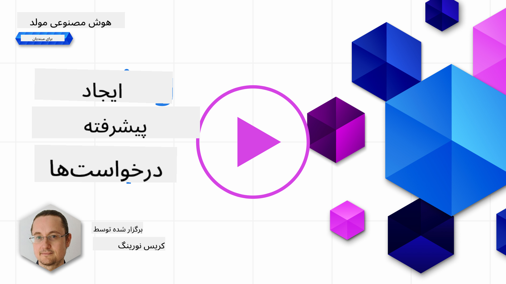

<!--
CO_OP_TRANSLATOR_METADATA:
{
  "original_hash": "b2651fb16bcfbc62b8e518751ed90fdb",
  "translation_date": "2025-10-17T23:06:17+00:00",
  "source_file": "05-advanced-prompts/README.md",
  "language_code": "fa"
}
-->
# ایجاد درخواست‌های پیشرفته

[](https://youtu.be/BAjzkaCdRok?si=NmUIyRf7-cDgbjtt)

بیایید برخی از مطالب فصل قبلی را مرور کنیم:

> مهندسی درخواست فرآیندی است که در آن ما **مدل را به سمت پاسخ‌های مرتبط‌تر هدایت می‌کنیم** با ارائه دستورالعمل‌ها یا زمینه‌های مفیدتر.

دو مرحله برای نوشتن درخواست‌ها وجود دارد: ساختن درخواست با ارائه زمینه مرتبط و **بهینه‌سازی**، یعنی بهبود تدریجی درخواست.

در این مرحله، ما درک اولیه‌ای از نحوه نوشتن درخواست‌ها داریم، اما باید عمیق‌تر شویم. در این فصل، شما از امتحان کردن درخواست‌های مختلف به درک اینکه چرا یک درخواست بهتر از دیگری است، خواهید رسید. شما یاد خواهید گرفت که چگونه درخواست‌ها را با استفاده از تکنیک‌های پایه‌ای که می‌توانند برای هر مدل زبانی بزرگ (LLM) اعمال شوند، بسازید.

## مقدمه

در این فصل، موضوعات زیر را پوشش خواهیم داد:

- گسترش دانش خود در زمینه مهندسی درخواست با استفاده از تکنیک‌های مختلف در درخواست‌ها.
- تنظیم درخواست‌ها برای تغییر خروجی.

## اهداف یادگیری

پس از اتمام این درس، شما قادر خواهید بود:

- تکنیک‌های مهندسی درخواست را که نتیجه درخواست‌های شما را بهبود می‌بخشند، اعمال کنید.
- درخواست‌هایی انجام دهید که یا متنوع باشند یا قطعی.

## مهندسی درخواست

مهندسی درخواست فرآیند ایجاد درخواست‌هایی است که نتیجه مطلوب را تولید می‌کنند. مهندسی درخواست فقط نوشتن یک متن درخواست نیست. مهندسی درخواست یک رشته مهندسی نیست، بلکه مجموعه‌ای از تکنیک‌ها است که می‌توانید برای دستیابی به نتیجه مطلوب اعمال کنید.

### نمونه‌ای از یک درخواست

بیایید یک درخواست ساده مانند این را بررسی کنیم:

> 10 سوال درباره جغرافیا تولید کنید.

در این درخواست، شما در واقع مجموعه‌ای از تکنیک‌های مختلف درخواست را اعمال می‌کنید.

بیایید این را تجزیه کنیم.

- **زمینه**، شما مشخص می‌کنید که باید درباره "جغرافیا" باشد.
- **محدود کردن خروجی**، شما می‌خواهید بیش از 10 سوال نباشد.

### محدودیت‌های درخواست ساده

ممکن است نتیجه مطلوب را دریافت کنید یا نکنید. سوالات شما تولید خواهند شد، اما جغرافیا موضوع بزرگی است و ممکن است به دلیل دلایل زیر چیزی که می‌خواهید را دریافت نکنید:

- **موضوع بزرگ**، شما نمی‌دانید که آیا سوالات درباره کشورها، پایتخت‌ها، رودخانه‌ها و غیره خواهد بود.
- **فرمت**، اگر بخواهید سوالات به شکل خاصی فرمت شوند، چه؟

همانطور که می‌بینید، هنگام ایجاد درخواست‌ها باید موارد زیادی را در نظر گرفت.

تا کنون، ما یک نمونه درخواست ساده را دیده‌ایم، اما هوش مصنوعی مولد قادر به انجام کارهای بسیار بیشتری است تا به افراد در نقش‌ها و صنایع مختلف کمک کند. بیایید برخی تکنیک‌های پایه‌ای را بررسی کنیم.

### تکنیک‌های درخواست‌دهی

ابتدا باید درک کنیم که درخواست‌دهی یک ویژگی _پدیدار_ مدل زبانی بزرگ است، به این معنی که این ویژگی به طور خاص در مدل ساخته نشده است، بلکه چیزی است که در هنگام استفاده از مدل کشف می‌شود.

برخی تکنیک‌های پایه‌ای وجود دارند که می‌توانیم برای درخواست‌دهی از مدل زبانی بزرگ استفاده کنیم. بیایید آن‌ها را بررسی کنیم.

- **درخواست‌دهی بدون نمونه**، این ساده‌ترین شکل درخواست‌دهی است. این یک درخواست واحد است که پاسخ را فقط بر اساس داده‌های آموزشی مدل درخواست می‌کند.
- **درخواست‌دهی با چند نمونه**، این نوع درخواست‌دهی مدل را با ارائه یک یا چند مثال راهنمایی می‌کند تا بتواند پاسخ خود را تولید کند.
- **زنجیره تفکر**، این نوع درخواست‌دهی به مدل زبانی بزرگ می‌گوید که چگونه یک مسئله را به مراحل تقسیم کند.
- **دانش تولید شده**، برای بهبود پاسخ یک درخواست، می‌توانید حقایق یا دانش تولید شده را علاوه بر درخواست خود ارائه دهید.
- **کمترین به بیشترین**، مانند زنجیره تفکر، این تکنیک درباره تقسیم یک مسئله به مجموعه‌ای از مراحل و سپس درخواست انجام این مراحل به ترتیب است.
- **خود-بهبود**، این تکنیک درباره نقد خروجی مدل زبانی بزرگ و سپس درخواست بهبود آن است.
- **درخواست‌دهی مایوتیک**، در اینجا هدف این است که مطمئن شوید پاسخ مدل زبانی بزرگ صحیح است و از آن می‌خواهید بخش‌های مختلف پاسخ را توضیح دهد. این یک شکل از خود-بهبود است.

### درخواست‌دهی بدون نمونه

این سبک درخواست‌دهی بسیار ساده است و شامل یک درخواست واحد می‌شود. این تکنیک احتمالاً همان چیزی است که شما هنگام شروع یادگیری درباره مدل‌های زبانی بزرگ استفاده می‌کنید. در اینجا یک مثال آورده شده است:

- درخواست: "جبر چیست؟"
- پاسخ: "جبر شاخه‌ای از ریاضیات است که به مطالعه نمادهای ریاضی و قوانین دستکاری این نمادها می‌پردازد."

### درخواست‌دهی با چند نمونه

این سبک درخواست‌دهی به مدل کمک می‌کند با ارائه چند مثال همراه با درخواست. این شامل یک درخواست واحد با داده‌های خاص وظیفه اضافی است. در اینجا یک مثال آورده شده است:

- درخواست: "یک شعر به سبک شکسپیر بنویسید. در اینجا چند نمونه از سونات‌های شکسپیر آورده شده است:
  سونات 18: 'آیا تو را با روزی تابستانی مقایسه کنم؟ تو زیباتر و معتدل‌تر هستی...'
  سونات 116: 'اجازه ندهید به ازدواج ذهن‌های واقعی موانعی وارد شود. عشق عشق نیست که با تغییر تغییر کند...'
  سونات 132: 'چشمانت را دوست دارم، و آن‌ها، به عنوان ترحم به من، قلبت را که مرا با تحقیر شکنجه می‌کند، می‌شناسند...'
  حالا، یک سونات درباره زیبایی ماه بنویس."
- پاسخ: "بر فراز آسمان، ماه به آرامی می‌درخشد، در نوری نقره‌ای که لطف ملایم خود را می‌افکند..."

مثال‌ها به مدل زبانی بزرگ زمینه، فرمت یا سبک خروجی مطلوب را ارائه می‌دهند. آن‌ها به مدل کمک می‌کنند وظیفه خاص را درک کند و پاسخ‌های دقیق‌تر و مرتبط‌تری تولید کند.

### زنجیره تفکر

زنجیره تفکر یک تکنیک بسیار جالب است زیرا درباره بردن مدل زبانی بزرگ از طریق یک سری مراحل است. ایده این است که مدل زبانی بزرگ را به گونه‌ای آموزش دهید که بفهمد چگونه کاری را انجام دهد. به مثال زیر توجه کنید، با و بدون زنجیره تفکر:

- درخواست: "آلیس 5 سیب دارد، 3 سیب پرت می‌کند، 2 سیب به باب می‌دهد و باب یکی را برمی‌گرداند، آلیس چند سیب دارد؟"
- پاسخ: 5

مدل زبانی بزرگ با پاسخ 5 پاسخ می‌دهد، که اشتباه است. پاسخ صحیح 1 سیب است، با توجه به محاسبه (5 - 3 - 2 + 1 = 1).

پس چگونه می‌توانیم به مدل زبانی بزرگ آموزش دهیم که این کار را به درستی انجام دهد؟

بیایید زنجیره تفکر را امتحان کنیم. اعمال زنجیره تفکر به این معناست که:

1. به مدل زبانی بزرگ یک مثال مشابه بدهید.
2. محاسبه را نشان دهید و نحوه محاسبه صحیح را توضیح دهید.
3. درخواست اصلی را ارائه دهید.

در اینجا نحوه انجام این کار آورده شده است:

- درخواست: "لیزا 7 سیب دارد، 1 سیب پرت می‌کند، 4 سیب به بارت می‌دهد و بارت یکی را برمی‌گرداند:
  7 - 1 = 6
  6 - 4 = 2
  2 + 1 = 3  
  آلیس 5 سیب دارد، 3 سیب پرت می‌کند، 2 سیب به باب می‌دهد و باب یکی را برمی‌گرداند، آلیس چند سیب دارد؟"
  پاسخ: 1

توجه کنید که چگونه درخواست‌ها را به طور قابل توجهی طولانی‌تر می‌نویسیم، با یک مثال دیگر، یک محاسبه و سپس درخواست اصلی، و به پاسخ صحیح 1 می‌رسیم.

همانطور که می‌بینید، زنجیره تفکر یک تکنیک بسیار قدرتمند است.

### دانش تولید شده

بسیاری از مواقع که می‌خواهید یک درخواست بسازید، می‌خواهید این کار را با استفاده از داده‌های شرکت خود انجام دهید. شما می‌خواهید بخشی از درخواست از شرکت باشد و بخش دیگر درخواست اصلی باشد که به آن علاقه دارید.

به عنوان مثال، این چیزی است که درخواست شما می‌تواند به نظر برسد اگر شما در صنعت بیمه باشید:

```text
{{company}}: {{company_name}}
{{products}}:
{{products_list}}
Please suggest an insurance given the following budget and requirements:
Budget: {{budget}}
Requirements: {{requirements}}
```

در بالا، می‌بینید که درخواست با استفاده از یک قالب ساخته شده است. در قالب تعدادی متغیر وجود دارد که با `{{variable}}` مشخص شده‌اند و با مقادیر واقعی از یک API شرکت جایگزین خواهند شد.

در اینجا یک مثال از نحوه ظاهر درخواست پس از جایگزینی متغیرها با محتوا از شرکت شما آورده شده است:

```text
Insurance company: ACME Insurance
Insurance products (cost per month):
- Car, cheap, 500 USD
- Car, expensive, 1100 USD
- Home, cheap, 600 USD
- Home, expensive, 1200 USD
- Life, cheap, 100 USD

Please suggest an insurance given the following budget and requirements:
Budget: $1000
Requirements: Car, Home, and Life insurance
```

اجرای این درخواست از طریق مدل زبانی بزرگ یک پاسخ مانند این تولید خواهد کرد:

```output
Given the budget and requirements, we suggest the following insurance package from ACME Insurance:
- Car, cheap, 500 USD
- Home, cheap, 600 USD
- Life, cheap, 100 USD
Total cost: $1,200 USD
```

همانطور که می‌بینید، همچنین بیمه عمر را پیشنهاد می‌دهد، که نباید این کار را انجام دهد. این نتیجه نشان‌دهنده این است که ما باید درخواست را با تغییر آن به وضوح بیشتر بهینه کنیم. پس از چندین **آزمایش و خطا**، به درخواست زیر می‌رسیم:

```text
Insurance company: ACME Insurance
Insurance products (cost per month):
- type: Car, cheap, cost: 500 USD
- type: Car, expensive, cost: 1100 USD
- type: Home, cheap, cost: 600 USD
- type: Home, expensive, cost: 1200 USD
- type: Life, cheap, cost: 100 USD

Please suggest an insurance given the following budget and requirements:
Budget: $1000 restrict choice to types: Car, Home
```

توجه کنید که چگونه افزودن **نوع** و **هزینه** و همچنین استفاده از کلمه کلیدی **محدود کردن** به مدل زبانی بزرگ کمک می‌کند تا آنچه را که می‌خواهیم درک کند.

اکنون پاسخ زیر را دریافت می‌کنیم:

```output
Given the budget and requirements, we suggest the Car, Cheap insurance product which costs 500 USD per month.
```

هدف این مثال این بود که نشان دهد حتی اگر از یک تکنیک پایه‌ای مانند **دانش تولید شده** استفاده کنیم، باز هم در اکثر موارد نیاز به بهینه‌سازی درخواست داریم تا به نتیجه مطلوب برسیم.

### کمترین به بیشترین

ایده درخواست‌دهی کمترین به بیشترین این است که یک مسئله بزرگ‌تر را به زیرمسائل تقسیم کنید. به این ترتیب، شما به مدل زبانی بزرگ کمک می‌کنید تا مسئله بزرگ‌تر را "فتح" کند. یک مثال خوب می‌تواند برای علم داده باشد که می‌توانید از مدل زبانی بزرگ بخواهید یک مسئله را به این صورت تقسیم کند:

> درخواست: چگونه علم داده را در 5 مرحله انجام دهیم؟

با پاسخ دستیار هوش مصنوعی:

1. جمع‌آوری داده‌ها
2. پاکسازی داده‌ها
3. تحلیل داده‌ها
4. رسم نمودار داده‌ها
5. ارائه داده‌ها

### خود-بهبود، نقد نتایج

با هوش مصنوعی‌های مولد و مدل‌های زبانی بزرگ، نمی‌توانید به خروجی اعتماد کنید. باید آن را بررسی کنید. به هر حال، مدل زبانی بزرگ فقط چیزی را که احتمالاً بعدی گفته می‌شود ارائه می‌دهد، نه چیزی که صحیح است. بنابراین، ایده خوبی است که از مدل زبانی بزرگ بخواهید خودش را نقد کند، که ما را به تکنیک خود-بهبود می‌رساند.

نحوه کار این است که مراحل زیر را دنبال کنید:

1. درخواست اولیه برای حل یک مسئله از مدل زبانی بزرگ
2. مدل زبانی بزرگ پاسخ می‌دهد
3. شما پاسخ را نقد می‌کنید و از هوش مصنوعی می‌خواهید آن را بهبود دهد
4. مدل زبانی بزرگ دوباره پاسخ می‌دهد، این بار نقد را در نظر می‌گیرد و راه‌حل‌هایی را که ارائه کرده است پیشنهاد می‌دهد

شما می‌توانید این فرآیند را به تعداد دفعاتی که می‌خواهید تکرار کنید.

در اینجا یک مثال با استفاده از این تکنیک آورده شده است:

> درخواست: "یک API وب پایتون با مسیرهای محصولات و مشتریان ایجاد کنید"

پاسخ هوش مصنوعی:

```python
import flask
app = Flask(__name__)

@app.route('/products')
def products():
    return 'Products'

@app.route('/customers')
def customers():
    return 'Customers'
```

> درخواست: 3 بهبود برای کد بالا پیشنهاد دهید

پاسخ هوش مصنوعی:

```text
Sure, here are three suggestions to improve the code:

Import the correct module: The first line should import Flask instead of flask. The correct import statement should be from flask import Flask.

Add a main function: Add a if __name__ == '__main__': block to the end of the file to run the application when the file is executed.

Use f-strings: Use f-strings to format the return statements in the route functions. For example, return 'Products' can be changed to return f'This is the {request.path} page'.
```

```python
from flask import Flask, request

app = Flask(__name__)

@app.route('/products')
def products():
    return f'This is the {request.path} page'

@app.route('/customers')
def customers():
    return f'This is the {request.path} page'

if __name__ == '__main__':
    app.run()
```

همانطور که می‌بینید، پاسخ هوش مصنوعی بالا کد پیشنهادی اول را به لطف نقد بهبود داده است.

### درخواست‌دهی مایوتیک

درخواست‌دهی مایوتیک یک تکنیک است که مشابه خود-بهبود است اما بیشتر درباره درخواست از مدل زبانی بزرگ برای توضیح خودش است. هدف کاهش ناسازگاری‌ها در خروجی مدل زبانی بزرگ است تا مطمئن شویم به پاسخ صحیح می‌رسیم. روندی که باید دنبال کنید این است:

1. از مدل زبانی بزرگ بخواهید به یک سوال پاسخ دهد.
2. برای هر بخش از پاسخ، از مدل زبانی بزرگ بخواهید آن را با جزئیات بیشتری توضیح دهد.
3. اگر ناسازگاری‌هایی وجود دارد، بخش‌هایی که ناسازگار هستند را کنار بگذارید.

مراحل 2 و 3 را تکرار کنید تا زمانی که تمام بخش‌ها را بررسی کرده و از پاسخ راضی باشید.

در اینجا یک مثال درخواست آورده شده است:

> درخواست: چگونه می‌توانم یک برنامه بحران برای کاهش یک پاندمی در 5 مرحله ایجاد کنم؟
> پاسخ مدل زبانی بزرگ:

```text
1. Identify the risks
1. Identify the stakeholders
1. Identify the resources
1. Identify the actions
1. Identify the communication channels
```

5 مرحله شناسایی شده است، اما آیا می‌توانیم تعیین کنیم که این درست است؟ بیایید از مدل زبانی بزرگ بخواهیم هر مرحله را با جزئیات بیشتری توضیح دهد:

> درخواست: مرحله اول را با جزئیات بیشتری توضیح دهید، خطرات یک پاندمی به طور دقیق چیست؟

```text
The risks are the following:

- Loss of life
- Loss of business
- Loss of reputation
- Loss of customers
- Loss of employees
```

در این مرحله، می‌خواهیم مطمئن شویم که مدل زبانی بزرگ درست است، بنابراین از آن می‌خواهیم اولین خطر را با جزئیات بیشتری توضیح دهد و امیدواریم که با پاسخ بالا سازگار باشد:

> درخواست: در یک پاندمی، بزرگ‌ترین خطر چیست و چرا؟

```text
The biggest risk is loss of life because it's the most important thing to protect.
```

> بزرگ‌ترین دو خطر در یک پاندمی چیست؟

```text
The two biggest risks are loss of life and loss of business.
```

در این مرحله، مدل زبانی بزرگ سازگار است و "زندگی" و "کسب‌وکار" را به عنوان دو خطر اصلی ذکر می‌کند. اکنون می‌توانیم به مرحله بعدی ادامه دهیم و احساس نسبتاً مطمئنی داشته باشیم. با این حال، نباید به مدل زبانی بزرگ به طور کورکورانه اعتماد کنیم، همیشه باید خروجی را بررسی کنیم.

## تغییر خروجی خود

مدل‌های زبانی بزرگ به طور طبیعی غیرقطعی هستند، به این معنی که هر بار که یک درخواست مشابه را اجرا می‌کنید، نتایج متفاوتی دریافت خواهید کرد. به عنوان مثال، درخواست زیر را امتحان کنید:

> "کدی برای یک API وب پایتون تولید کنید"

```python
# Import necessary modules
import flask
from flask import request, jsonify

# Create a Flask app
app = flask.Flask(__name__)

# Create a route for the API
@app.route('/api', methods=['GET'])
def api():
    # Get the data from the request
    data = request.args

    # Process the data
    result = process_data(data)

    # Return the result as JSON
    return jsonify(result)

# Function to process the data
def process_data(data):
    # Do something with the data
    result = data + 1

    # Return the result
    return result

# Run the app
if __name__ == '__main__':
    app.run()

```

اجرای دوباره همان درخواست، پاسخی کمی متفاوت تولید می‌کند:

```python
#import necessary packages
import flask
from flask import request, jsonify

#create the Flask application
app = flask.Flask(__name__)
app.config["DEBUG"] = True

#create a list of books
books = [
    {'id': 0,
     'title': 'A Fire Upon the Deep',
     'author': 'Vernor Vinge',
     'first_sentence': 'The coldsleep itself was dreamless.',
     'year_published': '1992'},
    {'id': 1,
     'title': 'The Ones Who Walk Away From Omelas',
     'author': 'Ursula K. Le Guin',
     'first_sentence': 'With a clamor of bells that set the swallows soaring, the Festival of Summer came to the city Omelas, bright-towered by the sea.',
     'published': '1973'},
    {'id': 2,
     'title': 'Dhalgren',
     'author': 'Samuel R. Delany',
     'first_sentence': 'to wound the autumnal city.',
     'published': '1975'}
]

#create an endpoint for the API
@app.route('/', methods=['GET'])
def home():
    return '''<h1>Books API</h1>
<p>A prototype API for retrieving books.</p>'''

#create an endpoint to return all books
@app.route('/api/v1/resources/books/all', methods=['GET'])
def api_all():
    return jsonify(books)

#create an endpoint to return a single book
@app.route('/api/v1/resources/books', methods=['GET'])
def api_id():
    #check if an ID was provided as part of the URL
    #if ID is provided, assign it to a variable
    #if no ID is provided, display an error
    if 'id' in request.args:
        id = int(request.args['id'])
    else:
        return "Error: No id field provided. Please specify an id."

    #create an empty list for our results
    results = []

    #loop through the data and match results that fit the requested ID
    #IDs are unique, but other fields might return many results
    for book in books:
        if book['id'] == id:
            results.append(book)

    #use the jsonify function from Flask to convert our list of
    #Python dictionaries to the JSON format
    return jsonify(results)

app.run()
```

> آیا خروجی متنوع یک مشکل است؟

بستگی به این دارد که چه چیزی را می‌خواهید انجام دهید. اگر به یک پاسخ خاص نیاز دارید، این یک مشکل است. اگر با خروجی متنوع مانند "تولید هر 3 سوال درباره جغرافیا" مشکلی ندارید، پس مشکلی نیست.

### استفاده از دما برای تغییر خروجی

خب، تصمیم گرفته‌ایم که می‌خواهیم خروجی را محدود کنیم تا قابل پیش‌بینی‌تر باشد، یعنی قطعی‌تر. چگونه این کار را انجام دهیم؟

دمای یک مقدار بین 0 و 1 است، که 0 قطعی‌ترین و 1 متنوع‌ترین است. مقدار پیش‌فرض 0.7 است. بیایید ببینیم چه اتفاقی می‌افتد با دو اجرای یک درخواست مشابه با دمای تنظیم شده به 0.1:

> "کدی برای یک API وب پایتون تولید کنید"

```python
#import necessary libraries
import flask
from flask import request, jsonify

#create an instance of the Flask class
app = flask.Flask(__name__)

#create an endpoint for the API
@app.route('/api/v1/endpoint', methods=['GET'])
def api_endpoint():
    #get the request data
    data = request.get_json()

    #process the data
    result = process_data(data)

    #return the result
    return jsonify(result)

#function to process the data
def process_data(data):
    #process the data
    result = {'result': 'success'}

    #return the result
    return result

#run the Flask app
if __name__ == '__main__':
    app.run()

```

اجرای دوباره درخواست نتیجه زیر را می‌دهد:

```python
#import necessary libraries
import flask
from flask import request, jsonify

#create a Flask app
app = flask.Flask(__name__)

#create a route for the API
@app.route('/api', methods=['GET'])
def api_call():
    #get the data from the request
    data = request.get_json()

    #process the data
    result = process_data(data)

    #return the result
    return jsonify(result)

#define the process_data function
def process_data(data):
    #do something with the data
    result = data + 1

    #return the result
    return result

#run the app
if __name__ == '__main__':
    app.run()

```

فقط تفاوت کوچکی بین این دو خروجی وجود دارد. این بار برعکس عمل کنیم، دما را به 0.9 تنظیم کنیم:

```python
# Import necessary libraries
import flask
from flask import request, jsonify

# Create a Flask app
app = flask.Flask(__name__)

# Create a route for the API
@app.route('/api', methods=['GET'])
def api_call():
    # Get the data from the request
    data = request.args

    # Process the data
    result = process_data(data)

    # Return the result
    return jsonify(result)

# Function to process the data
def process_data(data):
    # Do something with the data
    result = data + 1

    # Return the result
    return result

# Run the app
if __name__ == '__main__':
    app.run()

```

و تلاش دوم با مقدار دما 0.9:

```python
import flask
from flask import request, jsonify

# create the Flask app
app = flask.Flask(__name__)
app.config['DEBUG'] = True

# create some test data
books = [
    {'id': 0, 'title': 'A Fire Upon The Deep', 'author': 'Vernor Vinge', 'first_sentence': 'The coldsleep itself was dreamless.', 'year_published': '1992'},
    {'id': 1, 'title': 'The Ones Who Walk Away From Omelas', 'author': 'Ursula K. Le Guin', 'first_sentence': 'With a clamor of bells that set the swallows soaring, the Festival of Summer came to the city Omelas, bright-towered by the sea.', 'published': '1973'},
    {'id': 2, 'title': 'Dhalgren', 'author': 'Samuel R. Delany', 'first_sentence': 'to wound the autumnal city.', 'published': '1975'}
]

# create an endpoint
@app.route('/', methods=['GET'])
def home():
    return '''<h1>Welcome to our book API!</h1>'''

@app.route('/api/v1/resources/books

```

همانطور که می‌بینید، نتایج نمی‌توانستند متنوع‌تر باشند.

> توجه داشته باشید که پارامترهای بیشتری وجود دارند که می‌توانید برای تغییر خروجی تنظیم کنید، مانند top-k، top-p، جریمه تکرار، جریمه طول و جریمه تنوع، اما این موارد خارج از محدوده این دوره آموزشی هستند.

## روش‌های خوب

روش‌های زیادی وجود دارند که می‌توانید برای دستیابی به نتیجه دلخواه خود به کار ببرید. با استفاده بیشتر از تکنیک‌های درخواست‌دهی، سبک خود را پیدا خواهید کرد.

علاوه بر تکنیک‌هایی که پوشش داده‌ایم، برخی روش‌های خوب وجود دارند که هنگام درخواست از یک مدل زبان بزرگ (LLM) باید در نظر بگیرید.

در اینجا چند روش خوب برای در نظر گرفتن آورده شده است:

- **مشخص کردن زمینه**. زمینه اهمیت دارد، هرچه بتوانید بیشتر مشخص کنید، مانند حوزه، موضوع و غیره، بهتر است.
- محدود کردن خروجی. اگر تعداد مشخصی از آیتم‌ها یا طول خاصی می‌خواهید، آن را مشخص کنید.
- **مشخص کردن چه چیزی و چگونه**. به یاد داشته باشید که هم آنچه می‌خواهید و هم نحوه انجام آن را ذکر کنید، برای مثال "یک API وب پایتون با مسیرهای محصولات و مشتریان ایجاد کنید، آن را به ۳ فایل تقسیم کنید".
- **استفاده از قالب‌ها**. اغلب، شما می‌خواهید درخواست‌های خود را با داده‌های شرکت خود غنی کنید. از قالب‌ها برای این کار استفاده کنید. قالب‌ها می‌توانند متغیرهایی داشته باشند که با داده‌های واقعی جایگزین شوند.
- **درست نوشتن**. مدل‌های زبان ممکن است پاسخ صحیحی به شما بدهند، اما اگر درست بنویسید، پاسخ بهتری دریافت خواهید کرد.

## تکلیف

در اینجا کدی در پایتون آورده شده است که نشان می‌دهد چگونه می‌توان یک API ساده با استفاده از Flask ساخت:

```python
from flask import Flask, request

app = Flask(__name__)

@app.route('/')
def hello():
    name = request.args.get('name', 'World')
    return f'Hello, {name}!'

if __name__ == '__main__':
    app.run()
```

از یک دستیار هوش مصنوعی مانند GitHub Copilot یا ChatGPT استفاده کنید و تکنیک "خود-بهبود" را برای بهبود کد اعمال کنید.

## راه‌حل

لطفاً سعی کنید با افزودن درخواست‌های مناسب به کد، تکلیف را حل کنید.

> [!TIP]
> یک درخواست را برای بهبود فرموله کنید، ایده خوبی است که تعداد بهبودها را محدود کنید. همچنین می‌توانید درخواست کنید که بهبود در یک زمینه خاص مانند معماری، عملکرد، امنیت و غیره انجام شود.

[راه‌حل](../../../05-advanced-prompts/python/aoai-solution.py)

## بررسی دانش

چرا باید از درخواست‌دهی زنجیره‌ای استفاده کنم؟ یک پاسخ صحیح و دو پاسخ نادرست را نشان دهید.

1. برای آموزش مدل زبان بزرگ (LLM) در مورد نحوه حل یک مسئله.
1. ب، برای آموزش مدل زبان بزرگ به یافتن خطاها در کد.
1. ج، برای دستور دادن به مدل زبان بزرگ برای ارائه راه‌حل‌های مختلف.

پاسخ: 1، زیرا درخواست‌دهی زنجیره‌ای به مدل زبان بزرگ نشان می‌دهد که چگونه یک مسئله را با ارائه یک سری مراحل و مسائل مشابه و نحوه حل آن‌ها حل کند.

## 🚀 چالش

شما به تازگی از تکنیک خود-بهبود در تکلیف استفاده کردید. هر برنامه‌ای که ساخته‌اید را بردارید و به این فکر کنید که چه بهبودهایی می‌خواهید در آن اعمال کنید. اکنون از تکنیک خود-بهبود برای اعمال تغییرات پیشنهادی استفاده کنید. به نظر شما نتیجه بهتر بود یا بدتر؟

## کار عالی! یادگیری خود را ادامه دهید

پس از اتمام این درس، مجموعه [آموزش هوش مصنوعی مولد](https://aka.ms/genai-collection?WT.mc_id=academic-105485-koreyst) ما را بررسی کنید تا دانش خود در زمینه هوش مصنوعی مولد را ارتقا دهید!

به درس ۶ بروید، جایی که دانش خود در زمینه مهندسی درخواست‌دهی را با [ساخت اپلیکیشن‌های تولید متن](../06-text-generation-apps/README.md?WT.mc_id=academic-105485-koreyst) به کار خواهیم گرفت.

---

**سلب مسئولیت**:  
این سند با استفاده از سرویس ترجمه هوش مصنوعی [Co-op Translator](https://github.com/Azure/co-op-translator) ترجمه شده است. در حالی که ما تلاش می‌کنیم دقت را حفظ کنیم، لطفاً توجه داشته باشید که ترجمه‌های خودکار ممکن است شامل خطاها یا نادرستی‌ها باشند. سند اصلی به زبان اصلی آن باید به عنوان منبع معتبر در نظر گرفته شود. برای اطلاعات حیاتی، ترجمه حرفه‌ای انسانی توصیه می‌شود. ما مسئولیتی در قبال سوء تفاهم‌ها یا تفسیرهای نادرست ناشی از استفاده از این ترجمه نداریم.