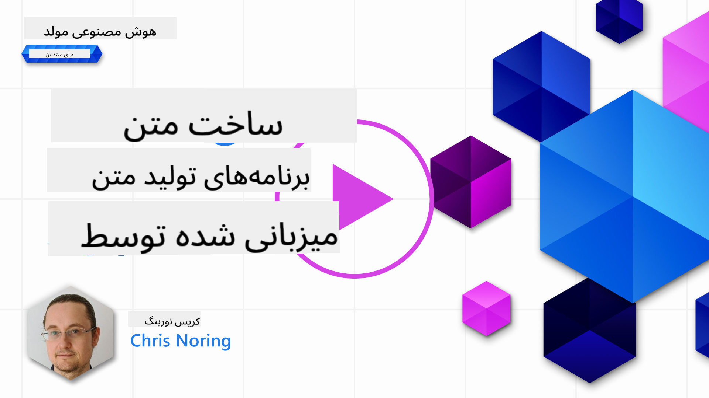

<!--
CO_OP_TRANSLATOR_METADATA:
{
  "original_hash": "ce8224073b86b728ed52b19bed7932fd",
  "translation_date": "2025-07-09T11:45:44+00:00",
  "source_file": "06-text-generation-apps/README.md",
  "language_code": "fa"
}
-->
# ساخت برنامه‌های تولید متن

[](https://aka.ms/gen-ai-lesson6-gh?WT.mc_id=academic-105485-koreyst)

> _(برای مشاهده ویدیو این درس روی تصویر بالا کلیک کنید)_

تا اینجا در این دوره دیده‌اید که مفاهیم اصلی‌ای مثل promptها وجود دارند و حتی رشته‌ای به نام «مهندسی prompt» شکل گرفته است. بسیاری از ابزارهایی که با آن‌ها تعامل دارید مثل ChatGPT، Office 365، Microsoft Power Platform و غیره، از promptها برای انجام کارها پشتیبانی می‌کنند.

برای اینکه چنین تجربه‌ای را به یک اپلیکیشن اضافه کنید، باید مفاهیمی مثل prompt، completion را بفهمید و یک کتابخانه برای کار انتخاب کنید. دقیقاً همین‌ها را در این فصل یاد خواهید گرفت.

## مقدمه

در این فصل، شما:

- با کتابخانه openai و مفاهیم اصلی آن آشنا می‌شوید.
- یک اپلیکیشن تولید متن با استفاده از openai می‌سازید.
- یاد می‌گیرید چطور از مفاهیمی مثل prompt، temperature و tokens برای ساخت اپ تولید متن استفاده کنید.

## اهداف یادگیری

در پایان این درس، قادر خواهید بود:

- توضیح دهید اپ تولید متن چیست.
- یک اپ تولید متن با openai بسازید.
- اپ خود را طوری تنظیم کنید که تعداد توکن‌ها را بیشتر یا کمتر کند و همچنین دما (temperature) را تغییر دهد تا خروجی متنوع‌تری داشته باشید.

## اپ تولید متن چیست؟

معمولاً وقتی اپ می‌سازید، یک نوع رابط کاربری دارد مثل موارد زیر:

- مبتنی بر فرمان (Command-based). اپ‌های کنسولی نمونه‌ای از این نوع هستند که شما فرمانی می‌نویسید و کار خاصی انجام می‌شود. مثلاً `git` یک اپ مبتنی بر فرمان است.
- رابط کاربری گرافیکی (UI). بعضی اپ‌ها رابط گرافیکی دارند که در آن دکمه می‌زنید، متن وارد می‌کنید، گزینه انتخاب می‌کنید و غیره.

### اپ‌های کنسولی و UI محدودیت دارند

اگر با اپ مبتنی بر فرمان مقایسه کنیم که شما فرمان می‌نویسید:

- **محدود است**. نمی‌توانید هر فرمانی را بنویسید، فقط فرمان‌هایی که اپ پشتیبانی می‌کند.
- **مخصوص زبان خاص**. بعضی اپ‌ها چند زبان را پشتیبانی می‌کنند، اما به طور پیش‌فرض برای یک زبان خاص ساخته شده‌اند، حتی اگر بتوانید زبان‌های بیشتری اضافه کنید.

### مزایای اپ‌های تولید متن

پس اپ تولید متن چه تفاوتی دارد؟

در اپ تولید متن، انعطاف بیشتری دارید، محدود به مجموعه‌ای از فرمان‌ها یا زبان ورودی خاص نیستید. به جای آن، می‌توانید با زبان طبیعی با اپ تعامل کنید. مزیت دیگر این است که شما با منبع داده‌ای کار می‌کنید که روی حجم زیادی از اطلاعات آموزش دیده است، در حالی که اپ‌های سنتی ممکن است محدود به داده‌های موجود در یک پایگاه داده باشند.

### با اپ تولید متن چه می‌توان ساخت؟

چیزهای زیادی می‌توانید بسازید. مثلاً:

- **چت‌بات**. چت‌باتی که به سوالات درباره موضوعات مختلف مثل شرکت شما و محصولاتش پاسخ می‌دهد، می‌تواند گزینه خوبی باشد.
- **دستیار**. مدل‌های زبانی بزرگ (LLM) در کارهایی مثل خلاصه‌سازی متن، استخراج بینش از متن، تولید متن مثل رزومه و غیره عالی هستند.
- **دستیار کدنویسی**. بسته به مدل زبانی که استفاده می‌کنید، می‌توانید دستیار کدنویسی بسازید که به نوشتن کد کمک کند. مثلاً می‌توانید از محصولی مثل GitHub Copilot یا ChatGPT برای کمک به نوشتن کد استفاده کنید.

## چطور شروع کنم؟

خب، باید راهی برای اتصال به یک LLM پیدا کنید که معمولاً دو روش زیر را شامل می‌شود:

- استفاده از API. در این روش درخواست‌های وب با prompt خود می‌سازید و متن تولید شده را دریافت می‌کنید.
- استفاده از کتابخانه. کتابخانه‌ها فراخوانی‌های API را بسته‌بندی می‌کنند و استفاده از آن‌ها را آسان‌تر می‌کنند.

## کتابخانه‌ها/SDKها

چند کتابخانه شناخته شده برای کار با LLMها وجود دارد مثل:

- **openai**، این کتابخانه اتصال به مدل شما و ارسال prompt را ساده می‌کند.

سپس کتابخانه‌هایی هستند که در سطح بالاتری کار می‌کنند مثل:

- **Langchain**. Langchain شناخته شده است و از پایتون پشتیبانی می‌کند.
- **Semantic Kernel**. Semantic Kernel کتابخانه‌ای از مایکروسافت است که از زبان‌های C#، پایتون و جاوا پشتیبانی می‌کند.

## اولین اپ با openai

بیایید ببینیم چطور اولین اپ خود را بسازیم، چه کتابخانه‌هایی نیاز داریم، چه مقدار لازم است و غیره.

### نصب openai

کتابخانه‌های زیادی برای تعامل با OpenAI یا Azure OpenAI وجود دارد. می‌توان از زبان‌های برنامه‌نویسی مختلفی مثل C#، پایتون، جاوااسکریپت، جاوا و غیره استفاده کرد. ما تصمیم گرفتیم از کتابخانه پایتون `openai` استفاده کنیم، پس با `pip` آن را نصب می‌کنیم.

```bash
pip install openai
```

### ایجاد یک منبع (resource)

باید مراحل زیر را انجام دهید:

- یک حساب در Azure بسازید [https://azure.microsoft.com/free/](https://azure.microsoft.com/free/?WT.mc_id=academic-105485-koreyst).
- دسترسی به Azure OpenAI بگیرید. به [https://learn.microsoft.com/azure/ai-services/openai/overview#how-do-i-get-access-to-azure-openai](https://learn.microsoft.com/azure/ai-services/openai/overview#how-do-i-get-access-to-azure-openai?WT.mc_id=academic-105485-koreyst) بروید و درخواست دسترسی دهید.

  > [!NOTE]
  > در زمان نگارش، باید برای دسترسی به Azure OpenAI درخواست دهید.

- پایتون را نصب کنید <https://www.python.org/>
- یک منبع Azure OpenAI Service ایجاد کرده باشید. برای نحوه [ایجاد منبع](https://learn.microsoft.com/azure/ai-services/openai/how-to/create-resource?pivots=web-portal?WT.mc_id=academic-105485-koreyst) این راهنما را ببینید.

### پیدا کردن کلید API و endpoint

حالا باید به کتابخانه `openai` بگویید از کدام کلید API استفاده کند. برای پیدا کردن کلید API، به بخش "Keys and Endpoint" منبع Azure OpenAI خود بروید و مقدار "Key 1" را کپی کنید.


حالا که این اطلاعات را کپی کردید، بیایید به کتابخانه‌ها بگوییم از آن استفاده کنند.

> [!NOTE]
> بهتر است کلید API خود را از کد جدا کنید. می‌توانید این کار را با استفاده از متغیرهای محیطی انجام دهید.
>
> - متغیر محیطی `OPENAI_API_KEY` را به کلید API خود تنظیم کنید.
>   `export OPENAI_API_KEY='sk-...'`

### تنظیم پیکربندی Azure

اگر از Azure OpenAI استفاده می‌کنید، این‌گونه پیکربندی را انجام دهید:

```python
openai.api_type = 'azure'
openai.api_key = os.environ["OPENAI_API_KEY"]
openai.api_version = '2023-05-15'
openai.api_base = os.getenv("API_BASE")
```

در بالا موارد زیر را تنظیم می‌کنیم:

- `api_type` را روی `azure` قرار می‌دهیم. این به کتابخانه می‌گوید از Azure OpenAI استفاده کند نه OpenAI.
- `api_key`، کلید API شما که در Azure Portal پیدا کردید.
- `api_version`، نسخه API که می‌خواهید استفاده کنید. در زمان نگارش، آخرین نسخه `2023-05-15` است.
- `api_base`، نقطه پایانی API که در Azure Portal کنار کلید API شما قرار دارد.

> [!NOTE] > `os.getenv` تابعی است که متغیرهای محیطی را می‌خواند. می‌توانید از آن برای خواندن متغیرهایی مثل `OPENAI_API_KEY` و `API_BASE` استفاده کنید. این متغیرها را در ترمینال خود یا با استفاده از کتابخانه‌ای مثل `dotenv` تنظیم کنید.

## تولید متن

روش تولید متن استفاده از کلاس `Completion` است. اینجا یک مثال داریم:

```python
prompt = "Complete the following: Once upon a time there was a"

completion = openai.Completion.create(model="davinci-002", prompt=prompt)
print(completion.choices[0].text)
```

در کد بالا، یک شیء completion می‌سازیم و مدل و prompt را به آن می‌دهیم. سپس متن تولید شده را چاپ می‌کنیم.

### تکمیل چت (Chat completions)

تا اینجا دیدید چطور با `Completion` متن تولید می‌کنیم. اما کلاس دیگری به نام `ChatCompletion` وجود دارد که برای چت‌بات‌ها مناسب‌تر است. اینجا نمونه‌ای از استفاده آن است:

```python
import openai

openai.api_key = "sk-..."

completion = openai.ChatCompletion.create(model="gpt-3.5-turbo", messages=[{"role": "user", "content": "Hello world"}])
print(completion.choices[0].message.content)
```

در مورد این قابلیت در فصل‌های بعد بیشتر توضیح خواهیم داد.

## تمرین - اولین اپ تولید متن شما

حالا که یاد گرفتیم چطور openai را تنظیم کنیم، وقت ساخت اولین اپ تولید متن است. برای ساخت اپ، مراحل زیر را دنبال کنید:

1. یک محیط مجازی بسازید و openai را نصب کنید:

   ```bash
   python -m venv venv
   source venv/bin/activate
   pip install openai
   ```

   > [!NOTE]
   > اگر از ویندوز استفاده می‌کنید به جای `source venv/bin/activate` بنویسید `venv\Scripts\activate`.

   > [!NOTE]
   > کلید Azure OpenAI خود را با رفتن به [https://portal.azure.com/](https://portal.azure.com/?WT.mc_id=academic-105485-koreyst) پیدا کنید، جستجو کنید `Open AI`، منبع `Open AI resource` را انتخاب کنید، سپس به بخش `Keys and Endpoint` بروید و مقدار `Key 1` را کپی کنید.

1. یک فایل _app.py_ بسازید و کد زیر را در آن قرار دهید:

   ```python
   import openai

   openai.api_key = "<replace this value with your open ai key or Azure OpenAI key>"

   openai.api_type = 'azure'
   openai.api_version = '2023-05-15'
   openai.api_base = "<endpoint found in Azure Portal where your API key is>"
   deployment_name = "<deployment name>"

   # add your completion code
   prompt = "Complete the following: Once upon a time there was a"
   messages = [{"role": "user", "content": prompt}]

   # make completion
   completion = openai.chat.completions.create(model=deployment_name, messages=messages)

   # print response
   print(completion.choices[0].message.content)
   ```

   > [!NOTE]
   > اگر از Azure OpenAI استفاده می‌کنید، باید `api_type` را روی `azure` تنظیم کنید و `api_key` را به کلید Azure OpenAI خود بدهید.

   باید خروجی‌ای شبیه به این ببینید:

   ```output
    very unhappy _____.

   Once upon a time there was a very unhappy mermaid.
   ```

## انواع مختلف promptها برای کارهای مختلف

حالا دیدید چطور با یک prompt متن تولید کنید. حتی برنامه‌ای دارید که اجرا می‌شود و می‌توانید آن را تغییر دهید تا انواع مختلف متن تولید کند.

Promptها را می‌توان برای انواع کارها استفاده کرد. مثلاً:

- **تولید نوعی متن**. مثلاً می‌توانید شعر، سوالات یک آزمون و غیره تولید کنید.
- **جستجوی اطلاعات**. می‌توانید از promptها برای جستجوی اطلاعات استفاده کنید، مثل مثال «CORS در توسعه وب یعنی چه؟».
- **تولید کد**. می‌توانید از promptها برای تولید کد استفاده کنید، مثلاً نوشتن یک عبارت منظم (regex) برای اعتبارسنجی ایمیل یا حتی تولید یک برنامه کامل مثل یک وب اپ.

## یک کاربرد عملی‌تر: تولید دستور پخت غذا

فرض کنید مواد اولیه‌ای در خانه دارید و می‌خواهید چیزی بپزید. برای این کار به یک دستور پخت نیاز دارید. راهی برای پیدا کردن دستور پخت استفاده از موتور جستجو است یا می‌توانید از یک LLM کمک بگیرید.

می‌توانید promptی مثل این بنویسید:

> «۵ دستور پخت برای غذایی با مواد زیر نشان بده: مرغ، سیب‌زمینی و هویج. برای هر دستور، همه مواد استفاده شده را لیست کن.»

با این prompt ممکن است پاسخی شبیه به این دریافت کنید:

```output
1. Roasted Chicken and Vegetables:
Ingredients:
- 4 chicken thighs
- 2 potatoes, cut into cubes
- 2 carrots, cut into cubes
- 2 tablespoons olive oil
- 2 cloves garlic, minced
- 1 teaspoon dried thyme
- 1 teaspoon dried oregano
- Salt and pepper, to taste

2. Chicken and Potato Stew:
Ingredients:
- 2 tablespoons olive oil
- 1 onion, diced
- 2 cloves garlic, minced
- 2 chicken breasts, cut into cubes
- 2 potatoes, cut into cubes
- 2 carrots, cut into cubes
- 1 teaspoon dried oregano
- 1 teaspoon dried thyme
- 1 cup chicken broth
- Salt and pepper, to taste

3. Chicken and Potato Bake:
Ingredients:
- 2 tablespoons olive oil
- 2 chicken breasts, cut into cubes
- 2 potatoes, cut into cubes
- 2 carrots, cut into cubes
- 1 onion, diced
- 2 cloves garlic, minced
- 1 teaspoon dried oregano
- 1 teaspoon dried thyme
- 1 cup chicken broth
- Salt and pepper, to taste

4. Chicken and Potato Soup:
Ingredients:
- 2 tablespoons olive oil
- 1 onion, diced
- 2 cloves garlic, minced
- 2 chicken breasts, cut into cubes
- 2 potatoes, cut into cubes
- 2 carrots, cut into cubes
- 1 teaspoon dried oregano
- 1 teaspoon dried thyme
- 4 cups chicken broth
- Salt and pepper, to taste

5. Chicken and Potato Hash:
Ingredients:
- 2 tablespoons olive oil
- 2 chicken breasts, cut into cubes
- 2 potatoes, cut into cubes
- 2 carrots, cut into cubes
- 1 onion, diced
- 2 cloves garlic, minced
- 1 teaspoon dried oregano
```

این نتیجه عالی است، می‌دانم چه بپزم. در این مرحله، بهبودهای مفید می‌تواند شامل موارد زیر باشد:

- حذف موادی که دوست ندارم یا به آن‌ها حساسیت دارم.
- تولید فهرست خرید، اگر همه مواد را در خانه ندارم.

برای موارد بالا، بیایید یک prompt اضافی اضافه کنیم:

> «لطفاً دستورهایی که سیر دارند حذف کن چون به آن حساسیت دارم و به جای آن چیزی دیگر بگذار. همچنین لطفاً فهرست خرید برای دستورها تولید کن، با توجه به اینکه من در خانه مرغ، سیب‌زمینی و هویج دارم.»

حالا نتیجه جدیدی دارید، یعنی:

```output
1. Roasted Chicken and Vegetables:
Ingredients:
- 4 chicken thighs
- 2 potatoes, cut into cubes
- 2 carrots, cut into cubes
- 2 tablespoons olive oil
- 1 teaspoon dried thyme
- 1 teaspoon dried oregano
- Salt and pepper, to taste

2. Chicken and Potato Stew:
Ingredients:
- 2 tablespoons olive oil
- 1 onion, diced
- 2 chicken breasts, cut into cubes
- 2 potatoes, cut into cubes
- 2 carrots, cut into cubes
- 1 teaspoon dried oregano
- 1 teaspoon dried thyme
- 1 cup chicken broth
- Salt and pepper, to taste

3. Chicken and Potato Bake:
Ingredients:
- 2 tablespoons olive oil
- 2 chicken breasts, cut into cubes
- 2 potatoes, cut into cubes
- 2 carrots, cut into cubes
- 1 onion, diced
- 1 teaspoon dried oregano
- 1 teaspoon dried thyme
- 1 cup chicken broth
- Salt and pepper, to taste

4. Chicken and Potato Soup:
Ingredients:
- 2 tablespoons olive oil
- 1 onion, diced
- 2 chicken breasts, cut into cubes
- 2 potatoes, cut into cubes
- 2 carrots, cut into cubes
- 1 teaspoon dried oregano
- 1 teaspoon dried thyme
- 4 cups chicken broth
- Salt and pepper, to taste

5. Chicken and Potato Hash:
Ingredients:
- 2 tablespoons olive oil
- 2 chicken breasts, cut into cubes
- 2 potatoes, cut into cubes
- 2 carrots, cut into cubes
- 1 onion, diced
- 1 teaspoon dried oregano

Shopping List:
- Olive oil
- Onion
- Thyme
- Oregano
- Salt
- Pepper
```

این پنج دستور پخت شما هستند بدون سیر و همچنین فهرست خریدی دارید که با توجه به مواد موجود در خانه تهیه شده است.

## تمرین - ساخت تولیدکننده دستور پخت

حالا که یک سناریو را اجرا کردیم، بیایید کدی بنویسیم که با آن مطابقت داشته باشد. برای این کار مراحل زیر را دنبال کنید:

1. از فایل _app.py_ موجود به عنوان نقطه شروع استفاده کنید.
1. متغیر `prompt` را پیدا کنید و کد آن را به شکل زیر تغییر دهید:

   ```python
   prompt = "Show me 5 recipes for a dish with the following ingredients: chicken, potatoes, and carrots. Per recipe, list all the ingredients used"
   ```

   اگر حالا کد را اجرا کنید، باید خروجی‌ای شبیه به این ببینید:

   ```output
   -Chicken Stew with Potatoes and Carrots: 3 tablespoons oil, 1 onion, chopped, 2 cloves garlic, minced, 1 carrot, peeled and chopped, 1 potato, peeled and chopped, 1 bay leaf, 1 thyme sprig, 1/2 teaspoon salt, 1/4 teaspoon black pepper, 1 1/2 cups chicken broth, 1/2 cup dry white wine, 2 tablespoons chopped fresh parsley, 2 tablespoons unsalted butter, 1 1/2 pounds boneless, skinless chicken thighs, cut into 1-inch pieces
   -Oven-Roasted Chicken with Potatoes and Carrots: 3 tablespoons extra-virgin olive oil, 1 tablespoon Dijon mustard, 1 tablespoon chopped fresh rosemary, 1 tablespoon chopped fresh thyme, 4 cloves garlic, minced, 1 1/2 pounds small red potatoes, quartered, 1 1/2 pounds carrots, quartered lengthwise, 1/2 teaspoon salt, 1/4 teaspoon black pepper, 1 (4-pound) whole chicken
   -Chicken, Potato, and Carrot Casserole: cooking spray, 1 large onion, chopped, 2 cloves garlic, minced, 1 carrot, peeled and shredded, 1 potato, peeled and shredded, 1/2 teaspoon dried thyme leaves, 1/4 teaspoon salt, 1/4 teaspoon black pepper, 2 cups fat-free, low-sodium chicken broth, 1 cup frozen peas, 1/4 cup all-purpose flour, 1 cup 2% reduced-fat milk, 1/4 cup grated Parmesan cheese

   -One Pot Chicken and Potato Dinner: 2 tablespoons olive oil, 1 pound boneless, skinless chicken thighs, cut into 1-inch pieces, 1 large onion, chopped, 3 cloves garlic, minced, 1 carrot, peeled and chopped, 1 potato, peeled and chopped, 1 bay leaf, 1 thyme sprig, 1/2 teaspoon salt, 1/4 teaspoon black pepper, 2 cups chicken broth, 1/2 cup dry white wine

   -Chicken, Potato, and Carrot Curry: 1 tablespoon vegetable oil, 1 large onion, chopped, 2 cloves garlic, minced, 1 carrot, peeled and chopped, 1 potato, peeled and chopped, 1 teaspoon ground coriander, 1 teaspoon ground cumin, 1/2 teaspoon ground turmeric, 1/2 teaspoon ground ginger, 1/4 teaspoon cayenne pepper, 2 cups chicken broth, 1/2 cup dry white wine, 1 (15-ounce) can chickpeas, drained and rinsed, 1/2 cup raisins, 1/2 cup chopped fresh cilantro
   ```

   > توجه: مدل‌های زبانی بزرگ غیرقطعی هستند، پس ممکن است هر بار که برنامه را اجرا می‌کنید نتایج متفاوتی بگیرید.

   عالی است، بیایید ببینیم چطور می‌توانیم بهترش کنیم. برای بهتر کردن، می‌خواهیم کد انعطاف‌پذیر باشد تا تعداد دستورها و مواد اولیه قابل تغییر باشد.

1. کد را به شکل زیر تغییر دهیم:

   ```python
   no_recipes = input("No of recipes (for example, 5): ")

   ingredients = input("List of ingredients (for example, chicken, potatoes, and carrots): ")

   # interpolate the number of recipes into the prompt an ingredients
   prompt = f"Show me {no_recipes} recipes for a dish with the following ingredients: {ingredients}. Per recipe, list all the ingredients used"
   ```

   اجرای آزمایشی کد می‌تواند شبیه به این باشد:

   ```output
   No of recipes (for example, 5): 3
   List of ingredients (for example, chicken, potatoes, and carrots): milk,strawberries

   -Strawberry milk shake: milk, strawberries, sugar, vanilla extract, ice cubes
   -Strawberry shortcake: milk, flour, baking powder, sugar, salt, unsalted butter, strawberries, whipped cream
   -Strawberry milk: milk, strawberries, sugar, vanilla extract
   ```

### بهبود با افزودن فیلتر و فهرست خرید

حالا یک اپ کارآمد داریم که می‌تواند دستور پخت تولید کند و انعطاف‌پذیر است چون ورودی‌های کاربر را برای تعداد دستورها و مواد اولیه می‌گیرد.

برای بهبود بیشتر، می‌خواهیم موارد زیر را اضافه کنیم:

- **فیلتر کردن مواد**. می‌خواهیم بتوانیم موادی که دوست نداریم یا به آن‌ها حساسیت داریم را فیلتر کنیم. برای این تغییر، می‌توانیم prompt موجود را ویرایش کنیم و شرط فیلتر را به انتهای آن اضافه کنیم، مثل این:

  ```python
  filter = input("Filter (for example, vegetarian, vegan, or gluten-free): ")

  prompt = f"Show me {no_recipes} recipes for a dish with the following ingredients: {ingredients}. Per recipe, list all the ingredients used, no {filter}"
  ```

  در بالا، `{filter}` را به انتهای prompt اضافه کردیم و مقدار فیلتر را هم از کاربر می‌گیریم.

  نمونه ورودی اجرای برنامه حالا می‌تواند این‌گونه باشد:

  ```output
  No of recipes (for example, 5): 3
  List of ingredients (for example, chicken, potatoes, and carrots): onion,milk
  Filter (for example, vegetarian, vegan, or gluten-free): no milk

  1. French Onion Soup

  Ingredients:

  -1 large onion, sliced
  -3 cups beef broth
  -1 cup milk
  -6 slices french bread
  -1/4 cup shredded Parmesan cheese
  -1 tablespoon butter
  -1 teaspoon dried thyme
  -1/4 teaspoon salt
  -1/4 teaspoon black pepper

  Instructions:

  1. In a large pot, sauté onions in butter until golden brown.
  2. Add beef broth, milk, thyme, salt, and pepper. Bring to a boil.
  3. Reduce heat and simmer for 10 minutes.
  4. Place french bread slices on soup bowls.
  5. Ladle soup over bread.
  6. Sprinkle with Parmesan cheese.

  2. Onion and Potato Soup

  Ingredients:

  -1 large onion, chopped
  -2 cups potatoes, diced
  -3 cups vegetable broth
  -1 cup milk
  -1/4 teaspoon black pepper

  Instructions:

  1. In a large pot, sauté onions in butter until golden brown.
  2. Add potatoes, vegetable broth, milk, and pepper. Bring to a boil.
  3. Reduce heat and simmer for 10 minutes.
  4. Serve hot.

  3. Creamy Onion Soup

  Ingredients:

  -1 large onion, chopped
  -3 cups vegetable broth
  -1 cup milk
  -1/4 teaspoon black pepper
  -1/4 cup all-purpose flour
  -1/2 cup shredded Parmesan cheese

  Instructions:

  1. In a large pot, sauté onions in butter until golden brown.
  2. Add vegetable broth, milk, and pepper. Bring to a boil.
  3. Reduce heat and simmer for 10 minutes.
  4. In a small bowl, whisk together flour and Parmesan cheese until smooth.
  5. Add to soup and simmer for an additional 5 minutes, or until soup has thickened.
  ```

  همان‌طور که می‌بینید، هر دستوری که شیر داشته باشد فیلتر شده است. اما اگر به لاکتوز حساسیت دارید، ممکن است بخواهید دستورهایی که پنیر دارند را هم فیلتر کنید، پس باید واضح باشید.

- **تولید فهرست خرید**. می‌خواهیم فهرست خریدی تولید کنیم که با توجه به مواد موجود در خانه باشد.

  برای این قابلیت، می‌توانیم همه را در یک prompt حل کنیم یا آن را به دو prompt تقسیم کنیم. بیایید روش دوم را امتحان کنیم. در اینجا پیشنهاد می‌کنیم prompt اضافی اضافه کنیم، اما برای اینکه این کار درست انجام شود، باید نتیجه prompt اول را به عنوان زمینه (context) به prompt دوم اضافه کنیم.

  بخش کدی که نتیجه prompt اول را چاپ می‌کند پیدا کنید و کد زیر را بعد از آن اضافه کنید:

  ```python
  old_prompt_result = completion.choices[0].message.content
  prompt = "Produce a shopping list for the generated recipes and please don't include ingredients that I already have."

  new_prompt = f"{old_prompt_result} {prompt}"
  messages = [{"role": "user", "content": new_prompt}]
  completion = openai.Completion.create(engine=deployment_name, messages=messages, max_tokens=1200)

  # print response
  print("Shopping list:")
  print(completion.choices[0].message.content)
  ```

  نکات زیر را در نظر داشته باشید:

  1. یک prompt جدید می‌سازیم که نتیجه prompt اول را به آن اضافه می‌کنیم:

     ```python
     new_prompt = f"{old_prompt_result} {prompt}"
     ```
1. ما یک درخواست جدید می‌سازیم، اما همچنین تعداد توکن‌هایی که در درخواست اول خواسته بودیم را در نظر می‌گیریم، بنابراین این بار مقدار `max_tokens` را 1200 می‌گذاریم.

```python
     completion = openai.Completion.create(engine=deployment_name, prompt=new_prompt, max_tokens=1200)
     ```

با اجرای این کد، خروجی زیر را خواهیم داشت:

```output
     No of recipes (for example, 5): 2
     List of ingredients (for example, chicken, potatoes, and carrots): apple,flour
     Filter (for example, vegetarian, vegan, or gluten-free): sugar


     -Apple and flour pancakes: 1 cup flour, 1/2 tsp baking powder, 1/2 tsp baking soda, 1/4 tsp salt, 1 tbsp sugar, 1 egg, 1 cup buttermilk or sour milk, 1/4 cup melted butter, 1 Granny Smith apple, peeled and grated
     -Apple fritters: 1-1/2 cups flour, 1 tsp baking powder, 1/4 tsp salt, 1/4 tsp baking soda, 1/4 tsp nutmeg, 1/4 tsp cinnamon, 1/4 tsp allspice, 1/4 cup sugar, 1/4 cup vegetable shortening, 1/4 cup milk, 1 egg, 2 cups shredded, peeled apples
     Shopping list:
     -Flour, baking powder, baking soda, salt, sugar, egg, buttermilk, butter, apple, nutmeg, cinnamon, allspice
     ```

## بهبود تنظیمات خود

تا اینجا کدی داریم که کار می‌کند، اما چند تغییر وجود دارد که باید برای بهتر شدن انجام دهیم. برخی از کارهایی که باید انجام دهیم عبارتند از:

- **جدا کردن اطلاعات محرمانه از کد**، مانند کلید API. اطلاعات محرمانه نباید در کد قرار بگیرند و باید در مکانی امن ذخیره شوند. برای جدا کردن اطلاعات محرمانه از کد، می‌توانیم از متغیرهای محیطی و کتابخانه‌هایی مانند `python-dotenv` استفاده کنیم تا آن‌ها را از یک فایل بارگذاری کنیم. در کد به این شکل خواهد بود:

  1. یک فایل `.env` با محتوای زیر بسازید:

     ```bash
     OPENAI_API_KEY=sk-...
     ```

     
> توجه داشته باشید، برای Azure باید متغیرهای محیطی زیر را تنظیم کنید:

     ```bash
     OPENAI_API_TYPE=azure
     OPENAI_API_VERSION=2023-05-15
     OPENAI_API_BASE=<replace>
     ```

     در کد، متغیرهای محیطی را به این صورت بارگذاری می‌کنید:

     ```python
     from dotenv import load_dotenv

     load_dotenv()

     openai.api_key = os.environ["OPENAI_API_KEY"]
     ```

- **یک نکته درباره طول توکن‌ها**. باید در نظر بگیریم که برای تولید متنی که می‌خواهیم، به چند توکن نیاز داریم. توکن‌ها هزینه دارند، پس هر جا ممکن است باید در استفاده از تعداد توکن‌ها صرفه‌جویی کنیم. برای مثال، آیا می‌توانیم پرسش را طوری بیان کنیم که توکن کمتری مصرف شود؟

  برای تغییر تعداد توکن‌های استفاده شده، می‌توانید از پارامتر `max_tokens` استفاده کنید. برای مثال، اگر بخواهید 100 توکن استفاده کنید، به این صورت عمل می‌کنید:

  ```python
  completion = client.chat.completions.create(model=deployment, messages=messages, max_tokens=100)
  ```

- **آزمایش با دمای مدل (temperature)**. دما چیزی است که تا الان به آن اشاره نکرده‌ایم اما نقش مهمی در عملکرد برنامه ما دارد. هرچه مقدار دما بالاتر باشد، خروجی تصادفی‌تر خواهد بود. برعکس، هرچه دما پایین‌تر باشد، خروجی قابل پیش‌بینی‌تر خواهد بود. تصمیم بگیرید که آیا می‌خواهید خروجی شما تنوع داشته باشد یا نه.

  برای تغییر دما، می‌توانید از پارامتر `temperature` استفاده کنید. برای مثال، اگر بخواهید دما را روی 0.5 تنظیم کنید، به این صورت عمل می‌کنید:

  ```python
  completion = client.chat.completions.create(model=deployment, messages=messages, temperature=0.5)
  ```

  > توجه داشته باشید، هر چه به 1.0 نزدیک‌تر باشید، خروجی متنوع‌تر خواهد بود.

## تمرین

برای این تمرین، می‌توانید انتخاب کنید چه چیزی بسازید.

چند پیشنهاد:

- برنامه تولید دستور پخت را تغییر دهید و بهبود دهید. با مقادیر دما و پرسش‌ها بازی کنید و ببینید چه چیزی می‌توانید بسازید.
- یک «همراه مطالعه» بسازید. این برنامه باید بتواند به سوالات درباره یک موضوع مثل Python پاسخ دهد. می‌توانید پرسش‌هایی مثل «موضوع خاصی در Python چیست؟» داشته باشید، یا پرسشی که بگوید، کدی برای موضوع خاصی نشان بده و غیره.
- ربات تاریخ، تاریخ را زنده کنید، به ربات دستور دهید نقش یک شخصیت تاریخی خاص را بازی کند و از آن درباره زندگی و زمانه‌اش سوال بپرسید.

## راه‌حل

### همراه مطالعه

در ادامه یک پرسش شروع‌کننده آمده است، ببینید چگونه می‌توانید از آن استفاده کنید و آن را به دلخواه خود تغییر دهید.

```text
- "You're an expert on the Python language

    Suggest a beginner lesson for Python in the following format:

    Format:
    - concepts:
    - brief explanation of the lesson:
    - exercise in code with solutions"
```

### ربات تاریخ

در اینجا چند پرسش وجود دارد که می‌توانید استفاده کنید:

```text
- "You are Abe Lincoln, tell me about yourself in 3 sentences, and respond using grammar and words like Abe would have used"
- "You are Abe Lincoln, respond using grammar and words like Abe would have used:

   Tell me about your greatest accomplishments, in 300 words"
```

## بررسی دانش

مفهوم دما (temperature) چه کاری انجام می‌دهد؟

1. کنترل می‌کند خروجی چقدر تصادفی باشد.
1. کنترل می‌کند پاسخ چقدر بزرگ باشد.
1. کنترل می‌کند چند توکن استفاده شود.

## 🚀 چالش

وقتی روی تمرین کار می‌کنید، سعی کنید دما را تغییر دهید، آن را روی 0، 0.5 و 1 تنظیم کنید. به یاد داشته باشید که 0 کمترین تنوع و 1 بیشترین تنوع را دارد. کدام مقدار برای برنامه شما بهتر است؟

## کار عالی! به یادگیری خود ادامه دهید

پس از اتمام این درس، مجموعه [Generative AI Learning collection](https://aka.ms/genai-collection?WT.mc_id=academic-105485-koreyst) را بررسی کنید تا دانش خود در زمینه هوش مصنوعی مولد را ارتقا دهید!

به درس 7 بروید که در آن به [ساخت برنامه‌های چت](../07-building-chat-applications/README.md?WT.mc_id=academic-105485-koreyst) می‌پردازیم!

**سلب مسئولیت**:  
این سند با استفاده از سرویس ترجمه هوش مصنوعی [Co-op Translator](https://github.com/Azure/co-op-translator) ترجمه شده است. در حالی که ما در تلاش برای دقت هستیم، لطفاً توجه داشته باشید که ترجمه‌های خودکار ممکن است حاوی خطاها یا نواقصی باشند. سند اصلی به زبان بومی خود باید به عنوان منبع معتبر در نظر گرفته شود. برای اطلاعات حیاتی، ترجمه حرفه‌ای انسانی توصیه می‌شود. ما مسئول هیچ گونه سوءتفاهم یا تفسیر نادرستی که از استفاده این ترجمه ناشی شود، نیستیم.