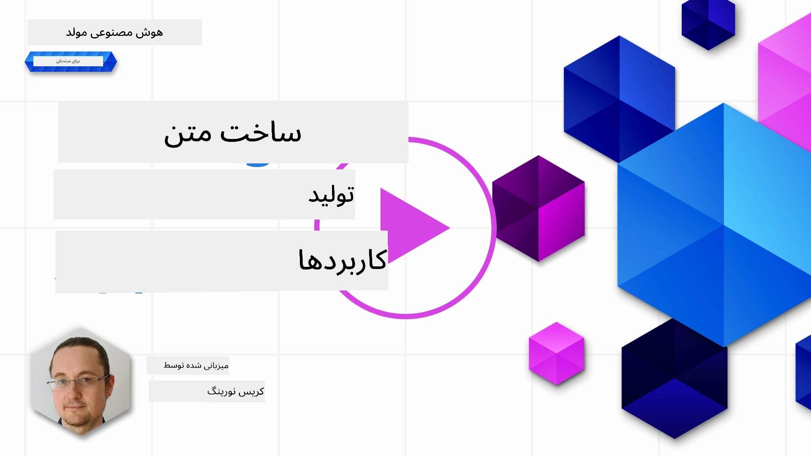

# ساخت برنامه‌های تولید متن

[](https://youtu.be/0Y5Luf5sRQA?si=t_xVg0clnAI4oUFZ)

> _(برای دیدن ویدیوی این درس، روی تصویر بالا کلیک کنید)_

تا اینجا در این برنامه درسی دیده‌اید که مفاهیم اصلی‌ای مثل درخواست‌ها (prompts) و حتی یک حوزه کامل به نام «مهندسی درخواست» وجود دارد. بسیاری از ابزارهایی که می‌توانید با آن‌ها تعامل داشته باشید مثل ChatGPT، Office 365، Microsoft Power Platform و غیره، شما را با استفاده از درخواست‌ها برای انجام کاری پشتیبانی می‌کنند.

برای اینکه چنین تجربه‌ای را به یک برنامه اضافه کنید، باید مفاهیمی مانند درخواست‌ها، تکمیل‌ها را درک کنید و کتابخانه‌ای را برای کار انتخاب کنید. این دقیقاً همان چیزی است که در این فصل یاد خواهید گرفت.

## مقدمه

در این فصل، شما:

- درباره کتابخانه openai و مفاهیم اصلی آن یاد می‌گیرید.
- یک برنامه تولید متن با استفاده از openai می‌سازید.
- می‌آموزید چگونه از مفاهیمی مانند درخواست (prompt)، دما (temperature) و توکن‌ها برای ساختن برنامه تولید متن استفاده کنید.

## اهداف یادگیری

در پایان این درس، شما قادر خواهید بود:

- توضیح دهید برنامه تولید متن چیست.
- یک برنامه تولید متن با استفاده از openai بسازید.
- برنامه خود را تنظیم کنید تا از توکن‌های بیشتر یا کمتر استفاده کند و همچنین دما را تغییر دهید تا خروجی متنوعی داشته باشید.

## برنامه تولید متن چیست؟

معمولاً وقتی برنامه‌ای می‌سازید، یک نوع واسط دارد مثل موارد زیر:

- مبتنی بر فرمان. برنامه‌های کنسولی معمولی برنامه‌هایی هستند که شما فرمانی تایپ می‌کنید و آن دستور کاری انجام می‌دهد. به عنوان مثال، `git` یک برنامه مبتنی بر فرمان است.
- واسط کاربر (UI). برخی برنامه‌ها دارای واسط گرافیکی کاربر (GUI) هستند که در آن روی دکمه‌ها کلیک می‌کنید، متن وارد می‌کنید، گزینه‌ای را انتخاب می‌کنید و غیره.

### برنامه‌های کنسولی و UI محدودیت دارند

آن‌ها را با یک برنامه مبتنی بر فرمان که در آن فرمان تایپ می‌کنید مقایسه کنید:

- **محدود است**. نمی‌توانید هر فرمانی را تایپ کنید، فقط فرمان‌هایی که برنامه پشتیبانی می‌کند.
- **مخصوص زبان خاص**. برخی برنامه‌ها از زبان‌های زیادی پشتیبانی می‌کنند اما به طور پیش‌فرض برنامه برای یک زبان مشخص ساخته شده است، حتی اگر بتوانید پشتیبانی از زبان‌های دیگر اضافه کنید.

### مزایای برنامه‌های تولید متن

پس برنامه تولید متن چه تفاوتی دارد؟

در یک برنامه تولید متن، شما انعطاف‌پذیری بیشتری دارید، محدود به مجموعه‌ای از فرمان‌ها یا زبان ورودی خاص نیستید. به جای آن، می‌توانید با زبان طبیعی با برنامه تعامل کنید. مزیت دیگر این است که شما در حال حاضر با یک منبع داده که روی یک مجموعه عظیمی از اطلاعات آموزش دیده تعامل دارید، در حالی که یک برنامه سنتی ممکن است محدود به داده‌های پایگاه داده باشد.

### چه چیزهایی می‌توانم با برنامه تولید متن بسازم؟

چیزهای زیادی می‌توانید بسازید. برای مثال:

- **چت‌بات**. یک چت‌بات که به سوالاتی درباره موضوعاتی مانند شرکت شما و محصولاتش پاسخ می‌دهد می‌تواند گزینه خوبی باشد.
- **دستیار**. مدل‌های زبان بزرگ برای کارهایی مانند خلاصه‌سازی متن، استخراج اطلاعات از متن، تولید متنی مثل رزومه و موارد بیشتر عالی هستند.
- **دستیار کدنویسی**. بسته به مدل زبان که استفاده می‌کنید، می‌توانید دستیار کدنویسی بسازید که به شما در نوشتن کد کمک کند. برای مثال، محصولی مانند GitHub Copilot و ChatGPT می‌توانند در نوشتن کد به شما کمک کنند.

## چگونه شروع کنم؟

خب، باید راهی برای ادغام با یک مدل زبان بزرگ (LLM) پیدا کنید که معمولاً شامل دو رویکرد زیر است:

- استفاده از API. در اینجا شما درخواست‌های وب را با درخواست خود می‌سازید و متن تولید شده را دریافت می‌کنید.
- استفاده از کتابخانه. کتابخانه‌ها به کپسوله‌سازی تماس‌های API کمک می‌کنند و استفاده از آن‌ها را آسان‌تر می‌کنند.

## کتابخانه‌ها / SDK ها

چند کتابخانه معروف برای کار با مدل‌های زبان بزرگ وجود دارد مانند:

- **openai**، این کتابخانه اتصال به مدل شما و ارسال درخواست‌ها را آسان می‌کند.

سپس کتابخانه‌هایی وجود دارند که در سطح بالاتر کار می‌کنند مانند:

- **Langchain**. Langchain شناخته شده است و از پایتون پشتیبانی می‌کند.
- **Semantic Kernel**. Semantic Kernel یک کتابخانه توسط مایکروسافت است که از زبان‌های C#، پایتون و جاوا پشتیبانی می‌کند.

## اولین برنامه با استفاده از openai

بیایید ببینیم چگونه اولین برنامه خود را بسازیم، به چه کتابخانه‌هایی نیاز داریم، مقدار لازم و غیره.

### نصب openai

کتابخانه‌های زیادی برای تعامل با OpenAI یا Azure OpenAI وجود دارد. ممکن است از زبان‌های برنامه‌نویسی مختلفی مانند C#، پایتون، جاوا اسکریپت، جاوا و غیره استفاده شود. ما تصمیم گرفتیم از کتابخانه پایتون `openai` استفاده کنیم، پس با `pip` آن را نصب خواهیم کرد.

```bash
pip install openai
```

### ایجاد یک منبع (Resource)

شما باید مراحل زیر را انجام دهید:

- ایجاد یک حساب کاربری در Azure [https://azure.microsoft.com/free/](https://azure.microsoft.com/free/?WT.mc_id=academic-105485-koreyst).
- دسترسی به Azure OpenAI را دریافت کنید. به [https://learn.microsoft.com/azure/ai-services/openai/overview#how-do-i-get-access-to-azure-openai](https://learn.microsoft.com/azure/ai-services/openai/overview#how-do-i-get-access-to-azure-openai?WT.mc_id=academic-105485-koreyst) بروید و درخواست دسترسی دهید.

  > [!NOTE]
  > در زمان نگارش، باید برای دسترسی به Azure OpenAI درخواست دهید.

- نصب پایتون <https://www.python.org/>
- ایجاد یک منبع Azure OpenAI. این راهنما را برای [ایجاد منبع](https://learn.microsoft.com/azure/ai-services/openai/how-to/create-resource?pivots=web-portal?WT.mc_id=academic-105485-koreyst) مشاهده کنید.

### پیدا کردن کلید API و نقطه انتهایی (endpoint)

در این مرحله، باید به کتابخانه `openai` بگویید از چه کلید API استفاده کند. برای پیدا کردن کلید API خود، به بخش «Keys and Endpoint» منبع Azure OpenAI خود بروید و مقدار «Key 1» را کپی کنید.


حالا که این اطلاعات را کپی کردید، به کتابخانه‌ها یاد می‌دهیم که از آن استفاده کنند.

> [!NOTE]
> بهتر است کلید API خود را از کد جدا کنید. می‌توانید با استفاده از متغیرهای محیطی این کار را انجام دهید.
>
> - متغیر محیطی `OPENAI_API_KEY` را به کلید API خود تنظیم کنید.
>   `export OPENAI_API_KEY='sk-...'`

### راه‌اندازی پیکربندی Azure

اگر از Azure OpenAI (که اکنون بخشی از Microsoft Foundry است) استفاده می‌کنید، این‌گونه پیکربندی را انجام دهید. ما از کلاینت استاندارد `OpenAI` استفاده می‌کنیم که به نقطه انتهایی `/openai/v1/` در Azure OpenAI اشاره دارد، که با API پاسخ‌ها کار می‌کند و نیازی به `api_version` ندارد:

```python
import os
from openai import OpenAI

client = OpenAI(
    api_key=os.environ["AZURE_OPENAI_API_KEY"],
    base_url=f"{os.environ['AZURE_OPENAI_ENDPOINT'].rstrip('/')}/openai/v1/",
)
```

در بالا ما موارد زیر را تنظیم می‌کنیم:

- `api_key`، این کلید API شماست که در پورتال Azure یا Microsoft Foundry یافت می‌شود.
- `base_url`، این نقطه انتهایی منبع Foundry شما است که `/openai/v1/` در انتهای آن اضافه شده است. نقطه انتهایی پایدار v1 بین OpenAI و Azure OpenAI بدون مدیریت `api_version` کار می‌کند.

> [!NOTE] > `os.environ` متغیرهای محیطی را می‌خواند. می‌توانید برای خواندن متغیرهای محیطی مانند `AZURE_OPENAI_API_KEY` و `AZURE_OPENAI_ENDPOINT` از آن استفاده کنید. این متغیرهای محیطی را در ترمینال تنظیم کنید یا از کتابخانه‌ای مانند `dotenv` استفاده کنید.

## تولید متن

روش تولید متن استفاده از API پاسخ‌ها (Responses API) از طریق متد `responses.create` است. در اینجا یک مثال است:

```python
prompt = "Complete the following: Once upon a time there was a"

response = client.responses.create(
    model="gpt-4o-mini",  # این نام استقرار مدل شما است
    input=prompt,
    store=False,
)
print(response.output_text)
```

در کد بالا، یک پاسخ ایجاد می‌کنیم و مدل و درخواست مورد نظر را می‌فرستیم. سپس متن تولید شده را از طریق `response.output_text` چاپ می‌کنیم.

### گفتگوهای چند نوبتی

API پاسخ‌ها برای تولید متن تک‌نوبتی و همچنین چت‌بات‌های چندنوبتی مناسب است - شما یک لیست پیام‌ها در `input` می‌دهید تا مکالمه‌ای ساخته شود:

```python
from openai import OpenAI

client = OpenAI(api_key="sk-...")

response = client.responses.create(model="gpt-4o-mini", input="Hello world", store=False)
print(response.output_text)
```

درباره این قابلیت در فصلی آینده بیشتر توضیح خواهیم داد.

## تمرین - اولین برنامه تولید متن شما

حال که یاد گرفتیم چگونه openai را راه‌اندازی و پیکربندی کنیم، وقت ساخت اولین برنامه تولید متن شماست. برای ساخت برنامه مراحل زیر را دنبال کنید:

1. یک محیط مجازی ایجاد کنید و openai را نصب کنید:

   ```bash
   python -m venv venv
   source venv/bin/activate
   pip install openai
   ```

   > [!NOTE]
   > اگر ویندوز استفاده می‌کنید به جای `source venv/bin/activate` بنویسید `venv\Scripts\activate`.

   > [!NOTE]
   > کلید Azure OpenAI خود را با رفتن به [https://portal.azure.com/](https://portal.azure.com/?WT.mc_id=academic-105485-koreyst) و جستجوی `Open AI` پیدا کنید، سپس `Open AI resource` را انتخاب کنید، بعد به `Keys and Endpoint` بروید و مقدار `Key 1` را کپی کنید.

1. یک فایل _app.py_ ایجاد کنید و کد زیر را در آن قرار دهید:

   ```python
   import os
   from openai import OpenAI

   client = OpenAI(
       api_key="<replace this value with your Azure OpenAI key>",
       base_url="<endpoint found in Azure Portal>/openai/v1/",
   )
   deployment_name = "<deployment name>"

   # کد تکمیل خود را اضافه کنید
   prompt = "Complete the following: Once upon a time there was a"

   # با استفاده از API پاسخ‌ها یک درخواست بسازید
   response = client.responses.create(model=deployment_name, input=prompt, store=False)

   # پاسخ را چاپ کنید
   print(response.output_text)
   ```

   > [!NOTE]
   > اگر از OpenAI عادی (نه Azure) استفاده می‌کنید، از `client = OpenAI(api_key="<replace this value with your OpenAI key>")` (بدون `base_url`) استفاده کنید و به جای نام استقرار، نام مدلی مثل `gpt-4o-mini` بگذارید.

   باید خروجی مشابه زیر را ببینید:

   ```output
    very unhappy _____.

   Once upon a time there was a very unhappy mermaid.
   ```

## انواع مختلف درخواست‌ها برای کارهای مختلف

حالا دیده‌اید چگونه می‌توان متن را با استفاده از یک درخواست (prompt) تولید کرد. حتی برنامه‌ای دارید که اجرا می‌شود و می‌توانید آن را تغییر داده و نوع‌های مختلف متن تولید کنید.

درخواست‌ها برای انواع انجام کارها کاربرد دارند. برای مثال:

- **تولید نوعی متن**. به عنوان مثال، می‌توانید شعر، سوالات برای یک آزمون و غیره تولید کنید.
- **جستجوی اطلاعات**. می‌توانید از درخواست‌ها برای یافتن اطلاعات استفاده کنید، مثلاً پرسیدن «CORS در توسعه وب چه معنی می‌دهد؟».
- **تولید کد**. می‌توانید از درخواست‌ها برای تولید کد استفاده کنید، مثلاً توسعه یک عبارت منظم برای اعتبارسنجی ایمیل‌ها یا حتی تولید برنامه کاملی مانند یک برنامه وب.

## یک مورد عملی‌تر: تولید کننده دستور پخت

فرض کنید مواد غذایی در خانه دارید و می‌خواهید چیزی بپزید. برای این کار به یک دستور پخت نیاز دارید. راهی برای پیدا کردن دستور پخت استفاده از موتور جستجو یا مدل زبان بزرگ (LLM) است.

می‌توانید چنین درخواستی بنویسید:

> "به من ۵ دستور پخت برای غذایی با مواد زیر نشان بده: مرغ، سیب‌زمینی و هویج. برای هر دستور، همه مواد استفاده شده را فهرست کن"

با این درخواست ممکن است پاسخی به شکل زیر دریافت کنید:

```output
1. Roasted Chicken and Vegetables:
Ingredients:
- 4 chicken thighs
- 2 potatoes, cut into cubes
- 2 carrots, cut into cubes
- 2 tablespoons olive oil
- 2 cloves garlic, minced
- 1 teaspoon dried thyme
- 1 teaspoon dried oregano
- Salt and pepper, to taste

2. Chicken and Potato Stew:
Ingredients:
- 2 tablespoons olive oil
- 1 onion, diced
- 2 cloves garlic, minced
- 2 chicken breasts, cut into cubes
- 2 potatoes, cut into cubes
- 2 carrots, cut into cubes
- 1 teaspoon dried oregano
- 1 teaspoon dried thyme
- 1 cup chicken broth
- Salt and pepper, to taste

3. Chicken and Potato Bake:
Ingredients:
- 2 tablespoons olive oil
- 2 chicken breasts, cut into cubes
- 2 potatoes, cut into cubes
- 2 carrots, cut into cubes
- 1 onion, diced
- 2 cloves garlic, minced
- 1 teaspoon dried oregano
- 1 teaspoon dried thyme
- 1 cup chicken broth
- Salt and pepper, to taste

4. Chicken and Potato Soup:
Ingredients:
- 2 tablespoons olive oil
- 1 onion, diced
- 2 cloves garlic, minced
- 2 chicken breasts, cut into cubes
- 2 potatoes, cut into cubes
- 2 carrots, cut into cubes
- 1 teaspoon dried oregano
- 1 teaspoon dried thyme
- 4 cups chicken broth
- Salt and pepper, to taste

5. Chicken and Potato Hash:
Ingredients:
- 2 tablespoons olive oil
- 2 chicken breasts, cut into cubes
- 2 potatoes, cut into cubes
- 2 carrots, cut into cubes
- 1 onion, diced
- 2 cloves garlic, minced
- 1 teaspoon dried oregano
```

این نتیجه عالی است، می‌دانم چه چیزی بپزم. در این مرحله، بهبودی که می‌تواند مفید باشد:

- فیلتر کردن موادی که دوست ندارم یا به آن‌ها حساسیت دارم.
- تولید یک فهرست خرید، در صورتی که همه مواد را در خانه ندارم.

برای موارد بالا، یک درخواست اضافی اضافه کنیم:

> "لطفاً دستورهایی که سیر دارند را حذف کن چون به آن حساسیت دارم و به جای آن چیزی دیگر بگذار. همچنین لطفاً فهرست خرید مربوط به دستورها را تهیه کن، در نظر داشته باش که من مرغ، سیب‌زمینی و هویج را در خانه دارم."

حالا نتیجه جدیدی دارید، یعنی:

```output
1. Roasted Chicken and Vegetables:
Ingredients:
- 4 chicken thighs
- 2 potatoes, cut into cubes
- 2 carrots, cut into cubes
- 2 tablespoons olive oil
- 1 teaspoon dried thyme
- 1 teaspoon dried oregano
- Salt and pepper, to taste

2. Chicken and Potato Stew:
Ingredients:
- 2 tablespoons olive oil
- 1 onion, diced
- 2 chicken breasts, cut into cubes
- 2 potatoes, cut into cubes
- 2 carrots, cut into cubes
- 1 teaspoon dried oregano
- 1 teaspoon dried thyme
- 1 cup chicken broth
- Salt and pepper, to taste

3. Chicken and Potato Bake:
Ingredients:
- 2 tablespoons olive oil
- 2 chicken breasts, cut into cubes
- 2 potatoes, cut into cubes
- 2 carrots, cut into cubes
- 1 onion, diced
- 1 teaspoon dried oregano
- 1 teaspoon dried thyme
- 1 cup chicken broth
- Salt and pepper, to taste

4. Chicken and Potato Soup:
Ingredients:
- 2 tablespoons olive oil
- 1 onion, diced
- 2 chicken breasts, cut into cubes
- 2 potatoes, cut into cubes
- 2 carrots, cut into cubes
- 1 teaspoon dried oregano
- 1 teaspoon dried thyme
- 4 cups chicken broth
- Salt and pepper, to taste

5. Chicken and Potato Hash:
Ingredients:
- 2 tablespoons olive oil
- 2 chicken breasts, cut into cubes
- 2 potatoes, cut into cubes
- 2 carrots, cut into cubes
- 1 onion, diced
- 1 teaspoon dried oregano

Shopping List:
- Olive oil
- Onion
- Thyme
- Oregano
- Salt
- Pepper
```

این پنج دستور پخت شماست، بدون سیر و همچنین فهرست خریدی که با مواد فعلی شما هماهنگ است.

## تمرین - ساخت تولید کننده دستور پخت

حال که سناریویی را مرور کردیم، بیایید کدی بنویسیم مطابق با آن سناریو. برای این کار مراحل زیر را دنبال کنید:

1. از فایل _app.py_ موجود به عنوان نقطه شروع استفاده کنید
1. متغیر `prompt` را پیدا کرده و کد آن را به صورت زیر تغییر دهید:

   ```python
   prompt = "Show me 5 recipes for a dish with the following ingredients: chicken, potatoes, and carrots. Per recipe, list all the ingredients used"
   ```

   اگر حالا کد را اجرا کنید، باید خروجی مشابه زیر ببینید:

   ```output
   -Chicken Stew with Potatoes and Carrots: 3 tablespoons oil, 1 onion, chopped, 2 cloves garlic, minced, 1 carrot, peeled and chopped, 1 potato, peeled and chopped, 1 bay leaf, 1 thyme sprig, 1/2 teaspoon salt, 1/4 teaspoon black pepper, 1 1/2 cups chicken broth, 1/2 cup dry white wine, 2 tablespoons chopped fresh parsley, 2 tablespoons unsalted butter, 1 1/2 pounds boneless, skinless chicken thighs, cut into 1-inch pieces
   -Oven-Roasted Chicken with Potatoes and Carrots: 3 tablespoons extra-virgin olive oil, 1 tablespoon Dijon mustard, 1 tablespoon chopped fresh rosemary, 1 tablespoon chopped fresh thyme, 4 cloves garlic, minced, 1 1/2 pounds small red potatoes, quartered, 1 1/2 pounds carrots, quartered lengthwise, 1/2 teaspoon salt, 1/4 teaspoon black pepper, 1 (4-pound) whole chicken
   -Chicken, Potato, and Carrot Casserole: cooking spray, 1 large onion, chopped, 2 cloves garlic, minced, 1 carrot, peeled and shredded, 1 potato, peeled and shredded, 1/2 teaspoon dried thyme leaves, 1/4 teaspoon salt, 1/4 teaspoon black pepper, 2 cups fat-free, low-sodium chicken broth, 1 cup frozen peas, 1/4 cup all-purpose flour, 1 cup 2% reduced-fat milk, 1/4 cup grated Parmesan cheese

   -One Pot Chicken and Potato Dinner: 2 tablespoons olive oil, 1 pound boneless, skinless chicken thighs, cut into 1-inch pieces, 1 large onion, chopped, 3 cloves garlic, minced, 1 carrot, peeled and chopped, 1 potato, peeled and chopped, 1 bay leaf, 1 thyme sprig, 1/2 teaspoon salt, 1/4 teaspoon black pepper, 2 cups chicken broth, 1/2 cup dry white wine

   -Chicken, Potato, and Carrot Curry: 1 tablespoon vegetable oil, 1 large onion, chopped, 2 cloves garlic, minced, 1 carrot, peeled and chopped, 1 potato, peeled and chopped, 1 teaspoon ground coriander, 1 teaspoon ground cumin, 1/2 teaspoon ground turmeric, 1/2 teaspoon ground ginger, 1/4 teaspoon cayenne pepper, 2 cups chicken broth, 1/2 cup dry white wine, 1 (15-ounce) can chickpeas, drained and rinsed, 1/2 cup raisins, 1/2 cup chopped fresh cilantro
   ```

   > توجه، مدل زبان بزرگ شما غیرقطعی است، بنابراین ممکن است هر بار اجرای برنامه نتایج متفاوتی بگیرید.

   عالی است، بیایید ببینیم چگونه می‌توانیم پیشرفت کنیم. برای بهبود، می‌خواهیم کد انعطاف‌پذیر باشد تا مواد و تعداد دستورها قابل تغییر باشند.

1. کد را به صورت زیر تغییر دهیم:

   ```python
   no_recipes = input("No of recipes (for example, 5): ")

   ingredients = input("List of ingredients (for example, chicken, potatoes, and carrots): ")

   # تعداد دستورهای آشپزی را در متن درخواست و مواد اولیه وارد کنید
   prompt = f"Show me {no_recipes} recipes for a dish with the following ingredients: {ingredients}. Per recipe, list all the ingredients used"
   ```

   اجرای آزمایشی کد می‌تواند به صورت زیر باشد:

   ```output
   No of recipes (for example, 5): 3
   List of ingredients (for example, chicken, potatoes, and carrots): milk,strawberries

   -Strawberry milk shake: milk, strawberries, sugar, vanilla extract, ice cubes
   -Strawberry shortcake: milk, flour, baking powder, sugar, salt, unsalted butter, strawberries, whipped cream
   -Strawberry milk: milk, strawberries, sugar, vanilla extract
   ```

### بهبود با افزودن فیلتر و فهرست خرید

اکنون برنامه‌ای داریم که قادر است دستور پخت تولید کند و انعطاف‌پذیر است چون براساس ورودی‌های کاربر، هم در تعداد دستورها و هم مواد استفاده شده، عمل می‌کند.

برای بهبود بیشتر، می‌خواهیم موارد زیر را اضافه کنیم:

- **فیلتر کردن مواد**. می‌خواهیم بتوانیم موادی که دوست نداریم یا به آن حساسیت داریم را حذف کنیم. برای این کار می‌توانیم درخواست موجود را ویرایش کرده و شرط فیلتر را به انتهای آن اضافه کنیم مانند:

  ```python
  filter = input("Filter (for example, vegetarian, vegan, or gluten-free): ")

  prompt = f"Show me {no_recipes} recipes for a dish with the following ingredients: {ingredients}. Per recipe, list all the ingredients used, no {filter}"
  ```

  در بالا، `{filter}` را به انتهای درخواست اضافه کردیم و همچنین مقدار فیلتر را از کاربر گرفتیم.

  یک ورودی نمونه برای اجرای برنامه اکنون می‌تواند به این شکل باشد:

  ```output
  No of recipes (for example, 5): 3
  List of ingredients (for example, chicken, potatoes, and carrots): onion,milk
  Filter (for example, vegetarian, vegan, or gluten-free): no milk

  1. French Onion Soup

  Ingredients:

  -1 large onion, sliced
  -3 cups beef broth
  -1 cup milk
  -6 slices french bread
  -1/4 cup shredded Parmesan cheese
  -1 tablespoon butter
  -1 teaspoon dried thyme
  -1/4 teaspoon salt
  -1/4 teaspoon black pepper

  Instructions:

  1. In a large pot, sauté onions in butter until golden brown.
  2. Add beef broth, milk, thyme, salt, and pepper. Bring to a boil.
  3. Reduce heat and simmer for 10 minutes.
  4. Place french bread slices on soup bowls.
  5. Ladle soup over bread.
  6. Sprinkle with Parmesan cheese.

  2. Onion and Potato Soup

  Ingredients:

  -1 large onion, chopped
  -2 cups potatoes, diced
  -3 cups vegetable broth
  -1 cup milk
  -1/4 teaspoon black pepper

  Instructions:

  1. In a large pot, sauté onions in butter until golden brown.
  2. Add potatoes, vegetable broth, milk, and pepper. Bring to a boil.
  3. Reduce heat and simmer for 10 minutes.
  4. Serve hot.

  3. Creamy Onion Soup

  Ingredients:

  -1 large onion, chopped
  -3 cups vegetable broth
  -1 cup milk
  -1/4 teaspoon black pepper
  -1/4 cup all-purpose flour
  -1/2 cup shredded Parmesan cheese

  Instructions:

  1. In a large pot, sauté onions in butter until golden brown.
  2. Add vegetable broth, milk, and pepper. Bring to a boil.
  3. Reduce heat and simmer for 10 minutes.
  4. In a small bowl, whisk together flour and Parmesan cheese until smooth.
  5. Add to soup and simmer for an additional 5 minutes, or until soup has thickened.
  ```

  همانطور که می‌بینید، هر دستوری که شیر دارد فیلتر شده است. اما اگر به لاکتیز حساس باشید، ممکن است بخواهید دستورهایی با پنیر را هم فیلتر کنید، بنابراین باید واضح باشید.


- **فهرست خرید بسازید**. می‌خواهیم یک فهرست خرید تولید کنیم، با توجه به آنچه در خانه داریم.

  برای این عملکرد، می‌توانیم همه چیز را در یک پرس‌وجو حل کنیم یا آن را به دو پرس‌وجو تقسیم کنیم. بیایید رویکرد دوم را امتحان کنیم. اینجا پیشنهاد می‌کنیم یک پرس‌وجوی اضافی اضافه کنیم، اما برای اینکه این کار جواب دهد، باید نتیجه پرس‌وجوی اول را به عنوان زمینه به پرس‌وجوی دوم اضافه کنیم.

  قسمت کدی که نتیجه پرس‌وجوی اول را چاپ می‌کند پیدا کنید و کد زیر را در پایین آن اضافه کنید:

  ```python
  old_prompt_result = response.output_text
  prompt = "Produce a shopping list for the generated recipes and please don't include ingredients that I already have."

  new_prompt = f"{old_prompt_result} {prompt}"
  response = client.responses.create(model=deployment_name, input=new_prompt, max_output_tokens=1200, store=False)

  # پاسخ را چاپ کن
  print("Shopping list:")
  print(response.output_text)
  ```

  به نکات زیر توجه کنید:

  1. ما یک پرس‌وجوی جدید می‌سازیم با اضافه کردن نتیجه پرس‌وجوی اول به پرس‌وجوی جدید:

     ```python
     new_prompt = f"{old_prompt_result} {prompt}"
     ```

  1. یک درخواست جدید می‌فرستیم، ولی در نظر می‌گیریم تعداد توکن‌هایی که در پرس‌وجوی اول درخواست دادیم، بنابراین این بار می‌گوییم `max_output_tokens` برابر با 1200 باشد.

     ```python
     response = client.responses.create(model=deployment_name, input=new_prompt, max_output_tokens=1200, store=False)
     ```

     با اجرای این کد، اکنون به خروجی زیر می‌رسیم:

     ```output
     No of recipes (for example, 5): 2
     List of ingredients (for example, chicken, potatoes, and carrots): apple,flour
     Filter (for example, vegetarian, vegan, or gluten-free): sugar


     -Apple and flour pancakes: 1 cup flour, 1/2 tsp baking powder, 1/2 tsp baking soda, 1/4 tsp salt, 1 tbsp sugar, 1 egg, 1 cup buttermilk or sour milk, 1/4 cup melted butter, 1 Granny Smith apple, peeled and grated
     -Apple fritters: 1-1/2 cups flour, 1 tsp baking powder, 1/4 tsp salt, 1/4 tsp baking soda, 1/4 tsp nutmeg, 1/4 tsp cinnamon, 1/4 tsp allspice, 1/4 cup sugar, 1/4 cup vegetable shortening, 1/4 cup milk, 1 egg, 2 cups shredded, peeled apples
     Shopping list:
     -Flour, baking powder, baking soda, salt, sugar, egg, buttermilk, butter, apple, nutmeg, cinnamon, allspice
     ```

## بهبود تنظیمات خود

آنچه تاکنون داریم کدی است که کار می‌کند، اما باید برخی تغییرات را برای بهبود بیشتر انجام دهیم. برخی کارهایی که باید انجام دهیم عبارتند از:

- **جدا کردن اسرار از کد**، مانند کلید API. اسرار نباید در داخل کد باشند و باید در مکانی امن ذخیره شوند. برای جدا کردن اسرار از کد، می‌توانیم از متغیرهای محیطی و کتابخانه‌هایی مانند `python-dotenv` برای بارگذاری آنها از فایل استفاده کنیم. این نحوه کار در کد است:

  1. یک فایل `.env` با محتوای زیر بسازید:

     ```bash
     OPENAI_API_KEY=sk-...
     ```

     > توجه داشته باشید، برای Azure OpenAI در Microsoft Foundry، باید به جای آن متغیرهای محیطی زیر را تنظیم کنید:

     ```bash
     AZURE_OPENAI_API_KEY=<replace>
     AZURE_OPENAI_ENDPOINT=<replace>
     AZURE_OPENAI_API_VERSION=2024-10-21
     ```

     در کد، متغیرهای محیطی را به این شکل بارگذاری می‌کنید:

     ```python
     import os
     from dotenv import load_dotenv
     from openai import OpenAI

     load_dotenv()

     client = OpenAI(api_key=os.environ["OPENAI_API_KEY"])
     ```

- **نکته‌ای درباره طول توکن**. باید در نظر بگیریم که برای تولید متنی که می‌خواهیم به چند توکن نیاز داریم. توکن‌ها هزینه دارند، پس هر جا ممکن است باید در استفاده از توکن‌ها صرفه‌جویی کنیم. برای مثال، آیا می‌توانیم پرس‌وجو را طوری تنظیم کنیم که تعداد توکن‌های کمتری مصرف کند؟

  برای تغییر توکن‌های استفاده شده، می‌توانید از پارامتر `max_output_tokens` استفاده کنید. برای مثال، اگر می‌خواهید 100 توکن استفاده کنید، به این صورت عمل می‌کنید:

  ```python
  response = client.responses.create(model=deployment, input=prompt, max_output_tokens=100, store=False)
  ```

- **آزمایش با پارامتر temperature**. دما چیزی است که تا به حال به آن اشاره نکرده‌ایم اما زمینه مهمی برای عملکرد برنامه ما است. هر چه مقدار temperature بالاتر باشد، خروجی تصادفی‌تر خواهد بود. و برعکس هر چه مقدار دما کمتر باشد، خروجی قابل پیش‌بینی‌تر است. در نظر داشته باشید که آیا می‌خواهید خروجی شما متنوع باشد یا نه.

  برای تغییر دما، می‌توانید از پارامتر `temperature` استفاده کنید. برای مثال، اگر می‌خواهید دما را روی 0.5 تنظیم کنید، به این صورت عمل کنید:

  ```python
  response = client.responses.create(model=deployment, input=prompt, temperature=0.5, store=False)
  ```

  > توجه کنید، هر چه به 1.0 نزدیک‌تر باشید، خروجی متنوع‌تر خواهد بود.

## تمرین

برای این تمرین می‌توانید انتخاب کنید چه چیزی بسازید.

در اینجا چند پیشنهاد داریم:

- برنامه تولید کننده دستور پخت را ویرایش کنید تا بیشتر بهبود یابد. با مقادیر temperature و پرس‌وجوها بازی کنید و ببینید چه چیزی می‌توانید بسازید.
- یک "همیار مطالعه" بسازید. این برنامه باید قادر باشد به سوالات درباره یک موضوع مانند پایتون پاسخ دهد. می‌توانید پرس‌وجوهایی مانند "موضوع خاصی در پایتون چیست؟"، یا پرس‌وجویی که می‌گوید، کدی برای موضوع خاصی نشان بده، داشته باشید.
- ربات تاریخ، تاریخ را زنده کنید، به ربات دستور دهید که یک شخصیت تاریخی خاص را بازی کند و از زندگی و زمان‌هایش سوال بپرسید.

## راه حل

### همیار مطالعه

در ادامه یک پرس‌وجوی شروع کننده آمده است، ببینید چگونه می‌توانید از آن استفاده کنید و آن را به دلخواه تغییر دهید.

```text
- "You're an expert on the Python language

    Suggest a beginner lesson for Python in the following format:

    Format:
    - concepts:
    - brief explanation of the lesson:
    - exercise in code with solutions"
```

### ربات تاریخ

در اینجا چند پرس‌وجو آورده شده که می‌توانید استفاده کنید:

```text
- "You are Abe Lincoln, tell me about yourself in 3 sentences, and respond using grammar and words like Abe would have used"
- "You are Abe Lincoln, respond using grammar and words like Abe would have used:

   Tell me about your greatest accomplishments, in 300 words"
```

## بررسی دانش

مفهوم temperature چه کاری انجام می‌دهد؟

1. کنترل می‌کند که خروجی چقدر تصادفی باشد.
1. کنترل می‌کند پاسخ چقدر بزرگ باشد.
1. کنترل می‌کند چند توکن استفاده شود.

## 🚀 چالش

هنگام کار روی تمرین، سعی کنید دما را تغییر دهید، آن را روی 0، 0.5 و 1 تنظیم کنید. به یاد داشته باشید که 0 کمترین تنوع و 1 بیشترین تنوع را دارد. کدام مقدار برای برنامه شما بهتر عمل می‌کند؟

## کار عالی! یادگیری خود را ادامه دهید

پس از اتمام این درس، مجموعه [Generative AI Learning](https://aka.ms/genai-collection?WT.mc_id=academic-105485-koreyst) ما را بررسی کنید تا دانش خود در زمینه هوش مصنوعی مولد را ارتقا دهید!

به درس 7 بروید که در آن نحوه [ساخت برنامه‌های چت](../07-building-chat-applications/README.md?WT.mc_id=academic-105485-koreyst) را خواهیم دید!

---

<!-- CO-OP TRANSLATOR DISCLAIMER START -->
**سلب مسئولیت**:
این سند با استفاده از سرویس ترجمه هوش مصنوعی [Co-op Translator](https://github.com/Azure/co-op-translator) ترجمه شده است. در حالی که ما در تلاش برای دقت هستیم، لطفاً توجه داشته باشید که ترجمه‌های خودکار ممکن است شامل خطاها یا نادرستی‌هایی باشند. سند اصلی به زبان مادری خود باید به عنوان منبع معتبر در نظر گرفته شود. برای اطلاعات حیاتی، ترجمه حرفه‌ای انسانی توصیه می‌شود. ما در قبال هرگونه سوء تفاهم یا برداشت نادرست ناشی از استفاده از این ترجمه مسئولیتی نداریم.
<!-- CO-OP TRANSLATOR DISCLAIMER END -->