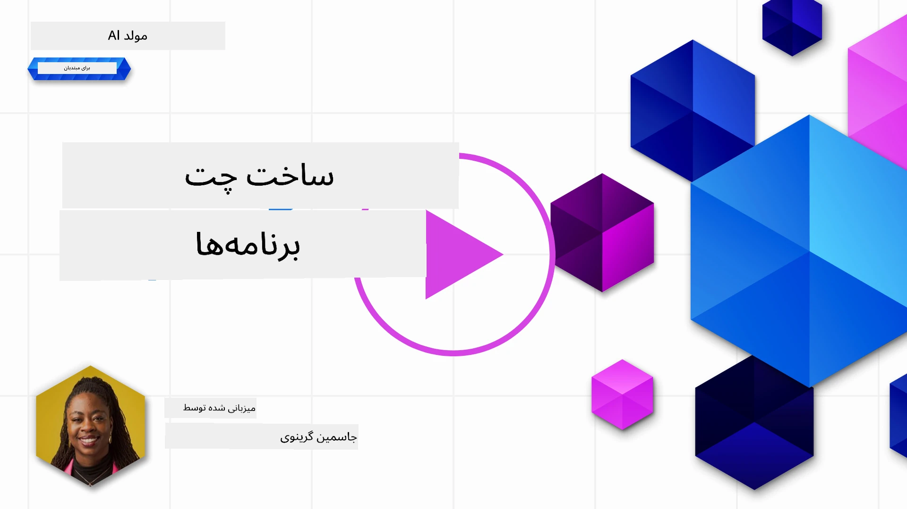
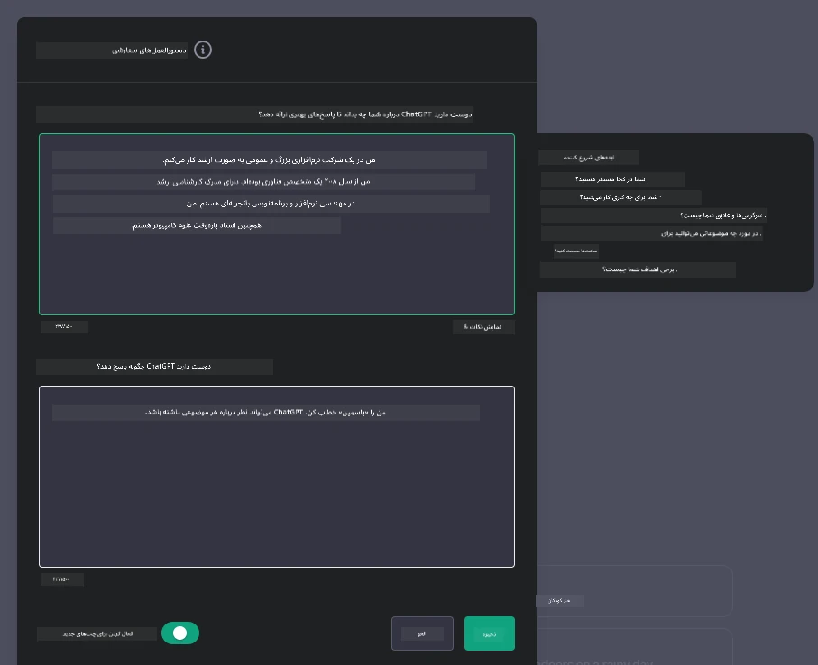
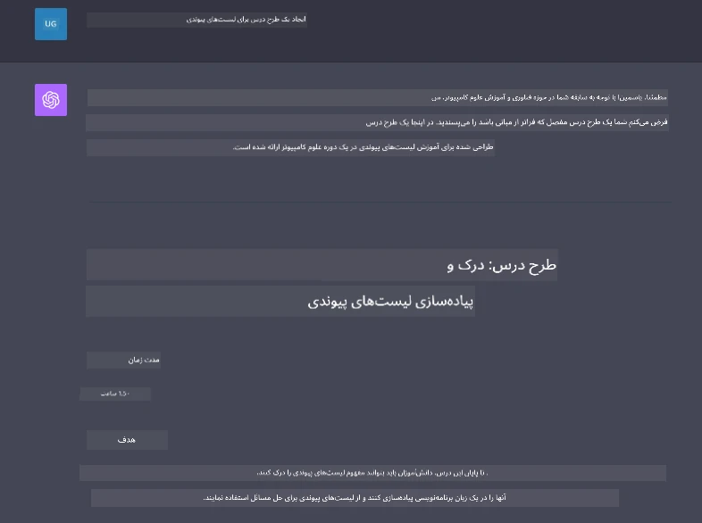

# ساخت برنامه‌های گفتگو محور مبتنی بر هوش مصنوعی مولد

[](https://youtu.be/R9V0ZY1BEQo?si=IHuU-fS9YWT8s4sA)

> _(برای مشاهده ویدیو این درس روی تصویر بالا کلیک کنید)_

حال که دیدیم چگونه می‌توان برنامه‌های تولید متن ساخت، بیایید به برنامه‌های گفتگو محور نگاه کنیم.

برنامه‌های گفتگو محور به زندگی روزمره ما پیوسته‌اند و فراتر از صرفاً وسیله‌ای برای گفتگوهای معمولی هستند. آن‌ها بخش‌های جدایی‌ناپذیر خدمات مشتری، پشتیبانی فنی، و حتی سیستم‌های مشاوره پیشرفته‌اند. احتمالاً اخیراً از یک برنامه گفتگو محور کمک گرفته‌اید. با ادغام فناوری‌های پیشرفته‌تری مانند هوش مصنوعی مولد در این پلتفرم‌ها، پیچیدگی افزایش می‌یابد و چالش‌ها نیز بیشتر می‌شوند.

برخی سوالات که باید به آن‌ها پاسخ دهیم عبارتند از:

- **ساخت برنامه**. چگونه می‌توانیم این برنامه‌های مجهز به هوش مصنوعی را برای کاربردهای خاص به‌صورت کارآمد بسازیم و به طور یکپارچه ادغام کنیم؟
- **نظارت**. پس از استقرار، چگونه می‌توانیم برنامه‌ها را تحت نظر داشته و اطمینان حاصل کنیم که از نظر عملکرد و رعایت [شش اصل هوش مصنوعی مسئولانه](https://www.microsoft.com/ai/responsible-ai?WT.mc_id=academic-105485-koreyst) در بالاترین سطح کیفیت عمل می‌کنند؟

با حرکت به سمت عصری که با اتوماسیون و تعاملات بی‌دردسر انسان و ماشین تعریف می‌شود، درک اینکه چگونه هوش مصنوعی مولد حوزه، عمق، و سازگاری برنامه‌های گفتگو محور را تغییر می‌دهد، ضروری است. این درس به بررسی جنبه‌های معماری که از این سیستم‌های پیچیده پشتیبانی می‌کند، روش‌های تنظیم دقیق برای وظایف خاص حوزه، و ارزیابی معیارها و ملاحظات مربوط به استقرار مسئولانه هوش مصنوعی خواهد پرداخت.

## مقدمه

این درس شامل موارد زیر است:

- تکنیک‌هایی برای ساخت و ادغام کارآمد برنامه‌های گفتگو محور.
- نحوه اعمال سفارشی‌سازی و تنظیم دقیق بر روی برنامه‌ها.
- استراتژی‌ها و ملاحظات برای نظارت موثر بر برنامه‌های گفتگو محور.

## اهداف یادگیری

تا پایان این درس، قادر خواهید بود:

- ملاحظات ساخت و ادغام برنامه‌های گفتگو محور در سیستم‌های موجود را شرح دهید.
- برنامه‌های گفتگو محور را برای موارد استفاده خاص سفارشی کنید.
- معیارهای کلیدی و ملاحظات برای نظارت موثر و حفظ کیفیت برنامه‌های مجهز به هوش مصنوعی را شناسایی کنید.
- اطمینان حاصل کنید که برنامه‌های گفتگو محور به طور مسئولانه از هوش مصنوعی استفاده می‌کنند.

## ادغام هوش مصنوعی مولد در برنامه‌های گفتگو محور

ارتقاء برنامه‌های گفتگو محور از طریق هوش مصنوعی مولد فقط برای هوشمندتر کردن آن‌ها نیست؛ بلکه بهینه‌سازی معماری، عملکرد، و رابط کاربری برای ارائه تجربه کاربری با کیفیت است. این شامل بررسی پایه‌های معماری، ادغام APIها، و ملاحظات رابط کاربری می‌شود. این بخش هدف دارد تا یک نقشه‌راه جامع برای پیمایش این مناظر پیچیده، چه در حال اتصال به سیستم‌های موجود باشید و چه در حال ساخت آن‌ها به صورت پلتفرم‌های مستقل، به شما ارائه دهد.

تا پایان این بخش، شما با تخصص لازم برای ساخت و ادغام کارآمد برنامه‌های گفتگو محور مجهز خواهید شد.

### چت‌بات یا برنامه گفتگو محور؟

پیش از آنکه به ساخت برنامه‌های گفتگو محور بپردازیم، بیایید «چت‌بات‌ها» را با «برنامه‌های گفتگو محور مجهز به هوش مصنوعی» مقایسه کنیم که نقش‌ها و وظایف متفاوتی دارند. هدف اصلی یک چت‌بات خودکارسازی وظایف محاوره‌ای خاص مانند پاسخ به سوالات متداول یا پیگیری بسته است. این معمولاً بر اساس منطق قواعد یا الگوریتم‌های هوش مصنوعی پیچیده اداره می‌شود. در مقابل، برنامه گفتگو محور مجهز به هوش مصنوعی محیطی بسیار گسترده‌تر است که برای تسهیل انواع مختلف ارتباطات دیجیتال، مانند چت متنی، صوتی و تصویری بین کاربران انسانی طراحی شده است. ویژگی متمایز آن ادغام یک مدل هوش مصنوعی مولد است که گفتگوهای ظریف و شبیه انسان را شبیه‌سازی می‌کند و پاسخ‌ها را بر اساس ورودی‌ها و زمینه‌های متنوع ایجاد می‌کند. برنامه گفتگو محور مجهز به هوش مصنوعی مولد می‌تواند در بحث‌های باز حوزه شرکت کند، به زمینه‌های در حال تغییر گفتگو سازگار شود و حتی دیالوگ‌های خلاقانه یا پیچیده‌ای تولید کند.

جدول زیر تفاوت‌ها و شباهت‌های کلیدی را برای کمک به درک نقش‌های منحصر به فرد آن‌ها در ارتباطات دیجیتال نشان می‌دهد.

| چت‌بات                               | برنامه گفتگو محور مجهز به هوش مصنوعی مولد               |
| ------------------------------------- | -------------------------------------- |
| متمرکز بر وظیفه و مبتنی بر قواعد        | آگاه به زمینه                                    |
| اغلب در سیستم‌های بزرگ‌تر یکپارچه شده  | ممکن است میزبان یک یا چند چت‌بات باشد          |
| محدود به عملکردهای برنامه‌ریزی شده     | شامل مدل‌های هوش مصنوعی مولد                      |
| تعاملات تخصصی و ساختاریافته           | قابلیت بحث‌های باز حوزه                            |

### استفاده از قابلیت‌های از پیش ساخته شده با SDKها و APIها

هنگام ساخت یک برنامه گفتگو محور، گام اول عالی ارزیابی آنچه از قبل موجود است می‌باشد. استفاده از SDKها و APIها برای ساخت برنامه‌های گفتگو محور یک استراتژی مفید به دلایل مختلف است. با ادغام SDKها و APIهای مستند شده خوب، شما برنامه خود را برای موفقیت بلندمدت قرار می‌دهید و دغدغه‌های مقیاس‌پذیری و نگهداری را مدیریت می‌کنید.

- **شتاب در فرآیند توسعه و کاهش بار کاری**: تکیه بر قابلیت‌های از پیش ساخته شده به جای فرایند پرهزینه ساخت آن‌ها به شما امکان می‌دهد بر جنبه‌های دیگر برنامه خود مانند منطق کسب‌وکار تمرکز کنید.
- **عملکرد بهتر**: هنگام ساخت عملکرد از صفر، در نهایت از خود می‌پرسید "چگونه مقیاس می‌یابد؟ آیا این برنامه قادر به مدیریت هجوم ناگهانی کاربران است؟" SDKها و APIهای خوب نگهداری شده اغلب راه‌حل‌های تعبیه شده برای این مسائل دارند.
- **نگهداری آسان‌تر**: به روزرسانی‌ها و بهبودها آسان‌تر مدیریت می‌شوند زیرا بیشتر APIها و SDKها فقط نیاز به به‌روزرسانی یک کتابخانه هنگام انتشار نسخه جدید دارند.
- **دسترسی به فناوری پیشرفته**: استفاده از مدل‌هایی که با دقت تنظیم و روی داده‌های گسترده آموزش دیده‌اند، امکانات زبان طبیعی را به برنامه شما می‌دهد.

دسترسی به قابلیت‌های یک SDK یا API معمولاً شامل گرفتن اجازه برای استفاده از سرویس‌های ارائه شده است که غالباً از طریق کلید منحصر به فرد یا توکن احراز هویت انجام می‌شود. ما از کتابخانه پایتون OpenAI برای بررسی این فرآیند استفاده خواهیم کرد. شما همچنین می‌توانید خودتان [دفترچه یادداشت OpenAI](./python/oai-assignment.ipynb?WT.mc_id=academic-105485-koreyst) یا [دفترچه یادداشت Azure OpenAI Services](./python/aoai-assignment.ipynb?WT.mc_id=academic-105485-koreys) این درس را امتحان کنید.

```python
import os
from openai import OpenAI

API_KEY = os.getenv("OPENAI_API_KEY","")

client = OpenAI(
    api_key=API_KEY
    )

response = client.responses.create(model="gpt-4o-mini", input="Suggest two titles for an instructional lesson on chat applications for generative AI.", store=False)
print(response.output_text)
```

مثال بالا از مدل GPT-4o mini همراه با API پاسخ‌ها برای تکمیل درخواست استفاده می‌کند، اما توجه کنید که کلید API قبل از انجام این کار تنظیم شده است. در صورت عدم تنظیم کلید، با خطا مواجه خواهید شد.

## تجربه کاربری (UX)

اصول کلی تجربه کاربری برای برنامه‌های گفتگو محور صدق می‌کند، اما برخی ملاحظات اضافی به دلیل اجزای یادگیری ماشین اهمیت ویژه‌ای می‌یابند.

- **مکانیزمی برای رفع ابهام**: مدل‌های هوش مصنوعی مولد گاهی پاسخ‌های مبهم تولید می‌کنند. ویژگی‌ای که به کاربران اجازه می‌دهد برای شفاف‌سازی سوال کنند می‌تواند مفید باشد.
- **حفظ زمینه**: مدل‌های پیشرفته هوش مصنوعی مولد توانایی به خاطر سپردن زمینه گفتگو را دارند که دارایی مهمی برای تجربه کاربری است. دادن امکان کنترل و مدیریت زمینه به کاربران، تجربه کاربری را بهبود می‌بخشد اما ریسک نگهداری اطلاعات حساس را به همراه دارد. ملاحظاتی مانند مدت نگهداری این اطلاعات، از جمله معرفی سیاست نگهداری، می‌تواند نیاز به حفظ زمینه را با حفظ حریم خصوصی متعادل کند.
- **شخصی‌سازی**: با توانایی یادگیری و سازگاری، مدل‌های هوش مصنوعی تجربه‌ای فردی برای کاربران ارائه می‌دهند. سفارشی‌سازی تجربه کاربری از طریق ویژگی‌هایی مانند پروفایل‌های کاربری نه تنها باعث احساس درک شدن کاربر می‌شود بلکه به یافتن پاسخ‌های خاص کمک کرده و تعامل کارآمد و رضایت‌بخش‌تری ایجاد می‌کند.

نمونه‌ای از شخصی‌سازی، تنظیمات "دستورالعمل‌های سفارشی" در ChatGPT شرکت OpenAI است. این امکان به شما اجازه می‌دهد اطلاعاتی درباره خودتان که ممکن است برای درخواست‌هایتان زمینه مهمی باشد، ارائه دهید. اینجا مثالی از یک دستورالعمل سفارشی است.



این "پروفایل" ChatGPT را ترغیب می‌کند تا یک برنامه درسی درباره لیست‌های پیوندی ایجاد کند. دقت کنید که ChatGPT در نظر می‌گیرد که کاربر ممکن است بر اساس تجربه خود بخواهد برنامه درسی عمیق‌تری داشته باشد.



### چارچوب پیام سیستمی مایکروسافت برای مدل‌های زبان بزرگ

[مایکروسافت راهنمایی](https://learn.microsoft.com/azure/ai-services/openai/concepts/system-message#define-the-models-output-format?WT.mc_id=academic-105485-koreyst) برای نوشتن پیام‌های سیستمی موثر هنگام تولید پاسخ از LLMها ارائه کرده است که به ۴ بخش تقسیم می‌شود:

1. تعریف مخاطب مدل، همچنین قابلیت‌ها و محدودیت‌های آن.
2. تعریف فرمت خروجی مدل.
3. ارائه مثال‌های مشخص که رفتار مورد نظر مدل را نشان می‌دهند.
4. ارائه راهنمایی‌های حفاظتی رفتاری اضافی.

### دسترسی‌پذیری

چه کاربری دچار ناتوانی‌های بینایی، شنیداری، حرکتی یا شناختی باشد، یک برنامه گفتگو محور طراحی شده خوب باید برای همه قابل استفاده باشد. فهرست زیر ویژگی‌های خاصی را شرح می‌دهد که برای افزایش دسترسی‌پذیری در مواجهه با ناتوانی‌های مختلف کاربران هدف قرار گرفته‌اند.

- **ویژگی‌ها برای ناتوانی بینایی**: تم‌های با کنتراست بالا و متن قابل تغییر اندازه، سازگاری با صفحه‌خوان.
- **ویژگی‌ها برای ناتوانی شنیداری**: قابلیت تبدیل متن به گفتار و گفتار به متن، نشانه‌های بصری برای اعلان‌های صوتی.
- **ویژگی‌ها برای ناتوانی حرکتی**: پشتیبانی از ناوبری با کیبورد، فرمان‌های صوتی.
- **ویژگی‌ها برای ناتوانی شناختی**: گزینه‌های زبان ساده‌شده.

## سفارشی‌سازی و تنظیم دقیق برای مدل‌های زبان حوزه خاص

تصور کنید برنامه گفتگویی که زبان تخصصی شرکت شما را درک می‌کند و پرسش‌های متداول کاربرانش را پیش‌بینی می‌کند. چند رویکرد که ارزش اشاره دارند وجود دارد:

- **استفاده از مدل‌های زبان حوزه خاص (DSL)**. DSL مخفف domain specific language است. شما می‌توانید از مدل DSL آموزش دیده در یک حوزه خاص برای درک مفاهیم و سناریوهای آن استفاده کنید.
- **اعمال تنظیم دقیق**. تنظیم دقیق فرایند آموزش بیشتر مدل شما با داده‌های خاص است.

## سفارشی‌سازی: استفاده از DSL

استفاده از مدل‌های زبان حوزه خاص (DSL Models) می‌تواند باعث افزایش مشارکت کاربر شود چرا که تعاملات تخصصی و مرتبط با زمینه را فراهم می‌کند. این مدلی است که برای درک و تولید متن مرتبط با یک حوزه، صنعت یا موضوع مشخص آموزش یا تنظیم دقیق شده است. گزینه‌های استفاده از مدل DSL می‌تواند از آموزش مدل از صفر تا استفاده از مدل‌های موجود از طریق SDK و API متفاوت باشد. گزینه دیگر، تنظیم دقیق است که شامل استفاده از مدل پیش‌آموزش دیده موجود و سازگار کردن آن برای یک حوزه خاص می‌باشد.

## سفارشی‌سازی: اعمال تنظیم دقیق

تنظیم دقیق معمولاً زمانی در نظر گرفته می‌شود که یک مدل پیش‌آموزش دیده در حوزه تخصصی یا وظیفه خاص کم می‌آورد.

به عنوان مثال، پرسش‌های پزشکی پیچیده‌اند و نیاز به زمینه زیادی دارند. وقتی یک پزشک بیمار را تشخیص می‌دهد، این بر اساس مجموعه‌ای از عوامل مانند سبک زندگی یا شرایط قبلی است و ممکن است حتی به مجلات پزشکی اخیر برای تایید تشخیص تکیه کند. در چنین سناریوهای دقیق، یک برنامه گفتگو محور هوش مصنوعی عمومی نمی‌تواند منبع قابل اعتمادی باشد.

### سناریو: یک برنامه پزشکی

تصور کنید برنامه‌ای برای کمک به پزشکان طراحی شده که فراهم‌کننده ارجاعات سریع به دستورالعمل‌های درمان، تداخل دارویی یا یافته‌های تحقیقاتی اخیر باشد.

یک مدل عمومی ممکن است برای پاسخ به سوالات پایه پزشکی یا ارائه مشاوره کلی مناسب باشد، اما ممکن است در موارد زیر مشکل داشته باشد:

- **موارد بسیار خاص یا پیچیده**. برای مثال، یک نورولوژیست ممکن است از برنامه بپرسد: «بهترین روش‌های فعلی مدیریت صرع مقاوم به دارو در بیماران کودکان چیست؟»
- **نداشتن آخرین پیشرفت‌ها**. یک مدل عمومی ممکن است در ارائه پاسخ به‌روز که شامل جدیدترین پیشرفت‌ها در نورولوژی و داروشناسی باشد، ضعیف عمل کند.

در چنین مواردی، تنظیم دقیق مدل با یک مجموعه داده پزشکی تخصصی می‌تواند توانایی آن در پاسخ‌گویی دقیق‌تر و قابل اعتمادتر به این پرسش‌های دقیق پزشکی را به طور قابل توجهی بهبود بخشد. این نیازمند دسترسی به مجموعه داده بزرگ و مرتبطی است که چالش‌ها و سوالات خاص حوزه را نمایندگی کند.

## ملاحظات برای تجربه گفتگوی با کیفیت بالا با هوش مصنوعی

این بخش معیارهای برنامه‌های گفتگو محور «با کیفیت بالا» را که شامل ثبت معیارهای عملی و پایبندی به چارچوبی است که بطور مسئولانه از فناوری هوش مصنوعی بهره می‌برد، توضیح می‌دهد.

### معیارهای کلیدی

برای حفظ عملکرد با کیفیت بالا یک برنامه، ضروری است که معیارهای کلیدی و ملاحظات را پیگیری کنید. این اندازه‌گیری‌ها نه تنها عملکرد برنامه را تضمین می‌کنند بلکه کیفیت مدل هوش مصنوعی و تجربه کاربری را نیز ارزیابی می‌کنند. در ادامه فهرستی از معیارهای پایه، هوش مصنوعی و تجربه کاربری آورده شده است.

| معیار                         | تعریف                                                                                                                | ملاحظات برای توسعه‌دهنده برنامه گفتگو محور                         |
| ----------------------------- | ---------------------------------------------------------------------------------------------------------------------- | ------------------------------------------------------------------------- |
| **زمان فعالیت (Uptime)**       | مدت زمانی که برنامه عملیاتی و در دسترس کاربران است.                                                                   | چگونه زمان از کارافتادگی را به حداقل خواهید رساند؟                     |
| **زمان پاسخ (Response Time)**  | مدت زمانی که برنامه برای پاسخ به پرسش کاربر می‌گیرد.                                                                 | چگونه می‌توان پردازش پرسش را برای بهبود زمان پاسخ بهینه کرد؟         |
| **دقت (Precision)**            | نسبت پیش‌بینی‌های درست مثبت به کل پیش‌بینی‌های مثبت.                                                                | چگونه دقت مدل خود را اعتبارسنجی خواهید کرد؟                           |
| **بازخوانی (Recall / Sensitivity)** | نسبت پیش‌بینی‌های درست مثبت به تعداد واقعی مثبت‌ها.                                                                    | چگونه بازخوانی را اندازه‌گیری و بهبود خواهید داد؟                     |
| **امتیاز F1 (F1 Score)**       | میانگین هارمونیک دقت و بازخوانی که تعادلی بین این دو برقرار می‌کند.                                                   | هدف امتیاز F1 شما چیست؟ چگونه تعادل بین دقت و بازخوانی را حفظ خواهید کرد؟ |
| **پیچیدگی (Perplexity)**       | میزان انطباق توزیع احتمالات پیش‌بینی شده توسط مدل با توزیع واقعی داده‌ها.                                              | چگونه پیچیدگی را به حداقل خواهید رساند؟                               |
| **معیارهای رضایت کاربر**       | ارزیابی برداشت کاربر از برنامه. اغلب از طریق نظرسنجی‌ها جمع‌آوری می‌شود.                                               | چند وقت یکبار بازخورد کاربر جمع‌آوری می‌کنید؟ چگونه بر اساس آن سازگار می‌شوید؟ |
| **نرخ خطا (Error Rate)**       | نرخ خطاهایی که مدل در فهم یا خروجی انجام می‌دهد.                                                                       | چه راهبردهایی برای کاهش نرخ خطا دارید؟                                |
| **دوره‌های بازآموزی (Retraining Cycles)** | فرکانس به‌روزرسانی مدل برای ادغام داده‌ها و بینش‌های جدید.                                                                     | چند وقت یکبار مدل را بازآموزی می‌کنید؟ چه محرکی موجب دوره بازآموزی می‌شود؟ |

| **شناسایی ناهنجاری**         | ابزارها و تکنیک‌هایی برای شناسایی الگوهای غیرمعمول که با رفتار مورد انتظار مطابقت ندارند.                        | چگونه به ناهنجاری‌ها پاسخ خواهید داد؟                                        |

### اجرای رویه‌های مسئولانه هوش مصنوعی در برنامه‌های چت

رویکرد مایکروسافت به هوش مصنوعی مسئولانه، شش اصل را شناسایی کرده است که باید توسعه و استفاده از هوش مصنوعی را هدایت کنند. در زیر اصول، تعریف آنها، و مواردی که توسعه‌دهنده چت باید مد نظر قرار دهد و دلیل اهمیت آنها آمده است.

| اصول             | تعریف مایکروسافت                                | ملاحظات برای توسعه‌دهنده چت                                      | چرا اهمیت دارد                                                                     |
| ---------------------- | ----------------------------------------------------- | ---------------------------------------------------------------------- | -------------------------------------------------------------------------------------- |
| عدالت               | سیستم‌های هوش مصنوعی باید با تمام افراد عادلانه رفتار کنند.            | اطمینان از اینکه برنامه چت بر اساس داده‌های کاربر تبعیض قائل نمی‌شود.  | برای ایجاد اعتماد و فراگیری در میان کاربران؛ جلوگیری از پیامدهای قانونی.                |
| قابلیت اطمینان و ایمنی | سیستم‌های هوش مصنوعی باید به‌طور قابل اطمینان و ایمن عمل کنند.        | اجرای تست و مکانیزم‌های ایمنی برای کاهش خطاها و ریسک‌ها.         | تضمین رضایت کاربران و جلوگیری از آسیب‌های احتمالی.                                 |
| حریم خصوصی و امنیت   | سیستم‌های هوش مصنوعی باید امن باشند و به حریم خصوصی احترام بگذارند.      | پیاده‌سازی رمزنگاری قوی و تدابیر محافظت از داده‌ها.              | برای حفظ داده‌های حساس کاربران و انطباق با قوانین حریم خصوصی.                         |
| فراگیری          | سیستم‌های هوش مصنوعی باید به همه توانمندسازی بدهند و مردم را درگیر کنند. | طراحی UI/UX که برای مخاطبان متنوع قابل دسترسی و آسان برای استفاده باشد. | تضمین اینکه دامنه وسیع‌تری از افراد بتوانند از برنامه به‌طور مؤثر استفاده کنند.                   |
| شفافیت           | سیستم‌های هوش مصنوعی باید قابل فهم باشند.                  | ارائه مستندات واضح و دلایل پاسخ‌های هوش مصنوعی.            | کاربران بیشتر احتمال دارد که به سیستمی اعتماد کنند که بتوانند بفهمند چگونه تصمیم‌گیری می‌کند. |
| مسئولیت‌پذیری         | افراد باید مسئول سیستم‌های هوش مصنوعی باشند.          | ایجاد فرآیند واضح برای حسابرسی و بهبود تصمیمات هوش مصنوعی.     | امکان بهبود مستمر و اقدامات اصلاحی در صورت بروز اشتباهات را می‌دهد.               |

## تمرین

تمرین‌ها را در [assignment](../../../07-building-chat-applications/python) ببینید. این شما را از اجرای اولین درخواست‌های چت خود، تا طبقه‌بندی و خلاصه‌سازی متن و بیشتر، طی یک سری تمرین‌ها راهنمایی می‌کند. توجه داشته باشید که تمرین‌ها به زبان‌های برنامه‌نویسی مختلف در دسترس هستند!

## کار عالی! ادامه مسیر

پس از اتمام این درس، مجموعه یادگیری [هوش مصنوعی مولد](https://aka.ms/genai-collection?WT.mc_id=academic-105485-koreyst) ما را بررسی کنید تا دانش خود در هوش مصنوعی مولد را ارتقا دهید!

به درس 8 بروید تا ببینید چگونه می‌توانید شروع به [ساخت برنامه‌های جستجو](../08-building-search-applications/README.md?WT.mc_id=academic-105485-koreyst) کنید!

---

<!-- CO-OP TRANSLATOR DISCLAIMER START -->
**سلب مسئولیت**:
این سند با استفاده از سرویس ترجمه هوش مصنوعی [Co-op Translator](https://github.com/Azure/co-op-translator) ترجمه شده است. در حالی که ما در تلاش برای دقت هستیم، لطفاً توجه داشته باشید که ترجمه‌های خودکار ممکن است شامل خطاها یا نادرستی‌هایی باشند. سند اصلی به زبان مادری خود باید به عنوان منبع معتبر در نظر گرفته شود. برای اطلاعات حیاتی، ترجمه حرفه‌ای انسانی توصیه می‌شود. ما در قبال هرگونه سوء تفاهم یا برداشت نادرست ناشی از استفاده از این ترجمه مسئولیتی نداریم.
<!-- CO-OP TRANSLATOR DISCLAIMER END -->