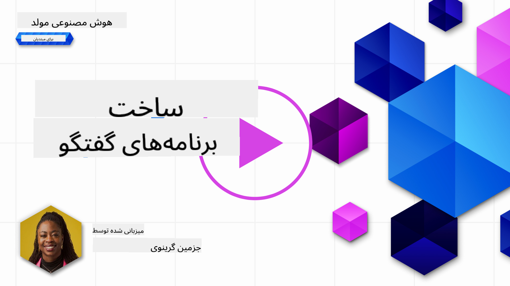
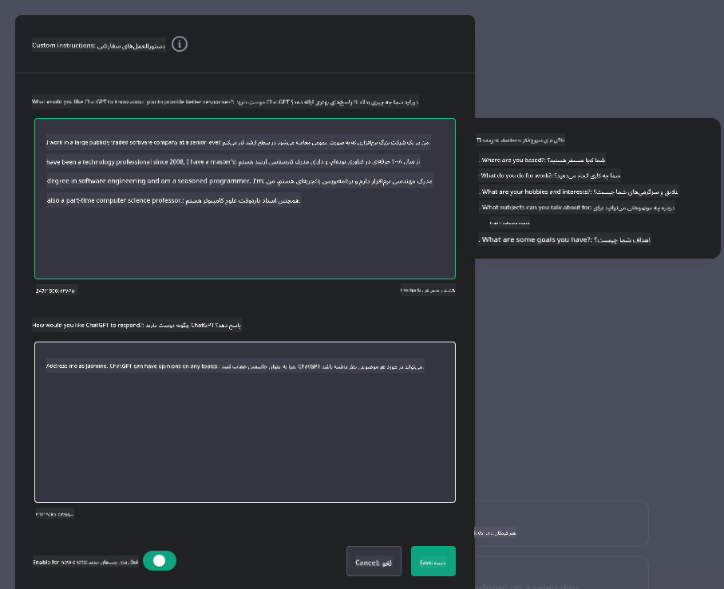
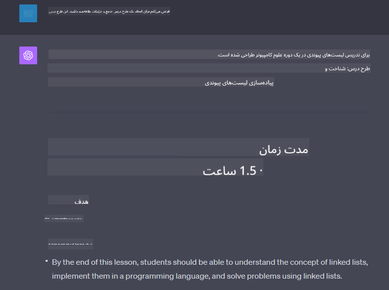

<!--
CO_OP_TRANSLATOR_METADATA:
{
  "original_hash": "ea4bbe640847aafbbba14dae4625e9af",
  "translation_date": "2025-06-25T15:08:03+00:00",
  "source_file": "07-building-chat-applications/README.md",
  "language_code": "fa"
}
-->
# ساخت برنامه‌های چت با استفاده از هوش مصنوعی مولد

[](https://aka.ms/gen-ai-lessons7-gh?WT.mc_id=academic-105485-koreyst)

> _(برای مشاهده ویدئوی این درس روی تصویر بالا کلیک کنید)_

حالا که دیدیم چگونه می‌توانیم برنامه‌های تولید متن بسازیم، بیایید به برنامه‌های چت نگاهی بیندازیم.

برنامه‌های چت به بخشی از زندگی روزمره ما تبدیل شده‌اند و بیش از یک وسیله برای مکالمات معمولی ارائه می‌دهند. آن‌ها بخش‌های جدایی‌ناپذیری از خدمات مشتری، پشتیبانی فنی و حتی سیستم‌های مشاوره پیچیده هستند. احتمالاً شما هم اخیراً از یک برنامه چت کمک گرفته‌اید. با ادغام فناوری‌های پیشرفته‌تر مانند هوش مصنوعی مولد در این پلتفرم‌ها، پیچیدگی افزایش می‌یابد و چالش‌ها نیز افزایش می‌یابند.

برخی از سوالاتی که باید به آن‌ها پاسخ داده شود عبارتند از:

- **ساخت برنامه**. چگونه می‌توانیم به طور کارآمد این برنامه‌های مبتنی بر هوش مصنوعی را برای موارد استفاده خاص بسازیم و به صورت یکپارچه ادغام کنیم؟
- **نظارت**. پس از استقرار، چگونه می‌توانیم نظارت کنیم و اطمینان حاصل کنیم که برنامه‌ها در بالاترین سطح کیفیت، هم از نظر عملکرد و هم با رعایت [شش اصل هوش مصنوعی مسئولانه](https://www.microsoft.com/ai/responsible-ai?WT.mc_id=academic-105485-koreyst) عمل می‌کنند؟

با حرکت به سوی عصر تعریف شده توسط اتوماسیون و تعاملات بی‌وقفه انسان و ماشین، درک چگونگی تغییر هوش مصنوعی مولد در دامنه، عمق و سازگاری برنامه‌های چت ضروری می‌شود. این درس جنبه‌های معماری که از این سیستم‌های پیچیده پشتیبانی می‌کنند را بررسی خواهد کرد، به روش‌های تنظیم دقیق آن‌ها برای وظایف خاص دامنه می‌پردازد و معیارها و ملاحظات مربوط به تضمین استقرار مسئولانه هوش مصنوعی را ارزیابی می‌کند.

## مقدمه

این درس شامل موارد زیر است:

- تکنیک‌هایی برای ساخت و ادغام کارآمد برنامه‌های چت.
- چگونه می‌توان سفارشی‌سازی و تنظیم دقیق را در برنامه‌ها اعمال کرد.
- استراتژی‌ها و ملاحظاتی برای نظارت موثر بر برنامه‌های چت.

## اهداف یادگیری

تا پایان این درس، قادر خواهید بود:

- ملاحظات مربوط به ساخت و ادغام برنامه‌های چت در سیستم‌های موجود را توصیف کنید.
- برنامه‌های چت را برای موارد استفاده خاص سفارشی کنید.
- معیارها و ملاحظات کلیدی برای نظارت و حفظ کیفیت برنامه‌های چت مبتنی بر هوش مصنوعی را شناسایی کنید.
- اطمینان حاصل کنید که برنامه‌های چت از هوش مصنوعی به صورت مسئولانه استفاده می‌کنند.

## ادغام هوش مصنوعی مولد در برنامه‌های چت

ارتقای برنامه‌های چت از طریق هوش مصنوعی مولد فقط به هوشمندتر کردن آن‌ها محدود نمی‌شود؛ بلکه بهینه‌سازی معماری، عملکرد و رابط کاربری آن‌ها برای ارائه تجربه کاربری با کیفیت نیز مهم است. این شامل بررسی پایه‌های معماری، ادغام‌های API و ملاحظات رابط کاربری می‌شود. این بخش قصد دارد نقشه راه جامعی برای پیمایش این چشم‌اندازهای پیچیده ارائه دهد، چه آن‌ها را به سیستم‌های موجود متصل کنید و چه به عنوان پلتفرم‌های مستقل بسازید.

تا پایان این بخش، با تخصص لازم برای ساخت و ادغام کارآمد برنامه‌های چت مجهز خواهید شد.

### چت‌بات یا برنامه چت؟

قبل از اینکه به ساخت برنامه‌های چت بپردازیم، بیایید 'چت‌بات‌ها' را با 'برنامه‌های چت مبتنی بر هوش مصنوعی' مقایسه کنیم که نقش‌ها و عملکردهای متمایزی دارند. هدف اصلی یک چت‌بات، خودکارسازی وظایف مکالمه خاص مانند پاسخ به سوالات متداول یا ردیابی یک بسته است. معمولاً توسط منطق مبتنی بر قوانین یا الگوریتم‌های پیچیده هوش مصنوعی اداره می‌شود. در مقابل، یک برنامه چت مبتنی بر هوش مصنوعی محیطی بسیار گسترده‌تر است که برای تسهیل انواع مختلف ارتباطات دیجیتال مانند چت‌های متنی، صوتی و ویدیویی بین کاربران انسانی طراحی شده است. ویژگی تعیین‌کننده آن ادغام یک مدل هوش مصنوعی مولد است که مکالمات پیچیده و شبیه به انسان را شبیه‌سازی می‌کند و پاسخ‌ها را بر اساس انواع ورودی‌ها و نشانه‌های متنی تولید می‌کند. یک برنامه چت مبتنی بر هوش مصنوعی مولد می‌تواند در بحث‌های دامنه باز شرکت کند، با زمینه‌های مکالمه‌ای در حال تکامل سازگار شود و حتی دیالوگ‌های خلاقانه یا پیچیده تولید کند.

جدول زیر تفاوت‌ها و شباهت‌های کلیدی را برای کمک به درک نقش‌های منحصر به فرد آن‌ها در ارتباطات دیجیتال نشان می‌دهد.

| چت‌بات                             | برنامه چت مبتنی بر هوش مصنوعی مولد |
| --------------------------------- | ----------------------------------- |
| وظیفه‌محور و مبتنی بر قوانین      | آگاه به زمینه                        |
| اغلب در سیستم‌های بزرگتر ادغام می‌شود | ممکن است میزبان یک یا چند چت‌بات باشد |
| محدود به عملکردهای برنامه‌ریزی شده | مدل‌های هوش مصنوعی مولد را شامل می‌شود |
| تعاملات تخصصی و ساختاریافته       | قادر به بحث‌های دامنه باز             |

### بهره‌گیری از قابلیت‌های از پیش ساخته شده با SDKها و APIها

هنگام ساخت یک برنامه چت، یک قدم اول عالی ارزیابی آنچه در حال حاضر وجود دارد است. استفاده از SDKها و APIها برای ساخت برنامه‌های چت یک استراتژی سودمند به دلایل مختلف است. با ادغام SDKها و APIهای مستند شده، برنامه خود را به طور استراتژیک برای موفقیت بلندمدت قرار می‌دهید و به نگرانی‌های مقیاس‌پذیری و نگهداری رسیدگی می‌کنید.

- **تسریع فرآیند توسعه و کاهش سربار**: تکیه بر قابلیت‌های از پیش ساخته شده به جای فرآیند گران‌قیمت ساخت آن‌ها به شما امکان می‌دهد روی جنبه‌های دیگر برنامه خود که ممکن است برای شما مهم‌تر باشند، مانند منطق کسب و کار، تمرکز کنید.
- **عملکرد بهتر**: هنگام ساخت قابلیت از ابتدا، در نهایت از خود می‌پرسید "چگونه مقیاس‌پذیر است؟ آیا این برنامه قادر به مدیریت هجوم ناگهانی کاربران است؟" SDKها و APIهای به خوبی نگهداری شده اغلب راه‌حل‌های داخلی برای این نگرانی‌ها دارند.
- **نگهداری آسان‌تر**: به‌روزرسانی‌ها و بهبودها آسان‌تر مدیریت می‌شوند زیرا بیشتر APIها و SDKها فقط نیاز به به‌روزرسانی یک کتابخانه هنگام انتشار نسخه جدید دارند.
- **دسترسی به فناوری پیشرفته**: بهره‌گیری از مدل‌هایی که با مجموعه داده‌های گسترده آموزش دیده و تنظیم شده‌اند، قابلیت‌های زبان طبیعی را به برنامه شما ارائه می‌دهد.

دسترسی به قابلیت‌های یک SDK یا API معمولاً شامل دریافت اجازه برای استفاده از خدمات ارائه شده است که اغلب از طریق استفاده از یک کلید منحصر به فرد یا توکن احراز هویت انجام می‌شود. ما از کتابخانه پایتون OpenAI برای بررسی این موضوع استفاده خواهیم کرد. شما همچنین می‌توانید آن را در [دفترچه OpenAI](../../../07-building-chat-applications/python/oai-assignment.ipynb) یا [دفترچه خدمات Azure OpenAI](../../../07-building-chat-applications/python/aoai-assignment.ipynb) برای این درس امتحان کنید.

```python
import os
from openai import OpenAI

API_KEY = os.getenv("OPENAI_API_KEY","")

client = OpenAI(
    api_key=API_KEY
    )

chat_completion = client.chat.completions.create(model="gpt-3.5-turbo", messages=[{"role": "user", "content": "Suggest two titles for an instructional lesson on chat applications for generative AI."}])
```

مثال بالا از مدل GPT-3.5 Turbo برای تکمیل درخواست استفاده می‌کند، اما توجه داشته باشید که کلید API قبل از انجام این کار تنظیم شده است. اگر کلید را تنظیم نکنید، خطا دریافت خواهید کرد.

## تجربه کاربری (UX)

اصول کلی UX در برنامه‌های چت اعمال می‌شوند، اما در اینجا برخی ملاحظات اضافی وجود دارد که به دلیل اجزای یادگیری ماشین به ویژه اهمیت پیدا می‌کنند.

- **مکانیزم برای پرداختن به ابهام**: مدل‌های هوش مصنوعی مولد گاهی اوقات پاسخ‌های مبهم تولید می‌کنند. ویژگی‌ای که به کاربران اجازه می‌دهد درخواست توضیح کنند می‌تواند مفید باشد اگر با این مشکل مواجه شوند.
- **حفظ زمینه**: مدل‌های پیشرفته هوش مصنوعی مولد قادر به یادآوری زمینه در یک مکالمه هستند، که می‌تواند یک دارایی ضروری برای تجربه کاربری باشد. دادن امکان کنترل و مدیریت زمینه به کاربران تجربه کاربری را بهبود می‌بخشد، اما خطر حفظ اطلاعات حساس کاربر را نیز معرفی می‌کند. ملاحظات مربوط به مدت زمان ذخیره این اطلاعات، مانند معرفی یک سیاست نگهداری، می‌تواند نیاز به زمینه را در برابر حریم خصوصی متعادل کند.
- **شخصی‌سازی**: با توانایی یادگیری و سازگاری، مدل‌های هوش مصنوعی تجربه‌ای فردی برای کاربر ارائه می‌دهند. تنظیم تجربه کاربری از طریق ویژگی‌هایی مانند پروفایل‌های کاربری نه تنها باعث می‌شود کاربر احساس درک شدن کند، بلکه به او کمک می‌کند تا پاسخ‌های خاصی پیدا کند و تعامل را کارآمدتر و رضایت‌بخش‌تر کند.

یکی از نمونه‌های شخصی‌سازی، تنظیمات "دستورالعمل‌های سفارشی" در ChatGPT OpenAI است. این امکان را به شما می‌دهد که اطلاعاتی درباره خود ارائه دهید که ممکن است زمینه مهمی برای درخواست‌های شما باشد. در اینجا مثالی از یک دستورالعمل سفارشی آورده شده است.



این "پروفایل" ChatGPT را به ایجاد یک برنامه درس در مورد لیست‌های پیوندی تشویق می‌کند. توجه کنید که ChatGPT در نظر می‌گیرد که کاربر ممکن است برنامه درسی عمیق‌تری بر اساس تجربه‌اش بخواهد.



### چارچوب پیام سیستمی مایکروسافت برای مدل‌های زبان بزرگ

[مایکروسافت راهنمایی‌هایی ارائه کرده است](https://learn.microsoft.com/azure/ai-services/openai/concepts/system-message#define-the-models-output-format?WT.mc_id=academic-105485-koreyst) برای نوشتن پیام‌های سیستمی موثر هنگام تولید پاسخ‌ها از LLMها که به چهار حوزه تقسیم می‌شود:

1. تعریف اینکه مدل برای چه کسی است و همچنین قابلیت‌ها و محدودیت‌های آن.
2. تعریف فرمت خروجی مدل.
3. ارائه مثال‌های خاص که رفتار مورد نظر مدل را نشان می‌دهند.
4. ارائه محافظ‌های رفتاری اضافی.

### دسترسی‌پذیری

چه کاربری دارای نقص بینایی، شنوایی، حرکتی یا شناختی باشد، یک برنامه چت خوب طراحی شده باید برای همه قابل استفاده باشد. لیست زیر ویژگی‌های خاصی را که برای افزایش دسترسی‌پذیری برای انواع نقص‌های کاربری هدف‌گذاری شده‌اند، تجزیه می‌کند.

- **ویژگی‌های برای نقص بینایی**: تم‌های با کنتراست بالا و متن قابل تغییر اندازه، سازگاری با خواننده صفحه.
- **ویژگی‌های برای نقص شنوایی**: توابع تبدیل متن به گفتار و گفتار به متن، نشانه‌های بصری برای اعلان‌های صوتی.
- **ویژگی‌های برای نقص حرکتی**: پشتیبانی از ناوبری با صفحه‌کلید، فرمان‌های صوتی.
- **ویژگی‌های برای نقص شناختی**: گزینه‌های زبان ساده شده.

## سفارشی‌سازی و تنظیم دقیق برای مدل‌های زبان خاص دامنه

تصور کنید یک برنامه چت که اصطلاحات خاص شرکت شما را درک می‌کند و سوالات خاصی را که کاربران آن معمولاً دارند، پیش‌بینی می‌کند. چندین رویکرد وجود دارد که ارزش ذکر کردن دارند:

- **بهره‌گیری از مدل‌های DSL**. DSL به معنای زبان خاص دامنه است. شما می‌توانید از یک مدل به اصطلاح DSL استفاده کنید که بر روی یک دامنه خاص آموزش دیده است تا مفاهیم و سناریوهای آن را درک کند.
- **اعمال تنظیم دقیق**. تنظیم دقیق فرآیند آموزش بیشتر مدل شما با داده‌های خاص است.

## سفارشی‌سازی: استفاده از DSL

بهره‌گیری از مدل‌های زبان خاص دامنه (مدل‌های DSL) می‌تواند با ارائه تعاملات تخصصی و مرتبط با زمینه، تعامل کاربر را افزایش دهد. این مدلی است که برای درک و تولید متن مرتبط با یک حوزه خاص، صنعت یا موضوع آموزش دیده یا تنظیم شده است. گزینه‌های استفاده از یک مدل DSL می‌تواند از آموزش یک مدل از ابتدا تا استفاده از مدل‌های موجود از طریق SDKها و APIها متغیر باشد. گزینه دیگر تنظیم دقیق است که شامل گرفتن یک مدل از پیش آموزش دیده و تطبیق آن برای یک دامنه خاص است.

## سفارشی‌سازی: اعمال تنظیم دقیق

تنظیم دقیق اغلب زمانی در نظر گرفته می‌شود که یک مدل از پیش آموزش دیده در یک دامنه تخصصی یا وظیفه خاص کوتاه بیاید.

به عنوان مثال، سوالات پزشکی پیچیده هستند و به زمینه زیادی نیاز دارند. هنگامی که یک متخصص پزشکی یک بیمار را تشخیص می‌دهد، این کار بر اساس عوامل مختلفی مانند سبک زندگی یا شرایط پیش‌زمینه‌ای انجام می‌شود و حتی ممکن است برای تأیید تشخیص خود به ژورنال‌های پزشکی اخیر تکیه کند. در چنین سناریوهای پیچیده‌ای، یک برنامه چت هوش مصنوعی عمومی نمی‌تواند منبع قابل اعتمادی باشد.

### سناریو: یک برنامه پزشکی

یک برنامه چت را در نظر بگیرید که برای کمک به پزشکان طراحی شده است و مراجع سریع به راهنمایی‌های درمان، تعاملات دارویی یا یافته‌های پژوهشی اخیر ارائه می‌دهد.

یک مدل عمومی ممکن است برای پاسخ به سوالات پزشکی پایه یا ارائه مشاوره کلی کافی باشد، اما ممکن است با موارد زیر مشکل داشته باشد:

- **موارد بسیار خاص یا پیچیده**. برای مثال، یک متخصص مغز و اعصاب ممکن است از برنامه بپرسد، "بهترین روش‌های فعلی برای مدیریت صرع مقاوم به دارو در بیماران کودکان چیست؟"
- **فاقد پیشرفت‌های اخیر**. یک مدل عمومی ممکن است در ارائه پاسخی به‌روز که شامل پیشرفت‌های اخیر در زمینه مغز و اعصاب و داروسازی است، مشکل داشته باشد.

در مواردی مانند این، تنظیم دقیق مدل با یک مجموعه داده پزشکی تخصصی می‌تواند به طور قابل توجهی توانایی آن را برای رسیدگی به این سوالات پیچیده پزشکی بهبود بخشد و پاسخ‌های دقیق‌تر و قابل اعتمادتر ارائه دهد. این نیاز به دسترسی به یک مجموعه داده بزرگ و مرتبط دارد که چالش‌ها و سوالات خاص دامنه‌ای را که باید مورد توجه قرار گیرد، نشان می‌دهد.

## ملاحظات برای تجربه چت با کیفیت بالا مبتنی بر هوش مصنوعی

این بخش معیارهای برنامه‌های چت "با کیفیت بالا" را که شامل جمع‌آوری معیارهای قابل اقدام و رعایت چارچوبی است که به طور مسئولانه از فناوری هوش مصنوعی بهره می‌برد، بیان می‌کند.

### معیارهای کلیدی

برای حفظ عملکرد با کیفیت بالا یک برنامه، پیگیری معیارهای کلیدی و ملاحظات ضروری است. این اندازه‌گیری‌ها نه تنها عملکرد برنامه را تضمین می‌کنند، بلکه کیفیت مدل هوش مصنوعی و تجربه کاربری را نیز ارزیابی می‌کنند. در زیر لیستی از معیارهای پایه، هوش مصنوعی و تجربه کاربری که باید در نظر گرفته شوند، آورده شده است.

| معیار                        | تعریف                                                                                                             | ملاحظات برای توسعه‌دهنده چت                                          |
| ---------------------------- | ----------------------------------------------------------------------------------------------------------------- | --------------------------------------------------------------------- |
| **زمان کارکرد**              | مدت زمانی که برنامه عملیاتی و در دسترس کاربران است را اندازه‌گیری می‌کند.                                         | چگونه زمان خرابی را به حداقل می‌رسانید؟                              |
| **زمان پاسخ**                | مدت زمانی که برنامه برای پاسخ به درخواست کاربر نیاز دارد.                                                        | چگونه می‌توانید پردازش درخواست را بهینه کنید تا زمان پاسخ را بهبود بخشید؟ |
| **دقت**                      | نسبت پیش‌بینی‌های مثبت صحیح به کل پیش‌بینی‌های مثبت                                                              | چگونه دقت مدل خود را تأیید خواهید کرد؟                               |
| **بازخوانی (حساسیت)**        | نسبت پیش‌بینی‌های مثبت صحیح به تعداد واقعی مثبت‌ها                                                               | چگونه بازخوانی را اندازه‌گیری و بهبود می‌بخشید؟                       |
| **امتیاز F1**                | میانگین هارمونیک دقت و بازخوانی که تعادل بین هر دو را برقرار می‌کند.                                             | هدف شما برای امتیاز F1 چیست؟ چگونه دقت و بازخوانی را متعادل خواهید کرد؟  |
| **پیچیدگی**                  | میزان تطابق توزیع احتمالی پیش‌بینی شده توسط مدل با توزیع واقعی داده‌ها را اندازه‌گیری می‌کند.                    | چگونه پیچیدگی را به حداقل می‌رسانید؟                                 |
| **معیارهای رضایت کاربر**     | برداشت کاربر از برنامه را اندازه‌گیری می‌کند. اغلب از طریق نظرسنجی‌ها جمع‌آوری می‌شود.                          | چند وقت یکبار بازخورد کاربر را جمع‌آوری خواهید کرد؟ چگونه بر اساس آن سازگار خواهید شد؟ |
| **نرخ خطا**                  | نرخ اشتباهاتی که مدل در درک یا خروجی مرتکب می‌شود.                                                               | چه استراتژی‌هایی برای کاهش نرخ خطا دارید؟                            |
| **دوره‌های بازآموزی**        | فرکانس به‌روزرسانی مدل برای ادغام داده‌ها و بینش‌های جدید.                                                       | هر چند وقت یکبار مدل را بازآموزی خواهید کرد؟ چه چیزی یک دوره بازآموزی را تحریک می‌کند؟ |
| **تشخیص ناهنجاری**          | ابزارها و تکنیک‌هایی برای شناسایی الگوهای غیرعادی که با رفتار مورد انتظار مطابقت ندارند.

**سلب مسئولیت**:  
این سند با استفاده از سرویس ترجمه هوش مصنوعی [Co-op Translator](https://github.com/Azure/co-op-translator) ترجمه شده است. در حالی که ما برای دقت تلاش می‌کنیم، لطفاً توجه داشته باشید که ترجمه‌های خودکار ممکن است شامل خطاها یا نادقتی‌ها باشند. سند اصلی به زبان مادری آن باید به عنوان منبع معتبر در نظر گرفته شود. برای اطلاعات حساس، ترجمه حرفه‌ای انسانی توصیه می‌شود. ما مسئولیتی در قبال سوء تفاهم‌ها یا تفسیرهای نادرست ناشی از استفاده از این ترجمه نداریم.