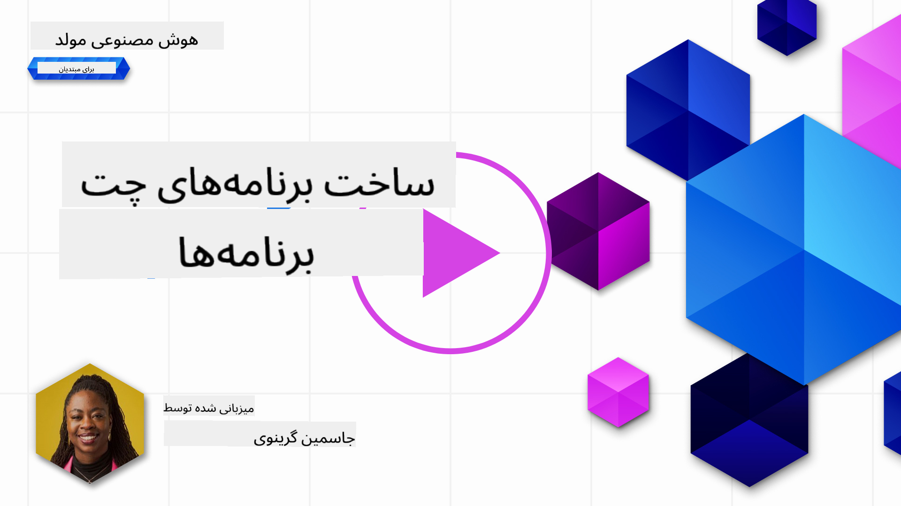

<!--
CO_OP_TRANSLATOR_METADATA:
{
  "original_hash": "ea4bbe640847aafbbba14dae4625e9af",
  "translation_date": "2025-07-09T12:16:43+00:00",
  "source_file": "07-building-chat-applications/README.md",
  "language_code": "fa"
}
-->
# ساخت برنامه‌های چت مبتنی بر هوش مصنوعی مولد

[](https://aka.ms/gen-ai-lessons7-gh?WT.mc_id=academic-105485-koreyst)

> _(برای مشاهده ویدئوی این درس روی تصویر بالا کلیک کنید)_

حالا که دیدیم چگونه می‌توانیم برنامه‌های تولید متن بسازیم، بیایید به برنامه‌های چت نگاهی بیندازیم.

برنامه‌های چت به بخشی جدایی‌ناپذیر از زندگی روزمره ما تبدیل شده‌اند و فراتر از یک وسیله برای گفتگوهای ساده عمل می‌کنند. آن‌ها بخش‌های اساسی خدمات مشتری، پشتیبانی فنی و حتی سیستم‌های مشاوره پیشرفته هستند. احتمالاً اخیراً از یک برنامه چت کمک گرفته‌اید. با ادغام فناوری‌های پیشرفته‌تری مانند هوش مصنوعی مولد در این پلتفرم‌ها، پیچیدگی و چالش‌ها نیز افزایش می‌یابد.

برخی سوالاتی که باید پاسخ داده شوند عبارتند از:

- **ساخت برنامه**. چگونه می‌توانیم این برنامه‌های مبتنی بر هوش مصنوعی را به صورت کارآمد بسازیم و به طور یکپارچه برای موارد استفاده خاص ادغام کنیم؟
- **نظارت**. پس از استقرار، چگونه می‌توانیم نظارت کنیم و اطمینان حاصل کنیم که برنامه‌ها از نظر عملکرد و رعایت [شش اصل هوش مصنوعی مسئولانه](https://www.microsoft.com/ai/responsible-ai?WT.mc_id=academic-105485-koreyst) در بالاترین سطح کیفیت عمل می‌کنند؟

با ورود به دوره‌ای که با اتوماسیون و تعاملات بی‌وقفه انسان و ماشین تعریف می‌شود، درک اینکه چگونه هوش مصنوعی مولد دامنه، عمق و سازگاری برنامه‌های چت را تغییر می‌دهد، ضروری است. این درس به بررسی جنبه‌های معماری که از این سیستم‌های پیچیده پشتیبانی می‌کنند، روش‌های تنظیم دقیق برای وظایف خاص حوزه‌ای و ارزیابی معیارها و ملاحظات مرتبط با استقرار مسئولانه هوش مصنوعی می‌پردازد.

## مقدمه

این درس شامل موارد زیر است:

- تکنیک‌هایی برای ساخت و ادغام کارآمد برنامه‌های چت.
- نحوه اعمال سفارشی‌سازی و تنظیم دقیق برنامه‌ها.
- استراتژی‌ها و ملاحظاتی برای نظارت مؤثر بر برنامه‌های چت.

## اهداف یادگیری

در پایان این درس، شما قادر خواهید بود:

- ملاحظات مربوط به ساخت و ادغام برنامه‌های چت در سیستم‌های موجود را شرح دهید.
- برنامه‌های چت را برای موارد استفاده خاص سفارشی کنید.
- معیارها و ملاحظات کلیدی برای نظارت مؤثر و حفظ کیفیت برنامه‌های چت مبتنی بر هوش مصنوعی را شناسایی کنید.
- اطمینان حاصل کنید که برنامه‌های چت به صورت مسئولانه از هوش مصنوعی بهره می‌برند.

## ادغام هوش مصنوعی مولد در برنامه‌های چت

ارتقاء برنامه‌های چت با هوش مصنوعی مولد تنها به هوشمندتر کردن آن‌ها محدود نمی‌شود؛ بلکه به بهینه‌سازی معماری، عملکرد و رابط کاربری برای ارائه تجربه کاربری با کیفیت مربوط است. این شامل بررسی پایه‌های معماری، ادغام API و ملاحظات رابط کاربری است. این بخش قصد دارد نقشه راه جامعی برای پیمایش این حوزه‌های پیچیده به شما ارائه دهد، چه آن‌ها را در سیستم‌های موجود وارد کنید و چه به عنوان پلتفرم‌های مستقل بسازید.

در پایان این بخش، شما مهارت‌های لازم برای ساخت و ادغام کارآمد برنامه‌های چت را خواهید داشت.

### چت‌بات یا برنامه چت؟

قبل از شروع ساخت برنامه‌های چت، بیایید «چت‌بات‌ها» را با «برنامه‌های چت مبتنی بر هوش مصنوعی» مقایسه کنیم که نقش‌ها و عملکردهای متفاوتی دارند. هدف اصلی یک چت‌بات خودکارسازی وظایف مکالمه‌ای خاص است، مانند پاسخ به سوالات متداول یا پیگیری بسته. معمولاً با منطق مبتنی بر قوانین یا الگوریتم‌های پیچیده هوش مصنوعی کنترل می‌شود. در مقابل، برنامه چت مبتنی بر هوش مصنوعی محیطی بسیار گسترده‌تر است که برای تسهیل انواع مختلف ارتباطات دیجیتال، مانند چت متنی، صوتی و تصویری بین کاربران انسانی طراحی شده است. ویژگی متمایز آن ادغام مدل هوش مصنوعی مولدی است که مکالمات ظریف و انسانی را شبیه‌سازی می‌کند و پاسخ‌ها را بر اساس ورودی‌ها و زمینه‌های مختلف تولید می‌کند. برنامه چت مبتنی بر هوش مصنوعی مولد می‌تواند در بحث‌های حوزه باز شرکت کند، خود را با زمینه‌های در حال تغییر مکالمه تطبیق دهد و حتی دیالوگ‌های خلاقانه یا پیچیده تولید کند.

جدول زیر تفاوت‌ها و شباهت‌های کلیدی را برای درک نقش‌های منحصر به فرد آن‌ها در ارتباطات دیجیتال نشان می‌دهد.

| چت‌بات                               | برنامه چت مبتنی بر هوش مصنوعی مولد          |
| ------------------------------------- | -------------------------------------------- |
| متمرکز بر وظیفه و مبتنی بر قوانین     | آگاه به زمینه                                |
| اغلب در سیستم‌های بزرگ‌تر ادغام شده  | ممکن است میزبان یک یا چند چت‌بات باشد       |
| محدود به عملکردهای برنامه‌ریزی شده   | شامل مدل‌های هوش مصنوعی مولد                 |
| تعاملات تخصصی و ساختاریافته          | قادر به بحث‌های حوزه باز                      |

### استفاده از قابلیت‌های پیش‌ساخته با SDKها و APIها

هنگام ساخت برنامه چت، گام اول خوب این است که ببینید چه چیزهایی قبلاً وجود دارد. استفاده از SDKها و APIها برای ساخت برنامه‌های چت استراتژی مفیدی است به دلایل مختلف. با ادغام SDKها و APIهای مستند شده، برنامه خود را برای موفقیت بلندمدت به صورت استراتژیک آماده می‌کنید و نگرانی‌های مقیاس‌پذیری و نگهداری را برطرف می‌کنید.

- **تسریع فرآیند توسعه و کاهش بار کاری**: تکیه بر قابلیت‌های پیش‌ساخته به جای ساختن آن‌ها از ابتدا، به شما اجازه می‌دهد روی جنبه‌های دیگر برنامه که برایتان مهم‌تر است، مانند منطق کسب‌وکار، تمرکز کنید.
- **عملکرد بهتر**: هنگام ساخت قابلیت‌ها از صفر، در نهایت از خود می‌پرسید «چگونه مقیاس‌پذیر است؟ آیا این برنامه می‌تواند افزایش ناگهانی کاربران را مدیریت کند؟» SDKها و APIهای به‌خوبی نگهداری شده معمولاً راه‌حل‌های داخلی برای این نگرانی‌ها دارند.
- **نگهداری آسان‌تر**: به‌روزرسانی‌ها و بهبودها آسان‌تر مدیریت می‌شوند چون اکثر APIها و SDKها فقط نیاز به به‌روزرسانی یک کتابخانه هنگام انتشار نسخه جدید دارند.
- **دسترسی به فناوری پیشرفته**: استفاده از مدل‌هایی که به دقت تنظیم شده و روی داده‌های گسترده آموزش دیده‌اند، قابلیت‌های زبان طبیعی را به برنامه شما می‌آورد.

دسترسی به قابلیت‌های یک SDK یا API معمولاً شامل دریافت مجوز استفاده از خدمات ارائه شده است که اغلب از طریق کلید منحصر به فرد یا توکن احراز هویت انجام می‌شود. ما از کتابخانه پایتون OpenAI برای بررسی این موضوع استفاده خواهیم کرد. شما همچنین می‌توانید خودتان در [دفترچه یادداشت OpenAI](../../../07-building-chat-applications/python/oai-assignment.ipynb) یا [دفترچه یادداشت Azure OpenAI Services](../../../07-building-chat-applications/python/aoai-assignment.ipynb) این درس امتحان کنید.

```python
import os
from openai import OpenAI

API_KEY = os.getenv("OPENAI_API_KEY","")

client = OpenAI(
    api_key=API_KEY
    )

chat_completion = client.chat.completions.create(model="gpt-3.5-turbo", messages=[{"role": "user", "content": "Suggest two titles for an instructional lesson on chat applications for generative AI."}])
```

مثال بالا از مدل GPT-3.5 Turbo برای تکمیل درخواست استفاده می‌کند، اما توجه کنید که کلید API قبل از آن تنظیم شده است. اگر کلید را تنظیم نکنید، خطا دریافت خواهید کرد.

## تجربه کاربری (UX)

اصول کلی UX برای برنامه‌های چت اعمال می‌شود، اما در اینجا چند ملاحظه اضافی وجود دارد که به دلیل اجزای یادگیری ماشین اهمیت ویژه‌ای پیدا می‌کنند.

- **مکانیزم رفع ابهام**: مدل‌های هوش مصنوعی مولد گاهی پاسخ‌های مبهم تولید می‌کنند. ویژگی‌ای که به کاربران اجازه دهد برای توضیح بیشتر سوال کنند، می‌تواند در مواجهه با این مشکل مفید باشد.
- **حفظ زمینه**: مدل‌های پیشرفته هوش مصنوعی مولد توانایی به خاطر سپردن زمینه در یک مکالمه را دارند که می‌تواند دارایی مهمی برای تجربه کاربری باشد. دادن امکان کنترل و مدیریت زمینه به کاربران تجربه کاربری را بهبود می‌بخشد، اما خطر نگهداری اطلاعات حساس کاربران را نیز به همراه دارد. ملاحظاتی مانند مدت زمان نگهداری این اطلاعات، مثلاً معرفی سیاست نگهداری، می‌تواند نیاز به زمینه را با حفظ حریم خصوصی متعادل کند.
- **شخصی‌سازی**: با توانایی یادگیری و تطبیق، مدل‌های هوش مصنوعی تجربه‌ای فردی برای کاربر ارائه می‌دهند. سفارشی‌سازی تجربه کاربری از طریق ویژگی‌هایی مانند پروفایل‌های کاربری نه تنها باعث می‌شود کاربر احساس درک شدن کند، بلکه به او در یافتن پاسخ‌های خاص کمک می‌کند و تعامل را کارآمدتر و رضایت‌بخش‌تر می‌سازد.

یکی از نمونه‌های شخصی‌سازی، تنظیمات «دستورالعمل‌های سفارشی» در ChatGPT شرکت OpenAI است. این امکان را به شما می‌دهد که اطلاعاتی درباره خودتان ارائه دهید که ممکن است زمینه مهمی برای درخواست‌های شما باشد. در اینجا نمونه‌ای از یک دستورالعمل سفارشی آمده است.


این «پروفایل» ChatGPT را ترغیب می‌کند تا یک برنامه درس درباره لیست‌های پیوندی ایجاد کند. توجه کنید که ChatGPT در نظر می‌گیرد کاربر ممکن است بر اساس تجربه‌اش برنامه درسی عمیق‌تری بخواهد.


### چارچوب پیام سیستم مایکروسافت برای مدل‌های زبان بزرگ

[مایکروسافت راهنمایی‌هایی](https://learn.microsoft.com/azure/ai-services/openai/concepts/system-message#define-the-models-output-format?WT.mc_id=academic-105485-koreyst) برای نوشتن پیام‌های سیستمی مؤثر هنگام تولید پاسخ از LLMها ارائه داده است که در ۴ حوزه تقسیم شده است:

1. تعریف مخاطب مدل، توانایی‌ها و محدودیت‌های آن.
2. تعریف قالب خروجی مدل.
3. ارائه مثال‌های مشخص که رفتار مورد نظر مدل را نشان می‌دهند.
4. ارائه محدودیت‌های رفتاری اضافی.

### دسترسی‌پذیری

چه کاربر دارای اختلالات بینایی، شنوایی، حرکتی یا شناختی باشد، یک برنامه چت خوب طراحی شده باید برای همه قابل استفاده باشد. فهرست زیر ویژگی‌های خاصی را که برای بهبود دسترسی‌پذیری کاربران با اختلالات مختلف طراحی شده‌اند، شرح می‌دهد.

- **ویژگی‌ها برای اختلالات بینایی**: تم‌های با کنتراست بالا و متن قابل تغییر اندازه، سازگاری با صفحه‌خوان.
- **ویژگی‌ها برای اختلالات شنوایی**: تبدیل متن به گفتار و گفتار به متن، نشانه‌های بصری برای اعلان‌های صوتی.
- **ویژگی‌ها برای اختلالات حرکتی**: پشتیبانی از ناوبری با صفحه‌کلید، فرمان‌های صوتی.
- **ویژگی‌ها برای اختلالات شناختی**: گزینه‌های زبان ساده‌شده.

## سفارشی‌سازی و تنظیم دقیق برای مدل‌های زبان حوزه‌محور

تصور کنید برنامه چتی دارید که اصطلاحات شرکت شما را می‌فهمد و سوالات خاصی که کاربران معمولاً دارند را پیش‌بینی می‌کند. چند رویکرد قابل ذکر وجود دارد:

- **استفاده از مدل‌های DSL**. DSL مخفف domain specific language (زبان حوزه‌محور) است. می‌توانید از مدل DSL که روی حوزه خاصی آموزش دیده استفاده کنید تا مفاهیم و سناریوهای آن را درک کند.
- **اعمال تنظیم دقیق**. تنظیم دقیق فرآیند آموزش بیشتر مدل با داده‌های خاص است.

## سفارشی‌سازی: استفاده از DSL

استفاده از مدل‌های زبان حوزه‌محور (DSL Models) می‌تواند با ارائه تعاملات تخصصی و مرتبط با زمینه، مشارکت کاربر را افزایش دهد. این مدلی است که برای درک و تولید متن مرتبط با یک حوزه، صنعت یا موضوع خاص آموزش دیده یا تنظیم دقیق شده است. گزینه‌های استفاده از مدل DSL می‌تواند از آموزش مدل از ابتدا تا استفاده از مدل‌های موجود از طریق SDKها و APIها متغیر باشد. گزینه دیگر تنظیم دقیق است که شامل گرفتن یک مدل پیش‌آموزش‌دیده موجود و تطبیق آن برای حوزه خاص است.

## سفارشی‌سازی: اعمال تنظیم دقیق

تنظیم دقیق معمولاً زمانی در نظر گرفته می‌شود که یک مدل پیش‌آموزش‌دیده در یک حوزه تخصصی یا وظیفه خاص ناکافی باشد.

برای مثال، سوالات پزشکی پیچیده هستند و نیاز به زمینه زیادی دارند. وقتی یک پزشک بیمار را تشخیص می‌دهد، بر اساس عوامل متعددی مانند سبک زندگی یا شرایط پیشین است و ممکن است حتی به مجلات پزشکی اخیر برای تأیید تشخیص خود مراجعه کند. در چنین سناریوهای ظریفی، یک برنامه چت هوش مصنوعی عمومی نمی‌تواند منبع قابل اعتمادی باشد.

### سناریو: یک برنامه پزشکی

یک برنامه چت را در نظر بگیرید که برای کمک به پزشکان طراحی شده است و مرجع سریع دستورالعمل‌های درمان، تداخل دارویی یا یافته‌های پژوهشی اخیر را فراهم می‌کند.

یک مدل عمومی ممکن است برای پاسخ به سوالات پزشکی پایه یا ارائه مشاوره کلی کافی باشد، اما ممکن است در موارد زیر مشکل داشته باشد:

- **موارد بسیار خاص یا پیچیده**. برای مثال، یک متخصص مغز و اعصاب ممکن است از برنامه بپرسد: «بهترین روش‌های فعلی مدیریت صرع مقاوم به دارو در بیماران کودکان چیست؟»
- **نبود پیشرفت‌های اخیر**. یک مدل عمومی ممکن است نتواند پاسخ به‌روزی ارائه دهد که شامل جدیدترین پیشرفت‌ها در نورولوژی و داروشناسی باشد.

در چنین مواردی، تنظیم دقیق مدل با یک مجموعه داده تخصصی پزشکی می‌تواند توانایی آن را در پاسخگویی دقیق‌تر و قابل اعتمادتر به این سوالات پیچیده پزشکی به طور قابل توجهی بهبود بخشد. این نیازمند دسترسی به مجموعه داده بزرگ و مرتبطی است که چالش‌ها و سوالات حوزه‌محور را نمایندگی کند.

## ملاحظات برای تجربه چت با کیفیت بالا و مبتنی بر هوش مصنوعی

این بخش معیارهای برنامه‌های چت «با کیفیت بالا» را که شامل جمع‌آوری معیارهای عملی و رعایت چارچوبی برای استفاده مسئولانه از فناوری هوش مصنوعی است، شرح می‌دهد.

### معیارهای کلیدی

برای حفظ عملکرد با کیفیت بالا، ضروری است که معیارها و ملاحظات کلیدی را پیگیری کنید. این اندازه‌گیری‌ها نه تنها عملکرد برنامه را تضمین می‌کنند بلکه کیفیت مدل هوش مصنوعی و تجربه کاربری را نیز ارزیابی می‌کنند. در زیر فهرستی از معیارهای پایه، هوش مصنوعی و تجربه کاربری آورده شده است که باید در نظر گرفته شوند.

| معیار                         | تعریف                                                                                                               | ملاحظات برای توسعه‌دهنده چت                                         |
| ----------------------------- | ------------------------------------------------------------------------------------------------------------------ | ------------------------------------------------------------------- |
| **زمان در دسترس بودن (Uptime)** | مدت زمانی که برنامه در دسترس و عملیاتی است.                                                                        | چگونه زمان از کار افتادگی را به حداقل می‌رسانید؟                   |
| **زمان پاسخگویی**             | مدت زمانی که برنامه برای پاسخ به پرسش کاربر صرف می‌کند.                                                           | چگونه می‌توانید پردازش پرسش‌ها را بهینه کنید تا زمان پاسخ کاهش یابد؟ |
| **دقت (Precision)**           | نسبت پیش‌بینی‌های مثبت درست به کل پیش‌بینی‌های مثبت.                                                             | چگونه دقت مدل خود را اعتبارسنجی می‌کنید؟                           |
| **بازخوانی (Recall یا حساسیت)** | نسبت پیش‌بینی‌های مثبت درست به تعداد واقعی موارد مثبت.                                                           | چگونه بازخوانی را اندازه‌گیری و بهبود می‌دهید؟                     |
| **امتیاز F1**                 | میانگین هارمونیک دقت و بازخوانی که تعادل بین این دو را برقرار می‌کند.                                            | هدف امتیاز F1 شما چیست؟ چگونه بین دقت و بازخوانی تعادل برقرار می‌کنید؟ |
| **پیچیدگی (Perplexity)**      | اندازه‌گیری تطابق توزیع احتمالات پیش‌بینی شده توسط مدل با توزیع واقعی داده‌ها.                                    | چگونه پیچیدگی را به حداقل می‌رسانید؟                               |
| **معیارهای رضایت کاربر**      | اندازه‌گیری برداشت کاربر از برنامه که اغلب از طریق نظرسنجی‌ها جمع‌آوری می‌شود.                                    | چند وقت یکبار بازخورد کاربر را جمع‌آوری می‌کنید؟ چگونه بر اساس آن سازگار می‌شوید؟ |
| **نرخ خطا**                   | نرخ اشتباهات مدل در درک یا خروجی.                                                                                  | چه استراتژی‌هایی برای کاهش نرخ خطا دارید؟                          |
| **چرخه‌های بازآموزی**         | فرکانس به‌روزرسانی مدل برای افزودن داده‌ها و بینش‌های جدید.                                                       | چند وقت یکبار مدل را بازآموزی می‌کنید؟ چه عواملی چرخه بازآموزی را تحریک می‌کنند؟ |
| **شناسایی ناهنجاری**         | ابزارها و تکنیک‌هایی برای شناسایی الگوهای غیرمعمول که با رفتارهای مورد انتظار همخوانی ندارند.                        | چگونه به ناهنجاری‌ها پاسخ خواهید داد؟                                        |

### پیاده‌سازی اصول هوش مصنوعی مسئولانه در برنامه‌های چت

رویکرد مایکروسافت به هوش مصنوعی مسئولانه شش اصل را شناسایی کرده است که باید توسعه و استفاده از هوش مصنوعی را هدایت کنند. در ادامه این اصول، تعریف آن‌ها و نکاتی که یک توسعه‌دهنده چت باید در نظر بگیرد و دلیل اهمیت آن‌ها آمده است.

| اصول                   | تعریف مایکروسافت                                    | ملاحظات برای توسعه‌دهنده چت                                           | چرا اهمیت دارد                                                                     |
| ---------------------- | -------------------------------------------------- | -------------------------------------------------------------------- | --------------------------------------------------------------------------------- |
| عدالت                  | سیستم‌های هوش مصنوعی باید با همه افراد به‌طور عادلانه رفتار کنند. | اطمینان حاصل کنید که برنامه چت بر اساس داده‌های کاربران تبعیض قائل نمی‌شود. | برای ایجاد اعتماد و فراگیری در میان کاربران؛ جلوگیری از پیامدهای قانونی.        |
| قابلیت اطمینان و ایمنی | سیستم‌های هوش مصنوعی باید به‌طور قابل اعتماد و ایمن عمل کنند. | تست و مکانیزم‌های ایمنی را پیاده‌سازی کنید تا خطاها و ریسک‌ها به حداقل برسند. | تضمین رضایت کاربران و جلوگیری از آسیب‌های احتمالی.                              |
| حریم خصوصی و امنیت    | سیستم‌های هوش مصنوعی باید امن باشند و به حریم خصوصی احترام بگذارند. | رمزنگاری قوی و تدابیر حفاظت از داده‌ها را اجرا کنید.                  | برای محافظت از داده‌های حساس کاربران و رعایت قوانین حریم خصوصی.                 |
| فراگیری                | سیستم‌های هوش مصنوعی باید همه را توانمند سازند و افراد را درگیر کنند. | طراحی رابط کاربری/تجربه کاربری که برای مخاطبان متنوع قابل دسترس و آسان باشد. | تضمین استفاده مؤثر طیف وسیع‌تری از افراد از برنامه.                             |
| شفافیت                 | سیستم‌های هوش مصنوعی باید قابل فهم باشند.          | مستندات واضح و دلایل پاسخ‌های هوش مصنوعی را ارائه دهید.              | کاربران بیشتر به سیستمی اعتماد می‌کنند که بتوانند نحوه تصمیم‌گیری آن را درک کنند. |
| پاسخگویی               | افراد باید در قبال سیستم‌های هوش مصنوعی پاسخگو باشند. | فرآیند روشنی برای حسابرسی و بهبود تصمیمات هوش مصنوعی ایجاد کنید.     | امکان بهبود مستمر و اقدامات اصلاحی در صورت بروز اشتباهات.                       |

## تمرین

به [تمرین](../../../07-building-chat-applications/python) مراجعه کنید؛ این تمرین شما را از اجرای اولین دستورات چت، تا دسته‌بندی و خلاصه‌سازی متن و موارد دیگر راهنمایی می‌کند. توجه داشته باشید که تمرین‌ها به زبان‌های برنامه‌نویسی مختلف در دسترس هستند!

## کار عالی! ادامه مسیر

پس از اتمام این درس، مجموعه [یادگیری هوش مصنوعی مولد](https://aka.ms/genai-collection?WT.mc_id=academic-105485-koreyst) را بررسی کنید تا دانش خود در زمینه هوش مصنوعی مولد را ارتقا دهید!

برای دیدن نحوه شروع به [ساخت برنامه‌های جستجو](../08-building-search-applications/README.md?WT.mc_id=academic-105485-koreyst) به درس ۸ مراجعه کنید!

**سلب مسئولیت**:  
این سند با استفاده از سرویس ترجمه هوش مصنوعی [Co-op Translator](https://github.com/Azure/co-op-translator) ترجمه شده است. در حالی که ما در تلاش برای دقت هستیم، لطفاً توجه داشته باشید که ترجمه‌های خودکار ممکن است حاوی خطاها یا نادرستی‌هایی باشند. سند اصلی به زبان بومی خود باید به عنوان منبع معتبر در نظر گرفته شود. برای اطلاعات حیاتی، ترجمه حرفه‌ای انسانی توصیه می‌شود. ما مسئول هیچ گونه سوءتفاهم یا تفسیر نادرستی که از استفاده از این ترجمه ناشی شود، نیستیم.