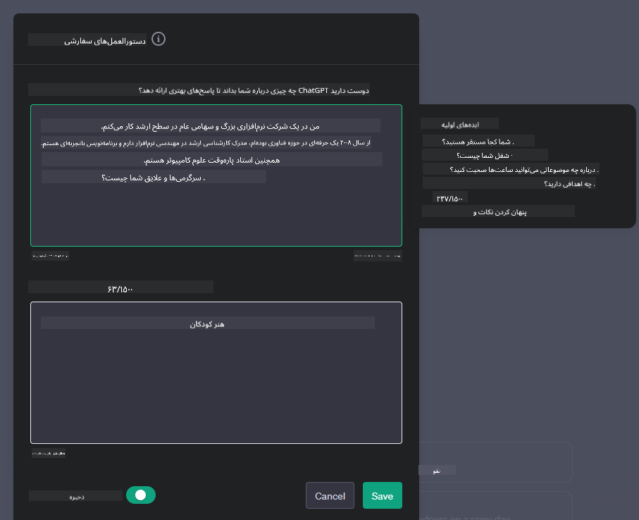
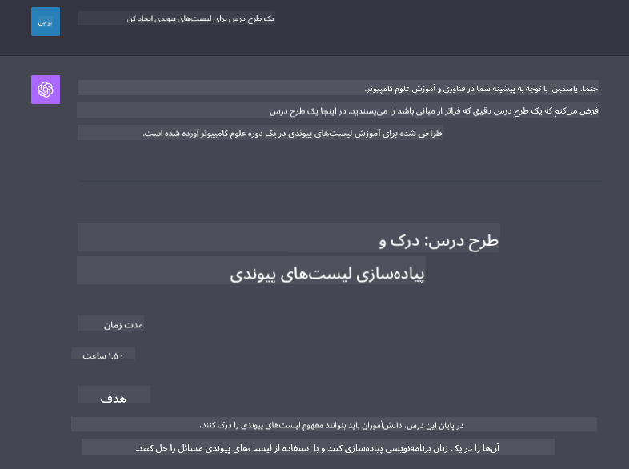

<!--
CO_OP_TRANSLATOR_METADATA:
{
  "original_hash": "a5308963a56cfbad2d73b0fa99fe84b3",
  "translation_date": "2025-10-17T23:13:15+00:00",
  "source_file": "07-building-chat-applications/README.md",
  "language_code": "fa"
}
-->
# ساخت برنامه‌های چت مبتنی بر هوش مصنوعی مولد

[](https://youtu.be/R9V0ZY1BEQo?si=IHuU-fS9YWT8s4sA)

> _(برای مشاهده ویدئوی این درس روی تصویر بالا کلیک کنید)_

حالا که یاد گرفتیم چگونه برنامه‌های تولید متن بسازیم، بیایید به برنامه‌های چت نگاهی بیندازیم.

برنامه‌های چت به بخشی جدایی‌ناپذیر از زندگی روزمره ما تبدیل شده‌اند و فراتر از یک ابزار مکالمه معمولی عمل می‌کنند. این برنامه‌ها بخش‌های مهمی از خدمات مشتری، پشتیبانی فنی و حتی سیستم‌های مشاوره پیشرفته هستند. احتمالاً اخیراً از یک برنامه چت کمک گرفته‌اید. با ادغام فناوری‌های پیشرفته‌تر مانند هوش مصنوعی مولد در این پلتفرم‌ها، پیچیدگی‌ها و چالش‌ها نیز افزایش می‌یابد.

برخی از سوالاتی که باید به آن‌ها پاسخ داده شود عبارتند از:

- **ساخت برنامه**. چگونه می‌توانیم این برنامه‌های مبتنی بر هوش مصنوعی را به طور کارآمد بسازیم و برای موارد استفاده خاص به طور یکپارچه ادغام کنیم؟
- **نظارت**. پس از استقرار، چگونه می‌توانیم نظارت کنیم و اطمینان حاصل کنیم که برنامه‌ها در بالاترین سطح کیفیت، هم از نظر عملکرد و هم رعایت [شش اصل هوش مصنوعی مسئولانه](https://www.microsoft.com/ai/responsible-ai?WT.mc_id=academic-105485-koreyst) عمل می‌کنند؟

با پیشرفت به سمت عصری که با اتوماسیون و تعاملات بی‌وقفه انسان و ماشین تعریف می‌شود، درک چگونگی تحول هوش مصنوعی مولد در دامنه، عمق و سازگاری برنامه‌های چت ضروری می‌شود. این درس جنبه‌های معماری که از این سیستم‌های پیچیده پشتیبانی می‌کنند را بررسی می‌کند، روش‌های تنظیم دقیق برای وظایف خاص حوزه را مورد بررسی قرار می‌دهد و معیارها و ملاحظات مربوط به تضمین استقرار مسئولانه هوش مصنوعی را ارزیابی می‌کند.

## مقدمه

این درس شامل موارد زیر است:

- تکنیک‌های ساخت و ادغام کارآمد برنامه‌های چت.
- نحوه اعمال سفارشی‌سازی و تنظیم دقیق در برنامه‌ها.
- استراتژی‌ها و ملاحظات برای نظارت مؤثر بر برنامه‌های چت.

## اهداف یادگیری

در پایان این درس، شما قادر خواهید بود:

- ملاحظات مربوط به ساخت و ادغام برنامه‌های چت در سیستم‌های موجود را توضیح دهید.
- برنامه‌های چت را برای موارد استفاده خاص سفارشی کنید.
- معیارها و ملاحظات کلیدی برای نظارت و حفظ کیفیت برنامه‌های چت مبتنی بر هوش مصنوعی را شناسایی کنید.
- اطمینان حاصل کنید که برنامه‌های چت به طور مسئولانه از هوش مصنوعی استفاده می‌کنند.

## ادغام هوش مصنوعی مولد در برنامه‌های چت

ارتقای برنامه‌های چت از طریق هوش مصنوعی مولد تنها به هوشمندتر کردن آن‌ها محدود نمی‌شود؛ بلکه بهینه‌سازی معماری، عملکرد و رابط کاربری آن‌ها برای ارائه تجربه کاربری با کیفیت نیز اهمیت دارد. این شامل بررسی پایه‌های معماری، ادغام API و ملاحظات رابط کاربری است. این بخش قصد دارد نقشه راه جامعی برای پیمایش این چشم‌اندازهای پیچیده ارائه دهد، چه بخواهید آن‌ها را در سیستم‌های موجود ادغام کنید یا به عنوان پلتفرم‌های مستقل بسازید.

در پایان این بخش، شما مهارت‌های لازم برای ساخت و ادغام کارآمد برنامه‌های چت را خواهید داشت.

### چت‌بات یا برنامه چت؟

قبل از اینکه به ساخت برنامه‌های چت بپردازیم، بیایید تفاوت‌های بین «چت‌بات‌ها» و «برنامه‌های چت مبتنی بر هوش مصنوعی» را بررسی کنیم که نقش‌ها و عملکردهای متفاوتی دارند. هدف اصلی چت‌بات‌ها خودکارسازی وظایف خاص مکالمه‌ای است، مانند پاسخ به سوالات متداول یا پیگیری یک بسته. معمولاً این چت‌بات‌ها توسط منطق مبتنی بر قوانین یا الگوریتم‌های پیچیده هوش مصنوعی هدایت می‌شوند. در مقابل، یک برنامه چت مبتنی بر هوش مصنوعی محیطی بسیار گسترده‌تر است که برای تسهیل انواع مختلف ارتباطات دیجیتال مانند چت‌های متنی، صوتی و تصویری بین کاربران انسانی طراحی شده است. ویژگی اصلی آن ادغام یک مدل هوش مصنوعی مولد است که مکالمات انسانی پیچیده و طبیعی را شبیه‌سازی می‌کند و پاسخ‌هایی بر اساس ورودی‌های متنوع و نشانه‌های زمینه‌ای تولید می‌کند. یک برنامه چت مبتنی بر هوش مصنوعی مولد می‌تواند در بحث‌های باز شرکت کند، با زمینه‌های مکالمه‌ای در حال تغییر سازگار شود و حتی دیالوگ‌های خلاقانه یا پیچیده تولید کند.

جدول زیر تفاوت‌ها و شباهت‌های کلیدی را برای کمک به درک نقش‌های منحصر به فرد آن‌ها در ارتباطات دیجیتال نشان می‌دهد.

| چت‌بات                              | برنامه چت مبتنی بر هوش مصنوعی مولد       |
| ----------------------------------- | ---------------------------------------- |
| متمرکز بر وظایف و مبتنی بر قوانین   | آگاه به زمینه                            |
| اغلب در سیستم‌های بزرگ‌تر ادغام شده | ممکن است میزبان یک یا چند چت‌بات باشد   |
| محدود به عملکردهای برنامه‌ریزی شده  | شامل مدل‌های هوش مصنوعی مولد            |
| تعاملات تخصصی و ساختاریافته         | قادر به بحث‌های باز و گسترده            |

### استفاده از قابلیت‌های آماده با SDKها و APIها

هنگام ساخت یک برنامه چت، اولین قدم خوب این است که بررسی کنید چه چیزهایی از قبل موجود است. استفاده از SDKها و APIها برای ساخت برنامه‌های چت یک استراتژی مفید به دلایل مختلف است. با ادغام SDKها و APIهای مستند شده، شما برنامه خود را به طور استراتژیک برای موفقیت بلندمدت آماده می‌کنید و نگرانی‌های مربوط به مقیاس‌پذیری و نگهداری را برطرف می‌کنید.

- **تسریع فرآیند توسعه و کاهش هزینه‌ها**: استفاده از قابلیت‌های آماده به جای فرآیند پرهزینه ساخت آن‌ها به شما این امکان را می‌دهد که بر جنبه‌های دیگر برنامه خود که ممکن است برای شما مهم‌تر باشد، مانند منطق کسب‌وکار، تمرکز کنید.
- **عملکرد بهتر**: هنگام ساخت قابلیت‌ها از ابتدا، در نهایت از خود خواهید پرسید "چگونه مقیاس‌پذیری دارد؟ آیا این برنامه قادر به مدیریت افزایش ناگهانی کاربران است؟" SDKها و APIهای خوب نگهداری شده اغلب راه‌حل‌های داخلی برای این نگرانی‌ها دارند.
- **نگهداری آسان‌تر**: به‌روزرسانی‌ها و بهبودها آسان‌تر مدیریت می‌شوند زیرا اکثر APIها و SDKها فقط به یک به‌روزرسانی کتابخانه نیاز دارند وقتی نسخه جدیدی منتشر می‌شود.
- **دسترسی به فناوری پیشرفته**: استفاده از مدل‌هایی که به طور گسترده آموزش دیده‌اند و تنظیم شده‌اند، قابلیت‌های زبان طبیعی را به برنامه شما ارائه می‌دهد.

دسترسی به قابلیت‌های یک SDK یا API معمولاً شامل دریافت اجازه برای استفاده از خدمات ارائه شده است که اغلب از طریق یک کلید منحصر به فرد یا توکن احراز هویت انجام می‌شود. ما از کتابخانه پایتون OpenAI استفاده خواهیم کرد تا ببینیم این چگونه به نظر می‌رسد. شما همچنین می‌توانید این را در [دفترچه یادداشت OpenAI](./python/oai-assignment.ipynb?WT.mc_id=academic-105485-koreyst) یا [دفترچه یادداشت خدمات Azure OpenAI](./python/aoai-assignment.ipynb?WT.mc_id=academic-105485-koreys) برای این درس امتحان کنید.

```python
import os
from openai import OpenAI

API_KEY = os.getenv("OPENAI_API_KEY","")

client = OpenAI(
    api_key=API_KEY
    )

chat_completion = client.chat.completions.create(model="gpt-3.5-turbo", messages=[{"role": "user", "content": "Suggest two titles for an instructional lesson on chat applications for generative AI."}])
```

مثال بالا از مدل GPT-3.5 Turbo برای تکمیل درخواست استفاده می‌کند، اما توجه کنید که کلید API قبل از انجام این کار تنظیم شده است. اگر کلید تنظیم نشده باشد، خطا دریافت خواهید کرد.

## تجربه کاربری (UX)

اصول کلی UX برای برنامه‌های چت اعمال می‌شود، اما در اینجا برخی ملاحظات اضافی که به دلیل اجزای یادگیری ماشین اهمیت پیدا می‌کنند آورده شده است.

- **مکانیزم برای رفع ابهام**: مدل‌های هوش مصنوعی مولد گاهی پاسخ‌های مبهم تولید می‌کنند. یک ویژگی که به کاربران اجازه می‌دهد درخواست توضیح کنند می‌تواند در صورت مواجهه با این مشکل مفید باشد.
- **حفظ زمینه**: مدل‌های پیشرفته هوش مصنوعی مولد توانایی به خاطر سپردن زمینه در یک مکالمه را دارند که می‌تواند یک دارایی ضروری برای تجربه کاربری باشد. دادن امکان کنترل و مدیریت زمینه به کاربران تجربه کاربری را بهبود می‌بخشد، اما خطر حفظ اطلاعات حساس کاربران را نیز به همراه دارد. ملاحظاتی مانند معرفی سیاست حفظ اطلاعات می‌تواند نیاز به زمینه را با حفظ حریم خصوصی متعادل کند.
- **شخصی‌سازی**: با توانایی یادگیری و تطبیق، مدل‌های هوش مصنوعی تجربه‌ای فردی برای کاربر ارائه می‌دهند. شخصی‌سازی تجربه کاربری از طریق ویژگی‌هایی مانند پروفایل‌های کاربری نه تنها باعث می‌شود کاربر احساس درک شدن کند، بلکه به او در یافتن پاسخ‌های خاص کمک می‌کند و تعامل را کارآمدتر و رضایت‌بخش‌تر می‌کند.

یکی از نمونه‌های شخصی‌سازی تنظیمات "دستورالعمل‌های سفارشی" در ChatGPT OpenAI است. این امکان را به شما می‌دهد که اطلاعاتی درباره خودتان ارائه دهید که ممکن است برای درخواست‌های شما مهم باشد. در اینجا یک نمونه از دستورالعمل سفارشی آورده شده است.



این "پروفایل" ChatGPT را ترغیب می‌کند تا یک برنامه درس درباره لیست‌های پیوندی ایجاد کند. توجه کنید که ChatGPT در نظر می‌گیرد که کاربر ممکن است بخواهد یک برنامه درس عمیق‌تر بر اساس تجربه خود داشته باشد.



### چارچوب پیام سیستمی مایکروسافت برای مدل‌های زبان بزرگ

[مایکروسافت راهنمایی‌هایی ارائه داده است](https://learn.microsoft.com/azure/ai-services/openai/concepts/system-message#define-the-models-output-format?WT.mc_id=academic-105485-koreyst) برای نوشتن پیام‌های سیستمی مؤثر هنگام تولید پاسخ‌ها از مدل‌های زبان بزرگ (LLM) که به چهار بخش تقسیم شده است:

1. تعریف اینکه مدل برای چه کسی است، همچنین قابلیت‌ها و محدودیت‌های آن.
2. تعریف فرمت خروجی مدل.
3. ارائه مثال‌های خاص که رفتار مورد نظر مدل را نشان می‌دهند.
4. ارائه محدودیت‌های رفتاری اضافی.

### دسترسی‌پذیری

چه کاربر دارای اختلالات بینایی، شنوایی، حرکتی یا شناختی باشد، یک برنامه چت خوب طراحی شده باید برای همه قابل استفاده باشد. لیست زیر ویژگی‌های خاصی را که هدف آن افزایش دسترسی برای انواع اختلالات کاربر است، شرح می‌دهد.

- **ویژگی‌ها برای اختلالات بینایی**: تم‌های با کنتراست بالا و متن قابل تغییر اندازه، سازگاری با صفحه‌خوان.
- **ویژگی‌ها برای اختلالات شنوایی**: قابلیت‌های تبدیل متن به گفتار و گفتار به متن، نشانه‌های بصری برای اعلان‌های صوتی.
- **ویژگی‌ها برای اختلالات حرکتی**: پشتیبانی از ناوبری با صفحه‌کلید، دستورات صوتی.
- **ویژگی‌ها برای اختلالات شناختی**: گزینه‌های زبان ساده.

## سفارشی‌سازی و تنظیم دقیق برای مدل‌های زبان خاص حوزه

تصور کنید یک برنامه چت دارید که اصطلاحات خاص شرکت شما را درک می‌کند و پیش‌بینی می‌کند که کاربرانش معمولاً چه سوالاتی دارند. چند رویکرد وجود دارد که ارزش ذکر دارند:

- **استفاده از مدل‌های DSL**. DSL مخفف زبان خاص حوزه است. شما می‌توانید از یک مدل DSL که برای یک حوزه خاص آموزش دیده است استفاده کنید تا مفاهیم و سناریوهای آن را درک کند.
- **اعمال تنظیم دقیق**. تنظیم دقیق فرآیند آموزش بیشتر مدل با داده‌های خاص است.

## سفارشی‌سازی: استفاده از DSL

استفاده از مدل‌های زبان خاص حوزه (DSL Models) می‌تواند تعامل کاربران را با ارائه تعاملات تخصصی و مرتبط با زمینه افزایش دهد. این مدل‌ها برای درک و تولید متن مرتبط با یک حوزه، صنعت یا موضوع خاص آموزش دیده یا تنظیم شده‌اند. گزینه‌های استفاده از یک مدل DSL می‌تواند از آموزش یک مدل از ابتدا تا استفاده از مدل‌های موجود از طریق SDKها و APIها متغیر باشد. گزینه دیگر تنظیم دقیق است که شامل گرفتن یک مدل پیش‌آموزش دیده و تطبیق آن برای یک حوزه خاص است.

## سفارشی‌سازی: اعمال تنظیم دقیق

تنظیم دقیق اغلب زمانی در نظر گرفته می‌شود که یک مدل پیش‌آموزش دیده در یک حوزه تخصصی یا وظیفه خاص ناکافی باشد.

برای مثال، سوالات پزشکی پیچیده هستند و نیاز به زمینه زیادی دارند. وقتی یک متخصص پزشکی یک بیمار را تشخیص می‌دهد، این تشخیص بر اساس عوامل مختلفی مانند سبک زندگی یا شرایط پیشین است و ممکن است حتی به مجلات پزشکی اخیر برای تأیید تشخیص خود متکی باشد. در چنین سناریوهای پیچیده، یک برنامه چت هوش مصنوعی عمومی نمی‌تواند منبع قابل اعتمادی باشد.

### سناریو: یک برنامه پزشکی

یک برنامه چت را در نظر بگیرید که برای کمک به پزشکان طراحی شده است و اطلاعات سریع درباره دستورالعمل‌های درمان، تعاملات دارویی یا یافته‌های تحقیقاتی اخیر ارائه می‌دهد.

یک مدل عمومی ممکن است برای پاسخ به سوالات پزشکی پایه یا ارائه مشاوره عمومی مناسب باشد، اما ممکن است در موارد زیر دچار مشکل شود:

- **موارد بسیار خاص یا پیچیده**. برای مثال، یک متخصص مغز و اعصاب ممکن است از برنامه بپرسد: "بهترین روش‌های مدیریت صرع مقاوم به دارو در بیماران کودکان چیست؟"
- **عدم وجود پیشرفت‌های اخیر**. یک مدل عمومی ممکن است در ارائه پاسخی که شامل جدیدترین پیشرفت‌ها در زمینه مغز و اعصاب و داروشناسی باشد، دچار مشکل شود.

در چنین مواردی، تنظیم دقیق مدل با یک مجموعه داده پزشکی تخصصی می‌تواند توانایی آن را در پاسخ به این سوالات پزشکی پیچیده به طور دقیق و قابل اعتماد بهبود بخشد. این نیاز به دسترسی به یک مجموعه داده بزرگ و مرتبط دارد که چالش‌ها و سوالات خاص حوزه را نمایان می‌کند.

## ملاحظات برای تجربه چت با کیفیت بالا مبتنی بر هوش مصنوعی

این بخش معیارهای "کیفیت بالا" برای برنامه‌های چت را که شامل جمع‌آوری معیارهای قابل اجرا و رعایت چارچوبی است که به طور مسئولانه از فناوری هوش مصنوعی استفاده می‌کند، شرح می‌دهد.

### معیارهای کلیدی

برای حفظ عملکرد با کیفیت بالا یک برنامه، ضروری است که معیارها و ملاحظات کلیدی را پیگیری کنید. این اندازه‌گیری‌ها نه تنها عملکرد برنامه را تضمین می‌کنند، بلکه کیفیت مدل هوش مصنوعی و تجربه کاربری را نیز ارزیابی می‌کنند. در زیر لیستی از معیارهای اساسی، هوش مصنوعی و تجربه کاربری آورده شده است که باید در نظر گرفته شوند.

| معیار                          | تعریف                                                                                                               | ملاحظات برای توسعه‌دهنده چت                                              |
| ------------------------------ | -------------------------------------------------------------------------------------------------------------------- | ------------------------------------------------------------------------- |
| **زمان کارکرد**                | مدت زمانی که برنامه عملیاتی و قابل دسترس برای کاربران است.                                                           | چگونه زمان خرابی را به حداقل می‌رسانید؟                                  |
| **زمان پاسخ**                  | مدت زمانی که برنامه برای پاسخ به درخواست کاربر صرف می‌کند.                                                           | چگونه می‌توانید پردازش درخواست را بهینه کنید تا زمان پاسخ بهبود یابد؟    |
| **دقت**                        | نسبت پیش‌بینی‌های مثبت واقعی به کل تعداد پیش‌بینی‌های مثبت.                                                          | چگونه دقت مدل خود را تأیید می‌کنید؟                                      |
| **بازخوانی (حساسیت)**          | نسبت پیش‌بینی‌های مثبت واقعی به تعداد واقعی مثبت‌ها.                                                                | چگونه بازخوانی را اندازه‌گیری و بهبود می‌دهید؟                           |
| **امتیاز F1**                  | میانگین هارمونیک دقت و بازخوانی که تعادل بین هر دو را برقرار می‌کند.                                                 | هدف امتیاز F1 شما چیست؟ چگونه دقت و بازخوانی را متعادل می‌کنید؟          |
| **پیچیدگی**                    | اندازه‌گیری میزان تطابق توزیع احتمالی پیش‌بینی شده توسط مدل با توزیع واقعی داده‌ها.                                  | چگونه پیچیدگی را به حداقل می‌رسانید؟                                     |
| **معیارهای رضایت کاربر**       | اندازه‌گیری درک کاربر از برنامه. اغلب از طریق نظرسنجی‌ها جمع‌آوری می‌شود.                                            | هر چند وقت یکبار بازخورد کاربران را جمع‌آوری می‌کنید؟ چگونه بر اساس آن تطبیق می‌دهید؟ |
| **نرخ خطا**                    | نرخ اشتباهات مدل در درک یا خروجی.                                                                                   | چه استراتژی‌هایی برای کاهش نرخ خطا دارید؟                                |
| **چرخه‌های بازآموزی**           | فرکانس به‌روزرسانی مدل برای ادغام داده‌ها و بینش‌های جدید.                                                           | هر چند وقت یکبار مدل را بازآموزی می‌کنید؟ چه چیزی باعث شروع چرخه بازآموزی می‌شود؟ |
| **شناسایی ناهنجاری**         | ابزارها و تکنیک‌هایی برای شناسایی الگوهای غیرعادی که با رفتار مورد انتظار مطابقت ندارند.                        | چگونه به ناهنجاری‌ها پاسخ خواهید داد؟                                        |

### پیاده‌سازی اصول هوش مصنوعی مسئولانه در برنامه‌های چت

رویکرد مایکروسافت به هوش مصنوعی مسئولانه شش اصل را شناسایی کرده است که باید راهنمای توسعه و استفاده از هوش مصنوعی باشند. در زیر این اصول، تعریف آن‌ها و مواردی که یک توسعه‌دهنده چت باید در نظر بگیرد و دلایل اهمیت آن‌ها آورده شده است.

| اصول                     | تعریف مایکروسافت                                      | ملاحظات برای توسعه‌دهنده چت                                           | چرا این موضوع مهم است                                                                     |
| ---------------------- | ----------------------------------------------------- | ---------------------------------------------------------------------- | -------------------------------------------------------------------------------------- |
| عدالت                  | سیستم‌های هوش مصنوعی باید با همه افراد به طور عادلانه رفتار کنند. | اطمینان حاصل کنید که برنامه چت بر اساس داده‌های کاربران تبعیض قائل نمی‌شود. | برای ایجاد اعتماد و فراگیری در میان کاربران؛ جلوگیری از پیامدهای قانونی.                |
| قابلیت اطمینان و ایمنی | سیستم‌های هوش مصنوعی باید به طور قابل اطمینان و ایمن عمل کنند. | تست‌ها و مکانیزم‌های ایمنی را برای به حداقل رساندن خطاها و ریسک‌ها پیاده‌سازی کنید. | تضمین رضایت کاربران و جلوگیری از آسیب‌های احتمالی.                                 |
| حریم خصوصی و امنیت     | سیستم‌های هوش مصنوعی باید ایمن باشند و به حریم خصوصی احترام بگذارند. | اقدامات قوی رمزنگاری و حفاظت از داده‌ها را پیاده‌سازی کنید.              | برای حفاظت از داده‌های حساس کاربران و رعایت قوانین حریم خصوصی.                         |
| شمول‌گرایی             | سیستم‌های هوش مصنوعی باید همه را توانمند سازند و افراد را درگیر کنند. | طراحی رابط کاربری/تجربه کاربری که برای مخاطبان متنوع قابل دسترسی و استفاده باشد. | تضمین می‌کند که طیف گسترده‌ای از افراد بتوانند به طور مؤثر از برنامه استفاده کنند.                   |
| شفافیت                 | سیستم‌های هوش مصنوعی باید قابل فهم باشند.              | مستندات واضح و دلایل پاسخ‌های هوش مصنوعی را ارائه دهید.                | کاربران بیشتر به سیستمی اعتماد می‌کنند که بتوانند بفهمند چگونه تصمیم‌گیری‌ها انجام می‌شود. |
| پاسخگویی               | افراد باید در قبال سیستم‌های هوش مصنوعی پاسخگو باشند.  | فرآیند واضحی برای بررسی و بهبود تصمیمات هوش مصنوعی ایجاد کنید.        | امکان بهبود مداوم و اقدامات اصلاحی در صورت بروز اشتباهات را فراهم می‌کند.               |

## تکلیف

[تکلیف](../../../07-building-chat-applications/python) را ببینید. این تکلیف شما را از اجرای اولین درخواست‌های چت تا طبقه‌بندی و خلاصه‌سازی متن و موارد دیگر راهنمایی می‌کند. توجه داشته باشید که تکالیف در زبان‌های برنامه‌نویسی مختلف در دسترس هستند!

## کار عالی! به مسیر ادامه دهید

پس از اتمام این درس، مجموعه [آموزش هوش مصنوعی مولد](https://aka.ms/genai-collection?WT.mc_id=academic-105485-koreyst) ما را بررسی کنید تا دانش خود را در زمینه هوش مصنوعی مولد ارتقا دهید!

به درس ۸ بروید تا ببینید چگونه می‌توانید [برنامه‌های جستجو بسازید](../08-building-search-applications/README.md?WT.mc_id=academic-105485-koreyst)!

---

**سلب مسئولیت**:  
این سند با استفاده از سرویس ترجمه هوش مصنوعی [Co-op Translator](https://github.com/Azure/co-op-translator) ترجمه شده است. در حالی که ما تلاش می‌کنیم دقت را حفظ کنیم، لطفاً توجه داشته باشید که ترجمه‌های خودکار ممکن است شامل خطاها یا نادرستی‌ها باشند. سند اصلی به زبان اصلی آن باید به عنوان منبع معتبر در نظر گرفته شود. برای اطلاعات حیاتی، ترجمه حرفه‌ای انسانی توصیه می‌شود. ما مسئولیتی در قبال سوء تفاهم‌ها یا تفسیرهای نادرست ناشی از استفاده از این ترجمه نداریم.