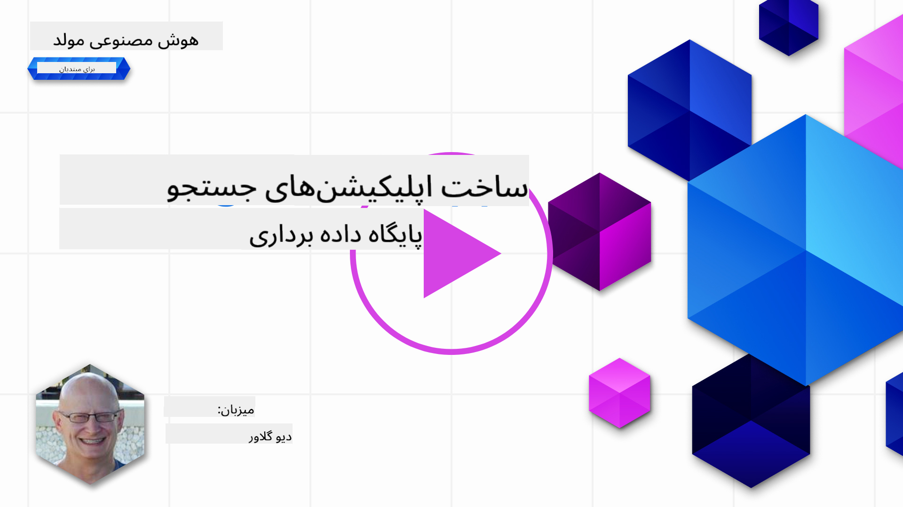
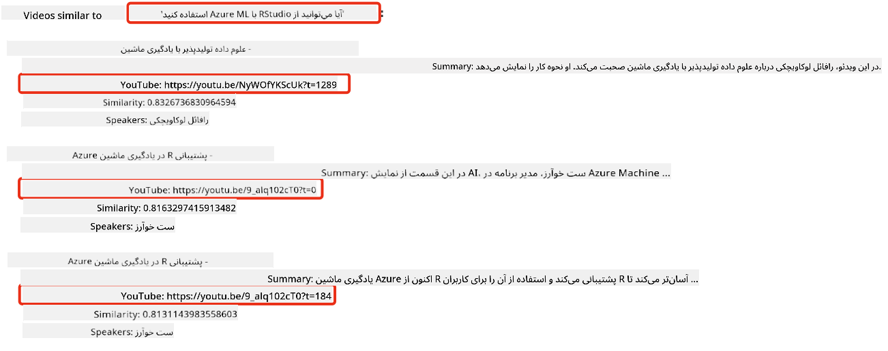
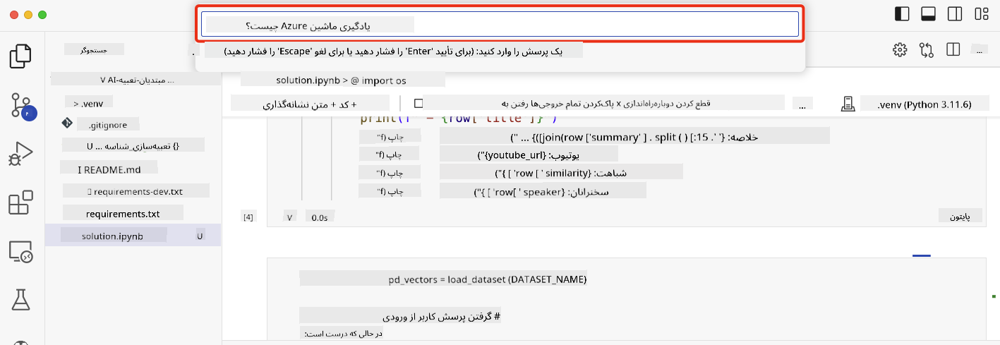

<!--
CO_OP_TRANSLATOR_METADATA:
{
  "original_hash": "d46aad0917a1a342d613e2c13d457da5",
  "translation_date": "2025-05-19T18:19:42+00:00",
  "source_file": "08-building-search-applications/README.md",
  "language_code": "fa"
}
-->
# ساخت برنامه‌های جستجو

[](https://aka.ms/gen-ai-lesson8-gh?WT.mc_id=academic-105485-koreyst)

> > _برای مشاهده ویدئوی این درس روی تصویر بالا کلیک کنید_

مدل‌های زبانی بزرگ (LLMs) فراتر از چت‌بات‌ها و تولید متن هستند. همچنین می‌توان برنامه‌های جستجو را با استفاده از تعبیه‌ها ساخت. تعبیه‌ها نمایش‌های عددی از داده‌ها هستند که به عنوان بردار نیز شناخته می‌شوند و می‌توانند برای جستجوی معنایی داده‌ها استفاده شوند.

در این درس، شما قصد دارید یک برنامه جستجو برای استارتاپ آموزشی ما بسازید. استارتاپ ما یک سازمان غیرانتفاعی است که آموزش رایگان به دانش‌آموزان در کشورهای در حال توسعه ارائه می‌دهد. استارتاپ ما تعداد زیادی ویدئوی یوتیوب دارد که دانش‌آموزان می‌توانند از آن‌ها برای یادگیری درباره هوش مصنوعی استفاده کنند. استارتاپ ما می‌خواهد یک برنامه جستجو بسازد که به دانش‌آموزان اجازه دهد با تایپ یک سوال به دنبال یک ویدئوی یوتیوب بگردند.

برای مثال، یک دانش‌آموز ممکن است تایپ کند 'دفترچه‌های Jupyter چیست؟' یا 'Azure ML چیست' و برنامه جستجو لیستی از ویدئوهای یوتیوب مرتبط با سوال را برگرداند و حتی بهتر، برنامه جستجو لینکی به جایی در ویدئو که پاسخ سوال در آن قرار دارد را ارائه دهد.

## مقدمه

در این درس، ما به موضوعات زیر می‌پردازیم:

- جستجوی معنایی در مقابل جستجوی کلمه کلیدی.
- تعبیه‌های متنی چیست.
- ایجاد یک شاخص تعبیه‌های متنی.
- جستجو در یک شاخص تعبیه‌های متنی.

## اهداف یادگیری

پس از تکمیل این درس، شما قادر خواهید بود:

- تفاوت بین جستجوی معنایی و جستجوی کلمه کلیدی را توضیح دهید.
- تعبیه‌های متنی را توضیح دهید.
- یک برنامه با استفاده از تعبیه‌ها برای جستجوی داده‌ها ایجاد کنید.

## چرا باید یک برنامه جستجو ساخت؟

ایجاد یک برنامه جستجو به شما کمک می‌کند تا بفهمید چگونه از تعبیه‌ها برای جستجوی داده‌ها استفاده کنید. همچنین یاد خواهید گرفت که چگونه یک برنامه جستجو بسازید که بتواند توسط دانش‌آموزان برای پیدا کردن سریع اطلاعات استفاده شود.

درس شامل یک شاخص تعبیه از رونوشت‌های یوتیوب برای کانال [AI Show](https://www.youtube.com/playlist?list=PLlrxD0HtieHi0mwteKBOfEeOYf0LJU4O1) مایکروسافت است. AI Show یک کانال یوتیوب است که به شما درباره هوش مصنوعی و یادگیری ماشین آموزش می‌دهد. شاخص تعبیه شامل تعبیه‌های هر یک از رونوشت‌های یوتیوب تا اکتبر 2023 است. شما از شاخص تعبیه برای ساخت یک برنامه جستجو برای استارتاپ ما استفاده خواهید کرد. برنامه جستجو لینکی به جایی در ویدئو که پاسخ سوال در آن قرار دارد ارائه می‌دهد. این یک راه عالی برای دانش‌آموزان است تا به سرعت اطلاعات مورد نیاز خود را پیدا کنند.

در زیر یک مثال از یک جستجوی معنایی برای سوال 'آیا می‌توانید از rstudio با azure ml استفاده کنید؟' آورده شده است. به URL یوتیوب نگاه کنید، خواهید دید که URL حاوی یک زمان‌بندی است که شما را به جایی در ویدئو می‌برد که پاسخ سوال در آن قرار دارد.



## جستجوی معنایی چیست؟

حالا ممکن است بپرسید، جستجوی معنایی چیست؟ جستجوی معنایی یک تکنیک جستجو است که از معنا یا مفهوم کلمات در یک جستار استفاده می‌کند تا نتایج مرتبط را برگرداند.

در اینجا یک مثال از جستجوی معنایی است. فرض کنید به دنبال خرید یک ماشین هستید، ممکن است جستجو کنید 'ماشین رویایی من'، جستجوی معنایی درک می‌کند که شما در مورد یک ماشین `dreaming` نمی‌کنید، بلکه به دنبال خرید ماشین `ideal` خود هستید. جستجوی معنایی نیت شما را درک می‌کند و نتایج مرتبط را برمی‌گرداند. گزینه دیگر `keyword search` است که به طور مستقیم به دنبال رویاهایی درباره ماشین‌ها می‌گردد و اغلب نتایج نامربوط را برمی‌گرداند.

## تعبیه‌های متنی چیست؟

[تعبیه‌های متنی](https://en.wikipedia.org/wiki/Word_embedding?WT.mc_id=academic-105485-koreyst) یک تکنیک نمایش متن است که در [پردازش زبان طبیعی](https://en.wikipedia.org/wiki/Natural_language_processing?WT.mc_id=academic-105485-koreyst) استفاده می‌شود. تعبیه‌های متنی نمایش‌های عددی معنایی از متن هستند. تعبیه‌ها برای نمایش داده‌ها به گونه‌ای که برای ماشین قابل فهم باشد استفاده می‌شوند. مدل‌های زیادی برای ساخت تعبیه‌های متنی وجود دارد، در این درس، ما بر روی تولید تعبیه‌ها با استفاده از مدل تعبیه OpenAI تمرکز خواهیم کرد.

در اینجا یک مثال آورده شده است، تصور کنید متن زیر در یک رونوشت از یکی از قسمت‌های کانال یوتیوب AI Show آمده است:

```text
Today we are going to learn about Azure Machine Learning.
```

ما متن را به API تعبیه OpenAI ارسال می‌کنیم و آن یک تعبیه شامل 1536 عدد، که به عنوان یک بردار نیز شناخته می‌شود، برمی‌گرداند. هر عدد در بردار نمایانگر جنبه متفاوتی از متن است. برای اختصار، در اینجا 10 عدد اول در بردار آورده شده است.

```python
[-0.006655829958617687, 0.0026128944009542465, 0.008792596869170666, -0.02446001023054123, -0.008540431968867779, 0.022071078419685364, -0.010703742504119873, 0.003311325330287218, -0.011632772162556648, -0.02187200076878071, ...]
```

## شاخص تعبیه چگونه ایجاد می‌شود؟

شاخص تعبیه برای این درس با استفاده از یک سری اسکریپت‌های پایتون ایجاد شد. شما می‌توانید اسکریپت‌ها و دستورالعمل‌ها را در [README](./scripts/README.md?WT.mc_id=academic-105485-koreyst) در پوشه 'scripts' برای این درس پیدا کنید. نیازی به اجرای این اسکریپت‌ها برای تکمیل این درس ندارید زیرا شاخص تعبیه برای شما فراهم شده است.

اسکریپت‌ها عملیات زیر را انجام می‌دهند:

1. رونوشت هر ویدئوی یوتیوب در لیست پخش [AI Show](https://www.youtube.com/playlist?list=PLlrxD0HtieHi0mwteKBOfEeOYf0LJU4O1) دانلود می‌شود.
2. با استفاده از [توابع OpenAI](https://learn.microsoft.com/azure/ai-services/openai/how-to/function-calling?WT.mc_id=academic-105485-koreyst)، تلاش می‌شود تا نام سخنران از 3 دقیقه اول رونوشت یوتیوب استخراج شود. نام سخنران برای هر ویدئو در شاخص تعبیه به نام `embedding_index_3m.json` ذخیره می‌شود.
3. متن رونوشت سپس به **بخش‌های متنی 3 دقیقه‌ای** تقسیم می‌شود. بخش شامل حدود 20 کلمه از بخش بعدی برای اطمینان از این که تعبیه برای بخش قطع نمی‌شود و برای ارائه بهتر زمینه جستجو، همپوشانی دارد.
4. هر بخش متنی سپس به API چت OpenAI ارسال می‌شود تا متن به 60 کلمه خلاصه شود. خلاصه نیز در شاخص تعبیه `embedding_index_3m.json` ذخیره می‌شود.
5. در نهایت، متن بخش به API تعبیه OpenAI ارسال می‌شود. API تعبیه یک بردار 1536 عددی را برمی‌گرداند که معنای معنایی بخش را نشان می‌دهد. بخش همراه با بردار تعبیه OpenAI در یک شاخص تعبیه `embedding_index_3m.json` ذخیره می‌شود.

### پایگاه‌داده‌های برداری

برای سادگی درس، شاخص تعبیه در یک فایل JSON به نام `embedding_index_3m.json` ذخیره شده و در یک DataFrame پانداس بارگذاری می‌شود. با این حال، در تولید، شاخص تعبیه در یک پایگاه‌داده برداری مانند [Azure Cognitive Search](https://learn.microsoft.com/training/modules/improve-search-results-vector-search?WT.mc_id=academic-105485-koreyst)، [Redis](https://cookbook.openai.com/examples/vector_databases/redis/readme?WT.mc_id=academic-105485-koreyst)، [Pinecone](https://cookbook.openai.com/examples/vector_databases/pinecone/readme?WT.mc_id=academic-105485-koreyst)، [Weaviate](https://cookbook.openai.com/examples/vector_databases/weaviate/readme?WT.mc_id=academic-105485-koreyst) و غیره ذخیره می‌شود.

## درک شباهت کسینوسی

ما درباره تعبیه‌های متنی یاد گرفتیم، گام بعدی این است که یاد بگیریم چگونه از تعبیه‌های متنی برای جستجوی داده‌ها و به ویژه پیدا کردن تعبیه‌های مشابه با یک جستار خاص با استفاده از شباهت کسینوسی استفاده کنیم.

### شباهت کسینوسی چیست؟

شباهت کسینوسی معیاری از شباهت بین دو بردار است که به آن `nearest neighbor search` نیز گفته می‌شود. برای انجام جستجوی شباهت کسینوسی، شما باید متن _جستار_ را با استفاده از API تعبیه OpenAI به _بردار_ تبدیل کنید. سپس _شباهت کسینوسی_ بین بردار جستار و هر بردار در شاخص تعبیه را محاسبه کنید. به یاد داشته باشید، شاخص تعبیه یک بردار برای هر بخش متن رونوشت یوتیوب دارد. در نهایت، نتایج را بر اساس شباهت کسینوسی مرتب کنید و بخش‌های متنی با بالاترین شباهت کسینوسی بیشترین شباهت را با جستار دارند.

از دیدگاه ریاضی، شباهت کسینوسی کسینوس زاویه بین دو بردار را در یک فضای چندبعدی اندازه‌گیری می‌کند. این اندازه‌گیری مفید است، زیرا اگر دو سند به دلیل اندازه از نظر فاصله اقلیدسی دور باشند، ممکن است هنوز زاویه کوچکتری بین آن‌ها داشته باشند و بنابراین شباهت کسینوسی بالاتری داشته باشند. برای اطلاعات بیشتر درباره معادلات شباهت کسینوسی، به [شباهت کسینوسی](https://en.wikipedia.org/wiki/Cosine_similarity?WT.mc_id=academic-105485-koreyst) مراجعه کنید.

## ساخت اولین برنامه جستجو

در ادامه، ما یاد خواهیم گرفت که چگونه یک برنامه جستجو با استفاده از تعبیه‌ها بسازیم. برنامه جستجو به دانش‌آموزان اجازه می‌دهد با تایپ یک سوال به دنبال یک ویدئو بگردند. برنامه جستجو لیستی از ویدئوهایی که به سوال مربوط هستند را برمی‌گرداند. برنامه جستجو همچنین لینکی به جایی در ویدئو که پاسخ سوال در آن قرار دارد ارائه می‌دهد.

این راه‌حل بر روی ویندوز 11، macOS و اوبونتو 22.04 با استفاده از پایتون 3.10 یا بالاتر ساخته و آزمایش شده است. شما می‌توانید پایتون را از [python.org](https://www.python.org/downloads/?WT.mc_id=academic-105485-koreyst) دانلود کنید.

## وظیفه - ساخت برنامه جستجو، برای توانمندسازی دانش‌آموزان

ما استارتاپ خود را در ابتدای این درس معرفی کردیم. اکنون زمان آن است که دانش‌آموزان را توانمند کنیم تا یک برنامه جستجو برای ارزیابی‌های خود بسازند.

در این وظیفه، شما خدمات Azure OpenAI را ایجاد خواهید کرد که برای ساخت برنامه جستجو استفاده خواهند شد. شما خدمات Azure OpenAI زیر را ایجاد خواهید کرد. برای تکمیل این وظیفه، به یک اشتراک Azure نیاز دارید.

### شروع Azure Cloud Shell

1. به [پرتال Azure](https://portal.azure.com/?WT.mc_id=academic-105485-koreyst) وارد شوید.
2. آیکون Cloud Shell را در گوشه بالای راست پرتال Azure انتخاب کنید.
3. **Bash** را برای نوع محیط انتخاب کنید.

#### ایجاد یک گروه منابع

> برای این دستورالعمل‌ها، ما از گروه منابعی به نام "semantic-video-search" در شرق ایالات متحده استفاده می‌کنیم.
> شما می‌توانید نام گروه منابع را تغییر دهید، اما هنگام تغییر مکان منابع،
> جدول [دسترسی مدل](https://aka.ms/oai/models?WT.mc_id=academic-105485-koreyst) را بررسی کنید.

```shell
az group create --name semantic-video-search --location eastus
```

#### ایجاد یک منبع خدمات Azure OpenAI

از Azure Cloud Shell، دستور زیر را برای ایجاد یک منبع خدمات Azure OpenAI اجرا کنید.

```shell
az cognitiveservices account create --name semantic-video-openai --resource-group semantic-video-search \
    --location eastus --kind OpenAI --sku s0
```

#### دریافت نقطه پایانی و کلیدها برای استفاده در این برنامه

از Azure Cloud Shell، دستورات زیر را برای دریافت نقطه پایانی و کلیدها برای منبع خدمات Azure OpenAI اجرا کنید.

```shell
az cognitiveservices account show --name semantic-video-openai \
   --resource-group  semantic-video-search | jq -r .properties.endpoint
az cognitiveservices account keys list --name semantic-video-openai \
   --resource-group semantic-video-search | jq -r .key1
```

#### استقرار مدل تعبیه OpenAI

از Azure Cloud Shell، دستور زیر را برای استقرار مدل تعبیه OpenAI اجرا کنید.

```shell
az cognitiveservices account deployment create \
    --name semantic-video-openai \
    --resource-group  semantic-video-search \
    --deployment-name text-embedding-ada-002 \
    --model-name text-embedding-ada-002 \
    --model-version "2"  \
    --model-format OpenAI \
    --sku-capacity 100 --sku-name "Standard"
```

## راه‌حل

نوت‌بوک [راه‌حل](../../../08-building-search-applications/python/aoai-solution.ipynb) را در GitHub Codespaces باز کنید و دستورالعمل‌های موجود در نوت‌بوک Jupyter را دنبال کنید.

وقتی نوت‌بوک را اجرا می‌کنید، از شما خواسته می‌شود که یک جستار وارد کنید. جعبه ورودی به این شکل خواهد بود:



## کار عالی! به یادگیری خود ادامه دهید

پس از تکمیل این درس، مجموعه [یادگیری هوش مصنوعی مولد](https://aka.ms/genai-collection?WT.mc_id=academic-105485-koreyst) ما را بررسی کنید تا به ارتقای دانش خود در زمینه هوش مصنوعی مولد ادامه دهید!

به درس 9 بروید، جایی که ما به نحوه [ساخت برنامه‌های تولید تصویر](../09-building-image-applications/README.md?WT.mc_id=academic-105485-koreyst) خواهیم پرداخت!

**سلب مسئولیت**:  
این سند با استفاده از سرویس ترجمه هوش مصنوعی [Co-op Translator](https://github.com/Azure/co-op-translator) ترجمه شده است. در حالی که ما برای دقت تلاش می‌کنیم، لطفاً توجه داشته باشید که ترجمه‌های خودکار ممکن است حاوی خطاها یا نادقتی‌ها باشند. سند اصلی به زبان مادری آن باید به عنوان منبع معتبر در نظر گرفته شود. برای اطلاعات حیاتی، ترجمه انسانی حرفه‌ای توصیه می‌شود. ما مسئولیتی در قبال سوءتفاهم‌ها یا تفسیرهای نادرست ناشی از استفاده از این ترجمه نداریم.