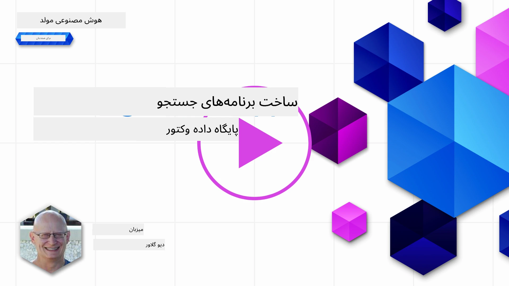
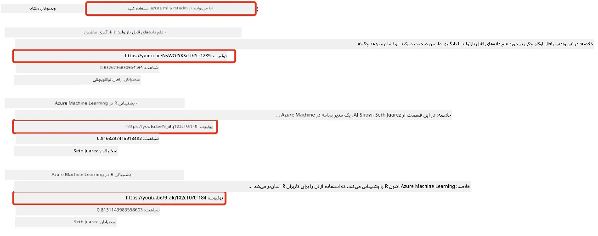
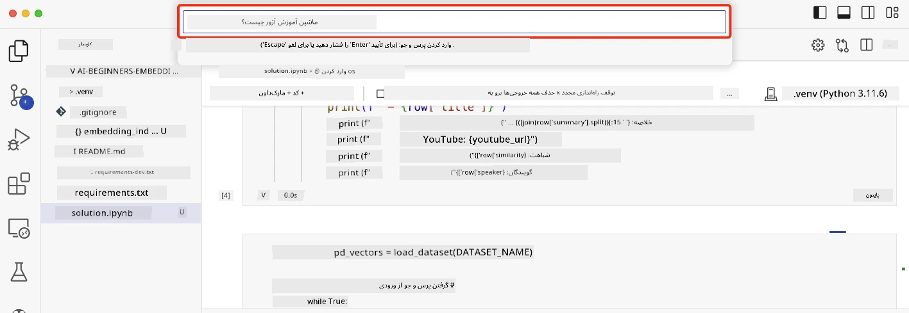

# ساخت برنامه‌های جستجو

[](https://youtu.be/W0-nzXjOjr0?si=GcsqiTTvd7RKbo7V)

> > _برای مشاهده ویدیو این درس روی تصویر بالا کلیک کنید_

مدل‌های بزرگ زبان (LLM) فراتر از چت‌بات‌ها و تولید متن هستند. همچنین می‌توان با استفاده از امبدینگ‌ها برنامه‌های جستجو ساخت. امبدینگ‌ها نمایش‌های عددی داده‌ها هستند که به شکل بردار شناخته می‌شوند و برای جستجوی معنایی داده‌ها استفاده می‌شوند.

در این درس، شما یک برنامه جستجو برای استارتاپ آموزشیمان می‌سازید. استارتاپ ما یک سازمان غیرانتفاعی است که آموزش رایگان به دانش‌آموزان در کشورهای در حال توسعه ارائه می‌دهد. استارتاپ ما تعداد زیادی ویدیوهای یوتیوب دارد که دانش‌آموزان می‌توانند برای یادگیری هوش مصنوعی از آن‌ها استفاده کنند. استارتاپ ما می‌خواهد برنامه جستجویی بسازد که به دانش‌آموزان اجازه دهد با تایپ سؤال، ویدیوی یوتیوب مربوطه را جستجو کنند.

به عنوان مثال، دانش‌آموز ممکن است «دفترچه‌های Jupyter چیست؟» یا «Azure ML چیست؟» را تایپ کند و برنامه جستجو فهرستی از ویدیوهای یوتیوب مرتبط با سؤال را بازگرداند، و بهتر از آن، برنامه جستجو لینکی به قسمت ویدیو که پاسخ سؤال در آن قرار دارد ارائه دهد.

## معرفی

در این درس، موضوعات زیر پوشش داده می‌شود:

- جستجوی معنایی در مقابل جستجوی کلمه‌ای.
- امبدینگ‌های متنی چیستند.
- ایجاد شاخص امبدینگ متنی.
- جستجو در شاخص امبدینگ متنی.

## اهداف یادگیری

پس از تکمیل این درس، قادر خواهید بود:

- تفاوت بین جستجوی معنایی و جستجوی کلمه‌ای را توضیح دهید.
- بگویید امبدینگ‌های متنی چیستند.
- با استفاده از امبدینگ‌ها، برنامه‌ای برای جستجوی داده‌ها بسازید.

## چرا برنامه جستجو بسازیم؟

ساخت برنامه جستجو به شما کمک می‌کند یاد بگیرید چگونه از امبدینگ‌ها برای جستجوی داده‌ها استفاده کنید. همچنین یاد می‌گیرید چگونه برنامه جستجویی بسازید که دانش‌آموزان بتوانند سریعاً به اطلاعات دسترسی پیدا کنند.

این درس شامل شاخص امبدینگ از رونوشت‌های ویدیوهای یوتیوب کانال Microsoft [AI Show](https://www.youtube.com/playlist?list=PLlrxD0HtieHi0mwteKBOfEeOYf0LJU4O1) است. AI Show کانال یوتیوبی است که در مورد هوش مصنوعی و یادگیری ماشین آموزش می‌دهد. شاخص امبدینگ امبدینگ‌های هر رونوشت ویدیو تا اکتبر ۲۰۲۳ را شامل می‌شود. شما از این شاخص امبدینگ برای ساخت برنامه جستجویی برای استارتاپ ما استفاده خواهید کرد. برنامه جستجو لینکی به محل پاسخ سؤال در ویدیو ارائه می‌دهد که روشی عالی است برای کمک به دانش‌آموزان برای یافتن سریع اطلاعات مورد نیاز.

نمونه‌ای از یک پرس‌وجوی معنایی برای سؤال «آیا می‌توان از rstudio با Azure ML استفاده کرد؟» در زیر آمده است. URL یوتیوب را بررسی کنید؛ می‌بینید که حاوی نشانی زمان است که شما را به محلی در ویدیو می‌برد که پاسخ سؤال آنجاست.



## جستجوی معنایی چیست؟

ممکن است بپرسید جستجوی معنایی چیست؟ جستجوی معنایی تکنیکی است که از معنای واژه‌ها در یک پرس‌وجو برای بازگرداندن نتایج مرتبط استفاده می‌کند.

اینجا مثالی از جستجوی معنایی است. فرض کنید دنبال خرید یک خودرو هستید، ممکن است «خودروی رویایی من» را جستجو کنید، جستجوی معنایی درک می‌کند که شما در حال خواب دیدن درباره خودرو نیستید بلکه دنبال خودروی «ایده‌آل» خود هستید. جستجوی معنایی نیت شما را متوجه می‌شود و نتایج مرتبط را بازمی‌گرداند. جایگزین آن «جستجوی کلمه‌ای» است که دقیقاً دنبال کلمه «خواب» درباره خودروها می‌گردد و اغلب نتایج نامرتبط می‌آورد.

## امبدینگ‌های متنی چیستند؟

[امبدینگ‌های متنی](https://en.wikipedia.org/wiki/Word_embedding?WT.mc_id=academic-105485-koreyst) تکنیکی برای نمایش متن است که در [پردازش زبان طبیعی](https://en.wikipedia.org/wiki/Natural_language_processing?WT.mc_id=academic-105485-koreyst) استفاده می‌شود. امبدینگ‌های متنی نمایش‌های عددی معنایی متن هستند. امبدینگ‌ها برای نمایش داده‌ها به شکلی که ماشین به خوبی بتواند درک کند کاربرد دارد. مدل‌های متعددی برای ساخت امبدینگ‌های متنی وجود دارد، در این درس بر تولید امبدینگ با استفاده از مدل OpenAI Embedding تمرکز خواهیم کرد.

اینجا مثالی است، فرض کنید متن زیر بخشی از رونوشت یکی از قسمت‌های کانال AI Show در یوتیوب باشد:

```text
Today we are going to learn about Azure Machine Learning.
```

متن را به API امبدینگ OpenAI می‌دهیم و آن عبارت عددی ۱۵۳۶ تایی به شکل بردار را بازمی‌گرداند. هر عدد در این بردار نمایانگر جنبه‌ای متفاوت از متن است. برای اختصار، اینجا ۱۰ عدد اول بردار را نشان می‌دهیم.

```python
[-0.006655829958617687, 0.0026128944009542465, 0.008792596869170666, -0.02446001023054123, -0.008540431968867779, 0.022071078419685364, -0.010703742504119873, 0.003311325330287218, -0.011632772162556648, -0.02187200076878071, ...]
```

## شاخص امبدینگ چگونه ساخته می‌شود؟

شاخص امبدینگ برای این درس با مجموعه‌ای از اسکریپت‌های پایتون ساخته شده است. این اسکریپت‌ها همراه با دستورالعمل‌ها را در [README](./scripts/README.md?WT.mc_id=academic-105485-koreyst) در پوشه 'scripts' این درس می‌یابید. برای کامل کردن این درس نیازی به اجرای این اسکریپت‌ها ندارید چون شاخص امبدینگ برای شما ارائه شده است.

اسکریپت‌ها کارهای زیر را انجام می‌دهند:

1. رونوشت هر ویدیوی یوتیوب در پلی‌لیست [AI Show](https://www.youtube.com/playlist?list=PLlrxD0HtieHi0mwteKBOfEeOYf0LJU4O1) دانلود می‌شود.
2. با استفاده از [توابع OpenAI](https://learn.microsoft.com/azure/ai-foundry/openai/how-to/function-calling?WT.mc_id=academic-105485-koreyst)، تلاش می‌شود نام سخنران از ۳ دقیقه اول رونوشت یوتیوب استخراج شود. نام سخنران هر ویدیو در شاخص امبدینگ به نام `embedding_index_3m.json` ذخیره می‌گردد.
3. متن رونوشت به قطعات متنی **۳ دقیقه‌ای** تقسیم می‌شود. این قطعات تقریباً ۲۰ کلمه همپوشانی از قطعه بعدی دارند تا اطمینان حاصل شود که امبدینگ قطعه قطع نمی‌شود و زمینه جستجوی بهتری فراهم شود.
4. هر قطعه متن به API چت OpenAI داده می‌شود تا متن را در ۶۰ کلمه خلاصه کند. خلاصه نیز در شاخص امبدینگ `embedding_index_3m.json` ذخیره می‌شود.
5. در نهایت، متن قطعه به API امبدینگ OpenAI داده می‌شود. این API برداری ۱۵۳۶ تایی که معنای معنایی قطعه را نشان می‌دهد بازمی‌گرداند. قطعه به همراه بردار امبدینگ OpenAI در شاخص امبدینگ `embedding_index_3m.json` ذخیره می‌شود.

### پایگاه‌های داده برداری

برای ساده‌سازی درس، شاخص امبدینگ در یک فایل JSON به نام `embedding_index_3m.json` ذخیره و در یک DataFrame از Pandas بارگذاری می‌شود. اما در تولید، شاخص امبدینگ در پایگاه داده برداری مانند [Azure Cognitive Search](https://learn.microsoft.com/training/modules/improve-search-results-vector-search?WT.mc_id=academic-105485-koreyst)، [Redis](https://cookbook.openai.com/examples/vector_databases/redis/readme?WT.mc_id=academic-105485-koreyst)، [Pinecone](https://cookbook.openai.com/examples/vector_databases/pinecone/readme?WT.mc_id=academic-105485-koreyst)، [Weaviate](https://cookbook.openai.com/examples/vector_databases/weaviate/readme?WT.mc_id=academic-105485-koreyst)، و غیره ذخیره می‌شود.

## آشنایی با شباهت کسینوسی

ما با امبدینگ‌های متنی آشنا شدیم، مرحله بعدی یادگیری نحوه استفاده از امبدینگ‌های متنی برای جستجوی داده‌ها و به‌خصوص پیدا کردن مشابه‌ترین امبدینگ‌ها با پرس‌وجوی داده شده با استفاده از شباهت کسینوسی است.

### شباهت کسینوسی چیست؟

شباهت کسینوسی معیاری برای سنجش شباهت بین دو بردار است، که به آن «جستجوی نزدیک‌ترین همسایه» نیز گفته می‌شود. برای انجام جستجوی شباهت کسینوسی باید متن پرس‌وجو را با استفاده از API امبدینگ OpenAI به بردار تبدیل کنید. سپس شباهت کسینوسی میان بردار پرس‌وجو و هر بردار در شاخص امبدینگ را محاسبه کنید. به یاد داشته باشید شاخص امبدینگ شامل برداری برای هر قطعه متن رونوشت یوتیوب است. در نهایت نتایج را بر اساس شباهت کسینوسی مرتب کنید و قطعات متنی با بیشترین شباهت، بیشترین تشابه را با پرس‌وجو دارند.

از منظر ریاضی، شباهت کسینوسی کسینوس زاویه بین دو بردار را در فضای چندبعدی اندازه می‌گیرد. این اندازه‌گیری مفید است چون دو سند ممکن است از نظر فاصله اقلیدسی به خاطر اندازه بسیار دور باشند ولی زاویه کوچکتری بین بردارهایشان وجود داشته باشد و به همین دلیل شباهت کسینوسی بالاتری داشته باشند. برای اطلاعات بیشتر درباره معادلات شباهت کسینوسی، به صفحه [شباهت کسینوسی](https://en.wikipedia.org/wiki/Cosine_similarity?WT.mc_id=academic-105485-koreyst) مراجعه کنید.

## ساخت اولین برنامه جستجوی خود

در ادامه، می‌آموزیم چگونه برنامه جستجو با استفاده از امبدینگ بسازیم. این برنامه به دانش‌آموزان اجازه می‌دهد با تایپ سؤال به جستجوی ویدیو بپردازند. برنامه فهرستی از ویدیوهای مرتبط با سؤال را برمی‌گرداند. همچنین لینک به محل پاسخ سؤال در ویدیو را ارائه می‌دهد.

این راه‌حل روی ویندوز ۱۱، macOS و اوبونتو ۲۲.۰۴ با استفاده از پایتون ۳.۱۰ یا جدیدتر ساخته و آزمایش شده است. می‌توانید پایتون را از [python.org](https://www.python.org/downloads/?WT.mc_id=academic-105485-koreyst) دانلود کنید.

## تمرین - ساخت برنامه جستجو برای کمک به دانش‌آموزان

ما استارتاپ خود را در ابتدای این درس معرفی کردیم. اکنون وقت آن است که به دانش‌آموزان کمک کنیم تا برنامه جستجو را برای ارزیابی‌های خود بسازند.

در این تمرین، شما سرویس‌های Azure OpenAI را ایجاد خواهید کرد که برای ساخت برنامه جستجو به آنها نیاز است. سرویس‌های زیر را ایجاد خواهید کرد. برای انجام این تمرین به اشتراک Azure نیاز دارید.

### شروع Azure Cloud Shell

1. وارد [پرتال Azure](https://portal.azure.com/?WT.mc_id=academic-105485-koreyst) شوید.
2. آیکون Cloud Shell را در گوشه بالای سمت راست پرتال Azure انتخاب کنید.
3. برای نوع محیط، **Bash** را انتخاب کنید.

#### ایجاد گروه منابع

> برای این دستورها، از گروه منابع به نام "semantic-video-search" در ناحیه East US استفاده می‌کنیم.
> می‌توانید نام گروه منابع را تغییر دهید، اما هنگام تغییر موقعیت منابع،
> جدول [دسترس‌پذیری مدل‌ها](https://aka.ms/oai/models?WT.mc_id=academic-105485-koreyst) را بررسی کنید.

```shell
az group create --name semantic-video-search --location eastus
```

#### ایجاد منبع Azure OpenAI Service

در Azure Cloud Shell، فرمان زیر را برای ایجاد منبع Azure OpenAI Service اجرا کنید.

```shell
az cognitiveservices account create --name semantic-video-openai --resource-group semantic-video-search \
    --location eastus --kind OpenAI --sku s0
```

#### دریافت نقطه پایان و کلیدها برای استفاده در این برنامه

در Azure Cloud Shell، فرمان‌های زیر را برای دریافت نقطه پایان و کلیدهای سرویس Azure OpenAI اجرا کنید.

```shell
az cognitiveservices account show --name semantic-video-openai \
   --resource-group  semantic-video-search | jq -r .properties.endpoint
az cognitiveservices account keys list --name semantic-video-openai \
   --resource-group semantic-video-search | jq -r .key1
```

#### استقرار مدل OpenAI Embedding

در Azure Cloud Shell، فرمان زیر را برای استقرار مدل OpenAI Embedding اجرا کنید.

```shell
az cognitiveservices account deployment create \
    --name semantic-video-openai \
    --resource-group  semantic-video-search \
    --deployment-name text-embedding-ada-002 \
    --model-name text-embedding-ada-002 \
    --model-version "2"  \
    --model-format OpenAI \
    --sku-capacity 100 --sku-name "Standard"
```

## راه‌حل

دفترچه راه‌حل را در [solution notebook](./python/aoai-solution.ipynb?WT.mc_id=academic-105485-koreyst) در GitHub Codespaces باز کرده و دستورالعمل‌ها را در Jupyter Notebook دنبال کنید.

وقتی دفترچه را اجرا می‌کنید، از شما خواسته می‌شود یک پرس‌وجو وارد کنید. جعبه ورودی مشابه شکل زیر خواهد بود:



## کار عالی! یادگیری خود را ادامه دهید

پس از اتمام این درس، مجموعه [یادگیری هوش مصنوعی مولد](https://aka.ms/genai-collection?WT.mc_id=academic-105485-koreyst) ما را بررسی کنید تا دانش خود را در هوش مصنوعی مولد افزایش دهید!

به درس ۹ بروید که در آن به نحوه [ساخت برنامه‌های تولید تصویر](../09-building-image-applications/README.md?WT.mc_id=academic-105485-koreyst) می‌پردازیم!

---

<!-- CO-OP TRANSLATOR DISCLAIMER START -->
**سلب مسئولیت**:
این سند با استفاده از سرویس ترجمه هوش مصنوعی [Co-op Translator](https://github.com/Azure/co-op-translator) ترجمه شده است. در حالی که ما در تلاش برای دقت هستیم، لطفاً توجه داشته باشید که ترجمه‌های خودکار ممکن است شامل خطاها یا نادرستی‌هایی باشند. سند اصلی به زبان مادری خود باید به عنوان منبع معتبر در نظر گرفته شود. برای اطلاعات حیاتی، ترجمه حرفه‌ای انسانی توصیه می‌شود. ما در قبال هرگونه سوء تفاهم یا برداشت نادرست ناشی از استفاده از این ترجمه مسئولیتی نداریم.
<!-- CO-OP TRANSLATOR DISCLAIMER END -->