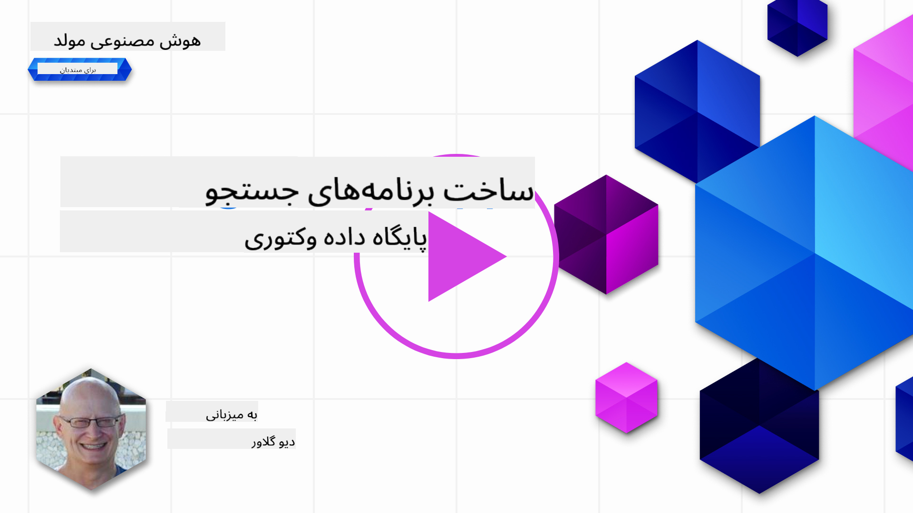
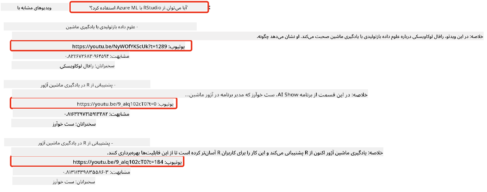
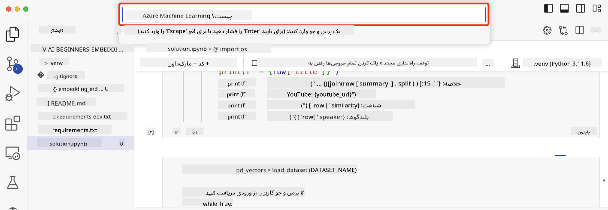

<!--
CO_OP_TRANSLATOR_METADATA:
{
  "original_hash": "d46aad0917a1a342d613e2c13d457da5",
  "translation_date": "2025-06-25T16:13:57+00:00",
  "source_file": "08-building-search-applications/README.md",
  "language_code": "fa"
}
-->
# ساخت برنامه‌های جستجو

[](https://aka.ms/gen-ai-lesson8-gh?WT.mc_id=academic-105485-koreyst)

> > _روی تصویر بالا کلیک کنید تا ویدئوی این درس را مشاهده کنید_

مدل‌های زبان بزرگ فقط به چت‌بات‌ها و تولید متن محدود نمی‌شوند. امکان ساخت برنامه‌های جستجو با استفاده از Embeddings نیز وجود دارد. Embeddings نمایش‌های عددی از داده‌ها هستند که به عنوان بردارها شناخته می‌شوند و می‌توانند برای جستجوی معنایی داده‌ها استفاده شوند.

در این درس، شما قصد دارید یک برنامه جستجو برای استارتاپ آموزشی ما بسازید. استارتاپ ما یک سازمان غیرانتفاعی است که آموزش رایگان به دانش‌آموزان در کشورهای در حال توسعه ارائه می‌دهد. استارتاپ ما تعداد زیادی ویدئوی یوتیوب دارد که دانش‌آموزان می‌توانند از آنها برای یادگیری درباره هوش مصنوعی استفاده کنند. استارتاپ ما می‌خواهد یک برنامه جستجو بسازد که به دانش‌آموزان اجازه دهد با تایپ یک سوال به دنبال ویدئوی یوتیوب بگردند.

برای مثال، یک دانش‌آموز ممکن است تایپ کند 'دفترچه‌های Jupyter چیست؟' یا 'Azure ML چیست؟' و برنامه جستجو فهرستی از ویدئوهای یوتیوب مرتبط با سوال را برگرداند و بهتر از این، برنامه جستجو لینکی به محلی در ویدئو که پاسخ سوال در آنجا قرار دارد برگرداند.

## مقدمه

در این درس، ما موارد زیر را پوشش خواهیم داد:

- جستجوی معنایی در مقابل جستجوی کلیدواژه.
- Embeddings متن چیستند.
- ایجاد یک شاخص Embeddings متن.
- جستجوی یک شاخص Embeddings متن.

## اهداف یادگیری

پس از تکمیل این درس، شما قادر خواهید بود:

- تفاوت بین جستجوی معنایی و کلیدواژه را بیان کنید.
- توضیح دهید که Embeddings متن چیستند.
- یک برنامه با استفاده از Embeddings برای جستجوی داده‌ها ایجاد کنید.

## چرا باید یک برنامه جستجو بسازیم؟

ایجاد یک برنامه جستجو به شما کمک می‌کند تا بفهمید چگونه از Embeddings برای جستجوی داده‌ها استفاده کنید. همچنین یاد خواهید گرفت چگونه یک برنامه جستجو بسازید که دانش‌آموزان بتوانند از آن برای یافتن اطلاعات به سرعت استفاده کنند.

این درس شامل یک شاخص Embedding از متن‌های یوتیوب کانال [AI Show](https://www.youtube.com/playlist?list=PLlrxD0HtieHi0mwteKBOfEeOYf0LJU4O1) مایکروسافت است. AI Show یک کانال یوتیوب است که درباره هوش مصنوعی و یادگیری ماشین آموزش می‌دهد. شاخص Embedding شامل Embeddings هر یک از متن‌های یوتیوب تا اکتبر 2023 است. شما از شاخص Embedding برای ساخت یک برنامه جستجو برای استارتاپ ما استفاده خواهید کرد. برنامه جستجو لینکی به محلی در ویدئو که پاسخ سوال در آنجا قرار دارد برمی‌گرداند. این یک راه عالی برای دانش‌آموزان است که به سرعت اطلاعات مورد نیاز خود را پیدا کنند.

در زیر یک مثال از یک جستجوی معنایی برای سوال 'آیا می‌توانید از rstudio با azure ml استفاده کنید؟' آمده است. به URL یوتیوب توجه کنید، خواهید دید که URL شامل یک تایم‌استمپ است که شما را به محلی در ویدئو که پاسخ سوال در آنجا قرار دارد می‌برد.



## جستجوی معنایی چیست؟

اکنون ممکن است بپرسید، جستجوی معنایی چیست؟ جستجوی معنایی یک تکنیک جستجو است که از معنا یا مفهوم کلمات در یک پرسش برای برگرداندن نتایج مرتبط استفاده می‌کند.

اینجا یک مثال از جستجوی معنایی است. فرض کنید شما به دنبال خرید یک خودرو هستید، ممکن است جستجو کنید 'خودروی رویایی من'، جستجوی معنایی می‌فهمد که شما در `dreaming` درباره یک خودرو نیستید، بلکه به دنبال خرید خودروی `ideal` خود هستید. جستجوی معنایی قصد شما را می‌فهمد و نتایج مرتبط را برمی‌گرداند. جایگزین آن `keyword search` است که به طور مستقیم درباره رویاهای مربوط به خودروها جستجو می‌کند و اغلب نتایج غیرمرتبط برمی‌گرداند.

## Embeddings متن چیستند؟

[Embeddings متن](https://en.wikipedia.org/wiki/Word_embedding?WT.mc_id=academic-105485-koreyst) یک تکنیک نمایش متن است که در [پردازش زبان طبیعی](https://en.wikipedia.org/wiki/Natural_language_processing?WT.mc_id=academic-105485-koreyst) استفاده می‌شود. Embeddings متن نمایش‌های عددی معنایی از متن هستند. Embeddings برای نمایش داده‌ها به گونه‌ای استفاده می‌شوند که برای ماشین‌ها آسان باشد تا آنها را بفهمند. مدل‌های زیادی برای ساخت Embeddings متن وجود دارد، در این درس ما بر روی تولید Embeddings با استفاده از مدل Embedding OpenAI تمرکز خواهیم کرد.

اینجا یک مثال است، فرض کنید متن زیر در یک متن از یکی از قسمت‌های کانال یوتیوب AI Show آمده است:

```text
Today we are going to learn about Azure Machine Learning.
```

ما متن را به API Embedding OpenAI می‌فرستیم و آن یک Embedding شامل 1536 عدد یا همان بردار را برمی‌گرداند. هر عدد در بردار نماینده یک جنبه متفاوت از متن است. برای اختصار، اینجا 10 عدد اول در بردار آمده است.

```python
[-0.006655829958617687, 0.0026128944009542465, 0.008792596869170666, -0.02446001023054123, -0.008540431968867779, 0.022071078419685364, -0.010703742504119873, 0.003311325330287218, -0.011632772162556648, -0.02187200076878071, ...]
```

## شاخص Embedding چگونه ایجاد می‌شود؟

شاخص Embedding برای این درس با مجموعه‌ای از اسکریپت‌های پایتون ایجاد شده است. شما اسکریپت‌ها را همراه با دستورالعمل‌ها در [README](./scripts/README.md?WT.mc_id=academic-105485-koreyst) در پوشه 'scripts` برای این درس پیدا خواهید کرد. نیازی نیست این اسکریپت‌ها را برای تکمیل این درس اجرا کنید زیرا شاخص Embedding برای شما فراهم شده است.

اسکریپت‌ها عملیات زیر را انجام می‌دهند:

1. متن برای هر ویدئوی یوتیوب در لیست پخش [AI Show](https://www.youtube.com/playlist?list=PLlrxD0HtieHi0mwteKBOfEeOYf0LJU4O1) دانلود می‌شود.
2. با استفاده از [توابع OpenAI](https://learn.microsoft.com/azure/ai-services/openai/how-to/function-calling?WT.mc_id=academic-105485-koreyst)، تلاش می‌شود نام سخنران از 3 دقیقه اول متن یوتیوب استخراج شود. نام سخنران برای هر ویدئو در شاخص Embedding با نام `embedding_index_3m.json` ذخیره می‌شود.
3. سپس متن به **بخش‌های 3 دقیقه‌ای** تقسیم می‌شود. بخش شامل حدود 20 کلمه از بخش بعدی است تا اطمینان حاصل شود که Embedding برای بخش قطع نشده و زمینه جستجوی بهتری فراهم می‌کند.
4. هر بخش متن سپس به API Chat OpenAI فرستاده می‌شود تا متن به 60 کلمه خلاصه شود. خلاصه نیز در شاخص Embedding `embedding_index_3m.json` ذخیره می‌شود.
5. در نهایت، متن بخش به API Embedding OpenAI فرستاده می‌شود. API Embedding یک بردار از 1536 عدد را برمی‌گرداند که معنای معنایی بخش را نشان می‌دهد. بخش همراه با بردار Embedding OpenAI در شاخص Embedding `embedding_index_3m.json` ذخیره می‌شود.

### پایگاه‌های داده برداری

برای سادگی درس، شاخص Embedding در یک فایل JSON با نام `embedding_index_3m.json` ذخیره می‌شود و به یک DataFrame Pandas بارگذاری می‌شود. اما در تولید، شاخص Embedding در یک پایگاه داده برداری مانند [Azure Cognitive Search](https://learn.microsoft.com/training/modules/improve-search-results-vector-search?WT.mc_id=academic-105485-koreyst)، [Redis](https://cookbook.openai.com/examples/vector_databases/redis/readme?WT.mc_id=academic-105485-koreyst)، [Pinecone](https://cookbook.openai.com/examples/vector_databases/pinecone/readme?WT.mc_id=academic-105485-koreyst)، [Weaviate](https://cookbook.openai.com/examples/vector_databases/weaviate/readme?WT.mc_id=academic-105485-koreyst)، و غیره ذخیره می‌شود.

## درک شباهت کسینوسی

ما درباره Embeddings متن یاد گرفتیم، مرحله بعدی یادگیری نحوه استفاده از Embeddings متن برای جستجوی داده‌ها و به خصوص یافتن Embeddings مشابه‌ترین به یک پرسش داده شده با استفاده از شباهت کسینوسی است.

### شباهت کسینوسی چیست؟

شباهت کسینوسی یک معیار شباهت بین دو بردار است، همچنین ممکن است به عنوان `nearest neighbor search` شنیده شود. برای انجام یک جستجوی شباهت کسینوسی، باید متن پرسش را با استفاده از API Embedding OpenAI _بردار کنید_. سپس شباهت کسینوسی بین بردار پرسش و هر بردار در شاخص Embedding را محاسبه کنید. به یاد داشته باشید، شاخص Embedding یک بردار برای هر بخش متن متن یوتیوب دارد. در نهایت، نتایج را بر اساس شباهت کسینوسی مرتب کنید و بخش‌های متن با بالاترین شباهت کسینوسی مشابه‌ترین به پرسش هستند.

از دیدگاه ریاضی، شباهت کسینوسی کسینوس زاویه بین دو بردار در یک فضای چندبعدی را اندازه‌گیری می‌کند. این اندازه‌گیری مفید است، زیرا اگر دو سند به دلیل اندازه از نظر فاصله اقلیدسی دور باشند، ممکن است هنوز زاویه کوچکتری بین آنها وجود داشته باشد و بنابراین شباهت کسینوسی بالاتری داشته باشند. برای اطلاعات بیشتر درباره معادلات شباهت کسینوسی، به [شباهت کسینوسی](https://en.wikipedia.org/wiki/Cosine_similarity?WT.mc_id=academic-105485-koreyst) مراجعه کنید.

## ساخت اولین برنامه جستجوی خود

بعدی، ما یاد خواهیم گرفت چگونه یک برنامه جستجو با استفاده از Embeddings بسازیم. برنامه جستجو به دانش‌آموزان اجازه می‌دهد تا با تایپ یک سوال به دنبال ویدئو بگردند. برنامه جستجو فهرستی از ویدئوهایی که مرتبط با سوال هستند را برمی‌گرداند. برنامه جستجو همچنین لینکی به محلی در ویدئو که پاسخ سوال در آنجا قرار دارد برمی‌گرداند.

این راه‌حل بر روی Windows 11، macOS و Ubuntu 22.04 با استفاده از Python 3.10 یا بالاتر ساخته و آزمایش شده است. می‌توانید Python را از [python.org](https://www.python.org/downloads/?WT.mc_id=academic-105485-koreyst) دانلود کنید.

## تکلیف - ساخت یک برنامه جستجو، برای فعال‌سازی دانش‌آموزان

ما استارتاپ خود را در ابتدای این درس معرفی کردیم. اکنون زمان آن است که دانش‌آموزان را برای ساخت یک برنامه جستجو برای ارزیابی‌های خود فعال کنیم.

در این تکلیف، شما سرویس‌های Azure OpenAI را ایجاد خواهید کرد که برای ساخت برنامه جستجو استفاده خواهند شد. شما سرویس‌های Azure OpenAI زیر را ایجاد خواهید کرد. برای تکمیل این تکلیف به یک اشتراک Azure نیاز دارید.

### شروع Azure Cloud Shell

1. وارد [پورتال Azure](https://portal.azure.com/?WT.mc_id=academic-105485-koreyst) شوید.
2. آیکون Cloud Shell را در گوشه بالای راست پورتال Azure انتخاب کنید.
3. **Bash** را برای نوع محیط انتخاب کنید.

#### ایجاد یک گروه منابع

> برای این دستورالعمل‌ها، ما از گروه منابع با نام "semantic-video-search" در شرق ایالات متحده استفاده می‌کنیم.
> می‌توانید نام گروه منابع را تغییر دهید، اما هنگام تغییر مکان برای منابع،
> جدول دسترسی مدل را بررسی کنید [model availability table](https://aka.ms/oai/models?WT.mc_id=academic-105485-koreyst).

```shell
az group create --name semantic-video-search --location eastus
```

#### ایجاد یک منبع سرویس Azure OpenAI

از Azure Cloud Shell، دستور زیر را برای ایجاد یک منبع سرویس Azure OpenAI اجرا کنید.

```shell
az cognitiveservices account create --name semantic-video-openai --resource-group semantic-video-search \
    --location eastus --kind OpenAI --sku s0
```

#### دریافت نقطه پایانی و کلیدها برای استفاده در این برنامه

از Azure Cloud Shell، دستورات زیر را برای دریافت نقطه پایانی و کلیدها برای منبع سرویس Azure OpenAI اجرا کنید.

```shell
az cognitiveservices account show --name semantic-video-openai \
   --resource-group  semantic-video-search | jq -r .properties.endpoint
az cognitiveservices account keys list --name semantic-video-openai \
   --resource-group semantic-video-search | jq -r .key1
```

#### استقرار مدل Embedding OpenAI

از Azure Cloud Shell، دستور زیر را برای استقرار مدل Embedding OpenAI اجرا کنید.

```shell
az cognitiveservices account deployment create \
    --name semantic-video-openai \
    --resource-group  semantic-video-search \
    --deployment-name text-embedding-ada-002 \
    --model-name text-embedding-ada-002 \
    --model-version "2"  \
    --model-format OpenAI \
    --sku-capacity 100 --sku-name "Standard"
```

## راه‌حل

دفترچه [راه‌حل](../../../08-building-search-applications/python/aoai-solution.ipynb) را در GitHub Codespaces باز کنید و دستورالعمل‌ها را در دفترچه Jupyter دنبال کنید.

هنگامی که دفترچه را اجرا می‌کنید، از شما خواسته می‌شود یک پرسش وارد کنید. جعبه ورودی به شکل زیر خواهد بود:



## کار عالی! ادامه یادگیری شما

پس از تکمیل این درس، مجموعه [یادگیری هوش مصنوعی تولیدی](https://aka.ms/genai-collection?WT.mc_id=academic-105485-koreyst) ما را بررسی کنید تا دانش خود درباره هوش مصنوعی تولیدی را افزایش دهید!

به درس 9 بروید که در آن نحوه [ساخت برنامه‌های تولید تصویر](../09-building-image-applications/README.md?WT.mc_id=academic-105485-koreyst) را بررسی خواهیم کرد!

**سلب مسئولیت**:  
این سند با استفاده از خدمات ترجمه هوش مصنوعی [Co-op Translator](https://github.com/Azure/co-op-translator) ترجمه شده است. در حالی که ما برای دقت تلاش می‌کنیم، لطفاً توجه داشته باشید که ترجمه‌های خودکار ممکن است حاوی خطاها یا نادقتی‌هایی باشند. سند اصلی به زبان مادری آن باید به عنوان منبع معتبر در نظر گرفته شود. برای اطلاعات حیاتی، ترجمه انسانی حرفه‌ای توصیه می‌شود. ما مسئولیتی در قبال هرگونه سوء تفاهم یا تفسیر نادرست ناشی از استفاده از این ترجمه نداریم.