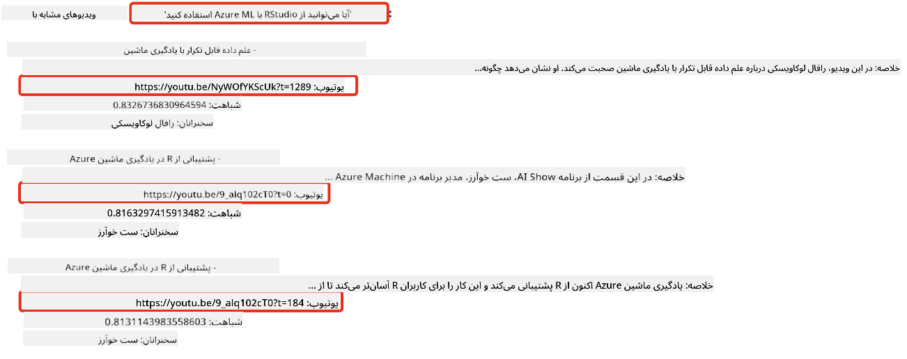
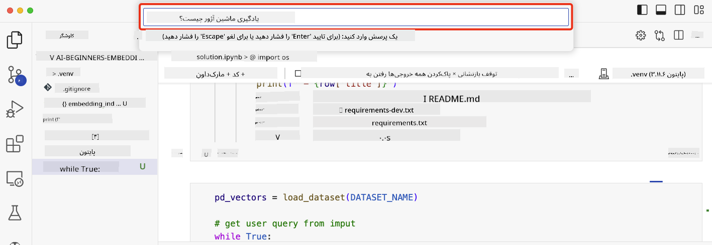

<!--
CO_OP_TRANSLATOR_METADATA:
{
  "original_hash": "d46aad0917a1a342d613e2c13d457da5",
  "translation_date": "2025-07-09T12:47:30+00:00",
  "source_file": "08-building-search-applications/README.md",
  "language_code": "fa"
}
-->
# ساخت برنامه‌های جستجو

[](https://aka.ms/gen-ai-lesson8-gh?WT.mc_id=academic-105485-koreyst)

> > _برای مشاهده ویدیو این درس روی تصویر بالا کلیک کنید_

مدل‌های زبان بزرگ فقط برای چت‌بات‌ها و تولید متن نیستند. همچنین می‌توان با استفاده از Embeddings برنامه‌های جستجو ساخت. Embeddings نمایش‌های عددی داده‌ها هستند که به آن‌ها بردار هم گفته می‌شود و می‌توانند برای جستجوی معنایی داده‌ها استفاده شوند.

در این درس، شما یک برنامه جستجو برای استارتاپ آموزشی ما خواهید ساخت. استارتاپ ما یک سازمان غیرانتفاعی است که آموزش رایگان به دانش‌آموزان در کشورهای در حال توسعه ارائه می‌دهد. استارتاپ ما تعداد زیادی ویدیو در یوتیوب دارد که دانش‌آموزان می‌توانند برای یادگیری هوش مصنوعی از آن‌ها استفاده کنند. استارتاپ ما می‌خواهد برنامه‌ای بسازد که به دانش‌آموزان اجازه دهد با تایپ یک سوال، ویدیوی یوتیوب مرتبط را جستجو کنند.

برای مثال، یک دانش‌آموز ممکن است بنویسد «دفترچه‌های Jupyter چیستند؟» یا «Azure ML چیست؟» و برنامه جستجو فهرستی از ویدیوهای یوتیوب مرتبط با سوال را برگرداند، و بهتر از آن، برنامه جستجو لینکی به قسمتی از ویدیو که پاسخ سوال در آن قرار دارد ارائه دهد.

## مقدمه

در این درس، موارد زیر را بررسی خواهیم کرد:

- جستجوی معنایی در مقابل جستجوی کلیدواژه‌ای.
- Embeddings متنی چیستند.
- ساخت یک شاخص Embeddings متنی.
- جستجو در شاخص Embeddings متنی.

## اهداف یادگیری

پس از اتمام این درس، قادر خواهید بود:

- تفاوت بین جستجوی معنایی و جستجوی کلیدواژه‌ای را توضیح دهید.
- توضیح دهید Embeddings متنی چیستند.
- برنامه‌ای با استفاده از Embeddings برای جستجوی داده‌ها بسازید.

## چرا برنامه جستجو بسازیم؟

ساخت برنامه جستجو به شما کمک می‌کند بفهمید چگونه از Embeddings برای جستجوی داده‌ها استفاده کنید. همچنین یاد می‌گیرید چگونه برنامه‌ای بسازید که دانش‌آموزان بتوانند به سرعت اطلاعات مورد نیازشان را پیدا کنند.

این درس شامل یک شاخص Embedding از متن‌های ویدیوهای یوتیوب کانال Microsoft [AI Show](https://www.youtube.com/playlist?list=PLlrxD0HtieHi0mwteKBOfEeOYf0LJU4O1) است. AI Show کانالی در یوتیوب است که درباره هوش مصنوعی و یادگیری ماشین آموزش می‌دهد. شاخص Embedding شامل Embeddings متن‌های ویدیوها تا اکتبر ۲۰۲۳ است. شما از این شاخص برای ساخت برنامه جستجو برای استارتاپ ما استفاده خواهید کرد. برنامه جستجو لینکی به قسمتی از ویدیو که پاسخ سوال در آن است ارائه می‌دهد. این روش عالی است تا دانش‌آموزان سریع‌تر به اطلاعات مورد نیازشان دسترسی پیدا کنند.

در ادامه نمونه‌ای از یک پرس‌وجوی معنایی برای سوال «آیا می‌توان از rstudio با azure ml استفاده کرد؟» آمده است. آدرس یوتیوب را ببینید، متوجه می‌شوید که آدرس شامل یک زمان‌سنج است که شما را به قسمتی از ویدیو می‌برد که پاسخ سوال در آن قرار دارد.



## جستجوی معنایی چیست؟

شاید بپرسید جستجوی معنایی چیست؟ جستجوی معنایی روشی است که از معنا یا مفهوم کلمات در یک پرس‌وجو استفاده می‌کند تا نتایج مرتبط را برگرداند.

در اینجا مثالی از جستجوی معنایی داریم. فرض کنید می‌خواهید یک ماشین بخرید، ممکن است جستجو کنید «ماشین رویایی من». جستجوی معنایی می‌فهمد که شما در حال خواب دیدن درباره ماشین نیستید، بلکه دنبال خرید ماشین ایده‌آل خود هستید. جستجوی معنایی نیت شما را درک می‌کند و نتایج مرتبط را برمی‌گرداند. در مقابل، جستجوی کلیدواژه‌ای به صورت لفظی دنبال کلماتی مثل «رویا» و «ماشین» می‌گردد و اغلب نتایج نامرتبط ارائه می‌دهد.

## Embeddings متنی چیستند؟

[Embeddings متنی](https://en.wikipedia.org/wiki/Word_embedding?WT.mc_id=academic-105485-koreyst) تکنیکی برای نمایش متن است که در [پردازش زبان طبیعی](https://en.wikipedia.org/wiki/Natural_language_processing?WT.mc_id=academic-105485-koreyst) استفاده می‌شود. Embeddings نمایش‌های عددی معنایی متن هستند. Embeddings برای نمایش داده‌ها به شکلی که برای ماشین قابل فهم باشد استفاده می‌شوند. مدل‌های زیادی برای ساخت Embeddings متنی وجود دارد، در این درس تمرکز ما بر تولید Embeddings با استفاده از مدل OpenAI Embedding است.

مثالی داریم، فرض کنید متن زیر بخشی از یک متن از یکی از قسمت‌های کانال AI Show در یوتیوب باشد:

```text
Today we are going to learn about Azure Machine Learning.
```

ما متن را به API Embedding OpenAI می‌دهیم و این API یک embedding شامل ۱۵۳۶ عدد (بردار) برمی‌گرداند. هر عدد در بردار نمایانگر جنبه‌ای متفاوت از متن است. برای اختصار، در اینجا ۱۰ عدد اول بردار آمده است.

```python
[-0.006655829958617687, 0.0026128944009542465, 0.008792596869170666, -0.02446001023054123, -0.008540431968867779, 0.022071078419685364, -0.010703742504119873, 0.003311325330287218, -0.011632772162556648, -0.02187200076878071, ...]
```

## شاخص Embedding چگونه ساخته می‌شود؟

شاخص Embedding این درس با مجموعه‌ای از اسکریپت‌های پایتون ساخته شده است. اسکریپت‌ها به همراه دستورالعمل‌ها در [README](./scripts/README.md?WT.mc_id=academic-105485-koreyst) در پوشه 'scripts' این درس قرار دارند. برای تکمیل این درس نیازی به اجرای این اسکریپت‌ها ندارید چون شاخص Embedding از قبل فراهم شده است.

اسکریپت‌ها عملیات زیر را انجام می‌دهند:

1. متن هر ویدیوی یوتیوب در پلی‌لیست [AI Show](https://www.youtube.com/playlist?list=PLlrxD0HtieHi0mwteKBOfEeOYf0LJU4O1) دانلود می‌شود.
2. با استفاده از [توابع OpenAI](https://learn.microsoft.com/azure/ai-services/openai/how-to/function-calling?WT.mc_id=academic-105485-koreyst)، تلاش می‌شود نام گوینده از سه دقیقه اول متن ویدیو استخراج شود. نام گوینده هر ویدیو در شاخص Embedding به نام `embedding_index_3m.json` ذخیره می‌شود.
3. متن ویدیو به بخش‌های **سه دقیقه‌ای** تقسیم می‌شود. هر بخش حدود ۲۰ کلمه با بخش بعدی همپوشانی دارد تا Embedding بخش قطع نشود و زمینه جستجوی بهتری فراهم شود.
4. هر بخش متنی به API چت OpenAI داده می‌شود تا متن را در ۶۰ کلمه خلاصه کند. این خلاصه نیز در شاخص Embedding `embedding_index_3m.json` ذخیره می‌شود.
5. در نهایت، متن بخش به API Embedding OpenAI داده می‌شود. این API برداری شامل ۱۵۳۶ عدد برمی‌گرداند که معنای معنایی بخش را نشان می‌دهد. بخش به همراه بردار Embedding در شاخص `embedding_index_3m.json` ذخیره می‌شود.

### پایگاه‌های داده برداری

برای ساده‌سازی درس، شاخص Embedding در یک فایل JSON به نام `embedding_index_3m.json` ذخیره شده و در یک DataFrame از Pandas بارگذاری می‌شود. اما در محیط تولید، شاخص Embedding در پایگاه داده برداری مانند [Azure Cognitive Search](https://learn.microsoft.com/training/modules/improve-search-results-vector-search?WT.mc_id=academic-105485-koreyst)، [Redis](https://cookbook.openai.com/examples/vector_databases/redis/readme?WT.mc_id=academic-105485-koreyst)، [Pinecone](https://cookbook.openai.com/examples/vector_databases/pinecone/readme?WT.mc_id=academic-105485-koreyst)، [Weaviate](https://cookbook.openai.com/examples/vector_databases/weaviate/readme?WT.mc_id=academic-105485-koreyst) و غیره ذخیره می‌شود.

## درک شباهت کسینوسی

ما درباره Embeddings متنی یاد گرفتیم، گام بعدی یادگیری نحوه استفاده از Embeddings متنی برای جستجوی داده‌ها و به‌ویژه یافتن Embeddings مشابه به یک پرس‌وجو با استفاده از شباهت کسینوسی است.

### شباهت کسینوسی چیست؟

شباهت کسینوسی معیاری برای سنجش شباهت بین دو بردار است، که به آن «جستجوی نزدیک‌ترین همسایه» نیز گفته می‌شود. برای انجام جستجوی شباهت کسینوسی، ابتدا باید متن پرس‌وجو را با استفاده از API Embedding OpenAI به بردار تبدیل کنید. سپس شباهت کسینوسی بین بردار پرس‌وجو و هر بردار در شاخص Embedding محاسبه می‌شود. به یاد داشته باشید، شاخص Embedding برای هر بخش متنی از متن ویدیو یک بردار دارد. در نهایت، نتایج بر اساس شباهت کسینوسی مرتب می‌شوند و بخش‌های متنی با بیشترین شباهت کسینوسی بیشترین شباهت را به پرس‌وجو دارند.

از دیدگاه ریاضی، شباهت کسینوسی کسینوس زاویه بین دو بردار در فضای چندبعدی را اندازه می‌گیرد. این اندازه‌گیری مفید است چون اگر دو سند از نظر فاصله اقلیدسی دور باشند به دلیل اندازه، ممکن است زاویه بین آن‌ها کوچک‌تر باشد و در نتیجه شباهت کسینوسی بالاتری داشته باشند. برای اطلاعات بیشتر درباره معادلات شباهت کسینوسی، به [شباهت کسینوسی](https://en.wikipedia.org/wiki/Cosine_similarity?WT.mc_id=academic-105485-koreyst) مراجعه کنید.

## ساخت اولین برنامه جستجوی خود

در ادامه، یاد می‌گیریم چگونه با استفاده از Embeddings برنامه جستجو بسازیم. این برنامه به دانش‌آموزان اجازه می‌دهد با تایپ سوال، ویدیو جستجو کنند. برنامه فهرستی از ویدیوهای مرتبط با سوال را برمی‌گرداند و همچنین لینکی به قسمتی از ویدیو که پاسخ سوال در آن است ارائه می‌دهد.

این راه‌حل روی ویندوز ۱۱، macOS و اوبونتو ۲۲.۰۴ با پایتون ۳.۱۰ یا بالاتر ساخته و آزمایش شده است. می‌توانید پایتون را از [python.org](https://www.python.org/downloads/?WT.mc_id=academic-105485-koreyst) دانلود کنید.

## تمرین - ساخت برنامه جستجو برای دانش‌آموزان

در ابتدای این درس استارتاپ خود را معرفی کردیم. حالا وقت آن است که به دانش‌آموزان امکان ساخت برنامه جستجو برای ارزیابی‌هایشان را بدهیم.

در این تمرین، شما سرویس‌های Azure OpenAI را ایجاد می‌کنید که برای ساخت برنامه جستجو استفاده خواهند شد. سرویس‌های Azure OpenAI زیر را ایجاد خواهید کرد. برای انجام این تمرین به اشتراک Azure نیاز دارید.

### شروع Azure Cloud Shell

1. وارد [پورتال Azure](https://portal.azure.com/?WT.mc_id=academic-105485-koreyst) شوید.
2. روی آیکون Cloud Shell در گوشه بالا سمت راست پورتال Azure کلیک کنید.
3. نوع محیط را **Bash** انتخاب کنید.

#### ایجاد یک گروه منابع

> برای این دستورالعمل‌ها، از گروه منابع به نام "semantic-video-search" در منطقه East US استفاده می‌کنیم.
> می‌توانید نام گروه منابع را تغییر دهید، اما هنگام تغییر مکان منابع،
> جدول [دسترسی مدل‌ها](https://aka.ms/oai/models?WT.mc_id=academic-105485-koreyst) را بررسی کنید.

```shell
az group create --name semantic-video-search --location eastus
```

#### ایجاد منبع سرویس Azure OpenAI

از Azure Cloud Shell، فرمان زیر را برای ایجاد منبع سرویس Azure OpenAI اجرا کنید.

```shell
az cognitiveservices account create --name semantic-video-openai --resource-group semantic-video-search \
    --location eastus --kind OpenAI --sku s0
```

#### دریافت endpoint و کلیدها برای استفاده در این برنامه

از Azure Cloud Shell، فرمان‌های زیر را برای دریافت endpoint و کلیدهای سرویس Azure OpenAI اجرا کنید.

```shell
az cognitiveservices account show --name semantic-video-openai \
   --resource-group  semantic-video-search | jq -r .properties.endpoint
az cognitiveservices account keys list --name semantic-video-openai \
   --resource-group semantic-video-search | jq -r .key1
```

#### استقرار مدل OpenAI Embedding

از Azure Cloud Shell، فرمان زیر را برای استقرار مدل OpenAI Embedding اجرا کنید.

```shell
az cognitiveservices account deployment create \
    --name semantic-video-openai \
    --resource-group  semantic-video-search \
    --deployment-name text-embedding-ada-002 \
    --model-name text-embedding-ada-002 \
    --model-version "2"  \
    --model-format OpenAI \
    --sku-capacity 100 --sku-name "Standard"
```

## راه‌حل

دفترچه [solution notebook](../../../08-building-search-applications/python/aoai-solution.ipynb) را در GitHub Codespaces باز کنید و دستورالعمل‌ها را در Jupyter Notebook دنبال کنید.

وقتی دفترچه را اجرا می‌کنید، از شما خواسته می‌شود یک پرس‌وجو وارد کنید. کادر ورودی به این شکل خواهد بود:



## کار عالی! به یادگیری خود ادامه دهید

پس از اتمام این درس، مجموعه [Generative AI Learning collection](https://aka.ms/genai-collection?WT.mc_id=academic-105485-koreyst) ما را بررسی کنید تا دانش خود در زمینه هوش مصنوعی مولد را ارتقا دهید!

به درس ۹ بروید که در آن یاد می‌گیریم چگونه [برنامه‌های تولید تصویر بسازیم](../09-building-image-applications/README.md?WT.mc_id=academic-105485-koreyst)!

**سلب مسئولیت**:  
این سند با استفاده از سرویس ترجمه هوش مصنوعی [Co-op Translator](https://github.com/Azure/co-op-translator) ترجمه شده است. در حالی که ما در تلاش برای دقت هستیم، لطفاً توجه داشته باشید که ترجمه‌های خودکار ممکن است حاوی خطاها یا نادرستی‌هایی باشند. سند اصلی به زبان بومی خود باید به عنوان منبع معتبر در نظر گرفته شود. برای اطلاعات حیاتی، ترجمه حرفه‌ای انسانی توصیه می‌شود. ما مسئول هیچ گونه سوءتفاهم یا تفسیر نادرستی که از استفاده از این ترجمه ناشی شود، نیستیم.