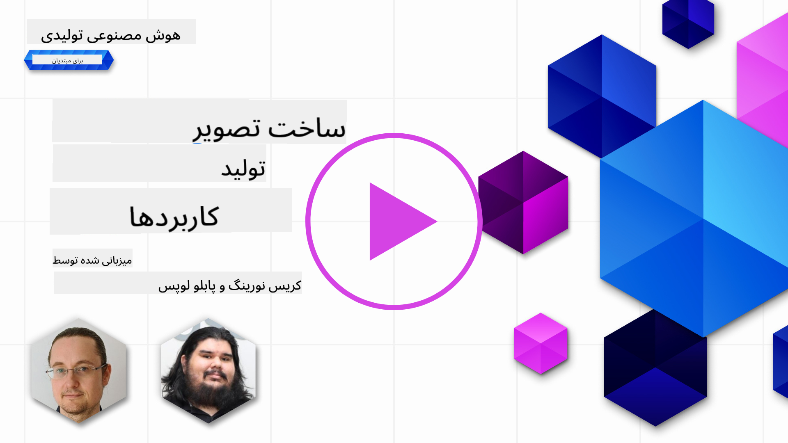

<!--
CO_OP_TRANSLATOR_METADATA:
{
  "original_hash": "1a7fd0f95f9eb673b79da47c0814f4d4",
  "translation_date": "2025-07-09T13:16:35+00:00",
  "source_file": "09-building-image-applications/README.md",
  "language_code": "fa"
}
-->
# ساخت برنامه‌های تولید تصویر

[](https://aka.ms/gen-ai-lesson9-gh?WT.mc_id=academic-105485-koreyst)

مدل‌های زبان بزرگ (LLM) فقط برای تولید متن نیستند. همچنین می‌توان تصاویر را از توصیفات متنی تولید کرد. داشتن تصاویر به عنوان یک مدالیتی می‌تواند در زمینه‌های مختلفی مانند فناوری پزشکی، معماری، گردشگری، توسعه بازی و غیره بسیار مفید باشد. در این فصل، به دو مدل محبوب تولید تصویر، DALL-E و Midjourney، می‌پردازیم.

## مقدمه

در این درس، موارد زیر را بررسی خواهیم کرد:

- تولید تصویر و دلیل مفید بودن آن.
- DALL-E و Midjourney، چی هستند و چگونه کار می‌کنند.
- چگونه یک برنامه تولید تصویر بسازید.

## اهداف یادگیری

پس از اتمام این درس، قادر خواهید بود:

- یک برنامه تولید تصویر بسازید.
- با استفاده از متاپرامپت‌ها، محدوده‌های برنامه خود را تعریف کنید.
- با DALL-E و Midjourney کار کنید.

## چرا برنامه تولید تصویر بسازیم؟

برنامه‌های تولید تصویر راهی عالی برای کشف قابلیت‌های هوش مصنوعی مولد هستند. به عنوان مثال، می‌توان از آن‌ها برای موارد زیر استفاده کرد:

- **ویرایش و ترکیب تصویر**. می‌توانید تصاویر را برای کاربردهای مختلفی مانند ویرایش و ترکیب تصویر تولید کنید.

- **کاربرد در صنایع مختلف**. همچنین می‌توان از آن‌ها برای تولید تصاویر در صنایع مختلفی مانند فناوری پزشکی، گردشگری، توسعه بازی و غیره استفاده کرد.

## سناریو: Edu4All

در این درس، همچنان با استارتاپ خودمان، Edu4All، کار خواهیم کرد. دانش‌آموزان برای ارزیابی‌های خود تصاویر ایجاد می‌کنند، اینکه چه تصاویری باشد به خود دانش‌آموزان بستگی دارد، اما می‌تواند شامل تصویرسازی برای داستان‌های خودشان، خلق شخصیت جدید برای داستان یا کمک به تجسم ایده‌ها و مفاهیمشان باشد.

مثلاً اگر دانش‌آموزان Edu4All روی بناهای تاریخی در کلاس کار کنند، می‌توانند چنین تصاویری تولید کنند:


با استفاده از پرامپتی مانند

> "سگی کنار برج ایفل در نور صبحگاهی"

## DALL-E و Midjourney چیستند؟

[DALL-E](https://openai.com/dall-e-2?WT.mc_id=academic-105485-koreyst) و [Midjourney](https://www.midjourney.com/?WT.mc_id=academic-105485-koreyst) دو مدل محبوب تولید تصویر هستند که به شما اجازه می‌دهند با استفاده از پرامپت‌ها تصاویر تولید کنید.

### DALL-E

بیایید با DALL-E شروع کنیم، که یک مدل هوش مصنوعی مولد است و تصاویر را از توصیفات متنی تولید می‌کند.

> [DALL-E ترکیبی از دو مدل، CLIP و diffused attention است](https://towardsdatascience.com/openais-dall-e-and-clip-101-a-brief-introduction-3a4367280d4e?WT.mc_id=academic-105485-koreyst).

- **CLIP**، مدلی است که از تصاویر و متن، تعبیه‌هایی (نمایش‌های عددی داده) تولید می‌کند.

- **Diffused attention**، مدلی است که از تعبیه‌ها تصاویر تولید می‌کند. DALL-E روی مجموعه‌ای از تصاویر و متن آموزش دیده و می‌تواند تصاویر را از توصیفات متنی تولید کند. برای مثال، DALL-E می‌تواند تصاویر گربه‌ای با کلاه یا سگی با موهای موهاک تولید کند.

### Midjourney

Midjourney به روشی مشابه DALL-E کار می‌کند و تصاویر را از پرامپت‌های متنی تولید می‌کند. Midjourney نیز می‌تواند با پرامپت‌هایی مانند «گربه‌ای با کلاه» یا «سگی با موهای موهاک» تصاویر تولید کند.


_اعتبار تصویر ویکی‌پدیا، تصویر تولید شده توسط Midjourney_

## DALL-E و Midjourney چگونه کار می‌کنند

ابتدا، [DALL-E](https://arxiv.org/pdf/2102.12092.pdf?WT.mc_id=academic-105485-koreyst). DALL-E یک مدل هوش مصنوعی مولد مبتنی بر معماری ترنسفورمر با _ترنسفورمر خودرگرسیو_ است.

یک _ترنسفورمر خودرگرسیو_ مشخص می‌کند که مدل چگونه تصاویر را از توصیفات متنی تولید می‌کند، به این صورت که پیکسل به پیکسل تولید می‌کند و سپس از پیکسل‌های تولید شده برای تولید پیکسل بعدی استفاده می‌کند. این فرآیند از چندین لایه در شبکه عصبی عبور می‌کند تا تصویر کامل شود.

با این روش، DALL-E کنترل ویژگی‌ها، اشیاء، خصوصیات و موارد دیگر در تصویری که تولید می‌کند را دارد. البته DALL-E 2 و 3 کنترل بیشتری روی تصویر تولید شده دارند.

## ساخت اولین برنامه تولید تصویر شما

پس برای ساخت یک برنامه تولید تصویر چه چیزهایی لازم است؟ به کتابخانه‌های زیر نیاز دارید:

- **python-dotenv**، به شدت توصیه می‌شود از این کتابخانه برای نگهداری اطلاعات محرمانه در فایل _.env_ جدا از کد استفاده کنید.
- **openai**، این کتابخانه برای تعامل با API اوپن‌ای‌آی استفاده می‌شود.
- **pillow**، برای کار با تصاویر در پایتون.
- **requests**، برای ارسال درخواست‌های HTTP.

1. یک فایل _.env_ با محتوای زیر بسازید:

   ```text
   AZURE_OPENAI_ENDPOINT=<your endpoint>
   AZURE_OPENAI_API_KEY=<your key>
   ```

   این اطلاعات را در پورتال Azure برای منبع خود در بخش "Keys and Endpoint" پیدا کنید.

1. کتابخانه‌های بالا را در فایلی به نام _requirements.txt_ جمع‌آوری کنید:

   ```text
   python-dotenv
   openai
   pillow
   requests
   ```

1. سپس محیط مجازی بسازید و کتابخانه‌ها را نصب کنید:

   ```bash
   python3 -m venv venv
   source venv/bin/activate
   pip install -r requirements.txt
   ```

   برای ویندوز، از دستورات زیر برای ساخت و فعال‌سازی محیط مجازی استفاده کنید:

   ```bash
   python3 -m venv venv
   venv\Scripts\activate.bat
   ```

1. کد زیر را در فایلی به نام _app.py_ اضافه کنید:

   ```python
   import openai
   import os
   import requests
   from PIL import Image
   import dotenv

   # import dotenv
   dotenv.load_dotenv()

   # Get endpoint and key from environment variables
   openai.api_base = os.environ['AZURE_OPENAI_ENDPOINT']
   openai.api_key = os.environ['AZURE_OPENAI_API_KEY']

   # Assign the API version (DALL-E is currently supported for the 2023-06-01-preview API version only)
   openai.api_version = '2023-06-01-preview'
   openai.api_type = 'azure'


   try:
       # Create an image by using the image generation API
       generation_response = openai.Image.create(
           prompt='Bunny on horse, holding a lollipop, on a foggy meadow where it grows daffodils',    # Enter your prompt text here
           size='1024x1024',
           n=2,
           temperature=0,
       )
       # Set the directory for the stored image
       image_dir = os.path.join(os.curdir, 'images')

       # If the directory doesn't exist, create it
       if not os.path.isdir(image_dir):
           os.mkdir(image_dir)

       # Initialize the image path (note the filetype should be png)
       image_path = os.path.join(image_dir, 'generated-image.png')

       # Retrieve the generated image
       image_url = generation_response["data"][0]["url"]  # extract image URL from response
       generated_image = requests.get(image_url).content  # download the image
       with open(image_path, "wb") as image_file:
           image_file.write(generated_image)

       # Display the image in the default image viewer
       image = Image.open(image_path)
       image.show()

   # catch exceptions
   except openai.InvalidRequestError as err:
       print(err)

   ```

بیایید این کد را توضیح دهیم:

- ابتدا کتابخانه‌های مورد نیاز را وارد می‌کنیم، از جمله کتابخانه OpenAI، dotenv، requests و Pillow.

  ```python
  import openai
  import os
  import requests
  from PIL import Image
  import dotenv
  ```

- سپس متغیرهای محیطی را از فایل _.env_ بارگذاری می‌کنیم.

  ```python
  # import dotenv
  dotenv.load_dotenv()
  ```

- بعد، نقطه پایان، کلید API اوپن‌ای‌آی، نسخه و نوع را تنظیم می‌کنیم.

  ```python
  # Get endpoint and key from environment variables
  openai.api_base = os.environ['AZURE_OPENAI_ENDPOINT']
  openai.api_key = os.environ['AZURE_OPENAI_API_KEY']

  # add version and type, Azure specific
  openai.api_version = '2023-06-01-preview'
  openai.api_type = 'azure'
  ```

- سپس تصویر را تولید می‌کنیم:

  ```python
  # Create an image by using the image generation API
  generation_response = openai.Image.create(
      prompt='Bunny on horse, holding a lollipop, on a foggy meadow where it grows daffodils',    # Enter your prompt text here
      size='1024x1024',
      n=2,
      temperature=0,
  )
  ```

  کد بالا با یک شیء JSON پاسخ می‌دهد که شامل URL تصویر تولید شده است. می‌توانیم از این URL برای دانلود تصویر و ذخیره آن در فایل استفاده کنیم.

- در نهایت، تصویر را باز کرده و با نمایشگر تصویر استاندارد نمایش می‌دهیم:

  ```python
  image = Image.open(image_path)
  image.show()
  ```

### جزئیات بیشتر درباره تولید تصویر

بیایید کدی که تصویر را تولید می‌کند با جزئیات بیشتری بررسی کنیم:

```python
generation_response = openai.Image.create(
        prompt='Bunny on horse, holding a lollipop, on a foggy meadow where it grows daffodils',    # Enter your prompt text here
        size='1024x1024',
        n=2,
        temperature=0,
    )
```

- **prompt**، پرامپت متنی است که برای تولید تصویر استفاده می‌شود. در اینجا، از پرامپت "خرگوش روی اسب، در حال نگه داشتن آبنبات چوبی، در چمنزاری مه‌آلود که نرگس می‌روید" استفاده می‌کنیم.
- **size**، اندازه تصویر تولید شده است. در اینجا، تصویری با ابعاد ۱۰۲۴ در ۱۰۲۴ پیکسل تولید می‌کنیم.
- **n**، تعداد تصاویر تولید شده است. در اینجا، دو تصویر تولید می‌کنیم.
- **temperature**، پارامتری است که میزان تصادفی بودن خروجی مدل هوش مصنوعی مولد را کنترل می‌کند. دما مقداری بین ۰ و ۱ است که ۰ به معنای خروجی قطعی و ۱ به معنای خروجی کاملاً تصادفی است. مقدار پیش‌فرض ۰.۷ است.

موارد بیشتری وجود دارد که می‌توانید با تصاویر انجام دهید و در بخش بعدی به آن‌ها می‌پردازیم.

## قابلیت‌های اضافی تولید تصویر

تا اینجا دیدید که چگونه با چند خط کد پایتون توانستیم تصویر تولید کنیم. اما کارهای بیشتری می‌توان با تصاویر انجام داد.

شما همچنین می‌توانید:

- **ویرایش انجام دهید**. با ارائه یک تصویر موجود، یک ماسک و یک پرامپت، می‌توانید تصویر را تغییر دهید. برای مثال، می‌توانید به بخشی از تصویر چیزی اضافه کنید. فرض کنید تصویر خرگوش ما، می‌توانید کلاهی به خرگوش اضافه کنید. این کار با ارائه تصویر، ماسک (که بخش مورد نظر برای تغییر را مشخص می‌کند) و پرامپت متنی که می‌گوید چه کاری باید انجام شود، انجام می‌شود.

  ```python
  response = openai.Image.create_edit(
    image=open("base_image.png", "rb"),
    mask=open("mask.png", "rb"),
    prompt="An image of a rabbit with a hat on its head.",
    n=1,
    size="1024x1024"
  )
  image_url = response['data'][0]['url']
  ```

  تصویر پایه فقط شامل خرگوش است اما تصویر نهایی کلاه را روی خرگوش دارد.

- **ایجاد واریاسیون**. ایده این است که تصویری موجود را گرفته و درخواست ایجاد واریاسیون کنید. برای ایجاد واریاسیون، تصویری و پرامپت متنی ارائه می‌دهید و کدی مانند زیر دارید:

  ```python
  response = openai.Image.create_variation(
    image=open("bunny-lollipop.png", "rb"),
    n=1,
    size="1024x1024"
  )
  image_url = response['data'][0]['url']
  ```

  > توجه، این قابلیت فقط در OpenAI پشتیبانی می‌شود

## دما (Temperature)

دما پارامتری است که میزان تصادفی بودن خروجی مدل هوش مصنوعی مولد را کنترل می‌کند. دما مقداری بین ۰ و ۱ است که ۰ به معنای خروجی قطعی و ۱ به معنای خروجی تصادفی است. مقدار پیش‌فرض ۰.۷ است.

بیایید با اجرای این پرامپت دو بار، ببینیم دما چگونه کار می‌کند:

> پرامپت: "خرگوش روی اسب، در حال نگه داشتن آبنبات چوبی، در چمنزاری مه‌آلود که نرگس می‌روید"


حالا همان پرامپت را دوباره اجرا می‌کنیم تا ببینیم تصویر یکسانی تولید نمی‌شود:


همانطور که می‌بینید، تصاویر مشابه هستند اما یکسان نیستند. حالا بیایید مقدار دما را به ۰.۱ تغییر دهیم و ببینیم چه اتفاقی می‌افتد:

```python
 generation_response = openai.Image.create(
        prompt='Bunny on horse, holding a lollipop, on a foggy meadow where it grows daffodils',    # Enter your prompt text here
        size='1024x1024',
        n=2
    )
```

### تغییر دما

بیایید پاسخ را قطعی‌تر کنیم. از دو تصویر تولید شده مشاهده کردیم که در تصویر اول خرگوش است و در تصویر دوم اسب، پس تصاویر تفاوت زیادی دارند.

پس کد خود را تغییر می‌دهیم و دما را روی ۰ قرار می‌دهیم، به این صورت:

```python
generation_response = openai.Image.create(
        prompt='Bunny on horse, holding a lollipop, on a foggy meadow where it grows daffodils',    # Enter your prompt text here
        size='1024x1024',
        n=2,
        temperature=0
    )
```

حالا وقتی این کد را اجرا کنید، این دو تصویر را دریافت می‌کنید:

- 
- 

اینجا واضح است که تصاویر بیشتر به هم شبیه شده‌اند.

## چگونه با متاپرامپت‌ها محدوده‌های برنامه خود را تعریف کنیم

با دمو ما، می‌توانیم برای مشتریان خود تصاویر تولید کنیم. اما باید برای برنامه خود محدوده‌هایی تعریف کنیم.

مثلاً نمی‌خواهیم تصاویر نامناسب برای محیط کار یا کودکان تولید کنیم.

این کار را با _متاپرامپت‌ها_ انجام می‌دهیم. متاپرامپت‌ها پرامپت‌های متنی هستند که برای کنترل خروجی مدل هوش مصنوعی مولد استفاده می‌شوند. مثلاً می‌توانیم با متاپرامپت‌ها خروجی را کنترل کنیم و مطمئن شویم تصاویر تولید شده برای محیط کار ایمن و برای کودکان مناسب هستند.

### چگونه کار می‌کند؟

حالا، متاپرامپت‌ها چگونه کار می‌کنند؟

متاپرامپت‌ها پرامپت‌های متنی هستند که برای کنترل خروجی مدل هوش مصنوعی مولد استفاده می‌شوند، آن‌ها قبل از پرامپت متنی قرار می‌گیرند و برای کنترل خروجی مدل به کار می‌روند و در برنامه‌ها جاسازی می‌شوند تا خروجی مدل را کنترل کنند. به این صورت که ورودی پرامپت و ورودی متاپرامپت در یک پرامپت متنی واحد قرار می‌گیرند.

یک مثال از متاپرامپت به صورت زیر است:

```text
You are an assistant designer that creates images for children.

The image needs to be safe for work and appropriate for children.

The image needs to be in color.

The image needs to be in landscape orientation.

The image needs to be in a 16:9 aspect ratio.

Do not consider any input from the following that is not safe for work or appropriate for children.

(Input)

```

حالا ببینیم چگونه می‌توانیم در دمو خود از متاپرامپت‌ها استفاده کنیم.

```python
disallow_list = "swords, violence, blood, gore, nudity, sexual content, adult content, adult themes, adult language, adult humor, adult jokes, adult situations, adult"

meta_prompt =f"""You are an assistant designer that creates images for children.

The image needs to be safe for work and appropriate for children.

The image needs to be in color.

The image needs to be in landscape orientation.

The image needs to be in a 16:9 aspect ratio.

Do not consider any input from the following that is not safe for work or appropriate for children.
{disallow_list}
"""

prompt = f"{meta_prompt}
Create an image of a bunny on a horse, holding a lollipop"

# TODO add request to generate image
```

از پرامپت بالا می‌بینید که همه تصاویر تولید شده، متاپرامپت را در نظر می‌گیرند.

## تمرین - اجازه دهید دانش‌آموزان فعال شوند

در ابتدای این درس Edu4All را معرفی کردیم. حالا وقت آن است که به دانش‌آموزان اجازه دهیم برای ارزیابی‌های خود تصاویر تولید کنند.

دانش‌آموزان تصاویر مربوط به بناهای تاریخی برای ارزیابی‌های خود ایجاد می‌کنند، اینکه چه بناهایی باشد به خود دانش‌آموزان بستگی دارد. از دانش‌آموزان خواسته شده است که در این کار خلاقیت به خرج دهند و این بناها را در زمینه‌های مختلف قرار دهند.

## راه‌حل

در اینجا یک راه‌حل ممکن است:

```python
import openai
import os
import requests
from PIL import Image
import dotenv

# import dotenv
dotenv.load_dotenv()

# Get endpoint and key from environment variables
openai.api_base = "<replace with endpoint>"
openai.api_key = "<replace with api key>"

# Assign the API version (DALL-E is currently supported for the 2023-06-01-preview API version only)
openai.api_version = '2023-06-01-preview'
openai.api_type = 'azure'

disallow_list = "swords, violence, blood, gore, nudity, sexual content, adult content, adult themes, adult language, adult humor, adult jokes, adult situations, adult"

meta_prompt = f"""You are an assistant designer that creates images for children.

The image needs to be safe for work and appropriate for children.

The image needs to be in color.

The image needs to be in landscape orientation.

The image needs to be in a 16:9 aspect ratio.

Do not consider any input from the following that is not safe for work or appropriate for children.
{disallow_list}"""

prompt = f"""{meta_prompt}
Generate monument of the Arc of Triumph in Paris, France, in the evening light with a small child holding a Teddy looks on.
""""

try:
    # Create an image by using the image generation API
    generation_response = openai.Image.create(
        prompt=prompt,    # Enter your prompt text here
        size='1024x1024',
        n=2,
        temperature=0,
    )
    # Set the directory for the stored image
    image_dir = os.path.join(os.curdir, 'images')

    # If the directory doesn't exist, create it
    if not os.path.isdir(image_dir):
        os.mkdir(image_dir)

    # Initialize the image path (note the filetype should be png)
    image_path = os.path.join(image_dir, 'generated-image.png')

    # Retrieve the generated image
    image_url = generation_response["data"][0]["url"]  # extract image URL from response
    generated_image = requests.get(image_url).content  # download the image
    with open(image_path, "wb") as image_file:
        image_file.write(generated_image)

    # Display the image in the default image viewer
    image = Image.open(image_path)
    image.show()

# catch exceptions
except openai.InvalidRequestError as err:
    print(err)
```

## کار عالی! یادگیری خود را ادامه دهید

پس از اتمام این درس، مجموعه [یادگیری هوش مصنوعی مولد](https://aka.ms/genai-collection?WT.mc_id=academic-105485-koreyst) ما را بررسی کنید تا دانش خود در زمینه هوش مصنوعی مولد را ارتقا دهید!

به درس ۱۰ بروید که در آن به نحوه [ساخت برنامه‌های هوش مصنوعی با کد کم](../10-building-low-code-ai-applications/README.md?WT.mc_id=academic-105485-koreyst) می‌پردازیم.

**سلب مسئولیت**:  
این سند با استفاده از سرویس ترجمه هوش مصنوعی [Co-op Translator](https://github.com/Azure/co-op-translator) ترجمه شده است. در حالی که ما در تلاش برای دقت هستیم، لطفاً توجه داشته باشید که ترجمه‌های خودکار ممکن است حاوی خطاها یا نواقصی باشند. سند اصلی به زبان بومی خود باید به عنوان منبع معتبر در نظر گرفته شود. برای اطلاعات حیاتی، ترجمه حرفه‌ای انسانی توصیه می‌شود. ما مسئول هیچ گونه سوءتفاهم یا تفسیر نادرستی که از استفاده این ترجمه ناشی شود، نیستیم.