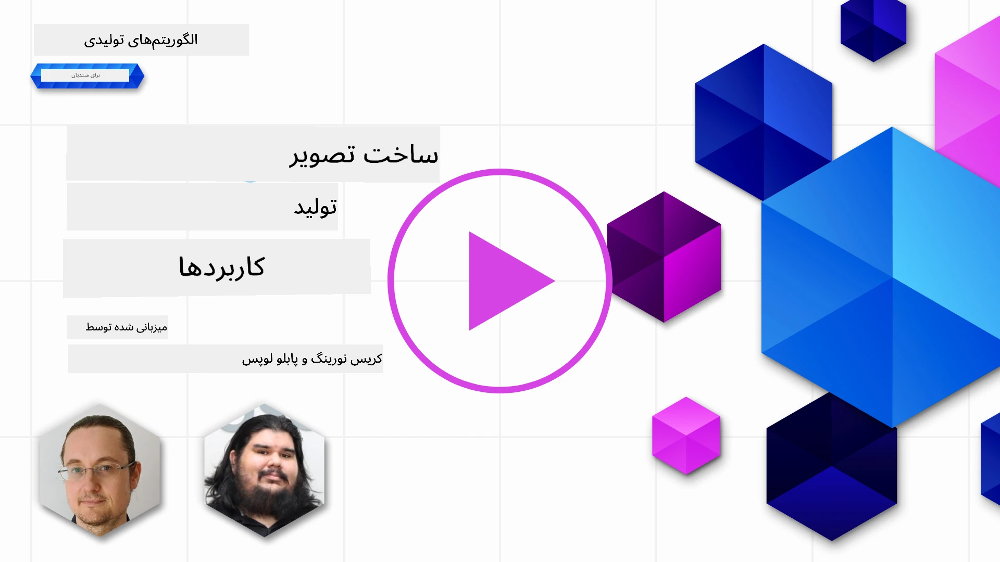

# ساخت برنامه‌های تولید تصویر  

[](https://aka.ms/gen-ai-lesson9-gh?WT.mc_id=academic-105485-koreyst)  

مدل‌های زبانی بزرگ بیش از تولید متن هستند. شما همچنین می‌توانید از توصیفات متنی تصویر بسازید. تصاویر به عنوان یک حالت ارتباطی در حوزه‌های پزشکی فناوری، معماری، گردشگری، توسعه بازی، بازاریابی و غیره کاربرد دارند. در این درس به مدل‌های امروز **GPT Image** نگاه می‌کنیم و یک برنامه تولید تصویر می‌سازیم.  

## مقدمه  

تولید تصویر به شما امکان می‌دهد که یک پرس‌وجوی زبان طبیعی را به تصویر تبدیل کنید. در این درس با خانواده مدل‌های **`gpt-image`** از OpenAI کار می‌کنیم - نسل فعلی مدل‌های تصویری موجود در **[Microsoft Foundry](https://ai.azure.com?WT.mc_id=academic-105485-koreyst)** و پلتفرم OpenAI. این مدل‌ها جایگزین مدل‌های قدیمی‌تر DALL·E شده‌اند (DALL·E 2/3 مدل‌های قدیمی هستند).  

در طول درس از یک استارتاپ فرضی به نام **Edu4All** استفاده می‌کنیم که ابزارهای آموزشی می‌سازد. تیم می‌خواهد برای تکالیف و مواد مطالعه تصاویر رنگی تولید کند.  

## اهداف یادگیری  

در پایان این درس قادر خواهید بود:  

- توضیح دهید تولید تصویر چیست و کجا کاربرد دارد.  
- با خانواده مدل `gpt-image` آشنا شوید و تفاوت آن را با مدل‌های قدیمی DALL·E درک کنید.  
- یک برنامه تولید تصویر به زبان پایتون (و تایپ‌اسکریپت/.NET) بسازید.  
- تصاویر را ویرایش و با متاپرومپت‌ها مکانیسم‌های ایمنی را اعمال کنید.  

## تولید تصویر چیست؟  

مدل‌های تولید تصویر، تصویر را از یک توضیح متنی ایجاد می‌کنند. مدل‌های مدرن مثل `gpt-image` مبتنی بر تکنیک‌های ترنسفورمر + دیفیوژن هستند: مدل در طول آموزش رابطه بین متن و تصویر را می‌آموزد، سپس با دریافت یک پرس‌وجو، به صورت تدریجی نویز تصادفی را "برطرف" می‌کند تا تصویری مطابق توضیح بسازد.  

دو خانواده شناخته‌شده مدل‌های تصویری عبارتند از:  

- **`gpt-image` (OpenAI)** - نسل فعلی، استفاده‌شده در این درس. از تولید تصویر از متن و ویرایش تصویر (inpainting با ماسک) پشتیبانی می‌کند.  
- **Midjourney** - یک مدل محبوب شخص ثالث با سرویس اختصاصی و گردش‌کار بر پایه Discord.  

> مدل‌های تصویری قدیمی‌تر OpenAI - **DALL·E 2** و **DALL·E 3** - مدل‌های منسوخ هستند. DALL·E 3 دیگر برای استقرارهای جدید در دسترس نیست و ویژگی‌هایی مثل `create_variation` فقط در DALL·E 2 وجود داشتند. برای برنامه‌های جدید از مدل‌های `gpt-image` استفاده کنید.  

### کدام مدل `gpt-image` را باید استفاده کنم؟  

در Microsoft Foundry مدل‌های زیر **عموماً در دسترس** هستند:  

| مدل | توضیحات |  
| --- | --- |  
| **`gpt-image-2`** | جدیدترین و قدرتمندترین مدل تصویر - پیش‌فرض توصیه‌شده. |  
| `gpt-image-1.5` | عموماً در دسترس؛ کیفیت مناسب با هزینه کمتر. |  
| `gpt-image-1-mini` | عموماً در دسترس؛ سریع‌ترین / کم‌هزینه‌ترین. |  
| `gpt-image-1` | فقط پیش‌نمایش. |  

همیشه فهرست [مدل‌های تصویری Foundry](https://learn.microsoft.com/azure/ai-foundry/openai/concepts/models?WT.mc_id=academic-105485-koreyst) را برای دسترسی و مناطق بررسی کنید.  

> **مهم:** مدل‌های `gpt-image` تصویر تولیدشده را به صورت **base64** (`b64_json`) بازمی‌گردانند، نه URL. کد شما رشته base64 را رمزگشایی می‌کند به بایت‌ها و ذخیره می‌کند - هیچ URL تصویری برای دانلود وجود ندارد.  

## راه‌اندازی  

شما می‌توانید نمونه‌ها را روی **Azure OpenAI در Microsoft Foundry** (نمونه‌های `aoai-*`) یا پلتفرم **OpenAI** (نمونه‌های `oai-*`) اجرا کنید.  

### ۱. ایجاد و استقرار مدل  

راهنمای [ایجاد منبع](https://learn.microsoft.com/azure/ai-foundry/openai/how-to/create-resource?pivots=web-portal&WT.mc_id=academic-105485-koreyst) را دنبال کنید تا منبعی در Microsoft Foundry بسازید، سپس یک مدل تصویر مستقر کنید - **`gpt-image-2`** توصیه شده است.  

### ۲. پیکربندی `.env` خود  

```text
AZURE_OPENAI_ENDPOINT=<your endpoint>
AZURE_OPENAI_API_KEY=<your key>
AZURE_OPENAI_DEPLOYMENT="gpt-image-2"
```
  
این مقادیر را در صفحه **Deployments** منبع خود در [Foundry portal](https://ai.azure.com?WT.mc_id=academic-105485-koreyst) پیدا کنید.  

### ۳. نصب کتابخانه‌ها  

یک فایل `requirements.txt` ایجاد کنید:  

```text
python-dotenv
openai
pillow
```
  
سپس محیط مجازی بسازید و فعال کنید و نصب کنید:  

```bash
python3 -m venv venv
source venv/bin/activate        # ویندوز: venv\Scripts\activate
pip install -r requirements.txt
```
  
## ساخت برنامه  

فایل `app.py` را با کد زیر بسازید. این برنامه یک تصویر تولید و به صورت PNG ذخیره می‌کند.  

```python
import os
import base64
from openai import AzureOpenAI
from PIL import Image
import dotenv

dotenv.load_dotenv()

# کلاینت را به منبع Azure OpenAI (Microsoft Foundry) خود اشاره دهید.
# مدل‌های تصویری به نسخه جدید API نیاز دارند - مستندات Foundry را برای نسخه مورد نیاز مدل خود بررسی کنید.
client = AzureOpenAI(
    api_key=os.environ["AZURE_OPENAI_API_KEY"],
    api_version="2025-04-01-preview",
    azure_endpoint=os.environ["AZURE_OPENAI_ENDPOINT"],
)

deployment = os.environ["AZURE_OPENAI_DEPLOYMENT"]  # مثلاً "gpt-image-2"

result = client.images.generate(
    model=deployment,
    prompt='Bunny on a horse, holding a lollipop, on a foggy meadow where it grows daffodils',
    size="1024x1024",   # همچنین ۱۵۳۶×۱۰۲۴ (افقی)، ۱۰۲۴×۱۵۳۶ (عمودی)، یا "auto"
    n=1,
)

# مدل‌های gpt-image خروجی base64 (b64_json) می‌دهند، نه URL - آن را به بایت تبدیل کنید.
image_bytes = base64.b64decode(result.data[0].b64_json)

os.makedirs("images", exist_ok=True)
image_path = os.path.join("images", "generated-image.png")
with open(image_path, "wb") as f:
    f.write(image_bytes)

Image.open(image_path).show()
```
  
با اجرای `python app.py` برنامه اجرا می‌شود. یک فایل PNG تحت `images/` ذخیره می‌شود.  

> هر بار که `images.generate` را فراخوانی کنید تصویر متفاوتی برای همان پرس‌وجو تولید می‌شود - مدل‌های تصویری پارامتر `temperature` ندارند (این کنترل تولید متن است). برای تنوع بیشتر، دوباره API را صدا بزنید؛ برای کاهش تنوع، پرس‌وجوی خود را دقیق‌تر کنید.  

## ویرایش تصاویر  

مدل‌های `gpt-image` می‌توانند یک تصویر موجود را **ویرایش** کنند: تصویر، یک **ماسک** اختیاری (که ناحیه تغییر را مشخص می‌کند) و یک پرس‌وجوی توصیفی تغییر را بدهید. مثل تولید تصویر، ویرایش‌ها نیز به حالت base64 بازگردانده می‌شوند.  

```python
result = client.images.edit(
    model=deployment,
    image=open("sunlit_lounge.png", "rb"),
    mask=open("mask.png", "rb"),
    prompt="A sunlit indoor lounge area with a pool containing a flamingo",
)
image_bytes = base64.b64decode(result.data[0].b64_json)
with open("images/edited-image.png", "wb") as f:
    f.write(image_bytes)
```
  
<div style="display: flex; justify-content: space-between; align-items: center; margin: 20px 0;">  
    
    
    
</div>  

## تعیین محدودیت‌ها با متاپرومپت‌ها  

وقتی توانستید تصویر تولید کنید، نیاز دارید که محدودیت‌هایی قرار دهید تا برنامه شما محتوای ناایمن یا نامناسب تولید نکند. یک **متاپرومپت** متنی است که به ابتدای پرس‌وجوی کاربر اضافه می‌شود تا خروجی مدل محدود شود.  

```python
disallow_list = "swords, violence, blood, gore, nudity, sexual content, adult content, adult themes, adult language"

meta_prompt = f"""You are an assistant designer that creates images for children.

The image needs to be safe for work and appropriate for children.
The image needs to be in color, in landscape orientation, and in a 16:9 aspect ratio.

Do not consider any input that is not safe for work or appropriate for children, including:
{disallow_list}
"""

prompt = f"{meta_prompt}\nCreate an image of a bunny on a horse, holding a lollipop"
# `prompt` را به client.images.generate(...) بدهید
```
  
حالا هر تصویر در چارچوب محدودیت‌های تعیین‌شده توسط متاپرومپت تولید می‌شود. این را با فیلترهای محتوای داخلی Microsoft Foundry ترکیب کنید تا یک دفاع چندلایه ایجاد کنید.  

## تمرین - فعال‌سازی دانش‌آموزان  

دانش‌آموزان Edu4All برای ارزیابی‌های خود به تصویر نیاز دارند. برنامه‌ای بسازید که تصاویر **بنای تاریخی** (انتخاب بنا بر عهده شماست) را در زمینه‌های مختلف و خلاقانه تولید کند - برای مثال یک نشانه معروف هنگام غروب با کودکی که به آن نگاه می‌کند.  

خودتان امتحان کنید و سپس با راه‌حل‌های مرجع مقایسه کنید:  

- پایتون (Azure): [aoai-solution.py](../../../09-building-image-applications/python/aoai-solution.py)  
- برنامه کامل تولید پایتون (Azure): [aoai-app.py](../../../09-building-image-applications/python/aoai-app.py)  
- پایتون (OpenAI): [oai-app.py](../../../09-building-image-applications/python/oai-app.py)  
- تایپ‌اسکریپت (Azure): [typescript/image-generation-app](../../../09-building-image-applications/typescript/image-generation-app)  
- .NET (Azure): [dotnet/notebook-azure-openai.dib](../../../09-building-image-applications/dotnet/notebook-azure-openai.dib)  

همچنین دفترچه‌های یادداشت در [python/](../../../09-building-image-applications/python) را انجام دهید (`aoai-assignment.ipynb` برای Azure، `oai-assignment.ipynb` برای OpenAI).  

## کار عالی! به یادگیری ادامه دهید  

پس از اتمام این درس، مجموعه یادگیری [Generative AI Learning collection](https://aka.ms/genai-collection?WT.mc_id=academic-105485-koreyst) را بررسی کنید تا دانش خود در زمینه هوش مصنوعی مولد را ارتقا دهید!  

به درس ۱۰ بروید تا به یادگیری ادامه دهید.  

---

<!-- CO-OP TRANSLATOR DISCLAIMER START -->
**سلب مسئولیت**:
این سند با استفاده از سرویس ترجمه هوش مصنوعی [Co-op Translator](https://github.com/Azure/co-op-translator) ترجمه شده است. در حالی که ما در تلاش برای دقت هستیم، لطفاً توجه داشته باشید که ترجمه‌های خودکار ممکن است شامل خطاها یا نادرستی‌هایی باشند. سند اصلی به زبان مادری خود باید به عنوان منبع معتبر در نظر گرفته شود. برای اطلاعات حیاتی، ترجمه حرفه‌ای انسانی توصیه می‌شود. ما در قبال هرگونه سوء تفاهم یا برداشت نادرست ناشی از استفاده از این ترجمه مسئولیتی نداریم.
<!-- CO-OP TRANSLATOR DISCLAIMER END -->