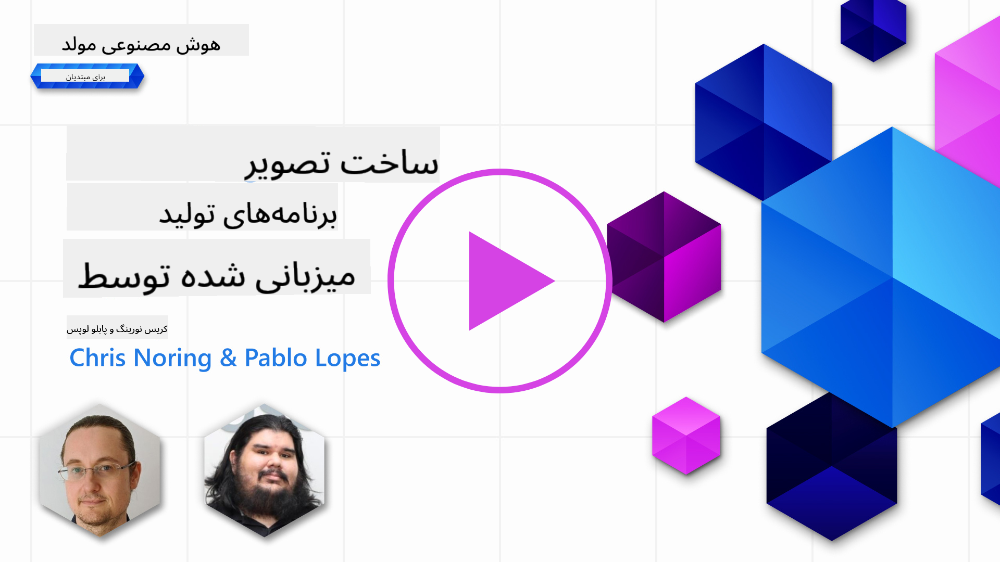

<!--
CO_OP_TRANSLATOR_METADATA:
{
  "original_hash": "063a2ac57d6b71bea0eaa880c68770d2",
  "translation_date": "2025-09-29T21:29:23+00:00",
  "source_file": "09-building-image-applications/README.md",
  "language_code": "fa"
}
-->
# ساخت برنامه‌های تولید تصویر

[](https://aka.ms/gen-ai-lesson9-gh?WT.mc_id=academic-105485-koreyst)

مدل‌های زبانی بزرگ (LLMs) فقط برای تولید متن نیستند. امکان تولید تصاویر از توضیحات متنی نیز وجود دارد. داشتن تصاویر به عنوان یک حالت می‌تواند در بسیاری از زمینه‌ها مانند فناوری پزشکی، معماری، گردشگری، توسعه بازی و موارد دیگر بسیار مفید باشد. در این فصل، به دو مدل محبوب تولید تصویر، DALL-E و Midjourney، خواهیم پرداخت.

## مقدمه

در این درس، موارد زیر را پوشش خواهیم داد:

- تولید تصویر و دلایل مفید بودن آن.
- DALL-E و Midjourney، چی هستند و چگونه کار می‌کنند.
- چگونه می‌توانید یک برنامه تولید تصویر بسازید.

## اهداف یادگیری

پس از تکمیل این درس، قادر خواهید بود:

- یک برنامه تولید تصویر بسازید.
- مرزهایی برای برنامه خود با استفاده از متاپرومت‌ها تعریف کنید.
- با DALL-E و Midjourney کار کنید.

## چرا باید یک برنامه تولید تصویر بسازید؟

برنامه‌های تولید تصویر راهی عالی برای کشف قابلیت‌های هوش مصنوعی مولد هستند. این برنامه‌ها می‌توانند برای مثال در موارد زیر استفاده شوند:

- **ویرایش و ترکیب تصویر**. می‌توانید تصاویر را برای موارد مختلفی مانند ویرایش تصویر و ترکیب تصویر تولید کنید.

- **کاربرد در صنایع مختلف**. همچنین می‌توانند برای تولید تصاویر در صنایع مختلف مانند فناوری پزشکی، گردشگری، توسعه بازی و موارد دیگر استفاده شوند.

## سناریو: Edu4All

به عنوان بخشی از این درس، ما به کار با استارتاپ خود، Edu4All، ادامه خواهیم داد. دانش‌آموزان تصاویر را برای ارزیابی‌های خود ایجاد خواهند کرد. اینکه چه تصاویری ایجاد کنند به خود دانش‌آموزان بستگی دارد، اما می‌توانند تصاویری برای داستان‌های خود، شخصیت‌های جدید برای داستان‌هایشان یا کمک به تجسم ایده‌ها و مفاهیم خود ایجاد کنند.

برای مثال، اگر دانش‌آموزان Edu4All در کلاس روی بناهای تاریخی کار می‌کنند، می‌توانند چنین چیزی تولید کنند:


با استفاده از پرومت زیر:

> "سگ کنار برج ایفل در نور صبحگاهی"

## DALL-E و Midjourney چیستند؟

[DALL-E](https://openai.com/dall-e-2?WT.mc_id=academic-105485-koreyst) و [Midjourney](https://www.midjourney.com/?WT.mc_id=academic-105485-koreyst) دو مدل محبوب تولید تصویر هستند که به شما امکان می‌دهند با استفاده از پرومت‌ها تصاویر تولید کنید.

### DALL-E

بیایید با DALL-E شروع کنیم، که یک مدل هوش مصنوعی مولد است که تصاویر را از توضیحات متنی تولید می‌کند.

> [DALL-E ترکیبی از دو مدل، CLIP و توجه پراکنده است](https://towardsdatascience.com/openais-dall-e-and-clip-101-a-brief-introduction-3a4367280d4e?WT.mc_id=academic-105485-koreyst).

- **CLIP**، مدلی است که تعبیه‌ها (نمایش‌های عددی داده‌ها) را از تصاویر و متن تولید می‌کند.

- **توجه پراکنده**، مدلی است که تصاویر را از تعبیه‌ها تولید می‌کند. DALL-E بر روی مجموعه داده‌ای از تصاویر و متن آموزش داده شده است و می‌توان از آن برای تولید تصاویر از توضیحات متنی استفاده کرد. برای مثال، DALL-E می‌تواند تصاویر یک گربه با کلاه یا یک سگ با موهاوک تولید کند.

### Midjourney

Midjourney به شیوه‌ای مشابه DALL-E کار می‌کند و تصاویر را از پرومت‌های متنی تولید می‌کند. Midjourney نیز می‌تواند با استفاده از پرومت‌هایی مانند "گربه با کلاه" یا "سگ با موهاوک" تصاویر تولید کند.


_اعتبار تصویر: ویکی‌پدیا، تصویر تولید شده توسط Midjourney_

## DALL-E و Midjourney چگونه کار می‌کنند؟

ابتدا، [DALL-E](https://arxiv.org/pdf/2102.12092.pdf?WT.mc_id=academic-105485-koreyst). DALL-E یک مدل هوش مصنوعی مولد بر اساس معماری ترانسفورمر با یک _ترانسفورمر خودبازگشتی_ است.

یک _ترانسفورمر خودبازگشتی_ تعریف می‌کند که چگونه یک مدل تصاویر را از توضیحات متنی تولید می‌کند. این مدل یک پیکسل را در یک زمان تولید می‌کند و سپس از پیکسل‌های تولید شده برای تولید پیکسل بعدی استفاده می‌کند. این فرآیند از طریق لایه‌های مختلف در یک شبکه عصبی ادامه می‌یابد تا تصویر کامل شود.

با این فرآیند، DALL-E ویژگی‌ها، اشیاء، خصوصیات و موارد دیگر را در تصویر تولید شده کنترل می‌کند. با این حال، DALL-E 2 و 3 کنترل بیشتری بر تصویر تولید شده دارند.

## ساخت اولین برنامه تولید تصویر

برای ساخت یک برنامه تولید تصویر، به کتابخانه‌های زیر نیاز دارید:

- **python-dotenv**، توصیه می‌شود از این کتابخانه برای نگهداری اطلاعات محرمانه در فایل _.env_ دور از کد استفاده کنید.
- **openai**، این کتابخانه برای تعامل با API OpenAI استفاده می‌شود.
- **pillow**، برای کار با تصاویر در پایتون.
- **requests**، برای کمک به ارسال درخواست‌های HTTP.

## ایجاد و استقرار مدل Azure OpenAI

اگر هنوز انجام نشده است، دستورالعمل‌های صفحه [Microsoft Learn](https://learn.microsoft.com/azure/ai-foundry/openai/how-to/create-resource?pivots=web-portal) را دنبال کنید
تا یک منبع و مدل Azure OpenAI ایجاد کنید. مدل DALL-E 3 را انتخاب کنید.

## ایجاد برنامه

1. یک فایل _.env_ با محتوای زیر ایجاد کنید:

   ```text
   AZURE_OPENAI_ENDPOINT=<your endpoint>
   AZURE_OPENAI_API_KEY=<your key>
   AZURE_OPENAI_DEPLOYMENT="dall-e-3"
   ```

   این اطلاعات را در پورتال Azure OpenAI Foundry برای منبع خود در بخش "Deployments" پیدا کنید.

1. کتابخانه‌های بالا را در فایلی به نام _requirements.txt_ جمع‌آوری کنید، به این صورت:

   ```text
   python-dotenv
   openai
   pillow
   requests
   ```

1. سپس، محیط مجازی ایجاد کنید و کتابخانه‌ها را نصب کنید:

   ```bash
   python3 -m venv venv
   source venv/bin/activate
   pip install -r requirements.txt
   ```

   برای ویندوز، از دستورات زیر برای ایجاد و فعال کردن محیط مجازی استفاده کنید:

   ```bash
   python3 -m venv venv
   venv\Scripts\activate.bat
   ```

1. کد زیر را در فایلی به نام _app.py_ اضافه کنید:

    ```python
    import openai
    import os
    import requests
    from PIL import Image
    import dotenv
    from openai import OpenAI, AzureOpenAI
    
    # import dotenv
    dotenv.load_dotenv()
    
    # configure Azure OpenAI service client 
    client = AzureOpenAI(
      azure_endpoint = os.environ["AZURE_OPENAI_ENDPOINT"],
      api_key=os.environ['AZURE_OPENAI_API_KEY'],
      api_version = "2024-02-01"
      )
    try:
        # Create an image by using the image generation API
        generation_response = client.images.generate(
                                prompt='Bunny on horse, holding a lollipop, on a foggy meadow where it grows daffodils',
                                size='1024x1024', n=1,
                                model=os.environ['AZURE_OPENAI_DEPLOYMENT']
                              )

        # Set the directory for the stored image
        image_dir = os.path.join(os.curdir, 'images')

        # If the directory doesn't exist, create it
        if not os.path.isdir(image_dir):
            os.mkdir(image_dir)

        # Initialize the image path (note the filetype should be png)
        image_path = os.path.join(image_dir, 'generated-image.png')

        # Retrieve the generated image
        image_url = generation_response.data[0].url  # extract image URL from response
        generated_image = requests.get(image_url).content  # download the image
        with open(image_path, "wb") as image_file:
            image_file.write(generated_image)

        # Display the image in the default image viewer
        image = Image.open(image_path)
        image.show()

    # catch exceptions
    except openai.InvalidRequestError as err:
        print(err)
   ```

بیایید این کد را توضیح دهیم:

- ابتدا، کتابخانه‌های مورد نیاز، از جمله کتابخانه OpenAI، کتابخانه dotenv، کتابخانه requests و کتابخانه Pillow را وارد می‌کنیم.

  ```python
  import openai
  import os
  import requests
  from PIL import Image
  import dotenv
  ```

- سپس، متغیرهای محیطی را از فایل _.env_ بارگذاری می‌کنیم.

  ```python
  # import dotenv
  dotenv.load_dotenv()
  ```

- بعد از آن، سرویس مشتری Azure OpenAI را پیکربندی می‌کنیم.

  ```python
  # Get endpoint and key from environment variables
  client = AzureOpenAI(
      azure_endpoint = os.environ["AZURE_OPENAI_ENDPOINT"],
      api_key=os.environ['AZURE_OPENAI_API_KEY'],
      api_version = "2024-02-01"
      )
  ```

- سپس، تصویر را تولید می‌کنیم:

  ```python
  # Create an image by using the image generation API
  generation_response = client.images.generate(
                        prompt='Bunny on horse, holding a lollipop, on a foggy meadow where it grows daffodils',
                        size='1024x1024', n=1,
                        model=os.environ['AZURE_OPENAI_DEPLOYMENT']
                      )
  ```

  کد بالا با یک شی JSON پاسخ می‌دهد که شامل URL تصویر تولید شده است. می‌توانیم از URL برای دانلود تصویر و ذخیره آن در یک فایل استفاده کنیم.

- در نهایت، تصویر را باز می‌کنیم و از نمایشگر استاندارد تصویر برای نمایش آن استفاده می‌کنیم:

  ```python
  image = Image.open(image_path)
  image.show()
  ```

### جزئیات بیشتر درباره تولید تصویر

بیایید کدی که تصویر را تولید می‌کند با جزئیات بیشتری بررسی کنیم:

   ```python
     generation_response = client.images.generate(
                               prompt='Bunny on horse, holding a lollipop, on a foggy meadow where it grows daffodils',
                               size='1024x1024', n=1,
                               model=os.environ['AZURE_OPENAI_DEPLOYMENT']
                           )
   ```

- **prompt**، پرومت متنی است که برای تولید تصویر استفاده می‌شود. در این مورد، از پرومت "خرگوش روی اسب، در حال نگه داشتن آب‌نبات چوبی، در یک چمنزار مه‌آلود که در آن نرگس‌ها رشد می‌کنند" استفاده می‌کنیم.
- **size**، اندازه تصویر تولید شده است. در این مورد، تصویری با اندازه 1024x1024 پیکسل تولید می‌کنیم.
- **n**، تعداد تصاویر تولید شده است. در این مورد، دو تصویر تولید می‌کنیم.
- **temperature**، پارامتری است که تصادفی بودن خروجی مدل هوش مصنوعی مولد را کنترل می‌کند. مقدار دما بین 0 و 1 است که 0 به معنای خروجی قطعی و 1 به معنای خروجی تصادفی است. مقدار پیش‌فرض 0.7 است.

کارهای بیشتری می‌توانید با تصاویر انجام دهید که در بخش بعدی به آن‌ها خواهیم پرداخت.

## قابلیت‌های اضافی تولید تصویر

تا اینجا دیدید که چگونه توانستیم با چند خط کد در پایتون یک تصویر تولید کنیم. با این حال، کارهای بیشتری می‌توانید با تصاویر انجام دهید.

همچنین می‌توانید موارد زیر را انجام دهید:

- **ویرایش‌ها انجام دهید**. با ارائه یک تصویر موجود، یک ماسک و یک پرومت، می‌توانید تصویر را تغییر دهید. برای مثال، می‌توانید چیزی را به بخشی از تصویر اضافه کنید. تصور کنید تصویر خرگوش ما، می‌توانید یک کلاه به خرگوش اضافه کنید. چگونه این کار را انجام می‌دهید؟ با ارائه تصویر، یک ماسک (شناسایی بخشی از منطقه برای تغییر) و یک پرومت متنی که می‌گوید چه باید انجام شود.
> توجه: این قابلیت در DALL-E 3 پشتیبانی نمی‌شود.

در اینجا یک مثال با استفاده از GPT Image آورده شده است:

   ```python
   response = client.images.edit(
       model="gpt-image-1",
       image=open("sunlit_lounge.png", "rb"),
       mask=open("mask.png", "rb"),
       prompt="A sunlit indoor lounge area with a pool containing a flamingo"
   )
   image_url = response.data[0].url
   ```

  تصویر پایه فقط شامل سالن با استخر خواهد بود، اما تصویر نهایی یک فلامینگو خواهد داشت:

<div style="display: flex; justify-content: space-between; align-items: center; margin: 20px 0;">
  
  
  
</div>

- **ایجاد تغییرات**. ایده این است که یک تصویر موجود را بگیرید و درخواست کنید که تغییراتی ایجاد شود. برای ایجاد تغییر، یک تصویر و یک پرومت متنی ارائه می‌دهید و کدی مانند زیر استفاده می‌کنید:

  ```python
  response = openai.Image.create_variation(
    image=open("bunny-lollipop.png", "rb"),
    n=1,
    size="1024x1024"
  )
  image_url = response['data'][0]['url']
  ```

  > توجه: این قابلیت فقط در OpenAI پشتیبانی می‌شود.

## دما

دما پارامتری است که تصادفی بودن خروجی مدل هوش مصنوعی مولد را کنترل می‌کند. مقدار دما بین 0 و 1 است که 0 به معنای خروجی قطعی و 1 به معنای خروجی تصادفی است. مقدار پیش‌فرض 0.7 است.

بیایید یک مثال از نحوه کار دما را بررسی کنیم، با اجرای این پرومت دو بار:

> پرومت: "خرگوش روی اسب، در حال نگه داشتن آب‌نبات چوبی، در یک چمنزار مه‌آلود که در آن نرگس‌ها رشد می‌کنند"


حالا همان پرومت را اجرا کنیم تا ببینیم که دو تصویر یکسان تولید نمی‌شود:


همان‌طور که می‌بینید، تصاویر مشابه هستند، اما یکسان نیستند. بیایید مقدار دما را به 0.1 تغییر دهیم و ببینیم چه اتفاقی می‌افتد:

```python
 generation_response = client.images.create(
        prompt='Bunny on horse, holding a lollipop, on a foggy meadow where it grows daffodils',    # Enter your prompt text here
        size='1024x1024',
        n=2
    )
```

### تغییر دما

بیایید سعی کنیم پاسخ را قطعی‌تر کنیم. از دو تصویری که تولید کردیم می‌توان مشاهده کرد که در تصویر اول یک خرگوش وجود دارد و در تصویر دوم یک اسب، بنابراین تصاویر بسیار متفاوت هستند.

بنابراین، بیایید کد خود را تغییر دهیم و دما را به 0 تنظیم کنیم، به این صورت:

```python
generation_response = client.images.create(
        prompt='Bunny on horse, holding a lollipop, on a foggy meadow where it grows daffodils',    # Enter your prompt text here
        size='1024x1024',
        n=2,
        temperature=0
    )
```

حالا وقتی این کد را اجرا می‌کنید، این دو تصویر را دریافت می‌کنید:

- 
- 

اینجا می‌توانید به وضوح ببینید که تصاویر بیشتر شبیه به هم هستند.

## چگونه مرزهایی برای برنامه خود با متاپرومت‌ها تعریف کنیم؟

با دموی ما، می‌توانیم تصاویر را برای مشتریان خود تولید کنیم. با این حال، باید برخی مرزها برای برنامه خود ایجاد کنیم.

برای مثال، نمی‌خواهیم تصاویر نامناسب برای محیط کار یا نامناسب برای کودکان تولید کنیم.

می‌توانیم این کار را با _متاپرومت‌ها_ انجام دهیم. متاپرومت‌ها پرومت‌های متنی هستند که برای کنترل خروجی مدل هوش مصنوعی مولد استفاده می‌شوند. برای مثال، می‌توانیم از متاپرومت‌ها برای کنترل خروجی استفاده کنیم و اطمینان حاصل کنیم که تصاویر تولید شده مناسب محیط کار یا مناسب کودکان هستند.

### چگونه کار می‌کند؟

حالا، متاپرومت‌ها چگونه کار می‌کنند؟

متاپرومت‌ها پرومت‌های متنی هستند که برای کنترل خروجی مدل هوش مصنوعی مولد استفاده می‌شوند. آن‌ها قبل از پرومت متنی قرار می‌گیرند و برای کنترل خروجی مدل استفاده می‌شوند و در برنامه‌ها برای کنترل خروجی مدل جاسازی می‌شوند. پرومت ورودی و ورودی متاپرومت را در یک پرومت متنی واحد قرار می‌دهند.

یک مثال از متاپرومت می‌تواند به صورت زیر باشد:

```text
You are an assistant designer that creates images for children.

The image needs to be safe for work and appropriate for children.

The image needs to be in color.

The image needs to be in landscape orientation.

The image needs to be in a 16:9 aspect ratio.

Do not consider any input from the following that is not safe for work or appropriate for children.

(Input)

```

حالا، بیایید ببینیم چگونه می‌توانیم از متاپرومت‌ها در دموی خود استفاده کنیم.

```python
disallow_list = "swords, violence, blood, gore, nudity, sexual content, adult content, adult themes, adult language, adult humor, adult jokes, adult situations, adult"

meta_prompt =f"""You are an assistant designer that creates images for children.

The image needs to be safe for work and appropriate for children.

The image needs to be in color.

The image needs to be in landscape orientation.

The image needs to be in a 16:9 aspect ratio.

Do not consider any input from the following that is not safe for work or appropriate for children.
{disallow_list}
"""

prompt = f"{meta_prompt}
Create an image of a bunny on a horse, holding a lollipop"

# TODO add request to generate image
```

از پرومت بالا می‌توانید ببینید که تمام تصاویر ایجاد شده متاپرومت را در نظر می‌گیرند.

## تکلیف - بیایید دانش‌آموزان را توانمند کنیم

ما در ابتدای این درس Edu4All را معرفی کردیم. حالا وقت آن است که دانش‌آموزان را توانمند کنیم تا تصاویر را برای ارزیابی‌های خود تولید کنند.

دانش‌آموزان تصاویر را برای ارزیابی‌های خود که شامل بناهای تاریخی است ایجاد خواهند کرد. اینکه چه بناهایی باشد به خود دانش‌آموزان بستگی دارد. از دانش‌آموزان خواسته می‌شود در این وظیفه خلاقیت خود را به کار گیرند و این بناها را در زمینه‌های مختلف قرار دهند.

## راه‌حل

در اینجا یک راه‌حل ممکن آورده شده است:
```python
import openai
import os
import requests
from PIL import Image
import dotenv
from openai import AzureOpenAI
# import dotenv
dotenv.load_dotenv()

# Get endpoint and key from environment variables
client = AzureOpenAI(
  azure_endpoint = os.environ["AZURE_OPENAI_ENDPOINT"],
  api_key=os.environ['AZURE_OPENAI_API_KEY'],
  api_version = "2024-02-01"
  )


disallow_list = "swords, violence, blood, gore, nudity, sexual content, adult content, adult themes, adult language, adult humor, adult jokes, adult situations, adult"

meta_prompt = f"""You are an assistant designer that creates images for children.

The image needs to be safe for work and appropriate for children.

The image needs to be in color.

The image needs to be in landscape orientation.

The image needs to be in a 16:9 aspect ratio.

Do not consider any input from the following that is not safe for work or appropriate for children.
{disallow_list}
"""

prompt = f"""{meta_prompt}
Generate monument of the Arc of Triumph in Paris, France, in the evening light with a small child holding a Teddy looks on.
""""

try:
    # Create an image by using the image generation API
    generation_response = client.images.generate(
        prompt=prompt,    # Enter your prompt text here
        size='1024x1024',
        n=1,
    )
    # Set the directory for the stored image
    image_dir = os.path.join(os.curdir, 'images')

    # If the directory doesn't exist, create it
    if not os.path.isdir(image_dir):
        os.mkdir(image_dir)

    # Initialize the image path (note the filetype should be png)
    image_path = os.path.join(image_dir, 'generated-image.png')

    # Retrieve the generated image
    image_url = generation_response.data[0].url  # extract image URL from response
    generated_image = requests.get(image_url).content  # download the image
    with open(image_path, "wb") as image_file:
        image_file.write(generated_image)

    # Display the image in the default image viewer
    image = Image.open(image_path)
    image.show()

# catch exceptions
except openai.BadRequestError as err:
    print(err)
```

## کار عالی! یادگیری خود را ادامه دهید

پس از اتمام این درس، مجموعه [یادگیری هوش مصنوعی مولد](https://aka.ms/genai-collection?WT.mc_id=academic-105485-koreyst) را بررسی کنید تا دانش خود در زمینه هوش مصنوعی مولد را ارتقا دهید!

به درس ۱۰ بروید، جایی که به بررسی نحوه [ساخت برنامه‌های هوش مصنوعی با کدنویسی کم](../10-building-low-code-ai-applications/README.md?WT.mc_id=academic-105485-koreyst) خواهیم پرداخت.

---

**سلب مسئولیت**:  
این سند با استفاده از سرویس ترجمه هوش مصنوعی [Co-op Translator](https://github.com/Azure/co-op-translator) ترجمه شده است. در حالی که ما تلاش می‌کنیم دقت را حفظ کنیم، لطفاً توجه داشته باشید که ترجمه‌های خودکار ممکن است شامل خطاها یا نادرستی‌ها باشند. سند اصلی به زبان اصلی آن باید به عنوان منبع معتبر در نظر گرفته شود. برای اطلاعات حساس، توصیه می‌شود از ترجمه انسانی حرفه‌ای استفاده کنید. ما مسئولیتی در قبال سوء تفاهم‌ها یا تفسیرهای نادرست ناشی از استفاده از این ترجمه نداریم.