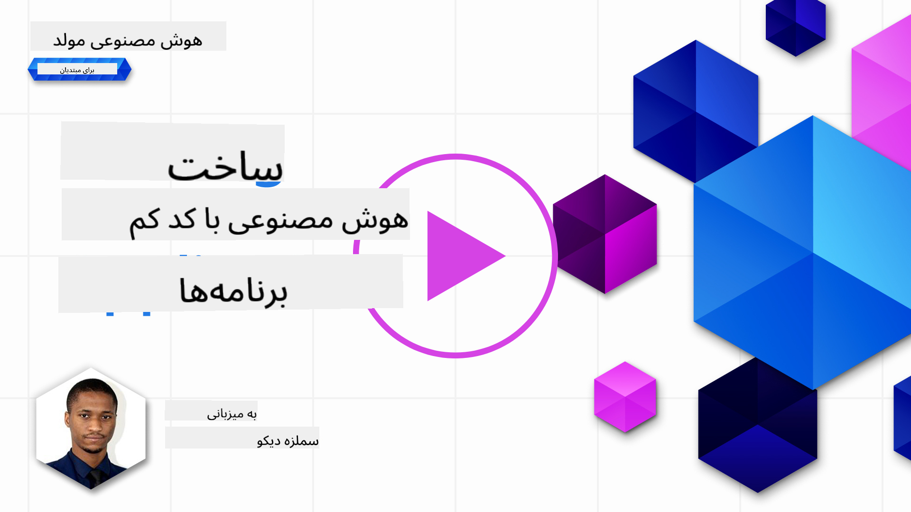
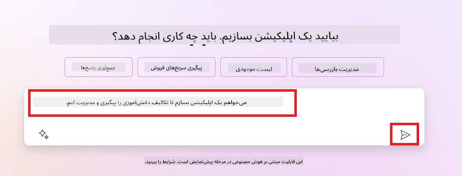
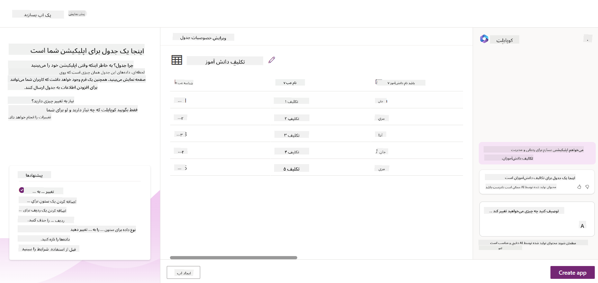
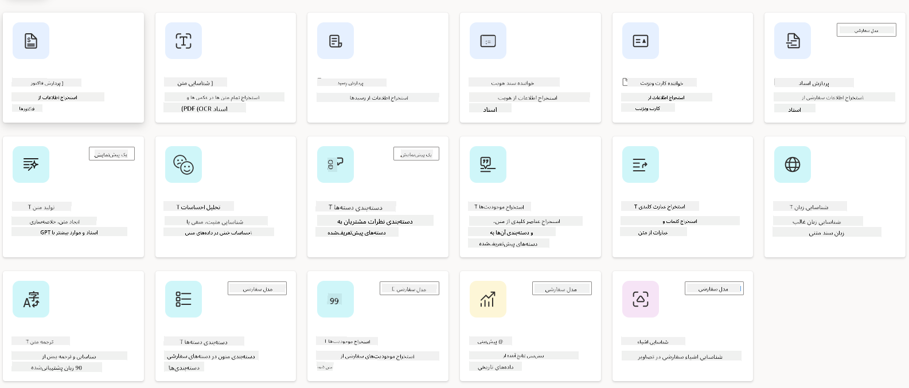
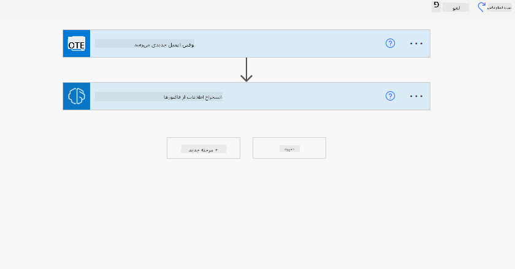
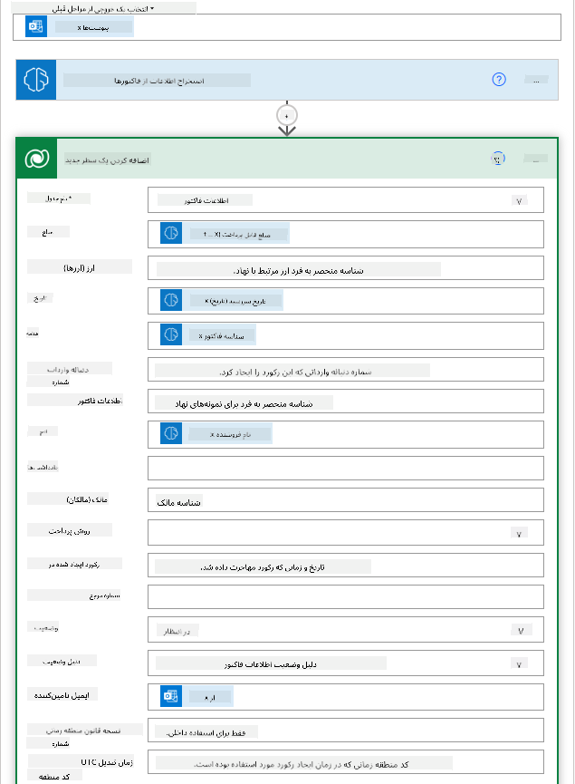
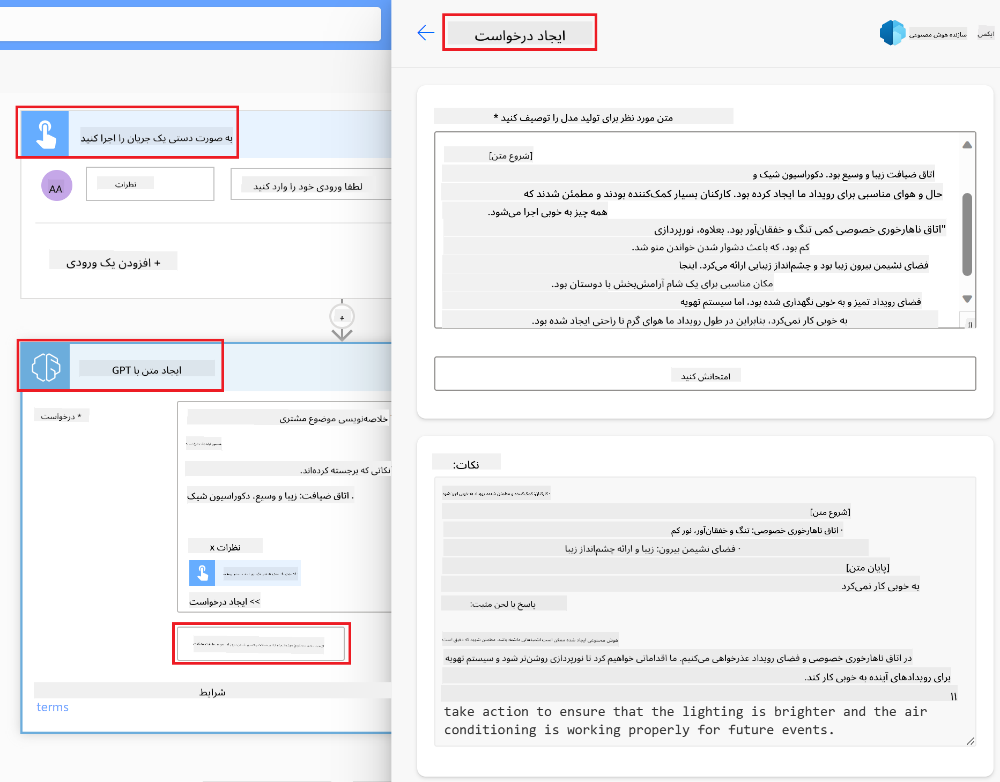

<!--
CO_OP_TRANSLATOR_METADATA:
{
  "original_hash": "f5ff3b6204a695a117d6f452403c95f7",
  "translation_date": "2025-05-19T19:38:10+00:00",
  "source_file": "10-building-low-code-ai-applications/README.md",
  "language_code": "fa"
}
-->
# ساخت برنامه‌های هوش مصنوعی با کد کم

> _(برای مشاهده ویدیو این درس روی تصویر بالا کلیک کنید)_

## مقدمه

حالا که یاد گرفتیم چطور برنامه‌های تولید تصویر بسازیم، بیایید درباره کد کم صحبت کنیم. هوش مصنوعی مولد می‌تواند در زمینه‌های مختلفی از جمله کد کم استفاده شود، اما کد کم چیست و چگونه می‌توانیم هوش مصنوعی را به آن اضافه کنیم؟

ساخت برنامه‌ها و راه‌حل‌ها با استفاده از پلتفرم‌های توسعه کد کم برای توسعه‌دهندگان سنتی و غیرتوسعه‌دهندگان آسان‌تر شده است. پلتفرم‌های توسعه کد کم به شما امکان می‌دهند برنامه‌ها و راه‌حل‌ها را با کمترین کدنویسی بسازید. این کار با ارائه یک محیط توسعه بصری که به شما امکان می‌دهد با کشیدن و رها کردن اجزا برنامه‌ها و راه‌حل‌ها را بسازید، انجام می‌شود. این امکان را به شما می‌دهد تا برنامه‌ها و راه‌حل‌ها را سریع‌تر و با منابع کمتر بسازید. در این درس، به چگونگی استفاده از کد کم و چگونگی تقویت توسعه کد کم با استفاده از هوش مصنوعی در Power Platform می‌پردازیم.

Power Platform به سازمان‌ها این امکان را می‌دهد تا تیم‌های خود را توانمند سازند تا راه‌حل‌های خود را از طریق یک محیط کد کم یا بدون کد بسازند. این محیط به ساده‌سازی فرآیند ساخت راه‌حل‌ها کمک می‌کند. با Power Platform، راه‌حل‌ها می‌توانند در روزها یا هفته‌ها به جای ماه‌ها یا سال‌ها ساخته شوند. Power Platform شامل پنج محصول کلیدی است: Power Apps، Power Automate، Power BI، Power Pages و Copilot Studio.

این درس شامل موارد زیر است:

- معرفی هوش مصنوعی مولد در Power Platform
- معرفی Copilot و نحوه استفاده از آن
- استفاده از هوش مصنوعی مولد برای ساخت برنامه‌ها و جریان‌ها در Power Platform
- درک مدل‌های هوش مصنوعی در Power Platform با AI Builder

## اهداف یادگیری

در پایان این درس، شما قادر خواهید بود:

- درک کنید که چگونه Copilot در Power Platform کار می‌کند.

- یک برنامه ردیابی تکالیف دانشجویی برای استارتاپ آموزشی ما بسازید.

- یک جریان پردازش فاکتور بسازید که از هوش مصنوعی برای استخراج اطلاعات از فاکتورها استفاده می‌کند.

- بهترین روش‌ها را هنگام استفاده از مدل هوش مصنوعی Create Text with GPT به کار بگیرید.

ابزارها و فناوری‌هایی که در این درس استفاده خواهید کرد عبارتند از:

- **Power Apps**، برای برنامه ردیابی تکالیف دانشجویی که یک محیط توسعه کد کم برای ساخت برنامه‌ها برای ردیابی، مدیریت و تعامل با داده‌ها فراهم می‌کند.

- **Dataverse**، برای ذخیره داده‌های برنامه ردیابی تکالیف دانشجویی که یک پلتفرم داده کد کم برای ذخیره داده‌های برنامه فراهم می‌کند.

- **Power Automate**، برای جریان پردازش فاکتور که یک محیط توسعه کد کم برای ساخت جریان‌های کاری برای خودکارسازی فرآیند پردازش فاکتور فراهم می‌کند.

- **AI Builder**، برای مدل هوش مصنوعی پردازش فاکتور که از مدل‌های هوش مصنوعی پیش‌ساخته برای پردازش فاکتورها برای استارتاپ ما استفاده می‌کنید.

## هوش مصنوعی مولد در Power Platform

تقویت توسعه و کاربرد کد کم با هوش مصنوعی مولد یک حوزه کلیدی تمرکز برای Power Platform است. هدف این است که همه بتوانند برنامه‌ها، سایت‌ها، داشبوردها و فرآیندهای خودکار را با استفاده از هوش مصنوعی بسازند، _بدون نیاز به تخصص در علم داده_. این هدف با یکپارچه‌سازی هوش مصنوعی مولد در تجربه توسعه کد کم در Power Platform به صورت Copilot و AI Builder محقق می‌شود.

### این چگونه کار می‌کند؟

Copilot یک دستیار هوش مصنوعی است که به شما امکان می‌دهد راه‌حل‌های Power Platform را با توصیف نیازهای خود در یک سری مراحل مکالمه‌ای با استفاده از زبان طبیعی بسازید. به عنوان مثال، می‌توانید به دستیار هوش مصنوعی خود دستور دهید که چه فیلدهایی برنامه شما استفاده خواهد کرد و آن برنامه و مدل داده‌های زیرین را ایجاد کند یا می‌توانید مشخص کنید که چگونه یک جریان را در Power Automate تنظیم کنید.

می‌توانید از قابلیت‌های مبتنی بر Copilot به عنوان ویژگی‌ای در صفحات برنامه خود استفاده کنید تا کاربران بتوانند از طریق تعاملات مکالمه‌ای به اطلاعات دست یابند.

AI Builder یک قابلیت هوش مصنوعی کد کم در Power Platform است که به شما امکان می‌دهد از مدل‌های هوش مصنوعی برای کمک به خودکارسازی فرآیندها و پیش‌بینی نتایج استفاده کنید. با AI Builder می‌توانید هوش مصنوعی را به برنامه‌ها و جریان‌های خود که به داده‌های شما در Dataverse یا در منابع مختلف داده‌های ابری مانند SharePoint، OneDrive یا Azure متصل هستند، بیاورید.

Copilot در همه محصولات Power Platform در دسترس است: Power Apps، Power Automate، Power BI، Power Pages و Power Virtual Agents. AI Builder در Power Apps و Power Automate در دسترس است. در این درس، ما بر چگونگی استفاده از Copilot و AI Builder در Power Apps و Power Automate برای ساخت یک راه‌حل برای استارتاپ آموزشی ما تمرکز خواهیم کرد.

### Copilot در Power Apps

به عنوان بخشی از Power Platform، Power Apps یک محیط توسعه کد کم برای ساخت برنامه‌ها برای ردیابی، مدیریت و تعامل با داده‌ها فراهم می‌کند. این یک مجموعه خدمات توسعه برنامه با یک پلتفرم داده قابل گسترش و قابلیت اتصال به خدمات ابری و داده‌های محلی است. Power Apps به شما امکان می‌دهد برنامه‌هایی بسازید که روی مرورگرها، تبلت‌ها و تلفن‌ها اجرا شوند و می‌توانند با همکاران به اشتراک گذاشته شوند. Power Apps کاربران را با یک رابط ساده به توسعه برنامه وارد می‌کند، بنابراین هر کاربر تجاری یا توسعه‌دهنده حرفه‌ای می‌تواند برنامه‌های سفارشی بسازد. تجربه توسعه برنامه نیز با هوش مصنوعی مولد از طریق Copilot تقویت می‌شود.

ویژگی دستیار هوش مصنوعی Copilot در Power Apps به شما امکان می‌دهد توصیف کنید که چه نوع برنامه‌ای نیاز دارید و چه اطلاعاتی می‌خواهید برنامه شما ردیابی، جمع‌آوری یا نمایش دهد. سپس Copilot بر اساس توصیف شما یک برنامه Canvas واکنش‌گرا تولید می‌کند. سپس می‌توانید برنامه را برای برآورده کردن نیازهای خود سفارشی کنید. دستیار هوش مصنوعی Copilot همچنین یک جدول Dataverse با فیلدهایی که برای ذخیره داده‌هایی که می‌خواهید ردیابی کنید و برخی داده‌های نمونه پیشنهاد می‌کند. ما در این درس به Dataverse و نحوه استفاده از آن در Power Apps خواهیم پرداخت. سپس می‌توانید جدول را با استفاده از ویژگی دستیار Copilot از طریق مراحل مکالمه‌ای سفارشی کنید. این ویژگی به راحتی از صفحه اصلی Power Apps در دسترس است.

### Copilot در Power Automate

به عنوان بخشی از Power Platform، Power Automate به کاربران اجازه می‌دهد جریان‌های کاری خودکار بین برنامه‌ها و خدمات ایجاد کنند. این کار به خودکارسازی فرآیندهای تجاری تکراری مانند ارتباطات، جمع‌آوری داده‌ها و تأیید تصمیمات کمک می‌کند. رابط ساده آن به کاربران با هر سطح فنی (از مبتدیان تا توسعه‌دهندگان مجرب) اجازه می‌دهد تا وظایف کاری را خودکار کنند. تجربه توسعه جریان کاری نیز با هوش مصنوعی مولد از طریق Copilot تقویت می‌شود.

ویژگی دستیار هوش مصنوعی Copilot در Power Automate به شما امکان می‌دهد توصیف کنید که چه نوع جریانی نیاز دارید و چه اقداماتی می‌خواهید جریان شما انجام دهد. سپس Copilot بر اساس توصیف شما یک جریان تولید می‌کند. سپس می‌توانید جریان را برای برآورده کردن نیازهای خود سفارشی کنید. دستیار هوش مصنوعی Copilot همچنین اقداماتی که برای انجام وظیفه‌ای که می‌خواهید خودکار کنید نیاز دارید را پیشنهاد می‌کند. ما در این درس به جریان‌ها و نحوه استفاده از آن‌ها در Power Automate خواهیم پرداخت. سپس می‌توانید اقدامات را با استفاده از ویژگی دستیار Copilot از طریق مراحل مکالمه‌ای سفارشی کنید. این ویژگی به راحتی از صفحه اصلی Power Automate در دسترس است.

## وظیفه: مدیریت تکالیف دانشجویی و فاکتورها برای استارتاپ ما، با استفاده از Copilot

استارتاپ ما دوره‌های آنلاین به دانشجویان ارائه می‌دهد. استارتاپ به سرعت رشد کرده و اکنون در تلاش است تا با تقاضا برای دوره‌های خود همگام شود. استارتاپ شما را به عنوان توسعه‌دهنده Power Platform استخدام کرده تا به آن‌ها کمک کنید یک راه‌حل کد کم برای کمک به مدیریت تکالیف دانشجویی و فاکتورها بسازند. راه‌حل آن‌ها باید بتواند به آن‌ها کمک کند تا تکالیف دانشجویی را از طریق یک برنامه ردیابی و مدیریت کنند و فرآیند پردازش فاکتور را از طریق یک جریان خودکار کند. از شما خواسته شده است که از هوش مصنوعی مولد برای توسعه این راه‌حل استفاده کنید.

وقتی که با استفاده از Copilot شروع به کار می‌کنید، می‌توانید از [کتابخانه درخواست‌های Copilot Power Platform](https://github.com/pnp/powerplatform-prompts?WT.mc_id=academic-109639-somelezediko) برای شروع با درخواست‌ها استفاده کنید. این کتابخانه شامل لیستی از درخواست‌هایی است که می‌توانید برای ساخت برنامه‌ها و جریان‌ها با Copilot استفاده کنید. همچنین می‌توانید از درخواست‌های موجود در کتابخانه برای گرفتن ایده در مورد نحوه توصیف نیازهای خود به Copilot استفاده کنید.

### ساخت برنامه ردیابی تکالیف دانشجویی برای استارتاپ ما

آموزگاران در استارتاپ ما در تلاش بوده‌اند تا تکالیف دانشجویی را ردیابی کنند. آن‌ها از یک صفحه گسترده برای ردیابی تکالیف استفاده می‌کردند، اما با افزایش تعداد دانشجویان، مدیریت این کار دشوار شده است. آن‌ها از شما خواسته‌اند که یک برنامه بسازید که به آن‌ها کمک کند تا تکالیف دانشجویی را ردیابی و مدیریت کنند. برنامه باید به آن‌ها امکان دهد تکالیف جدید را اضافه کنند، تکالیف را مشاهده کنند، تکالیف را به‌روزرسانی کنند و تکالیف را حذف کنند. برنامه همچنین باید به آموزگاران و دانشجویان امکان دهد تا تکالیفی که نمره‌دهی شده‌اند و آن‌هایی که نمره‌دهی نشده‌اند را مشاهده کنند.

شما برنامه را با استفاده از Copilot در Power Apps و با دنبال کردن مراحل زیر می‌سازید:

1. به صفحه اصلی [Power Apps](https://make.powerapps.com?WT.mc_id=academic-105485-koreyst) بروید.

1. از ناحیه متنی در صفحه اصلی برای توصیف برنامه‌ای که می‌خواهید بسازید استفاده کنید. برای مثال، **_می‌خواهم یک برنامه برای ردیابی و مدیریت تکالیف دانشجویی بسازم_**. روی دکمه **ارسال** کلیک کنید تا درخواست به Copilot AI ارسال شود.

1. Copilot AI یک جدول Dataverse با فیلدهایی که برای ذخیره داده‌هایی که می‌خواهید ردیابی کنید و برخی داده‌های نمونه پیشنهاد می‌کند. سپس می‌توانید جدول را با استفاده از ویژگی دستیار Copilot از طریق مراحل مکالمه‌ای سفارشی کنید.

   > **مهم**: Dataverse پلتفرم داده زیرین برای Power Platform است. این یک پلتفرم داده کد کم برای ذخیره داده‌های برنامه است. این یک سرویس کاملاً مدیریت‌شده است که داده‌ها را به‌طور ایمن در ابر مایکروسافت ذخیره می‌کند و در محیط Power Platform شما تهیه می‌شود. این پلتفرم با قابلیت‌های مدیریت داده‌های داخلی، مانند طبقه‌بندی داده‌ها، مسیر داده‌ها، کنترل دسترسی دقیق و موارد دیگر ارائه می‌شود. می‌توانید اطلاعات بیشتری درباره Dataverse [اینجا](https://docs.microsoft.com/powerapps/maker/data-platform/data-platform-intro?WT.mc_id=academic-109639-somelezediko) بیابید.

   

1. آموزگاران می‌خواهند ایمیل‌هایی به دانشجویانی که تکالیف خود را ارسال کرده‌اند ارسال کنند تا آن‌ها را در جریان پیشرفت تکالیفشان قرار دهند. می‌توانید از Copilot برای اضافه کردن یک فیلد جدید به جدول برای ذخیره ایمیل دانشجو استفاده کنید. برای مثال، می‌توانید از درخواست زیر برای اضافه کردن یک فیلد جدید به جدول استفاده کنید: **_می‌خواهم ستونی برای ذخیره ایمیل دانشجو اضافه کنم_**. روی دکمه **ارسال** کلیک کنید تا درخواست به Copilot AI ارسال شود.

1. Copilot AI یک فیلد جدید تولید می‌کند و سپس می‌توانید فیلد را برای برآورده کردن نیازهای خود سفارشی کنید.

1. هنگامی که کارتان با جدول تمام شد، روی دکمه **ایجاد برنامه** کلیک کنید تا برنامه ایجاد شود.

1. Copilot AI یک برنامه Canvas واکنش‌گرا بر اساس توصیف شما تولید می‌کند. سپس می‌توانید برنامه را برای برآورده کردن نیازهای خود سفارشی کنید.

1. برای اینکه آموزگاران بتوانند ایمیل‌هایی به دانشجویان ارسال کنند، می‌توانید از Copilot برای اضافه کردن یک صفحه جدید به برنامه استفاده کنید. برای مثال، می‌توانید از درخواست زیر برای اضافه کردن یک صفحه جدید به برنامه استفاده کنید: **_می‌خواهم صفحه‌ای برای ارسال ایمیل به دانشجویان اضافه کنم_**. روی دکمه **ارسال** کلیک کنید تا درخواست به Copilot AI ارسال شود.

1. Copilot AI یک صفحه جدید تولید می‌کند و سپس می‌توانید صفحه را برای برآورده کردن نیازهای خود سفارشی کنید.

1. هنگامی که کارتان با برنامه تمام شد، روی دکمه **ذخیره** کلیک کنید تا برنامه ذخیره شود.

1. برای به اشتراک‌گذاری برنامه با آموزگاران، روی دکمه **اشتراک‌گذاری** کلیک کنید و سپس دوباره روی دکمه **اشتراک‌گذاری** کلیک کنید. سپس می‌توانید برنامه را با وارد کردن آدرس‌های ایمیل آن‌ها با آموزگاران به اشتراک بگذارید.

> **تکلیف شما**: برنامه‌ای که شما ساختید یک شروع خوب است اما می‌تواند بهبود یابد. با ویژگی ایمیل، آموزگاران فقط می‌توانند به صورت دستی به دانشجویان ایمیل ارسال کنند و باید ایمیل‌های آن‌ها را تایپ کنند. آیا می‌توانید از Copilot برای ساخت یک اتوماسیون استفاده کنید که به آموزگاران امکان دهد به صورت خودکار به دانشجویان ایمیل ارسال کنند وقتی که تکالیف خود را ارسال می‌کنند؟ نکته شما این است که با درخواست مناسب می‌توانید از Copilot در Power Automate برای ساخت این کار استفاده کنید.

### ساخت جدول اطلاعات فاکتورها برای استارتاپ ما

تیم مالی استارتاپ ما در تلاش بوده است تا فاکتورها را ردیابی کند. آن‌ها از یک صفحه گسترده برای ردیابی فاکتورها استفاده می‌کردند، اما با افزایش تعداد فاکتورها، مدیریت این کار دشوار شده است. آن‌ها از شما خواسته‌اند که یک جدول بسازید که به آن‌ها کمک کند اطلاعات فاکتورهایی که دریافت کرده‌اند را ذخیره، ردیابی و مدیریت کنند. جدول باید برای ساخت یک اتوماسیون استفاده شود که تمام اطلاعات فاکتورها را استخراج کند و در جدول ذخیره کند. جدول همچنین باید به تیم مالی امکان دهد فاکتورهایی که پرداخت شده‌اند و آن‌هایی که پرداخت نشده‌اند را مشاهده کنند.

Power Platform یک پلتفرم داده زیرین به نام Dataverse دارد که به شما امکان می‌دهد داده‌های برنامه‌ها و راه‌حل‌های خود را ذخیره کنید. Dataverse یک پلتفرم داده کد کم برای ذخیره داده‌های برنامه است. این یک سرویس کاملاً مدیریت‌شده است که داده‌ها را به‌طور ایمن در ابر مایکروسافت ذخیره می‌کند و در محیط Power Platform شما تهیه می‌شود. این پلتفرم با قابلیت‌های مدیریت داده‌های داخلی، مانند طبقه‌بندی داده‌ها، مسیر داده‌ها، کنترل دسترسی دقیق و موارد دیگر ارائه می‌شود. می‌توانید اطلاعات بیشتری [درباره Dataverse اینجا](https://docs.microsoft.com/powerapps/maker/data-platform/data-platform-intro?WT.mc_id=academic-109639-somelezediko) بیابید.

چرا باید از Dataverse برای استارتاپ خود استفاده کنیم؟ جداول استاندارد و سفارشی در Dataverse یک گزینه ذخیره‌سازی امن و ابری برای داده‌های شما فراهم می‌کنند. جداول به شما امکان می‌دهند انواع مختلف داده‌ها را ذخیره کنید، مشابه استفاده از چندین برگه در یک کتاب کار Excel. می‌توانید از جداول برای ذخیره داده‌هایی که به نیازهای سازمانی یا تجاری شما خاص هستند استفاده کنید. برخی از مزایایی که استارتاپ ما از استفاده از Dataverse بهره‌مند می‌شود شامل موارد زیر است اما محدود به آن‌ها نیست:

- **آسان برای مدیریت**: هم داده‌های متا و هم داده‌ها در ابر ذخیره می‌شوند، بنابراین نیازی به نگرانی در مورد جزئیات نحوه ذخیره یا مدیریت آن‌ها ندارید. می‌توانید بر روی ساخت برنامه‌ها و راه‌حل‌های خود تمرکز کنید.

- **امن**: Dataverse یک گزینه ذخیره‌سازی امن و ابری برای داده‌های شما فراهم می‌کند. می‌توانید کنترل کنید که چه
یک متن. - **تحلیل احساسات**: این مدل احساسات مثبت، منفی، خنثی یا ترکیبی را در متن تشخیص می‌دهد. - **خواننده کارت ویزیت**: این مدل اطلاعات را از کارت‌های ویزیت استخراج می‌کند. - **تشخیص متن**: این مدل متن را از تصاویر استخراج می‌کند. - **تشخیص اشیا**: این مدل اشیا را از تصاویر تشخیص داده و استخراج می‌کند. - **پردازش اسناد**: این مدل اطلاعات را از فرم‌ها استخراج می‌کند. - **پردازش فاکتور**: این مدل اطلاعات را از فاکتورها استخراج می‌کند. با مدل‌های هوش مصنوعی سفارشی، شما می‌توانید مدل خود را به AI Builder بیاورید تا بتواند مانند هر مدل سفارشی AI Builder عمل کند و به شما امکان دهد مدل را با استفاده از داده‌های خود آموزش دهید. می‌توانید از این مدل‌ها برای خودکارسازی فرآیندها و پیش‌بینی نتایج در هر دو Power Apps و Power Automate استفاده کنید. هنگام استفاده از مدل خود، محدودیت‌هایی وجود دارد. بیشتر درباره این [محدودیت‌ها](https://learn.microsoft.com/ai-builder/byo-model#limitations?WT.mc_id=academic-105485-koreyst) بخوانید.  

## وظیفه شماره ۲ - ساخت یک جریان پردازش فاکتور برای استارتاپ ما

تیم مالی در پردازش فاکتورها دچار مشکل شده است. آنها از یک صفحه گسترده برای پیگیری فاکتورها استفاده کرده‌اند، اما با افزایش تعداد فاکتورها، مدیریت آن دشوار شده است. آنها از شما خواسته‌اند که یک جریان کاری بسازید که به آنها در پردازش فاکتورها با استفاده از هوش مصنوعی کمک کند. جریان کاری باید به آنها امکان دهد تا اطلاعات را از فاکتورها استخراج کرده و اطلاعات را در یک جدول Dataverse ذخیره کنند. جریان کاری همچنین باید به آنها امکان دهد که با اطلاعات استخراج شده یک ایمیل به تیم مالی ارسال کنند. حالا که می‌دانید AI Builder چیست و چرا باید از آن استفاده کنید، بیایید ببینیم چگونه می‌توانید از مدل پردازش فاکتور AI Builder که قبلاً بررسی کردیم، برای ساخت یک جریان کاری که به تیم مالی در پردازش فاکتورها کمک کند، استفاده کنید. برای ساخت یک جریان کاری که به تیم مالی در پردازش فاکتورها با استفاده از مدل پردازش فاکتور AI Builder کمک کند، مراحل زیر را دنبال کنید:

1. به صفحه اصلی [Power Automate](https://make.powerautomate.com?WT.mc_id=academic-105485-koreyst) بروید.
2. از منطقه متنی در صفحه اصلی برای توصیف جریان کاری که می‌خواهید بسازید استفاده کنید. برای مثال، **_پردازش یک فاکتور وقتی به صندوق پستی من می‌رسد_**. روی دکمه **ارسال** کلیک کنید تا درخواست را به AI Copilot ارسال کنید. 
3. AI Copilot اقداماتی را که برای انجام وظیفه‌ای که می‌خواهید خودکار کنید، پیشنهاد می‌کند. می‌توانید روی دکمه **بعدی** کلیک کنید تا به مراحل بعدی بروید.
4. در مرحله بعد، Power Automate از شما می‌خواهد تا اتصالات مورد نیاز برای جریان را تنظیم کنید. وقتی کارتان تمام شد، روی دکمه **ایجاد جریان** کلیک کنید تا جریان ایجاد شود.
5. AI Copilot یک جریان تولید می‌کند و سپس می‌توانید جریان را برای برآوردن نیازهای خود سفارشی کنید.
6. محرک جریان را به‌روزرسانی کنید و **پوشه** را به پوشه‌ای که فاکتورها در آن ذخیره می‌شوند تنظیم کنید. برای مثال، می‌توانید پوشه را به **صندوق ورودی** تنظیم کنید. روی **نمایش گزینه‌های پیشرفته** کلیک کنید و **فقط با پیوست‌ها** را به **بله** تنظیم کنید. این کار تضمین می‌کند که جریان فقط زمانی اجرا شود که ایمیلی با پیوست در پوشه دریافت شود.
7. اقدامات زیر را از جریان حذف کنید: **HTML به متن**، **ترکیب**، **ترکیب ۲**، **ترکیب ۳** و **ترکیب ۴** زیرا از آنها استفاده نخواهید کرد.
8. عمل **شرط** را از جریان حذف کنید زیرا از آن استفاده نخواهید کرد. باید مانند تصویر زیر به نظر برسد: 
9. روی دکمه **افزودن یک اقدام** کلیک کنید و **Dataverse** را جستجو کنید. عمل **افزودن یک سطر جدید** را انتخاب کنید.
10. در عمل **استخراج اطلاعات از فاکتورها**، **فایل فاکتور** را به **محتوای پیوست** از ایمیل اشاره دهید. این کار تضمین می‌کند که جریان اطلاعات را از پیوست فاکتور استخراج کند.
11. **جدول**ی را که قبلاً ایجاد کرده‌اید انتخاب کنید. برای مثال، می‌توانید جدول **اطلاعات فاکتور** را انتخاب کنید. محتوای پویا از اقدام قبلی را برای پر کردن فیلدهای زیر انتخاب کنید:
    - شناسه
    - مقدار
    - تاریخ
    - نام
    - وضعیت
    - وضعیت را به **در انتظار** تنظیم کنید.
    - ایمیل تامین‌کننده
    - از محتوای پویا **از** در محرک **وقتی یک ایمیل جدید می‌رسد** استفاده کنید. 
12. وقتی کارتان با جریان تمام شد، روی دکمه **ذخیره** کلیک کنید تا جریان ذخیره شود. سپس می‌توانید جریان را با ارسال ایمیلی با یک فاکتور به پوشه‌ای که در محرک مشخص کرده‌اید، آزمایش کنید.

> **تکلیف شما**: جریان کاری که ساختید شروع خوبی است، حالا باید به این فکر کنید که چگونه می‌توانید یک اتوماسیون بسازید که به تیم مالی ما امکان دهد تا ایمیلی به تامین‌کننده ارسال کند تا آنها را با وضعیت فعلی فاکتورشان به‌روزرسانی کند. راهنمایی شما: جریان باید زمانی اجرا شود که وضعیت فاکتور تغییر کند.

## استفاده از یک مدل هوش مصنوعی تولید متن در Power Automate

مدل هوش مصنوعی ایجاد متن با GPT در AI Builder به شما امکان می‌دهد تا بر اساس یک درخواست متن تولید کنید و توسط سرویس Microsoft Azure OpenAI پشتیبانی می‌شود. با این قابلیت، می‌توانید فناوری GPT (تبدیل‌کننده پیش‌آموزش دیده مولد) را در برنامه‌ها و جریان‌های خود بگنجانید تا مجموعه‌ای از جریان‌های خودکار و برنامه‌های کاربردی بینش‌محور بسازید.

مدل‌های GPT آموزش گسترده‌ای بر روی حجم زیادی از داده‌ها دیده‌اند و به آنها امکان می‌دهد متنی تولید کنند که به زبان انسانی شباهت زیادی دارد، زمانی که یک درخواست به آنها داده می‌شود. وقتی با اتوماسیون جریان کاری ادغام می‌شود، مدل‌های هوش مصنوعی مانند GPT می‌توانند برای ساده‌سازی و خودکارسازی طیف گسترده‌ای از وظایف استفاده شوند.

برای مثال، می‌توانید جریان‌هایی بسازید که به‌طور خودکار متن را برای انواع مختلف استفاده، مانند: پیش‌نویس ایمیل‌ها، توصیف محصولات و غیره تولید کند. همچنین می‌توانید از مدل برای تولید متن برای انواع برنامه‌ها، مانند چت‌بات‌ها و برنامه‌های خدمات مشتری استفاده کنید که به نمایندگان خدمات مشتری امکان می‌دهد به‌طور مؤثر و کارآمد به درخواست‌های مشتریان پاسخ دهند.

برای یادگیری نحوه استفاده از این مدل هوش مصنوعی در Power Automate، به ماژول [افزودن هوشمندی با AI Builder و GPT](https://learn.microsoft.com/training/modules/ai-builder-text-generation/?WT.mc_id=academic-109639-somelezediko) مراجعه کنید.

## کار عالی! به یادگیری خود ادامه دهید

پس از اتمام این درس، به مجموعه یادگیری [هوش مصنوعی مولد](https://aka.ms/genai-collection?WT.mc_id=academic-105485-koreyst) ما سر بزنید تا دانش خود در زمینه هوش مصنوعی مولد را ارتقا دهید!

به درس ۱۱ بروید، جایی که به بررسی نحوه [ادغام هوش مصنوعی مولد با فراخوانی توابع](../11-integrating-with-function-calling/README.md?WT.mc_id=academic-105485-koreyst) خواهیم پرداخت!

**سلب مسئولیت**:  
این سند با استفاده از سرویس ترجمه هوش مصنوعی [Co-op Translator](https://github.com/Azure/co-op-translator) ترجمه شده است. در حالی که ما برای دقت تلاش می‌کنیم، لطفاً توجه داشته باشید که ترجمه‌های خودکار ممکن است حاوی خطاها یا نادقتی‌ها باشند. سند اصلی به زبان بومی آن باید به عنوان منبع معتبر در نظر گرفته شود. برای اطلاعات حیاتی، ترجمه انسانی حرفه‌ای توصیه می‌شود. ما مسئولیتی در قبال هرگونه سوء تفاهم یا تفسیر نادرست ناشی از استفاده از این ترجمه نداریم.