# ساخت برنامه‌های هوش مصنوعی با کد پایین  

[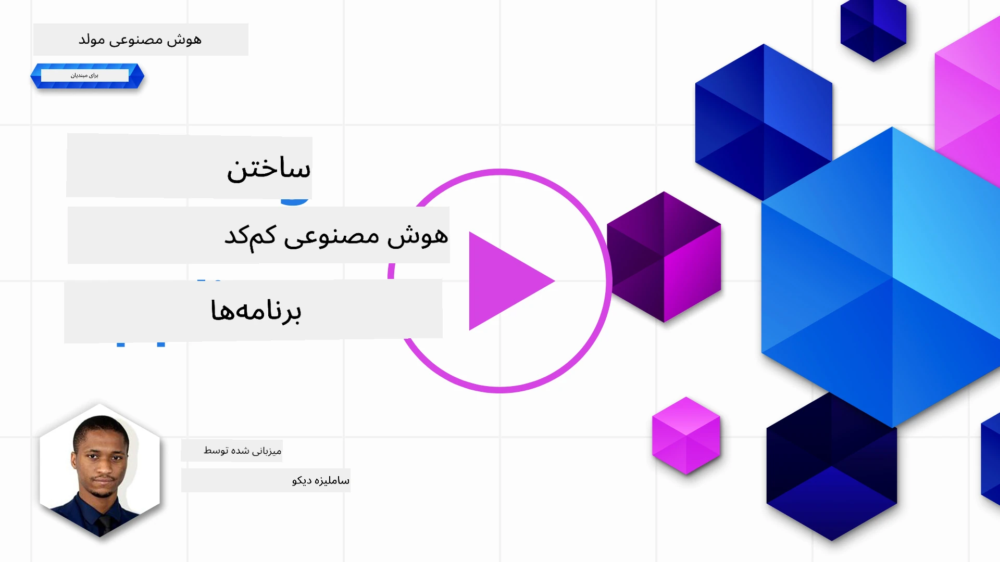](https://youtu.be/1vzq3Nd8GBA?si=h6LHWJXdmqf6mhDg)  

> _(برای مشاهده ویدیوی این درس روی تصویر بالا کلیک کنید)_  

## مقدمه  

اکنون که یاد گرفته‌ایم چگونه برنامه‌های تولید تصویر بسازیم، بیایید درباره کد پایین صحبت کنیم. هوش مصنوعی تولیدی می‌تواند برای حوزه‌های مختلفی از جمله کد پایین استفاده شود، اما کد پایین چیست و چگونه می‌توانیم هوش مصنوعی را به آن اضافه کنیم؟  

ساخت برنامه‌ها و راه‌حل‌ها برای توسعه‌دهندگان سنتی و غیر توسعه‌دهندگان با استفاده از پلتفرم‌های توسعه کد پایین آسان‌تر شده است. پلتفرم‌های توسعه کد پایین به شما امکان می‌دهند برنامه‌ها و راه‌حل‌ها را با کد کم یا بدون کد بسازید. این امر با ارائه محیط توسعه بصری که امکان کشیدن و رها کردن اجزا را برای ساخت برنامه‌ها و راه‌حل‌ها فراهم می‌کند، حاصل می‌شود. این امکان به شما اجازه می‌دهد برنامه‌ها و راه‌حل‌ها را سریع‌تر و با منابع کمتری بسازید. در این درس، به‌طور عمیق‌تر به نحوه استفاده از کد پایین و چگونگی ارتقای توسعه کد پایین با هوش مصنوعی با استفاده از Power Platform می‌پردازیم.  

پلتفرم Power فرصت این را به سازمان‌ها می‌دهد تا تیم‌های خود را قادر سازند که راه‌حل‌های خود را از طریق محیطی شهودی با کد پایین یا بدون کد بسازند. این محیط به ساده‌سازی فرآیند ساخت راه‌حل‌ها کمک می‌کند. با Power Platform، می‌توان راه‌حل‌ها را در عرض چند روز یا هفته به جای ماه‌ها یا سال‌ها ساخت. پلتفرم Power شامل پنج محصول کلیدی است: Power Apps، Power Automate، Power BI، Power Pages و Copilot Studio.  

این درس موارد زیر را پوشش می‌دهد:  

- مقدمه‌ای بر هوش مصنوعی تولیدی در Power Platform  
- معرفی Copilot و نحوه استفاده از آن  
- استفاده از هوش مصنوعی تولیدی برای ساخت برنامه‌ها و فلوها در Power Platform  
- درک مدل‌های هوش مصنوعی در Power Platform با AI Builder  
- ساخت نمایندگان هوشمند با Microsoft Copilot Studio  

## اهداف آموزشی  

تا پایان این درس، شما قادر خواهید بود:  

- درک نحوه عملکرد Copilot در Power Platform.  

- ساخت اپلیکیشن رهگیری تکالیف دانشجویی برای استارتاپ آموزشی ما.  

- ساخت یک فلو پردازش فاکتورها که از هوش مصنوعی برای استخراج اطلاعات از فاکتورها استفاده می‌کند.  

- اعمال بهترین روش‌ها هنگام استفاده از مدل هوش مصنوعی Create Text with GPT.  

- درک اینکه Microsoft Copilot Studio چیست و چگونه با آن نمایندگان هوشمند بسازیم.  

ابزارها و فناوری‌هایی که در این درس استفاده خواهید کرد عبارتند از:  

- **Power Apps**، برای اپلیکیشن رهگیری تکالیف دانشجویی، که محیط توسعه کد پایین برای ساخت برنامه‌های پیگیری، مدیریت و تعامل با داده‌ها را فراهم می‌کند.  

- **Dataverse**، برای ذخیره داده‌های اپلیکیشن رهگیری تکالیف دانشجویی که یک پلتفرم داده با کد پایین برای ذخیره داده‌های برنامه فراهم می‌کند.  

- **Power Automate**، برای فلو پردازش فاکتورها که محیط توسعه کد پایین برای ساخت گردش‌های کاری به منظور خودکارسازی فرآیند پردازش فاکتورها را ارائه می‌دهد.  

- **AI Builder**، برای مدل هوش مصنوعی پردازش فاکتورها که از مدل‌های از پیش ساخته‌ی هوش مصنوعی برای پردازش فاکتورها در استارتاپ ما استفاده می‌کند.  

## هوش مصنوعی تولیدی در Power Platform  

ارتقای توسعه و برنامه‌نویسی کد پایین با هوش مصنوعی تولیدی، یکی از حوزه‌های اصلی تمرکز Power Platform است. هدف این است که همه بتوانند برنامه‌ها، سایت‌ها، داشبوردهای مجهز به هوش مصنوعی بسازند و فرآیندها را با هوش مصنوعی خودکار کنند، _بدون نیاز به تخصص داده‌کاوی_. این هدف با ادغام هوش مصنوعی تولیدی در تجربه توسعه کد پایین در Power Platform در قالب Copilot و AI Builder محقق می‌شود.  

### این چگونه کار می‌کند؟  

Copilot یک دستیار هوش مصنوعی است که به شما امکان می‌دهد راه‌حل‌های Power Platform را با توصیف نیازهای خود در مجموعه‌ای از مراحل گفتگو با زبان طبیعی بسازید. به عنوان مثال، می‌توانید به دستیار هوش مصنوعی خود بگویید چه فیلدهایی را برنامه شما باید داشته باشد و او اپ و مدل داده‌ای زیرساختی آن را ایجاد خواهد کرد یا می‌توانید مشخص کنید چگونه یک جریان در Power Automate تنظیم شود.  

شما می‌توانید قابلیت‌های Copilot را به عنوان ویژگی در صفحه‌های برنامه خود برای کمک به کاربران جهت کشف بینش‌ها از طریق تعاملات مکالمه‌ای استفاده کنید.  

AI Builder یک قابلیت هوش مصنوعی کد پایین در Power Platform است که به شما امکان استفاده از مدل‌های هوش مصنوعی را برای کمک به خودکارسازی فرآیندها و پیش‌بینی نتایج می‌دهد. با AI Builder می‌توانید هوش مصنوعی را به برنامه‌ها و فلوهای خود متصل به داده‌های Dataverse یا منابع داده ابری مختلف مانند SharePoint، OneDrive یا Azure بیاورید.  

Copilot در همه محصولات Power Platform در دسترس است: Power Apps، Power Automate، Power BI، Power Pages و Copilot Studio (که قبلاً Power Virtual Agents نام داشت). AI Builder در Power Apps و Power Automate موجود است. در این درس، بر نحوه استفاده از Copilot و AI Builder در Power Apps و Power Automate برای ساخت راه‌حلی برای استارتاپ آموزشی خود تمرکز خواهیم کرد.  

### Copilot در Power Apps  

به‌عنوان بخشی از Power Platform، Power Apps محیط توسعه کد پایین برای ساخت برنامه‌هایی است که داده‌ها را رهگیری، مدیریت و با آن‌ها تعامل برقرار می‌کنند. این یک مجموعه از خدمات توسعه برنامه با پلتفرم داده مقیاس‌پذیر و توانایی اتصال به خدمات ابری و داده‌های در محل است. Power Apps به شما اجازه می‌دهد برنامه‌هایی بسازید که در مرورگرها، تبلت‌ها و تلفن‌ها اجرا می‌شوند و قابلیت اشتراک با همکاران را دارند. Power Apps کاربران را با رابط کاربری ساده در توسعه برنامه هدایت می‌کند تا هر کاربر تجاری یا توسعه‌دهنده حرفه‌ای بتواند برنامه‌های سفارشی بسازد. تجربه توسعه برنامه نیز از طریق هوش مصنوعی تولیدی با Copilot بهبود یافته است.  

ویژگی دستیار هوش مصنوعی Copilot در Power Apps به شما امکان می‌دهد شرح دهید چه نوع برنامه‌ای نیاز دارید و چه اطلاعاتی می‌خواهید برنامه شما رهگیری، جمع‌آوری یا نمایش دهد. سپس Copilot یک برنامه Canvas واکنش‌گرا بر اساس شرح شما تولید می‌کند. سپس می‌توانید برنامه را برای پاسخگویی به نیازهای خود سفارشی کنید. Copilot هوشمند همچنین جدول Dataverse را با فیلدهای مورد نیاز برای ذخیره داده‌های دلخواه شما و برخی داده‌های نمونه تولید و پیشنهاد می‌دهد. ما در این درس بعداً به Dataverse و نحوه استفاده از آن در Power Apps می‌پردازیم. سپس می‌توانید جدول را با استفاده از ویژگی دستیار هوش مصنوعی Copilot در قالب مراحل گفتگو سفارشی کنید. این ویژگی به راحتی از صفحه اصلی Power Apps در دسترس است.  

### Copilot در Power Automate  

به‌عنوان بخشی از Power Platform، Power Automate به کاربران اجازه می‌دهد گردش‌های کاری خودکار بین برنامه‌ها و خدمات ایجاد کنند. این کمک می‌کند فرآیندهای تجاری تکراری مانند ارتباطات، جمع‌آوری داده‌ها و تأییدیه‌های تصمیم‌گیری را خودکار کنند. رابط کاربری ساده آن به کاربران با هر سطح مهارتی (از مبتدی تا توسعه‌دهندگان حرفه‌ای) امکان می‌دهد کارهای کاری را خودکار کنند. تجربه توسعه گردش کار نیز با هوش مصنوعی تولیدی از طریق Copilot بهبود یافته است.  

ویژگی دستیار هوش مصنوعی Copilot در Power Automate به شما امکان می‌دهد شرح دهید چه نوع فلو (جریانی) نیاز دارید و چه اقداماتی می‌خواهید فلو انجام دهد. سپس Copilot بر اساس شرح شما یک فلو تولید می‌کند. سپس می‌توانید فلو را برای پاسخگویی به نیازهای خود سفارشی کنید. Copilot هوشمند همچنین اقدامات مورد نیاز برای انجام وظیفه‌ای که می‌خواهید خودکار شود را پیشنهاد و تولید می‌کند. ما بعداً در این درس به این می‌پردازیم که فلوها چیستند و چگونه می‌توانید از آن‌ها در Power Automate استفاده کنید. سپس می‌توانید اقدامات را با استفاده از ویژگی دستیار هوش مصنوعی Copilot از طریق مراحل مکالمه‌ای سفارشی کنید. این ویژگی به راحتی از صفحه اصلی Power Automate در دسترس است.  

## ساخت نمایندگان هوشمند با Microsoft Copilot Studio  

[Microsoft Copilot Studio](https://learn.microsoft.com/microsoft-copilot-studio/fundamentals-what-is-copilot-studio?WT.mc_id=academic-105485-koreyst) (که قبلاً Power Virtual Agents نام داشت) عضوی با کد پایین از Power Platform برای ساخت **نمایندگان هوش مصنوعی** – همیاران مکالمه‌ای که می‌توانند به سوالات پاسخ دهند، اقدامات انجام دهند و کارها را به نمایندگی از کاربران شما خودکار کنند. درست مانند بقیه Power Platform، این نمایندگان را در تجربه‌ای بصری و مبتنی بر زبان طبیعی می‌سازید: شما توضیح می‌دهید که می‌خواهید نماینده چه کار کند و Copilot Studio در ایجاد دستورالعمل‌ها، دانش و اقدامات او کمک می‌کند.  

برای استارتاپ آموزشی ما، می‌توانید نماینده‌ای بسازید که به سوالات دانشجویان درباره دوره‌ها پاسخ دهد، مهلت‌های تکالیف را بررسی کند و حتی به استاد ایمیل بفرستد – همه بدون نوشتن کد.  

در اینجا برخی از جدیدترین قابلیت‌هایی که Copilot Studio را قدرتمند می‌کند آورده شده است:  

- **پاسخ‌های تولیدی بر اساس دانش شما**. به جای نوشتن دستی هر گفتگو، می‌توانید **منابع دانش** – وب‌سایت‌های عمومی، SharePoint، OneDrive، Dataverse، فایل‌های بارگذاری‌شده یا داده‌های سازمانی از طریق کانکتورها – را متصل کنید و نماینده پاسخ‌های مستند و مبتنی بر آن‌ها تولید می‌کند.  

- **هماهنگی تولیدی**. به جای اتکا به عبارات ماشه‌ای خشک، نماینده از هوش مصنوعی برای درک درخواست و تصمیم‌گیری پویا درباره اینکه کدام دانش، موضوعات و اقدامات را برای انجام آن ترکیب کند، استفاده می‌کند، از جمله زنجیره کردن چندین مرحله با هم.  

- **اقدامات و کانکتورها**. نمایندگان فقط چت نمی‌کنند، بلکه می‌توانند عملیات انجام دهند. می‌توانید به نماینده اقداماتی با پشتیبانی بیش از ۱,۵۰۰ کانکتور از پیش‌ساخته Power Platform، فلوهای Power Automate، APIهای REST سفارشی، دعوت‌ها یا سرورهای **Model Context Protocol (MCP)** بدهید.  

- **نمایندگان خودکار**. نمایندگان محدود به پاسخ دادن در پنجره چت نیستند. می‌توانید **نمایندگان خودکار** بسازید که با رویدادها تحریک شوند – مانند ایمیل جدید، رکورد جدید در Dataverse یا بارگذاری فایل – و سپس در پس‌زمینه برای کامل کردن یک کار عمل کنند.  

- **هماهنگی چند نماینده‌ای**. نمایندگان می‌توانند به نمایندگان دیگر ارجاع دهند. یک نماینده Copilot Studio می‌تواند به نمایندگان دیگر واگذار شود یا با آن‌ها توسعه یابد، از جمله نمایندگانی که در Microsoft 365 Copilot منتشر شده‌اند و نمایندگانی که در Microsoft Foundry ساخته شده‌اند.  

- **انتخاب مدل**. فراتر از مدل‌های داخلی، می‌توانید مدل‌هایی از کاتالوگ مدل Microsoft Foundry بیاورید تا نحوه استدلال و پاسخ‌دهی نماینده خود را تنظیم کنید.  

- **انتشار در هر مکان**. پس از ساخت، نماینده را می‌توان در چندین کانال – Microsoft Teams، Microsoft 365 Copilot، سایت یا اپ سفارشی و غیره – منتشر کرد؛ همراه با مدیریت امنیت، احراز هویت و تحلیل از طریق تجربه مدیریت Power Platform.  

می‌توانید اولین نماینده خود را از [copilotstudio.microsoft.com](https://copilotstudio.microsoft.com?WT.mc_id=academic-105485-koreyst) بسازید و اطلاعات بیشتری در [مستندات Microsoft Copilot Studio](https://learn.microsoft.com/microsoft-copilot-studio/?WT.mc_id=academic-105485-koreyst) بیاموزید.  

## وظیفه: مدیریت تکالیف دانشجویان و فاکتورها برای استارتاپ ما، با استفاده از Copilot  

استارتاپ ما دوره‌های آموزشی آنلاین به دانشجویان ارائه می‌دهد. این استارتاپ به سرعت رشد کرده و اکنون در پی برآوردن تقاضا برای دوره‌های خود دچار مشکل شده است. استارتاپ شما را به‌عنوان توسعه‌دهنده Power Platform استخدام کرده است تا به آن‌ها کمک کنید راه‌حل کد پایین برای مدیریت تکالیف دانشجویان و فاکتورها بسازند. راه‌حل آن‌ها باید بتواند به آن‌ها کمک کند تا تکالیف دانشجویی را از طریق یک برنامه پیگیری و مدیریت کنند و فرآیند پردازش فاکتورها را از طریق یک گردش کار خودکار سازند. از شما خواسته شده است که از هوش مصنوعی تولیدی برای توسعه این راه‌حل استفاده کنید.  

وقتی شروع به استفاده از Copilot می‌کنید، می‌توانید از [کتابخانه پرسش‌های Copilot Power Platform](https://github.com/pnp/powerplatform-prompts?WT.mc_id=academic-109639-somelezediko) برای شروع بهره ببرید. این کتابخانه شامل فهرستی از پرسش‌هاست که می‌توانید برای ساخت برنامه‌ها و فلوها با Copilot استفاده کنید. همچنین می‌توانید از پرسش‌های این کتابخانه ایده‌ای درباره نحوه شرح نیازهای خود به Copilot بگیرید.  

### ساخت اپلیکیشن رهگیری تکالیف دانشجویی برای استارتاپ ما  

مربیان در استارتاپ ما در پیگیری تکالیف دانشجویان مشکل داشته‌اند. آن‌ها از یک صفحه گسترده برای پیگیری تکالیف استفاده می‌کردند که با افزایش تعداد دانشجویان به سختی قابل مدیریت شده است. آن‌ها از شما خواسته‌اند برنامه‌ای بسازید که به آن‌ها در پیگیری و مدیریت تکالیف دانشجویان کمک کند. برنامه باید به آن‌ها امکان دهد تکالیف جدید اضافه کنند، تکالیف را مشاهده کنند، تکالیف را به‌روزرسانی کرده و حذف کنند. همچنین برنامه باید به مربیان و دانشجویان اجازه دهد تکالیف نمره‌دهی شده و نشده را ببینند.  

شما اپلیکیشن را با استفاده از Copilot در Power Apps مطابق مراحل زیر خواهید ساخت:  

1. به صفحه اصلی [Power Apps](https://make.powerapps.com?WT.mc_id=academic-105485-koreyst) بروید.  

1. از ناحیه متنی در صفحه اصلی برای توصیف اپلیکیشنی که می‌خواهید بسازید استفاده کنید. برای مثال، **_می‌خواهم اپلیکیشنی برای پیگیری و مدیریت تکالیف دانشجویی بسازم_**. برای ارسال پرسش به هوش مصنوعی Copilot روی دکمه **ارسال** کلیک کنید.  

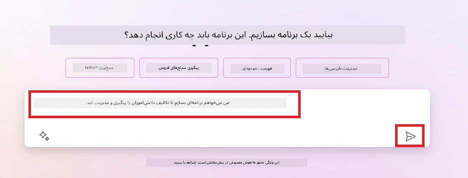  

1. هوش مصنوعی Copilot یک جدول Dataverse با فیلدهای لازم برای ذخیره داده‌هایی که می‌خواهید پیگیری کنید و برخی داده‌های نمونه پیشنهاد خواهد داد. سپس می‌توانید جدول را با استفاده از ویژگی دستیار هوش مصنوعی Copilot در قالب مراحل مکالمه‌ای برای پاسخگویی به نیازهای خود سفارشی کنید.  

   > **مهم**: Dataverse زیرساخت داده‌ای Power Platform است. این یک پلتفرم داده با کد پایین برای ذخیره داده‌های اپلیکیشن است. این یک سرویس کاملاً مدیریت‌شده است که داده‌ها را به‌صورت امن در ابر مایکروسافت ذخیره می‌کند و در محیط Power Platform شما تامین می‌شود. این سرویس دارای قابلیت‌های پیشرفته حاکمیت داده، مانند طبقه‌بندی داده‌ها، ردیابی داده، کنترل دسترسی دقیق و موارد دیگر است. می‌توانید درباره Dataverse [اینجا](https://docs.microsoft.com/powerapps/maker/data-platform/data-platform-intro?WT.mc_id=academic-109639-somelezediko) بیشتر بیاموزید.  

   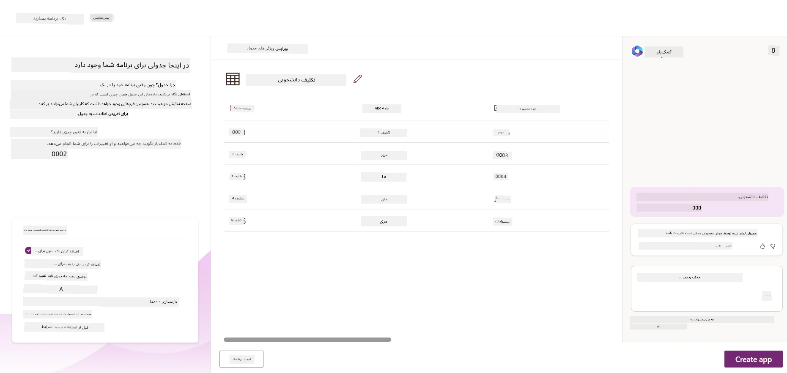  

1. مربیان می‌خواهند به دانشجویانی که تکالیف خود را ارسال کرده‌اند ایمیل بفرستند تا آن‌ها را از پیشرفت تکالیفشان مطلع کنند. شما می‌توانید از Copilot برای افزودن یک فیلد جدید به جدول برای ذخیره ایمیل دانشجو استفاده کنید. برای مثال، می‌توانید از پرسش زیر برای اضافه کردن یک ستون به جدول استفاده کنید: **_می‌خواهم ستونی برای ذخیره ایمیل دانشجو اضافه کنم_**. برای ارسال درخواست به هوش مصنوعی Copilot روی دکمه **ارسال** کلیک کنید.  

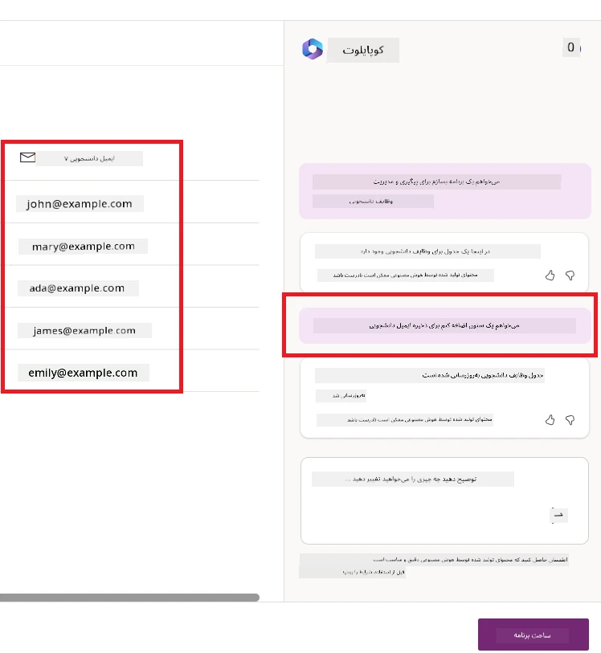  

1. هوش مصنوعی Copilot یک فیلد جدید ایجاد می‌کند و سپس می‌توانید آن را برای نیازهای خود سفارشی کنید.  

1. پس از اتمام جدول، روی دکمه **Create app** کلیک کنید تا برنامه ایجاد شود.

1. AI Copilot یک برنامه Canvas پاسخ‌گو بر اساس توضیحات شما ایجاد خواهد کرد. سپس می‌توانید برنامه را مطابق نیازهای خود سفارشی کنید.

1. برای معلمان که بخواهند به دانش‌آموزان ایمیل بفرستند، می‌توانید از Copilot برای افزودن یک صفحه جدید به برنامه استفاده کنید. برای مثال، می‌توانید از درخواست زیر استفاده کنید تا صفحه جدیدی به برنامه اضافه شود: **_می‌خواهم صفحه‌ای برای ارسال ایمیل به دانش‌آموزان اضافه کنم_**. سپس روی دکمه **Send** کلیک کنید تا درخواست به AI Copilot ارسال شود.

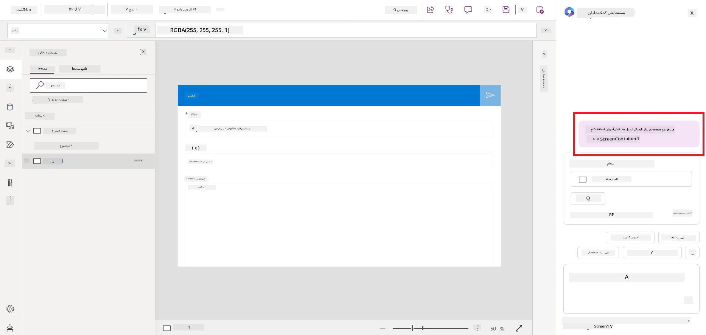

1. AI Copilot یک صفحه جدید ایجاد خواهد کرد و سپس می‌توانید آن صفحه را مطابق نیازهای خود سفارشی کنید.

1. پس از اتمام کار با برنامه، روی دکمه **Save** کلیک کنید تا برنامه ذخیره شود.

1. برای به اشتراک گذاشتن برنامه با معلمان، روی دکمه **Share** کلیک کنید و سپس دوباره روی دکمه **Share** کلیک کنید. سپس می‌توانید برنامه را با وارد کردن آدرس ایمیل معلمان به اشتراک بگذارید.

> **وظیفه شما**: برنامه‌ای که همین الان ساختید شروع خوبی است اما می‌توان آن را بهبود داد. با ویژگی ایمیل، معلمان باید به صورت دستی آدرس ایمیل دانش‌آموزان را وارد کنند تا ایمیل بفرستند. آیا می‌توانید از Copilot استفاده کنید تا خودکاری بسازید که به معلمان امکان دهد وقتی دانش‌آموزان تکالیفشان را ارسال می‌کنند، به صورت خودکار ایمیل ارسال کنند؟ راهنمایی شما این است که با درخواست درست می‌توانید از Copilot در Power Automate برای ساخت این خودکارسازی استفاده کنید.

### ساخت یک جدول اطلاعات فاکتورها برای استارتاپ ما

تیم مالی استارتاپمان برای پیگیری فاکتورها دچار مشکل شده است. آنها از یک صفحه گسترده برای پیگیری فاکتورها استفاده می‌کردند، اما با افزایش تعداد فاکتورها مدیریت آن دشوار شده است. از شما خواسته‌اند جدولی بسازید که به آنها کمک کند اطلاعات فاکتورهای دریافت شده را ذخیره، پیگیری و مدیریت کنند. این جدول باید برای ساخت خودکارسازی‌ای استفاده شود که تمام اطلاعات فاکتورها را استخراج کرده و در جدول ذخیره کند. همچنین باید به تیم مالی امکان دهد فاکتورهای پرداخت شده و نشده را مشاهده کنند.

پلتفرم Power Platform دارای بستر داده‌ای است به نام Dataverse که به شما امکان ذخیره داده‌های برنامه‌ها و راه‌حل‌های شما را می‌دهد. Dataverse یک پلتفرم داده کم‌کد برای ذخیره داده‌های برنامه است. این یک سرویس کاملاً مدیریت‌شده است که داده‌ها را به صورت ایمن در فضای ابری مایکروسافت ذخیره می‌کند و در محیط Power Platform شما فراهم شده است. این پلتفرم دارای قابلیت‌های حاکمیت داده مانند طبقه‌بندی داده، سابقه داده، کنترل دسترسی دقیق و موارد دیگر است. شما می‌توانید بیشتر راجع به [Dataverse اینجا](https://docs.microsoft.com/powerapps/maker/data-platform/data-platform-intro?WT.mc_id=academic-109639-somelezediko) یاد بگیرید.

چرا باید از Dataverse برای استارتاپ خود استفاده کنیم؟ جداول استاندارد و سفارشی در Dataverse گزینه ذخیره‌سازی امن و مبتنی بر ابر را برای داده‌های شما فراهم می‌سازند. جداول به شما اجازه می‌دهند انواع مختلف داده‌ها را ذخیره کنید، درست مانند استفاده از چند برگه کاری در یک کاربرگ Excel. می‌توانید جداول را برای ذخیره داده‌هایی که ویژه نیازهای سازمان یا کسب‌وکار شما هستند استفاده کنید. برخی از مزایایی که استارتاپ ما با استفاده از Dataverse خواهد داشت شامل موارد زیر است اما محدود به این‌ها نیست:

- **مدیریت آسان**: هم متاداده و هم داده‌ها در ابر ذخیره می‌شوند، پس نیازی نیست نگران جزئیات ذخیره و مدیریت آنها باشید. می‌توانید روی ساخت برنامه‌ها و راه‌حل‌های خود تمرکز کنید.

- **امن**: Dataverse گزینه ذخیره‌سازی امن و ابری برای داده‌های شما فراهم می‌کند. شما می‌توانید کنترل کنید چه کسی به داده‌های جداول شما و چگونه دسترسی دارد، با استفاده از امنیت مبتنی بر نقش.

- **متاداده غنی**: انواع داده‌ها و روابط به طور مستقیم در Power Apps استفاده می‌شوند.

- **منطق و اعتبارسنجی**: می‌توانید از قوانین کسب‌وکار، فیلدهای محاسباتی و قوانین اعتبارسنجی برای اعمال منطق کسب‌وکار و حفظ دقت داده‌ها استفاده کنید.

حال که می‌دانید Dataverse چیست و چرا باید از آن استفاده کنیم، بیایید ببینیم چگونه می‌توانید از Copilot برای ایجاد یک جدول در Dataverse که نیازهای تیم مالی ما را برآورده کند استفاده کنید.

> **توجه**: شما از این جدول در بخش بعدی برای ساخت خودکارسازی که تمام اطلاعات فاکتورها را استخراج کرده و در جدول ذخیره می‌کند استفاده خواهید کرد.

برای ایجاد جدول در Dataverse با استفاده از Copilot، مراحل زیر را دنبال کنید:

1. به صفحه اصلی [Power Apps](https://make.powerapps.com?WT.mc_id=academic-105485-koreyst) بروید.

2. در نوار ناوبری سمت چپ، روی **Tables** کلیک کنید و سپس روی **Describe the new Table** کلیک کنید.

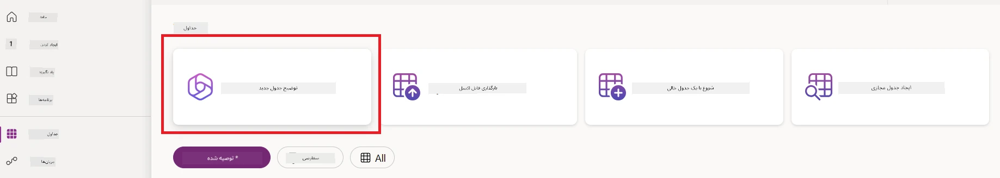

1. در صفحه **Describe the new Table**، از بخش متن برای توصیف جدولی که می‌خواهید ایجاد کنید استفاده کنید. برای مثال، **_می‌خواهم جدولی برای ذخیره اطلاعات فاکتور ایجاد کنم_**. روی دکمه **Send** کلیک کنید تا درخواست به AI Copilot ارسال شود.

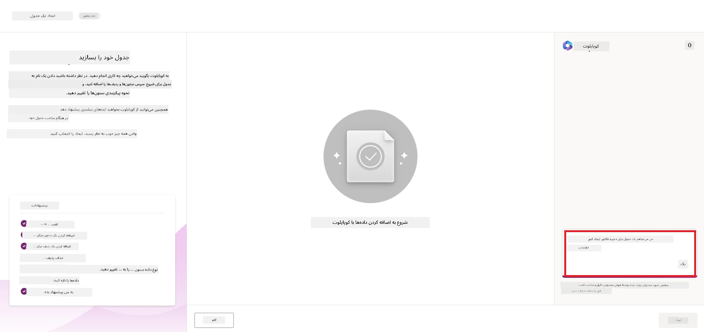

1. AI Copilot جدول Dataverse پیشنهادی همراه با فیلدهای مورد نیاز برای ذخیره داده‌های مورد پیگیری و بعضی نمونه داده‌ها را ارائه خواهد کرد. سپس می‌توانید جدول را با استفاده از ویژگی دستیار AI Copilot در قالب مراحل گفتگو برای نیازهای خود سفارشی کنید.

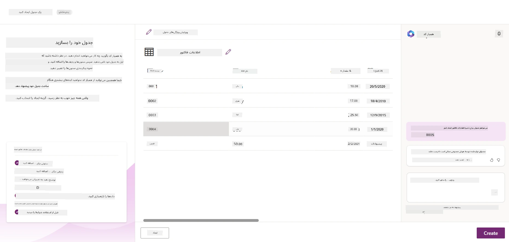

1. تیم مالی می‌خواهد ایمیلی به تأمین‌کننده برای اطلاع‌رسانی وضعیت فعلی فاکتور بفرستد. می‌توانید از Copilot استفاده کنید تا یک فیلد جدید به جدول اضافه کنید برای ذخیره ایمیل تأمین‌کننده. برای مثال، از درخواست زیر برای اضافه کردن یک ستون به جدول استفاده کنید: **_می‌خواهم ستونی برای ذخیره ایمیل تأمین‌کننده اضافه کنم_**. روی دکمه **Send** کلیک کنید تا درخواست به AI Copilot ارسال شود.

1. AI Copilot یک فیلد جدید ایجاد خواهد کرد و سپس می‌توانید آن فیلد را مطابق نیازهای خود سفارشی کنید.

1. پس از اتمام کار با جدول، روی دکمه **Create** کلیک کنید تا جدول ایجاد شود.

## مدل‌های هوش مصنوعی در Power Platform با AI Builder

AI Builder یک قابلیت هوش مصنوعی کم‌کد در Power Platform است که به شما امکان می‌دهد از مدل‌های هوش مصنوعی برای خودکارسازی فرآیندها و پیش‌بینی نتایج استفاده کنید. با AI Builder می‌توانید هوش مصنوعی را به برنامه‌ها و جریان‌های کاری خود که به داده‌های Dataverse یا منابع داده ابری مختلف مانند SharePoint، OneDrive یا Azure متصل هستند بیاورید.

## مدل‌های هوش مصنوعی آماده در مقابل مدل‌های سفارشی

AI Builder دو نوع مدل هوش مصنوعی ارائه می‌دهد: مدل‌های آماده و مدل‌های سفارشی. مدل‌های آماده مدل‌های هوش مصنوعی آماده استفاده هستند که توسط مایکروسافت آموزش دیده‌اند و در Power Platform در دسترس هستند. این مدل‌ها به شما کمک می‌کنند بدون نیاز به جمع‌آوری داده و ساخت، آموزش و انتشار مدل‌های خود، به برنامه‌ها و جریان‌های کاری خود هوشمندی اضافه کنید. می‌توانید از این مدل‌ها برای خودکارسازی فرآیندها و پیش‌بینی نتایج استفاده کنید.

برخی از مدل‌های آماده در Power Platform عبارتند از:

- **استخراج عبارات کلیدی**: این مدل عبارات کلیدی متن را استخراج می‌کند.
- **تشخیص زبان**: این مدل زبان یک متن را تشخیص می‌دهد.
- **تحلیل احساسات**: این مدل احساس مثبت، منفی، خنثی یا ترکیبی در متن را تشخیص می‌دهد.
- **خواندن کارت ویزیت**: این مدل اطلاعات کارت‌های ویزیت را استخراج می‌کند.
- **تشخیص متن**: این مدل متن را از تصاویر استخراج می‌کند.
- **شناسایی اشیا**: این مدل اشیا را از تصاویر شناسایی و استخراج می‌کند.
- **پردازش اسناد**: این مدل اطلاعات فرم‌ها را استخراج می‌کند.
- **پردازش فاکتورها**: این مدل اطلاعات فاکتورها را استخراج می‌کند.

با مدل‌های هوش مصنوعی سفارشی می‌توانید مدل خود را به AI Builder بیاورید تا مانند هر مدل سفارشی AI Builder عمل کند، و به شما امکان آموزش مدل با داده‌های خودتان را می‌دهد. می‌توانید از این مدل‌ها برای خودکارسازی فرآیندها و پیش‌بینی نتایج در هر دو Power Apps و Power Automate استفاده کنید. هنگام استفاده از مدل خود، محدودیت‌هایی وجود دارد. درباره این [محدودیت‌ها](https://learn.microsoft.com/ai-builder/byo-model#limitations?WT.mc_id=academic-105485-koreyst) بیشتر بخوانید.

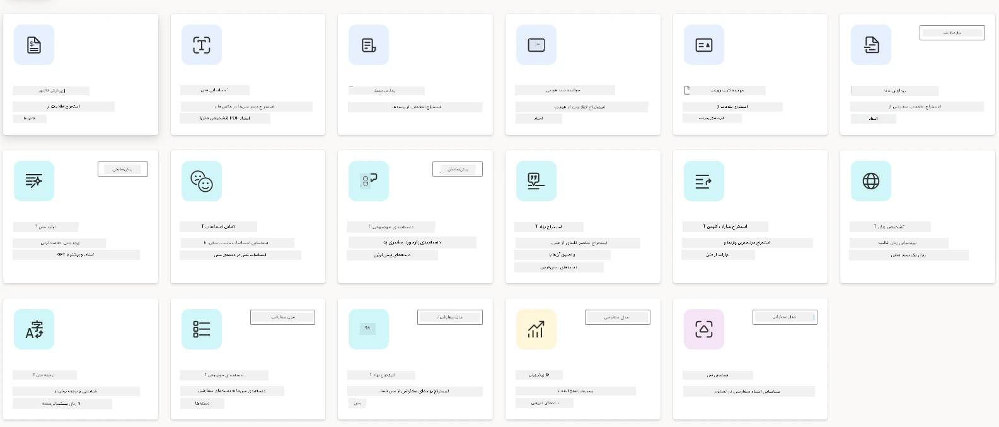

## تمرین شماره 2 - ساخت جریان پردازش فاکتور برای استارتاپ ما

تیم مالی در پردازش فاکتورها دچار مشکل شده است. آنها از صفحه گسترده برای پیگیری فاکتورها استفاده می‌کردند اما با افزایش تعداد فاکتورها مدیریت آن دشوار شده است. از شما خواسته‌اند کاری کنید که با استفاده از هوش مصنوعی فرآیند پردازش فاکتورها راحت‌تر شود. این جریان کاری باید به آنها امکان استخراج اطلاعات از فاکتورها و ذخیره آنها در جدول Dataverse را بدهد. همچنین باید امکان ارسال ایمیل به تیم مالی با اطلاعات استخراج شده فراهم شود.

حال که می‌دانید AI Builder چیست و چرا باید از آن استفاده کنید، بیایید ببینیم چگونه می‌توانید از مدل هوش مصنوعی پردازش فاکتور در AI Builder که قبلاً یاد گرفتید، برای ساخت جریان کاری که به تیم مالی در پردازش فاکتورها کمک کند استفاده کنید.

برای ساخت جریان کاری که به تیم مالی در پردازش فاکتورها با استفاده از مدل پردازش فاکتور در AI Builder کمک کند، مراحل زیر را دنبال کنید:

1. به صفحه اصلی [Power Automate](https://make.powerautomate.com?WT.mc_id=academic-105485-koreyst) بروید.

2. از بخش متن روی صفحه اصلی برای توصیف جریان کاری که می‌خواهید بسازید استفاده کنید. برای مثال، **_پردازش یک فاکتور زمانی که به صندوق ورودی ایمیلم می‌رسد_**. روی دکمه **Send** کلیک کنید تا درخواست به AI Copilot ارسال شود.

   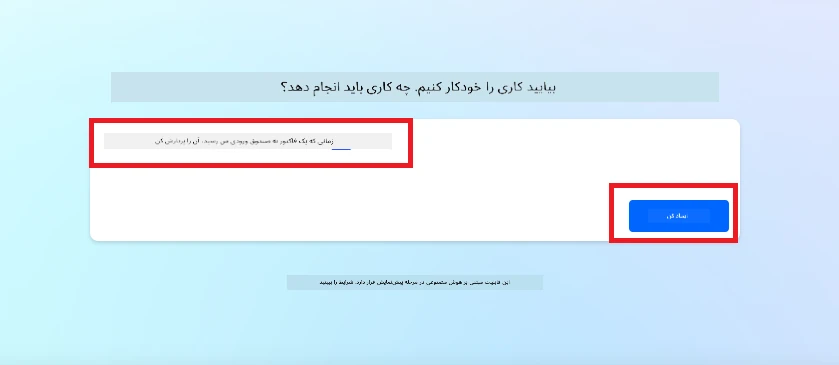

3. AI Copilot اقداماتی که برای انجام وظیفه‌ای که می‌خواهید خودکار شود لازم است را پیشنهاد می‌دهد. می‌توانید روی دکمه **Next** کلیک کنید تا مراحل بعدی را طی کنید.

4. در مرحله بعد، Power Automate از شما می‌خواهد اتصالات مورد نیاز برای جریان را تنظیم کنید. پس از اتمام، روی دکمه **Create flow** کلیک کنید تا جریان ایجاد شود.

5. AI Copilot یک جریان ایجاد می‌کند و سپس می‌توانید آن را مطابق نیازهای خود سفارشی کنید.

6. محرک جریان را بروزرسانی کنید و **Folder** را به پوشه‌ای که فاکتورها در آن ذخیره خواهند شد تنظیم کنید. مثلاً می‌توانید پوشه را **Inbox** تنظیم کنید. روی **Show advanced options** کلیک کنید و **Only with Attachments** را روی **Yes** تنظیم کنید. این اطمینان می‌دهد که جریان فقط زمانی اجرا شود که ایمیل با پیوست در پوشه دریافت می‌شود.

7. اقدامات زیر را از جریان حذف کنید: **HTML to text**، **Compose**، **Compose 2**، **Compose 3** و **Compose 4** چون از آنها استفاده نخواهید کرد.

8. اقدام **Condition** را از جریان حذف کنید چون استفاده نخواهید کرد. باید شبیه به تصویر زیر باشد:

   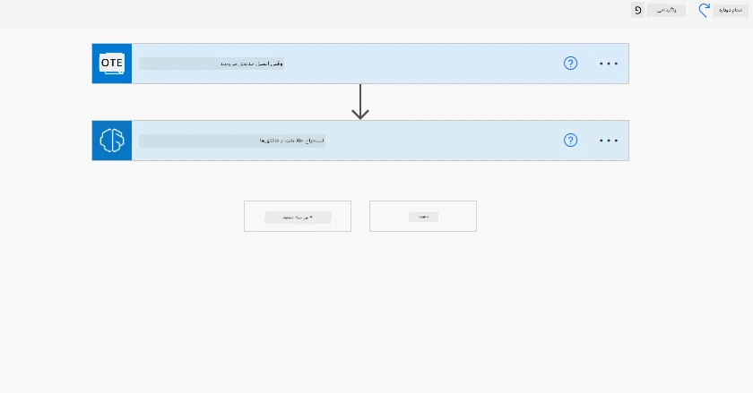

9. روی دکمه **Add an action** کلیک کنید و دنبال **Dataverse** بگردید. اقدام **Add a new row** را انتخاب کنید.

10. در اقدام **Extract Information from invoices**، **Invoice File** را به محتوای پیوست ایمیل اشاره دهید. این تضمین می‌کند که جریان اطلاعات را از پیوست فاکتور استخراج کند.

11. جدولی که قبلاً ایجاد کرده‌اید را انتخاب کنید. برای مثال، جدول **Invoice Information** را انتخاب کنید. محتوای دینامیک اقدام قبلی را برای پر کردن فیلدهای زیر استفاده کنید:

    - شناسه (ID)
    - مبلغ (Amount)
    - تاریخ (Date)
    - نام (Name)
    - وضعیت - **Status** را روی **Pending** تنظیم کنید.
    - ایمیل تأمین‌کننده - از محتوای دینامیک **From** محرک **When a new email arrives** استفاده کنید.

    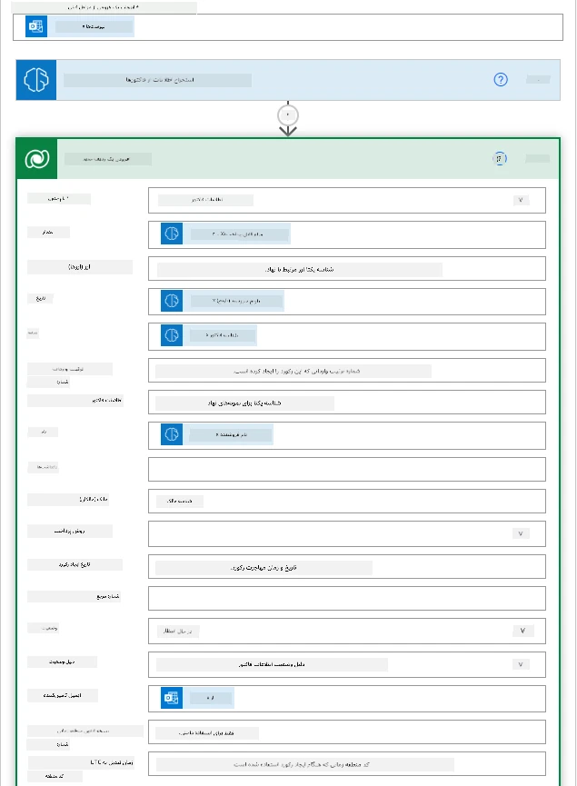

12. پس از اتمام جریان، روی دکمه **Save** کلیک کنید تا جریان ذخیره شود. سپس می‌توانید جریان را با ارسال ایمیلی با فاکتور به پوشه مشخص شده در محرک آزمایش کنید.

> **وظیفه شما**: جریانی که همین الان ساختید شروع خوبی است، حالا باید فکر کنید چطور می‌توانید خودکارسازی‌ای بسازید که به تیم مالی ما امکان دهد ایمیلی به تأمین‌کننده ارسال کنند تا آنها را از وضعیت فعلی فاکتورشان مطلع کنند. راهنمایی شما: جریان باید زمانی اجرا شود که وضعیت فاکتور تغییر کند.

## استفاده از مدل هوش مصنوعی تولید متن در Power Automate

مدل AI Builder به نام Create Text with GPT به شما امکان ایجاد متن بر اساس یک درخواست را می‌دهد و توسط سرویس Microsoft Azure OpenAI پشتیبانی می‌شود. با این قابلیت می‌توانید فناوری GPT (Generative Pre-Trained Transformer) را در برنامه‌ها و جریان‌های کاری خود وارد کنید تا انواع جریان‌های خودکار و برنامه‌های مفید بسازید.

مدل‌های GPT آموزش‌های گسترده‌ای روی داده‌های بسیار زیادی دیده‌اند که به آنها امکان تولید متنی نزدیک به زبان انسان را می‌دهد وقتی درخواست دریافت می‌کنند. وقتی این مدل‌ها با اتوماسیون جریان کاری ترکیب شوند، می‌توانند برای ساده‌سازی و خودکارسازی طیف گسترده‌ای از وظایف به کار روند.

برای مثال، می‌توانید جریان‌هایی بسازید که به طور خودکار متن برای موارد مختلفی مانند پیش‌نویس ایمیل‌ها، توضیحات محصول و غیره تولید کنند. همچنین می‌توانید از این مدل برای تولید متن در انواع برنامه‌ها مانند چت‌بات‌ها و برنامه‌های خدمات مشتری استفاده کنید تا نمایندگان خدمات مشتری بتوانند مؤثر و کارآمد به پرسش‌های مشتری پاسخ دهند.

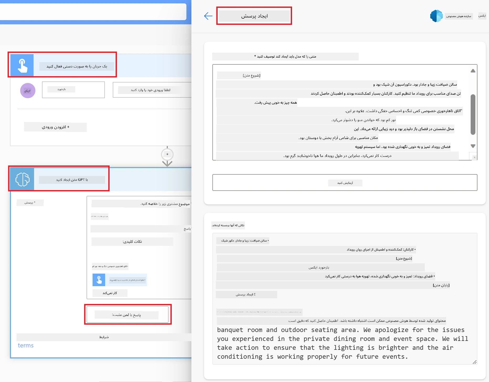

برای یادگیری نحوه استفاده از این مدل هوش مصنوعی در Power Automate، به ماژول [افزودن هوش با AI Builder و GPT](https://learn.microsoft.com/training/modules/ai-builder-text-generation/?WT.mc_id=academic-109639-somelezediko) مراجعه کنید.

## کار عالی! یادگیری خود را ادامه دهید

پس از اتمام این درس، مجموعه [یادگیری هوش مصنوعی مولد](https://aka.ms/genai-collection?WT.mc_id=academic-105485-koreyst) ما را بررسی کنید تا دانش خود در زمینه هوش مصنوعی مولد را ارتقاء دهید!

می‌خواهید Copilot را شخصی‌سازی کنید و بیشتر بهره ببرید؟ مجموعه [Awesome Copilot](https://github.com/github/awesome-copilot?WT.mc_id=academic-105485-koreyst) را کاوش کنید — یک مجموعه مشارکتی از دستورالعمل‌ها، عوامل، مهارت‌ها و تنظیمات که به شما کمک می‌کند بیشترین بهره را از GitHub Copilot ببرید.

به درس ۱۱ مراجعه کنید، جایی که به نحوه [ادغام هوش مصنوعی مولد با فراخوانی توابع](../11-integrating-with-function-calling/README.md?WT.mc_id=academic-105485-koreyst) می‌پردازیم!

---

<!-- CO-OP TRANSLATOR DISCLAIMER START -->
**سلب مسئولیت**:
این سند با استفاده از سرویس ترجمه هوش مصنوعی [Co-op Translator](https://github.com/Azure/co-op-translator) ترجمه شده است. در حالی که ما در تلاش برای دقت هستیم، لطفاً توجه داشته باشید که ترجمه‌های خودکار ممکن است شامل خطاها یا نادرستی‌هایی باشند. سند اصلی به زبان مادری خود باید به عنوان منبع معتبر در نظر گرفته شود. برای اطلاعات حیاتی، ترجمه حرفه‌ای انسانی توصیه می‌شود. ما در قبال هرگونه سوء تفاهم یا برداشت نادرست ناشی از استفاده از این ترجمه مسئولیتی نداریم.
<!-- CO-OP TRANSLATOR DISCLAIMER END -->