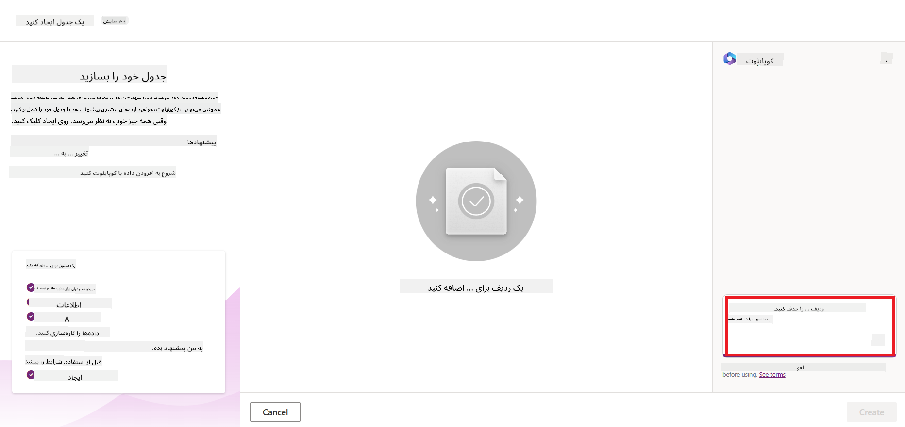
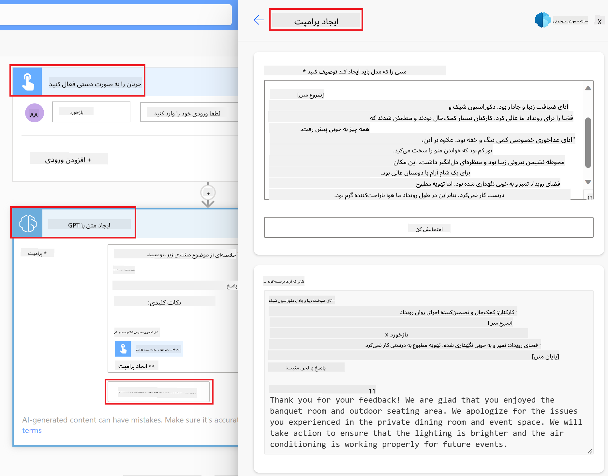

<!--
CO_OP_TRANSLATOR_METADATA:
{
  "original_hash": "846ac8e3b7dcfb697d3309fec05f0fea",
  "translation_date": "2025-10-17T23:11:20+00:00",
  "source_file": "10-building-low-code-ai-applications/README.md",
  "language_code": "fa"
}
-->
# ساخت برنامه‌های هوش مصنوعی با کدنویسی کم

> _(برای مشاهده ویدئوی این درس روی تصویر بالا کلیک کنید)_

## مقدمه

حالا که یاد گرفتیم چگونه برنامه‌های تولید تصویر بسازیم، بیایید درباره کدنویسی کم صحبت کنیم. هوش مصنوعی تولیدی می‌تواند در زمینه‌های مختلفی از جمله کدنویسی کم استفاده شود، اما کدنویسی کم چیست و چگونه می‌توانیم هوش مصنوعی را به آن اضافه کنیم؟

ساخت برنامه‌ها و راه‌حل‌ها برای توسعه‌دهندگان سنتی و غیرتوسعه‌دهندگان از طریق استفاده از پلتفرم‌های توسعه کدنویسی کم آسان‌تر شده است. پلتفرم‌های توسعه کدنویسی کم به شما امکان می‌دهند برنامه‌ها و راه‌حل‌هایی را با کمترین یا بدون کدنویسی بسازید. این امر با ارائه یک محیط توسعه بصری که به شما امکان می‌دهد اجزا را برای ساخت برنامه‌ها و راه‌حل‌ها بکشید و رها کنید، محقق می‌شود. این امکان را فراهم می‌کند که برنامه‌ها و راه‌حل‌ها سریع‌تر و با منابع کمتر ساخته شوند. در این درس، به طور عمیق بررسی می‌کنیم که چگونه از کدنویسی کم استفاده کنیم و چگونه توسعه کدنویسی کم را با هوش مصنوعی از طریق Power Platform بهبود دهیم.

Power Platform به سازمان‌ها این فرصت را می‌دهد که تیم‌های خود را توانمند کنند تا راه‌حل‌های خود را از طریق یک محیط بصری کدنویسی کم یا بدون کدنویسی بسازند. این محیط فرآیند ساخت راه‌حل‌ها را ساده‌تر می‌کند. با Power Platform، راه‌حل‌ها می‌توانند در عرض چند روز یا هفته ساخته شوند، به جای ماه‌ها یا سال‌ها. Power Platform شامل پنج محصول کلیدی است: Power Apps، Power Automate، Power BI، Power Pages و Copilot Studio.

این درس شامل موارد زیر است:

- معرفی هوش مصنوعی تولیدی در Power Platform  
- معرفی Copilot و نحوه استفاده از آن  
- استفاده از هوش مصنوعی تولیدی برای ساخت برنامه‌ها و جریان‌ها در Power Platform  
- درک مدل‌های هوش مصنوعی در Power Platform با AI Builder  

## اهداف یادگیری

تا پایان این درس، شما قادر خواهید بود:

- نحوه عملکرد Copilot در Power Platform را درک کنید.

- یک برنامه ردیاب تکالیف دانش‌آموزی برای استارتاپ آموزشی ما بسازید.

- یک جریان پردازش فاکتور بسازید که از هوش مصنوعی برای استخراج اطلاعات از فاکتورها استفاده کند.

- بهترین روش‌ها را هنگام استفاده از مدل هوش مصنوعی Create Text with GPT اعمال کنید.

ابزارها و فناوری‌هایی که در این درس استفاده خواهید کرد عبارتند از:

- **Power Apps**، برای برنامه ردیاب تکالیف دانش‌آموزی که یک محیط توسعه کدنویسی کم برای ساخت برنامه‌ها جهت ردیابی، مدیریت و تعامل با داده‌ها فراهم می‌کند.

- **Dataverse**، برای ذخیره داده‌های برنامه ردیاب تکالیف دانش‌آموزی که یک پلتفرم داده کدنویسی کم برای ذخیره داده‌های برنامه فراهم می‌کند.

- **Power Automate**، برای جریان پردازش فاکتور که یک محیط توسعه کدنویسی کم برای ساخت جریان‌های کاری جهت خودکارسازی فرآیند پردازش فاکتور فراهم می‌کند.

- **AI Builder**، برای مدل هوش مصنوعی پردازش فاکتور که از مدل‌های هوش مصنوعی پیش‌ساخته برای پردازش فاکتورها برای استارتاپ ما استفاده می‌کند.

## هوش مصنوعی تولیدی در Power Platform

بهبود توسعه و کاربرد کدنویسی کم با هوش مصنوعی تولیدی یکی از حوزه‌های کلیدی تمرکز Power Platform است. هدف این است که همه بتوانند برنامه‌ها، سایت‌ها، داشبوردها و فرآیندهای خودکارسازی شده با هوش مصنوعی را بسازند، _بدون نیاز به تخصص در علم داده_. این هدف با ادغام هوش مصنوعی تولیدی در تجربه توسعه کدنویسی کم در Power Platform به صورت Copilot و AI Builder محقق می‌شود.

### این چگونه کار می‌کند؟

Copilot یک دستیار هوش مصنوعی است که به شما امکان می‌دهد راه‌حل‌های Power Platform را با توصیف نیازهای خود در یک سری مراحل مکالمه‌ای با استفاده از زبان طبیعی بسازید. به عنوان مثال، می‌توانید به دستیار هوش مصنوعی خود دستور دهید که چه فیلدهایی در برنامه شما استفاده شود و آن برنامه و مدل داده زیرین را ایجاد کند یا نحوه تنظیم یک جریان در Power Automate را مشخص کنید.

می‌توانید از قابلیت‌های مبتنی بر Copilot به عنوان یک ویژگی در صفحه‌های برنامه خود استفاده کنید تا کاربران بتوانند از طریق تعاملات مکالمه‌ای به بینش‌ها دست یابند.

AI Builder یک قابلیت هوش مصنوعی کدنویسی کم در Power Platform است که به شما امکان می‌دهد از مدل‌های هوش مصنوعی برای کمک به خودکارسازی فرآیندها و پیش‌بینی نتایج استفاده کنید. با AI Builder می‌توانید هوش مصنوعی را به برنامه‌ها و جریان‌هایی که به داده‌های شما در Dataverse یا منابع داده ابری مختلف مانند SharePoint، OneDrive یا Azure متصل هستند، بیاورید.

Copilot در تمام محصولات Power Platform در دسترس است: Power Apps، Power Automate، Power BI، Power Pages و Power Virtual Agents. AI Builder در Power Apps و Power Automate در دسترس است. در این درس، ما بر نحوه استفاده از Copilot و AI Builder در Power Apps و Power Automate برای ساخت یک راه‌حل برای استارتاپ آموزشی خود تمرکز خواهیم کرد.

### Copilot در Power Apps

به عنوان بخشی از Power Platform، Power Apps یک محیط توسعه کدنویسی کم برای ساخت برنامه‌ها جهت ردیابی، مدیریت و تعامل با داده‌ها فراهم می‌کند. این یک مجموعه خدمات توسعه برنامه با یک پلتفرم داده مقیاس‌پذیر و قابلیت اتصال به خدمات ابری و داده‌های محلی است. Power Apps به شما امکان می‌دهد برنامه‌هایی بسازید که در مرورگرها، تبلت‌ها و تلفن‌ها اجرا شوند و بتوانند با همکاران به اشتراک گذاشته شوند. Power Apps کاربران را با یک رابط ساده به توسعه برنامه‌ها هدایت می‌کند، به طوری که هر کاربر تجاری یا توسعه‌دهنده حرفه‌ای بتواند برنامه‌های سفارشی بسازد. تجربه توسعه برنامه نیز با هوش مصنوعی تولیدی از طریق Copilot بهبود یافته است.

ویژگی دستیار هوش مصنوعی Copilot در Power Apps به شما امکان می‌دهد توصیف کنید که چه نوع برنامه‌ای نیاز دارید و چه اطلاعاتی می‌خواهید برنامه شما ردیابی، جمع‌آوری یا نمایش دهد. سپس Copilot یک برنامه Canvas واکنش‌گرا بر اساس توضیحات شما ایجاد می‌کند. سپس می‌توانید برنامه را برای برآورده کردن نیازهای خود سفارشی کنید. Copilot همچنین یک جدول Dataverse با فیلدهایی که برای ذخیره داده‌هایی که می‌خواهید ردیابی کنید و برخی داده‌های نمونه نیاز دارید، ایجاد و پیشنهاد می‌دهد. ما در ادامه این درس بررسی خواهیم کرد که Dataverse چیست و چگونه می‌توانید از آن در Power Apps استفاده کنید. سپس می‌توانید جدول را با استفاده از ویژگی دستیار Copilot از طریق مراحل مکالمه‌ای سفارشی کنید. این ویژگی به راحتی از صفحه اصلی Power Apps در دسترس است.

### Copilot در Power Automate

به عنوان بخشی از Power Platform، Power Automate به کاربران امکان می‌دهد جریان‌های کاری خودکار بین برنامه‌ها و خدمات ایجاد کنند. این ابزار به خودکارسازی فرآیندهای تکراری کسب‌وکار مانند ارتباطات، جمع‌آوری داده‌ها و تأییدیه‌های تصمیم‌گیری کمک می‌کند. رابط ساده آن به کاربران با هر سطح مهارت فنی (از مبتدی تا توسعه‌دهندگان حرفه‌ای) امکان می‌دهد وظایف کاری را خودکار کنند. تجربه توسعه جریان‌های کاری نیز با هوش مصنوعی تولیدی از طریق Copilot بهبود یافته است.

ویژگی دستیار هوش مصنوعی Copilot در Power Automate به شما امکان می‌دهد توصیف کنید که چه نوع جریانی نیاز دارید و چه اقداماتی می‌خواهید جریان شما انجام دهد. سپس Copilot یک جریان بر اساس توضیحات شما ایجاد می‌کند. سپس می‌توانید جریان را برای برآورده کردن نیازهای خود سفارشی کنید. Copilot همچنین اقداماتی را که برای انجام وظیفه‌ای که می‌خواهید خودکار کنید، نیاز دارید، ایجاد و پیشنهاد می‌دهد. ما در ادامه این درس بررسی خواهیم کرد که جریان‌ها چیستند و چگونه می‌توانید از آن‌ها در Power Automate استفاده کنید. سپس می‌توانید اقدامات را با استفاده از ویژگی دستیار Copilot از طریق مراحل مکالمه‌ای سفارشی کنید. این ویژگی به راحتی از صفحه اصلی Power Automate در دسترس است.

## تکلیف: مدیریت تکالیف دانش‌آموزی و فاکتورها برای استارتاپ ما با استفاده از Copilot

استارتاپ ما دوره‌های آنلاین به دانش‌آموزان ارائه می‌دهد. این استارتاپ به سرعت رشد کرده و اکنون در تلاش است تا با تقاضای زیاد برای دوره‌های خود هماهنگ شود. استارتاپ شما را به عنوان یک توسعه‌دهنده Power Platform استخدام کرده است تا به آن‌ها کمک کنید یک راه‌حل کدنویسی کم بسازید که به مدیریت تکالیف دانش‌آموزی و فاکتورها کمک کند. این راه‌حل باید بتواند به آن‌ها کمک کند تا تکالیف دانش‌آموزی را از طریق یک برنامه ردیابی و مدیریت کنند و فرآیند پردازش فاکتور را از طریق یک جریان کاری خودکار کنند. از شما خواسته شده است که از هوش مصنوعی تولیدی برای توسعه این راه‌حل استفاده کنید.

هنگام شروع کار با Copilot، می‌توانید از [کتابخانه دستورات Copilot در Power Platform](https://github.com/pnp/powerplatform-prompts?WT.mc_id=academic-109639-somelezediko) برای شروع استفاده کنید. این کتابخانه شامل لیستی از دستورات است که می‌توانید برای ساخت برنامه‌ها و جریان‌ها با Copilot استفاده کنید. همچنین می‌توانید از دستورات موجود در کتابخانه برای ایده‌گیری در مورد نحوه توصیف نیازهای خود به Copilot استفاده کنید.

### ساخت برنامه ردیاب تکالیف دانش‌آموزی برای استارتاپ ما

آموزگاران استارتاپ ما در ردیابی تکالیف دانش‌آموزان دچار مشکل شده‌اند. آن‌ها از یک صفحه گسترده برای ردیابی تکالیف استفاده می‌کردند، اما با افزایش تعداد دانش‌آموزان، مدیریت این کار دشوار شده است. آن‌ها از شما خواسته‌اند که یک برنامه بسازید که به آن‌ها در ردیابی و مدیریت تکالیف دانش‌آموزان کمک کند. این برنامه باید به آن‌ها امکان دهد تکالیف جدید اضافه کنند، تکالیف را مشاهده کنند، تکالیف را به‌روزرسانی کنند و تکالیف را حذف کنند. همچنین باید به آموزگاران و دانش‌آموزان امکان دهد تکالیفی که نمره‌گذاری شده‌اند و آن‌هایی که هنوز نمره‌گذاری نشده‌اند را مشاهده کنند.

شما این برنامه را با استفاده از Copilot در Power Apps و با دنبال کردن مراحل زیر خواهید ساخت:

1. به صفحه اصلی [Power Apps](https://make.powerapps.com?WT.mc_id=academic-105485-koreyst) بروید.

1. از قسمت متن در صفحه اصلی برای توصیف برنامه‌ای که می‌خواهید بسازید استفاده کنید. برای مثال، **_می‌خواهم یک برنامه برای ردیابی و مدیریت تکالیف دانش‌آموزی بسازم_**. روی دکمه **ارسال** کلیک کنید تا دستور به Copilot ارسال شود.

1. Copilot یک جدول Dataverse با فیلدهایی که برای ذخیره داده‌هایی که می‌خواهید ردیابی کنید و برخی داده‌های نمونه نیاز دارید، پیشنهاد می‌دهد. سپس می‌توانید جدول را با استفاده از ویژگی دستیار Copilot از طریق مراحل مکالمه‌ای سفارشی کنید.

   > **مهم**: Dataverse پلتفرم داده زیرین برای Power Platform است. این یک پلتفرم داده کدنویسی کم برای ذخیره داده‌های برنامه است. این یک سرویس کاملاً مدیریت شده است که داده‌ها را به صورت امن در فضای ابری مایکروسافت ذخیره می‌کند و در محیط Power Platform شما فراهم می‌شود. این پلتفرم دارای قابلیت‌های مدیریت داده داخلی مانند طبقه‌بندی داده‌ها، منشأ داده‌ها، کنترل دسترسی دقیق و موارد دیگر است. می‌توانید اطلاعات بیشتری درباره Dataverse [اینجا](https://docs.microsoft.com/powerapps/maker/data-platform/data-platform-intro?WT.mc_id=academic-109639-somelezediko) بیابید.

   

1. آموزگاران می‌خواهند به دانش‌آموزانی که تکالیف خود را ارسال کرده‌اند ایمیل ارسال کنند تا آن‌ها را از پیشرفت تکالیفشان مطلع کنند. شما می‌توانید از Copilot برای اضافه کردن یک فیلد جدید به جدول برای ذخیره ایمیل دانش‌آموز استفاده کنید. برای مثال، می‌توانید از دستور زیر برای اضافه کردن یک فیلد جدید به جدول استفاده کنید: **_می‌خواهم یک ستون برای ذخیره ایمیل دانش‌آموز اضافه کنم_**. روی دکمه **ارسال** کلیک کنید تا دستور به Copilot ارسال شود.

1. Copilot یک فیلد جدید ایجاد می‌کند و سپس می‌توانید فیلد را برای برآورده کردن نیازهای خود سفارشی کنید.

1. پس از اتمام کار با جدول، روی دکمه **ایجاد برنامه** کلیک کنید تا برنامه ایجاد شود.

1. Copilot یک برنامه Canvas واکنش‌گرا بر اساس توضیحات شما ایجاد می‌کند. سپس می‌توانید برنامه را برای برآورده کردن نیازهای خود سفارشی کنید.

1. برای اینکه آموزگاران بتوانند به دانش‌آموزان ایمیل ارسال کنند، می‌توانید از Copilot برای اضافه کردن یک صفحه جدید به برنامه استفاده کنید. برای مثال، می‌توانید از دستور زیر برای اضافه کردن یک صفحه جدید به برنامه استفاده کنید: **_می‌خواهم یک صفحه برای ارسال ایمیل به دانش‌آموزان اضافه کنم_**. روی دکمه **ارسال** کلیک کنید تا دستور به Copilot ارسال شود.

1. Copilot یک صفحه جدید ایجاد می‌کند و سپس می‌توانید صفحه را برای برآورده کردن نیازهای خود سفارشی کنید.

1. پس از اتمام کار با برنامه، روی دکمه **ذخیره** کلیک کنید تا برنامه ذخیره شود.

1. برای به اشتراک گذاشتن برنامه با آموزگاران، روی دکمه **اشتراک‌گذاری** کلیک کنید و سپس دوباره روی دکمه **اشتراک‌گذاری** کلیک کنید. سپس می‌توانید برنامه را با آموزگاران با وارد کردن آدرس‌های ایمیل آن‌ها به اشتراک بگذارید.

> **تکلیف شما**: برنامه‌ای که ساختید شروع خوبی است اما می‌تواند بهبود یابد. با ویژگی ایمیل، آموزگاران فقط می‌توانند به صورت دستی ایمیل‌ها را به دانش‌آموزان ارسال کنند و باید ایمیل‌ها را تایپ کنند. آیا می‌توانید از Copilot برای ساخت یک خودکارسازی استفاده کنید که به آموزگاران امکان دهد ایمیل‌ها را به صورت خودکار به دانش‌آموزان ارسال کنند وقتی که تکالیف خود را ارسال می‌کنند؟ راهنمایی شما این است که با دستور مناسب می‌توانید از Copilot در Power Automate برای ساخت این کار استفاده کنید.

### ساخت جدول اطلاعات فاکتورها برای استارتاپ ما

تیم مالی استارتاپ ما در ردیابی فاکتورها دچار مشکل شده است. آن‌ها از یک صفحه گسترده برای ردیابی فاکتورها استفاده می‌کردند، اما با افزایش تعداد فاکتورها، مدیریت این کار دشوار شده است. آن‌ها از شما خواسته‌اند که یک جدول بسازید که به آن‌ها در ذخیره، ردیابی و مدیریت اطلاعات فاکتورهایی که دریافت کرده‌اند کمک کند. این جدول باید برای ساخت یک خودکارسازی استفاده شود که تمام اطلاعات فاکتور را استخراج کرده و در جدول ذخیره کند. همچنین باید به تیم مالی امکان دهد فاکتورهایی که پرداخت شده‌اند و آن‌هایی که پرداخت نشده‌اند را مشاهده کنند.

Power Platform دارای یک پلتفرم داده زیرین به نام Dataverse است که به شما امکان می‌دهد داده‌های برنامه‌ها و راه‌حل‌های خود را ذخیره کنید. Dataverse یک پلتفرم داده کدنویسی کم برای ذخیره داده‌های برنامه است. این یک سرویس کاملاً مدیریت شده است که داده‌ها را به صورت امن در فضای ابری مایکروسافت ذخیره می‌کند و در محیط Power Platform شما فراهم می‌شود. این پلتفرم دارای قابلیت‌های مدیریت داده داخلی مانند طبقه‌بندی داده‌ها، منشأ داده‌ها، کنترل دسترسی دقیق و موارد دیگر است. می‌توانید اطلاعات بیشتری [درباره Dataverse اینجا](https://docs.microsoft.com/powerapps/maker/data-platform/data-platform-intro?WT.mc_id=academic-109639-somelezediko) بیابید.
چرا باید از Dataverse برای استارتاپ خود استفاده کنیم؟ جدول‌های استاندارد و سفارشی در Dataverse گزینه‌ای امن و مبتنی بر فضای ابری برای ذخیره‌سازی داده‌های شما فراهم می‌کنند. جدول‌ها به شما امکان می‌دهند انواع مختلف داده‌ها را ذخیره کنید، مشابه استفاده از چندین برگه در یک فایل اکسل. شما می‌توانید از جدول‌ها برای ذخیره داده‌هایی که مختص نیازهای سازمان یا کسب‌وکار شما هستند استفاده کنید. برخی از مزایایی که استارتاپ ما از استفاده از Dataverse بهره‌مند می‌شود شامل موارد زیر است:

- **مدیریت آسان**: هم متاداده و هم داده‌ها در فضای ابری ذخیره می‌شوند، بنابراین نیازی نیست نگران جزئیات نحوه ذخیره‌سازی یا مدیریت آن‌ها باشید. شما می‌توانید بر ساخت اپلیکیشن‌ها و راه‌حل‌های خود تمرکز کنید.

- **امنیت بالا**: Dataverse گزینه‌ای امن و مبتنی بر فضای ابری برای ذخیره‌سازی داده‌های شما فراهم می‌کند. شما می‌توانید کنترل کنید چه کسی به داده‌های موجود در جدول‌های شما دسترسی دارد و چگونه می‌تواند به آن‌ها دسترسی پیدا کند، با استفاده از امنیت مبتنی بر نقش.

- **متاداده غنی**: انواع داده‌ها و روابط به طور مستقیم در Power Apps استفاده می‌شوند.

- **منطق و اعتبارسنجی**: شما می‌توانید از قوانین کسب‌وکار، فیلدهای محاسبه‌شده و قوانین اعتبارسنجی برای اعمال منطق کسب‌وکار و حفظ دقت داده‌ها استفاده کنید.

حالا که می‌دانید Dataverse چیست و چرا باید از آن استفاده کنید، بیایید ببینیم چگونه می‌توانید با استفاده از Copilot یک جدول در Dataverse ایجاد کنید که نیازهای تیم مالی ما را برآورده کند.

> **Note**: شما از این جدول در بخش بعدی برای ساخت یک اتوماسیون که تمام اطلاعات فاکتور را استخراج کرده و در جدول ذخیره می‌کند استفاده خواهید کرد.

برای ایجاد یک جدول در Dataverse با استفاده از Copilot، مراحل زیر را دنبال کنید:

1. به صفحه اصلی [Power Apps](https://make.powerapps.com?WT.mc_id=academic-105485-koreyst) بروید.

2. در نوار ناوبری سمت چپ، گزینه **Tables** را انتخاب کنید و سپس روی **Describe the new Table** کلیک کنید.

3. در صفحه **Describe the new Table**، از قسمت متن برای توصیف جدولی که می‌خواهید ایجاد کنید استفاده کنید. برای مثال، **_می‌خواهم جدولی برای ذخیره اطلاعات فاکتور ایجاد کنم_**. روی دکمه **Send** کلیک کنید تا درخواست به AI Copilot ارسال شود.

4. AI Copilot یک جدول Dataverse با فیلدهایی که برای ذخیره داده‌هایی که می‌خواهید پیگیری کنید نیاز دارید و برخی داده‌های نمونه پیشنهاد می‌دهد. سپس می‌توانید جدول را با استفاده از ویژگی دستیار AI Copilot از طریق مراحل مکالمه‌ای سفارشی کنید.

5. تیم مالی می‌خواهد ایمیلی به تأمین‌کننده ارسال کند تا وضعیت فعلی فاکتورشان را به آن‌ها اطلاع دهد. شما می‌توانید از Copilot برای افزودن یک فیلد جدید به جدول برای ذخیره ایمیل تأمین‌کننده استفاده کنید. برای مثال، می‌توانید از درخواست زیر برای افزودن یک فیلد جدید به جدول استفاده کنید: **_می‌خواهم ستونی برای ذخیره ایمیل تأمین‌کننده اضافه کنم_**. روی دکمه **Send** کلیک کنید تا درخواست به AI Copilot ارسال شود.

6. AI Copilot یک فیلد جدید ایجاد می‌کند و سپس می‌توانید فیلد را برای نیازهای خود سفارشی کنید.

7. پس از اتمام کار با جدول، روی دکمه **Create** کلیک کنید تا جدول ایجاد شود.

## مدل‌های هوش مصنوعی در Power Platform با AI Builder

AI Builder یک قابلیت هوش مصنوعی کم‌کد در Power Platform است که به شما امکان می‌دهد از مدل‌های هوش مصنوعی برای کمک به اتوماسیون فرآیندها و پیش‌بینی نتایج استفاده کنید. با AI Builder می‌توانید هوش مصنوعی را به اپلیکیشن‌ها و جریان‌های خود که به داده‌های موجود در Dataverse یا منابع داده ابری مختلف مانند SharePoint، OneDrive یا Azure متصل هستند، اضافه کنید.

## مدل‌های هوش مصنوعی آماده در مقابل مدل‌های هوش مصنوعی سفارشی

AI Builder دو نوع مدل هوش مصنوعی ارائه می‌دهد: مدل‌های هوش مصنوعی آماده و مدل‌های هوش مصنوعی سفارشی. مدل‌های هوش مصنوعی آماده مدل‌هایی هستند که توسط Microsoft آموزش داده شده‌اند و در Power Platform در دسترس هستند. این مدل‌ها به شما کمک می‌کنند بدون نیاز به جمع‌آوری داده‌ها و سپس ساخت، آموزش و انتشار مدل‌های خود، هوش را به اپلیکیشن‌ها و جریان‌های خود اضافه کنید. شما می‌توانید از این مدل‌ها برای اتوماسیون فرآیندها و پیش‌بینی نتایج استفاده کنید.

برخی از مدل‌های هوش مصنوعی آماده موجود در Power Platform شامل موارد زیر هستند:

- **استخراج عبارت کلیدی**: این مدل عبارت‌های کلیدی را از متن استخراج می‌کند.
- **تشخیص زبان**: این مدل زبان متن را تشخیص می‌دهد.
- **تحلیل احساسات**: این مدل احساسات مثبت، منفی، خنثی یا ترکیبی را در متن تشخیص می‌دهد.
- **خواننده کارت ویزیت**: این مدل اطلاعات را از کارت‌های ویزیت استخراج می‌کند.
- **تشخیص متن**: این مدل متن را از تصاویر استخراج می‌کند.
- **تشخیص اشیاء**: این مدل اشیاء را از تصاویر تشخیص داده و استخراج می‌کند.
- **پردازش اسناد**: این مدل اطلاعات را از فرم‌ها استخراج می‌کند.
- **پردازش فاکتور**: این مدل اطلاعات را از فاکتورها استخراج می‌کند.

با مدل‌های هوش مصنوعی سفارشی، شما می‌توانید مدل خود را به AI Builder بیاورید تا مانند هر مدل سفارشی AI Builder عمل کند و به شما امکان دهد مدل را با استفاده از داده‌های خود آموزش دهید. شما می‌توانید از این مدل‌ها برای اتوماسیون فرآیندها و پیش‌بینی نتایج در Power Apps و Power Automate استفاده کنید. هنگام استفاده از مدل خود، محدودیت‌هایی وجود دارد. برای اطلاعات بیشتر در مورد این [محدودیت‌ها](https://learn.microsoft.com/ai-builder/byo-model#limitations?WT.mc_id=academic-105485-koreyst) مطالعه کنید.

## تکلیف شماره ۲ - ساخت یک جریان پردازش فاکتور برای استارتاپ ما

تیم مالی در پردازش فاکتورها با مشکل مواجه شده است. آن‌ها از یک صفحه‌گسترده برای پیگیری فاکتورها استفاده می‌کردند، اما با افزایش تعداد فاکتورها، مدیریت آن دشوار شده است. آن‌ها از شما خواسته‌اند یک جریان کاری بسازید که به آن‌ها در پردازش فاکتورها با استفاده از هوش مصنوعی کمک کند. این جریان کاری باید به آن‌ها امکان دهد اطلاعات فاکتورها را استخراج کرده و اطلاعات را در یک جدول Dataverse ذخیره کنند. همچنین باید به آن‌ها امکان دهد ایمیلی به تیم مالی با اطلاعات استخراج‌شده ارسال کنند.

حالا که می‌دانید AI Builder چیست و چرا باید از آن استفاده کنید، بیایید ببینیم چگونه می‌توانید با استفاده از مدل هوش مصنوعی پردازش فاکتور در AI Builder، که قبلاً توضیح داده شد، یک جریان کاری بسازید که به تیم مالی در پردازش فاکتورها کمک کند.

برای ساخت یک جریان کاری که به تیم مالی در پردازش فاکتورها با استفاده از مدل هوش مصنوعی پردازش فاکتور در AI Builder کمک کند، مراحل زیر را دنبال کنید:

1. به صفحه اصلی [Power Automate](https://make.powerautomate.com?WT.mc_id=academic-105485-koreyst) بروید.

2. از قسمت متن در صفحه اصلی برای توصیف جریان کاری که می‌خواهید بسازید استفاده کنید. برای مثال، **_پردازش یک فاکتور وقتی به صندوق ایمیل من می‌رسد_**. روی دکمه **Send** کلیک کنید تا درخواست به AI Copilot ارسال شود.

   

3. AI Copilot اقداماتی که برای انجام وظیفه‌ای که می‌خواهید اتوماسیون کنید نیاز دارید پیشنهاد می‌دهد. می‌توانید روی دکمه **Next** کلیک کنید تا مراحل بعدی را طی کنید.

4. در مرحله بعد، Power Automate از شما می‌خواهد اتصالات مورد نیاز برای جریان را تنظیم کنید. پس از اتمام، روی دکمه **Create flow** کلیک کنید تا جریان ایجاد شود.

5. AI Copilot یک جریان ایجاد می‌کند و سپس می‌توانید جریان را برای نیازهای خود سفارشی کنید.

6. محرک جریان را به‌روزرسانی کنید و **Folder** را به پوشه‌ای که فاکتورها در آن ذخیره خواهند شد تنظیم کنید. برای مثال، می‌توانید پوشه را به **Inbox** تنظیم کنید. روی **Show advanced options** کلیک کنید و **Only with Attachments** را به **Yes** تنظیم کنید. این کار تضمین می‌کند که جریان فقط زمانی اجرا می‌شود که ایمیلی با پیوست در پوشه دریافت شود.

7. اقدامات زیر را از جریان حذف کنید: **HTML to text**، **Compose**، **Compose 2**، **Compose 3** و **Compose 4** زیرا از آن‌ها استفاده نخواهید کرد.

8. اقدام **Condition** را از جریان حذف کنید زیرا از آن استفاده نخواهید کرد. باید به شکل تصویر زیر باشد:

   

9. روی دکمه **Add an action** کلیک کنید و **Dataverse** را جستجو کنید. اقدام **Add a new row** را انتخاب کنید.

10. در اقدام **Extract Information from invoices**، **Invoice File** را به **Attachment Content** از ایمیل تنظیم کنید. این کار تضمین می‌کند که جریان اطلاعات را از پیوست فاکتور استخراج کند.

11. جدول ایجادشده قبلی را انتخاب کنید. برای مثال، می‌توانید جدول **Invoice Information** را انتخاب کنید. محتوای پویا از اقدام قبلی را برای پر کردن فیلدهای زیر انتخاب کنید:

    - ID
    - Amount
    - Date
    - Name
    - Status - **Status** را به **Pending** تنظیم کنید.
    - Supplier Email - از محتوای پویا **From** از محرک **When a new email arrives** استفاده کنید.

    

12. پس از اتمام جریان، روی دکمه **Save** کلیک کنید تا جریان ذخیره شود. سپس می‌توانید جریان را با ارسال ایمیلی با یک فاکتور به پوشه‌ای که در محرک مشخص کرده‌اید آزمایش کنید.

> **تکلیف شما**: جریان کاری که به تازگی ساختید شروع خوبی است، حالا باید فکر کنید که چگونه می‌توانید یک اتوماسیون بسازید که به تیم مالی ما امکان دهد ایمیلی به تأمین‌کننده ارسال کنند تا وضعیت فعلی فاکتورشان را به آن‌ها اطلاع دهند. نکته: جریان باید زمانی اجرا شود که وضعیت فاکتور تغییر کند.

## استفاده از مدل هوش مصنوعی تولید متن در Power Automate

مدل هوش مصنوعی Create Text with GPT در AI Builder به شما امکان می‌دهد متن را بر اساس یک درخواست تولید کنید و توسط سرویس Microsoft Azure OpenAI پشتیبانی می‌شود. با این قابلیت، می‌توانید فناوری GPT (Generative Pre-Trained Transformer) را در اپلیکیشن‌ها و جریان‌های خود ادغام کنید تا انواع مختلفی از جریان‌های خودکار و اپلیکیشن‌های هوشمند ایجاد کنید.

مدل‌های GPT تحت آموزش گسترده‌ای بر روی حجم عظیمی از داده‌ها قرار می‌گیرند و به آن‌ها امکان می‌دهد متنی تولید کنند که به زبان انسانی شباهت زیادی دارد وقتی یک درخواست به آن‌ها داده شود. وقتی با اتوماسیون جریان کاری ادغام شوند، مدل‌های هوش مصنوعی مانند GPT می‌توانند برای ساده‌سازی و اتوماسیون طیف گسترده‌ای از وظایف استفاده شوند.

برای مثال، شما می‌توانید جریان‌هایی بسازید که به طور خودکار متن را برای موارد مختلف تولید کنند، مانند: پیش‌نویس ایمیل‌ها، توضیحات محصول و موارد دیگر. همچنین می‌توانید از این مدل برای تولید متن برای انواع اپلیکیشن‌ها استفاده کنید، مانند چت‌بات‌ها و اپلیکیشن‌های خدمات مشتری که به نمایندگان خدمات مشتری امکان می‌دهند به طور مؤثر و کارآمد به درخواست‌های مشتریان پاسخ دهند.

برای یادگیری نحوه استفاده از این مدل هوش مصنوعی در Power Automate، به ماژول [افزودن هوش با AI Builder و GPT](https://learn.microsoft.com/training/modules/ai-builder-text-generation/?WT.mc_id=academic-109639-somelezediko) مراجعه کنید.

## کار عالی! یادگیری خود را ادامه دهید

پس از اتمام این درس، مجموعه [Generative AI Learning](https://aka.ms/genai-collection?WT.mc_id=academic-105485-koreyst) ما را بررسی کنید تا دانش خود را در زمینه هوش مصنوعی تولیدی ارتقا دهید!

به درس 11 بروید، جایی که به بررسی نحوه [ادغام هوش مصنوعی تولیدی با فراخوانی توابع](../11-integrating-with-function-calling/README.md?WT.mc_id=academic-105485-koreyst) خواهیم پرداخت!

---

**سلب مسئولیت**:  
این سند با استفاده از سرویس ترجمه هوش مصنوعی [Co-op Translator](https://github.com/Azure/co-op-translator) ترجمه شده است. در حالی که ما تلاش می‌کنیم دقت را حفظ کنیم، لطفاً توجه داشته باشید که ترجمه‌های خودکار ممکن است شامل خطاها یا نادرستی‌ها باشند. سند اصلی به زبان اصلی آن باید به عنوان منبع معتبر در نظر گرفته شود. برای اطلاعات حیاتی، ترجمه حرفه‌ای انسانی توصیه می‌شود. ما مسئولیتی در قبال سوء تفاهم‌ها یا تفسیرهای نادرست ناشی از استفاده از این ترجمه نداریم.