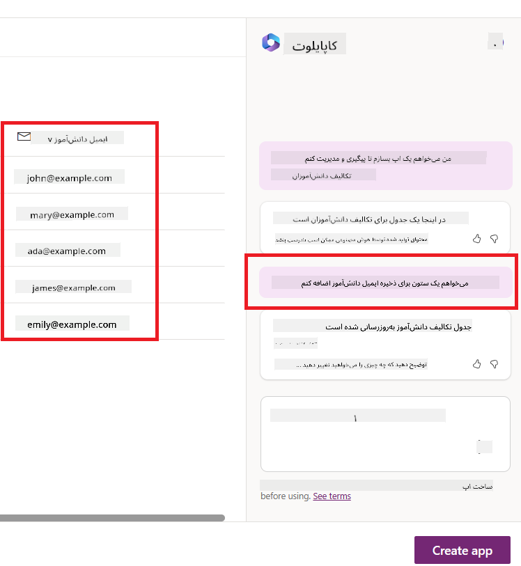
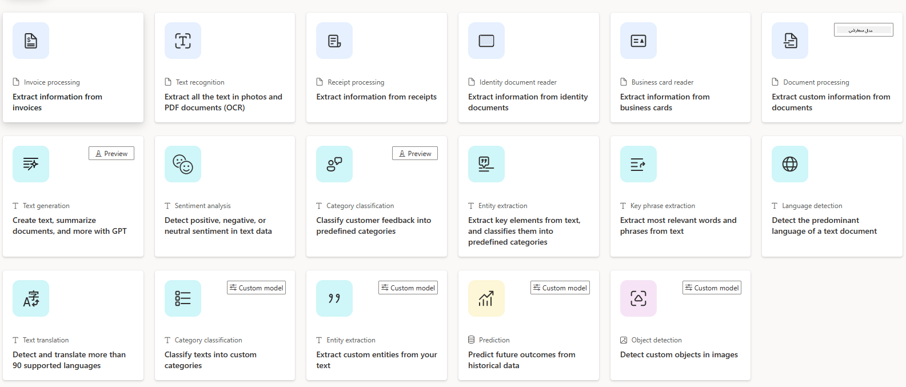
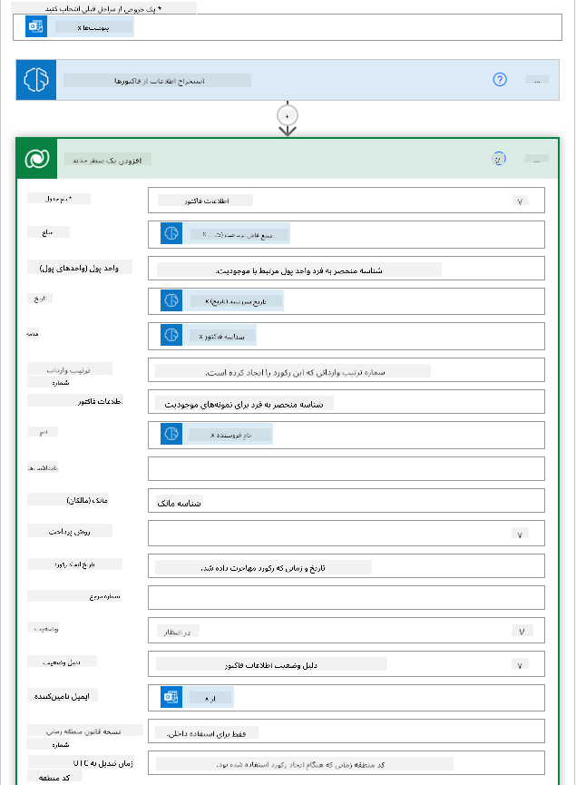

<!--
CO_OP_TRANSLATOR_METADATA:
{
  "original_hash": "f5ff3b6204a695a117d6f452403c95f7",
  "translation_date": "2025-07-09T13:42:23+00:00",
  "source_file": "10-building-low-code-ai-applications/README.md",
  "language_code": "fa"
}
-->
# ساخت برنامه‌های هوش مصنوعی کم‌کد

> _(برای مشاهده ویدئوی این درس روی تصویر بالا کلیک کنید)_

## مقدمه

حالا که یاد گرفتیم چگونه برنامه‌های تولید تصویر بسازیم، بیایید درباره کم‌کد صحبت کنیم. هوش مصنوعی مولد می‌تواند در حوزه‌های مختلفی از جمله کم‌کد استفاده شود، اما کم‌کد چیست و چگونه می‌توانیم هوش مصنوعی را به آن اضافه کنیم؟

ساخت برنامه‌ها و راه‌حل‌ها برای توسعه‌دهندگان سنتی و غیرتوسعه‌دهندگان با استفاده از پلتفرم‌های توسعه کم‌کد آسان‌تر شده است. پلتفرم‌های توسعه کم‌کد به شما امکان می‌دهند برنامه‌ها و راه‌حل‌ها را با کدنویسی کم یا بدون کد بسازید. این کار با فراهم کردن محیط توسعه بصری که به شما اجازه می‌دهد اجزا را بکشید و رها کنید تا برنامه‌ها و راه‌حل‌ها را بسازید، انجام می‌شود. این امکان به شما کمک می‌کند برنامه‌ها و راه‌حل‌ها را سریع‌تر و با منابع کمتر بسازید. در این درس، به طور عمیق به نحوه استفاده از کم‌کد و چگونگی تقویت توسعه کم‌کد با هوش مصنوعی با استفاده از Power Platform می‌پردازیم.

Power Platform به سازمان‌ها این فرصت را می‌دهد تا تیم‌های خود را توانمند سازند تا راه‌حل‌های خود را از طریق محیطی شهودی کم‌کد یا بدون کد بسازند. این محیط به ساده‌سازی فرآیند ساخت راه‌حل‌ها کمک می‌کند. با Power Platform، راه‌حل‌ها می‌توانند در عرض روزها یا هفته‌ها به جای ماه‌ها یا سال‌ها ساخته شوند. Power Platform شامل پنج محصول کلیدی است: Power Apps، Power Automate، Power BI، Power Pages و Copilot Studio.

این درس شامل موارد زیر است:

- معرفی هوش مصنوعی مولد در Power Platform  
- معرفی Copilot و نحوه استفاده از آن  
- استفاده از هوش مصنوعی مولد برای ساخت برنامه‌ها و جریان‌ها در Power Platform  
- درک مدل‌های هوش مصنوعی در Power Platform با AI Builder  

## اهداف یادگیری

تا پایان این درس، شما قادر خواهید بود:

- درک نحوه عملکرد Copilot در Power Platform.

- ساخت برنامه‌ای برای پیگیری تکالیف دانش‌آموزان برای استارتاپ آموزشی ما.

- ساخت جریان پردازش فاکتور که با استفاده از هوش مصنوعی اطلاعات فاکتورها را استخراج می‌کند.

- به‌کارگیری بهترین روش‌ها هنگام استفاده از مدل هوش مصنوعی Create Text with GPT.

ابزارها و فناوری‌هایی که در این درس استفاده خواهید کرد عبارتند از:

- **Power Apps**، برای برنامه پیگیری تکالیف دانش‌آموزان، که محیط توسعه کم‌کد برای ساخت برنامه‌هایی جهت پیگیری، مدیریت و تعامل با داده‌ها فراهم می‌کند.

- **Dataverse**، برای ذخیره داده‌های برنامه پیگیری تکالیف دانش‌آموزان که یک پلتفرم داده کم‌کد برای ذخیره داده‌های برنامه فراهم می‌کند.

- **Power Automate**، برای جریان پردازش فاکتور که محیط توسعه کم‌کد برای ساخت گردش‌کارها جهت خودکارسازی فرآیند پردازش فاکتور فراهم می‌کند.

- **AI Builder**، برای مدل هوش مصنوعی پردازش فاکتور که از مدل‌های هوش مصنوعی پیش‌ساخته برای پردازش فاکتورها استفاده می‌کند.

## هوش مصنوعی مولد در Power Platform

تقویت توسعه و ساخت برنامه‌های کم‌کد با هوش مصنوعی مولد یکی از حوزه‌های کلیدی تمرکز Power Platform است. هدف این است که همه بتوانند برنامه‌ها، سایت‌ها، داشبوردها و فرآیندهای خودکار شده با هوش مصنوعی بسازند، _بدون نیاز به تخصص در علم داده_. این هدف با ادغام هوش مصنوعی مولد در تجربه توسعه کم‌کد در Power Platform به شکل Copilot و AI Builder محقق می‌شود.

### این چگونه کار می‌کند؟

Copilot یک دستیار هوش مصنوعی است که به شما امکان می‌دهد با توصیف نیازهای خود در قالب چند مرحله مکالمه‌ای با زبان طبیعی، راه‌حل‌های Power Platform را بسازید. برای مثال، می‌توانید به دستیار هوش مصنوعی خود بگویید چه فیلدهایی در برنامه شما استفاده شود و او هم برنامه و هم مدل داده زیرساختی را ایجاد می‌کند یا می‌توانید نحوه راه‌اندازی یک جریان در Power Automate را مشخص کنید.

شما می‌توانید قابلیت‌های مبتنی بر Copilot را به عنوان ویژگی در صفحات برنامه خود استفاده کنید تا کاربران بتوانند از طریق تعاملات مکالمه‌ای به بینش‌ها دست یابند.

AI Builder یک قابلیت هوش مصنوعی کم‌کد در Power Platform است که به شما امکان می‌دهد از مدل‌های هوش مصنوعی برای خودکارسازی فرآیندها و پیش‌بینی نتایج استفاده کنید. با AI Builder می‌توانید هوش مصنوعی را به برنامه‌ها و جریان‌های خود که به داده‌های Dataverse یا منابع داده ابری مختلف مانند SharePoint، OneDrive یا Azure متصل هستند، بیاورید.

Copilot در تمام محصولات Power Platform موجود است: Power Apps، Power Automate، Power BI، Power Pages و Power Virtual Agents. AI Builder در Power Apps و Power Automate در دسترس است. در این درس، تمرکز ما بر نحوه استفاده از Copilot و AI Builder در Power Apps و Power Automate برای ساخت راه‌حلی برای استارتاپ آموزشی ما خواهد بود.

### Copilot در Power Apps

به عنوان بخشی از Power Platform، Power Apps محیط توسعه کم‌کد برای ساخت برنامه‌هایی جهت پیگیری، مدیریت و تعامل با داده‌ها فراهم می‌کند. این مجموعه‌ای از خدمات توسعه برنامه با پلتفرم داده مقیاس‌پذیر و قابلیت اتصال به خدمات ابری و داده‌های محلی است. Power Apps به شما اجازه می‌دهد برنامه‌هایی بسازید که روی مرورگرها، تبلت‌ها و تلفن‌ها اجرا می‌شوند و می‌توان آن‌ها را با همکاران به اشتراک گذاشت. Power Apps کاربران را با رابط کاربری ساده به توسعه برنامه وارد می‌کند تا هر کاربر کسب‌وکار یا توسعه‌دهنده حرفه‌ای بتواند برنامه‌های سفارشی بسازد. تجربه توسعه برنامه همچنین با هوش مصنوعی مولد از طریق Copilot بهبود یافته است.

ویژگی دستیار هوش مصنوعی Copilot در Power Apps به شما امکان می‌دهد نوع برنامه‌ای که نیاز دارید و اطلاعاتی که می‌خواهید برنامه شما پیگیری، جمع‌آوری یا نمایش دهد را توصیف کنید. سپس Copilot یک برنامه Canvas پاسخگو بر اساس توصیف شما ایجاد می‌کند. شما می‌توانید برنامه را برای برآورده کردن نیازهای خود سفارشی کنید. Copilot همچنین یک جدول Dataverse با فیلدهای مورد نیاز برای ذخیره داده‌هایی که می‌خواهید پیگیری کنید و برخی داده‌های نمونه ایجاد و پیشنهاد می‌دهد. در ادامه این درس به Dataverse و نحوه استفاده از آن در Power Apps خواهیم پرداخت. سپس می‌توانید جدول را با استفاده از ویژگی دستیار Copilot از طریق مراحل مکالمه‌ای سفارشی کنید. این ویژگی به راحتی از صفحه اصلی Power Apps در دسترس است.

### Copilot در Power Automate

به عنوان بخشی از Power Platform، Power Automate به کاربران اجازه می‌دهد گردش‌کارهای خودکار بین برنامه‌ها و خدمات ایجاد کنند. این ابزار به خودکارسازی فرآیندهای تکراری کسب‌وکار مانند ارتباطات، جمع‌آوری داده‌ها و تاییدیه‌های تصمیم‌گیری کمک می‌کند. رابط کاربری ساده آن به کاربران با هر سطح مهارت فنی (از مبتدی تا توسعه‌دهنده حرفه‌ای) امکان می‌دهد وظایف کاری را خودکار کنند. تجربه توسعه گردش‌کار نیز با هوش مصنوعی مولد از طریق Copilot بهبود یافته است.

ویژگی دستیار هوش مصنوعی Copilot در Power Automate به شما امکان می‌دهد نوع جریان مورد نیاز و اقداماتی که می‌خواهید جریان انجام دهد را توصیف کنید. سپس Copilot بر اساس توصیف شما یک جریان ایجاد می‌کند. شما می‌توانید جریان را برای برآورده کردن نیازهای خود سفارشی کنید. Copilot همچنین اقداماتی را که برای انجام وظیفه خودکار لازم دارید، ایجاد و پیشنهاد می‌دهد. در ادامه این درس به جریان‌ها و نحوه استفاده از آن‌ها در Power Automate خواهیم پرداخت. سپس می‌توانید اقدامات را با استفاده از ویژگی دستیار Copilot از طریق مراحل مکالمه‌ای سفارشی کنید. این ویژگی به راحتی از صفحه اصلی Power Automate در دسترس است.

## تمرین: مدیریت تکالیف دانش‌آموزان و فاکتورها برای استارتاپ ما با استفاده از Copilot

استارتاپ ما دوره‌های آنلاین به دانش‌آموزان ارائه می‌دهد. این استارتاپ به سرعت رشد کرده و اکنون در پاسخگویی به تقاضای دوره‌ها دچار مشکل شده است. استارتاپ شما را به عنوان توسعه‌دهنده Power Platform استخدام کرده است تا به آن‌ها در ساخت راه‌حلی کم‌کد برای مدیریت تکالیف دانش‌آموزان و فاکتورها کمک کنید. راه‌حل آن‌ها باید بتواند از طریق یک برنامه تکالیف دانش‌آموزان را پیگیری و مدیریت کند و فرآیند پردازش فاکتورها را از طریق یک گردش‌کار خودکار کند. از شما خواسته شده است که از هوش مصنوعی مولد برای توسعه این راه‌حل استفاده کنید.

وقتی شروع به استفاده از Copilot می‌کنید، می‌توانید از [کتابخانه دستورات Copilot در Power Platform](https://github.com/pnp/powerplatform-prompts?WT.mc_id=academic-109639-somelezediko) برای شروع استفاده کنید. این کتابخانه شامل فهرستی از دستورات است که می‌توانید برای ساخت برنامه‌ها و جریان‌ها با Copilot استفاده کنید. همچنین می‌توانید از دستورات موجود در کتابخانه برای ایده گرفتن درباره نحوه توصیف نیازهای خود به Copilot بهره ببرید.

### ساخت برنامه پیگیری تکالیف دانش‌آموزان برای استارتاپ ما

مدرسان در استارتاپ ما در پیگیری تکالیف دانش‌آموزان مشکل دارند. آن‌ها از یک صفحه گسترده برای پیگیری تکالیف استفاده می‌کردند اما با افزایش تعداد دانش‌آموزان مدیریت آن دشوار شده است. آن‌ها از شما خواسته‌اند برنامه‌ای بسازید که به آن‌ها در پیگیری و مدیریت تکالیف کمک کند. برنامه باید امکان افزودن تکالیف جدید، مشاهده، به‌روزرسانی و حذف تکالیف را فراهم کند. همچنین باید به مدرسان و دانش‌آموزان اجازه دهد تکالیفی که نمره‌گذاری شده‌اند و آن‌هایی که نشده‌اند را مشاهده کنند.

شما برنامه را با استفاده از Copilot در Power Apps با دنبال کردن مراحل زیر می‌سازید:

1. به صفحه اصلی [Power Apps](https://make.powerapps.com?WT.mc_id=academic-105485-koreyst) بروید.

1. در بخش متنی صفحه اصلی، برنامه‌ای که می‌خواهید بسازید را توصیف کنید. برای مثال، **_می‌خواهم برنامه‌ای بسازم برای پیگیری و مدیریت تکالیف دانش‌آموزان_**. روی دکمه **Send** کلیک کنید تا دستور به AI Copilot ارسال شود.

1. AI Copilot یک جدول Dataverse با فیلدهای مورد نیاز برای ذخیره داده‌هایی که می‌خواهید پیگیری کنید و برخی داده‌های نمونه پیشنهاد می‌دهد. سپس می‌توانید جدول را با استفاده از ویژگی دستیار AI Copilot از طریق مراحل مکالمه‌ای سفارشی کنید.

   > **مهم**: Dataverse پلتفرم داده زیرساختی Power Platform است. این یک پلتفرم داده کم‌کد برای ذخیره داده‌های برنامه است. این سرویس کاملاً مدیریت شده است که داده‌ها را به صورت امن در فضای ابری مایکروسافت ذخیره می‌کند و در محیط Power Platform شما فراهم می‌شود. این سرویس دارای قابلیت‌های حاکمیت داده داخلی مانند طبقه‌بندی داده، ردیابی داده، کنترل دسترسی دقیق و موارد دیگر است. می‌توانید اطلاعات بیشتر درباره Dataverse را [اینجا](https://docs.microsoft.com/powerapps/maker/data-platform/data-platform-intro?WT.mc_id=academic-109639-somelezediko) بیاموزید.

   

1. مدرسان می‌خواهند به دانش‌آموزانی که تکالیف خود را ارسال کرده‌اند ایمیل بفرستند تا آن‌ها را از پیشرفت تکالیف مطلع کنند. می‌توانید از Copilot برای افزودن فیلد جدید به جدول برای ذخیره ایمیل دانش‌آموز استفاده کنید. برای مثال، می‌توانید از دستور زیر برای افزودن فیلد جدید استفاده کنید: **_می‌خواهم ستونی برای ذخیره ایمیل دانش‌آموز اضافه کنم_**. روی دکمه **Send** کلیک کنید تا دستور به AI Copilot ارسال شود.

1. AI Copilot فیلد جدیدی ایجاد می‌کند و سپس می‌توانید آن را برای برآورده کردن نیازهای خود سفارشی کنید.

1. پس از اتمام کار با جدول، روی دکمه **Create app** کلیک کنید تا برنامه ساخته شود.

1. AI Copilot برنامه Canvas پاسخگویی بر اساس توصیف شما ایجاد می‌کند. سپس می‌توانید برنامه را برای برآورده کردن نیازهای خود سفارشی کنید.

1. برای اینکه مدرسان بتوانند به دانش‌آموزان ایمیل بفرستند، می‌توانید از Copilot برای افزودن صفحه جدید به برنامه استفاده کنید. برای مثال، می‌توانید از دستور زیر برای افزودن صفحه جدید استفاده کنید: **_می‌خواهم صفحه‌ای برای ارسال ایمیل به دانش‌آموزان اضافه کنم_**. روی دکمه **Send** کلیک کنید تا دستور به AI Copilot ارسال شود.

1. AI Copilot صفحه جدیدی ایجاد می‌کند و سپس می‌توانید آن را برای برآورده کردن نیازهای خود سفارشی کنید.

1. پس از اتمام کار با برنامه، روی دکمه **Save** کلیک کنید تا برنامه ذخیره شود.

1. برای به اشتراک گذاشتن برنامه با مدرسان، روی دکمه **Share** کلیک کنید و سپس دوباره روی دکمه **Share** کلیک کنید. سپس می‌توانید برنامه را با وارد کردن آدرس ایمیل مدرسان به اشتراک بگذارید.

> **تکلیف شما**: برنامه‌ای که ساختید شروع خوبی است اما می‌توان آن را بهبود داد. با ویژگی ایمیل، مدرسان فقط می‌توانند به صورت دستی ایمیل به دانش‌آموزان بفرستند و باید ایمیل‌ها را تایپ کنند. آیا می‌توانید با استفاده از Copilot یک خودکارسازی بسازید که به مدرسان اجازه دهد وقتی دانش‌آموزان تکالیف خود را ارسال می‌کنند، به طور خودکار ایمیل ارسال شود؟ راهنمای شما این است که با دستور مناسب می‌توانید از Copilot در Power Automate برای ساخت این خودکارسازی استفاده کنید.

### ساخت جدول اطلاعات فاکتورها برای استارتاپ ما

تیم مالی استارتاپ ما در پیگیری فاکتورها مشکل دارد. آن‌ها از یک صفحه گسترده برای پیگیری فاکتورها استفاده می‌کردند اما با افزایش تعداد فاکتورها مدیریت آن دشوار شده است. آن‌ها از شما خواسته‌اند جدولی بسازید که به آن‌ها در ذخیره، پیگیری و مدیریت اطلاعات فاکتورهای دریافتی کمک کند. این جدول باید برای ساخت خودکارسازی استفاده شود که تمام اطلاعات فاکتورها را استخراج کرده و در جدول ذخیره کند. همچنین جدول باید به تیم مالی اجازه دهد فاکتورهای پرداخت شده و نشده را مشاهده کنند.

Power Platform دارای پلتفرم داده زیرساختی به نام Dataverse است که به شما امکان می‌دهد داده‌های برنامه‌ها و راه‌حل‌های خود را ذخیره کنید. Dataverse یک پلتفرم داده کم‌کد برای ذخیره داده‌های برنامه است. این سرویس کاملاً مدیریت شده است که داده‌ها را به صورت امن در فضای ابری مایکروسافت ذخیره می‌کند و در محیط Power Platform شما فراهم می‌شود. این سرویس دارای قابلیت‌های حاکمیت داده داخلی مانند طبقه‌بندی داده، ردیابی داده، کنترل دسترسی دقیق و موارد دیگر است. می‌توانید اطلاعات بیشتر درباره Dataverse را [اینجا](https://docs.microsoft.com/powerapps/maker/data-platform/data-platform-intro?WT.mc_id=academic-109639-somelezediko) بیاموزید.

چرا باید از Dataverse برای استارتاپ خود استفاده کنیم؟ جداول استاندارد و سفارشی در Dataverse گزینه‌ای امن و مبتنی بر ابر برای ذخیره داده‌های شما فراهم می‌کنند. جداول به شما اجازه می‌دهند انواع مختلف داده‌ها را ذخیره کنید، مشابه استفاده از چندین برگه در یک فایل اکسل. می‌توانید از جداول برای ذخیره داده‌هایی استفاده کنید که مختص سازمان یا نیازهای کسب‌وکار شما هستند. برخی از مزایایی که استارتاپ ما با استفاده از Dataverse به دست می‌آورد عبارتند از اما محدود به:
- **مدیریت آسان**: هم متادیتا و هم داده‌ها در فضای ابری ذخیره می‌شوند، بنابراین نیازی نیست نگران جزئیات نحوه ذخیره یا مدیریت آن‌ها باشید. می‌توانید تمرکز خود را روی ساخت برنامه‌ها و راه‌حل‌ها بگذارید.

- **امنیت بالا**: Dataverse گزینه‌ای امن و مبتنی بر فضای ابری برای ذخیره داده‌های شما فراهم می‌کند. می‌توانید کنترل کنید چه کسانی به داده‌های جداول شما دسترسی داشته باشند و با استفاده از امنیت مبتنی بر نقش، نحوه دسترسی آن‌ها را مدیریت کنید.

- **متادیتای غنی**: نوع داده‌ها و روابط به‌طور مستقیم در Power Apps استفاده می‌شوند.

- **منطق و اعتبارسنجی**: می‌توانید از قوانین کسب‌وکار، فیلدهای محاسباتی و قوانین اعتبارسنجی برای اعمال منطق کسب‌وکار و حفظ دقت داده‌ها استفاده کنید.

حالا که می‌دانید Dataverse چیست و چرا باید از آن استفاده کنید، بیایید ببینیم چگونه می‌توانید با استفاده از Copilot یک جدول در Dataverse بسازید که نیازهای تیم مالی ما را برآورده کند.

> **Note** : شما در بخش بعدی از این جدول برای ساخت یک اتوماسیون استفاده خواهید کرد که تمام اطلاعات فاکتورها را استخراج کرده و در جدول ذخیره می‌کند.

برای ساخت یک جدول در Dataverse با استفاده از Copilot، مراحل زیر را دنبال کنید:

1. به صفحه اصلی [Power Apps](https://make.powerapps.com?WT.mc_id=academic-105485-koreyst) بروید.

2. در نوار ناوبری سمت چپ، روی **Tables** کلیک کنید و سپس روی **Describe the new Table** کلیک کنید.

3. در صفحه **Describe the new Table**، از بخش متنی برای توصیف جدولی که می‌خواهید بسازید استفاده کنید. برای مثال، **_می‌خواهم جدولی برای ذخیره اطلاعات فاکتور بسازم_**. روی دکمه **Send** کلیک کنید تا درخواست به AI Copilot ارسال شود.

4. AI Copilot جدولی در Dataverse با فیلدهای مورد نیاز برای ذخیره داده‌هایی که می‌خواهید پیگیری کنید و نمونه داده‌هایی پیشنهاد می‌دهد. سپس می‌توانید جدول را با استفاده از قابلیت دستیار AI Copilot و مراحل مکالمه‌ای، مطابق نیاز خود سفارشی کنید.

5. تیم مالی می‌خواهد ایمیلی به تأمین‌کننده ارسال کند تا آن‌ها را از وضعیت فعلی فاکتورشان مطلع کند. می‌توانید با استفاده از Copilot یک فیلد جدید به جدول اضافه کنید تا ایمیل تأمین‌کننده ذخیره شود. برای مثال، می‌توانید از درخواست زیر برای افزودن یک ستون جدید به جدول استفاده کنید: **_می‌خواهم ستونی برای ذخیره ایمیل تأمین‌کننده اضافه کنم_**. روی دکمه **Send** کلیک کنید تا درخواست به AI Copilot ارسال شود.

6. AI Copilot یک فیلد جدید ایجاد می‌کند و سپس می‌توانید آن را مطابق نیاز خود سفارشی کنید.

7. پس از اتمام کار با جدول، روی دکمه **Create** کلیک کنید تا جدول ساخته شود.

## مدل‌های هوش مصنوعی در Power Platform با AI Builder

AI Builder یک قابلیت هوش مصنوعی کم‌کد در Power Platform است که به شما امکان می‌دهد از مدل‌های هوش مصنوعی برای خودکارسازی فرآیندها و پیش‌بینی نتایج استفاده کنید. با AI Builder می‌توانید هوش مصنوعی را به برنامه‌ها و جریان‌های کاری خود که به داده‌های Dataverse یا منابع داده ابری مختلف مانند SharePoint، OneDrive یا Azure متصل هستند، بیاورید.

## مدل‌های هوش مصنوعی آماده در مقابل مدل‌های سفارشی

AI Builder دو نوع مدل هوش مصنوعی ارائه می‌دهد: مدل‌های آماده و مدل‌های سفارشی. مدل‌های آماده، مدل‌های هوش مصنوعی از پیش آموزش‌دیده شده توسط مایکروسافت هستند که در Power Platform در دسترس‌اند. این مدل‌ها به شما کمک می‌کنند بدون نیاز به جمع‌آوری داده و ساخت، آموزش و انتشار مدل‌های خود، هوشمندی را به برنامه‌ها و جریان‌های کاری خود اضافه کنید. می‌توانید از این مدل‌ها برای خودکارسازی فرآیندها و پیش‌بینی نتایج استفاده کنید.

برخی از مدل‌های آماده موجود در Power Platform عبارتند از:

- **استخراج عبارات کلیدی**: این مدل عبارات کلیدی را از متن استخراج می‌کند.
- **تشخیص زبان**: این مدل زبان متن را تشخیص می‌دهد.
- **تحلیل احساسات**: این مدل احساسات مثبت، منفی، خنثی یا ترکیبی را در متن تشخیص می‌دهد.
- **خواندن کارت ویزیت**: این مدل اطلاعات را از کارت‌های ویزیت استخراج می‌کند.
- **تشخیص متن**: این مدل متن را از تصاویر استخراج می‌کند.
- **تشخیص اشیاء**: این مدل اشیاء را از تصاویر شناسایی و استخراج می‌کند.
- **پردازش اسناد**: این مدل اطلاعات را از فرم‌ها استخراج می‌کند.
- **پردازش فاکتورها**: این مدل اطلاعات را از فاکتورها استخراج می‌کند.

با مدل‌های سفارشی می‌توانید مدل خود را به AI Builder بیاورید تا مانند هر مدل سفارشی AI Builder عمل کند و امکان آموزش مدل با داده‌های خودتان را فراهم کند. می‌توانید از این مدل‌ها برای خودکارسازی فرآیندها و پیش‌بینی نتایج در هر دو Power Apps و Power Automate استفاده کنید. هنگام استفاده از مدل خود محدودیت‌هایی وجود دارد. برای اطلاعات بیشتر درباره این [محدودیت‌ها](https://learn.microsoft.com/ai-builder/byo-model#limitations?WT.mc_id=academic-105485-koreyst) مطالعه کنید.

## تمرین شماره ۲ - ساخت جریان پردازش فاکتور برای استارتاپ ما

تیم مالی در پردازش فاکتورها دچار مشکل شده است. آن‌ها از یک صفحه گسترده برای پیگیری فاکتورها استفاده می‌کردند اما با افزایش تعداد فاکتورها، مدیریت آن دشوار شده است. آن‌ها از شما خواسته‌اند یک جریان کاری بسازید که به آن‌ها در پردازش فاکتورها با استفاده از هوش مصنوعی کمک کند. این جریان باید امکان استخراج اطلاعات از فاکتورها و ذخیره آن‌ها در یک جدول Dataverse را فراهم کند. همچنین باید امکان ارسال ایمیل به تیم مالی با اطلاعات استخراج شده را داشته باشد.

حالا که می‌دانید AI Builder چیست و چرا باید از آن استفاده کنید، بیایید ببینیم چگونه می‌توانید از مدل پردازش فاکتور در AI Builder که قبلاً معرفی کردیم، برای ساخت یک جریان کاری که به تیم مالی در پردازش فاکتورها کمک کند، استفاده کنید.

برای ساخت جریان کاری که به تیم مالی در پردازش فاکتورها با استفاده از مدل پردازش فاکتور در AI Builder کمک کند، مراحل زیر را دنبال کنید:

1. به صفحه اصلی [Power Automate](https://make.powerautomate.com?WT.mc_id=academic-105485-koreyst) بروید.

2. از بخش متنی صفحه اصلی برای توصیف جریان کاری که می‌خواهید بسازید استفاده کنید. برای مثال، **_پردازش یک فاکتور هنگام رسیدن به صندوق ورودی ایمیلم_**. روی دکمه **Send** کلیک کنید تا درخواست به AI Copilot ارسال شود.

   

3. AI Copilot اقداماتی را که برای انجام وظیفه خودکارسازی شده نیاز دارید پیشنهاد می‌دهد. می‌توانید روی دکمه **Next** کلیک کنید تا مراحل بعدی را طی کنید.

4. در مرحله بعد، Power Automate از شما می‌خواهد اتصالات مورد نیاز برای جریان را تنظیم کنید. پس از اتمام، روی دکمه **Create flow** کلیک کنید تا جریان ساخته شود.

5. AI Copilot یک جریان ایجاد می‌کند و سپس می‌توانید آن را مطابق نیاز خود سفارشی کنید.

6. محرک جریان را به‌روزرسانی کنید و **Folder** را به پوشه‌ای که فاکتورها در آن ذخیره می‌شوند تنظیم کنید. برای مثال، می‌توانید پوشه را روی **Inbox** قرار دهید. روی **Show advanced options** کلیک کنید و گزینه **Only with Attachments** را روی **Yes** تنظیم کنید. این باعث می‌شود جریان فقط زمانی اجرا شود که ایمیلی با پیوست در پوشه دریافت شود.

7. اقدامات زیر را از جریان حذف کنید: **HTML to text**، **Compose**، **Compose 2**، **Compose 3** و **Compose 4** چون از آن‌ها استفاده نخواهید کرد.

8. اقدام **Condition** را نیز از جریان حذف کنید چون استفاده نخواهید کرد. جریان باید شبیه تصویر زیر باشد:

   

9. روی دکمه **Add an action** کلیک کنید و **Dataverse** را جستجو کنید. اقدام **Add a new row** را انتخاب کنید.

10. در اقدام **Extract Information from invoices**، مقدار **Invoice File** را به **Attachment Content** از ایمیل تنظیم کنید. این باعث می‌شود جریان اطلاعات را از پیوست فاکتور استخراج کند.

11. جدولی که قبلاً ساخته‌اید را انتخاب کنید. برای مثال، می‌توانید جدول **Invoice Information** را انتخاب کنید. محتوای پویا از اقدام قبلی را برای پر کردن فیلدهای زیر انتخاب کنید:

    - ID
    - Amount
    - Date
    - Name
    - Status - مقدار **Status** را روی **Pending** تنظیم کنید.
    - Supplier Email - از محتوای پویا **From** در محرک **When a new email arrives** استفاده کنید.

    

12. پس از اتمام کار با جریان، روی دکمه **Save** کلیک کنید تا جریان ذخیره شود. سپس می‌توانید جریان را با ارسال ایمیلی حاوی فاکتور به پوشه‌ای که در محرک مشخص کرده‌اید، آزمایش کنید.

> **تکلیف شما**: جریانی که ساختید شروع خوبی است، حالا باید فکر کنید چگونه می‌توانید اتوماسیونی بسازید که به تیم مالی ما امکان دهد ایمیلی به تأمین‌کننده ارسال کند تا آن‌ها را از وضعیت فعلی فاکتورشان مطلع کند. نکته: جریان باید زمانی اجرا شود که وضعیت فاکتور تغییر کند.

## استفاده از مدل هوش مصنوعی تولید متن در Power Automate

مدل Create Text with GPT در AI Builder به شما امکان می‌دهد بر اساس یک درخواست متنی، متن تولید کنید و این مدل توسط سرویس Microsoft Azure OpenAI پشتیبانی می‌شود. با این قابلیت می‌توانید فناوری GPT (Generative Pre-Trained Transformer) را در برنامه‌ها و جریان‌های کاری خود وارد کنید تا انواع جریان‌های خودکار و برنامه‌های کاربردی هوشمند بسازید.

مدل‌های GPT با آموزش گسترده روی حجم زیادی از داده‌ها، قادرند متنی تولید کنند که بسیار شبیه زبان انسان باشد وقتی یک درخواست متنی دریافت می‌کنند. وقتی این مدل‌ها با اتوماسیون جریان کاری ترکیب شوند، می‌توانند برای ساده‌سازی و خودکارسازی طیف وسیعی از وظایف به کار روند.

برای مثال، می‌توانید جریان‌هایی بسازید که به‌طور خودکار متن‌هایی برای موارد مختلف تولید کنند، مانند پیش‌نویس ایمیل‌ها، توضیحات محصول و غیره. همچنین می‌توانید از این مدل برای تولید متن در برنامه‌های مختلف مانند چت‌بات‌ها و برنامه‌های خدمات مشتری استفاده کنید که به نمایندگان خدمات مشتری کمک می‌کند به طور مؤثر و کارآمد به پرسش‌های مشتریان پاسخ دهند.

برای یادگیری نحوه استفاده از این مدل هوش مصنوعی در Power Automate، به ماژول [Add intelligence with AI Builder and GPT](https://learn.microsoft.com/training/modules/ai-builder-text-generation/?WT.mc_id=academic-109639-somelezediko) مراجعه کنید.

## کار عالی! یادگیری خود را ادامه دهید

پس از اتمام این درس، مجموعه [Generative AI Learning](https://aka.ms/genai-collection?WT.mc_id=academic-105485-koreyst) ما را بررسی کنید تا دانش خود در زمینه هوش مصنوعی مولد را ارتقا دهید!

به درس ۱۱ بروید که در آن به نحوه [ادغام هوش مصنوعی مولد با فراخوانی توابع](../11-integrating-with-function-calling/README.md?WT.mc_id=academic-105485-koreyst) می‌پردازیم!

**سلب مسئولیت**:  
این سند با استفاده از سرویس ترجمه هوش مصنوعی [Co-op Translator](https://github.com/Azure/co-op-translator) ترجمه شده است. در حالی که ما در تلاش برای دقت هستیم، لطفاً توجه داشته باشید که ترجمه‌های خودکار ممکن است حاوی خطاها یا نواقصی باشند. سند اصلی به زبان بومی خود باید به عنوان منبع معتبر در نظر گرفته شود. برای اطلاعات حیاتی، ترجمه حرفه‌ای انسانی توصیه می‌شود. ما مسئول هیچ گونه سوءتفاهم یا تفسیر نادرستی که از استفاده این ترجمه ناشی شود، نیستیم.