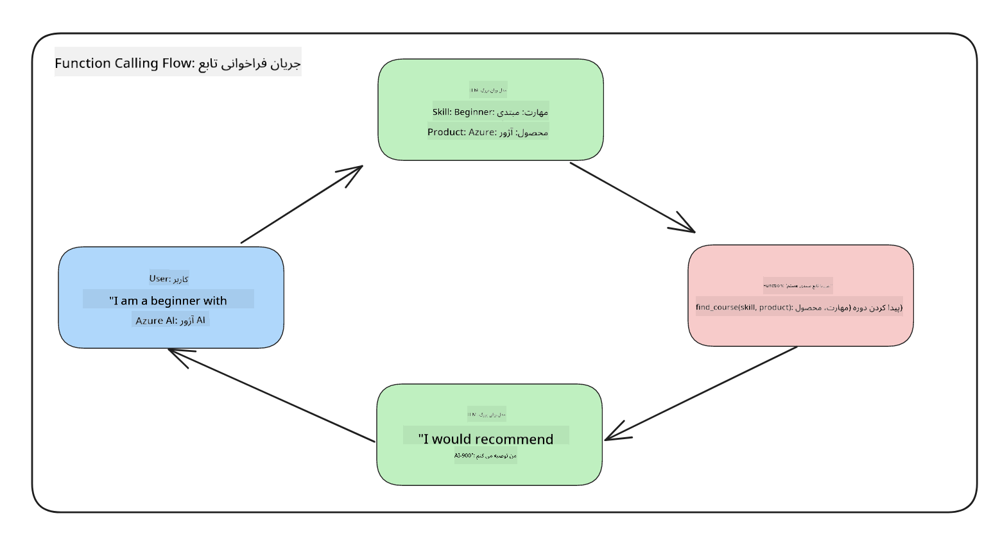
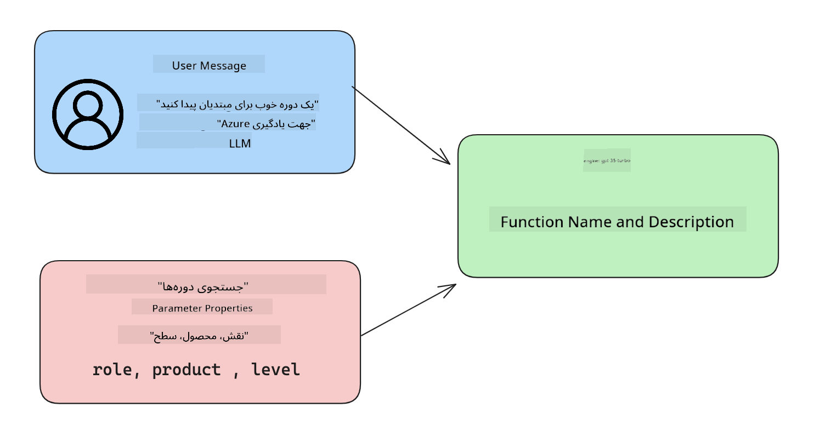

<!--
CO_OP_TRANSLATOR_METADATA:
{
  "original_hash": "77a48a201447be19aa7560706d6f93a0",
  "translation_date": "2025-05-19T21:20:21+00:00",
  "source_file": "11-integrating-with-function-calling/README.md",
  "language_code": "fa"
}
-->
# ادغام با فراخوانی تابع

شما تا کنون چیزهای زیادی در درس‌های قبلی یاد گرفته‌اید. با این حال، می‌توانیم بیشتر پیشرفت کنیم. برخی از مواردی که می‌توانیم به آنها بپردازیم این است که چگونه می‌توانیم یک قالب پاسخ ثابت‌تر دریافت کنیم تا کار با پاسخ در پایین دست آسان‌تر شود. همچنین، ممکن است بخواهیم داده‌هایی از منابع دیگر اضافه کنیم تا برنامه خود را بیشتر غنی کنیم.

مشکلات ذکر شده در بالا چیزی است که این فصل به دنبال حل آن است.

## مقدمه

این درس شامل موارد زیر خواهد بود:

- توضیح اینکه فراخوانی تابع چیست و موارد استفاده آن چیست.
- ایجاد یک فراخوانی تابع با استفاده از Azure OpenAI.
- چگونه یک فراخوانی تابع را در یک برنامه ادغام کنیم.

## اهداف یادگیری

تا پایان این درس، شما قادر خواهید بود:

- هدف استفاده از فراخوانی تابع را توضیح دهید.
- تنظیم فراخوانی تابع با استفاده از سرویس Azure OpenAI.
- طراحی فراخوانی‌های تابع مؤثر برای موارد استفاده برنامه خود.

## سناریو: بهبود چت‌بات ما با توابع

برای این درس، می‌خواهیم یک ویژگی برای استارتاپ آموزشی خود ایجاد کنیم که به کاربران اجازه می‌دهد از یک چت‌بات برای یافتن دوره‌های فنی استفاده کنند. ما دوره‌هایی را توصیه خواهیم کرد که با سطح مهارت، نقش فعلی و فناوری مورد علاقه آنها مطابقت داشته باشد.

برای تکمیل این سناریو، از ترکیبی از موارد زیر استفاده خواهیم کرد:

- `Azure OpenAI` برای ایجاد یک تجربه چت برای کاربر.
- `Microsoft Learn Catalog API` برای کمک به کاربران در یافتن دوره‌ها بر اساس درخواست کاربر.
- `Function Calling` برای گرفتن پرسش کاربر و ارسال آن به یک تابع برای انجام درخواست API.

برای شروع، بیایید ببینیم چرا در وهله اول می‌خواهیم از فراخوانی تابع استفاده کنیم:

## چرا فراخوانی تابع

قبل از فراخوانی تابع، پاسخ‌ها از یک LLM بدون ساختار و ناسازگار بودند. توسعه‌دهندگان مجبور بودند کد اعتبارسنجی پیچیده‌ای بنویسند تا مطمئن شوند که قادر به مدیریت هر نوع پاسخ هستند. کاربران نمی‌توانستند پاسخ‌هایی مانند "آب و هوای فعلی استکهلم چیست؟" دریافت کنند. این به این دلیل است که مدل‌ها به زمان آموزش داده‌ها محدود بودند.

فراخوانی تابع یک ویژگی از سرویس Azure OpenAI است که برای غلبه بر محدودیت‌های زیر طراحی شده است:

- **قالب پاسخ ثابت**. اگر بتوانیم قالب پاسخ را بهتر کنترل کنیم، می‌توانیم پاسخ را به راحتی در پایین دست به سیستم‌های دیگر ادغام کنیم.
- **داده‌های خارجی**. توانایی استفاده از داده‌های منابع دیگر یک برنامه در زمینه چت.

## نمایش مشکل از طریق یک سناریو

> توصیه می‌کنیم اگر می‌خواهید سناریوی زیر را اجرا کنید از [دفترچه یادداشت موجود](../../../11-integrating-with-function-calling/python/aoai-assignment.ipynb) استفاده کنید. همچنین می‌توانید فقط مطالعه کنید زیرا ما سعی می‌کنیم مشکلی را که توابع می‌توانند به حل آن کمک کنند، نشان دهیم.

بیایید به مثالی نگاه کنیم که مشکل قالب پاسخ را نشان می‌دهد:

فرض کنید می‌خواهیم یک پایگاه داده از داده‌های دانش‌آموزان ایجاد کنیم تا بتوانیم دوره مناسب را به آنها پیشنهاد دهیم. در زیر دو توصیف از دانش‌آموزان داریم که در داده‌هایی که شامل می‌شوند بسیار مشابه هستند.

1. ایجاد اتصال به منبع Azure OpenAI خود:

   ```python
   import os
   import json
   from openai import AzureOpenAI
   from dotenv import load_dotenv
   load_dotenv()

   client = AzureOpenAI(
   api_key=os.environ['AZURE_OPENAI_API_KEY'],  # this is also the default, it can be omitted
   api_version = "2023-07-01-preview"
   )

   deployment=os.environ['AZURE_OPENAI_DEPLOYMENT']
   ```

   در زیر برخی کدهای پایتون برای تنظیم اتصال ما به Azure OpenAI وجود دارد که در آن `api_type`, `api_base`, `api_version` and `api_key`.

1. Creating two student descriptions using variables `student_1_description` and `student_2_description` را تنظیم می‌کنیم.

   ```python
   student_1_description="Emily Johnson is a sophomore majoring in computer science at Duke University. She has a 3.7 GPA. Emily is an active member of the university's Chess Club and Debate Team. She hopes to pursue a career in software engineering after graduating."

   student_2_description = "Michael Lee is a sophomore majoring in computer science at Stanford University. He has a 3.8 GPA. Michael is known for his programming skills and is an active member of the university's Robotics Club. He hopes to pursue a career in artificial intelligence after finishing his studies."
   ```

   ما می‌خواهیم توصیفات دانش‌آموزان فوق را به یک LLM ارسال کنیم تا داده‌ها را تجزیه کند. این داده‌ها می‌توانند بعداً در برنامه ما استفاده شوند و به یک API ارسال یا در یک پایگاه داده ذخیره شوند.

1. بیایید دو پیام یکسان ایجاد کنیم که در آن به LLM بگوییم چه اطلاعاتی مورد علاقه ماست:

   ```python
   prompt1 = f'''
   Please extract the following information from the given text and return it as a JSON object:

   name
   major
   school
   grades
   club

   This is the body of text to extract the information from:
   {student_1_description}
   '''

   prompt2 = f'''
   Please extract the following information from the given text and return it as a JSON object:

   name
   major
   school
   grades
   club

   This is the body of text to extract the information from:
   {student_2_description}
   '''
   ```

   پیام‌های فوق به LLM دستور می‌دهند تا اطلاعات را استخراج کند و پاسخ را به صورت JSON برگرداند.

1. پس از تنظیم پیام‌ها و اتصال به Azure OpenAI، اکنون پیام‌ها را با استفاده از `openai.ChatCompletion`. We store the prompt in the `messages` variable and assign the role to `user` به LLM ارسال خواهیم کرد. این برای تقلید از یک پیام از یک کاربر است که به یک چت‌بات نوشته شده است.

   ```python
   # response from prompt one
   openai_response1 = client.chat.completions.create(
   model=deployment,
   messages = [{'role': 'user', 'content': prompt1}]
   )
   openai_response1.choices[0].message.content

   # response from prompt two
   openai_response2 = client.chat.completions.create(
   model=deployment,
   messages = [{'role': 'user', 'content': prompt2}]
   )
   openai_response2.choices[0].message.content
   ```

اکنون می‌توانیم هر دو درخواست را به LLM ارسال کنیم و پاسخی را که دریافت می‌کنیم بررسی کنیم تا آن را به صورت زیر پیدا کنیم `openai_response1['choices'][0]['message']['content']`.

1. Lastly, we can convert the response to JSON format by calling `json.loads`:

   ```python
   # Loading the response as a JSON object
   json_response1 = json.loads(openai_response1.choices[0].message.content)
   json_response1
   ```

   پاسخ 1:

   ```json
   {
     "name": "Emily Johnson",
     "major": "computer science",
     "school": "Duke University",
     "grades": "3.7",
     "club": "Chess Club"
   }
   ```

   پاسخ 2:

   ```json
   {
     "name": "Michael Lee",
     "major": "computer science",
     "school": "Stanford University",
     "grades": "3.8 GPA",
     "club": "Robotics Club"
   }
   ```

   حتی اگر پیام‌ها یکسان هستند و توصیفات مشابه‌اند، می‌بینیم که مقادیر `Grades` property formatted differently, as we can sometimes get the format `3.7` or `3.7 GPA` for example.

   This result is because the LLM takes unstructured data in the form of the written prompt and returns also unstructured data. We need to have a structured format so that we know what to expect when storing or using this data

So how do we solve the formatting problem then? By using functional calling, we can make sure that we receive structured data back. When using function calling, the LLM does not actually call or run any functions. Instead, we create a structure for the LLM to follow for its responses. We then use those structured responses to know what function to run in our applications.



We can then take what is returned from the function and send this back to the LLM. The LLM will then respond using natural language to answer the user's query.

## Use Cases for using function calls

There are many different use cases where function calls can improve your app like:

- **Calling External Tools**. Chatbots are great at providing answers to questions from users. By using function calling, the chatbots can use messages from users to complete certain tasks. For example, a student can ask the chatbot to "Send an email to my instructor saying I need more assistance with this subject". This can make a function call to `send_email(to: string, body: string)`

- **Create API or Database Queries**. Users can find information using natural language that gets converted into a formatted query or API request. An example of this could be a teacher who requests "Who are the students that completed the last assignment" which could call a function named `get_completed(student_name: string, assignment: int, current_status: string)`

- **Creating Structured Data**. Users can take a block of text or CSV and use the LLM to extract important information from it. For example, a student can convert a Wikipedia article about peace agreements to create AI flashcards. This can be done by using a function called `get_important_facts(agreement_name: string, date_signed: string, parties_involved: list)`

## Creating Your First Function Call

The process of creating a function call includes 3 main steps:

1. **Calling** the Chat Completions API with a list of your functions and a user message.
2. **Reading** the model's response to perform an action i.e. execute a function or API Call.
3. **Making** another call to Chat Completions API with the response from your function to use that information to create a response to the user.



### Step 1 - creating messages

The first step is to create a user message. This can be dynamically assigned by taking the value of a text input or you can assign a value here. If this is your first time working with the Chat Completions API, we need to define the `role` and the `content` of the message.

The `role` can be either `system` (creating rules), `assistant` (the model) or `user` (the end-user). For function calling, we will assign this as `user` و یک مثال سوال.

```python
messages= [ {"role": "user", "content": "Find me a good course for a beginner student to learn Azure."} ]
```

با اختصاص نقش‌های مختلف، به LLM مشخص می‌شود که آیا سیستم چیزی می‌گوید یا کاربر، که به ساخت یک تاریخچه مکالمه که LLM می‌تواند بر اساس آن بنا کند، کمک می‌کند.

### مرحله 2 - ایجاد توابع

در مرحله بعد، یک تابع و پارامترهای آن تابع را تعریف خواهیم کرد. ما فقط از یک تابع به نام `search_courses` but you can create multiple functions.

> **Important** : Functions are included in the system message to the LLM and will be included in the amount of available tokens you have available.

Below, we create the functions as an array of items. Each item is a function and has properties `name`, `description` and `parameters` استفاده خواهیم کرد:

```python
functions = [
   {
      "name":"search_courses",
      "description":"Retrieves courses from the search index based on the parameters provided",
      "parameters":{
         "type":"object",
         "properties":{
            "role":{
               "type":"string",
               "description":"The role of the learner (i.e. developer, data scientist, student, etc.)"
            },
            "product":{
               "type":"string",
               "description":"The product that the lesson is covering (i.e. Azure, Power BI, etc.)"
            },
            "level":{
               "type":"string",
               "description":"The level of experience the learner has prior to taking the course (i.e. beginner, intermediate, advanced)"
            }
         },
         "required":[
            "role"
         ]
      }
   }
]
```

بیایید هر نمونه تابع را در زیر به تفصیل شرح دهیم:

- `name` - The name of the function that we want to have called.
- `description` - This is the description of how the function works. Here it's important to be specific and clear.
- `parameters` - A list of values and format that you want the model to produce in its response. The parameters array consists of items where the items have the following properties:
  1.  `type` - The data type of the properties will be stored in.
  1.  `properties` - List of the specific values that the model will use for its response
      1. `name` - The key is the name of the property that the model will use in its formatted response, for example, `product`.
      1. `type` - The data type of this property, for example, `string`.
      1. `description` - Description of the specific property.

There's also an optional property `required` - required property for the function call to be completed.

### Step 3 - Making the function call

After defining a function, we now need to include it in the call to the Chat Completion API. We do this by adding `functions` to the request. In this case `functions=functions`.

There is also an option to set `function_call` to `auto`. This means we will let the LLM decide which function should be called based on the user message rather than assigning it ourselves.

Here's some code below where we call `ChatCompletion.create`, note how we set `functions=functions` and `function_call="auto"` و در نتیجه به LLM اختیار می‌دهیم که چه زمانی توابعی را که به آن ارائه می‌دهیم فراخوانی کند:

```python
response = client.chat.completions.create(model=deployment,
                                        messages=messages,
                                        functions=functions,
                                        function_call="auto")

print(response.choices[0].message)
```

پاسخی که اکنون برمی‌گردد به صورت زیر است:

```json
{
  "role": "assistant",
  "function_call": {
    "name": "search_courses",
    "arguments": "{\n  \"role\": \"student\",\n  \"product\": \"Azure\",\n  \"level\": \"beginner\"\n}"
  }
}
```

در اینجا می‌توانیم ببینیم که چگونه تابع `search_courses` was called and with what arguments, as listed in the `arguments` property in the JSON response.

The conclusion the LLM was able to find the data to fit the arguments of the function as it was extracting it from the value provided to the `messages` parameter in the chat completion call. Below is a reminder of the `messages` مقدار:

```python
messages= [ {"role": "user", "content": "Find me a good course for a beginner student to learn Azure."} ]
```

همانطور که می‌بینید، `student`, `Azure` and `beginner` was extracted from `messages` and set as input to the function. Using functions this way is a great way to extract information from a prompt but also to provide structure to the LLM and have reusable functionality.

Next, we need to see how we can use this in our app.

## Integrating Function Calls into an Application

After we have tested the formatted response from the LLM, we can now integrate this into an application.

### Managing the flow

To integrate this into our application, let's take the following steps:

1. First, let's make the call to the OpenAI services and store the message in a variable called `response_message`.

   ```python
   response_message = response.choices[0].message
   ```

1. اکنون تابعی را تعریف خواهیم کرد که API Microsoft Learn را فراخوانی کند تا لیستی از دوره‌ها دریافت کند:

   ```python
   import requests

   def search_courses(role, product, level):
     url = "https://learn.microsoft.com/api/catalog/"
     params = {
        "role": role,
        "product": product,
        "level": level
     }
     response = requests.get(url, params=params)
     modules = response.json()["modules"]
     results = []
     for module in modules[:5]:
        title = module["title"]
        url = module["url"]
        results.append({"title": title, "url": url})
     return str(results)
   ```

   توجه داشته باشید که اکنون یک تابع واقعی پایتون ایجاد می‌کنیم که با نام‌های تابع معرفی شده در `functions` variable. We're also making real external API calls to fetch the data we need. In this case, we go against the Microsoft Learn API to search for training modules.

Ok, so we created `functions` variables and a corresponding Python function, how do we tell the LLM how to map these two together so our Python function is called?

1. To see if we need to call a Python function, we need to look into the LLM response and see if `function_call` مطابقت دارد و تابع اشاره شده را فراخوانی می‌کند. در اینجا نحوه انجام بررسی ذکر شده در زیر آمده است:

   ```python
   # Check if the model wants to call a function
   if response_message.function_call.name:
    print("Recommended Function call:")
    print(response_message.function_call.name)
    print()

    # Call the function.
    function_name = response_message.function_call.name

    available_functions = {
            "search_courses": search_courses,
    }
    function_to_call = available_functions[function_name]

    function_args = json.loads(response_message.function_call.arguments)
    function_response = function_to_call(**function_args)

    print("Output of function call:")
    print(function_response)
    print(type(function_response))


    # Add the assistant response and function response to the messages
    messages.append( # adding assistant response to messages
        {
            "role": response_message.role,
            "function_call": {
                "name": function_name,
                "arguments": response_message.function_call.arguments,
            },
            "content": None
        }
    )
    messages.append( # adding function response to messages
        {
            "role": "function",
            "name": function_name,
            "content":function_response,
        }
    )
   ```

   این سه خط، اطمینان حاصل می‌کنند که نام تابع، آرگومان‌ها را استخراج کرده و فراخوانی را انجام می‌دهند:

   ```python
   function_to_call = available_functions[function_name]

   function_args = json.loads(response_message.function_call.arguments)
   function_response = function_to_call(**function_args)
   ```

   در زیر خروجی اجرای کد ما آمده است:

   **خروجی**

   ```Recommended Function call:
   {
     "name": "search_courses",
     "arguments": "{\n  \"role\": \"student\",\n  \"product\": \"Azure\",\n  \"level\": \"beginner\"\n}"
   }

   Output of function call:
   [{'title': 'Describe concepts of cryptography', 'url': 'https://learn.microsoft.com/training/modules/describe-concepts-of-cryptography/?
   WT.mc_id=api_CatalogApi'}, {'title': 'Introduction to audio classification with TensorFlow', 'url': 'https://learn.microsoft.com/en-
   us/training/modules/intro-audio-classification-tensorflow/?WT.mc_id=api_CatalogApi'}, {'title': 'Design a Performant Data Model in Azure SQL
   Database with Azure Data Studio', 'url': 'https://learn.microsoft.com/training/modules/design-a-data-model-with-ads/?
   WT.mc_id=api_CatalogApi'}, {'title': 'Getting started with the Microsoft Cloud Adoption Framework for Azure', 'url':
   'https://learn.microsoft.com/training/modules/cloud-adoption-framework-getting-started/?WT.mc_id=api_CatalogApi'}, {'title': 'Set up the
   Rust development environment', 'url': 'https://learn.microsoft.com/training/modules/rust-set-up-environment/?WT.mc_id=api_CatalogApi'}]
   <class 'str'>
   ```

1. اکنون پیام به‌روز شده، `messages` را به LLM ارسال خواهیم کرد تا بتوانیم به جای پاسخ API به صورت JSON، یک پاسخ به زبان طبیعی دریافت کنیم.

   ```python
   print("Messages in next request:")
   print(messages)
   print()

   second_response = client.chat.completions.create(
      messages=messages,
      model=deployment,
      function_call="auto",
      functions=functions,
      temperature=0
         )  # get a new response from GPT where it can see the function response


   print(second_response.choices[0].message)
   ```

   **خروجی**

   ```python
   {
     "role": "assistant",
     "content": "I found some good courses for beginner students to learn Azure:\n\n1. [Describe concepts of cryptography] (https://learn.microsoft.com/training/modules/describe-concepts-of-cryptography/?WT.mc_id=api_CatalogApi)\n2. [Introduction to audio classification with TensorFlow](https://learn.microsoft.com/training/modules/intro-audio-classification-tensorflow/?WT.mc_id=api_CatalogApi)\n3. [Design a Performant Data Model in Azure SQL Database with Azure Data Studio](https://learn.microsoft.com/training/modules/design-a-data-model-with-ads/?WT.mc_id=api_CatalogApi)\n4. [Getting started with the Microsoft Cloud Adoption Framework for Azure](https://learn.microsoft.com/training/modules/cloud-adoption-framework-getting-started/?WT.mc_id=api_CatalogApi)\n5. [Set up the Rust development environment](https://learn.microsoft.com/training/modules/rust-set-up-environment/?WT.mc_id=api_CatalogApi)\n\nYou can click on the links to access the courses."
   }

   ```

## تکلیف

برای ادامه یادگیری فراخوانی تابع Azure OpenAI می‌توانید بسازید:

- پارامترهای بیشتری از تابع که ممکن است به یادگیرندگان کمک کند تا دوره‌های بیشتری پیدا کنند.
- ایجاد یک فراخوانی تابع دیگر که اطلاعات بیشتری از یادگیرنده مانند زبان مادری آنها بگیرد
- ایجاد مدیریت خطا زمانی که فراخوانی تابع و/یا فراخوانی API هیچ دوره مناسبی را بر نمی‌گرداند

نکته: صفحه [مستندات مرجع API Learn](https://learn.microsoft.com/training/support/catalog-api-developer-reference?WT.mc_id=academic-105485-koreyst) را دنبال کنید تا ببینید این داده‌ها چگونه و کجا در دسترس هستند.

## کار عالی! ادامه سفر

پس از تکمیل این درس، مجموعه [یادگیری هوش مصنوعی مولد](https://aka.ms/genai-collection?WT.mc_id=academic-105485-koreyst) ما را بررسی کنید تا به یادگیری دانش هوش مصنوعی مولد خود ادامه دهید!

به درس 12 بروید، جایی که به نحوه [طراحی UX برای برنامه‌های AI](../12-designing-ux-for-ai-applications/README.md?WT.mc_id=academic-105485-koreyst) نگاه خواهیم کرد!

**سلب مسئولیت**:  
این سند با استفاده از سرویس ترجمه هوش مصنوعی [Co-op Translator](https://github.com/Azure/co-op-translator) ترجمه شده است. در حالی که ما برای دقت تلاش می‌کنیم، لطفاً توجه داشته باشید که ترجمه‌های خودکار ممکن است حاوی خطاها یا نادرستی‌ها باشند. سند اصلی به زبان اصلی آن باید به عنوان منبع معتبر در نظر گرفته شود. برای اطلاعات حیاتی، ترجمه انسانی حرفه‌ای توصیه می‌شود. ما مسئولیت هیچ گونه سوء تفاهم یا سوء تعبیر ناشی از استفاده از این ترجمه را نمی‌پذیریم.