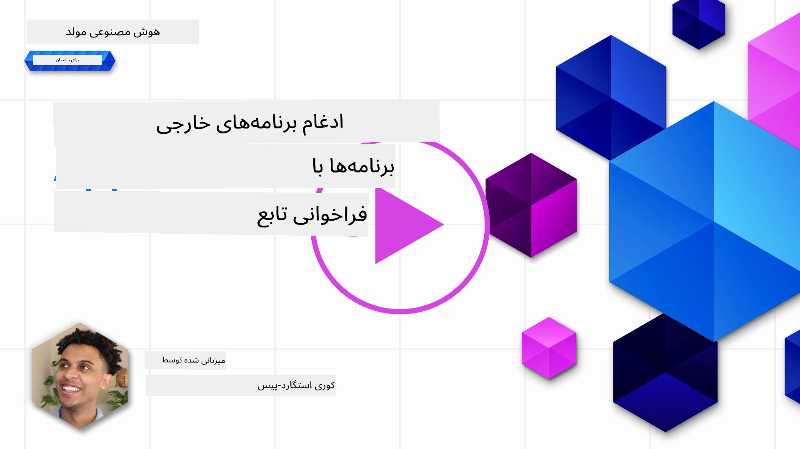
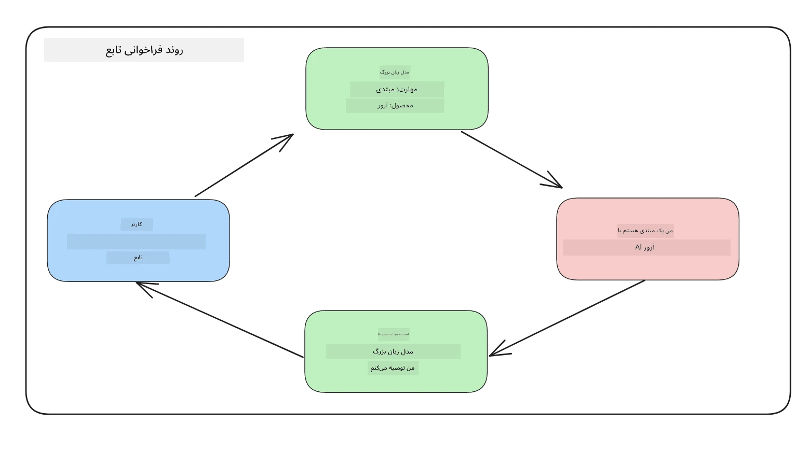
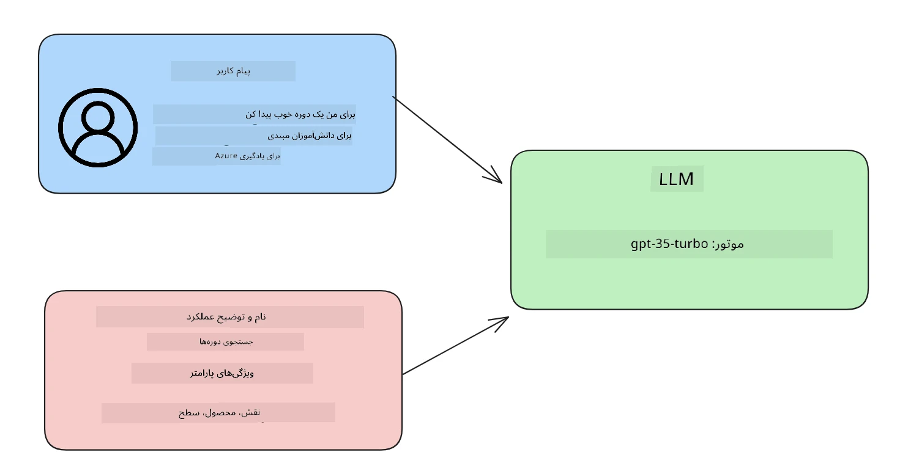

# یکپارچه‌سازی با فراخوانی تابع

[](https://youtu.be/DgUdCLX8qYQ?si=f1ouQU5HQx6F8Gl2)

تا اینجا در درس‌های قبلی مقدار قابل توجهی یاد گرفته‌اید. با این حال، می‌توانیم بیش از این پیشرفت کنیم. برخی مواردی که می‌توانیم به آن‌ها بپردازیم این است که چگونه می‌توانیم قالب پاسخ یکنواخت‌تری داشته باشیم تا کار با پاسخ در مراحل بعدی آسان‌تر شود. همچنین ممکن است بخواهیم داده‌هایی از منابع دیگر اضافه کنیم تا برنامه‌مان غنی‌تر شود.

مسائلی که در بالا ذکر شدند، موضوع این فصل هستند.

## معرفی

این درس پوشش خواهد داد:

- توضیح اینکه فراخوانی تابع چیست و کاربردهای آن.
- ایجاد یک فراخوانی تابع با استفاده از Azure OpenAI.
- نحوه یکپارچه‌سازی فراخوانی تابع در یک برنامه.

## اهداف یادگیری

تا پایان این درس، قادر خواهید بود:

- هدف استفاده از فراخوانی تابع را توضیح دهید.
- راه‌اندازی فراخوانی تابع با استفاده از سرویس Azure OpenAI.
- طراحی فراخوانی‌های مؤثر تابع برای کاربرد برنامه خود.

## سناریو: بهبود چت‌بات ما با توابع

برای این درس، می‌خواهیم ویژگی‌ای برای استارتاپ آموزشی خود بسازیم که به کاربران اجازه دهد با استفاده از چت‌بات دوره‌های فنی را پیدا کنند. ما دوره‌هایی را پیشنهاد خواهیم داد که متناسب با سطح مهارت، نقش فعلی و فناوری مورد علاقه آن‌ها هستند.

برای تکمیل این سناریو، از ترکیبی از موارد زیر استفاده خواهیم کرد:

- `Azure OpenAI` برای ایجاد تجربه چت برای کاربر.
- `Microsoft Learn Catalog API` برای کمک به کاربران در یافتن دوره‌ها بر اساس درخواست‌شان.
- `فراخوانی تابع` برای دریافت پرسش کاربر و ارسال آن به تابع برای انجام درخواست API.

برای شروع، بیایید ببینیم چرا اصلاً بخواهیم از فراخوانی تابع استفاده کنیم:

## چرا فراخوانی تابع

پیش از فراخوانی تابع، پاسخ‌های یک LLM ساختارمند و هماهنگ نبودند. توسعه‌دهندگان مجبور بودند کدهای پیچیده‌ی اعتبارسنجی بنویسند تا مطمئن شوند می‌توانند هر گونه تغییر در پاسخ را کنترل کنند. کاربران نمی‌توانستند پاسخ‌هایی مانند «وضعیت فعلی آب و هوا در استکهلم چیست؟» دریافت کنند. علت این بود که مدل‌ها محدود به زمانی بودند که داده‌ها آموزش دیده بودند.

فراخوانی تابع ویژگی‌ای از سرویس Azure OpenAI است تا محدودیت‌های زیر را برطرف کند:

- **قالب پاسخ یکنواخت**. اگر بتوانیم قالب پاسخ را بهتر کنترل کنیم، می‌توانیم پاسخ را به راحتی به سیستم‌های دیگر پیوند بدهیم.
- **داده‌های خارجی**. قابلیت استفاده از داده‌ها از منابع دیگر برنامه در زمینه چت.

## شرح مشکل از طریق یک سناریو

> توصیه می‌کنیم از [نوت‌بوک همراه](./python/aoai-assignment.ipynb?WT.mc_id=academic-105485-koreyst) استفاده کنید اگر می‌خواهید سناریوی زیر را اجرا کنید. همچنین می‌توانید صرفاً همراه با ما بخوانید تا مشکلی را که توابع می‌توانند در حل آن کمک کنند، شرح دهیم.

بیایید به مثالی نگاه کنیم که مشکل قالب پاسخ را نشان می‌دهد:

فرض کنیم می‌خواهیم پایگاه داده‌ای از اطلاعات دانش‌آموزان بسازیم تا دوره مناسب را به آن‌ها پیشنهاد کنیم. در ادامه دو توصیف از دانش‌آموزان داریم که داده‌های مشابهی دارند.

1. اتصال به منبع Azure OpenAI خود را ایجاد کنید:

   ```python
   import os
   import json
   from openai import OpenAI
   from dotenv import load_dotenv
   load_dotenv()

   # API پاسخ‌ها از طریق نقطه پایانی Azure OpenAI (Microsoft Foundry) نسخه ۱ ارائه می‌شود
   # بنابراین ما کلاینت OpenAI را به <your-endpoint>/openai/v1/ اشاره می‌دهیم.
   endpoint = os.environ['AZURE_OPENAI_ENDPOINT']
   client = OpenAI(
   api_key=os.environ['AZURE_OPENAI_API_KEY'],
   base_url=f"{endpoint.rstrip('/')}/openai/v1/",
   )

   deployment=os.environ['AZURE_OPENAI_DEPLOYMENT']
   ```

   در زیر کد پایتون برای پیکربندی اتصال ما به Azure OpenAI است. چون از نقطه انتهایی v1 استفاده می‌کنیم، فقط لازم است `api_key` و `base_url` را تنظیم کنیم (نیازی به `api_version` نیست).

1. ایجاد دو توصیف دانش‌آموز با استفاده از متغیرهای `student_1_description` و `student_2_description`.

   ```python
   student_1_description="Emily Johnson is a sophomore majoring in computer science at Duke University. She has a 3.7 GPA. Emily is an active member of the university's Chess Club and Debate Team. She hopes to pursue a career in software engineering after graduating."

   student_2_description = "Michael Lee is a sophomore majoring in computer science at Stanford University. He has a 3.8 GPA. Michael is known for his programming skills and is an active member of the university's Robotics Club. He hopes to pursue a career in artificial intelligence after finishing his studies."
   ```

   می‌خواهیم توصیف‌های دانش‌آموز بالا را به یک LLM ارسال کنیم تا داده‌ها را تجزیه کند. این داده‌ها بعداً می‌توانند در برنامه ما استفاده شده و به API ارسال یا در یک پایگاه داده ذخیره شوند.

1. دو درخواست متنی مشابه ایجاد کنیم که به LLM دستور می‌دهد چه اطلاعاتی را استخراج کند:

   ```python
   prompt1 = f'''
   Please extract the following information from the given text and return it as a JSON object:

   name
   major
   school
   grades
   club

   This is the body of text to extract the information from:
   {student_1_description}
   '''

   prompt2 = f'''
   Please extract the following information from the given text and return it as a JSON object:

   name
   major
   school
   grades
   club

   This is the body of text to extract the information from:
   {student_2_description}
   '''
   ```

   درخواست‌های بالا به LLM می‌گویند اطلاعات را استخراج کرده و پاسخ را در قالب JSON بازگرداند.

1. پس از تنظیم درخواست‌ها و اتصال به Azure OpenAI، حالا درخواست‌ها را با استفاده از `client.responses.create` به LLM می‌فرستیم. درخواست‌ها در متغیر `input` قرار می‌گیرند و نقش `user` تعیین می‌شود. این برای شبیه‌سازی پیام نوشته شده توسط کاربر در چت‌بات است.

   ```python
   # پاسخ از درخواست اول
   openai_response1 = client.responses.create(
   model=deployment,
   input = [{'role': 'user', 'content': prompt1}],
   store=False,
   )
   openai_response1.output_text

   # پاسخ از درخواست دوم
   openai_response2 = client.responses.create(
   model=deployment,
   input = [{'role': 'user', 'content': prompt2}],
   store=False,
   )
   openai_response2.output_text
   ```

اکنون می‌توانیم هر دو درخواست را به LLM ارسال کنیم و پاسخ دریافتی را با استفاده از نمونه‌ای مانند `openai_response1.output_text` بررسی کنیم.

1. در نهایت پاسخ را به قالب JSON تبدیل می‌کنیم با فراخوانی `json.loads`:

   ```python
   # بارگذاری پاسخ به عنوان یک شیء JSON
   json_response1 = json.loads(openai_response1.output_text)
   json_response1
   ```

   پاسخ 1:

   ```json
   {
     "name": "Emily Johnson",
     "major": "computer science",
     "school": "Duke University",
     "grades": "3.7",
     "club": "Chess Club"
   }
   ```

   پاسخ 2:

   ```json
   {
     "name": "Michael Lee",
     "major": "computer science",
     "school": "Stanford University",
     "grades": "3.8 GPA",
     "club": "Robotics Club"
   }
   ```

   اگرچه درخواست‌ها یکسان بودند و توصیف‌ها مشابه، مقادیر ویژگی `Grades` با فرمت‌های متفاوتی ارائه شدند، مثلاً گاهی فرمت `3.7` و گاهی `3.7 GPA` دریافت کردیم.

   این نتیجه به خاطر این است که LLM داده‌های غیرساختارمند را بر اساس درخواست متنی می‌گیرد و باز هم داده‌های غیرساختارمند بازمی‌گرداند. ما به قالبی ساختارمند نیاز داریم تا بدانیم هنگام ذخیره یا استفاده از این داده‌ها چه انتظاری داشته باشیم.

پس چگونه مشکل قالب‌بندی را حل کنیم؟ با استفاده از فراخوانی تابع، می‌توانیم مطمئن شویم که داده‌های ساختارمند دریافت می‌کنیم. هنگام استفاده از فراخوانی تابع، LLM در واقع هیچ تابعی را اجرا نمی‌کند. به جای آن، ساختاری ایجاد می‌کنیم که LLM طبق آن پاسخ‌های خود را ارائه دهد. سپس از پاسخ‌های ساختارمند استفاده می‌کنیم تا بدانیم در برنامه‌های خود کدام تابع را اجرا کنیم.



سپس می‌توانیم آنچه از تابع برگشت داده شده است را گرفته و دوباره به LLM ارسال کنیم. LLM سپس به زبان طبیعی پاسخ می‌دهد تا پرسش کاربر را پاسخگو باشد.

## کاربردهای استفاده از فراخوانی تابع

کاربردهای متعدد وجود دارد که فراخوانی تابع می‌تواند برنامه شما را بهبود بخشد، مانند:

- **فراخوانی ابزارهای خارجی**. چت‌بات‌ها در ارائه پاسخ به سوالات کاربران عالی هستند. با فراخوانی تابع، چت‌بات‌ها می‌توانند پیام‌های کاربران را برای انجام برخی کارها استفاده کنند. مثلاً دانش‌آموز می‌تواند از چت‌بات بخواهد که «برای استاد ایمیل بفرست که به کمک بیشتری در این موضوع نیاز دارم». این می‌تواند تابعی با نام `send_email(to: string, body: string)` را فراخوانی کند.

- **ایجاد پرس‌وجوهای API یا پایگاه داده**. کاربران می‌توانند اطلاعات را با زبان طبیعی پیدا کنند که به پرس‌وجو یا درخواست API قالب‌بندی شده تبدیل می‌شود. مثالی از این می‌تواند معلمی باشد که می‌پرسد «دانش‌آموزانی که آخرین تکلیف را انجام داده‌اند چه کسانی هستند؟» که می‌تواند تابعی به نام `get_completed(student_name: string, assignment: int, current_status: string)` را فراخوانی کند.

- **ایجاد داده‌های ساختارمند**. کاربران می‌توانند یک بلوک متن یا CSV گرفته و با استفاده از LLM اطلاعات مهم را استخراج کنند. به عنوان مثال، دانش‌آموزی می‌تواند یک مقاله ویکی‌پدیا درباره توافقات صلح را به فلش‌کارت‌های هوش مصنوعی تبدیل کند. این می‌تواند با استفاده از تابعی به نام `get_important_facts(agreement_name: string, date_signed: string, parties_involved: list)` انجام شود.

## ایجاد اولین فراخوانی تابع خود

فرآیند ایجاد فراخوانی تابع شامل ۳ مرحله اصلی است:

1. **فراخوانی** API پاسخ‌ها با فهرستی از توابع (ابزارها) و پیام کاربر.
2. **خواندن** پاسخ مدل برای انجام کاری مثل اجرای تابع یا فراخوانی API.
3. **ایجاد** فراخوانی دیگری به API پاسخ‌ها با پاسخ تابع شما برای استفاده از آن اطلاعات در پاسخ به کاربر.



### مرحله 1 - ایجاد پیام‌ها

اولین گام ایجاد پیام کاربر است. این می‌تواند به صورت پویا از ورودی متن گرفته شود یا می‌توانید مقداری اینجا تنظیم کنید. اگر برای اولین بار با API پاسخ‌ها کار می‌کنید، باید `role` و `content` پیام را تعریف کنید.

`role` می‌تواند `system` (ایجاد قوانین)، `assistant` (مدل) یا `user` (کاربر نهایی) باشد. برای فراخوانی تابع، ما آن را روی `user` و یک سوال نمونه قرار خواهیم داد.

```python
messages= [ {"role": "user", "content": "Find me a good course for a beginner student to learn Azure."} ]
```

تخصیص نقش‌های مختلف به مدل کمک می‌کند که متوجه شود صحبت‌کننده سیستم است یا کاربر، که به ساخت تاریخچه مکالمه کمک می‌کند تا مدل بتواند بر اساس آن پیش برود.

### مرحله 2 - ایجاد توابع

سپس، تابعی و پارامترهای آن را تعریف خواهیم کرد. در اینجا فقط یک تابع به نام `search_courses` استفاده می‌کنیم، اما می‌توانید توابع متعددی ایجاد کنید.

> **مهم** : توابع در پیام سیستم به LLM اضافه می‌شوند و در میزان توکن‌های موجود شما محاسبه می‌شوند.

در ادامه توابع را به صورت یک آرایه از آیتم‌ها تعریف می‌کنیم. هر آیتم ابزاری در قالب API پاسخ‌ها با ویژگی‌های `type`، `name`، `description` و `parameters` است:

```python
functions = [
   {
      "type":"function",
      "name":"search_courses",
      "description":"Retrieves courses from the search index based on the parameters provided",
      "parameters":{
         "type":"object",
         "properties":{
            "role":{
               "type":"string",
               "description":"The role of the learner (i.e. developer, data scientist, student, etc.)"
            },
            "product":{
               "type":"string",
               "description":"The product that the lesson is covering (i.e. Azure, Power BI, etc.)"
            },
            "level":{
               "type":"string",
               "description":"The level of experience the learner has prior to taking the course (i.e. beginner, intermediate, advanced)"
            }
         },
         "required":[
            "role"
         ]
      }
   }
]
```

بیایید هر نمونه تابع را به تفصیل بیشتر شرح دهیم:

- `name` - نام تابعی که می‌خواهیم فراخوانی شود.
- `description` - توضیح عملکرد تابع. مهم است که مشخص و واضح باشد.
- `parameters` - فهرستی از مقادیر و فرمت‌هایی که می‌خواهید مدل در پاسخ ایجاد کند. آرایه پارامترها شامل آیتم‌هایی است که ویژگی‌های زیر را دارند:
  1.  `type` - نوع داده‌ای که ویژگی‌ها در آن ذخیره می‌شوند.
  1.  `properties` - فهرست مقادیر خاصی که مدل برای پاسخ خود استفاده خواهد کرد.
      1. `name` - کلیدی که نام ویژگی‌ای است که مدل در پاسخ قالب‌بندی شده استفاده می‌کند، مثلا `product`.
      1. `type` - نوع داده این ویژگی، مثلا `string`.
      1. `description` - توضیح ویژگی خاص.

همچنین ویژگی اختیاری `required` وجود دارد - که مشخص می‌کند کدام ویژگی‌ها برای تکمیل فراخوانی تابع ضروری هستند.

### مرحله 3 - انجام فراخوانی تابع

پس از تعریف تابع، باید آن را در فراخوانی API پاسخ‌ها بگنجانیم. این کار با اضافه کردن `tools` به درخواست انجام می‌شود. در این مورد `tools=functions`.

گزینه‌ای هم وجود دارد که `tool_choice` را روی `auto` تنظیم کنید. یعنی اجازه می‌دهیم LLM تصمیم بگیرد کدام تابع باید بر اساس پیام کاربر فراخوانی شود بدون اینکه خودمان تعیین کنیم.

در زیر کدی داریم که `client.responses.create` را فراخوانی می‌کند، توجه کنید که چگونه `tools=functions` و `tool_choice="auto"` تنظیم شده‌اند و بدین ترتیب انتخاب اینکه کی تابع‌ها را فراخوانی کند به LLM داده شده است:

```python
response = client.responses.create(model=deployment,
                                        input=messages,
                                        tools=functions,
                                        tool_choice="auto",
                                        store=False)

print(response.output)
```

پاسخ بازگشتی اکنون در `response.output` شامل آیتم `function_call` است که به این صورت است:

```json
{
  "type": "function_call",
  "name": "search_courses",
  "call_id": "call_abc123",
  "arguments": "{\n  \"role\": \"student\",\n  \"product\": \"Azure\",\n  \"level\": \"beginner\"\n}"
}
```

در اینجا می‌بینیم تابع `search_courses` فراخوانی شده و با چه آرگومان‌هایی، همانطور که در ویژگی `arguments` در پاسخ JSON آمده است.

نتیجه این است که LLM توانست داده‌ها را استخراج کرده و آن‌ها را به آرگومان‌های تابع مپ کند، زیرا داده را از مقدار پارامتر `input` در فراخوانی API پاسخ‌ها استخراج کرده بود. در ادامه یادآوری مقدار `messages` آمده است:

```python
messages= [ {"role": "user", "content": "Find me a good course for a beginner student to learn Azure."} ]
```

همانطور که می‌بینید، `student`، `Azure` و `beginner` از `messages` استخراج شده و به عنوان ورودی به تابع داده شده‌اند. استفاده از توابع به این شکل روش خوبی برای استخراج اطلاعات از یک درخواست متنی و همچنین فراهم کردن ساختار برای LLM و داشتن قابلیت استفاده مجدد است.

حالا باید ببینیم چگونه می‌توانیم این را در برنامه خود استفاده کنیم.

## یکپارچه‌سازی فراخوانی توابع در یک برنامه

پس از آزمایش پاسخ قالب‌بندی شده از LLM، اکنون می‌توانیم آن را در یک برنامه یکپارچه کنیم.

### مدیریت جریان

برای یکپارچه‌سازی در برنامه، مراحل زیر را دنبال می‌کنیم:

1. ابتدا، به سرویس‌های OpenAI فراخوانی می‌کنیم و آیتم‌های فراخوانی تابع را از پاسخ `output` استخراج می‌کنیم.

   ```python
   response_items = response.output
   tool_calls = [item for item in response_items if item.type == "function_call"]
   ```

1. حالا تابعی تعریف می‌کنیم که API مایکروسافت لرن را فراخوانی می‌کند تا فهرستی از دوره‌ها را دریافت کند:

   ```python
   import requests

   def search_courses(role, product, level):
     url = "https://learn.microsoft.com/api/catalog/"
     params = {
        "role": role,
        "product": product,
        "level": level
     }
     response = requests.get(url, params=params)
     modules = response.json()["modules"]
     results = []
     for module in modules[:5]:
        title = module["title"]
        url = module["url"]
        results.append({"title": title, "url": url})
     return str(results)
   ```

   دقت کنید که اکنون یک تابع واقعی پایتون ایجاد می‌کنیم که مطابق نام‌های توابع معرف شده در متغیر `functions` است. همچنین فراخوانی‌های واقعی API خارجی می‌زنیم تا داده‌های لازم را دریافت کنیم. در این مورد، به سراغ API مایکروسافت لرن می‌رویم تا ماژول‌های آموزشی را جستجو کنیم.

خب، ما متغیر `functions` و تابع پایتون متناظر را ساختیم، حال چگونه به LLM بگوییم که این دو را متصل کند تا تابع پایتون ما فراخوانی شود؟

1. برای بررسی اینکه آیا باید تابع پایتون فراخوانی شود، باید پاسخ LLM را نگاه کنیم و ببینیم آیا آیتم `function_call` در آن هست و تابع مشخص شده را فراخوانی کنیم. در زیر روش چک کردن را می‌بینید:

   ```python
   # بررسی کنید که آیا مدل می‌خواهد تابعی را فراخوانی کند
   if tool_calls:
    for tool_call in tool_calls:
     print("Recommended Function call:")
     print(tool_call.name)
     print()

     # تابع را فراخوانی کنید.
     function_name = tool_call.name

     available_functions = {
             "search_courses": search_courses,
     }
     function_to_call = available_functions[function_name]

     function_args = json.loads(tool_call.arguments)
     function_response = function_to_call(**function_args)

     print("Output of function call:")
     print(function_response)
     print(type(function_response))

     # تماس با تابع و نتیجه آن را دوباره به مکالمه اضافه کنید.
     # مورد function_call مدل باید پیش از خروجی آن اضافه شود.
     messages.append(tool_call)  # مورد function_call دستیار
     messages.append( # نتیجه تابع
         {
             "type": "function_call_output",
             "call_id": tool_call.call_id,
             "output": function_response,
         }
     )
   ```

   این سه خط اطمینان می‌دهند که نام تابع، آرگومان‌ها استخراج شده و فراخوانی انجام شود:

   ```python
   function_to_call = available_functions[function_name]

   function_args = json.loads(tool_call.arguments)
   function_response = function_to_call(**function_args)
   ```

   در ادامه خروجی اجرای کد ما آمده است:

   **خروجی**

   ```Recommended Function call:
   {
     "name": "search_courses",
     "arguments": "{\n  \"role\": \"student\",\n  \"product\": \"Azure\",\n  \"level\": \"beginner\"\n}"
   }

   Output of function call:
   [{'title': 'Describe concepts of cryptography', 'url': 'https://learn.microsoft.com/training/modules/describe-concepts-of-cryptography/?
   WT.mc_id=api_CatalogApi'}, {'title': 'Introduction to audio classification with TensorFlow', 'url': 'https://learn.microsoft.com/en-
   us/training/modules/intro-audio-classification-tensorflow/?WT.mc_id=api_CatalogApi'}, {'title': 'Design a Performant Data Model in Azure SQL
   Database with Azure Data Studio', 'url': 'https://learn.microsoft.com/training/modules/design-a-data-model-with-ads/?
   WT.mc_id=api_CatalogApi'}, {'title': 'Getting started with the Microsoft Cloud Adoption Framework for Azure', 'url':
   'https://learn.microsoft.com/training/modules/cloud-adoption-framework-getting-started/?WT.mc_id=api_CatalogApi'}, {'title': 'Set up the
   Rust development environment', 'url': 'https://learn.microsoft.com/training/modules/rust-set-up-environment/?WT.mc_id=api_CatalogApi'}]
   <class 'str'>
   ```

1. اکنون پیام به‌روزشده `messages` را به LLM می‌فرستیم تا پاسخ به زبان طبیعی به جای پاسخ JSON قالب‌بندی شده API دریافت کنیم.

   ```python
   print("Messages in next request:")
   print(messages)
   print()

   second_response = client.responses.create(
      input=messages,
      model=deployment,
      tool_choice="auto",
      tools=functions,
      temperature=0,
      store=False,
         )  # دریافت پاسخ جدید از مدل که می‌تواند پاسخ تابع را ببیند


   print(second_response.output_text)
   ```

   **خروجی**

   ```text
   I found some good courses for beginner students to learn Azure:

   1. [Describe concepts of cryptography](https://learn.microsoft.com/training/modules/describe-concepts-of-cryptography/?WT.mc_id=api_CatalogApi)
   2. [Introduction to audio classification with TensorFlow](https://learn.microsoft.com/training/modules/intro-audio-classification-tensorflow/?WT.mc_id=api_CatalogApi)
   3. [Design a Performant Data Model in Azure SQL Database with Azure Data Studio](https://learn.microsoft.com/training/modules/design-a-data-model-with-ads/?WT.mc_id=api_CatalogApi)
   4. [Getting started with the Microsoft Cloud Adoption Framework for Azure](https://learn.microsoft.com/training/modules/cloud-adoption-framework-getting-started/?WT.mc_id=api_CatalogApi)
   5. [Set up the Rust development environment](https://learn.microsoft.com/training/modules/rust-set-up-environment/?WT.mc_id=api_CatalogApi)

   You can click on the links to access the courses.
   ```

## تمرین

برای ادامه یادگیری فراخوانی تابع در Azure OpenAI می‌توانید موارد زیر را بسازید:

- پارامترهای بیشتر برای تابع که شاید به یادگیرندگان کمک کند دوره‌های بیشتری پیدا کنند.

- ایجاد یک فراخوانی تابع دیگر که اطلاعات بیشتری از یادگیرنده مانند زبان مادری او بگیرد
- ایجاد مدیریت خطا هنگامی که فراخوانی تابع و/یا فراخوانی API هیچ دوره مناسبی را برنگرداند

راهنما: صفحه [مستندات مرجع API یادگیری](https://learn.microsoft.com/training/support/catalog-api-developer-reference?WT.mc_id=academic-105485-koreyst) را دنبال کنید تا ببینید چگونه و کجا این داده‌ها در دسترس است.

## کار عالی! سفر را ادامه دهید

پس از اتمام این درس، مجموعه [یادگیری هوش مصنوعی مولد](https://aka.ms/genai-collection?WT.mc_id=academic-105485-koreyst) ما را بررسی کنید تا دانش هوش مصنوعی مولد خود را ارتقا دهید!

به درس ۱۲ بروید، جایی که به بررسی نحوه [طراحی تجربه کاربری برای برنامه‌های هوش مصنوعی](../12-designing-ux-for-ai-applications/README.md?WT.mc_id=academic-105485-koreyst) می‌پردازیم!

---

<!-- CO-OP TRANSLATOR DISCLAIMER START -->
**سلب مسئولیت**:
این سند با استفاده از سرویس ترجمه هوش مصنوعی [Co-op Translator](https://github.com/Azure/co-op-translator) ترجمه شده است. در حالی که ما در تلاش برای دقت هستیم، لطفاً توجه داشته باشید که ترجمه‌های خودکار ممکن است شامل خطاها یا نادرستی‌هایی باشند. سند اصلی به زبان مادری خود باید به عنوان منبع معتبر در نظر گرفته شود. برای اطلاعات حیاتی، ترجمه حرفه‌ای انسانی توصیه می‌شود. ما در قبال هرگونه سوء تفاهم یا برداشت نادرست ناشی از استفاده از این ترجمه مسئولیتی نداریم.
<!-- CO-OP TRANSLATOR DISCLAIMER END -->