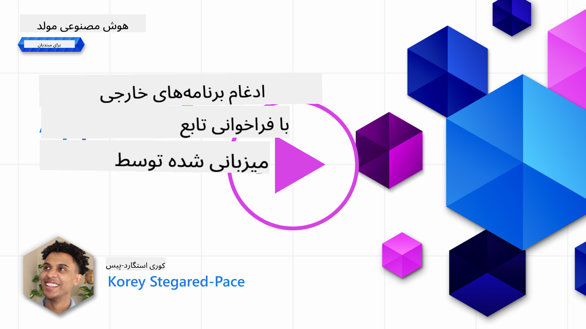
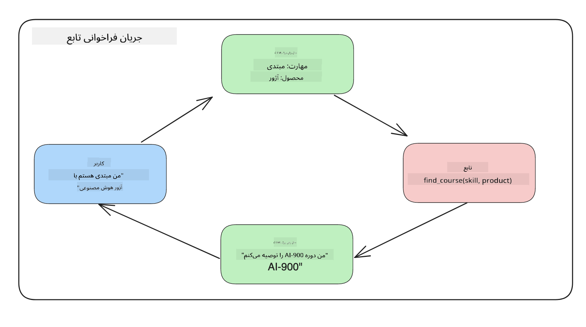

<!--
CO_OP_TRANSLATOR_METADATA:
{
  "original_hash": "77a48a201447be19aa7560706d6f93a0",
  "translation_date": "2025-07-09T14:23:55+00:00",
  "source_file": "11-integrating-with-function-calling/README.md",
  "language_code": "fa"
}
-->
# ادغام با فراخوانی تابع

[](https://aka.ms/gen-ai-lesson11-gh?WT.mc_id=academic-105485-koreyst)

تا اینجا در درس‌های قبلی مطالب زیادی یاد گرفته‌اید. اما می‌توانیم بهتر هم بشویم. برخی مواردی که می‌توانیم بهبود دهیم، نحوه دریافت پاسخ با قالبی یکنواخت‌تر است تا کار با پاسخ در مراحل بعدی آسان‌تر شود. همچنین ممکن است بخواهیم داده‌هایی از منابع دیگر اضافه کنیم تا برنامه‌مان غنی‌تر شود.

مشکلات ذکر شده در بالا، موضوعی است که این فصل به آن می‌پردازد.

## مقدمه

این درس شامل موارد زیر است:

- توضیح اینکه فراخوانی تابع چیست و کاربردهای آن.
- ایجاد یک فراخوانی تابع با استفاده از Azure OpenAI.
- نحوه ادغام فراخوانی تابع در یک برنامه.

## اهداف یادگیری

در پایان این درس، شما قادر خواهید بود:

- هدف استفاده از فراخوانی تابع را توضیح دهید.
- راه‌اندازی فراخوانی تابع با استفاده از سرویس Azure OpenAI.
- طراحی فراخوانی‌های تابع مؤثر برای کاربرد برنامه خود.

## سناریو: بهبود چت‌بات با توابع

برای این درس، می‌خواهیم ویژگی‌ای برای استارتاپ آموزشی خود بسازیم که به کاربران اجازه می‌دهد با استفاده از چت‌بات، دوره‌های فنی را پیدا کنند. ما دوره‌هایی را پیشنهاد می‌دهیم که متناسب با سطح مهارت، نقش فعلی و فناوری مورد علاقه آن‌ها باشد.

برای تکمیل این سناریو، از ترکیبی استفاده خواهیم کرد از:

- `Azure OpenAI` برای ایجاد تجربه چت برای کاربر.
- `Microsoft Learn Catalog API` برای کمک به کاربران در یافتن دوره‌ها بر اساس درخواست آن‌ها.
- `Function Calling` برای دریافت پرسش کاربر و ارسال آن به تابعی برای انجام درخواست API.

برای شروع، بیایید ببینیم چرا اصلاً می‌خواهیم از فراخوانی تابع استفاده کنیم:

## چرا فراخوانی تابع

قبل از فراخوانی تابع، پاسخ‌های یک مدل زبان بزرگ (LLM) ساختارمند و یکنواخت نبودند. توسعه‌دهندگان مجبور بودند کدهای اعتبارسنجی پیچیده‌ای بنویسند تا بتوانند هر نوع پاسخ را مدیریت کنند. کاربران نمی‌توانستند پاسخ‌هایی مانند «وضعیت آب و هوای فعلی در استکهلم چیست؟» دریافت کنند. چون مدل‌ها محدود به داده‌های زمان آموزش بودند.

فراخوانی تابع ویژگی‌ای از سرویس Azure OpenAI است که برای غلبه بر محدودیت‌های زیر طراحی شده است:

- **قالب پاسخ یکنواخت**. اگر بتوانیم قالب پاسخ را بهتر کنترل کنیم، می‌توانیم پاسخ را راحت‌تر در سیستم‌های دیگر استفاده کنیم.
- **داده‌های خارجی**. امکان استفاده از داده‌های منابع دیگر برنامه در زمینه چت.

## نمایش مشکل از طریق یک سناریو

> توصیه می‌کنیم اگر می‌خواهید سناریوی زیر را اجرا کنید، از [دفترچه یادداشت همراه](../../../11-integrating-with-function-calling/python/aoai-assignment.ipynb) استفاده کنید. همچنین می‌توانید فقط مطالعه کنید چون هدف ما نشان دادن مشکلی است که توابع می‌توانند به حل آن کمک کنند.

بیایید مثالی را ببینیم که مشکل قالب پاسخ را نشان می‌دهد:

فرض کنید می‌خواهیم یک پایگاه داده از اطلاعات دانش‌آموزان بسازیم تا بتوانیم دوره مناسب را به آن‌ها پیشنهاد دهیم. در زیر دو توصیف از دانش‌آموزان داریم که داده‌های مشابهی دارند.

1. ایجاد اتصال به منبع Azure OpenAI ما:

   ```python
   import os
   import json
   from openai import AzureOpenAI
   from dotenv import load_dotenv
   load_dotenv()

   client = AzureOpenAI(
   api_key=os.environ['AZURE_OPENAI_API_KEY'],  # this is also the default, it can be omitted
   api_version = "2023-07-01-preview"
   )

   deployment=os.environ['AZURE_OPENAI_DEPLOYMENT']
   ```

   در زیر کد پایتون برای پیکربندی اتصال به Azure OpenAI آمده است که در آن `api_type`، `api_base`، `api_version` و `api_key` تنظیم شده‌اند.

1. ایجاد دو توصیف دانش‌آموز با استفاده از متغیرهای `student_1_description` و `student_2_description`.

   ```python
   student_1_description="Emily Johnson is a sophomore majoring in computer science at Duke University. She has a 3.7 GPA. Emily is an active member of the university's Chess Club and Debate Team. She hopes to pursue a career in software engineering after graduating."

   student_2_description = "Michael Lee is a sophomore majoring in computer science at Stanford University. He has a 3.8 GPA. Michael is known for his programming skills and is an active member of the university's Robotics Club. He hopes to pursue a career in artificial intelligence after finishing his studies."
   ```

   می‌خواهیم این توصیفات دانش‌آموزان را به یک LLM ارسال کنیم تا داده‌ها را تجزیه کند. این داده‌ها بعداً می‌توانند در برنامه ما استفاده شده و به API ارسال یا در پایگاه داده ذخیره شوند.

1. بیایید دو درخواست مشابه بسازیم که در آن‌ها به LLM می‌گوییم به چه اطلاعاتی علاقه‌مندیم:

   ```python
   prompt1 = f'''
   Please extract the following information from the given text and return it as a JSON object:

   name
   major
   school
   grades
   club

   This is the body of text to extract the information from:
   {student_1_description}
   '''

   prompt2 = f'''
   Please extract the following information from the given text and return it as a JSON object:

   name
   major
   school
   grades
   club

   This is the body of text to extract the information from:
   {student_2_description}
   '''
   ```

   درخواست‌های بالا به LLM دستور می‌دهند اطلاعات را استخراج کرده و پاسخ را در قالب JSON بازگرداند.

1. پس از تنظیم درخواست‌ها و اتصال به Azure OpenAI، حالا درخواست‌ها را با استفاده از `openai.ChatCompletion` به LLM ارسال می‌کنیم. درخواست را در متغیر `messages` ذخیره کرده و نقش را `user` تعیین می‌کنیم. این کار برای شبیه‌سازی پیامی است که کاربر به چت‌بات می‌فرستد.

   ```python
   # response from prompt one
   openai_response1 = client.chat.completions.create(
   model=deployment,
   messages = [{'role': 'user', 'content': prompt1}]
   )
   openai_response1.choices[0].message.content

   # response from prompt two
   openai_response2 = client.chat.completions.create(
   model=deployment,
   messages = [{'role': 'user', 'content': prompt2}]
   )
   openai_response2.choices[0].message.content
   ```

حالا می‌توانیم هر دو درخواست را به LLM ارسال کرده و پاسخ دریافتی را با استفاده از `openai_response1['choices'][0]['message']['content']` بررسی کنیم.

1. در نهایت، می‌توانیم پاسخ را با فراخوانی `json.loads` به قالب JSON تبدیل کنیم:

   ```python
   # Loading the response as a JSON object
   json_response1 = json.loads(openai_response1.choices[0].message.content)
   json_response1
   ```

   پاسخ ۱:

   ```json
   {
     "name": "Emily Johnson",
     "major": "computer science",
     "school": "Duke University",
     "grades": "3.7",
     "club": "Chess Club"
   }
   ```

   پاسخ ۲:

   ```json
   {
     "name": "Michael Lee",
     "major": "computer science",
     "school": "Stanford University",
     "grades": "3.8 GPA",
     "club": "Robotics Club"
   }
   ```

   با اینکه درخواست‌ها یکسان و توصیفات مشابه هستند، می‌بینیم که مقادیر ویژگی `Grades` به شکل‌های متفاوتی قالب‌بندی شده‌اند، مثلاً گاهی به صورت `3.7` و گاهی `3.7 GPA`.

   این نتیجه به این دلیل است که LLM داده‌های بدون ساختار را به صورت متن دریافت کرده و داده‌های بدون ساختار هم بازمی‌گرداند. ما نیاز به قالبی ساختارمند داریم تا بدانیم هنگام ذخیره یا استفاده از این داده‌ها چه انتظاری باید داشته باشیم.

پس چگونه مشکل قالب‌بندی را حل کنیم؟ با استفاده از فراخوانی تابع، می‌توانیم مطمئن شویم که داده‌های ساختارمند دریافت می‌کنیم. هنگام استفاده از فراخوانی تابع، LLM در واقع هیچ تابعی را اجرا نمی‌کند. بلکه ساختاری برای پاسخ‌های LLM تعریف می‌کنیم تا آن‌ها را دنبال کند. سپس از این پاسخ‌های ساختارمند برای تعیین تابعی که باید در برنامه اجرا شود، استفاده می‌کنیم.



سپس می‌توانیم خروجی تابع را گرفته و دوباره به LLM ارسال کنیم. LLM سپس با زبان طبیعی به پرسش کاربر پاسخ می‌دهد.

## موارد استفاده از فراخوانی توابع

موارد مختلفی وجود دارد که فراخوانی توابع می‌تواند برنامه شما را بهبود بخشد، مانند:

- **فراخوانی ابزارهای خارجی**. چت‌بات‌ها در پاسخ به سوالات کاربران عالی هستند. با استفاده از فراخوانی تابع، چت‌بات‌ها می‌توانند پیام‌های کاربران را برای انجام کارهای خاصی استفاده کنند. مثلاً دانش‌آموز می‌تواند از چت‌بات بخواهد «برای استاد ایمیل بفرست که به کمک بیشتری در این موضوع نیاز دارم». این می‌تواند یک فراخوانی تابع به `send_email(to: string, body: string)` باشد.

- **ایجاد پرس‌وجوهای API یا پایگاه داده**. کاربران می‌توانند با زبان طبیعی اطلاعاتی را پیدا کنند که به پرس‌وجویی قالب‌بندی شده یا درخواست API تبدیل می‌شود. مثلاً معلمی می‌تواند بپرسد «کدام دانش‌آموزان آخرین تکلیف را انجام داده‌اند» که می‌تواند تابعی به نام `get_completed(student_name: string, assignment: int, current_status: string)` را فراخوانی کند.

- **ایجاد داده‌های ساختارمند**. کاربران می‌توانند یک متن یا فایل CSV را گرفته و از LLM بخواهند اطلاعات مهم را استخراج کند. مثلاً دانش‌آموزی می‌تواند مقاله ویکی‌پدیا درباره توافقات صلح را به کارت‌های فلش هوش مصنوعی تبدیل کند. این کار با استفاده از تابعی به نام `get_important_facts(agreement_name: string, date_signed: string, parties_involved: list)` انجام می‌شود.

## ایجاد اولین فراخوانی تابع خود

فرآیند ایجاد فراخوانی تابع شامل ۳ مرحله اصلی است:

1. **فراخوانی** API تکمیل چت با لیستی از توابع شما و پیام کاربر.
2. **خواندن** پاسخ مدل برای انجام عملی مانند اجرای تابع یا فراخوانی API.
3. **انجام** فراخوانی دیگری به API تکمیل چت با پاسخ تابع برای استفاده از آن اطلاعات در پاسخ به کاربر.


### مرحله ۱ - ایجاد پیام‌ها

اولین مرحله ایجاد پیام کاربر است. این پیام می‌تواند به صورت پویا از ورودی متنی گرفته شود یا می‌توانید مقدار آن را اینجا تعیین کنید. اگر برای اولین بار با API تکمیل چت کار می‌کنید، باید `role` و `content` پیام را تعریف کنیم.

`role` می‌تواند یکی از `system` (ایجاد قوانین)، `assistant` (مدل) یا `user` (کاربر نهایی) باشد. برای فراخوانی تابع، این را `user` تعیین می‌کنیم و یک سوال نمونه می‌نویسیم.

```python
messages= [ {"role": "user", "content": "Find me a good course for a beginner student to learn Azure."} ]
```

با تعیین نقش‌های مختلف، به LLM مشخص می‌کنیم که آیا سیستم چیزی می‌گوید یا کاربر، که به ساخت تاریخچه مکالمه کمک می‌کند.

### مرحله ۲ - ایجاد توابع

سپس تابع و پارامترهای آن را تعریف می‌کنیم. در اینجا فقط یک تابع به نام `search_courses` تعریف می‌کنیم اما می‌توانید چندین تابع بسازید.

> **مهم**: توابع در پیام سیستم به LLM گنجانده می‌شوند و در تعداد توکن‌های در دسترس شما محاسبه می‌شوند.

در زیر، توابع را به صورت آرایه‌ای از آیتم‌ها ایجاد می‌کنیم. هر آیتم یک تابع است و ویژگی‌های `name`، `description` و `parameters` دارد:

```python
functions = [
   {
      "name":"search_courses",
      "description":"Retrieves courses from the search index based on the parameters provided",
      "parameters":{
         "type":"object",
         "properties":{
            "role":{
               "type":"string",
               "description":"The role of the learner (i.e. developer, data scientist, student, etc.)"
            },
            "product":{
               "type":"string",
               "description":"The product that the lesson is covering (i.e. Azure, Power BI, etc.)"
            },
            "level":{
               "type":"string",
               "description":"The level of experience the learner has prior to taking the course (i.e. beginner, intermediate, advanced)"
            }
         },
         "required":[
            "role"
         ]
      }
   }
]
```

بیایید هر مورد تابع را دقیق‌تر توضیح دهیم:

- `name` - نام تابعی که می‌خواهیم فراخوانی شود.
- `description` - توضیحی درباره عملکرد تابع. در اینجا باید واضح و دقیق باشید.
- `parameters` - لیستی از مقادیر و قالبی که می‌خواهید مدل در پاسخ خود تولید کند. آرایه پارامترها شامل آیتم‌هایی است که ویژگی‌های زیر را دارند:
  1. `type` - نوع داده‌ای که ویژگی‌ها در آن ذخیره می‌شوند.
  2. `properties` - لیستی از مقادیر خاصی که مدل برای پاسخ خود استفاده می‌کند:
      1. `name` - کلید نام ویژگی است که مدل در پاسخ قالب‌بندی شده استفاده می‌کند، مثلاً `product`.
      2. `type` - نوع داده این ویژگی، مثلاً `string`.
      3. `description` - توضیح ویژگی خاص.

همچنین ویژگی اختیاری `required` وجود دارد که مشخص می‌کند کدام ویژگی‌ها برای تکمیل فراخوانی تابع ضروری هستند.

### مرحله ۳ - انجام فراخوانی تابع

پس از تعریف تابع، باید آن را در فراخوانی API تکمیل چت وارد کنیم. این کار با افزودن `functions` به درخواست انجام می‌شود. در اینجا `functions=functions` است.

همچنین گزینه‌ای برای تنظیم `function_call` به `auto` وجود دارد. این یعنی اجازه می‌دهیم LLM تصمیم بگیرد کدام تابع باید بر اساس پیام کاربر فراخوانی شود، نه اینکه خودمان تعیین کنیم.

کد زیر را ببینید که در آن `ChatCompletion.create` فراخوانی شده است، توجه کنید که چگونه `functions=functions` و `function_call="auto"` تنظیم شده‌اند و به LLM اجازه داده شده که زمان فراخوانی توابع را انتخاب کند:

```python
response = client.chat.completions.create(model=deployment,
                                        messages=messages,
                                        functions=functions,
                                        function_call="auto")

print(response.choices[0].message)
```

پاسخ دریافتی اکنون به این شکل است:

```json
{
  "role": "assistant",
  "function_call": {
    "name": "search_courses",
    "arguments": "{\n  \"role\": \"student\",\n  \"product\": \"Azure\",\n  \"level\": \"beginner\"\n}"
  }
}
```

در اینجا می‌بینیم که تابع `search_courses` فراخوانی شده و با چه آرگومان‌هایی، که در ویژگی `arguments` در پاسخ JSON آمده است.

نتیجه این است که LLM توانسته داده‌ها را استخراج کند تا با آرگومان‌های تابع مطابقت داشته باشد، چون آن‌ها را از مقدار `messages` در فراخوانی تکمیل چت گرفته است. در زیر یادآوری مقدار `messages` آمده است:

```python
messages= [ {"role": "user", "content": "Find me a good course for a beginner student to learn Azure."} ]
```

همانطور که می‌بینید، `student`، `Azure` و `beginner` از `messages` استخراج شده و به عنوان ورودی به تابع داده شده‌اند. استفاده از توابع به این شکل، راهی عالی برای استخراج اطلاعات از یک درخواست است و همچنین ساختاردهی به LLM و داشتن قابلیت استفاده مجدد را فراهم می‌کند.

حالا باید ببینیم چگونه می‌توانیم این را در برنامه خود استفاده کنیم.

## ادغام فراخوانی توابع در یک برنامه

پس از آزمایش پاسخ قالب‌بندی شده از LLM، حالا می‌توانیم آن را در یک برنامه ادغام کنیم.

### مدیریت جریان

برای ادغام این در برنامه، مراحل زیر را انجام می‌دهیم:

1. ابتدا فراخوانی به سرویس‌های OpenAI را انجام داده و پیام را در متغیری به نام `response_message` ذخیره می‌کنیم.

   ```python
   response_message = response.choices[0].message
   ```

1. حالا تابعی تعریف می‌کنیم که API Microsoft Learn را برای دریافت لیست دوره‌ها فراخوانی می‌کند:

   ```python
   import requests

   def search_courses(role, product, level):
     url = "https://learn.microsoft.com/api/catalog/"
     params = {
        "role": role,
        "product": product,
        "level": level
     }
     response = requests.get(url, params=params)
     modules = response.json()["modules"]
     results = []
     for module in modules[:5]:
        title = module["title"]
        url = module["url"]
        results.append({"title": title, "url": url})
     return str(results)
   ```

   توجه کنید که اکنون یک تابع واقعی پایتون ایجاد می‌کنیم که به نام‌های توابع معرفی شده در متغیر `functions` نگاشت می‌شود. همچنین فراخوانی‌های واقعی API خارجی برای دریافت داده‌ها انجام می‌دهیم. در این مورد، به API Microsoft Learn مراجعه می‌کنیم تا ماژول‌های آموزشی را جستجو کنیم.

خب، متغیر `functions` و تابع پایتون مربوطه را ساختیم، حالا چگونه به LLM می‌گوییم که این دو را به هم مرتبط کند تا تابع پایتون ما فراخوانی شود؟

1. برای اینکه ببینیم آیا باید تابع پایتون را فراخوانی کنیم، باید پاسخ LLM را بررسی کنیم و ببینیم آیا `function_call` در آن وجود دارد و تابع مشخص شده را فراخوانی کنیم. در زیر نحوه انجام این بررسی آمده است:

   ```python
   # Check if the model wants to call a function
   if response_message.function_call.name:
    print("Recommended Function call:")
    print(response_message.function_call.name)
    print()

    # Call the function.
    function_name = response_message.function_call.name

    available_functions = {
            "search_courses": search_courses,
    }
    function_to_call = available_functions[function_name]

    function_args = json.loads(response_message.function_call.arguments)
    function_response = function_to_call(**function_args)

    print("Output of function call:")
    print(function_response)
    print(type(function_response))


    # Add the assistant response and function response to the messages
    messages.append( # adding assistant response to messages
        {
            "role": response_message.role,
            "function_call": {
                "name": function_name,
                "arguments": response_message.function_call.arguments,
            },
            "content": None
        }
    )
    messages.append( # adding function response to messages
        {
            "role": "function",
            "name": function_name,
            "content":function_response,
        }
    )
   ```

   این سه خط تضمین می‌کند که نام تابع، آرگومان‌ها استخراج شده و فراخوانی انجام شود:

   ```python
   function_to_call = available_functions[function_name]

   function_args = json.loads(response_message.function_call.arguments)
   function_response = function_to_call(**function_args)
   ```

   در زیر خروجی اجرای کد ما آمده است:

   **خروجی**

   ```Recommended Function call:
   {
     "name": "search_courses",
     "arguments": "{\n  \"role\": \"student\",\n  \"product\": \"Azure\",\n  \"level\": \"beginner\"\n}"
   }

   Output of function call:
   [{'title': 'Describe concepts of cryptography', 'url': 'https://learn.microsoft.com/training/modules/describe-concepts-of-cryptography/?
   WT.mc_id=api_CatalogApi'}, {'title': 'Introduction to audio classification with TensorFlow', 'url': 'https://learn.microsoft.com/en-
   us/training/modules/intro-audio-classification-tensorflow/?WT.mc_id=api_CatalogApi'}, {'title': 'Design a Performant Data Model in Azure SQL
   Database with Azure Data Studio', 'url': 'https://learn.microsoft.com/training/modules/design-a-data-model-with-ads/?
   WT.mc_id=api_CatalogApi'}, {'title': 'Getting started with the Microsoft Cloud Adoption Framework for Azure', 'url':
   'https://learn.microsoft.com/training/modules/cloud-adoption-framework-getting-started/?WT.mc_id=api_CatalogApi'}, {'title': 'Set up the
   Rust development environment', 'url': 'https://learn.microsoft.com/training/modules/rust-set-up-environment/?WT.mc_id=api_CatalogApi'}]
   <class 'str'>
   ```

1. حالا پیام به‌روزشده، `messages` را به LLM ارسال می‌کنیم تا پاسخ به زبان طبیعی دریافت کنیم، نه پاسخ قالب‌بندی شده JSON از API.

   ```python
   print("Messages in next request:")
   print(messages)
   print()

   second_response = client.chat.completions.create(
      messages=messages,
      model=deployment,
      function_call="auto",
      functions=functions,
      temperature=0
         )  # get a new response from GPT where it can see the function response


   print(second_response.choices[0].message)
   ```

   **خروجی**

   ```python
   {
     "role": "assistant",
     "content": "I found some good courses for beginner students to learn Azure:\n\n1. [Describe concepts of cryptography] (https://learn.microsoft.com/training/modules/describe-concepts-of-cryptography/?WT.mc_id=api_CatalogApi)\n2. [Introduction to audio classification with TensorFlow](https://learn.microsoft.com/training/modules/intro-audio-classification-tensorflow/?WT.mc_id=api_CatalogApi)\n3. [Design a Performant Data Model in Azure SQL Database with Azure Data Studio](https://learn.microsoft.com/training/modules/design-a-data-model-with-ads/?WT.mc_id=api_CatalogApi)\n4. [Getting started with the Microsoft Cloud Adoption Framework for Azure](https://learn.microsoft.com/training/modules/cloud-adoption-framework-getting-started/?WT.mc_id=api_CatalogApi)\n5. [Set up the Rust development environment](https://learn.microsoft.com/training/modules/rust-set-up-environment/?WT.mc_id=api_CatalogApi)\n\nYou can click on the links to access the courses."
   }

   ```

## تمرین

برای ادامه یادگیری فراخوانی تابع Azure OpenAI می‌توانید موارد زیر را بسازید:

- افزودن پارامترهای بیشتر به تابع که ممکن است به یادگیرندگان کمک کند دوره‌های بیشتری پیدا کنند.
- ایجاد فراخوانی تابع دیگری که اطلاعات بیشتری از یادگیرنده مانند زبان مادری او دریافت کند.
- ایجاد مدیریت خطا زمانی که فراخوانی تابع و/یا فراخوانی API هیچ دوره مناسبی بازنگرداند.
## کار عالی! به مسیر ادامه دهید

پس از اتمام این درس، مجموعه [یادگیری هوش مصنوعی مولد](https://aka.ms/genai-collection?WT.mc_id=academic-105485-koreyst) ما را بررسی کنید تا دانش خود در زمینه هوش مصنوعی مولد را ارتقا دهید!

به درس ۱۲ بروید، جایی که به بررسی نحوه [طراحی تجربه کاربری برای برنامه‌های هوش مصنوعی](../12-designing-ux-for-ai-applications/README.md?WT.mc_id=academic-105485-koreyst) می‌پردازیم!

**سلب مسئولیت**:  
این سند با استفاده از سرویس ترجمه هوش مصنوعی [Co-op Translator](https://github.com/Azure/co-op-translator) ترجمه شده است. در حالی که ما در تلاش برای دقت هستیم، لطفاً توجه داشته باشید که ترجمه‌های خودکار ممکن است حاوی خطاها یا نادرستی‌هایی باشند. سند اصلی به زبان بومی خود باید به عنوان منبع معتبر در نظر گرفته شود. برای اطلاعات حیاتی، ترجمه حرفه‌ای انسانی توصیه می‌شود. ما مسئول هیچ گونه سوءتفاهم یا تفسیر نادرستی که از استفاده این ترجمه ناشی شود، نیستیم.