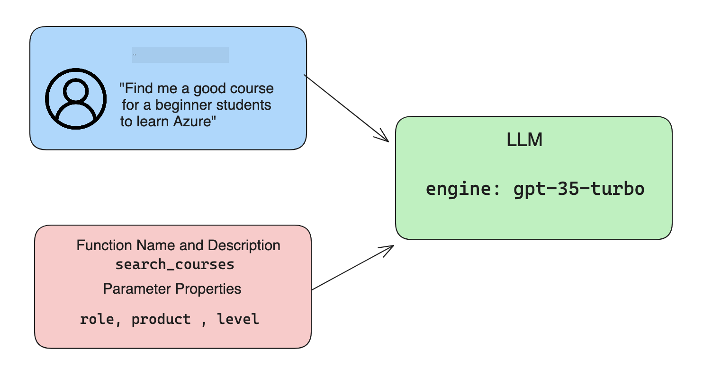

<!--
CO_OP_TRANSLATOR_METADATA:
{
  "original_hash": "f6f84f9ef2d066cd25850cab93580a50",
  "translation_date": "2025-10-17T23:08:12+00:00",
  "source_file": "11-integrating-with-function-calling/README.md",
  "language_code": "fa"
}
-->
# ادغام با فراخوانی تابع

[](https://youtu.be/DgUdCLX8qYQ?si=f1ouQU5HQx6F8Gl2)

تا اینجا در درس‌های قبلی چیزهای زیادی یاد گرفته‌اید. با این حال، می‌توانیم بیشتر پیشرفت کنیم. برخی از مواردی که می‌توانیم به آن‌ها بپردازیم این است که چگونه می‌توانیم یک قالب پاسخ سازگارتر ایجاد کنیم تا کار با پاسخ در مراحل بعدی آسان‌تر شود. همچنین ممکن است بخواهیم داده‌هایی از منابع دیگر اضافه کنیم تا برنامه خود را بیشتر غنی کنیم.

مشکلات ذکر شده در بالا مواردی هستند که این فصل به دنبال حل آن‌ها است.

## مقدمه

این درس شامل موارد زیر خواهد بود:

- توضیح اینکه فراخوانی تابع چیست و موارد استفاده آن چیست.
- ایجاد یک فراخوانی تابع با استفاده از Azure OpenAI.
- نحوه ادغام یک فراخوانی تابع در یک برنامه.

## اهداف یادگیری

در پایان این درس، شما قادر خواهید بود:

- هدف استفاده از فراخوانی تابع را توضیح دهید.
- تنظیم فراخوانی تابع با استفاده از سرویس Azure OpenAI.
- طراحی فراخوانی‌های تابع مؤثر برای موارد استفاده برنامه خود.

## سناریو: بهبود چت‌بات ما با استفاده از توابع

برای این درس، می‌خواهیم یک ویژگی برای استارتاپ آموزشی خود ایجاد کنیم که به کاربران اجازه دهد از یک چت‌بات برای یافتن دوره‌های فنی استفاده کنند. ما دوره‌هایی را پیشنهاد می‌دهیم که با سطح مهارت، نقش فعلی و فناوری مورد علاقه آن‌ها مطابقت داشته باشد.

برای تکمیل این سناریو، از ترکیبی از موارد زیر استفاده خواهیم کرد:

- `Azure OpenAI` برای ایجاد یک تجربه چت برای کاربر.
- `Microsoft Learn Catalog API` برای کمک به کاربران در یافتن دوره‌ها بر اساس درخواست آن‌ها.
- `Function Calling` برای گرفتن پرسش کاربر و ارسال آن به یک تابع برای انجام درخواست API.

برای شروع، بیایید ببینیم چرا اصلاً می‌خواهیم از فراخوانی تابع استفاده کنیم:

## چرا فراخوانی تابع

قبل از فراخوانی تابع، پاسخ‌های یک مدل زبان بزرگ (LLM) غیرساختاریافته و ناسازگار بودند. توسعه‌دهندگان مجبور بودند کدهای اعتبارسنجی پیچیده‌ای بنویسند تا مطمئن شوند که می‌توانند هر نوع پاسخ را مدیریت کنند. کاربران نمی‌توانستند پاسخ‌هایی مانند "وضعیت فعلی آب و هوا در استکهلم چیست؟" دریافت کنند. این به این دلیل است که مدل‌ها محدود به زمانی بودند که داده‌ها آموزش داده شده بودند.

فراخوانی تابع یک ویژگی از سرویس Azure OpenAI است که برای غلبه بر محدودیت‌های زیر طراحی شده است:

- **قالب پاسخ سازگار**. اگر بتوانیم قالب پاسخ را بهتر کنترل کنیم، می‌توانیم پاسخ را به راحتی در مراحل بعدی با سیستم‌های دیگر ادغام کنیم.
- **داده‌های خارجی**. امکان استفاده از داده‌های منابع دیگر یک برنامه در زمینه چت.

## توضیح مشکل از طریق یک سناریو

> توصیه می‌کنیم از [دفترچه یادداشت موجود](./python/aoai-assignment.ipynb?WT.mc_id=academic-105485-koreyst) استفاده کنید اگر می‌خواهید سناریوی زیر را اجرا کنید. همچنین می‌توانید فقط بخوانید، زیرا ما سعی داریم مشکلی را که توابع می‌توانند به حل آن کمک کنند، توضیح دهیم.

بیایید به مثالی نگاه کنیم که مشکل قالب‌بندی پاسخ را نشان می‌دهد:

فرض کنید می‌خواهیم یک پایگاه داده از داده‌های دانش‌آموزان ایجاد کنیم تا بتوانیم دوره مناسب را به آن‌ها پیشنهاد دهیم. در زیر دو توضیح از دانش‌آموزان داریم که در داده‌هایی که شامل می‌شوند بسیار مشابه هستند.

1. اتصال به منبع Azure OpenAI خود را ایجاد کنید:

   ```python
   import os
   import json
   from openai import AzureOpenAI
   from dotenv import load_dotenv
   load_dotenv()

   client = AzureOpenAI(
   api_key=os.environ['AZURE_OPENAI_API_KEY'],  # this is also the default, it can be omitted
   api_version = "2023-07-01-preview"
   )

   deployment=os.environ['AZURE_OPENAI_DEPLOYMENT']
   ```

   در زیر کدی از پایتون برای پیکربندی اتصال ما به Azure OpenAI وجود دارد که در آن `api_type`، `api_base`، `api_version` و `api_key` را تنظیم می‌کنیم.

1. ایجاد دو توضیح دانش‌آموز با استفاده از متغیرهای `student_1_description` و `student_2_description`.

   ```python
   student_1_description="Emily Johnson is a sophomore majoring in computer science at Duke University. She has a 3.7 GPA. Emily is an active member of the university's Chess Club and Debate Team. She hopes to pursue a career in software engineering after graduating."

   student_2_description = "Michael Lee is a sophomore majoring in computer science at Stanford University. He has a 3.8 GPA. Michael is known for his programming skills and is an active member of the university's Robotics Club. He hopes to pursue a career in artificial intelligence after finishing his studies."
   ```

   می‌خواهیم توضیحات دانش‌آموزان بالا را به یک مدل زبان بزرگ (LLM) ارسال کنیم تا داده‌ها را تجزیه و تحلیل کند. این داده‌ها بعداً می‌توانند در برنامه ما استفاده شوند و به یک API ارسال شوند یا در یک پایگاه داده ذخیره شوند.

1. بیایید دو درخواست مشابه ایجاد کنیم که در آن‌ها به مدل زبان بزرگ دستور می‌دهیم چه اطلاعاتی مورد نظر ما است:

   ```python
   prompt1 = f'''
   Please extract the following information from the given text and return it as a JSON object:

   name
   major
   school
   grades
   club

   This is the body of text to extract the information from:
   {student_1_description}
   '''

   prompt2 = f'''
   Please extract the following information from the given text and return it as a JSON object:

   name
   major
   school
   grades
   club

   This is the body of text to extract the information from:
   {student_2_description}
   '''
   ```

   درخواست‌های بالا به مدل زبان بزرگ دستور می‌دهند که اطلاعات را استخراج کند و پاسخ را در قالب JSON بازگرداند.

1. پس از تنظیم درخواست‌ها و اتصال به Azure OpenAI، اکنون درخواست‌ها را به مدل زبان بزرگ ارسال می‌کنیم با استفاده از `openai.ChatCompletion`. ما درخواست را در متغیر `messages` ذخیره می‌کنیم و نقش را به `user` اختصاص می‌دهیم. این برای شبیه‌سازی یک پیام از کاربر است که به یک چت‌بات نوشته شده است.

   ```python
   # response from prompt one
   openai_response1 = client.chat.completions.create(
   model=deployment,
   messages = [{'role': 'user', 'content': prompt1}]
   )
   openai_response1.choices[0].message.content

   # response from prompt two
   openai_response2 = client.chat.completions.create(
   model=deployment,
   messages = [{'role': 'user', 'content': prompt2}]
   )
   openai_response2.choices[0].message.content
   ```

اکنون می‌توانیم هر دو درخواست را به مدل زبان بزرگ ارسال کنیم و پاسخ دریافتی را بررسی کنیم با یافتن آن به این صورت `openai_response1['choices'][0]['message']['content']`.

1. در نهایت، می‌توانیم پاسخ را به قالب JSON تبدیل کنیم با فراخوانی `json.loads`:

   ```python
   # Loading the response as a JSON object
   json_response1 = json.loads(openai_response1.choices[0].message.content)
   json_response1
   ```

   پاسخ 1:

   ```json
   {
     "name": "Emily Johnson",
     "major": "computer science",
     "school": "Duke University",
     "grades": "3.7",
     "club": "Chess Club"
   }
   ```

   پاسخ 2:

   ```json
   {
     "name": "Michael Lee",
     "major": "computer science",
     "school": "Stanford University",
     "grades": "3.8 GPA",
     "club": "Robotics Club"
   }
   ```

   حتی با وجود اینکه درخواست‌ها مشابه هستند و توضیحات مشابهی دارند، می‌بینیم که مقادیر خاصیت `Grades` به صورت متفاوتی قالب‌بندی شده‌اند، به طوری که گاهی قالب `3.7` یا `3.7 GPA` را دریافت می‌کنیم.

   این نتیجه به این دلیل است که مدل زبان بزرگ داده‌های غیرساختاریافته را به صورت درخواست نوشته شده دریافت می‌کند و همچنین داده‌های غیرساختاریافته را بازمی‌گرداند. ما نیاز به یک قالب ساختاریافته داریم تا بدانیم هنگام ذخیره یا استفاده از این داده‌ها چه انتظاری داریم.

پس چگونه مشکل قالب‌بندی را حل کنیم؟ با استفاده از فراخوانی تابع، می‌توانیم مطمئن شویم که داده‌های ساختاریافته دریافت می‌کنیم. هنگام استفاده از فراخوانی تابع، مدل زبان بزرگ در واقع هیچ تابعی را فراخوانی یا اجرا نمی‌کند. در عوض، ما یک ساختار برای مدل زبان بزرگ ایجاد می‌کنیم تا برای پاسخ‌های خود از آن پیروی کند. سپس از آن پاسخ‌های ساختاریافته استفاده می‌کنیم تا بدانیم چه تابعی را در برنامه‌های خود اجرا کنیم.


سپس می‌توانیم آنچه از تابع بازگردانده شده است را گرفته و آن را به مدل زبان بزرگ ارسال کنیم. مدل زبان بزرگ سپس با استفاده از زبان طبیعی به پرسش کاربر پاسخ خواهد داد.

## موارد استفاده از فراخوانی توابع

موارد استفاده مختلفی وجود دارد که در آن‌ها فراخوانی توابع می‌تواند برنامه شما را بهبود بخشد، مانند:

- **فراخوانی ابزارهای خارجی**. چت‌بات‌ها در ارائه پاسخ به پرسش‌های کاربران عالی هستند. با استفاده از فراخوانی توابع، چت‌بات‌ها می‌توانند از پیام‌های کاربران برای انجام وظایف خاص استفاده کنند. به عنوان مثال، یک دانش‌آموز می‌تواند از چت‌بات بخواهد "یک ایمیل به استاد من ارسال کن و بگو که من نیاز به کمک بیشتری در این موضوع دارم". این می‌تواند یک فراخوانی تابع به `send_email(to: string, body: string)` انجام دهد.

- **ایجاد درخواست‌های API یا پایگاه داده**. کاربران می‌توانند اطلاعات را با استفاده از زبان طبیعی پیدا کنند که به یک درخواست قالب‌بندی شده یا درخواست API تبدیل می‌شود. به عنوان مثال، یک معلم می‌تواند درخواست کند "چه کسانی از دانش‌آموزان آخرین تکلیف را انجام داده‌اند" که می‌تواند یک تابع به نام `get_completed(student_name: string, assignment: int, current_status: string)` را فراخوانی کند.

- **ایجاد داده‌های ساختاریافته**. کاربران می‌توانند یک بلوک متن یا فایل CSV را بگیرند و از مدل زبان بزرگ برای استخراج اطلاعات مهم از آن استفاده کنند. به عنوان مثال، یک دانش‌آموز می‌تواند یک مقاله ویکی‌پدیا درباره توافق‌نامه‌های صلح را تبدیل کند تا کارت‌های فلش هوش مصنوعی ایجاد کند. این می‌تواند با استفاده از یک تابع به نام `get_important_facts(agreement_name: string, date_signed: string, parties_involved: list)` انجام شود.

## ایجاد اولین فراخوانی تابع خود

فرآیند ایجاد یک فراخوانی تابع شامل 3 مرحله اصلی است:

1. **فراخوانی** API تکمیل چت با لیستی از توابع شما و یک پیام کاربر.
2. **خواندن** پاسخ مدل برای انجام یک عمل، یعنی اجرای یک تابع یا درخواست API.
3. **ایجاد** یک فراخوانی دیگر به API تکمیل چت با پاسخ از تابع شما برای استفاده از آن اطلاعات برای ایجاد یک پاسخ به کاربر.



### مرحله 1 - ایجاد پیام‌ها

اولین مرحله ایجاد یک پیام کاربر است. این می‌تواند به صورت پویا با گرفتن مقدار یک ورودی متنی اختصاص داده شود یا می‌توانید در اینجا یک مقدار اختصاص دهید. اگر این اولین بار است که با API تکمیل چت کار می‌کنید، باید `role` و `content` پیام را تعریف کنید.

`role` می‌تواند `system` (ایجاد قوانین)، `assistant` (مدل) یا `user` (کاربر نهایی) باشد. برای فراخوانی تابع، ما آن را به عنوان `user` اختصاص می‌دهیم و یک مثال از پرسش را ارائه می‌دهیم.

```python
messages= [ {"role": "user", "content": "Find me a good course for a beginner student to learn Azure."} ]
```

با اختصاص نقش‌های مختلف، برای مدل زبان بزرگ مشخص می‌شود که آیا سیستم چیزی می‌گوید یا کاربر، که به ساخت تاریخچه مکالمه کمک می‌کند تا مدل زبان بزرگ بتواند بر اساس آن پاسخ دهد.

### مرحله 2 - ایجاد توابع

بعد، ما یک تابع و پارامترهای آن را تعریف می‌کنیم. در اینجا فقط یک تابع به نام `search_courses` ایجاد می‌کنیم، اما می‌توانید چندین تابع ایجاد کنید.

> **مهم**: توابع در پیام سیستم به مدل زبان بزرگ گنجانده شده‌اند و در تعداد توکن‌های موجود شما لحاظ می‌شوند.

در زیر، توابع را به صورت یک آرایه از آیتم‌ها ایجاد می‌کنیم. هر آیتم یک تابع است و دارای ویژگی‌های `name`، `description` و `parameters` است:

```python
functions = [
   {
      "name":"search_courses",
      "description":"Retrieves courses from the search index based on the parameters provided",
      "parameters":{
         "type":"object",
         "properties":{
            "role":{
               "type":"string",
               "description":"The role of the learner (i.e. developer, data scientist, student, etc.)"
            },
            "product":{
               "type":"string",
               "description":"The product that the lesson is covering (i.e. Azure, Power BI, etc.)"
            },
            "level":{
               "type":"string",
               "description":"The level of experience the learner has prior to taking the course (i.e. beginner, intermediate, advanced)"
            }
         },
         "required":[
            "role"
         ]
      }
   }
]
```

بیایید هر نمونه تابع را بیشتر توضیح دهیم:

- `name` - نام تابعی که می‌خواهیم فراخوانی شود.
- `description` - این توضیحی است که نشان می‌دهد تابع چگونه کار می‌کند. در اینجا مهم است که دقیق و واضح باشید.
- `parameters` - لیستی از مقادیر و قالبی که می‌خواهید مدل زبان بزرگ برای پاسخ خود تولید کند. آرایه پارامترها شامل آیتم‌هایی است که این آیتم‌ها دارای ویژگی‌های زیر هستند:
  1.  `type` - نوع داده‌ای که ویژگی‌ها در آن ذخیره می‌شوند.
  1.  `properties` - لیستی از مقادیر خاصی که مدل زبان بزرگ برای پاسخ خود استفاده خواهد کرد.
      1. `name` - کلید نام ویژگی که مدل زبان بزرگ برای پاسخ قالب‌بندی شده خود استفاده خواهد کرد، به عنوان مثال، `product`.
      1. `type` - نوع داده این ویژگی، به عنوان مثال، `string`.
      1. `description` - توضیح ویژگی خاص.

همچنین یک ویژگی اختیاری `required` وجود دارد - ویژگی مورد نیاز برای تکمیل فراخوانی تابع.

### مرحله 3 - انجام فراخوانی تابع

پس از تعریف یک تابع، اکنون باید آن را در فراخوانی به API تکمیل چت گنجانده شود. این کار را با افزودن `functions` به درخواست انجام می‌دهیم. در این حالت `functions=functions`.

همچنین گزینه‌ای برای تنظیم `function_call` به `auto` وجود دارد. این بدان معناست که ما به مدل زبان بزرگ اجازه می‌دهیم تصمیم بگیرد که کدام تابع باید بر اساس پیام کاربر فراخوانی شود، به جای اینکه خودمان آن را اختصاص دهیم.

در اینجا کدی وجود دارد که در آن `ChatCompletion.create` را فراخوانی می‌کنیم، توجه کنید که چگونه `functions=functions` و `function_call="auto"` را تنظیم می‌کنیم و به مدل زبان بزرگ اجازه می‌دهیم تصمیم بگیرد که چه زمانی توابعی که به آن ارائه می‌دهیم را فراخوانی کند:

```python
response = client.chat.completions.create(model=deployment,
                                        messages=messages,
                                        functions=functions,
                                        function_call="auto")

print(response.choices[0].message)
```

پاسخ بازگشتی اکنون به این صورت است:

```json
{
  "role": "assistant",
  "function_call": {
    "name": "search_courses",
    "arguments": "{\n  \"role\": \"student\",\n  \"product\": \"Azure\",\n  \"level\": \"beginner\"\n}"
  }
}
```

در اینجا می‌توانیم ببینیم که تابع `search_courses` فراخوانی شده است و با چه آرگومان‌هایی، همانطور که در ویژگی `arguments` در پاسخ JSON ذکر شده است.

نتیجه این است که مدل زبان بزرگ توانست داده‌ها را برای مطابقت با آرگومان‌های تابع پیدا کند، زیرا آن را از مقدار ارائه شده به پارامتر `messages` در فراخوانی تکمیل چت استخراج کرده است. در زیر یادآوری مقدار `messages` آمده است:

```python
messages= [ {"role": "user", "content": "Find me a good course for a beginner student to learn Azure."} ]
```

همانطور که می‌بینید، `student`، `Azure` و `beginner` از `messages` استخراج شده و به عنوان ورودی به تابع تنظیم شده‌اند. استفاده از توابع به این روش یک راه عالی برای استخراج اطلاعات از یک درخواست است، اما همچنین برای ارائه ساختار به مدل زبان بزرگ و داشتن قابلیت‌های قابل استفاده مجدد.

بعد، باید ببینیم چگونه می‌توانیم این را در برنامه خود استفاده کنیم.

## ادغام فراخوانی توابع در یک برنامه

پس از آزمایش پاسخ قالب‌بندی شده از مدل زبان بزرگ، اکنون می‌توانیم این را در یک برنامه ادغام کنیم.

### مدیریت جریان

برای ادغام این در برنامه خود، مراحل زیر را انجام دهید:

1. ابتدا، فراخوانی به سرویس‌های OpenAI انجام دهید و پیام را در یک متغیر به نام `response_message` ذخیره کنید.

   ```python
   response_message = response.choices[0].message
   ```

1. اکنون تابعی را تعریف می‌کنیم که API Microsoft Learn را فراخوانی کند تا لیستی از دوره‌ها را دریافت کند:

   ```python
   import requests

   def search_courses(role, product, level):
     url = "https://learn.microsoft.com/api/catalog/"
     params = {
        "role": role,
        "product": product,
        "level": level
     }
     response = requests.get(url, params=params)
     modules = response.json()["modules"]
     results = []
     for module in modules[:5]:
        title = module["title"]
        url = module["url"]
        results.append({"title": title, "url": url})
     return str(results)
   ```

   توجه کنید که اکنون یک تابع واقعی پایتون ایجاد می‌کنیم که با نام‌های توابع معرفی شده در متغیر `functions` مطابقت دارد. همچنین فراخوانی‌های واقعی API خارجی انجام می‌دهیم تا داده‌هایی را که نیاز داریم دریافت کنیم. در این حالت، ما به API Microsoft Learn مراجعه می‌کنیم تا ماژول‌های آموزشی را جستجو کنیم.

خب، ما متغیرهای `functions` و یک تابع پایتون مربوطه ایجاد کردیم، چگونه به مدل زبان بزرگ بگوییم که این دو را به هم مرتبط کند تا تابع پایتون ما فراخوانی شود؟

1. برای دیدن اینکه آیا نیاز به فراخوانی یک تابع پایتون داریم، باید به پاسخ مدل زبان بزرگ نگاه کنیم و ببینیم آیا `function_call` بخشی از آن است و تابع مشخص شده را فراخوانی کنیم. در اینجا نحوه انجام بررسی ذکر شده آمده است:

   ```python
   # Check if the model wants to call a function
   if response_message.function_call.name:
    print("Recommended Function call:")
    print(response_message.function_call.name)
    print()

    # Call the function.
    function_name = response_message.function_call.name

    available_functions = {
            "search_courses": search_courses,
    }
    function_to_call = available_functions[function_name]

    function_args = json.loads(response_message.function_call.arguments)
    function_response = function_to_call(**function_args)

    print("Output of function call:")
    print(function_response)
    print(type(function_response))


    # Add the assistant response and function response to the messages
    messages.append( # adding assistant response to messages
        {
            "role": response_message.role,
            "function_call": {
                "name": function_name,
                "arguments": response_message.function_call.arguments,
            },
            "content": None
        }
    )
    messages.append( # adding function response to messages
        {
            "role": "function",
            "name": function_name,
            "content":function_response,
        }
    )
   ```

   این سه خط، اطمینان حاصل می‌کنند که نام تابع، آرگومان‌ها را استخراج کرده و فراخوانی را انجام می‌دهند:

   ```python
   function_to_call = available_functions[function_name]

   function_args = json.loads(response_message.function_call.arguments)
   function_response = function_to_call(**function_args)
   ```

   در زیر خروجی اجرای کد ما آمده است:

   **خروجی**

   ```Recommended Function call:
   {
     "name": "search_courses",
     "arguments": "{\n  \"role\": \"student\",\n  \"product\": \"Azure\",\n  \"level\": \"beginner\"\n}"
   }

   Output of function call:
   [{'title': 'Describe concepts of cryptography', 'url': 'https://learn.microsoft.com/training/modules/describe-concepts-of-cryptography/?
   WT.mc_id=api_CatalogApi'}, {'title': 'Introduction to audio classification with TensorFlow', 'url': 'https://learn.microsoft.com/en-
   us/training/modules/intro-audio-classification-tensorflow/?WT.mc_id=api_CatalogApi'}, {'title': 'Design a Performant Data Model in Azure SQL
   Database with Azure Data Studio', 'url': 'https://learn.microsoft.com/training/modules/design-a-data-model-with-ads/?
   WT.mc_id=api_CatalogApi'}, {'title': 'Getting started with the Microsoft Cloud Adoption Framework for Azure', 'url':
   'https://learn.microsoft.com/training/modules/cloud-adoption-framework-getting-started/?WT.mc_id=api_CatalogApi'}, {'title': 'Set up the
   Rust development environment', 'url': 'https://learn.microsoft.com/training/modules/rust-set-up-environment/?WT.mc_id=api_CatalogApi'}]
   <class 'str'>
   ```

1. اکنون پیام به‌روزرسانی شده، `messages` را به مدل زبان بزرگ ارسال می‌کنیم تا بتوانیم یک پاسخ به زبان طبیعی دریافت کنیم به جای یک پاسخ قالب‌بندی شده JSON API.

   ```python
   print("Messages in next request:")
   print(messages)
   print()

   second_response = client.chat.completions.create(
      messages=messages,
      model=deployment,
      function_call="auto",
      functions=functions,
      temperature=0
         )  # get a new response from GPT where it can see the function response


   print(second_response.choices[0].message)
   ```

   **خروجی**

   ```python
   {
     "role": "assistant",
     "content": "I found some good courses for beginner students to learn Azure:\n\n1. [Describe concepts of cryptography] (https://learn.microsoft.com/training/modules/describe-concepts-of-cryptography/?WT.mc_id=api_CatalogApi)\n2. [Introduction to audio classification with TensorFlow](https://learn.microsoft.com/training/modules/intro-audio-classification-tensorflow/?WT.mc_id=api_CatalogApi)\n3. [Design a Performant Data Model in Azure SQL Database with Azure Data Studio](https://learn.microsoft.com/training/modules/design-a-data-model-with-ads/?WT.mc_id=api_CatalogApi)\n4. [Getting started with the Microsoft Cloud Adoption Framework for Azure](https://learn.microsoft.com/training/modules/cloud-adoption-framework-getting-started/?WT.mc_id=api_CatalogApi)\n5. [Set up the Rust development environment](https://learn.microsoft.com/training/modules/rust-set-up-environment/?WT.mc_id=api_CatalogApi)\n\nYou can click on the links to access the courses."
   }

   ```

## تکلیف

برای ادامه یادگیری فراخوانی توابع Azure OpenAI می‌توانید:

- پارامترهای بیشتری برای تابع ایجاد کنید که ممکن است به یادگیرندگان کمک کند دوره‌های بیشتری پیدا کنند.
- یک فراخوانی تابع دیگر ایجاد کنید که اطلاعات بیشتری از یادگیرنده مانند زبان مادری آن‌ها بگیرد.
- ایجاد مدیریت خطا زمانی که فراخوانی تابع و/یا فراخوانی API هیچ دوره مناسبی را برنگرداند

نکته: صفحه [مستندات مرجع API Learn](https://learn.microsoft.com/training/support/catalog-api-developer-reference?WT.mc_id=academic-105485-koreyst) را بررسی کنید تا ببینید این داده‌ها چگونه و کجا در دسترس هستند.

## کار عالی! سفر را ادامه دهید

پس از اتمام این درس، مجموعه [آموزش هوش مصنوعی مولد](https://aka.ms/genai-collection?WT.mc_id=academic-105485-koreyst) ما را بررسی کنید تا دانش خود را در زمینه هوش مصنوعی مولد ارتقا دهید!

به درس ۱۲ بروید، جایی که به بررسی نحوه [طراحی تجربه کاربری برای برنامه‌های هوش مصنوعی](../12-designing-ux-for-ai-applications/README.md?WT.mc_id=academic-105485-koreyst) خواهیم پرداخت!

---

**سلب مسئولیت**:  
این سند با استفاده از سرویس ترجمه هوش مصنوعی [Co-op Translator](https://github.com/Azure/co-op-translator) ترجمه شده است. در حالی که ما تلاش می‌کنیم دقت را حفظ کنیم، لطفاً توجه داشته باشید که ترجمه‌های خودکار ممکن است شامل خطاها یا نادرستی‌ها باشند. سند اصلی به زبان اصلی آن باید به عنوان منبع معتبر در نظر گرفته شود. برای اطلاعات حیاتی، ترجمه حرفه‌ای انسانی توصیه می‌شود. ما مسئولیتی در قبال سوء تفاهم‌ها یا تفسیرهای نادرست ناشی از استفاده از این ترجمه نداریم.