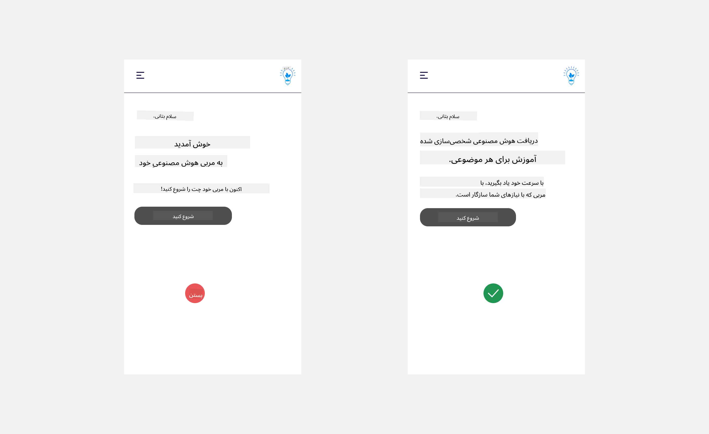
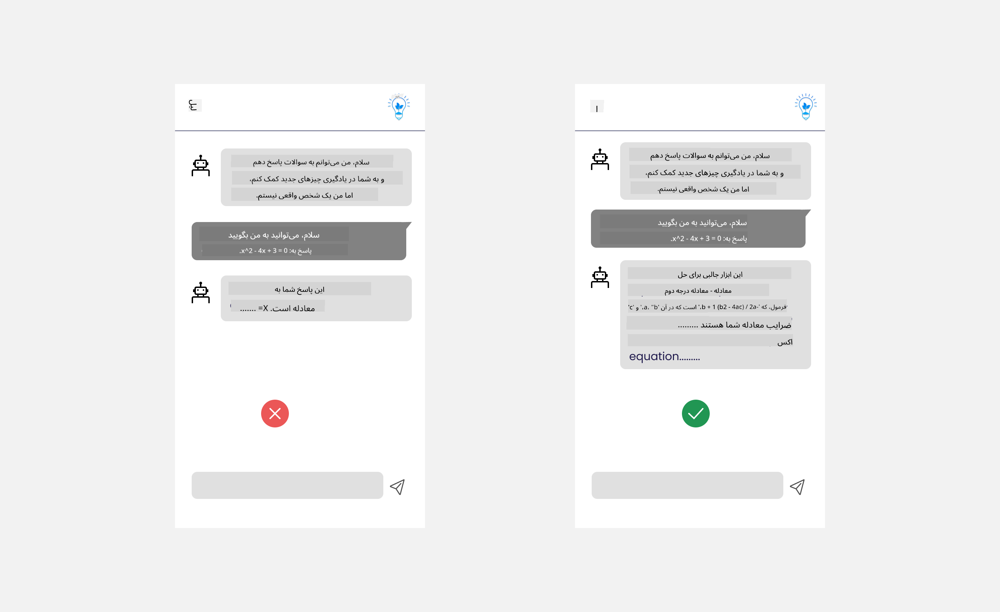
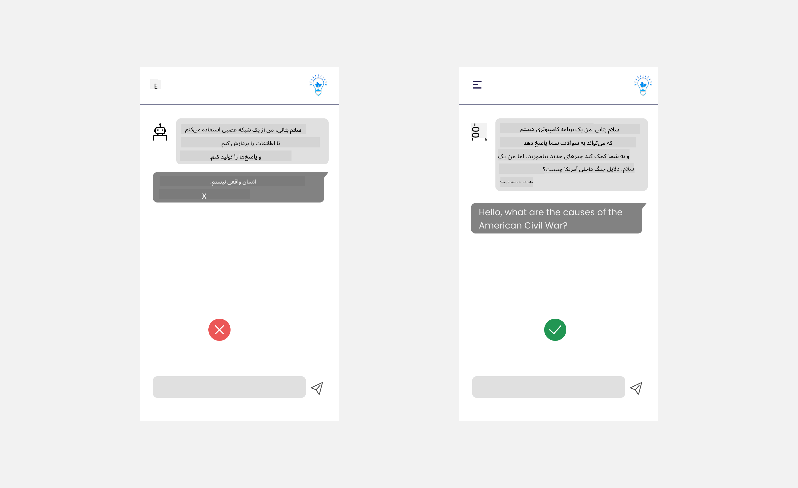
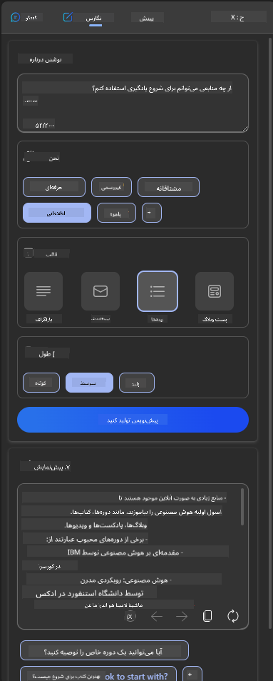
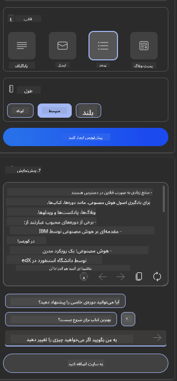
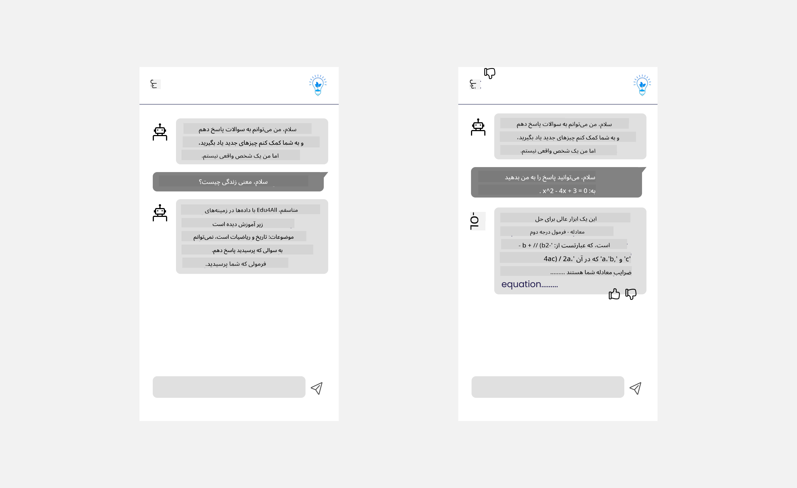

<!--
CO_OP_TRANSLATOR_METADATA:
{
  "original_hash": "ec385b41ee50579025d50cc03bfb3a25",
  "translation_date": "2025-06-25T20:10:54+00:00",
  "source_file": "12-designing-ux-for-ai-applications/README.md",
  "language_code": "fa"
}
-->
# طراحی تجربه کاربری برای برنامه‌های هوش مصنوعی

> _(برای مشاهده ویدئوی این درس روی تصویر بالا کلیک کنید)_

تجربه کاربری یک جنبه بسیار مهم در ساخت برنامه‌ها است. کاربران باید بتوانند برنامه شما را به‌صورت کارآمد برای انجام وظایف استفاده کنند. کارآمد بودن یک چیز است اما شما همچنین باید برنامه‌هایی طراحی کنید که توسط همه قابل استفاده باشند تا آن‌ها را _قابل دسترس_ کنید. این فصل بر روی این زمینه تمرکز خواهد کرد تا امیدواریم شما برنامه‌ای طراحی کنید که مردم بتوانند و بخواهند از آن استفاده کنند.

## مقدمه

تجربه کاربری نحوه تعامل و استفاده یک کاربر از یک محصول یا خدمات خاص، چه یک سیستم، ابزار یا طراحی باشد. هنگام توسعه برنامه‌های هوش مصنوعی، توسعه‌دهندگان نه تنها بر اطمینان از اینکه تجربه کاربری مؤثر است تمرکز می‌کنند بلکه بر اخلاق نیز توجه دارند. در این درس، نحوه ساخت برنامه‌های هوش مصنوعی که نیازهای کاربران را برآورده می‌کنند، پوشش داده می‌شود.

درس به موارد زیر می‌پردازد:

- مقدمه‌ای بر تجربه کاربری و درک نیازهای کاربران
- طراحی برنامه‌های هوش مصنوعی برای اعتماد و شفافیت
- طراحی برنامه‌های هوش مصنوعی برای همکاری و بازخورد

## اهداف یادگیری

پس از گذراندن این درس، شما قادر خواهید بود:

- درک کنید چگونه برنامه‌های هوش مصنوعی بسازید که نیازهای کاربران را برآورده کنند.
- برنامه‌های هوش مصنوعی طراحی کنید که اعتماد و همکاری را ترویج دهند.

### پیش‌نیاز

زمانی را صرف کنید و بیشتر درباره [تجربه کاربری و تفکر طراحی](https://learn.microsoft.com/training/modules/ux-design?WT.mc_id=academic-105485-koreyst) بخوانید.

## مقدمه‌ای بر تجربه کاربری و درک نیازهای کاربران

در استارتاپ آموزشی خیالی ما، دو کاربر اصلی داریم: معلمان و دانش‌آموزان. هر یک از این دو کاربر نیازهای منحصر به فردی دارند. طراحی متمرکز بر کاربر اولویت را به کاربر می‌دهد و اطمینان حاصل می‌کند که محصولات برای کسانی که قصد استفاده از آن‌ها را دارند، مرتبط و سودمند هستند.

برنامه باید **مفید، قابل اعتماد، قابل دسترس و لذت‌بخش** باشد تا تجربه کاربری خوبی ارائه دهد.

### قابلیت استفاده

مفید بودن به این معناست که برنامه دارای قابلیت‌هایی است که با هدف مورد نظر آن مطابقت دارد، مانند اتوماتیک کردن فرآیند نمره‌دهی یا تولید کارت‌های مرور برای بازبینی. یک برنامه که فرآیند نمره‌دهی را اتوماتیک می‌کند باید بتواند به‌طور دقیق و کارآمد نمرات را به کارهای دانش‌آموزان براساس معیارهای تعریف‌شده اختصاص دهد. به‌طور مشابه، یک برنامه که کارت‌های مرور تولید می‌کند باید بتواند سوالات مرتبط و متنوعی براساس داده‌های خود ایجاد کند.

### قابلیت اطمینان

قابل اعتماد بودن به این معناست که برنامه می‌تواند وظیفه خود را به‌طور مداوم و بدون خطا انجام دهد. با این حال، هوش مصنوعی مانند انسان‌ها کامل نیست و ممکن است مستعد خطا باشد. برنامه‌ها ممکن است با خطاها یا موقعیت‌های غیرمنتظره‌ای مواجه شوند که نیاز به دخالت یا اصلاح انسانی دارند. چگونه با خطاها برخورد می‌کنید؟ در بخش آخر این درس، ما پوشش خواهیم داد که چگونه سیستم‌ها و برنامه‌های هوش مصنوعی برای همکاری و بازخورد طراحی شده‌اند.

### قابلیت دسترسی

قابل دسترس بودن به معنای گسترش تجربه کاربری به کاربران با توانایی‌های مختلف، از جمله کسانی که دارای معلولیت هستند، است و اطمینان حاصل می‌کند که هیچ‌کس کنار گذاشته نمی‌شود. با دنبال کردن راهنمایی‌ها و اصول دسترسی، راه‌حل‌های هوش مصنوعی بیشتر فراگیر، قابل استفاده و سودمند برای همه کاربران می‌شوند.

### لذت‌بخش بودن

لذت‌بخش بودن به معنای این است که استفاده از برنامه خوشایند است. یک تجربه کاربری جذاب می‌تواند تاثیر مثبتی بر کاربر داشته باشد و او را تشویق به بازگشت به برنامه و افزایش درآمد کسب‌وکار کند.

هر چالشی نمی‌تواند با هوش مصنوعی حل شود. هوش مصنوعی به منظور بهبود تجربه کاربری شما وارد می‌شود، چه اتوماتیک کردن وظایف دستی یا شخصی‌سازی تجربیات کاربر.

## طراحی برنامه‌های هوش مصنوعی برای اعتماد و شفافیت

ایجاد اعتماد هنگام طراحی برنامه‌های هوش مصنوعی بسیار مهم است. اعتماد اطمینان می‌دهد که کاربر مطمئن است برنامه کار را انجام خواهد داد، به‌طور مداوم نتایج را ارائه می‌دهد و نتایج همان چیزی است که کاربر نیاز دارد. یک خطر در این زمینه بی‌اعتمادی و اعتماد بیش از حد است. بی‌اعتمادی زمانی رخ می‌دهد که کاربر اعتماد کمی به سیستم هوش مصنوعی دارد یا اصلاً اعتماد ندارد، که منجر به رد برنامه شما توسط کاربر می‌شود. اعتماد بیش از حد زمانی رخ می‌دهد که کاربر قابلیت‌های سیستم هوش مصنوعی را بیش از حد ارزیابی کند، که منجر به اعتماد بیش از حد کاربران به سیستم هوش مصنوعی می‌شود. به‌عنوان مثال، یک سیستم نمره‌دهی اتوماتیک در صورت اعتماد بیش از حد ممکن است منجر به عدم بررسی دقیق برخی از مقالات توسط معلم شود تا اطمینان حاصل کند که سیستم نمره‌دهی به خوبی کار می‌کند. این می‌تواند منجر به نمرات ناعادلانه یا نادرست برای دانش‌آموزان شود یا فرصت‌های بازخورد و بهبود از دست برود.

دو راه برای اطمینان از اینکه اعتماد در مرکز طراحی قرار می‌گیرد، توضیح‌پذیری و کنترل است.

### توضیح‌پذیری

هنگامی که هوش مصنوعی به تصمیم‌گیری‌ها مانند انتقال دانش به نسل‌های آینده کمک می‌کند، برای معلمان و والدین مهم است که درک کنند چگونه تصمیمات هوش مصنوعی گرفته می‌شود. این توضیح‌پذیری است - درک اینکه چگونه برنامه‌های هوش مصنوعی تصمیم‌گیری می‌کنند. طراحی برای توضیح‌پذیری شامل افزودن جزئیات و مثال‌هایی از آنچه یک برنامه هوش مصنوعی می‌تواند انجام دهد است. به‌عنوان مثال، به‌جای "شروع با معلم هوش مصنوعی"، سیستم می‌تواند استفاده کند: "یادداشت‌های خود را برای بازبینی آسان‌تر با استفاده از هوش مصنوعی خلاصه کنید."

یک مثال دیگر این است که چگونه هوش مصنوعی از داده‌های کاربر و شخصی استفاده می‌کند. به‌عنوان مثال، یک کاربر با شخصیت دانش‌آموز ممکن است محدودیت‌هایی براساس شخصیت خود داشته باشد. هوش مصنوعی ممکن است نتواند پاسخ‌های سوالات را افشا کند اما ممکن است به کاربر کمک کند تا فکر کند چگونه می‌تواند یک مسئله را حل کند.

یک بخش کلیدی دیگر از توضیح‌پذیری ساده‌سازی توضیحات است. دانش‌آموزان و معلمان ممکن است متخصص هوش مصنوعی نباشند، بنابراین توضیحات درباره آنچه برنامه می‌تواند یا نمی‌تواند انجام دهد باید ساده و آسان برای درک باشد.

### کنترل

هوش مصنوعی مولد همکاری بین هوش مصنوعی و کاربر ایجاد می‌کند، جایی که به‌عنوان مثال کاربر می‌تواند پیام‌ها را برای نتایج مختلف تغییر دهد. علاوه بر این، هنگامی که یک خروجی تولید می‌شود، کاربران باید بتوانند نتایج را تغییر دهند و به آن‌ها احساس کنترل بدهند. به‌عنوان مثال، هنگام استفاده از Bing، شما می‌توانید پیام خود را براساس فرمت، لحن و طول تنظیم کنید. علاوه بر این، شما می‌توانید تغییرات به خروجی خود اضافه کنید و خروجی را تغییر دهید همان‌طور که در زیر نشان داده شده است:

یک ویژگی دیگر در Bing که به کاربر اجازه می‌دهد کنترل بر برنامه داشته باشد، توانایی انتخاب ورود و خروج از داده‌هایی است که هوش مصنوعی استفاده می‌کند. برای یک برنامه مدرسه، یک دانش‌آموز ممکن است بخواهد از یادداشت‌های خود و همچنین منابع معلم به‌عنوان مواد بازبینی استفاده کند.

> هنگام طراحی برنامه‌های هوش مصنوعی، عمدی بودن کلید است تا اطمینان حاصل شود کاربران اعتماد بیش از حد نداشته باشند و انتظارات غیرواقعی از قابلیت‌های آن نداشته باشند. یکی از راه‌ها برای انجام این کار ایجاد اصطکاک بین پیام‌ها و نتایج است. یادآوری به کاربر، که این هوش مصنوعی است و نه یک انسان دیگر

## طراحی برنامه‌های هوش مصنوعی برای همکاری و بازخورد

همان‌طور که قبلاً ذکر شد، هوش مصنوعی مولد همکاری بین کاربر و هوش مصنوعی ایجاد می‌کند. اکثر تعاملات با یک کاربر وارد کردن یک پیام و هوش مصنوعی تولید یک خروجی است. اگر خروجی نادرست باشد چه می‌شود؟ چگونه برنامه با خطاها برخورد می‌کند اگر رخ دهند؟ آیا هوش مصنوعی کاربر را مقصر می‌داند یا وقت می‌گذارد تا خطا را توضیح دهد؟

برنامه‌های هوش مصنوعی باید به گونه‌ای ساخته شوند که بتوانند بازخورد دریافت و ارائه دهند. این نه تنها به سیستم هوش مصنوعی کمک می‌کند تا بهبود یابد بلکه اعتماد کاربران را نیز افزایش می‌دهد. یک حلقه بازخورد باید در طراحی گنجانده شود، یک مثال می‌تواند یک ساده لایک یا دیس‌لایک بر روی خروجی باشد.

راه دیگری برای برخورد با این موضوع این است که به‌طور واضح قابلیت‌ها و محدودیت‌های سیستم را بیان کنید. هنگامی که یک کاربر خطا می‌کند و چیزی فراتر از قابلیت‌های هوش مصنوعی درخواست می‌کند، باید راهی برای برخورد با این موضوع وجود داشته باشد، همان‌طور که در زیر نشان داده شده است.

خطاهای سیستم با برنامه‌هایی که کاربر ممکن است به اطلاعات خارج از حوزه هوش مصنوعی نیاز داشته باشد یا برنامه ممکن است محدودیتی در تعداد سوالات/موضوعاتی که یک کاربر می‌تواند خلاصه‌ها ایجاد کند، رایج است. به‌عنوان مثال، یک برنامه هوش مصنوعی که با داده‌های محدود به موضوعات خاص مانند تاریخ و ریاضی آموزش داده شده است ممکن است نتواند سوالات مربوط به جغرافیا را پاسخ دهد. برای کاهش این موضوع، سیستم هوش مصنوعی می‌تواند پاسخی مانند: "متاسفم، محصول ما با داده‌های در موضوعات زیر آموزش داده شده است.....، نمی‌توانم به سوالی که پرسیدید پاسخ دهم."

برنامه‌های هوش مصنوعی کامل نیستند، بنابراین، آن‌ها مستعد خطا هستند. هنگام طراحی برنامه‌های خود، باید اطمینان حاصل کنید که فضایی برای بازخورد از کاربران و برخورد با خطاها به روشی ساده و قابل توضیح ایجاد کنید.

## تکلیف

هر برنامه هوش مصنوعی که تاکنون ساخته‌اید را بگیرید و مراحل زیر را در برنامه خود در نظر بگیرید:

- **لذت‌بخش بودن:** در نظر بگیرید که چگونه می‌توانید برنامه خود را لذت‌بخش‌تر کنید. آیا شما در همه جا توضیحات اضافه می‌کنید؟ آیا کاربران را تشویق به کاوش می‌کنید؟ چگونه پیام‌های خطا را بیان می‌کنید؟

- **قابلیت استفاده:** ساخت یک برنامه وب. اطمینان حاصل کنید که برنامه شما با هر دو ماوس و کیبورد قابل پیمایش است.

- **اعتماد و شفافیت:** به هوش مصنوعی و خروجی آن کاملاً اعتماد نکنید، در نظر بگیرید که چگونه می‌توانید یک انسان را به فرآیند اضافه کنید تا خروجی را تایید کند. همچنین، راه‌های دیگر برای دستیابی به اعتماد و شفافیت را در نظر بگیرید و اجرا کنید.

- **کنترل:** به کاربر کنترل داده‌هایی که به برنامه ارائه می‌کند بدهید. راهی برای انتخاب ورود و خروج از جمع‌آوری داده‌ها در برنامه هوش مصنوعی اجرا کنید.

## ادامه یادگیری خود!

پس از تکمیل این درس، مجموعه [یادگیری هوش مصنوعی مولد](https://aka.ms/genai-collection?WT.mc_id=academic-105485-koreyst) ما را بررسی کنید تا به ارتقاء دانش هوش مصنوعی مولد خود ادامه دهید!

به درس 13 بروید، جایی که ما به نحوه [ایمن‌سازی برنامه‌های هوش مصنوعی](../13-securing-ai-applications/README.md?WT.mc_id=academic-105485-koreyst) خواهیم پرداخت!

**سلب مسئولیت**:  
این سند با استفاده از سرویس ترجمه هوش مصنوعی [Co-op Translator](https://github.com/Azure/co-op-translator) ترجمه شده است. در حالی که ما برای دقت تلاش می‌کنیم، لطفاً توجه داشته باشید که ترجمه‌های خودکار ممکن است حاوی اشتباهات یا نادرستی‌ها باشند. سند اصلی به زبان مادری باید به عنوان منبع معتبر در نظر گرفته شود. برای اطلاعات حیاتی، ترجمه حرفه‌ای انسانی توصیه می‌شود. ما مسئولیتی در قبال سوء تفاهم‌ها یا تفسیرهای نادرست ناشی از استفاده از این ترجمه نداریم.