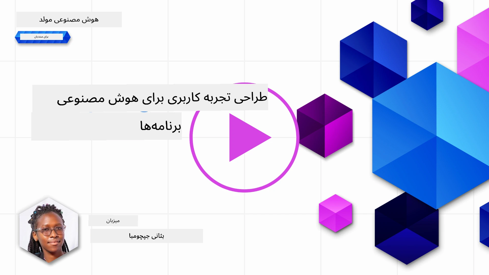
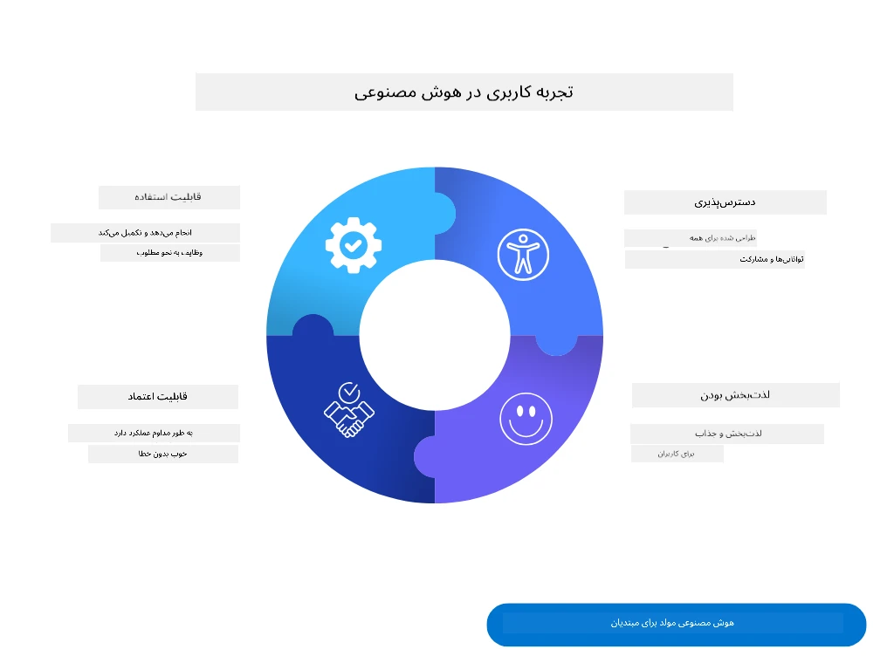
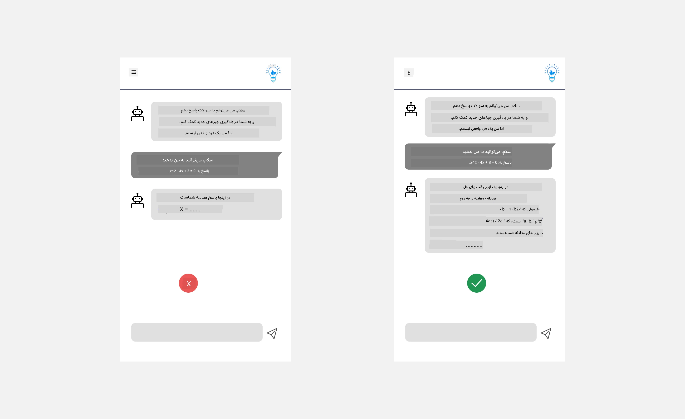
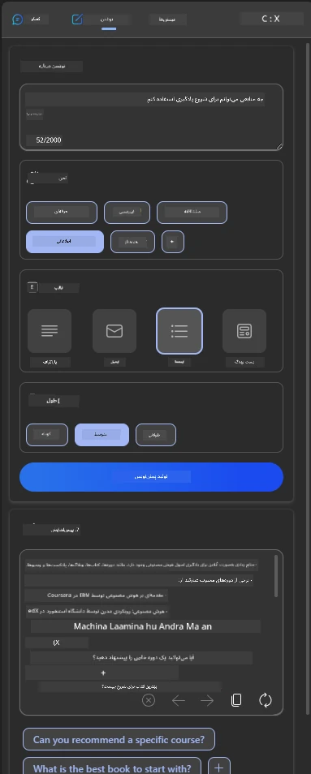
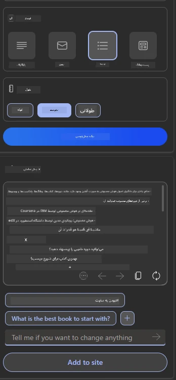
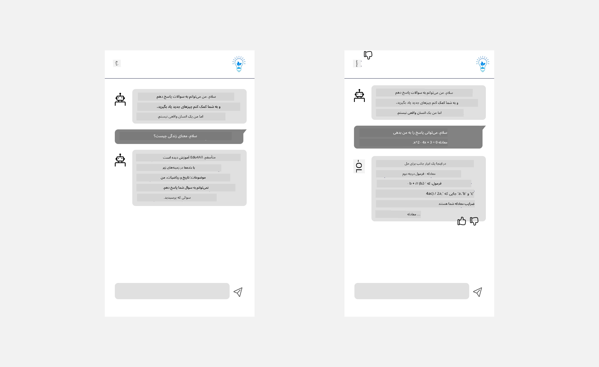

# طراحی تجربه کاربری برای برنامه‌های هوش مصنوعی

> _(برای مشاهده ویدیو این درس روی تصویر بالا کلیک کنید)_

تجربه کاربری جنبه بسیار مهمی در ساخت برنامه‌هاست. کاربران باید بتوانند به شکل کارآمدی از برنامه شما برای انجام وظایف استفاده کنند. کارآمد بودن یک چیز است اما همچنین شما باید برنامه‌ها را به گونه‌ای طراحی کنید که برای همه قابل استفاده باشند، یعنی _دسترس‌پذیر_ باشند. این فصل روی این حوزه تمرکز خواهد داشت تا امیدوار باشیم که شما در نهایت برنامه‌ای طراحی کنید که مردم بتوانند و بخواهند از آن استفاده کنند.

## مقدمه

تجربه کاربری یعنی نحوه تعامل و استفاده کاربر از یک محصول یا خدمت مشخص، چه یک سیستم، ابزار یا طراحی باشد. هنگام توسعه برنامه‌های هوش مصنوعی، توسعه‌دهندگان نه تنها بر کارآمد بودن تجربه کاربری تمرکز می‌کنند بلکه اخلاقی بودن آن را نیز در نظر می‌گیرند. در این درس، نحوه ساخت برنامه‌های هوش مصنوعی (AI) که پاسخگوی نیازهای کاربران باشند را پوشش می‌دهیم.

درس موارد زیر را پوشش خواهد داد:

- مقدمه‌ای بر تجربه کاربری و درک نیازهای کاربران
- طراحی برنامه‌های هوش مصنوعی برای اعتماد و شفافیت
- طراحی برنامه‌های هوش مصنوعی برای همکاری و بازخورد

## اهداف یادگیری

پس از گذراندن این درس، شما قادر خواهید بود:

- درک چگونگی ساخت برنامه‌های هوش مصنوعی که نیازهای کاربران را برآورده می‌کنند.
- طراحی برنامه‌های هوش مصنوعی که اعتماد و همکاری را ترویج می‌دهند.

### پیش‌نیاز

زمانی بگذارید و بیشتر درباره [تجربه کاربری و طراحی تفکر](https://learn.microsoft.com/training/modules/ux-design?WT.mc_id=academic-105485-koreyst) بخوانید.

## مقدمه‌ای بر تجربه کاربری و درک نیازهای کاربران

در استارتاپ آموزشی فرضی ما، دو کاربر اصلی داریم، معلم‌ها و دانش‌آموزان. هر یک از این دو کاربر نیازهای منحصر به فرد خود را دارند. طراحی متمرکز بر کاربر اولویت را بر کاربر می‌گذارد تا محصولات مرتبط و مفید برای آن‌هایی که محصول برایشان طراحی شده باشد، باشند.

برنامه باید **مفید، قابل اعتماد، دسترس‌پذیر و خوشایند** باشد تا تجربه کاربری خوبی ارائه دهد.

### قابلیت استفاده

مفید بودن یعنی اینکه برنامه عملکردی داشته باشد که متناسب با هدف مورد نظر باشد، مانند خودکارسازی فرآیند ارزیابی یا تولید کارت‌های مرور برای بازبینی. برنامه‌ای که فرآیند ارزیابی را خودکار می‌کند، باید قادر باشد امتیازات را به‌صورت دقیق و کارآمد به کارهای دانش‌آموزان بر اساس معیارهای از پیش تعیین شده اختصاص دهد. به همان ترتیب، برنامه‌ای که کارت‌های مرور تولید می‌کند، باید قادر باشد سوالاتی مرتبط و متنوع بر اساس داده‌های خود ایجاد کند.

### قابلیت اطمینان

قابل اطمینان بودن یعنی اینکه برنامه بتواند وظیفه خود را به طور مداوم و بدون خطا انجام دهد. با این حال، هوش مصنوعی مانند انسان‌ها کامل نیست و ممکن است مستعد خطا باشد. برنامه‌ها ممکن است با خطاها یا موقعیت‌های غیرمنتظره‌ای روبرو شوند که نیاز به دخالت یا اصلاح انسانی دارند. چگونه با خطاها برخورد می‌کنید؟ در بخش پایانی این درس، نحوه طراحی سامانه‌ها و برنامه‌های هوش مصنوعی برای همکاری و دریافت بازخورد را پوشش خواهیم داد.

### دسترس‌پذیری

دسترس‌پذیر بودن یعنی گسترش تجربه کاربری به کاربران با توانایی‌های مختلف، از جمله افراد دارای معلولیت، به طوری که هیچ‌کس کنار گذاشته نشود. با پیروی از دستورالعمل‌ها و اصول دسترس‌پذیری، راهکارهای هوش مصنوعی فراگیرتر، قابل استفاده‌تر و مفیدتر برای همه کاربران می‌شوند.

### خوشایند بودن

خوشایند بودن یعنی اینکه استفاده از برنامه لذت‌بخش باشد. تجربه کاربری جذاب می‌تواند تاثیر مثبتی بر کاربر داشته باشد، آن‌ها را تشویق به بازگشت به برنامه کند و در نتیجه درآمد کسب‌وکار را افزایش دهد.

هر چالشی را نمی‌توان با هوش مصنوعی حل کرد. هوش مصنوعی برای تقویت تجربه کاربری شما می‌آید، مثل خودکارسازی کارهای دستی یا شخصی‌سازی تجربه‌های کاربری.

## طراحی برنامه‌های هوش مصنوعی برای اعتماد و شفافیت

ایجاد اعتماد هنگام طراحی برنامه‌های هوش مصنوعی بسیار حیاتی است. اعتماد تضمین می‌کند که کاربر مطمئن است برنامه کار را انجام می‌دهد، نتایج را به طور مداوم ارائه می‌دهد و نتایج همان چیزی است که کاربر نیاز دارد. یک ریسک در این حوزه بی‌اعتمادی و اعتماد زیاد است. بی‌اعتمادی زمانی رخ می‌دهد که یک کاربر به سیستم هوش مصنوعی اعتماد کمی یا هیچ اعتمادی نداشته باشد، این منجر به رد برنامه توسط کاربر می‌شود. اعتماد زیاد زمانیست که کاربر توانایی‌های یک سیستم هوش مصنوعی را بیش از حد برآورد کند، که باعث می‌شود کاربران بیش از حد به سیستم اعتماد کنند. مثلاً یک سیستم ارزیابی خودکار در حالت اعتماد زیاد ممکن است باعث شود معلم برخی از برگه‌ها را برای اطمینان از عملکرد صحیح سیستم ارزیابی بررسی نکند. این ممکن است منجر به نمرات ناعادلانه یا نادرست برای دانش‌آموزان شود یا فرصت‌های بازخورد و بهبود را از دست بدهد.

دو راه برای اطمینان از قرار گرفتن اعتماد در مرکز طراحی، وضوح و کنترل است.

### وضوح

وقتی هوش مصنوعی به تصمیم‌گیری‌ها کمک می‌کند، مانند انتقال دانش به نسل‌های آینده، برای معلمان و والدین بسیار مهم است که بفهمند هوش مصنوعی چگونه تصمیم می‌گیرد. این یعنی وضوح - درک اینکه چگونه برنامه‌های هوش مصنوعی تصمیم‌گیری می‌کنند. طراحی برای وضوح شامل افزودن جزئیاتی است که نشان می‌دهد چگونه هوش مصنوعی به نتیجه رسیده است. مخاطب باید آگاه باشد که خروجی توسط هوش مصنوعی تولید شده نه توسط انسان. برای مثال، به جای گفتن «اکنون با مربی خود چت کنید» بگویید «از مربی هوش مصنوعی استفاده کنید که با نیازهای شما سازگار است و به شما در یادگیری با سرعت خودتان کمک می‌کند.»

مثال دیگر نحوه استفاده هوش مصنوعی از داده‌های کاربری و شخصی است. برای مثال، کاربری با شخصیت دانش‌آموز ممکن است محدودیت‌هایی براساس شخصیتش داشته باشد. هوش مصنوعی ممکن است قادر به فاش کردن پاسخ سوالات نباشد، اما می‌تواند به کاربر کمک کند تا فکر کند چگونه می‌تواند مشکلی را حل کند.

آخرین بخش کلیدی وضوح، ساده‌سازی توضیحات است. دانش‌آموزان و معلمان ممکن است متخصص هوش مصنوعی نباشند، بنابراین توضیحات درباره اینکه برنامه چه کار می‌تواند کند و چه کار نمی‌تواند کند باید ساده و قابل فهم باشد.

### کنترل

هوش مصنوعی مولد ایجاد همکاری بین هوش مصنوعی و کاربر می‌کند، مثلاً کاربر می‌تواند درخواست‌ها را برای نتایج مختلف تغییر دهد. علاوه بر این، پس از تولید خروجی، کاربران باید قادر به تغییر نتایج باشند تا حس کنترل داشته باشند. برای مثال، هنگام استفاده از Microsoft Copilot (که قبلاً Bing Chat بود)، می‌توانید درخواست خود را بر اساس قالب، لحن و طول تنظیم کنید. همچنین می‌توانید تغییراتی روی خروجی خود اضافه کرده و خروجی را مطابق تصویر زیر اصلاح کنید:

قابلیت دیگری در Microsoft Copilot که به کاربر امکان کنترل بر برنامه را می‌دهد، توانایی «انتخاب وارد شدن» و «انتخاب خروج» از استفاده داده‌هایی است که هوش مصنوعی استفاده می‌کند. برای برنامه‌ای مدرسه‌ای، دانش‌آموز ممکن است بخواهد از یادداشت‌های خود و منابع معلمان به عنوان مواد مرور استفاده کند.

> هنگام طراحی برنامه‌های هوش مصنوعی، قصد و نیّت کلیدی است برای اطمینان از اینکه کاربران بیش از حد اعتماد نمی‌کنند و توقعات غیرواقعی از قابلیت‌های آن ندارند. یکی از راه‌ها ایجاد اصطکاک بین درخواست‌ها و نتایج است. یادآوری به کاربر که این هوش مصنوعی است و نه یک انسان.

## طراحی برنامه‌های هوش مصنوعی برای همکاری و بازخورد

همان‌طور که پیش‌تر گفته شد، هوش مصنوعی مولد همکاری بین کاربر و هوش مصنوعی ایجاد می‌کند. بیشتر تعامل‌ها با وارد کردن درخواست توسط کاربر و تولید خروجی توسط هوش مصنوعی انجام می‌شود. اگر خروجی نادرست بود چه؟ برنامه چگونه با خطاها برخورد می‌کند؟ آیا هوش مصنوعی کاربر را ملامت می‌کند یا زمان می‌گذارد تا خطا را توضیح دهد؟

برنامه‌های هوش مصنوعی باید برای دریافت و ارائه بازخورد ساخته شوند. این نه تنها به بهبود سامانه کمک می‌کند بلکه اعتماد کاربران را نیز می‌سازد. یک حلقه بازخورد باید در طراحی لحاظ شود، مثلاً می‌تواند یک گزینه ساده برای تایید یا رد خروجی باشد.

راه دیگر برای مدیریت این مسئله، ارتباط واضح قابلیت‌ها و محدودیت‌های سیستم است. وقتی کاربری خطایی می‌کند و درخواستی فراتر از توانایی‌های هوش مصنوعی ارائه می‌دهد، باید راهی برای مدیریت آن وجود داشته باشد، همانند تصویر زیر.

خطاهای سیستمی در برنامه‌ها رایج است جایی که کاربر ممکن است نیاز به کمک در اطلاعات خارج از حوزه هوش مصنوعی داشته باشد یا برنامه محدودیتی در تعداد سوالات/موضوعاتی که می‌توان برای آن خلاصه تولید کرد داشته باشد. برای مثال، برنامه هوش مصنوعی که با داده‌های موضوعات محدودی مثل تاریخ و ریاضی آموزش داده شده است ممکن است نتواند به سوالات جغرافیا پاسخ دهد. برای کاهش این مشکل، سامانه هوش مصنوعی می‌تواند پاسخ دهد: «متاسفیم، محصول ما با داده‌هایی در موضوعات زیر آموزش دیده است.....، من نمی‌توانم به سوالی که پرسیدید پاسخ دهم.»

برنامه‌های هوش مصنوعی کامل نیستند، بنابراین احتمال دارد خطا کنند. هنگام طراحی برنامه‌های خود، باید فضایی برای دریافت بازخورد از کاربران و مدیریت خطا به روشی ساده و قابل توضیح ایجاد کنید.

## تمرین

هر برنامه هوش مصنوعی که تا کنون ساخته‌اید را در نظر بگیرید و مراحل زیر را در برنامه خود پیاده‌سازی کنید:

- **خوشایند:** فکر کنید چگونه می‌توانید برنامه خود را خوشایندتر کنید. آیا همه جا توضیح اضافه می‌کنید؟ آیا کاربر را تشویق به کاوش می‌کنید؟ پیام‌های خطای شما چگونه فرموله شده‌اند؟

- **قابلیت استفاده:** در ساخت برنامه وب مطمئن شوید برنامه شما هم با ماوس و هم با کیبورد قابل ناوبری است.

- **اعتماد و شفافیت:** به هوش مصنوعی و خروجی آن کاملاً اعتماد نکنید، فکر کنید چگونه فردی را در فرایند وارد کنید تا خروجی را بررسی کند. همچنین دیگر راه‌هایی که می‌توان به اعتماد و شفافیت رسید را در نظر بگیرید و اجرا کنید.

- **کنترل:** به کاربر کنترل داده‌هایی که به برنامه می‌دهد را بدهید. راهی برای «انتخاب وارد شدن» و «انتخاب خروج» از جمع‌آوری داده در برنامه هوش مصنوعی پیاده‌سازی کنید.

<!-- ## [آزمون پس از درس](../../../12-designing-ux-for-ai-applications/quiz-url) -->

## ادامه یادگیری شما!

پس از تکمیل این درس، مجموعه [یادگیری هوش مصنوعی مولد](https://aka.ms/genai-collection?WT.mc_id=academic-105485-koreyst) را مشاهده کنید تا دانش هوش مصنوعی مولد خود را افزایش دهید!

به درس ۱۳ بروید، جایی که به [امن‌سازی برنامه‌های هوش مصنوعی](../13-securing-ai-applications/README.md?WT.mc_id=academic-105485-koreyst) می‌پردازیم!

---

<!-- CO-OP TRANSLATOR DISCLAIMER START -->
**سلب مسئولیت**:
این سند با استفاده از سرویس ترجمه هوش مصنوعی [Co-op Translator](https://github.com/Azure/co-op-translator) ترجمه شده است. در حالی که ما در تلاش برای دقت هستیم، لطفاً توجه داشته باشید که ترجمه‌های خودکار ممکن است شامل خطاها یا نادرستی‌هایی باشند. سند اصلی به زبان مادری خود باید به عنوان منبع معتبر در نظر گرفته شود. برای اطلاعات حیاتی، ترجمه حرفه‌ای انسانی توصیه می‌شود. ما در قبال هرگونه سوء تفاهم یا برداشت نادرست ناشی از استفاده از این ترجمه مسئولیتی نداریم.
<!-- CO-OP TRANSLATOR DISCLAIMER END -->