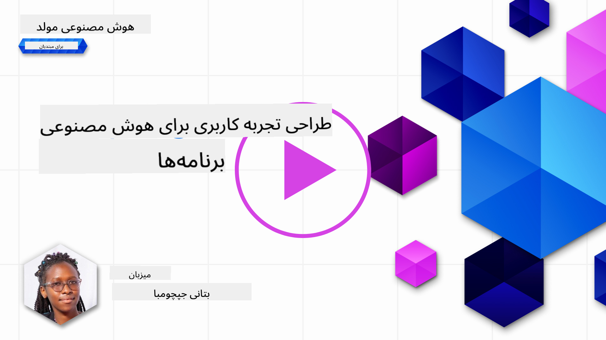

<!--
CO_OP_TRANSLATOR_METADATA:
{
  "original_hash": "78bbeed50fd4dc9fdee931f5daf98cb3",
  "translation_date": "2025-10-17T23:07:25+00:00",
  "source_file": "12-designing-ux-for-ai-applications/README.md",
  "language_code": "fa"
}
-->
# طراحی تجربه کاربری برای برنامه‌های هوش مصنوعی

> _(برای مشاهده ویدئوی این درس روی تصویر بالا کلیک کنید)_

تجربه کاربری یکی از جنبه‌های بسیار مهم در ساخت برنامه‌ها است. کاربران باید بتوانند به صورت کارآمد از برنامه شما برای انجام وظایف خود استفاده کنند. کارآمد بودن یک موضوع است، اما شما همچنین باید برنامه‌هایی طراحی کنید که همه بتوانند از آن استفاده کنند تا آن‌ها را _دسترس‌پذیر_ کنید. این فصل بر این حوزه تمرکز دارد تا شما بتوانید برنامه‌ای طراحی کنید که مردم بتوانند و بخواهند از آن استفاده کنند.

## مقدمه

تجربه کاربری نحوه تعامل و استفاده یک کاربر از یک محصول یا خدمات خاص است، چه یک سیستم، ابزار یا طراحی باشد. هنگام توسعه برنامه‌های هوش مصنوعی، توسعه‌دهندگان نه تنها بر تضمین اثربخشی تجربه کاربری تمرکز می‌کنند، بلکه به جنبه‌های اخلاقی نیز توجه دارند. در این درس، نحوه ساخت برنامه‌های هوش مصنوعی (AI) که نیازهای کاربران را برآورده می‌کنند، بررسی می‌شود.

این درس به موضوعات زیر می‌پردازد:

- مقدمه‌ای بر تجربه کاربری و درک نیازهای کاربران
- طراحی برنامه‌های هوش مصنوعی برای اعتماد و شفافیت
- طراحی برنامه‌های هوش مصنوعی برای همکاری و بازخورد

## اهداف یادگیری

پس از گذراندن این درس، شما قادر خواهید بود:

- درک کنید که چگونه برنامه‌های هوش مصنوعی را بسازید که نیازهای کاربران را برآورده کنند.
- برنامه‌های هوش مصنوعی طراحی کنید که اعتماد و همکاری را تقویت کنند.

### پیش‌نیاز

زمانی را صرف کنید و درباره [تجربه کاربری و تفکر طراحی](https://learn.microsoft.com/training/modules/ux-design?WT.mc_id=academic-105485-koreyst) بیشتر بخوانید.

## مقدمه‌ای بر تجربه کاربری و درک نیازهای کاربران

در استارتاپ آموزشی خیالی ما، دو کاربر اصلی وجود دارند: معلمان و دانش‌آموزان. هر یک از این دو کاربر نیازهای منحصر به فردی دارند. طراحی کاربر محور، کاربر را در اولویت قرار می‌دهد و اطمینان حاصل می‌کند که محصولات برای کسانی که برای آن‌ها طراحی شده‌اند، مرتبط و مفید هستند.

برنامه باید **مفید، قابل اعتماد، دسترس‌پذیر و دلپذیر** باشد تا تجربه کاربری خوبی ارائه دهد.

### قابلیت استفاده

مفید بودن به این معناست که برنامه دارای عملکردی باشد که با هدف مورد نظر آن مطابقت داشته باشد، مانند خودکارسازی فرآیند نمره‌دهی یا ایجاد فلش‌کارت‌های مرور. یک برنامه که فرآیند نمره‌دهی را خودکار می‌کند باید بتواند به طور دقیق و کارآمد نمرات را بر اساس معیارهای از پیش تعریف شده به کارهای دانش‌آموزان اختصاص دهد. به همین ترتیب، یک برنامه که فلش‌کارت‌های مرور ایجاد می‌کند باید بتواند سوالات مرتبط و متنوعی بر اساس داده‌های خود ایجاد کند.

### قابلیت اعتماد

قابل اعتماد بودن به این معناست که برنامه بتواند وظیفه خود را به طور مداوم و بدون خطا انجام دهد. با این حال، هوش مصنوعی مانند انسان‌ها کامل نیست و ممکن است مستعد خطا باشد. برنامه‌ها ممکن است با خطاها یا موقعیت‌های غیرمنتظره‌ای مواجه شوند که نیاز به مداخله یا اصلاح انسانی دارند. چگونه با خطاها برخورد می‌کنید؟ در بخش آخر این درس، نحوه طراحی سیستم‌ها و برنامه‌های هوش مصنوعی برای همکاری و بازخورد را بررسی خواهیم کرد.

### دسترس‌پذیری

دسترس‌پذیر بودن به معنای گسترش تجربه کاربری به کاربران با توانایی‌های مختلف، از جمله افراد دارای معلولیت است، به طوری که هیچ‌کس از دست نرود. با رعایت دستورالعمل‌ها و اصول دسترس‌پذیری، راه‌حل‌های هوش مصنوعی فراگیرتر، قابل استفاده‌تر و مفیدتر برای همه کاربران می‌شوند.

### دلپذیر بودن

دلپذیر بودن به معنای لذت‌بخش بودن استفاده از برنامه است. یک تجربه کاربری جذاب می‌تواند تأثیر مثبتی بر کاربر داشته باشد و او را تشویق کند که به برنامه بازگردد و درآمد کسب‌وکار را افزایش دهد.

هر چالشی را نمی‌توان با هوش مصنوعی حل کرد. هوش مصنوعی برای تقویت تجربه کاربری شما وارد عمل می‌شود، چه خودکارسازی وظایف دستی باشد یا شخصی‌سازی تجربه‌های کاربری.

## طراحی برنامه‌های هوش مصنوعی برای اعتماد و شفافیت

ایجاد اعتماد هنگام طراحی برنامه‌های هوش مصنوعی بسیار مهم است. اعتماد اطمینان می‌دهد که کاربر مطمئن است برنامه کار را انجام می‌دهد، به طور مداوم نتایج را ارائه می‌دهد و نتایج همان چیزی است که کاربر نیاز دارد. یک خطر در این زمینه بی‌اعتمادی و اعتماد بیش از حد است. بی‌اعتمادی زمانی رخ می‌دهد که کاربر اعتماد کمی به سیستم هوش مصنوعی داشته باشد یا اصلاً اعتماد نداشته باشد، این امر منجر به رد برنامه شما توسط کاربر می‌شود. اعتماد بیش از حد زمانی رخ می‌دهد که کاربر توانایی سیستم هوش مصنوعی را بیش از حد ارزیابی کند و منجر به اعتماد بیش از حد کاربران به سیستم هوش مصنوعی شود. به عنوان مثال، یک سیستم نمره‌دهی خودکار در صورت اعتماد بیش از حد ممکن است باعث شود معلم برخی از مقالات را بررسی نکند تا مطمئن شود سیستم نمره‌دهی به خوبی کار می‌کند. این می‌تواند منجر به نمرات ناعادلانه یا نادرست برای دانش‌آموزان یا فرصت‌های از دست رفته برای بازخورد و بهبود شود.

دو راه برای اطمینان از اینکه اعتماد در مرکز طراحی قرار دارد، توضیح‌پذیری و کنترل است.

### توضیح‌پذیری

هنگامی که هوش مصنوعی به تصمیم‌گیری‌ها مانند انتقال دانش به نسل‌های آینده کمک می‌کند، برای معلمان و والدین بسیار مهم است که بفهمند تصمیمات هوش مصنوعی چگونه گرفته می‌شوند. این همان توضیح‌پذیری است - درک اینکه برنامه‌های هوش مصنوعی چگونه تصمیم‌گیری می‌کنند. طراحی برای توضیح‌پذیری شامل افزودن جزئیاتی است که نشان می‌دهد هوش مصنوعی چگونه به خروجی رسیده است. مخاطب باید آگاه باشد که خروجی توسط هوش مصنوعی تولید شده است و نه یک انسان. به عنوان مثال، به جای گفتن "اکنون با معلم خود چت کنید" بگویید "از معلم هوش مصنوعی استفاده کنید که با نیازهای شما سازگار می‌شود و به شما کمک می‌کند با سرعت خودتان یاد بگیرید."

مثال دیگر این است که هوش مصنوعی چگونه از داده‌های کاربر و شخصی استفاده می‌کند. به عنوان مثال، یک کاربر با شخصیت دانش‌آموز ممکن است محدودیت‌هایی بر اساس شخصیت خود داشته باشد. هوش مصنوعی ممکن است نتواند پاسخ سوالات را فاش کند، اما ممکن است به کاربر کمک کند تا فکر کند چگونه می‌تواند یک مسئله را حل کند.

یکی دیگر از بخش‌های کلیدی توضیح‌پذیری، ساده‌سازی توضیحات است. دانش‌آموزان و معلمان ممکن است متخصص هوش مصنوعی نباشند، بنابراین توضیحات در مورد اینکه برنامه چه کاری می‌تواند انجام دهد یا نمی‌تواند انجام دهد باید ساده و قابل فهم باشد.

### کنترل

هوش مصنوعی مولد یک همکاری بین هوش مصنوعی و کاربر ایجاد می‌کند، جایی که به عنوان مثال یک کاربر می‌تواند درخواست‌ها را برای نتایج مختلف تغییر دهد. علاوه بر این، هنگامی که یک خروجی تولید می‌شود، کاربران باید بتوانند نتایج را تغییر دهند و به آن‌ها حس کنترل بدهند. به عنوان مثال، هنگام استفاده از Bing، می‌توانید درخواست خود را بر اساس قالب، لحن و طول تنظیم کنید. علاوه بر این، می‌توانید تغییراتی در خروجی خود ایجاد کنید و خروجی را تغییر دهید همان‌طور که در تصویر زیر نشان داده شده است:

یکی دیگر از ویژگی‌های Bing که به کاربر اجازه می‌دهد کنترل بیشتری بر برنامه داشته باشد، توانایی انتخاب و عدم انتخاب داده‌هایی است که هوش مصنوعی استفاده می‌کند. برای یک برنامه مدرسه، ممکن است دانش‌آموز بخواهد از یادداشت‌های خود و همچنین منابع معلمان به عنوان مواد مرور استفاده کند.

> هنگام طراحی برنامه‌های هوش مصنوعی، هدفمندی کلیدی است تا اطمینان حاصل شود که کاربران بیش از حد اعتماد نمی‌کنند و انتظارات غیرواقعی از قابلیت‌های آن ندارند. یکی از راه‌های انجام این کار ایجاد اصطکاک بین درخواست‌ها و نتایج است. یادآوری به کاربر که این هوش مصنوعی است و نه یک انسان دیگر.

## طراحی برنامه‌های هوش مصنوعی برای همکاری و بازخورد

همان‌طور که قبلاً ذکر شد، هوش مصنوعی مولد یک همکاری بین کاربر و هوش مصنوعی ایجاد می‌کند. بیشتر تعاملات با وارد کردن یک درخواست توسط کاربر و تولید یک خروجی توسط هوش مصنوعی انجام می‌شود. اگر خروجی نادرست باشد چه؟ برنامه چگونه با خطاها برخورد می‌کند اگر رخ دهند؟ آیا هوش مصنوعی کاربر را سرزنش می‌کند یا وقت می‌گذارد تا خطا را توضیح دهد؟

برنامه‌های هوش مصنوعی باید به گونه‌ای ساخته شوند که بتوانند بازخورد دریافت و ارائه دهند. این نه تنها به بهبود سیستم هوش مصنوعی کمک می‌کند، بلکه اعتماد کاربران را نیز افزایش می‌دهد. یک حلقه بازخورد باید در طراحی گنجانده شود، یک مثال می‌تواند یک علامت مثبت یا منفی ساده بر روی خروجی باشد.

راه دیگر برای برخورد با این موضوع، ارتباط واضح قابلیت‌ها و محدودیت‌های سیستم است. هنگامی که یک کاربر اشتباهی مرتکب می‌شود و چیزی فراتر از توانایی‌های هوش مصنوعی درخواست می‌کند، باید راهی برای برخورد با این موضوع وجود داشته باشد، همان‌طور که در تصویر زیر نشان داده شده است.

خطاهای سیستم در برنامه‌ها رایج هستند، جایی که ممکن است کاربر به اطلاعاتی خارج از محدوده هوش مصنوعی نیاز داشته باشد یا برنامه ممکن است محدودیتی در تعداد سوالات/موضوعاتی که کاربر می‌تواند خلاصه‌ها تولید کند داشته باشد. به عنوان مثال، یک برنامه هوش مصنوعی که با داده‌های محدود در موضوعاتی مانند تاریخ و ریاضی آموزش دیده است ممکن است نتواند به سوالات مربوط به جغرافیا پاسخ دهد. برای کاهش این مشکل، سیستم هوش مصنوعی می‌تواند پاسخی مانند: "متأسفم، محصول ما با داده‌های مربوط به موضوعات زیر آموزش دیده است.....، نمی‌توانم به سوالی که پرسیدید پاسخ دهم."

برنامه‌های هوش مصنوعی کامل نیستند، بنابراین احتمال اشتباه وجود دارد. هنگام طراحی برنامه‌های خود، باید اطمینان حاصل کنید که فضایی برای بازخورد کاربران و برخورد با خطاها به گونه‌ای که ساده و قابل توضیح باشد ایجاد کنید.

## تکلیف

هر برنامه هوش مصنوعی که تاکنون ساخته‌اید را بررسی کنید و مراحل زیر را در برنامه خود اجرا کنید:

- **دلپذیر بودن:** بررسی کنید که چگونه می‌توانید برنامه خود را دلپذیرتر کنید. آیا توضیحات را در همه جا اضافه می‌کنید؟ آیا کاربران را تشویق به کشف می‌کنید؟ پیام‌های خطای خود را چگونه بیان می‌کنید؟

- **قابلیت استفاده:** اگر یک برنامه وب می‌سازید، مطمئن شوید که برنامه شما هم با ماوس و هم با صفحه کلید قابل پیمایش است.

- **اعتماد و شفافیت:** به هوش مصنوعی و خروجی آن کاملاً اعتماد نکنید، بررسی کنید که چگونه می‌توانید یک انسان را به فرآیند اضافه کنید تا خروجی را تأیید کند. همچنین، روش‌های دیگری برای ایجاد اعتماد و شفافیت در نظر بگیرید و اجرا کنید.

- **کنترل:** به کاربر کنترل داده‌هایی که به برنامه ارائه می‌دهد بدهید. راهی را اجرا کنید که کاربر بتواند انتخاب کند که داده‌هایش جمع‌آوری شود یا نشود.

<!-- ## [آزمون پس از درس](../../../12-designing-ux-for-ai-applications/quiz-url) -->

## ادامه یادگیری!

پس از تکمیل این درس، مجموعه [یادگیری هوش مصنوعی مولد](https://aka.ms/genai-collection?WT.mc_id=academic-105485-koreyst) ما را بررسی کنید تا دانش خود در زمینه هوش مصنوعی مولد را ارتقا دهید!

به درس ۱۳ بروید، جایی که به موضوع [امنیت برنامه‌های هوش مصنوعی](../13-securing-ai-applications/README.md?WT.mc_id=academic-105485-koreyst) خواهیم پرداخت!

---

**سلب مسئولیت**:  
این سند با استفاده از سرویس ترجمه هوش مصنوعی [Co-op Translator](https://github.com/Azure/co-op-translator) ترجمه شده است. در حالی که ما تلاش می‌کنیم دقت را حفظ کنیم، لطفاً توجه داشته باشید که ترجمه‌های خودکار ممکن است شامل خطاها یا نادرستی‌ها باشند. سند اصلی به زبان اصلی آن باید به عنوان منبع معتبر در نظر گرفته شود. برای اطلاعات حساس، ترجمه حرفه‌ای انسانی توصیه می‌شود. ما مسئولیتی در قبال سوء تفاهم‌ها یا تفسیرهای نادرست ناشی از استفاده از این ترجمه نداریم.