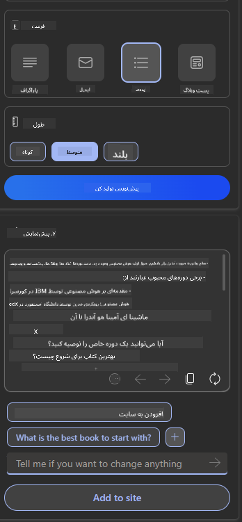
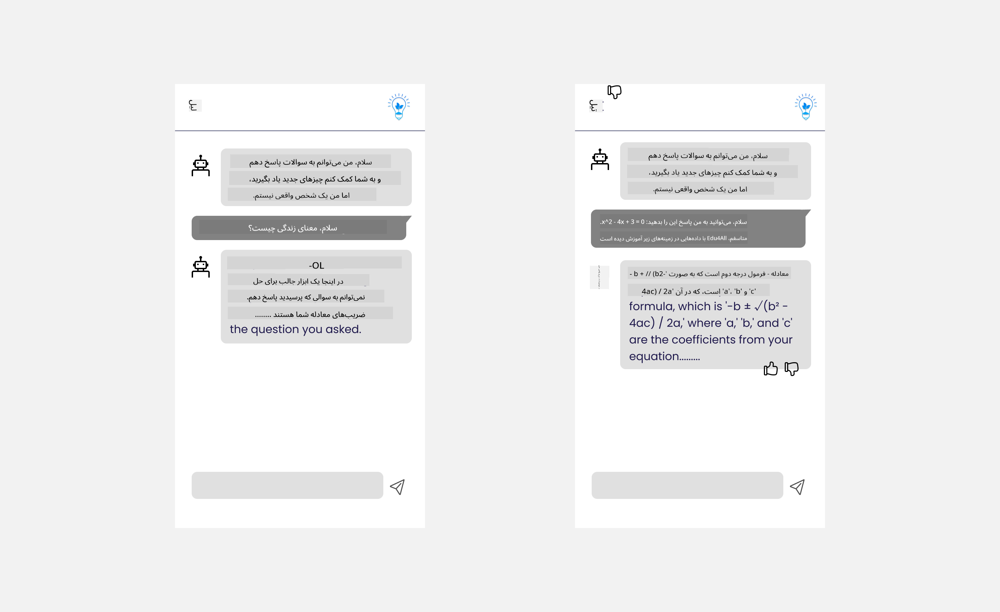

<!--
CO_OP_TRANSLATOR_METADATA:
{
  "original_hash": "747668e4c53d067369f06e9ec2e6313e",
  "translation_date": "2025-08-26T14:18:14+00:00",
  "source_file": "12-designing-ux-for-ai-applications/README.md",
  "language_code": "fa"
}
-->
# طراحی تجربه کاربری برای برنامه‌های هوش مصنوعی

> _(برای مشاهده ویدیو این درس روی تصویر بالا کلیک کنید)_

تجربه کاربری یکی از مهم‌ترین جنبه‌های ساخت اپلیکیشن‌هاست. کاربران باید بتوانند به شکلی کارآمد از برنامه شما برای انجام کارهایشان استفاده کنند. کارآمد بودن یک موضوع است، اما باید برنامه‌ها را طوری طراحی کنید که همه بتوانند از آن استفاده کنند و _دسترسی‌پذیر_ باشد. این فصل روی همین موضوع تمرکز دارد تا در نهایت برنامه‌ای طراحی کنید که مردم بتوانند و بخواهند از آن استفاده کنند.

## مقدمه

تجربه کاربری یعنی نحوه تعامل و استفاده کاربر از یک محصول یا خدمت خاص، چه یک سیستم باشد، چه ابزار یا طراحی. هنگام توسعه برنامه‌های هوش مصنوعی، توسعه‌دهندگان نه تنها باید مطمئن شوند تجربه کاربری مؤثر است، بلکه باید به جنبه‌های اخلاقی هم توجه کنند. در این درس، یاد می‌گیریم چطور برنامه‌های هوش مصنوعی بسازیم که نیازهای کاربران را برطرف کند.

در این درس به موضوعات زیر می‌پردازیم:

- مقدمه‌ای بر تجربه کاربری و درک نیازهای کاربر
- طراحی برنامه‌های هوش مصنوعی با محوریت اعتماد و شفافیت
- طراحی برنامه‌های هوش مصنوعی برای همکاری و بازخورد

## اهداف یادگیری

پس از گذراندن این درس، می‌توانید:

- درک کنید چطور برنامه‌های هوش مصنوعی بسازید که نیازهای کاربران را برآورده کند.
- برنامه‌های هوش مصنوعی طراحی کنید که اعتماد و همکاری را تقویت کند.

### پیش‌نیاز

کمی وقت بگذارید و درباره [تجربه کاربری و تفکر طراحی](https://learn.microsoft.com/training/modules/ux-design?WT.mc_id=academic-105485-koreyst) بیشتر بخوانید.

## مقدمه‌ای بر تجربه کاربری و درک نیازهای کاربر

در استارتاپ آموزشی فرضی ما، دو کاربر اصلی داریم: معلمان و دانش‌آموزان. هرکدام از این دو گروه نیازهای خاص خود را دارند. طراحی کاربرمحور، کاربر را در اولویت قرار می‌دهد تا محصولات مرتبط و مفید برای مخاطب هدف باشند.

برنامه باید **مفید، قابل اعتماد، در دسترس و لذت‌بخش** باشد تا تجربه کاربری خوبی ارائه دهد.

### کاربردپذیری

مفید بودن یعنی برنامه قابلیت‌هایی داشته باشد که با هدفش همخوانی داشته باشد؛ مثلاً خودکارسازی فرآیند نمره‌دهی یا تولید فلش‌کارت برای مرور. برنامه‌ای که نمره‌دهی را خودکار می‌کند باید بتواند بر اساس معیارهای از پیش تعیین‌شده، به‌درستی و با سرعت به کارهای دانش‌آموزان نمره بدهد. به همین شکل، برنامه‌ای که فلش‌کارت تولید می‌کند باید بتواند سوالات متنوع و مرتبط با داده‌هایش بسازد.

### قابلیت اطمینان

قابل اعتماد بودن یعنی برنامه بتواند کارش را به طور مداوم و بدون خطا انجام دهد. اما هوش مصنوعی هم مثل انسان‌ها بی‌نقص نیست و ممکن است دچار خطا شود. برنامه‌ها ممکن است با خطاها یا موقعیت‌های غیرمنتظره‌ای روبرو شوند که نیاز به دخالت یا اصلاح انسانی دارد. چطور باید با خطاها برخورد کرد؟ در بخش پایانی این درس، به این می‌پردازیم که چطور سیستم‌ها و برنامه‌های هوش مصنوعی برای همکاری و بازخورد طراحی می‌شوند.

### دسترسی‌پذیری

دسترسی‌پذیر بودن یعنی تجربه کاربری را برای کاربران با توانایی‌های مختلف، از جمله افراد دارای معلولیت، فراهم کنیم تا هیچ‌کس جا نماند. با رعایت اصول و راهنمایی‌های دسترسی‌پذیری، راهکارهای هوش مصنوعی فراگیرتر، قابل استفاده‌تر و مفیدتر برای همه کاربران می‌شوند.

### لذت‌بخش بودن

لذت‌بخش بودن یعنی استفاده از برنامه برای کاربر خوشایند باشد. تجربه کاربری جذاب می‌تواند تأثیر مثبتی روی کاربر بگذارد، او را به بازگشت به برنامه تشویق کند و درآمد کسب‌وکار را افزایش دهد.

همه چالش‌ها را نمی‌توان با هوش مصنوعی حل کرد. هوش مصنوعی برای بهبود تجربه کاربری شماست؛ چه خودکارسازی کارهای دستی باشد، چه شخصی‌سازی تجربه کاربر.

## طراحی برنامه‌های هوش مصنوعی با محوریت اعتماد و شفافیت

ایجاد اعتماد هنگام طراحی برنامه‌های هوش مصنوعی بسیار مهم است. اعتماد باعث می‌شود کاربر مطمئن باشد برنامه کار را انجام می‌دهد، نتایج را به طور مداوم ارائه می‌کند و این نتایج همان چیزی است که کاربر نیاز دارد. در این زمینه، دو خطر وجود دارد: بی‌اعتمادی و اعتماد بیش از حد. بی‌اعتمادی زمانی رخ می‌دهد که کاربر به سیستم هوش مصنوعی اعتماد کمی دارد یا اصلاً اعتماد ندارد و در نتیجه برنامه شما را رد می‌کند. اعتماد بیش از حد زمانی رخ می‌دهد که کاربر توانایی‌های سیستم هوش مصنوعی را بیش از حد ارزیابی می‌کند و بیش از حد به آن تکیه می‌کند. مثلاً در سیستم نمره‌دهی خودکار، اعتماد بیش از حد ممکن است باعث شود معلم بدون بررسی برخی برگه‌ها، به سیستم اعتماد کند. این می‌تواند منجر به نمرات ناعادلانه یا نادرست برای دانش‌آموزان یا از دست رفتن فرصت‌های بازخورد و بهبود شود.

دو راه برای قرار دادن اعتماد در مرکز طراحی، توضیح‌پذیری و کنترل است.

### توضیح‌پذیری

وقتی هوش مصنوعی به تصمیم‌گیری‌هایی مثل آموزش نسل آینده کمک می‌کند، مهم است که معلمان و والدین بفهمند تصمیمات هوش مصنوعی چطور گرفته می‌شود. این همان توضیح‌پذیری است؛ یعنی درک اینکه برنامه‌های هوش مصنوعی چطور تصمیم می‌گیرند. طراحی با محوریت توضیح‌پذیری یعنی اضافه کردن جزئیاتی که نشان می‌دهد هوش مصنوعی چطور به خروجی رسیده است. مخاطب باید بداند که خروجی توسط هوش مصنوعی تولید شده، نه انسان. مثلاً به جای اینکه بگویید «همین حالا با معلم خود چت کنید»، بگویید «از معلم هوش مصنوعی استفاده کنید که با نیازهای شما سازگار می‌شود و به شما کمک می‌کند با سرعت خودتان یاد بگیرید.»

مثال دیگر، نحوه استفاده هوش مصنوعی از داده‌های کاربر و اطلاعات شخصی است. مثلاً کاربری با شخصیت دانش‌آموز ممکن است محدودیت‌هایی بر اساس شخصیتش داشته باشد. هوش مصنوعی شاید نتواند پاسخ سوالات را مستقیماً بدهد، اما می‌تواند کاربر را راهنمایی کند تا خودش راه‌حل را پیدا کند.

یکی دیگر از بخش‌های مهم توضیح‌پذیری، ساده‌سازی توضیحات است. دانش‌آموزان و معلمان معمولاً متخصص هوش مصنوعی نیستند، پس توضیحات درباره اینکه برنامه چه کارهایی می‌تواند یا نمی‌تواند انجام دهد باید ساده و قابل فهم باشد.

### کنترل

هوش مصنوعی مولد، همکاری بین هوش مصنوعی و کاربر را ایجاد می‌کند؛ مثلاً کاربر می‌تواند دستورات را برای نتایج مختلف تغییر دهد. همچنین، وقتی خروجی تولید شد، کاربر باید بتواند نتایج را ویرایش کند تا حس کنترل داشته باشد. مثلاً هنگام استفاده از Bing، می‌توانید دستور خود را بر اساس قالب، لحن و طول تنظیم کنید. همچنین می‌توانید تغییراتی به خروجی اضافه کنید و آن را ویرایش کنید، همان‌طور که در تصویر زیر می‌بینید:

یکی دیگر از قابلیت‌های Bing که به کاربر امکان کنترل برنامه را می‌دهد، امکان فعال یا غیرفعال کردن استفاده از داده‌های هوش مصنوعی است. در یک برنامه مدرسه، دانش‌آموز ممکن است بخواهد هم از یادداشت‌های خودش و هم منابع معلم به عنوان مطالب مرور استفاده کند.

> هنگام طراحی برنامه‌های هوش مصنوعی، هدفمند بودن کلید این است که کاربران بیش از حد به قابلیت‌های آن اعتماد نکنند و انتظارات غیرواقعی نداشته باشند. یکی از راه‌ها ایجاد اصطکاک بین دستورات و نتایج است؛ یعنی به کاربر یادآوری کنید که این یک هوش مصنوعی است، نه یک انسان دیگر.

## طراحی برنامه‌های هوش مصنوعی برای همکاری و بازخورد

همان‌طور که قبلاً اشاره شد، هوش مصنوعی مولد همکاری بین کاربر و هوش مصنوعی را ایجاد می‌کند. بیشتر تعاملات به این صورت است که کاربر یک دستور وارد می‌کند و هوش مصنوعی خروجی تولید می‌کند. اگر خروجی اشتباه باشد چه؟ برنامه چطور با خطاها برخورد می‌کند؟ آیا هوش مصنوعی کاربر را مقصر می‌داند یا برای توضیح خطا وقت می‌گذارد؟

برنامه‌های هوش مصنوعی باید طوری ساخته شوند که بتوانند بازخورد دریافت و ارائه کنند. این کار نه تنها به بهبود سیستم هوش مصنوعی کمک می‌کند، بلکه اعتماد کاربران را هم افزایش می‌دهد. یک حلقه بازخورد باید در طراحی گنجانده شود؛ مثلاً یک دکمه ساده لایک یا دیسلایک روی خروجی.

راه دیگر این است که قابلیت‌ها و محدودیت‌های سیستم را به‌وضوح به کاربر اعلام کنید. وقتی کاربر درخواستی فراتر از توانایی‌های هوش مصنوعی دارد، باید راهی برای مدیریت این موضوع وجود داشته باشد، همان‌طور که در تصویر زیر می‌بینید.

خطاهای سیستمی در برنامه‌ها رایج است؛ مثلاً کاربر ممکن است به اطلاعاتی خارج از حوزه هوش مصنوعی نیاز داشته باشد یا برنامه محدودیت تعداد سوال/موضوع برای خلاصه‌سازی داشته باشد. مثلاً برنامه‌ای که فقط با داده‌های تاریخ و ریاضی آموزش دیده، نمی‌تواند به سوالات جغرافیا پاسخ دهد. برای رفع این مشکل، سیستم هوش مصنوعی می‌تواند پاسخی مانند این بدهد: «متاسفم، محصول ما فقط با داده‌های موضوعات زیر آموزش دیده است.....، نمی‌توانم به سوال شما پاسخ دهم.»

برنامه‌های هوش مصنوعی بی‌نقص نیستند و ممکن است اشتباه کنند. هنگام طراحی برنامه‌هایتان، باید فضایی برای دریافت بازخورد کاربران و مدیریت خطاها به روشی ساده و قابل توضیح ایجاد کنید.

## تمرین

هر برنامه هوش مصنوعی که تا الان ساخته‌اید را بردارید و سعی کنید مراحل زیر را در آن پیاده‌سازی کنید:

- **لذت‌بخش بودن:** فکر کنید چطور می‌توانید برنامه‌تان را لذت‌بخش‌تر کنید. آیا همه‌جا توضیح می‌دهید؟ آیا کاربر را به کشف بیشتر تشویق می‌کنید؟ پیام‌های خطای خود را چطور بیان می‌کنید؟

- **کاربردپذیری:** اگر برنامه وب می‌سازید، مطمئن شوید برنامه با ماوس و کیبورد قابل استفاده است.

- **اعتماد و شفافیت:** به هوش مصنوعی و خروجی آن کاملاً اعتماد نکنید؛ فکر کنید چطور می‌توانید یک انسان را وارد فرآیند کنید تا خروجی را تأیید کند. همچنین راه‌های دیگری برای ایجاد اعتماد و شفافیت در نظر بگیرید و پیاده‌سازی کنید.

- **کنترل:** به کاربر کنترل داده‌هایی که به برنامه می‌دهد را بدهید. راهی برای فعال یا غیرفعال کردن جمع‌آوری داده‌ها در برنامه هوش مصنوعی پیاده‌سازی کنید.

## یادگیری خود را ادامه دهید!

پس از اتمام این درس، مجموعه [یادگیری هوش مصنوعی مولد](https://aka.ms/genai-collection?WT.mc_id=academic-105485-koreyst) ما را ببینید تا دانش خود را در زمینه هوش مصنوعی مولد ارتقا دهید!

به درس ۱۳ بروید، جایی که به موضوع [امنیت برنامه‌های هوش مصنوعی](../13-securing-ai-applications/README.md?WT.mc_id=academic-105485-koreyst) خواهیم پرداخت!

---

**سلب مسئولیت**:
این سند با استفاده از سرویس ترجمه هوش مصنوعی [Co-op Translator](https://github.com/Azure/co-op-translator) ترجمه شده است. اگرچه ما برای دقت تلاش می‌کنیم، لطفاً توجه داشته باشید که ترجمه‌های خودکار ممکن است شامل خطا یا نادرستی باشند. نسخه اصلی سند به زبان مادری آن باید به عنوان منبع معتبر در نظر گرفته شود. برای اطلاعات حساس، ترجمه حرفه‌ای انسانی توصیه می‌شود. ما هیچ مسئولیتی در قبال سوء تفاهم یا تفسیر نادرست ناشی از استفاده از این ترجمه نداریم.