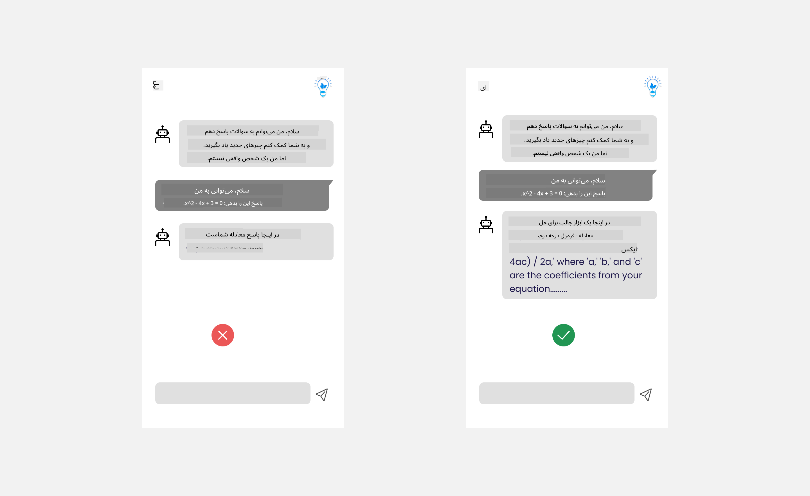

<!--
CO_OP_TRANSLATOR_METADATA:
{
  "original_hash": "ec385b41ee50579025d50cc03bfb3a25",
  "translation_date": "2025-07-09T14:49:56+00:00",
  "source_file": "12-designing-ux-for-ai-applications/README.md",
  "language_code": "fa"
}
-->
# طراحی تجربه کاربری برای برنامه‌های هوش مصنوعی

> _(برای مشاهده ویدئوی این درس روی تصویر بالا کلیک کنید)_

تجربه کاربری یکی از جنبه‌های بسیار مهم در ساخت برنامه‌ها است. کاربران باید بتوانند به شکلی کارآمد از برنامه شما استفاده کنند تا وظایف خود را انجام دهند. کارآمد بودن یک چیز است، اما شما همچنین باید برنامه‌ها را طوری طراحی کنید که همه بتوانند از آن‌ها استفاده کنند، یعنی برنامه‌ها _دسترس‌پذیر_ باشند. این فصل بر این موضوع تمرکز دارد تا در نهایت برنامه‌ای طراحی کنید که مردم بتوانند و بخواهند از آن استفاده کنند.

## مقدمه

تجربه کاربری به نحوه تعامل و استفاده کاربر از یک محصول یا خدمت خاص، چه سیستم، ابزار یا طراحی، گفته می‌شود. هنگام توسعه برنامه‌های هوش مصنوعی، توسعه‌دهندگان نه تنها بر موثر بودن تجربه کاربری تمرکز می‌کنند بلکه به اخلاقی بودن آن نیز توجه دارند. در این درس، نحوه ساخت برنامه‌های هوش مصنوعی (AI) که نیازهای کاربران را برآورده می‌کنند، بررسی می‌شود.

این درس شامل موضوعات زیر است:

- مقدمه‌ای بر تجربه کاربری و درک نیازهای کاربران  
- طراحی برنامه‌های هوش مصنوعی برای اعتماد و شفافیت  
- طراحی برنامه‌های هوش مصنوعی برای همکاری و بازخورد  

## اهداف یادگیری

پس از گذراندن این درس، قادر خواهید بود:

- درک کنید چگونه برنامه‌های هوش مصنوعی بسازید که نیازهای کاربران را برآورده کنند.  
- برنامه‌های هوش مصنوعی طراحی کنید که اعتماد و همکاری را ترویج دهند.  

### پیش‌نیاز

زمانی را صرف کنید و بیشتر درباره [تجربه کاربری و تفکر طراحی](https://learn.microsoft.com/training/modules/ux-design?WT.mc_id=academic-105485-koreyst) مطالعه کنید.

## مقدمه‌ای بر تجربه کاربری و درک نیازهای کاربران

در استارتاپ آموزشی فرضی ما، دو گروه اصلی کاربر داریم: معلمان و دانش‌آموزان. هر یک از این دو گروه نیازهای منحصر به فردی دارند. طراحی متمرکز بر کاربر، اولویت را به کاربر می‌دهد تا اطمینان حاصل شود محصولات مرتبط و مفید برای کسانی هستند که برای آن‌ها ساخته شده‌اند.

برنامه باید **مفید، قابل اعتماد، دسترس‌پذیر و خوشایند** باشد تا تجربه کاربری خوبی ارائه دهد.

### قابلیت استفاده

مفید بودن یعنی برنامه عملکردی داشته باشد که با هدف مورد نظر آن مطابقت داشته باشد، مانند خودکارسازی فرآیند نمره‌دهی یا تولید کارت‌های مرور برای بازبینی. برنامه‌ای که فرآیند نمره‌دهی را خودکار می‌کند باید بتواند به دقت و به طور کارآمد به کارهای دانش‌آموزان بر اساس معیارهای از پیش تعیین شده نمره اختصاص دهد. به همین ترتیب، برنامه‌ای که کارت‌های مرور تولید می‌کند باید بتواند سوالات مرتبط و متنوعی بر اساس داده‌های خود ایجاد کند.

### قابلیت اطمینان

قابل اعتماد بودن یعنی برنامه بتواند وظیفه خود را به طور مداوم و بدون خطا انجام دهد. با این حال، هوش مصنوعی مانند انسان‌ها کامل نیست و ممکن است دچار خطا شود. برنامه‌ها ممکن است با خطاها یا موقعیت‌های غیرمنتظره‌ای مواجه شوند که نیاز به دخالت یا اصلاح انسانی دارد. چگونه خطاها را مدیریت می‌کنید؟ در بخش پایانی این درس، نحوه طراحی سیستم‌ها و برنامه‌های هوش مصنوعی برای همکاری و بازخورد را بررسی خواهیم کرد.

### دسترس‌پذیری

دسترس‌پذیر بودن یعنی تجربه کاربری را به کاربران با توانایی‌های مختلف، از جمله افراد دارای معلولیت، گسترش دهید تا هیچ‌کس کنار گذاشته نشود. با پیروی از دستورالعمل‌ها و اصول دسترس‌پذیری، راه‌حل‌های هوش مصنوعی فراگیرتر، قابل استفاده‌تر و مفیدتر برای همه کاربران می‌شوند.

### خوشایند بودن

خوشایند بودن یعنی برنامه لذت‌بخش باشد. تجربه کاربری جذاب می‌تواند تأثیر مثبتی بر کاربر داشته باشد و او را تشویق کند که دوباره به برنامه بازگردد و درآمد کسب‌وکار را افزایش دهد.

هر چالشی را نمی‌توان با هوش مصنوعی حل کرد. هوش مصنوعی برای تقویت تجربه کاربری شما وارد می‌شود، چه خودکارسازی کارهای دستی باشد، چه شخصی‌سازی تجربه‌های کاربری.

## طراحی برنامه‌های هوش مصنوعی برای اعتماد و شفافیت

ایجاد اعتماد هنگام طراحی برنامه‌های هوش مصنوعی حیاتی است. اعتماد باعث می‌شود کاربر مطمئن باشد که برنامه کار را به درستی انجام می‌دهد، نتایج را به طور مداوم ارائه می‌دهد و نتایج همان چیزی است که کاربر نیاز دارد. یکی از ریسک‌ها در این زمینه بی‌اعتمادی و اعتماد بیش از حد است. بی‌اعتمادی زمانی رخ می‌دهد که کاربر اعتماد کمی یا هیچ اعتمادی به سیستم هوش مصنوعی نداشته باشد که منجر به رد برنامه شما توسط کاربر می‌شود. اعتماد بیش از حد زمانی است که کاربر توانایی سیستم هوش مصنوعی را بیش از حد برآورد می‌کند و باعث می‌شود بیش از حد به سیستم اعتماد کند. برای مثال، در سیستم نمره‌دهی خودکار، اعتماد بیش از حد ممکن است باعث شود معلم برخی از برگه‌ها را بررسی نکند تا مطمئن شود سیستم نمره‌دهی به درستی کار می‌کند. این می‌تواند منجر به نمرات ناعادلانه یا نادرست برای دانش‌آموزان شود یا فرصت‌های بازخورد و بهبود را از دست بدهد.

دو راه برای اطمینان از اینکه اعتماد در مرکز طراحی قرار دارد، توضیح‌پذیری و کنترل است.

### توضیح‌پذیری

وقتی هوش مصنوعی به تصمیم‌گیری‌ها کمک می‌کند، مانند انتقال دانش به نسل‌های آینده، برای معلمان و والدین مهم است که بفهمند تصمیمات هوش مصنوعی چگونه گرفته می‌شود. این همان توضیح‌پذیری است - درک اینکه برنامه‌های هوش مصنوعی چگونه تصمیم می‌گیرند. طراحی برای توضیح‌پذیری شامل افزودن جزئیات و مثال‌هایی از آنچه برنامه هوش مصنوعی می‌تواند انجام دهد، است. برای مثال، به جای "شروع با معلم هوش مصنوعی"، سیستم می‌تواند بگوید: "یادداشت‌های خود را برای مرور آسان‌تر با هوش مصنوعی خلاصه کن."

مثال دیگر نحوه استفاده هوش مصنوعی از داده‌های کاربر و شخصی است. برای مثال، کاربری با شخصیت دانش‌آموز ممکن است محدودیت‌هایی بر اساس شخصیت خود داشته باشد. هوش مصنوعی ممکن است نتواند پاسخ سوالات را به طور مستقیم ارائه دهد اما می‌تواند به کاربر کمک کند تا فکر کند چگونه می‌تواند مسئله‌ای را حل کند.

یکی دیگر از بخش‌های کلیدی توضیح‌پذیری، ساده‌سازی توضیحات است. دانش‌آموزان و معلمان ممکن است متخصص هوش مصنوعی نباشند، بنابراین توضیحات درباره آنچه برنامه می‌تواند یا نمی‌تواند انجام دهد باید ساده و قابل فهم باشد.

### کنترل

هوش مصنوعی مولد همکاری بین هوش مصنوعی و کاربر ایجاد می‌کند، جایی که کاربر می‌تواند برای نتایج مختلف، درخواست‌ها را تغییر دهد. علاوه بر این، پس از تولید خروجی، کاربران باید بتوانند نتایج را تغییر دهند تا حس کنترل داشته باشند. برای مثال، هنگام استفاده از Bing، می‌توانید درخواست خود را بر اساس قالب، لحن و طول تنظیم کنید. همچنین می‌توانید تغییراتی در خروجی ایجاد کرده و آن را اصلاح کنید، همانطور که در تصویر زیر نشان داده شده است:

ویژگی دیگری در Bing که به کاربر کنترل بر برنامه می‌دهد، امکان انتخاب یا عدم انتخاب استفاده از داده‌هایی است که هوش مصنوعی استفاده می‌کند. برای یک برنامه مدرسه، ممکن است دانش‌آموز بخواهد از یادداشت‌های خود و منابع معلمان به عنوان مواد مرور استفاده کند.

> هنگام طراحی برنامه‌های هوش مصنوعی، هدفمندی کلید جلوگیری از اعتماد بیش از حد کاربران و ایجاد انتظارات غیرواقعی از قابلیت‌های آن است. یکی از راه‌ها ایجاد اصطکاک بین درخواست‌ها و نتایج است. به کاربر یادآوری کنید که این هوش مصنوعی است و نه یک انسان هم‌صحبت.

## طراحی برنامه‌های هوش مصنوعی برای همکاری و بازخورد

همانطور که قبلاً گفته شد، هوش مصنوعی مولد همکاری بین کاربر و هوش مصنوعی ایجاد می‌کند. بیشتر تعاملات شامل وارد کردن درخواست توسط کاربر و تولید خروجی توسط هوش مصنوعی است. اگر خروجی نادرست باشد چه؟ برنامه چگونه خطاها را مدیریت می‌کند؟ آیا هوش مصنوعی کاربر را مقصر می‌داند یا زمان می‌گذارد تا خطا را توضیح دهد؟

برنامه‌های هوش مصنوعی باید به گونه‌ای ساخته شوند که بازخورد دریافت و ارائه کنند. این نه تنها به بهبود سیستم هوش مصنوعی کمک می‌کند بلکه اعتماد کاربران را نیز افزایش می‌دهد. یک حلقه بازخورد باید در طراحی گنجانده شود، مثلاً یک دکمه ساده برای تایید یا رد خروجی.

راه دیگر برای مدیریت این موضوع، ارتباط واضح درباره قابلیت‌ها و محدودیت‌های سیستم است. وقتی کاربر اشتباهی انجام می‌دهد و چیزی فراتر از توانایی‌های هوش مصنوعی درخواست می‌کند، باید راهی برای مدیریت این موضوع وجود داشته باشد، همانطور که در تصویر زیر نشان داده شده است.

خطاهای سیستمی در برنامه‌ها رایج است، جایی که کاربر ممکن است به اطلاعاتی خارج از حوزه هوش مصنوعی نیاز داشته باشد یا برنامه محدودیتی در تعداد سوالات/موضوعاتی که کاربر می‌تواند خلاصه‌سازی کند داشته باشد. برای مثال، برنامه هوش مصنوعی که با داده‌های محدود در موضوعاتی مانند تاریخ و ریاضی آموزش دیده است، ممکن است نتواند به سوالات مربوط به جغرافیا پاسخ دهد. برای کاهش این مشکل، سیستم هوش مصنوعی می‌تواند پاسخی مانند این بدهد: "متأسفیم، محصول ما با داده‌های موضوعات زیر آموزش دیده است... نمی‌توانم به سوال شما پاسخ دهم."

برنامه‌های هوش مصنوعی کامل نیستند، بنابراین احتمال خطا وجود دارد. هنگام طراحی برنامه‌های خود، باید فضایی برای دریافت بازخورد از کاربران و مدیریت خطاها به روشی ساده و قابل توضیح ایجاد کنید.

## تمرین

هر برنامه هوش مصنوعی که تاکنون ساخته‌اید را در نظر بگیرید و مراحل زیر را در برنامه خود پیاده‌سازی کنید:

- **خوشایند بودن:** فکر کنید چگونه می‌توانید برنامه خود را خوشایندتر کنید. آیا در همه جا توضیح اضافه می‌کنید؟ آیا کاربران را تشویق به کاوش می‌کنید؟ پیام‌های خطای خود را چگونه بیان می‌کنید؟

- **قابلیت استفاده:** در حال ساخت یک برنامه وب هستید. مطمئن شوید برنامه شما هم با ماوس و هم با صفحه‌کلید قابل پیمایش است.

- **اعتماد و شفافیت:** به هوش مصنوعی و خروجی آن به طور کامل اعتماد نکنید، فکر کنید چگونه می‌توانید یک انسان را در فرآیند برای تأیید خروجی وارد کنید. همچنین روش‌های دیگر برای ایجاد اعتماد و شفافیت را در نظر گرفته و پیاده‌سازی کنید.

- **کنترل:** به کاربر کنترل داده‌هایی که به برنامه ارائه می‌دهد را بدهید. راهی برای انتخاب یا عدم انتخاب جمع‌آوری داده‌ها در برنامه هوش مصنوعی پیاده‌سازی کنید.

## ادامه یادگیری!

پس از اتمام این درس، مجموعه [یادگیری هوش مصنوعی مولد](https://aka.ms/genai-collection?WT.mc_id=academic-105485-koreyst) را بررسی کنید تا دانش خود در زمینه هوش مصنوعی مولد را ارتقا دهید!

به درس ۱۳ بروید، جایی که به موضوع [امنیت برنامه‌های هوش مصنوعی](../13-securing-ai-applications/README.md?WT.mc_id=academic-105485-koreyst) می‌پردازیم!

**سلب مسئولیت**:  
این سند با استفاده از سرویس ترجمه هوش مصنوعی [Co-op Translator](https://github.com/Azure/co-op-translator) ترجمه شده است. در حالی که ما در تلاش برای دقت هستیم، لطفاً توجه داشته باشید که ترجمه‌های خودکار ممکن است حاوی خطاها یا نواقصی باشند. سند اصلی به زبان بومی خود باید به عنوان منبع معتبر در نظر گرفته شود. برای اطلاعات حیاتی، ترجمه حرفه‌ای انسانی توصیه می‌شود. ما مسئول هیچ گونه سوءتفاهم یا تفسیر نادرستی که از استفاده این ترجمه ناشی شود، نیستیم.