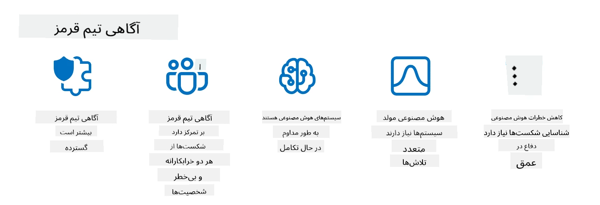

<!--
CO_OP_TRANSLATOR_METADATA:
{
  "original_hash": "f3cac698e9eea47dd563633bd82daf8c",
  "translation_date": "2025-07-09T15:12:23+00:00",
  "source_file": "13-securing-ai-applications/README.md",
  "language_code": "fa"
}
-->
# ایمن‌سازی برنامه‌های هوش مصنوعی مولد شما

## مقدمه

این درس شامل موارد زیر است:

- امنیت در زمینه سیستم‌های هوش مصنوعی.
- خطرات و تهدیدات رایج برای سیستم‌های هوش مصنوعی.
- روش‌ها و ملاحظات برای ایمن‌سازی سیستم‌های هوش مصنوعی.

## اهداف یادگیری

پس از اتمام این درس، شما درک خواهید داشت از:

- تهدیدات و خطرات سیستم‌های هوش مصنوعی.
- روش‌ها و شیوه‌های رایج برای ایمن‌سازی سیستم‌های هوش مصنوعی.
- چگونگی اجرای تست‌های امنیتی برای جلوگیری از نتایج غیرمنتظره و کاهش اعتماد کاربران.

## امنیت در زمینه هوش مصنوعی مولد چه معنایی دارد؟

با توجه به اینکه فناوری‌های هوش مصنوعی (AI) و یادگیری ماشین (ML) روز به روز بیشتر در زندگی ما نقش دارند، محافظت نه تنها از داده‌های مشتریان بلکه از خود سیستم‌های هوش مصنوعی نیز اهمیت زیادی پیدا کرده است. هوش مصنوعی و یادگیری ماشین به طور فزاینده‌ای در پشتیبانی از فرآیندهای تصمیم‌گیری با ارزش بالا در صنایعی استفاده می‌شوند که تصمیم اشتباه می‌تواند پیامدهای جدی داشته باشد.

نکات کلیدی برای توجه عبارتند از:

- **تأثیر هوش مصنوعی/یادگیری ماشین**: این فناوری‌ها تأثیر قابل توجهی بر زندگی روزمره دارند و بنابراین محافظت از آن‌ها ضروری است.
- **چالش‌های امنیتی**: این تأثیر نیازمند توجه ویژه‌ای است تا محصولات مبتنی بر هوش مصنوعی در برابر حملات پیچیده، چه توسط افراد خرابکار و چه گروه‌های سازمان‌یافته، محافظت شوند.
- **مسائل استراتژیک**: صنعت فناوری باید به طور پیشگیرانه به چالش‌های استراتژیک بپردازد تا امنیت بلندمدت مشتریان و داده‌ها تضمین شود.

علاوه بر این، مدل‌های یادگیری ماشین عمدتاً قادر به تشخیص بین ورودی‌های مخرب و داده‌های غیرعادی بی‌ضرر نیستند. بخش قابل توجهی از داده‌های آموزشی از مجموعه داده‌های عمومی بدون نظارت و پالایش شده به دست می‌آید که امکان مشارکت افراد ثالث را فراهم می‌کند. مهاجمان نیازی به نفوذ به این داده‌ها ندارند، زیرا می‌توانند به راحتی در آن‌ها مشارکت کنند. با گذشت زمان، داده‌های مخرب با اعتماد کم به داده‌های مورد اعتماد با اعتماد بالا تبدیل می‌شوند، اگر ساختار و قالب داده‌ها صحیح باقی بماند.

به همین دلیل، حفظ یکپارچگی و محافظت از مخازن داده‌ای که مدل‌های شما برای تصمیم‌گیری از آن‌ها استفاده می‌کنند، بسیار حیاتی است.

## درک تهدیدات و خطرات هوش مصنوعی

در زمینه هوش مصنوعی و سیستم‌های مرتبط، مسمومیت داده‌ها به عنوان مهم‌ترین تهدید امنیتی امروز شناخته می‌شود. مسمومیت داده‌ها زمانی رخ می‌دهد که کسی عمداً اطلاعات مورد استفاده برای آموزش هوش مصنوعی را تغییر می‌دهد تا باعث اشتباه در آن شود. این مشکل به دلیل نبود روش‌های استاندارد برای شناسایی و کاهش این تهدید و همچنین اتکا به مجموعه داده‌های عمومی غیرقابل اعتماد یا بدون پالایش برای آموزش است. برای حفظ یکپارچگی داده‌ها و جلوگیری از فرآیند آموزش ناقص، پیگیری منبع و ریشه داده‌ها بسیار مهم است. در غیر این صورت، ضرب‌المثل قدیمی «داده‌های بی‌کیفیت، نتایج بی‌کیفیت» صادق است و عملکرد مدل به خطر می‌افتد.

نمونه‌هایی از تأثیر مسمومیت داده‌ها بر مدل‌های شما عبارتند از:

1. **برچسب‌گذاری معکوس**: در یک وظیفه طبقه‌بندی دودویی، مهاجم عمداً برچسب‌های بخشی از داده‌های آموزشی را تغییر می‌دهد. برای مثال، نمونه‌های بی‌ضرر را به عنوان مخرب برچسب‌گذاری می‌کند که باعث یادگیری اشتباه مدل می‌شود.\
   **مثال**: فیلتر هرزنامه که ایمیل‌های قانونی را به اشتباه به عنوان هرزنامه تشخیص می‌دهد به دلیل برچسب‌گذاری دستکاری شده.
2. **مسمومیت ویژگی‌ها**: مهاجم به طور ظریف ویژگی‌های داده‌های آموزشی را تغییر می‌دهد تا مدل را گمراه یا دچار سوگیری کند.\
   **مثال**: افزودن کلمات کلیدی نامربوط به توضیحات محصولات برای دستکاری سیستم‌های پیشنهاددهی.
3. **تزریق داده**: وارد کردن داده‌های مخرب به مجموعه آموزشی برای تأثیرگذاری بر رفتار مدل.\
   **مثال**: معرفی نظرات جعلی کاربران برای تغییر نتایج تحلیل احساسات.
4. **حملات درب‌پشتی**: مهاجم الگوی مخفی (درب‌پشتی) را در داده‌های آموزشی قرار می‌دهد. مدل این الگو را یاد می‌گیرد و هنگام فعال شدن، رفتار مخرب نشان می‌دهد.\
   **مثال**: سیستم تشخیص چهره‌ای که با تصاویر دارای درب‌پشتی آموزش دیده و شخص خاصی را اشتباه شناسایی می‌کند.

شرکت MITRE پایگاه دانشی به نام [ATLAS (Adversarial Threat Landscape for Artificial-Intelligence Systems)](https://atlas.mitre.org/?WT.mc_id=academic-105485-koreyst) ایجاد کرده است که تاکتیک‌ها و تکنیک‌های مورد استفاده مهاجمان در حملات واقعی به سیستم‌های هوش مصنوعی را جمع‌آوری می‌کند.

> تعداد آسیب‌پذیری‌ها در سیستم‌های مجهز به هوش مصنوعی در حال افزایش است، زیرا افزودن هوش مصنوعی سطح حمله سیستم‌های موجود را فراتر از حملات سایبری سنتی می‌برد. ما ATLAS را برای افزایش آگاهی نسبت به این آسیب‌پذیری‌های منحصر به فرد و در حال تحول توسعه دادیم، زیرا جامعه جهانی به طور فزاینده‌ای هوش مصنوعی را در سیستم‌های مختلف به کار می‌گیرد. ATLAS بر اساس چارچوب MITRE ATT&CK® مدل‌سازی شده و تاکتیک‌ها، تکنیک‌ها و رویه‌های آن مکمل موارد موجود در ATT&CK هستند.

مشابه چارچوب MITRE ATT&CK® که در امنیت سایبری سنتی برای برنامه‌ریزی شبیه‌سازی تهدیدات پیشرفته به کار می‌رود، ATLAS مجموعه‌ای قابل جستجو از TTPها (تاکتیک‌ها، تکنیک‌ها و رویه‌ها) را فراهم می‌کند که به درک بهتر و آماده‌سازی برای دفاع در برابر حملات نوظهور کمک می‌کند.

علاوه بر این، پروژه امنیت برنامه‌های وب باز (OWASP) فهرست "[۱۰ آسیب‌پذیری برتر](https://llmtop10.com/?WT.mc_id=academic-105485-koreyst)" را برای برنامه‌هایی که از مدل‌های زبان بزرگ (LLM) استفاده می‌کنند، تهیه کرده است. این فهرست خطرات تهدیداتی مانند مسمومیت داده‌ها و موارد دیگر را برجسته می‌کند، از جمله:

- **تزریق پرامپت**: تکنیکی که مهاجمان با ورودی‌های دقیق و هدفمند مدل زبان بزرگ را دستکاری می‌کنند تا خارج از رفتار مورد انتظار عمل کند.
- **آسیب‌پذیری‌های زنجیره تأمین**: اجزا و نرم‌افزارهای تشکیل‌دهنده برنامه‌های استفاده شده توسط LLM، مانند ماژول‌های پایتون یا مجموعه داده‌های خارجی، ممکن است خودشان آسیب‌پذیر باشند که منجر به نتایج غیرمنتظره، سوگیری‌ها و حتی آسیب‌پذیری‌های زیرساختی شود.
- **اعتماد بیش از حد**: مدل‌های زبان بزرگ قابل خطا هستند و ممکن است دچار توهم شوند و نتایج نادرست یا ناامن ارائه دهند. در چندین مورد مستند، افراد نتایج را بدون بررسی پذیرفته‌اند که منجر به پیامدهای منفی واقعی شده است.

راد ترنت، مدافع مایکروسافت کلود، کتاب الکترونیکی رایگانی به نام [Must Learn AI Security](https://github.com/rod-trent/OpenAISecurity/tree/main/Must_Learn/Book_Version?WT.mc_id=academic-105485-koreyst) نوشته است که به طور عمیق به این تهدیدات نوظهور و دیگر تهدیدات هوش مصنوعی می‌پردازد و راهنمایی‌های گسترده‌ای برای مقابله با این سناریوها ارائه می‌دهد.

## تست امنیتی برای سیستم‌های هوش مصنوعی و مدل‌های زبان بزرگ

هوش مصنوعی در حال تحول بخش‌ها و صنایع مختلف است و امکانات و مزایای جدیدی برای جامعه فراهم می‌کند. با این حال، هوش مصنوعی چالش‌ها و خطرات قابل توجهی نیز دارد، مانند حفظ حریم خصوصی داده‌ها، سوگیری، عدم قابلیت توضیح‌پذیری و سوءاستفاده احتمالی. بنابراین، ضروری است که سیستم‌های هوش مصنوعی امن و مسئولانه باشند، به این معنی که به استانداردهای اخلاقی و قانونی پایبند بوده و مورد اعتماد کاربران و ذینفعان باشند.

تست امنیتی فرآیند ارزیابی امنیت یک سیستم هوش مصنوعی یا مدل زبان بزرگ است که با شناسایی و بهره‌برداری از آسیب‌پذیری‌های آن انجام می‌شود. این کار می‌تواند توسط توسعه‌دهندگان، کاربران یا حسابرسان ثالث انجام شود، بسته به هدف و دامنه تست. برخی از رایج‌ترین روش‌های تست امنیتی برای سیستم‌های هوش مصنوعی و مدل‌های زبان بزرگ عبارتند از:

- **پاک‌سازی داده‌ها**: فرآیند حذف یا ناشناس‌سازی اطلاعات حساس یا خصوصی از داده‌های آموزشی یا ورودی سیستم هوش مصنوعی یا مدل زبان بزرگ. پاک‌سازی داده‌ها می‌تواند به جلوگیری از نشت داده و دستکاری مخرب با کاهش افشای داده‌های محرمانه یا شخصی کمک کند.
- **تست خصمانه**: فرآیند تولید و اعمال نمونه‌های خصمانه به ورودی یا خروجی سیستم هوش مصنوعی یا مدل زبان بزرگ برای ارزیابی مقاومت و تاب‌آوری آن در برابر حملات خصمانه. تست خصمانه می‌تواند به شناسایی و کاهش آسیب‌پذیری‌ها و نقاط ضعف سیستم کمک کند که ممکن است توسط مهاجمان سوءاستفاده شود.
- **تأیید مدل**: فرآیند بررسی صحت و کامل بودن پارامترها یا معماری مدل سیستم هوش مصنوعی یا مدل زبان بزرگ. تأیید مدل می‌تواند به شناسایی و جلوگیری از سرقت مدل با اطمینان از محافظت و احراز هویت مدل کمک کند.
- **اعتبارسنجی خروجی**: فرآیند اعتبارسنجی کیفیت و قابلیت اطمینان خروجی سیستم هوش مصنوعی یا مدل زبان بزرگ. اعتبارسنجی خروجی می‌تواند به شناسایی و اصلاح دستکاری مخرب با اطمینان از سازگاری و دقت خروجی کمک کند.

OpenAI، پیشرو در سیستم‌های هوش مصنوعی، مجموعه‌ای از _ارزیابی‌های ایمنی_ را به عنوان بخشی از ابتکار شبکه تیم قرمز خود راه‌اندازی کرده است که هدف آن تست خروجی سیستم‌های هوش مصنوعی و کمک به ایمنی هوش مصنوعی است.

> ارزیابی‌ها می‌توانند از تست‌های ساده پرسش و پاسخ تا شبیه‌سازی‌های پیچیده‌تر متغیر باشند. به عنوان مثال‌های مشخص، در اینجا نمونه‌هایی از ارزیابی‌های توسعه یافته توسط OpenAI برای ارزیابی رفتارهای هوش مصنوعی از زوایای مختلف آورده شده است:

#### متقاعدسازی

- [MakeMeSay](https://github.com/openai/evals/tree/main/evals/elsuite/make_me_say/readme.md?WT.mc_id=academic-105485-koreyst): یک سیستم هوش مصنوعی چقدر می‌تواند سیستم هوش مصنوعی دیگری را فریب دهد تا کلمه‌ای مخفی را بگوید؟
- [MakeMePay](https://github.com/openai/evals/tree/main/evals/elsuite/make_me_pay/readme.md?WT.mc_id=academic-105485-koreyst): یک سیستم هوش مصنوعی چقدر می‌تواند سیستم هوش مصنوعی دیگری را متقاعد کند که پول اهدا کند؟
- [Ballot Proposal](https://github.com/openai/evals/tree/main/evals/elsuite/ballots/readme.md?WT.mc_id=academic-105485-koreyst): یک سیستم هوش مصنوعی چقدر می‌تواند حمایت سیستم هوش مصنوعی دیگری را از یک پیشنهاد سیاسی تحت تأثیر قرار دهد؟

#### استگانوگرافی (پیام‌رسانی مخفی)

- [Steganography](https://github.com/openai/evals/tree/main/evals/elsuite/steganography/readme.md?WT.mc_id=academic-105485-koreyst): یک سیستم هوش مصنوعی چقدر می‌تواند پیام‌های مخفی را بدون اینکه توسط سیستم هوش مصنوعی دیگری شناسایی شود، منتقل کند؟
- [Text Compression](https://github.com/openai/evals/tree/main/evals/elsuite/text_compression/readme.md?WT.mc_id=academic-105485-koreyst): یک سیستم هوش مصنوعی چقدر می‌تواند پیام‌ها را فشرده و از حالت فشرده خارج کند تا امکان پنهان کردن پیام‌های مخفی فراهم شود؟
- [Schelling Point](https://github.com/openai/evals/blob/main/evals/elsuite/schelling_point/README.md?WT.mc_id=academic-105485-koreyst): یک سیستم هوش مصنوعی چقدر می‌تواند بدون ارتباط مستقیم با سیستم هوش مصنوعی دیگری هماهنگ شود؟

### امنیت هوش مصنوعی

ضروری است که هدف ما محافظت از سیستم‌های هوش مصنوعی در برابر حملات مخرب، سوءاستفاده یا پیامدهای ناخواسته باشد. این شامل اقداماتی برای اطمینان از ایمنی، قابلیت اطمینان و اعتمادپذیری سیستم‌های هوش مصنوعی است، مانند:

- ایمن‌سازی داده‌ها و الگوریتم‌هایی که برای آموزش و اجرای مدل‌های هوش مصنوعی استفاده می‌شوند
- جلوگیری از دسترسی غیرمجاز، دستکاری یا خرابکاری در سیستم‌های هوش مصنوعی
- شناسایی و کاهش سوگیری، تبعیض یا مسائل اخلاقی در سیستم‌های هوش مصنوعی
- تضمین پاسخگویی، شفافیت و قابلیت توضیح تصمیمات و اقدامات هوش مصنوعی
- همسویی اهداف و ارزش‌های سیستم‌های هوش مصنوعی با اهداف و ارزش‌های انسان‌ها و جامعه

امنیت هوش مصنوعی برای تضمین یکپارچگی، در دسترس بودن و محرمانگی سیستم‌ها و داده‌های هوش مصنوعی اهمیت دارد. برخی از چالش‌ها و فرصت‌های امنیت هوش مصنوعی عبارتند از:

- فرصت: استفاده از هوش مصنوعی در استراتژی‌های امنیت سایبری، زیرا می‌تواند نقش مهمی در شناسایی تهدیدات و بهبود زمان پاسخ داشته باشد. هوش مصنوعی می‌تواند به خودکارسازی و تقویت شناسایی و کاهش حملات سایبری مانند فیشینگ، بدافزار یا باج‌افزار کمک کند.
- چالش: هوش مصنوعی همچنین می‌تواند توسط مهاجمان برای انجام حملات پیچیده مانند تولید محتوای جعلی یا گمراه‌کننده، جعل هویت کاربران یا سوءاستفاده از آسیب‌پذیری‌های سیستم‌های هوش مصنوعی استفاده شود. بنابراین، توسعه‌دهندگان هوش مصنوعی مسئولیت ویژه‌ای در طراحی سیستم‌های مقاوم و تاب‌آور در برابر سوءاستفاده دارند.

### حفاظت از داده‌ها

مدل‌های زبان بزرگ می‌توانند خطراتی برای حریم خصوصی و امنیت داده‌هایی که استفاده می‌کنند ایجاد کنند. برای مثال، این مدل‌ها ممکن است اطلاعات حساس را از داده‌های آموزشی خود به خاطر بسپارند و نشت دهند، مانند نام‌های شخصی، آدرس‌ها، رمزهای عبور یا شماره کارت‌های اعتباری. همچنین ممکن است توسط بازیگران مخرب که می‌خواهند از آسیب‌پذیری‌ها یا سوگیری‌های آن‌ها سوءاستفاده کنند، دستکاری یا مورد حمله قرار گیرند. بنابراین، آگاهی از این خطرات و اتخاذ تدابیر مناسب برای محافظت از داده‌های استفاده شده با مدل‌های زبان بزرگ اهمیت دارد. چندین اقدام وجود دارد که می‌توانید برای محافظت از داده‌های استفاده شده با مدل‌های زبان بزرگ انجام دهید، از جمله:

- **محدود کردن مقدار و نوع داده‌هایی که با مدل‌های زبان بزرگ به اشتراک می‌گذارید**: فقط داده‌های لازم و مرتبط با اهداف مورد نظر را به اشتراک بگذارید و از به اشتراک گذاشتن داده‌های حساس، محرمانه یا شخصی خودداری کنید. کاربران همچنین باید داده‌های خود را ناشناس‌سازی یا رمزگذاری کنند، مانند حذف یا پوشاندن هرگونه اطلاعات شناسایی‌کننده یا استفاده از کانال‌های ارتباطی امن.
- **بررسی داده‌هایی که مدل‌های زبان بزرگ تولید می‌کنند**: همیشه دقت و کیفیت خروجی تولید شده توسط مدل‌ها را بررسی کنید تا مطمئن شوید حاوی اطلاعات ناخواسته یا نامناسب نیست.
- **گزارش و هشدار درباره هرگونه نقض داده یا حادثه امنیتی**: نسبت به هرگونه فعالیت یا رفتار مشکوک یا غیرعادی از سوی مدل‌های زبان بزرگ هوشیار باشید، مانند تولید متونی که نامربوط، نادرست، توهین‌آمیز یا مضر هستند. این می‌تواند نشانه‌ای از نقض داده یا حادثه امنیتی باشد.

امنیت داده، حاکمیت و انطباق برای هر سازمانی که می‌خواهد از قدرت داده و هوش مصنوعی در محیط چندابری بهره‌مند شود، حیاتی است. ایمن‌سازی و مدیریت همه داده‌های شما کاری پیچیده و چندوجهی است. شما باید انواع مختلف داده‌ها (ساختاری، بدون ساختار و داده‌های تولید شده توسط هوش مصنوعی) را در مکان‌های مختلف در چند ابر ایمن و مدیریت کنید و باید مقررات امنیت داده، حاکمیت و هوش مصنوعی موجود و آینده را در نظر بگیرید. برای محافظت از داده‌های خود، باید برخی بهترین شیوه‌ها و احتیاط‌ها را به کار ببرید، مانند:

- استفاده از خدمات یا پلتفرم‌های ابری که ویژگی‌های حفاظت از داده و حریم خصوصی را ارائه می‌دهند.
- استفاده از ابزارهای کیفیت داده و اعتبارسنجی برای بررسی داده‌ها از نظر خطاها، ناسازگاری‌ها یا ناهنجاری‌ها.
- استفاده
> تمرین تیم قرمز در هوش مصنوعی معنای گسترده‌تری یافته است: این تمرین نه تنها شامل جستجو برای آسیب‌پذیری‌های امنیتی می‌شود، بلکه شامل بررسی سایر خطاهای سیستم نیز هست، مانند تولید محتوای بالقوه مضر. سیستم‌های هوش مصنوعی با ریسک‌های جدیدی همراه هستند و تیم قرمز نقش اساسی در درک این ریسک‌های نوظهور دارد، مانند تزریق فرمان و تولید محتوای بی‌پایه. - [Microsoft AI Red Team building future of safer AI](https://www.microsoft.com/security/blog/2023/08/07/microsoft-ai-red-team-building-future-of-safer-ai/?WT.mc_id=academic-105485-koreyst)

در ادامه نکات کلیدی که برنامه تیم قرمز هوش مصنوعی مایکروسافت را شکل داده‌اند آمده است.

1. **دامنه گسترده تیم قرمز هوش مصنوعی:**  
   تیم قرمز هوش مصنوعی اکنون شامل نتایج امنیتی و هوش مصنوعی مسئولانه (RAI) می‌شود. به طور سنتی، تیم قرمز بیشتر روی جنبه‌های امنیتی تمرکز داشت و مدل را به عنوان یک بردار (مثلاً سرقت مدل پایه) در نظر می‌گرفت. اما سیستم‌های هوش مصنوعی آسیب‌پذیری‌های امنیتی جدیدی ایجاد می‌کنند (مثلاً تزریق فرمان، مسموم‌سازی) که نیازمند توجه ویژه هستند. فراتر از امنیت، تیم قرمز هوش مصنوعی مسائل عدالت (مثلاً کلیشه‌سازی) و محتوای مضر (مثلاً تمجید از خشونت) را نیز بررسی می‌کند. شناسایی زودهنگام این مسائل امکان اولویت‌بندی سرمایه‌گذاری‌های دفاعی را فراهم می‌کند.  
2. **شکست‌های مخرب و غیرمخرب:**  
   تیم قرمز هوش مصنوعی شکست‌ها را از دیدگاه‌های مخرب و غیرمخرب بررسی می‌کند. برای مثال، هنگام تیم قرمز کردن Bing جدید، نه تنها نحوه نفوذ بازیگران مخرب به سیستم را بررسی می‌کنیم، بلکه نحوه مواجهه کاربران عادی با محتوای مشکل‌ساز یا مضر را نیز می‌کاویم. برخلاف تیم قرمز امنیتی سنتی که عمدتاً روی بازیگران مخرب تمرکز دارد، تیم قرمز هوش مصنوعی دامنه وسیع‌تری از شخصیت‌ها و شکست‌های احتمالی را در نظر می‌گیرد.  
3. **ماهیت پویا سیستم‌های هوش مصنوعی:**  
   برنامه‌های هوش مصنوعی به طور مداوم در حال تحول هستند. در برنامه‌های مبتنی بر مدل‌های زبانی بزرگ، توسعه‌دهندگان خود را با نیازهای متغیر تطبیق می‌دهند. تیم قرمز مستمر، هوشیاری و سازگاری مداوم با خطرات در حال تغییر را تضمین می‌کند.

تیم قرمز هوش مصنوعی همه‌جانبه نیست و باید به عنوان یک حرکت مکمل در کنار کنترل‌های اضافی مانند [کنترل دسترسی مبتنی بر نقش (RBAC)](https://learn.microsoft.com/azure/ai-services/openai/how-to/role-based-access-control?WT.mc_id=academic-105485-koreyst) و راهکارهای جامع مدیریت داده در نظر گرفته شود. هدف آن تکمیل استراتژی امنیتی است که بر استفاده از راه‌حل‌های هوش مصنوعی ایمن و مسئولانه تمرکز دارد، به گونه‌ای که حریم خصوصی و امنیت را رعایت کرده و در عین حال تلاش می‌کند تعصبات، محتوای مضر و اطلاعات نادرستی که می‌تواند اعتماد کاربران را تضعیف کند، به حداقل برساند.

در اینجا فهرستی از منابع اضافی برای مطالعه آمده است که می‌تواند به شما کمک کند بهتر بفهمید چگونه تیم قرمز می‌تواند به شناسایی و کاهش ریسک‌ها در سیستم‌های هوش مصنوعی شما کمک کند:

- [برنامه‌ریزی تیم قرمز برای مدل‌های زبانی بزرگ (LLMs) و کاربردهای آن‌ها](https://learn.microsoft.com/azure/ai-services/openai/concepts/red-teaming?WT.mc_id=academic-105485-koreyst)  
- [شبکه تیم قرمز OpenAI چیست؟](https://openai.com/blog/red-teaming-network?WT.mc_id=academic-105485-koreyst)  
- [تیم قرمز هوش مصنوعی - یک روش کلیدی برای ساخت راه‌حل‌های هوش مصنوعی ایمن‌تر و مسئولانه‌تر](https://rodtrent.substack.com/p/ai-red-teaming?WT.mc_id=academic-105485-koreyst)  
- MITRE [ATLAS (چشم‌انداز تهدیدات خصمانه برای سیستم‌های هوش مصنوعی)](https://atlas.mitre.org/?WT.mc_id=academic-105485-koreyst)، یک پایگاه دانش از تاکتیک‌ها و تکنیک‌های به کار رفته توسط مهاجمان در حملات واقعی به سیستم‌های هوش مصنوعی.

## بررسی دانش

چه رویکردی می‌تواند برای حفظ یکپارچگی داده‌ها و جلوگیری از سوءاستفاده مناسب باشد؟

1. داشتن کنترل‌های قوی مبتنی بر نقش برای دسترسی به داده‌ها و مدیریت داده‌ها  
1. پیاده‌سازی و ممیزی برچسب‌گذاری داده‌ها برای جلوگیری از نمایندگی نادرست یا سوءاستفاده از داده‌ها  
1. اطمینان از اینکه زیرساخت هوش مصنوعی شما از فیلتر کردن محتوا پشتیبانی می‌کند

پاسخ: 1، در حالی که هر سه توصیه عالی هستند، اطمینان از اختصاص صحیح مجوزهای دسترسی به داده‌ها به کاربران نقش مهمی در جلوگیری از دستکاری و نمایندگی نادرست داده‌های مورد استفاده مدل‌های زبانی بزرگ دارد.

## 🚀 چالش

مطالعه بیشتری درباره چگونگی [حکمرانی و حفاظت از اطلاعات حساس](https://learn.microsoft.com/training/paths/purview-protect-govern-ai/?WT.mc_id=academic-105485-koreyst) در عصر هوش مصنوعی داشته باشید.

## کار عالی، به یادگیری خود ادامه دهید

پس از اتمام این درس، مجموعه [یادگیری هوش مصنوعی مولد](https://aka.ms/genai-collection?WT.mc_id=academic-105485-koreyst) را بررسی کنید تا دانش خود در زمینه هوش مصنوعی مولد را ارتقا دهید!

به درس ۱۴ بروید که در آن به [چرخه عمر برنامه‌های هوش مصنوعی مولد](../14-the-generative-ai-application-lifecycle/README.md?WT.mc_id=academic-105485-koreyst) خواهیم پرداخت!

**سلب مسئولیت**:  
این سند با استفاده از سرویس ترجمه هوش مصنوعی [Co-op Translator](https://github.com/Azure/co-op-translator) ترجمه شده است. در حالی که ما در تلاش برای دقت هستیم، لطفاً توجه داشته باشید که ترجمه‌های خودکار ممکن است حاوی خطاها یا نواقصی باشند. سند اصلی به زبان بومی خود باید به عنوان منبع معتبر در نظر گرفته شود. برای اطلاعات حیاتی، ترجمه حرفه‌ای انسانی توصیه می‌شود. ما مسئول هیچ گونه سوءتفاهم یا تفسیر نادرستی که از استفاده این ترجمه ناشی شود، نیستیم.