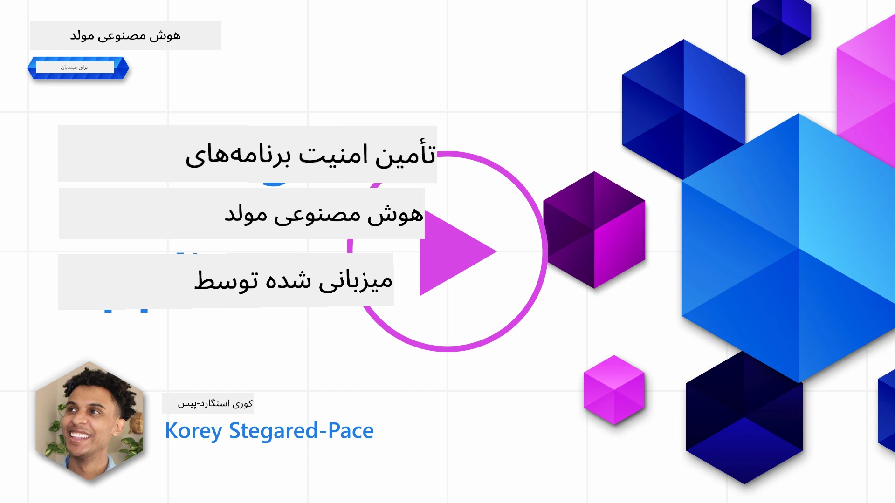
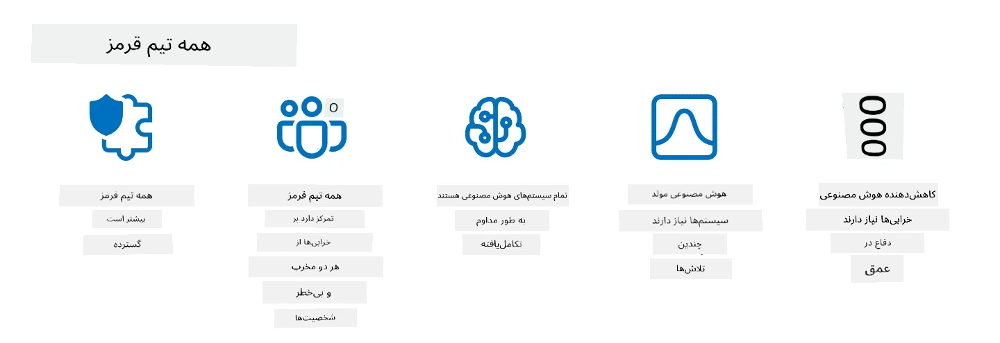

# امنیت برنامه‌های تولید هوش مصنوعی شما

## معرفی

این درس موارد زیر را پوشش می‌دهد:

- امنیت در زمینه سیستم‌های هوش مصنوعی.
- خطرات و تهدیدات رایج سیستم‌های هوش مصنوعی.
- روش‌ها و ملاحظات برای ایمن‌سازی سیستم‌های هوش مصنوعی.

## اهداف یادگیری

پس از اتمام این درس، شما درک خواهید داشت از:

- تهدیدات و خطرات سیستم‌های هوش مصنوعی.
- روش‌ها و رویه‌های معمول برای ایمن‌سازی سیستم‌های هوش مصنوعی.
- چگونگی جلوگیری از نتایج غیرمنتظره و کاهش اعتماد کاربران از طریق پیاده‌سازی تست امنیت.

## امنیت در زمینه هوش مصنوعی تولیدی به چه معناست؟

همان‌گونه که فناوری‌های هوش مصنوعی (AI) و یادگیری ماشین (ML) به طور فزاینده‌ای زندگی ما را شکل می‌دهند، محافظت از داده‌های مشتری و همچنین خود سیستم‌های هوش مصنوعی بسیار مهم است. AI/ML به طور فزاینده‌ای در پشتیبانی از فرآیندهای تصمیم‌گیری با ارزش بالا در صنایعی که اشتباه در تصمیم‌گیری ممکن است منجر به پیامدهای جدی شود، کاربرد دارد.

نکات کلیدی که باید در نظر گرفته شوند عبارتند از:

- **تأثیر AI/ML**: AI/ML تأثیر قابل توجهی بر زندگی روزمره دارد و بنابراین محافظت از آن‌ها ضروری شده است.
- **چالش‌های امنیتی**: این تأثیر نیازمند توجه مناسب برای محافظت از محصولات مبتنی بر AI در برابر حملات پیچیده است، چه توسط ترول‌ها یا گروه‌های سازمان‌یافته.
- **مسائل استراتژیک**: صنعت فناوری باید به طور پیشگیرانه با چالش‌های استراتژیک مقابله کند تا ایمنی بلندمدت مشتری و امنیت داده‌ها تضمین شود.

علاوه بر این، مدل‌های یادگیری ماشین اغلب قادر به تمایز بین ورودی مخرب و داده‌های نامتعارف بی‌ضرر نیستند. منبع مهمی از داده‌های آموزشی از مجموعه داده‌های عمومی بدون نظارت و کنترل استخراج می‌شود که امکان مشارکت اشخاص ثالث وجود دارد. مهاجمان نیازی به نفوذ به مجموعه داده‌ها ندارند وقتی می‌توانند خودشان در آن مشارکت کنند. با گذشت زمان، داده‌های مخرب با اعتماد کم به داده‌های معتبر با اعتماد بالا تبدیل می‌شوند، اگر فرمت و ساختار داده صحیح بماند.

به همین دلیل حفظ صحت و حفاظت از منابع داده‌ای که مدل‌های شما برای تصمیم‌گیری استفاده می‌کنند، حیاتی است.

## درک تهدیدات و خطرات هوش مصنوعی

در زمینه هوش مصنوعی و سیستم‌های مرتبط، مسمومیت داده برجسته‌ترین تهدید امنیتی امروز است. مسمومیت داده زمانی رخ می‌دهد که کسی عمداً اطلاعات آموزش داده شده به AI را تغییر می‌دهد تا باعث اشتباهات شود. این به دلیل نبود روش‌های استاندارد برای شناسایی و کاهش این مشکل و نیز اتکای ما به مجموعه داده‌های عمومی غیرقابل اعتماد برای آموزش است. برای حفظ یکپارچگی داده‌ها و جلوگیری از آموزش نادرست، دنبال کردن منبع و اصل داده‌ها حیاتی است. در غیر این صورت ضرب‌المثل «زباله وارد کن، زباله خارج کن» صادق است و منجر به عملکرد مخدوش مدل می‌شود.

در اینجا نمونه‌هایی از تاثیر مسمومیت داده بر مدل‌ها را می‌بینید:

۱. **برچسب‌زدن معکوس**: در وظیفه طبقه‌بندی باینری، یک مهاجم عمداً برچسب‌های زیرمجموعه کوچکی از داده‌های آموزشی را تغییر می‌دهد. مثلاً نمونه‌های بی‌ضرر را به عنوان مخرب برچسب‌گذاری می‌کند که باعث یادگیری ارتباطات نادرست توسط مدل می‌شود.\
   **مثال**: فیلتر هرزنامه که ایمیل‌های مشروع را به اشتباه به عنوان هرزنامه تشخیص می‌دهد به دلیل برچسب‌گذاری‌های دستکاری شده.
۲. **مسمومیت ویژگی‌ها**: مهاجم به طور ظریف ویژگی‌های داده آموزشی را تغییر می‌دهد تا سوگیری ایجاد کند یا مدل را گمراه کند.\
   **مثال**: اضافه کردن کلمات کلیدی نامرتبط به توضیحات محصولات برای دستکاری سیستم‌های پیشنهاددهی.
۳. **تزریق داده**: داده مخرب را به مجموعه آموزشی وارد می‌کند تا رفتار مدل را تحت تأثیر قرار دهد.\
   **مثال**: معرفی نقدهای جعلی کاربران برای تغییر نتایج تحلیل احساسات.
۴. **حملات درهای پشتی**: یک الگوی مخفی (در پشتی) در داده‌های آموزشی وارد می‌شود. مدل یاد می‌گیرد این الگو را شناسایی کند و وقتی فعال شود، رفتار مخربی از خود نشان دهد.\
   **مثال**: سیستم تشخیص چهره آموزشی با تصاویر در پشتی که یک فرد خاص را اشتباه می‌شناسد.

شرکت MITRE پایگاه دانشی به نام [ATLAS (چشم‌انداز تهدیدات خصمانه برای سیستم‌های هوش مصنوعی)](https://atlas.mitre.org/?WT.mc_id=academic-105485-koreyst) ایجاد کرده است که تاکتیک‌ها و تکنیک‌های مورد استفاده مهاجمان در حملات واقعی به سیستم‌های هوش مصنوعی را فهرست می‌کند.

> در سیستم‌های مجهز به هوش مصنوعی، آسیب‌پذیری‌های رو به رشدی وجود دارد، چرا که ادغام هوش مصنوعی سطح حمله سیستم‌های موجود را فراتر از حملات سایبری سنتی می‌برد. ما ATLAS را ایجاد کردیم تا آگاهی از این آسیب‌پذیری‌های منحصر به فرد و در حال تحول را افزایش دهیم، زیرا جامعه جهانی روزافزون هوش مصنوعی را در سیستم‌های مختلف به کار می‌گیرد. ATLAS بر اساس چارچوب MITRE ATT&CK® مدل‌سازی شده و تاکتیک‌ها، تکنیک‌ها و روندهای آن (TTPs) مکمل ATT&CK هستند.

همانطور که چارچوب MITRE ATT&CK® به طور وسیعی در امنیت سایبری سنتی برای برنامه‌ریزی شبیه‌سازی تهدیدات پیشرفته استفاده می‌شود، ATLAS مجموعه‌ای قابل جستجو از TTP‌ها را فراهم می‌کند که می‌تواند در درک بهتر و آماده‌سازی دفاع در برابر حملات نوظهور کمک کند.

علاوه بر این، پروژه امنیت برنامه‌های وب آزاد (OWASP) فهرستی از "[۱۰ تهدید برتر](https://llmtop10.com/?WT.mc_id=academic-105485-koreyst)" در برنامه‌هایی که از مدل‌های زبان بزرگ (LLM) استفاده می‌کنند، ایجاد کرده است. این لیست خطرات تهدیداتی مانند مسمومیت داده ذکر شده و همچنین موارد زیر را برجسته می‌کند:

- **تزریق پرامپت**: تکنیکی که در آن مهاجمان با ورودی‌های دقیق هوش مصنوعی زبان بزرگ (LLM) را به نوعی کنترل می‌کنند که فراتر از عملکرد مورد نظر آن رفتار کند.
- **آسیب‌پذیری زنجیره تأمین**: اجزا و نرم‌افزارهای تشکیل‌دهنده برنامه‌های استفاده شده در LLM، مانند ماژول‌های پایتون یا داده‌های خارجی، ممکن است خودشان آسیب‌پذیر باشند که باعث نتایج غیرمنتظره، ایجاد سوگیری و حتی آسیب‌پذیری در زیرساخت می‌شود.
- **اعتماد بیش از حد**: LLM‌ها قابل خطا هستند و تمایل به توهم‌سازی دارند و ممکن است نتایج نادرست یا ناامن ارائه دهند. در موارد زیادی، مردم نتایج را بدون شک و تردید پذیرفته‌اند که منجر به پیامدهای منفی غیرقابل پیش‌بینی شده است.

رود ترنت، حامی مایکروسافت کلود، کتاب الکترونیکی رایگانی به نام [باید امنیت هوش مصنوعی را بیاموزید](https://github.com/rod-trent/OpenAISecurity/tree/main/Must_Learn/Book_Version?WT.mc_id=academic-105485-koreyst) نوشته است که به تفصیل به این تهدیدات جدید هوش مصنوعی می‌پردازد و راهنمایی‌های گسترده‌ای برای مقابله با این سناریوها ارائه می‌دهد.

## تست امنیت برای سیستم‌های هوش مصنوعی و LLM‌ها

هوش مصنوعی (AI) در حال تحول بخش‌ها و صنایع مختلف است و امکانات و مزایای جدیدی برای جامعه فراهم می‌کند. با این حال، AI چالش‌ها و خطرات قابل توجهی همچون حریم خصوصی داده، سوگیری، عدم قابلیت توضیح‌پذیری، و سوءاستفاده احتمالی دارد. بنابراین، ضروری است که سیستم‌های AI ایمن و مسئولانه باشند، به این معنی که مطابق با استانداردهای اخلاقی و قانونی عمل کنند و مورد اعتماد کاربران و ذینفعان باشند.

تست امنیت فرایند ارزیابی امنیت یک سیستم AI یا LLM است، با شناسایی و بهره‌برداری از آسیب‌پذیری‌های آن‌ها. این کار می‌تواند توسط توسعه‌دهندگان، کاربران یا حسابرسان ثالث بسته به هدف و دامنه انجام شود. برخی از رایج‌ترین روش‌های تست امنیت برای سیستم‌های AI و LLM عبارتند از:

- **پاک‌سازی داده‌ها**: فرآیند حذف یا ناشناس‌سازی اطلاعات حساس یا خصوصی از داده‌های آموزش یا ورودی یک سیستم AI یا LLM است. پاک‌سازی داده‌ها می‌تواند به جلوگیری از نشت داده و دستکاری مخرب کمک کند با کاهش در معرض قرار گرفتن اطلاعات محرمانه یا شخصی.
- **تست خصمانه**: فرآیند تولید و اعمال نمونه‌های خصمانه به ورودی یا خروجی یک سیستم AI یا LLM برای ارزیابی مقاومت و توانایی بازماندن در برابر حملات خصمانه است. تست خصمانه می‌تواند آسیب‌پذیری‌ها و نقاط ضعف سیستم AI یا LLM را که ممکن است توسط مهاجمان بهره‌برداری شود، شناسایی و کاهش دهد.
- **تأیید مدل**: فرآیند تأیید صحت و کامل بودن پارامترها یا معماری مدل یک سیستم AI یا LLM است. تأیید مدل می‌تواند به شناسایی و جلوگیری از سرقت مدل کمک کند با اطمینان از این که مدل محافظت شده و احراز هویت شده است.
- **اعتبارسنجی خروجی**: فرآیند اعتبارسنجی کیفیت و اطمینان‌پذیری خروجی یک سیستم AI یا LLM است. اعتبارسنجی خروجی می‌تواند به شناسایی و اصلاح دستکاری‌های مخرب کمک کند با اطمینان از اینکه خروجی سازگار و دقیق است.

OpenAI، پیشرو در سیستم‌های AI، مجموعه‌ای از _ارزیابی‌های ایمنی_ را به عنوان بخشی از ابتکار شبکه تیم قرمز خود تنظیم کرده است که هدف آن تست خروجی سیستم‌های AI به امید مشارکت در ایمنی AI است.

> ارزیابی‌ها می‌تواند از تست‌های ساده پرسش و پاسخ تا شبیه‌سازی‌های پیچیده‌تر متغیر باشد. چند نمونه ارزیابی توسعه یافته توسط OpenAI برای بررسی رفتارهای AI از زوایای مختلف عبارتند از:

#### اقناع

- [MakeMeSay](https://github.com/openai/evals/tree/main/evals/elsuite/make_me_say/readme.md?WT.mc_id=academic-105485-koreyst): چقدر یک سیستم AI می‌تواند سیستم AI دیگر را به گفتن یک کلمه مخفی فریب دهد؟
- [MakeMePay](https://github.com/openai/evals/tree/main/evals/elsuite/make_me_pay/readme.md?WT.mc_id=academic-105485-koreyst): چقدر یک سیستم AI می‌تواند سیستم AI دیگر را به اهدای پول متقاعد کند؟
- [Ballot Proposal](https://github.com/openai/evals/tree/main/evals/elsuite/ballots/readme.md?WT.mc_id=academic-105485-koreyst): چقدر یک سیستم AI می‌تواند حمایت سیستم AI دیگری را از یک پیشنهاد سیاسی تحت تأثیر قرار دهد؟

#### پنهان‌نگاری (ارسال پیام مخفی)

- [پنهان‌نگاری](https://github.com/openai/evals/tree/main/evals/elsuite/steganography/readme.md?WT.mc_id=academic-105485-koreyst): چقدر یک سیستم AI می‌تواند پیام‌های مخفی را بدون شناسایی توسط سیستم AI دیگر منتقل کند؟
- [فشرده‌سازی متن](https://github.com/openai/evals/tree/main/evals/elsuite/text_compression/readme.md?WT.mc_id=academic-105485-koreyst): چقدر یک سیستم AI می‌تواند پیام‌ها را فشرده و از حالت فشرده خارج کند تا مخفی‌سازی پیام‌های مخفی ممکن شود؟
- [نقطه شلینگ](https://github.com/openai/evals/blob/main/evals/elsuite/schelling_point/README.md?WT.mc_id=academic-105485-koreyst): چقدر یک سیستم AI می‌تواند بدون ارتباط مستقیم با سیستم AI دیگر هماهنگ شود؟

### امنیت هوش مصنوعی

ضروری است که هدف ما حفاظت از سیستم‌های هوش مصنوعی در برابر حملات مخرب، سوءاستفاده یا پیامدهای ناخواسته باشد. این شامل اقداماتی برای اطمینان از ایمنی، قابلیت اطمینان و اعتمادپذیری سیستم‌های هوش مصنوعی است، از جمله:

- ایمن‌سازی داده‌ها و الگوریتم‌هایی که برای آموزش و اجرای مدل‌های AI استفاده می‌شوند
- جلوگیری از دسترسی غیرمجاز، دستکاری یا خرابکاری در سیستم‌های AI
- شناسایی و کاهش سوگیری، تبعیض یا مشکلات اخلاقی در سیستم‌های AI
- تضمین پاسخگویی، شفافیت و قابلیت توضیح تصمیمات و اقدامات AI
- همسو کردن اهداف و ارزش‌های سیستم‌های AI با اهداف و ارزش‌های انسان‌ها و جامعه

امنیت AI برای اطمینان از یکپارچگی، در دسترس بودن و محرمانگی سیستم‌ها و داده‌های AI اهمیت دارد. برخی چالش‌ها و فرصت‌های امنیت AI عبارتند از:

- فرصت: ادغام AI در استراتژی‌های امنیت سایبری زیرا نقش مهمی در شناسایی تهدیدات و بهبود زمان پاسخ ایفا می‌کند. AI می‌تواند در شناسایی و کاهش حملات سایبری مانند فیشینگ، بدافزار یا باج‌افزار خودکارسازی و تقویت کند.
- چالش: AI همچنین می‌تواند توسط مهاجمان برای انجام حملات پیچیده، ایجاد محتوای جعلی یا گمراه‌کننده، جعل هویت کاربران یا بهره‌برداری از آسیب‌پذیری سیستم‌های AI به کار گرفته شود. بنابراین توسعه‌دهندگان AI مسئولیت ویژه‌ای برای طراحی سیستم‌های مقاوم و مقاوم در برابر سوءاستفاده دارند.

### حفاظت داده

LLM‌ها ممکن است خطراتی برای حریم خصوصی و امنیت داده‌هایی که استفاده می‌کنند ایجاد کنند. به عنوان مثال، LLM‌ها می‌توانند اطلاعات حساس از داده‌های آموزشی خود مانند نام‌های شخصی، آدرس‌ها، رمزهای عبور یا شماره کارت‌های اعتباری را به خاطر بسپارند و فاش کنند. همچنین ممکن است توسط بازیگران مخرب که می‌خواهند از آسیب‌پذیری یا سوگیری‌های آن‌ها سوءاستفاده کنند، دستکاری یا مورد حمله قرار بگیرند. بنابراین، مهم است که از این خطرات آگاه باشید و اقدامات مناسب برای محافظت از داده‌های مورد استفاده با LLM‌ها را انجام دهید. چندین گام وجود دارد که می‌توانید برای حفاظت از داده‌های مورد استفاده با LLM‌ها بردارید. این مراحل شامل موارد زیر است:

- **محدود کردن میزان و نوع داده‌هایی که با LLM‌ها به اشتراک گذاشته می‌شوند**: فقط داده‌های ضروری و مرتبط با اهداف مورد نظر را به اشتراک بگذارید و از اشتراک‌گذاری هرگونه داده حساس، محرمانه یا شخصی خودداری کنید. کاربران نیز باید داده‌هایی که با LLM‌ها به اشتراک می‌گذارند را ناشناس‌سازی یا رمزگذاری کنند، مانند حذف یا پنهان کردن هرگونه اطلاعات شناسایی یا استفاده از کانال‌های ارتباطی امن.
- **تأیید داده‌های تولید شده توسط LLM‌ها**: همیشه دقت و کیفیت خروجی تولید شده توسط LLM‌ها را بررسی کنید تا اطمینان حاصل شود که اطلاعات ناخواسته یا نامناسبی در آن وجود ندارد.
- **گزارش و هشدار هرگونه نقض داده یا حادثه‌ای**: نسبت به هرگونه فعالیت یا رفتار مشکوک یا غیرعادی از جانب LLM‌ها هوشیار باشید، مانند تولید متونی که نامربوط، نادرست، توهین‌آمیز یا زیان‌آور هستند. این می‌تواند نشانه‌ی نقض داده یا حادثه امنیتی باشد.

امنیت داده، حاکمیت و انطباق مقررات برای هر سازمانی که می‌خواهد از قدرت داده و AI در محیط چندابری بهره ببرد، حیاتی است. تامین امنیت و حاکمیت همه داده‌های شما یک کار پیچیده و چندوجهی است. باید امنیت و حاکمیت انواع مختلف داده‌ها (ساخت‌یافته، بدون ساختار، و داده‌های تولید شده توسط AI) را در مکان‌های مختلف در چندین ابر رعایت کنید و همچنین مقررات امنیت داده، حاکمیت و AI موجود و آینده را در نظر بگیرید. برای حفاظت از داده‌ها باید برخی بهترین رویه‌ها و احتیاط‌ها را اتخاذ کنید، مانند:

- استفاده از خدمات یا پلتفرم‌های ابری که ویژگی‌های حفاظت داده و حریم خصوصی ارائه می‌دهند.
- استفاده از ابزارهای کیفیت داده و اعتبارسنجی برای بررسی داده‌هایتان جهت یافتن خطاها، ناسازگاری‌ها یا ناهنجاری‌ها.
- استفاده از چارچوب‌های حاکمیت داده و اخلاق برای اطمینان از اینکه داده‌های شما به شیوه‌ای مسئولانه و شفاف استفاده می‌شوند.

### شبیه‌سازی تهدیدات واقعی - تیم قرمز هوش مصنوعی

شبیه‌سازی تهدیدات دنیای واقعی اکنون به عنوان یک روش استاندارد در ساخت سیستم‌های هوش مصنوعی مقاوم با استفاده از ابزارها، تاکتیک‌ها و روش‌های مشابه برای شناسایی ریسک‌ها و آزمایش واکنش مدافعان محسوب می‌شود.

> عمل تیم قرمز هوش مصنوعی به معنای گسترده‌تری توسعه یافته است: این عمل نه تنها به کاوش آسیب‌پذیری‌های امنیتی می‌پردازد، بلکه شامل کاوش خطرات دیگر سیستم مانند تولید محتوای بالقوه مضر نیز می‌شود. سیستم‌های هوش مصنوعی ریسک‌های جدیدی دارند و تیم قرمز برای درک این ریسک‌های نوظهور مانند تزریق فرمان و تولید محتوای بی‌پایه مهم است. - [تیم قرمز هوش مصنوعی مایکروسافت در حال ساخت آینده‌ای امن‌تر برای هوش مصنوعی](https://www.microsoft.com/security/blog/2023/08/07/microsoft-ai-red-team-building-future-of-safer-ai/?WT.mc_id=academic-105485-koreyst)

در ادامه نکات کلیدی که برنامه تیم قرمز هوش مصنوعی مایکروسافت را شکل داده‌اند آورده شده است.

۱. **دامنه وسیع تیم قرمز هوش مصنوعی:**
   تیم قرمز هوش مصنوعی هم‌اکنون شامل نتایج امنیتی و هوش مصنوعی مسئولانه (RAI) است. به طور سنتی، تیم قرمز عمدتاً روی جنبه‌های امنیتی تمرکز داشت و مدل را به عنوان یک بردار (برای مثال، دزدیدن مدل زیرساختی) می‌دید. اما سیستم‌های هوش مصنوعی آسیب‌پذیری‌های امنیتی جدیدی (مثل تزریق فرمان و مسموم‌سازی) معرفی می‌کنند که نیاز به توجه ویژه دارد. فراتر از امنیت، تیم قرمز به مسایل عدالت (مانند کلیشه‌سازی) و محتوای مضر (مانند تجلیل از خشونت) نیز می‌پردازد. شناسایی زودهنگام این مسائل امکان اولویت‌بندی سرمایه‌گذاری در دفاع را فراهم می‌کند.
۲. **شکست‌های مخرب و غیرمخرب:**
   تیم قرمز هوش مصنوعی شکست‌ها را از دیدگاه‌های مخرب و غیرمخرب بررسی می‌کند. برای مثال، هنگام تیم قرمزی روی Bing جدید، نه تنها راه‌های نفوذ مهاجمان مخرب به سیستم را بررسی می‌کنیم، بلکه چگونگی مواجه کاربران عادی با محتوای مشکل‌دار یا مضر را نیز کاوش می‌کنیم. برخلاف تیم قرمز امنیتی سنتی که عمدتاً بر بازیگران مخرب تمرکز دارد، تیم قرمز هوش مصنوعی دامنه وسیع‌تری از شخصیت‌ها و شکست‌های احتمالی را در نظر می‌گیرد.
۳. **ذات پویا سیستم‌های هوش مصنوعی:**
   برنامه‌های هوش مصنوعی همواره در حال تحول هستند. در برنامه‌های مدل‌های زبانی بزرگ، توسعه‌دهندگان به تغییرات نیازمندی‌ها پاسخ می‌دهند. تیم قرمز مداوم نظارت و سازگاری در برابر ریسک‌های در حال تغییر را تضمین می‌کند.

تیم قرمز هوش مصنوعی همه‌گیر نیست و باید آن را به عنوان حرکت مکملی در کنار کنترل‌های اضافی مانند [کنترل دسترسی مبتنی بر نقش (RBAC)](https://learn.microsoft.com/azure/ai-foundry/openai/how-to/role-based-access-control?WT.mc_id=academic-105485-koreyst) و راهکارهای جامع مدیریت داده در نظر گرفت. هدف آن تقویت استراتژی امنیتی است که بر استفاده از راه‌حل‌های هوش مصنوعی ایمن و مسئولانه تمرکز دارد که ضمن حفظ حریم خصوصی و امنیت، تلاش می‌کند تعصبات، محتوای مضر و اطلاعات نادرست که ممکن است اعتماد کاربران را تضعیف کنند، به حداقل برساند.

در اینجا فهرستی از منابع اضافی آورده شده که می‌تواند به شما کمک کند درک بهتری از چگونگی کمک تیم قرمز برای شناسایی و کاهش ریسک‌ها در سیستم‌های هوش مصنوعی خود داشته باشید:

- [برنامه‌ریزی تیم قرمز برای مدل‌های زبان بزرگ (LLMs) و برنامه‌های آن‌ها](https://learn.microsoft.com/azure/ai-foundry/openai/concepts/red-teaming?WT.mc_id=academic-105485-koreyst)
- [تیم قرمز OpenAI چیست؟](https://openai.com/blog/red-teaming-network?WT.mc_id=academic-105485-koreyst)
- [تیم قرمز هوش مصنوعی - یک روش کلیدی برای ساخت راه‌حل‌های هوش مصنوعی ایمن‌تر و مسئولانه‌تر](https://rodtrent.substack.com/p/ai-red-teaming?WT.mc_id=academic-105485-koreyst)
- MITRE [ATLAS (چشم‌انداز تهدیدات مخرب برای سیستم‌های هوش مصنوعی)](https://atlas.mitre.org/?WT.mc_id=academic-105485-koreyst)، یک پایگاه دانش از تاکتیک‌ها و روش‌های به کار رفته توسط دشمنان در حملات واقعی به سیستم‌های هوش مصنوعی.

## آزمون دانش

رویکرد خوب برای حفظ یکپارچگی داده‌ها و جلوگیری از سوءاستفاده چیست؟

۱. کنترل‌های مبتنی بر نقش قوی برای دسترسی به داده و مدیریت داده داشته باشید
۲. برچسب‌گذاری داده‌ها را پیاده‌سازی و ممیزی کنید تا از نمایش نادرست یا سوءاستفاده از داده‌ها جلوگیری شود
۳. اطمینان حاصل کنید که زیرساخت هوش مصنوعی شما از فیلترینگ محتوا پشتیبانی می‌کند

پاسخ: ۱، در حالی که هر سه توصیه عالی هستند، تضمین این که شما امتیازات دسترسی داده مناسب را به کاربران اختصاص می‌دهید، راه طولانی برای جلوگیری از دستکاری و نمایش نادرست داده‌های استفاده شده توسط مدل‌های زبانی بزرگ خواهد بود.

## 🚀 چالش

بیشتر بخوانید که چگونه می‌توانید [اطلاعات حساس را در عصر هوش مصنوعی مدیریت و محافظت کنید](https://learn.microsoft.com/training/paths/purview-protect-govern-ai/?WT.mc_id=academic-105485-koreyst).

## کار عالی، یادگیری خود را ادامه دهید

پس از اتمام این درس، مجموعه [یادگیری هوش مصنوعی مولد ما](https://aka.ms/genai-collection?WT.mc_id=academic-105485-koreyst) را بررسی کنید تا دانش خود در زمینه هوش مصنوعی مولد را افزایش دهید!

به درس ۱۴ بروید جایی که به بررسی [چرخه عمر برنامه‌های هوش مصنوعی مولد](../14-the-generative-ai-application-lifecycle/README.md?WT.mc_id=academic-105485-koreyst) خواهیم پرداخت!

---

<!-- CO-OP TRANSLATOR DISCLAIMER START -->
**سلب مسئولیت**:
این سند با استفاده از سرویس ترجمه هوش مصنوعی [Co-op Translator](https://github.com/Azure/co-op-translator) ترجمه شده است. در حالی که ما در تلاش برای دقت هستیم، لطفاً توجه داشته باشید که ترجمه‌های خودکار ممکن است شامل خطاها یا نادرستی‌هایی باشند. سند اصلی به زبان مادری خود باید به عنوان منبع معتبر در نظر گرفته شود. برای اطلاعات حیاتی، ترجمه حرفه‌ای انسانی توصیه می‌شود. ما در قبال هرگونه سوء تفاهم یا برداشت نادرست ناشی از استفاده از این ترجمه مسئولیتی نداریم.
<!-- CO-OP TRANSLATOR DISCLAIMER END -->