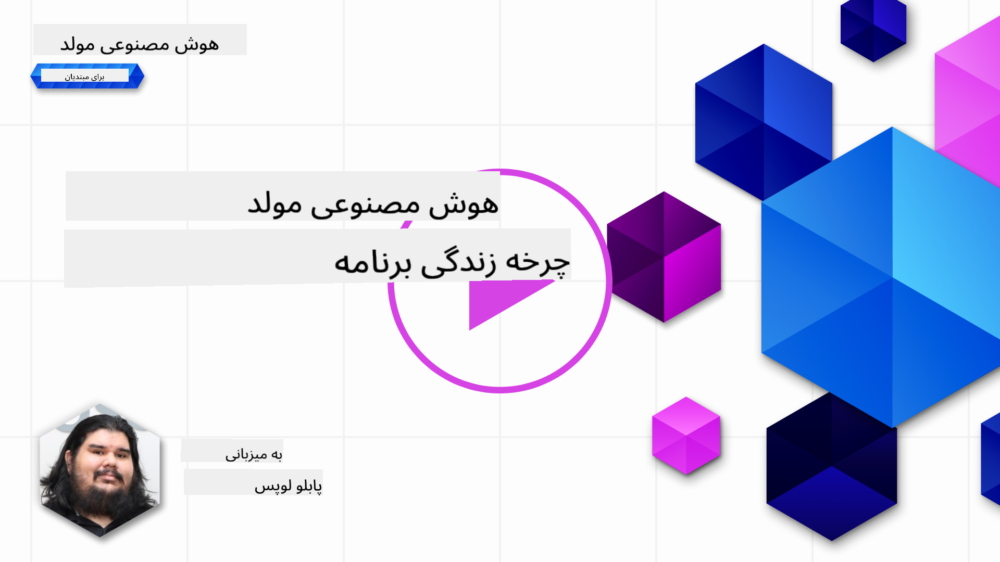
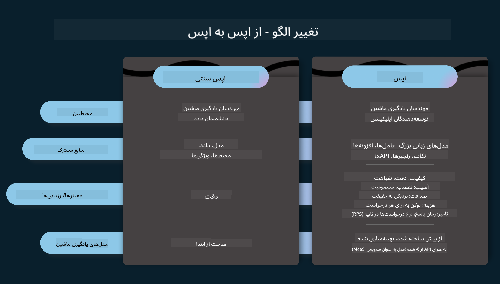
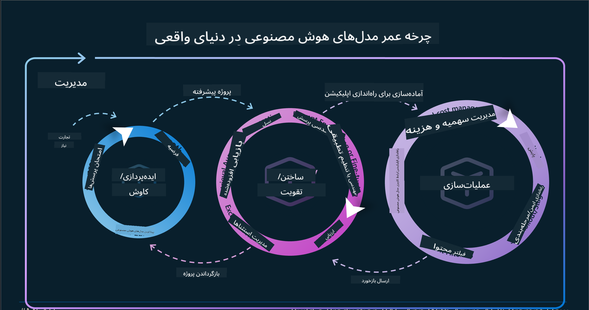
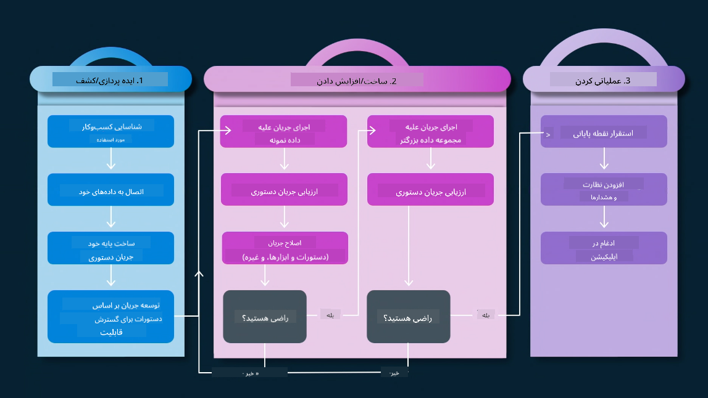
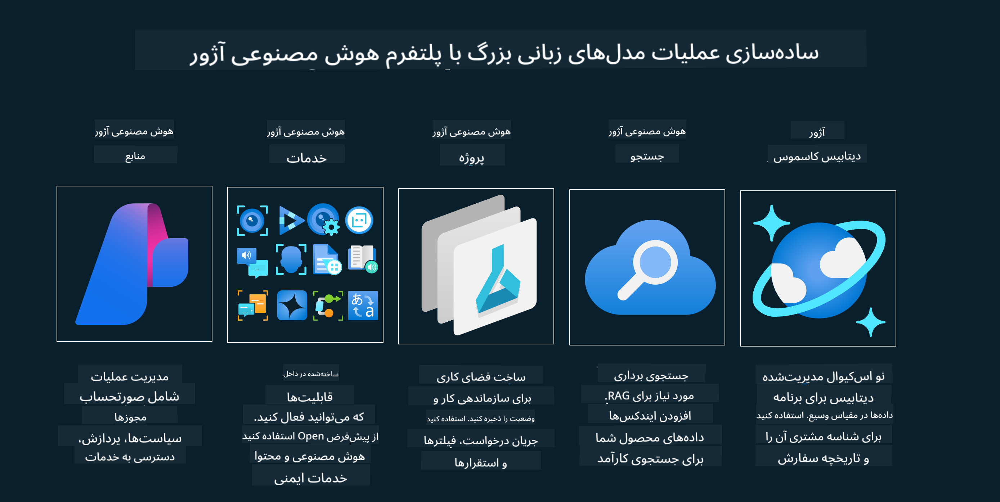
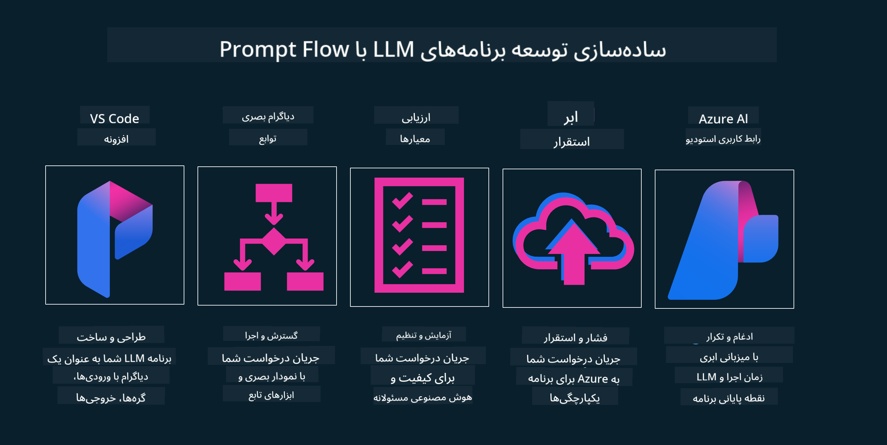

<!--
CO_OP_TRANSLATOR_METADATA:
{
  "original_hash": "27a5347a5022d5ef0a72ab029b03526a",
  "translation_date": "2025-05-19T23:19:56+00:00",
  "source_file": "14-the-generative-ai-application-lifecycle/README.md",
  "language_code": "fa"
}
-->

# چرخه عمر برنامه هوش مصنوعی تولیدی

یک سوال مهم برای همه برنامه‌های هوش مصنوعی، مرتبط بودن ویژگی‌های هوش مصنوعی است. با توجه به اینکه هوش مصنوعی یک حوزه در حال پیشرفت سریع است، برای اطمینان از اینکه برنامه شما همچنان مرتبط، قابل اعتماد و مستحکم باقی می‌ماند، باید آن را به صورت مداوم نظارت، ارزیابی و بهبود دهید. اینجاست که چرخه عمر هوش مصنوعی تولیدی وارد می‌شود.

چرخه عمر هوش مصنوعی تولیدی یک چارچوب است که شما را در مراحل توسعه، پیاده‌سازی و نگهداری یک برنامه هوش مصنوعی تولیدی راهنمایی می‌کند. این به شما کمک می‌کند تا اهداف خود را تعریف کنید، عملکرد خود را اندازه‌گیری کنید، چالش‌های خود را شناسایی کنید و راه‌حل‌های خود را پیاده‌سازی کنید. همچنین به شما کمک می‌کند تا برنامه خود را با استانداردهای اخلاقی و قانونی حوزه و ذی‌نفعان خود همسو کنید. با پیروی از چرخه عمر هوش مصنوعی تولیدی، می‌توانید اطمینان حاصل کنید که برنامه شما همواره ارزش ارائه می‌دهد و کاربران شما را راضی می‌کند.

## مقدمه

در این فصل، شما:

- درک تغییر پارادایم از MLOps به LLMOps
- چرخه عمر LLM
- ابزارهای چرخه عمر
- اندازه‌گیری و ارزیابی چرخه عمر

## درک تغییر پارادایم از MLOps به LLMOps

LLMها یک ابزار جدید در مجموعه هوش مصنوعی هستند. آنها در وظایف تحلیل و تولید برای برنامه‌ها فوق‌العاده قدرتمند هستند، اما این قدرت پیامدهایی در نحوه ساده‌سازی وظایف هوش مصنوعی و یادگیری ماشین کلاسیک دارد.

با این، ما به یک پارادایم جدید نیاز داریم تا این ابزار را به صورت پویا با انگیزه‌های صحیح تطبیق دهیم. ما می‌توانیم برنامه‌های قدیمی هوش مصنوعی را به عنوان "برنامه‌های ML" و برنامه‌های جدید هوش مصنوعی را به عنوان "برنامه‌های GenAI" یا فقط "برنامه‌های AI" دسته‌بندی کنیم، که تکنولوژی و تکنیک‌های اصلی استفاده شده در آن زمان را منعکس می‌کند. این تغییر داستان ما را به چندین روش تغییر می‌دهد، به مقایسه زیر نگاه کنید.

توجه داشته باشید که در LLMOps، ما بیشتر بر توسعه‌دهندگان برنامه تمرکز داریم، با استفاده از یکپارچه‌سازی‌ها به عنوان یک نقطه کلیدی، استفاده از "مدل‌ها به عنوان یک سرویس" و فکر کردن به نکات زیر برای معیارها.

- کیفیت: کیفیت پاسخ
- آسیب: هوش مصنوعی مسئولانه
- صداقت: پایه‌گذاری پاسخ (آیا منطقی است؟ آیا درست است؟)
- هزینه: بودجه راه‌حل
- تأخیر: زمان متوسط برای پاسخ توکن

## چرخه عمر LLM

ابتدا، برای درک چرخه عمر و تغییرات، بیایید به این اینفوگرافیک نگاهی بیندازیم.

همانطور که ممکن است متوجه شوید، این با چرخه‌های عمر معمول از MLOps متفاوت است. LLMها نیازمندی‌های جدید بسیاری دارند، مانند Prompting، تکنیک‌های مختلف برای بهبود کیفیت (تنظیم دقیق، RAG، Meta-Prompts)، ارزیابی و مسئولیت متفاوت با هوش مصنوعی مسئولانه، و در نهایت، معیارهای ارزیابی جدید (کیفیت، آسیب، صداقت، هزینه و تأخیر).

برای مثال، نگاهی بیندازید به اینکه چگونه ما ایده‌پردازی می‌کنیم. با استفاده از مهندسی پرامپت برای آزمایش با LLMهای مختلف به منظور بررسی امکان‌پذیری فرضیه‌های آنها.

توجه داشته باشید که این خطی نیست، بلکه حلقه‌های یکپارچه، تکراری و با یک چرخه کلی است.

چگونه می‌توانیم این مراحل را بررسی کنیم؟ بیایید به جزئیات بپردازیم که چگونه می‌توانیم یک چرخه عمر بسازیم.

این ممکن است کمی پیچیده به نظر برسد، بیایید ابتدا بر سه مرحله بزرگ تمرکز کنیم.

1. ایده‌پردازی/کاوش: کاوش، در اینجا می‌توانیم بر اساس نیازهای کسب و کار خود کاوش کنیم. نمونه‌سازی، ایجاد یک [PromptFlow](https://microsoft.github.io/promptflow/index.html?WT.mc_id=academic-105485-koreyst) و آزمایش اینکه آیا برای فرضیه ما کارآمد است.
2. ساختن/تقویت: پیاده‌سازی، اکنون، ما شروع به ارزیابی برای مجموعه داده‌های بزرگتر می‌کنیم، تکنیک‌هایی مانند تنظیم دقیق و RAG را پیاده‌سازی می‌کنیم تا استحکام راه‌حل خود را بررسی کنیم. اگر نه، ممکن است با اضافه کردن مراحل جدید در جریان خود یا بازسازی داده‌ها کمک کند. پس از آزمایش جریان و مقیاس خود، اگر کار کند و معیارهای ما را بررسی کند، آماده مرحله بعدی است.
3. عملیاتی‌سازی: یکپارچه‌سازی، اکنون افزودن سیستم‌های نظارت و هشدار به سیستم خود، پیاده‌سازی و یکپارچه‌سازی برنامه به برنامه خود.

سپس، ما چرخه کلی مدیریت را داریم، که بر امنیت، انطباق و حکمرانی تمرکز دارد.

تبریک می‌گوییم، اکنون برنامه هوش مصنوعی شما آماده استفاده و عملیاتی است. برای تجربه عملی، به [دموی چت Contoso](https://nitya.github.io/contoso-chat/?WT.mc_id=academic-105485-koreys) نگاهی بیندازید.

حالا، از چه ابزارهایی می‌توانیم استفاده کنیم؟

## ابزارهای چرخه عمر

برای ابزارها، مایکروسافت [پلتفرم Azure AI](https://azure.microsoft.com/solutions/ai/?WT.mc_id=academic-105485-koreys) و [PromptFlow](https://microsoft.github.io/promptflow/index.html?WT.mc_id=academic-105485-koreyst) را ارائه می‌دهد که چرخه شما را ساده می‌کند و آماده اجرا می‌کند.

[پلتفرم Azure AI](https://azure.microsoft.com/solutions/ai/?WT.mc_id=academic-105485-koreys)، به شما امکان می‌دهد از [AI Studio](https://ai.azure.com/?WT.mc_id=academic-105485-koreys) استفاده کنید. AI Studio یک پورتال وب است که به شما امکان می‌دهد مدل‌ها، نمونه‌ها و ابزارها را کاوش کنید. مدیریت منابع خود، جریان‌های توسعه UI و گزینه‌های SDK/CLI برای توسعه کد-اول.

Azure AI به شما امکان می‌دهد از منابع متعدد برای مدیریت عملیات، خدمات، پروژه‌ها، جستجوی برداری و نیازهای پایگاه داده خود استفاده کنید.

ساخت، از Proof-of-Concept(POC) تا برنامه‌های بزرگ با PromptFlow:

- طراحی و ساخت برنامه‌ها از VS Code، با ابزارهای بصری و عملکردی
- آزمایش و تنظیم دقیق برنامه‌های خود برای هوش مصنوعی با کیفیت، با سهولت.
- استفاده از Azure AI Studio برای یکپارچه‌سازی و تکرار با ابر، Push و Deploy برای یکپارچه‌سازی سریع.

## عالی! به یادگیری خود ادامه دهید!

شگفت‌انگیز، اکنون بیشتر درباره چگونگی ساختاردهی یک برنامه برای استفاده از مفاهیم با [برنامه چت Contoso](https://nitya.github.io/contoso-chat/?WT.mc_id=academic-105485-koreyst) یاد بگیرید، تا ببینید چگونه Cloud Advocacy این مفاهیم را در نمایش‌ها اضافه می‌کند. برای محتوای بیشتر، به [جلسه برک‌آوت Ignite!
](https://www.youtube.com/watch?v=DdOylyrTOWg) نگاهی بیندازید.

اکنون، درس ۱۵ را بررسی کنید، تا بفهمید چگونه [تولید تقویت‌شده بازیابی و پایگاه‌های داده برداری](../15-rag-and-vector-databases/README.md?WT.mc_id=academic-105485-koreyst) بر هوش مصنوعی تولیدی تأثیر می‌گذارد و برنامه‌های جذاب‌تری ایجاد می‌کند!

**سلب مسئولیت**:  
این سند با استفاده از سرویس ترجمه هوش مصنوعی [Co-op Translator](https://github.com/Azure/co-op-translator) ترجمه شده است. در حالی که ما برای دقت تلاش می‌کنیم، لطفاً توجه داشته باشید که ترجمه‌های خودکار ممکن است شامل خطاها یا نادرستی‌ها باشند. سند اصلی به زبان بومی خود باید به عنوان منبع معتبر در نظر گرفته شود. برای اطلاعات حیاتی، ترجمه انسانی حرفه‌ای توصیه می‌شود. ما مسئولیتی در قبال سوءتفاهم‌ها یا تفسیرهای نادرست ناشی از استفاده از این ترجمه نداریم.