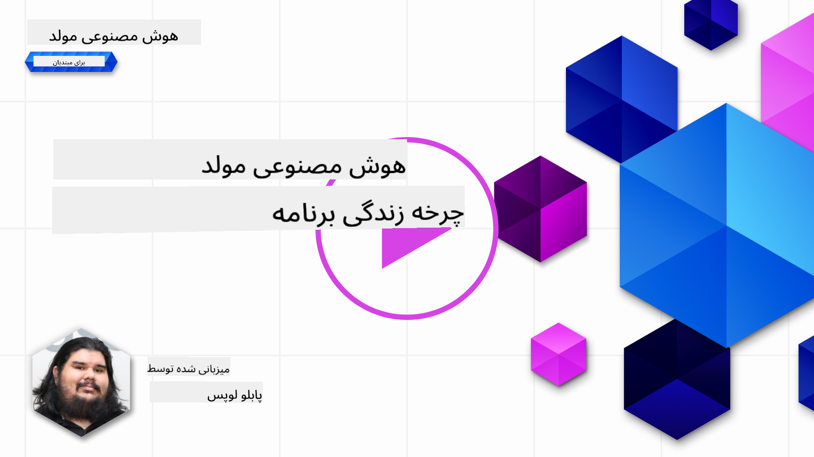
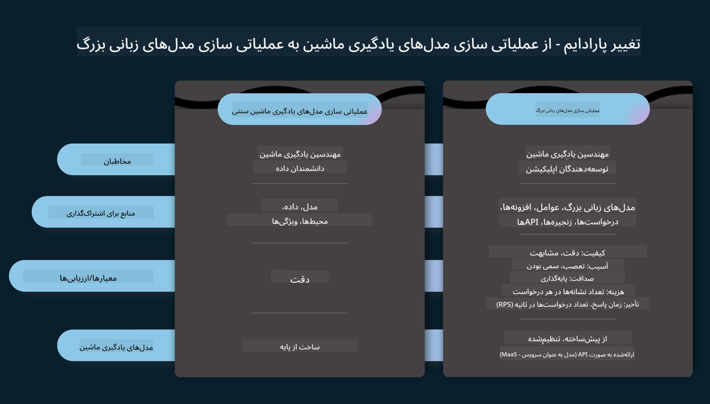
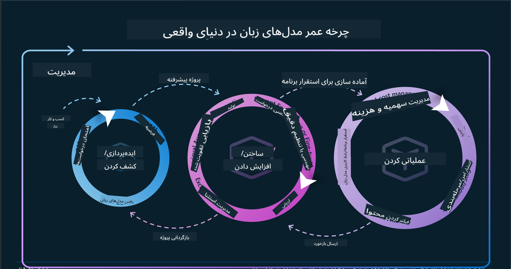
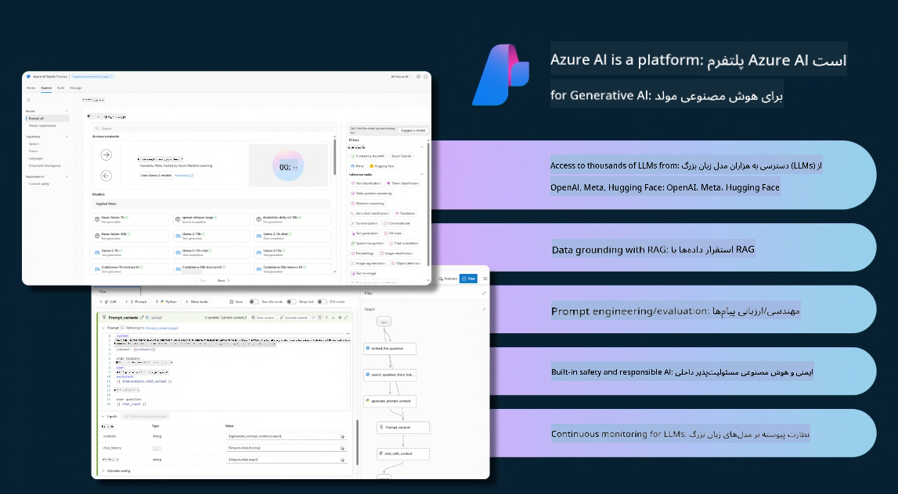
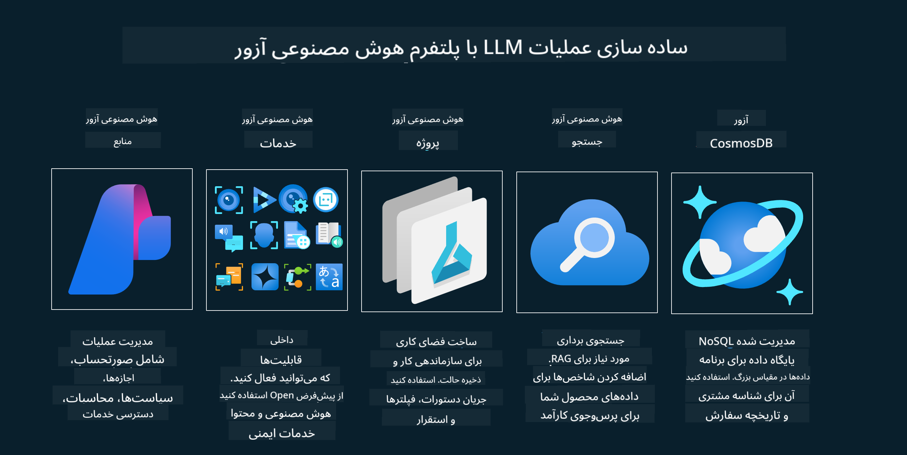
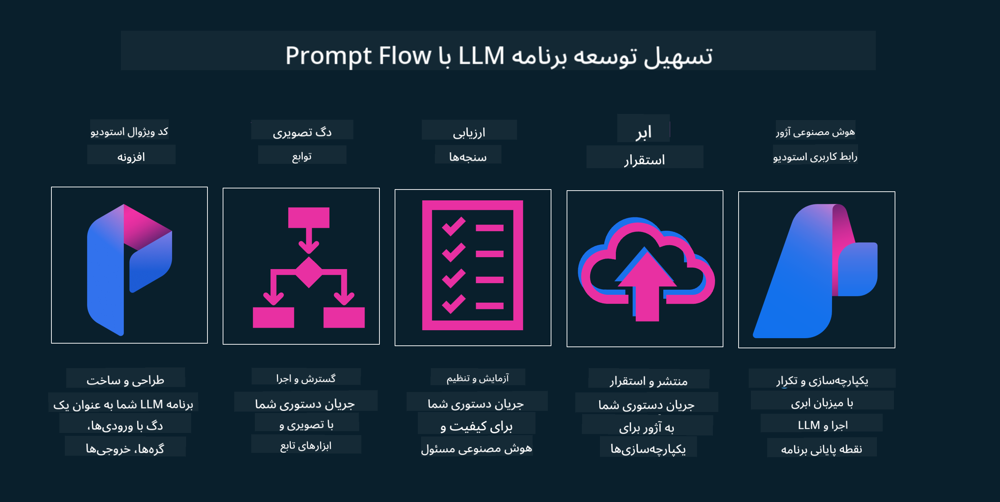

<!--
CO_OP_TRANSLATOR_METADATA:
{
  "original_hash": "27a5347a5022d5ef0a72ab029b03526a",
  "translation_date": "2025-06-25T21:55:29+00:00",
  "source_file": "14-the-generative-ai-application-lifecycle/README.md",
  "language_code": "fa"
}
-->

# چرخه عمر برنامه هوش مصنوعی مولد

یک سوال مهم برای همه برنامه‌های هوش مصنوعی، مرتبط بودن ویژگی‌های هوش مصنوعی است، زیرا هوش مصنوعی یک حوزه سریع در حال تکامل است. برای اطمینان از اینکه برنامه شما مرتبط، قابل اعتماد و قوی باقی می‌ماند، باید به طور مداوم آن را نظارت، ارزیابی و بهبود دهید. اینجاست که چرخه عمر هوش مصنوعی مولد وارد می‌شود.

چرخه عمر هوش مصنوعی مولد یک چارچوب است که شما را در مراحل توسعه، پیاده‌سازی و نگهداری یک برنامه هوش مصنوعی مولد هدایت می‌کند. به شما کمک می‌کند اهداف خود را تعریف کنید، عملکردتان را اندازه‌گیری کنید، چالش‌هایتان را شناسایی کنید و راه‌حل‌هایتان را اجرا کنید. همچنین به شما کمک می‌کند برنامه‌تان را با استانداردهای اخلاقی و قانونی حوزه‌تان و ذینفعان خود هماهنگ کنید. با دنبال کردن چرخه عمر هوش مصنوعی مولد، می‌توانید اطمینان حاصل کنید که برنامه شما همیشه ارزش ارائه می‌دهد و کاربران شما را راضی نگه می‌دارد.

## مقدمه

در این فصل، شما:

- درک تغییر پارادایم از MLOps به LLMOps
- چرخه عمر LLM
- ابزارهای چرخه عمر
- ارزیابی و متریک چرخه عمر

## درک تغییر پارادایم از MLOps به LLMOps

LLMها یک ابزار جدید در مجموعه هوش مصنوعی هستند، آن‌ها در وظایف تحلیل و تولید برای برنامه‌ها بسیار قدرتمند هستند، اما این قدرت برخی پیامدها در نحوه ساده‌سازی وظایف هوش مصنوعی و یادگیری ماشین کلاسیک دارد.

با این وجود، ما به یک پارادایم جدید نیاز داریم تا این ابزار را در یک دینامیک با انگیزه‌های صحیح تطبیق دهیم. می‌توانیم برنامه‌های قدیمی هوش مصنوعی را به عنوان "برنامه‌های ML" و برنامه‌های جدید هوش مصنوعی را به عنوان "برنامه‌های GenAI" یا فقط "برنامه‌های AI" دسته‌بندی کنیم، که فناوری و تکنیک‌های اصلی استفاده شده در آن زمان را منعکس می‌کند. این تغییر در چندین روش روایت ما را تغییر می‌دهد، به مقایسه زیر نگاه کنید.

توجه داشته باشید که در LLMOps، ما بیشتر بر توسعه‌دهندگان برنامه تمرکز داریم، استفاده از ادغام‌ها به عنوان یک نقطه کلیدی، استفاده از "مدل‌ها به عنوان سرویس" و فکر کردن در نقاط زیر برای معیارها.

- کیفیت: کیفیت پاسخ
- آسیب: هوش مصنوعی مسئول
- صداقت: پایه‌گذاری پاسخ (آیا منطقی است؟ آیا صحیح است؟)
- هزینه: بودجه راه‌حل
- تأخیر: میانگین زمان برای پاسخ توکن

## چرخه عمر LLM

ابتدا، برای درک چرخه عمر و تغییرات، بیایید به این اینفوگرافیک توجه کنیم.

همانطور که ممکن است متوجه شوید، این با چرخه‌های عمر معمولی از MLOps متفاوت است. LLMها دارای نیازهای جدید زیادی هستند، مانند پرامپتینگ، تکنیک‌های مختلف برای بهبود کیفیت (فاین‌تیونینگ، RAG، متاپرامپت‌ها)، ارزیابی و مسئولیت‌پذیری متفاوت با هوش مصنوعی مسئول، و در نهایت، معیارهای ارزیابی جدید (کیفیت، آسیب، صداقت، هزینه و تأخیر).

به عنوان مثال، به نحوه ایده‌پردازی توجه کنید. استفاده از مهندسی پرامپت برای آزمایش با LLMهای مختلف برای بررسی امکان‌پذیری‌ها برای آزمون اینکه آیا فرضیه‌های آن‌ها می‌تواند درست باشد.

توجه داشته باشید که این خطی نیست، بلکه حلقه‌های یکپارچه، تکراری و با یک چرخه کلی است.

چگونه می‌توانیم این مراحل را بررسی کنیم؟ بیایید به جزئیات بپردازیم که چگونه می‌توانیم یک چرخه عمر بسازیم.

این ممکن است کمی پیچیده به نظر برسد، بیایید ابتدا بر سه مرحله بزرگ تمرکز کنیم.

1. ایده‌پردازی/کاوش: کاوش، در اینجا می‌توانیم بر اساس نیازهای تجاری خود کاوش کنیم. نمونه‌سازی، ایجاد یک [PromptFlow](https://microsoft.github.io/promptflow/index.html?WT.mc_id=academic-105485-koreyst) و آزمایش اینکه آیا به اندازه کافی برای فرضیه ما کارآمد است.
2. ساخت/افزایش: پیاده‌سازی، اکنون، شروع به ارزیابی برای مجموعه داده‌های بزرگتر می‌کنیم، تکنیک‌هایی مانند فاین‌تیونینگ و RAG را پیاده‌سازی می‌کنیم تا استحکام راه‌حل خود را بررسی کنیم. اگر این کار انجام نشود، ممکن است بازنویسی آن، افزودن مراحل جدید در جریان یا بازسازی داده‌ها کمک کند. پس از آزمایش جریان و مقیاس خود، اگر کار می‌کند و معیارهای ما را بررسی می‌کند، آماده مرحله بعدی است.
3. عملیاتی کردن: ادغام، اکنون افزودن سیستم‌های نظارت و هشدار به سیستم خود، پیاده‌سازی و ادغام برنامه به برنامه خود.

سپس، چرخه کلی مدیریت را داریم که بر امنیت، تطابق و حاکمیت تمرکز دارد.

تبریک می‌گوییم، اکنون برنامه هوش مصنوعی شما آماده کار و عملیاتی است. برای تجربه عملی، به [دموی چت Contoso](https://nitya.github.io/contoso-chat/?WT.mc_id=academic-105485-koreys) نگاهی بیندازید.

اکنون، چه ابزارهایی می‌توانیم استفاده کنیم؟

## ابزارهای چرخه عمر

برای ابزارها، مایکروسافت پلتفرم [Azure AI](https://azure.microsoft.com/solutions/ai/?WT.mc_id=academic-105485-koreys) و [PromptFlow](https://microsoft.github.io/promptflow/index.html?WT.mc_id=academic-105485-koreyst) را فراهم می‌کند تا چرخه شما را به راحتی پیاده‌سازی و آماده کند.

پلتفرم [Azure AI](https://azure.microsoft.com/solutions/ai/?WT.mc_id=academic-105485-koreys) به شما اجازه می‌دهد از [AI Studio](https://ai.azure.com/?WT.mc_id=academic-105485-koreys) استفاده کنید. AI Studio یک پورتال وب است که به شما اجازه می‌دهد مدل‌ها، نمونه‌ها و ابزارها را کاوش کنید. مدیریت منابع، جریان‌های توسعه UI و گزینه‌های SDK/CLI برای توسعه کد-اول را انجام دهید.

Azure AI به شما اجازه می‌دهد از منابع متعدد استفاده کنید تا نیازهای عملیات، خدمات، پروژه‌ها، جستجوی برداری و پایگاه داده‌های خود را مدیریت کنید.

ساخت، از اثبات مفهوم (POC) تا برنامه‌های بزرگ مقیاس با PromptFlow:

- طراحی و ساخت برنامه‌ها از VS Code، با ابزارهای بصری و عملکردی
- آزمایش و فاین‌تیونینگ برنامه‌های خود برای کیفیت هوش مصنوعی، با سهولت.
- استفاده از Azure AI Studio برای ادغام و تکرار با ابر، فشار و پیاده‌سازی برای ادغام سریع.

## عالی! ادامه یادگیری خود را ادامه دهید!

شگفت‌انگیز است، اکنون بیشتر بیاموزید که چگونه یک برنامه را برای استفاده از مفاهیم با [برنامه چت Contoso](https://nitya.github.io/contoso-chat/?WT.mc_id=academic-105485-koreyst) ساختار می‌دهیم، تا بررسی کنید که چگونه تبلیغات ابری این مفاهیم را در نمایش‌ها اضافه می‌کند. برای محتوای بیشتر، جلسه اختصاصی [Ignite](https://www.youtube.com/watch?v=DdOylyrTOWg) را بررسی کنید!

اکنون، درس 15 را بررسی کنید تا بفهمید چگونه [تولید تقویت شده بازیابی و پایگاه داده‌های برداری](../15-rag-and-vector-databases/README.md?WT.mc_id=academic-105485-koreyst) بر هوش مصنوعی مولد تأثیر می‌گذارد و برنامه‌های جذاب‌تری ایجاد می‌کند!

**سلب مسئولیت**:  
این سند با استفاده از سرویس ترجمه هوش مصنوعی [Co-op Translator](https://github.com/Azure/co-op-translator) ترجمه شده است. در حالی که ما برای دقت تلاش می‌کنیم، لطفاً توجه داشته باشید که ترجمه‌های خودکار ممکن است حاوی خطاها یا نادرستی‌هایی باشند. سند اصلی به زبان اصلی خود باید به عنوان منبع معتبر در نظر گرفته شود. برای اطلاعات حیاتی، ترجمه انسانی حرفه‌ای توصیه می‌شود. ما مسئولیتی در قبال سوءتفاهم‌ها یا تفسیرهای نادرست ناشی از استفاده از این ترجمه نداریم.