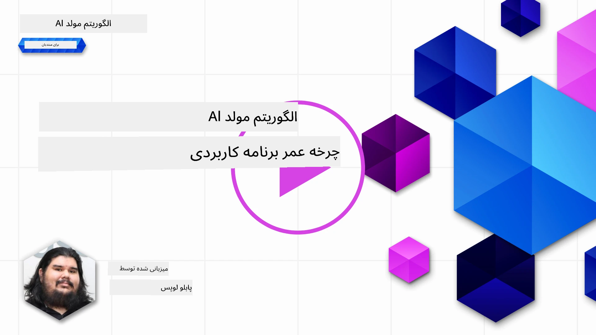
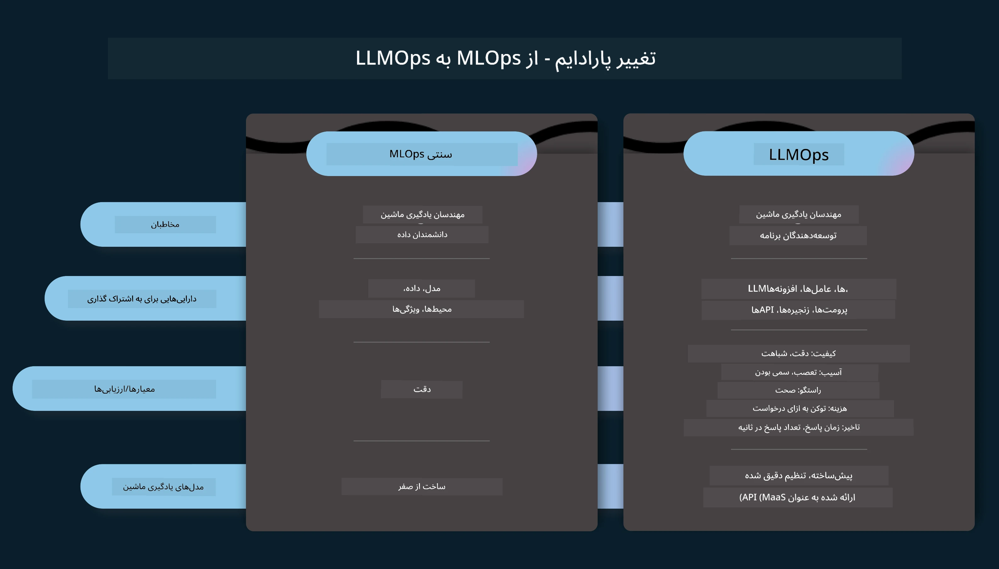
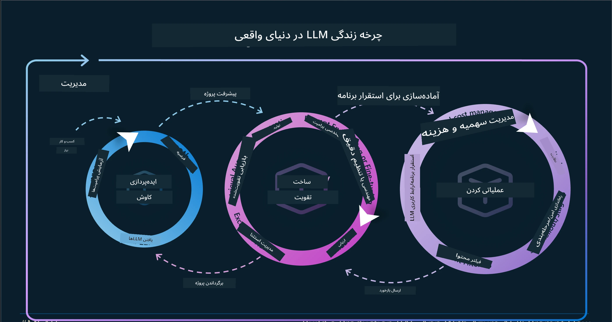
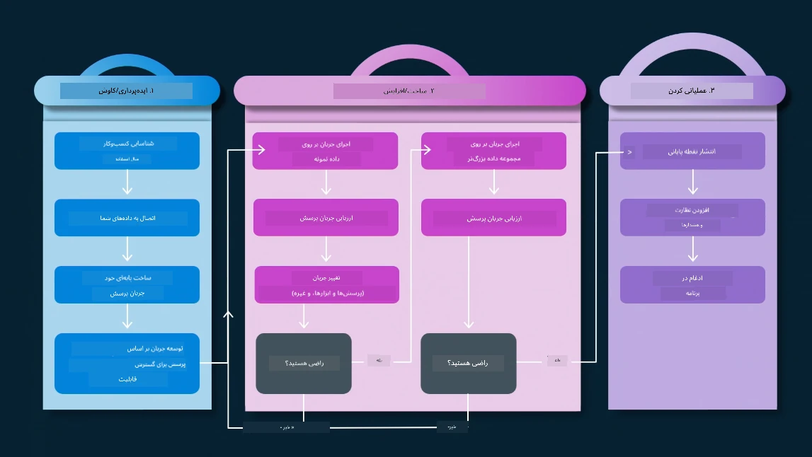
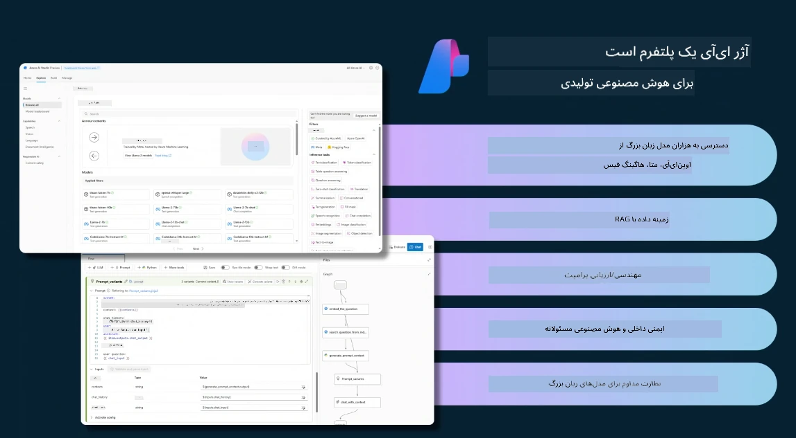
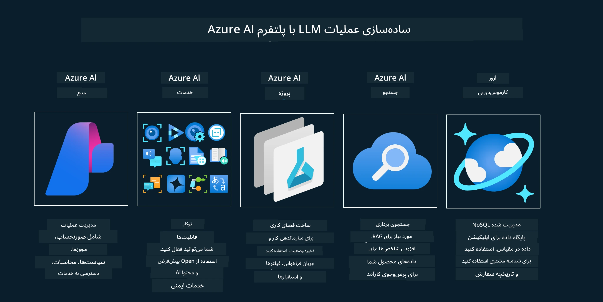
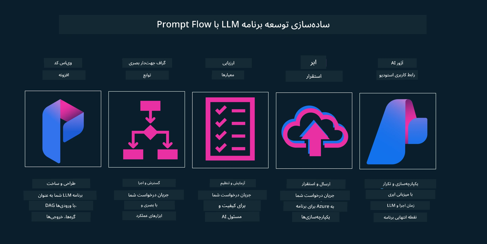

# چرخه زندگی برنامه‌های هوش مصنوعی تولیدی

یک سؤال مهم برای همه برنامه‌های هوش مصنوعی، مرتبط بودن ویژگی‌های هوش مصنوعی است، زیرا هوش مصنوعی حوزه‌ای با تحول سریع است، برای اطمینان از اینکه برنامه شما مرتبط، قابل اعتماد و پایدار باقی می‌ماند، لازم است آن را به‌طور مداوم پایش، ارزیابی و بهبود دهید. اینجاست که چرخه زندگی هوش مصنوعی تولیدی به کار می‌آید.

چرخه زندگی هوش مصنوعی تولیدی چارچوبی است که شما را در مراحل توسعه، استقرار و نگهداری برنامه هوش مصنوعی تولیدی راهنمایی می‌کند. این چارچوب به شما کمک می‌کند اهداف خود را تعریف کنید، عملکرد خود را اندازه‌گیری کنید، چالش‌های خود را شناسایی کنید و راه‌حل‌های خود را اجرا کنید. همچنین به شما کمک می‌کند برنامه خود را با استانداردهای اخلاقی و قانونی حوزه و ذینفعان خود هم‌راستا کنید. با پیروی از چرخه زندگی هوش مصنوعی تولیدی، می‌توانید اطمینان حاصل کنید که برنامه شما همیشه ارزش ارائه می‌دهد و کاربران خود را راضی نگه می‌دارد.

## مقدمه

در این فصل، شما:

- درک تغییر پارادایم از MLOps به LLMOps
- چرخه زندگی LLM
- ابزارهای چرخه زندگی
- متریک‌سازی و ارزیابی چرخه زندگی

## درک تغییر پارادایم از MLOps به LLMOps

مدل‌های زبانی بزرگ (LLMs) ابزاری جدید در مجموعه هوش مصنوعی هستند، آنها در وظایف تحلیل و تولید برای برنامه‌ها قدرت بسیار زیادی دارند، اما این قدرت عواقبی در نحوه ساده‌سازی وظایف هوش مصنوعی و یادگیری ماشین کلاسیک دارد.

با این موضوع، ما به یک پارادایم جدید نیاز داریم تا این ابزار را به صورت دینامیک و با انگیزه‌های صحیح استفاده کنیم. می‌توانیم برنامه‌های قدیمی‌تر هوش مصنوعی را "برنامه‌های یادگیری ماشین" (ML Apps) و برنامه‌های جدید هوش مصنوعی را "برنامه‌های هوش مصنوعی تولیدی" (GenAI Apps) یا فقط "برنامه‌های هوش مصنوعی" (AI Apps) بنامیم که تکنولوژی‌ها و روش‌های اصلی زمان خود را منعکس می‌کند. این موضوع روایت ما را به چندین روش تغییر می‌دهد، نگاهی به مقایسه زیر بیندازید.

توجه کنید که در LLMOps، تمرکز بیشتری روی توسعه‌دهندگان برنامه داریم، با استفاده از یکپارچه‌سازی‌ها به عنوان نقطه کلیدی، استفاده از «مدل‌ها به عنوان سرویس» و تفکر در نکات زیر برای متریک‌ها.

- کیفیت: کیفیت پاسخ
- آسیب: هوش مصنوعی مسئولانه
- صداقت: مستندسازی پاسخ (مفهوم دارد؟ درست است؟)
- هزینه: بودجه راه‌حل
- تأخیر: میانگین زمان پاسخ توکن

## چرخه زندگی LLM

اولین گام برای درک چرخه زندگی و تغییرات آن، توجه به این اینفوگرافیک است.

همانطور که ممکن است مشاهده کنید، این با چرخه‌های معمول MLOps متفاوت است. LLMها نیازمندی‌های جدید زیادی دارند، مانند رفع ابهام (Prompting)، تکنیک‌های مختلف برای بهبود کیفیت (تنظیم مجدد، RAG، متا-پرومت‌ها)، ارزیابی و مسئولیت‌پذیری با هوش مصنوعی مسئولانه، و در نهایت متریک‌های ارزیابی جدید (کیفیت، آسیب، صداقت، هزینه و تأخیر).

برای مثال، نگاه کنید چگونه ایده‌پردازی می‌کنیم. با استفاده از مهندسی پرومت برای آزمایش با مدل‌های مختلف LLM به منظور بررسی امکان‌سنجی و تست اینکه فرضیه آنها می‌تواند درست باشد.

توجه داشته باشید که این روند خطی نیست، بلکه حلقه‌های یکپارچه، تکراری و با یک چرخه کلی است.

چگونه می‌توان این مراحل را کاوش کرد؟ بیایید به جزئیات وارد شویم و ببینیم چگونه می‌توانیم یک چرخه زندگی بسازیم.

ممکن است این کمی پیچیده به نظر برسد، ابتدا بیایید روی سه مرحله بزرگ تمرکز کنیم.

1. ایده‌پردازی/کاوش: کاوش، در اینجا می‌توانیم بر اساس نیازهای کسب‌وکار خود کاوش کنیم. نمونه‌سازی، ایجاد یک [PromptFlow](https://microsoft.github.io/promptflow/index.html?WT.mc_id=academic-105485-koreyst) و تست اینکه آیا برای فرضیه ما کافی کارآمد است یا خیر.
1. ساخت/افزایش: پیاده‌سازی، اکنون شروع به ارزیابی روی داده‌های بزرگ‌تر و اجرای تکنیک‌هایی مانند تنظیم دقیق (Fine-tuning) و RAG می‌کنیم تا از استحکام راه‌حل خود اطمینان حاصل کنیم. اگر موفق نبود، پیاده‌سازی مجدد، افزودن مراحل جدید به جریان یا بازساخت داده‌ها می‌تواند کمک کند. پس از تست جریان و مقیاس خود، اگر کار کند و متریک‌ها را بررسی کند، آماده مرحله بعد است.
1. عملیاتی‌سازی: یکپارچه‌سازی، اکنون افزودن سیستم‌های نظارت و هشدار به سامانه، استقرار و یکپارچه‌سازی برنامه با اپلیکیشن ما.

سپس، چرخه کلی مدیریت داریم که بر امنیت، انطباق و حاکمیت تمرکز دارد.

تبریک! اکنون برنامه هوش مصنوعی شما آماده استفاده و عملیاتی است. برای تجربه عملی، به [دموی چت Contoso](https://nitya.github.io/contoso-chat/?WT.mc_id=academic-105485-koreyst) نگاهی بیندازید.

حالا چه ابزارهایی می‌توانیم استفاده کنیم؟

## ابزارهای چرخه زندگی

برای ابزارها، مایکروسافت پلتفرم [Azure AI](https://azure.microsoft.com/solutions/ai/?WT.mc_id=academic-105485-koreyst) و [PromptFlow](https://microsoft.github.io/promptflow/index.html?WT.mc_id=academic-105485-koreyst) را فراهم می‌کند که چرخه شما را آسان کرده و آماده اجرا می‌کند.

[پلتفرم Azure AI](https://azure.microsoft.com/solutions/ai/?WT.mc_id=academic-105485-koreyst)، به شما امکان استفاده از [AI Studio](https://ai.azure.com/?WT.mc_id=academic-105485-koreyst) را می‌دهد. AI Studio یک پورتال وب است که به شما امکان کاوش مدل‌ها، نمونه‌ها و ابزارها را می‌دهد. مدیریت منابع، جریان‌های توسعه UI و گزینه‌های SDK/CLI برای توسعه با اولویت کد را فراهم می‌کند.

Azure AI به شما امکان استفاده از منابع متعدد برای مدیریت عملیات، خدمات، پروژه‌ها، جستجوی برداری و نیازهای پایگاه داده را می‌دهد.

از Proof-of-Concept (POC) تا برنامه‌های بزرگ مقیاس با PromptFlow بسازید:

- طراحی و ساخت برنامه‌ها از VS Code، با ابزارهای بصری و عملیاتی
- تست و تنظیم دقیق برنامه‌ها برای کیفیت هوش مصنوعی، به آسانی.
- استفاده از Azure AI Studio برای یکپارچه‌سازی و تکرار با فضای ابری، ارسال و استقرار برای یکپارچه‌سازی سریع.

## عالی! یادگیری خود را ادامه دهید!

شگفت‌انگیز، اکنون بیشتر درباره ساختار برنامه برای استفاده از مفاهیم با [برنامه چت Contoso](https://nitya.github.io/contoso-chat/?WT.mc_id=academic-105485-koreyst) بیاموزید، تا ببینید چگونه ائتلاف ابری این مفاهیم را در نمایش‌ها اضافه می‌کند. برای محتوای بیشتر، جلسه بخش تفکیک شده [Ignite را بررسی کنید!](https://www.youtube.com/watch?v=DdOylyrTOWg)

اکنون، درس ۱۵ را بررسی کنید تا بفهمید چگونه [تولید افزوده بازیابی شده و پایگاه‌های داده برداری](../15-rag-and-vector-databases/README.md?WT.mc_id=academic-105485-koreyst) بر هوش مصنوعی تولیدی تأثیر می‌گذارند و برنامه‌هایی جذاب‌تر خلق کنید!

---

<!-- CO-OP TRANSLATOR DISCLAIMER START -->
**سلب مسئولیت**:  
این سند با استفاده از خدمات ترجمه هوش مصنوعی [Co-op Translator](https://github.com/Azure/co-op-translator) ترجمه شده است. در حالی که ما در تلاش برای دقت هستیم، لطفاً توجه داشته باشید که ترجمه‌های خودکار ممکن است حاوی خطاها یا نادقیقی‌هایی باشد. سند اصلی به زبان بومی آن باید به عنوان مرجع معتبر در نظر گرفته شود. برای اطلاعات حیاتی، ترجمه حرفه‌ای انسانی توصیه می‌شود. ما مسئول هیچگونه سوءتفاهم یا تفسیر نادرست ناشی از استفاده از این ترجمه نیستیم.
<!-- CO-OP TRANSLATOR DISCLAIMER END -->