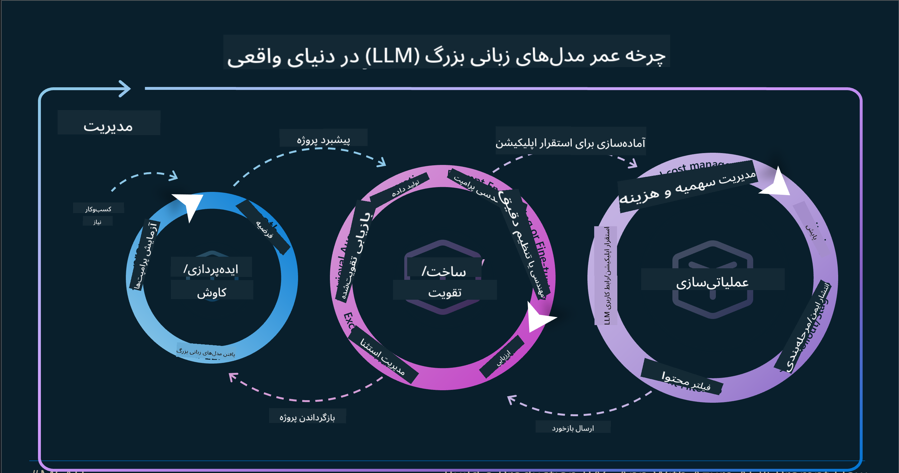

<!--
CO_OP_TRANSLATOR_METADATA:
{
  "original_hash": "27a5347a5022d5ef0a72ab029b03526a",
  "translation_date": "2025-07-09T15:47:48+00:00",
  "source_file": "14-the-generative-ai-application-lifecycle/README.md",
  "language_code": "fa"
}
-->

# چرخه عمر برنامه‌های هوش مصنوعی مولد

یک سوال مهم برای همه برنامه‌های هوش مصنوعی، مرتبط بودن ویژگی‌های هوش مصنوعی است، زیرا هوش مصنوعی حوزه‌ای است که به سرعت در حال پیشرفت است. برای اطمینان از اینکه برنامه شما مرتبط، قابل اعتماد و مقاوم باقی می‌ماند، باید به طور مداوم آن را نظارت، ارزیابی و بهبود دهید. اینجاست که چرخه عمر هوش مصنوعی مولد وارد می‌شود.

چرخه عمر هوش مصنوعی مولد چارچوبی است که شما را در مراحل توسعه، استقرار و نگهداری یک برنامه هوش مصنوعی مولد راهنمایی می‌کند. این چارچوب به شما کمک می‌کند اهداف خود را تعریف کنید، عملکرد خود را اندازه‌گیری کنید، چالش‌هایتان را شناسایی کنید و راه‌حل‌های خود را پیاده‌سازی کنید. همچنین به شما کمک می‌کند برنامه خود را با استانداردهای اخلاقی و قانونی حوزه و ذینفعانتان هماهنگ کنید. با پیروی از چرخه عمر هوش مصنوعی مولد، می‌توانید اطمینان حاصل کنید که برنامه شما همیشه ارزش ارائه می‌دهد و کاربران خود را راضی نگه می‌دارد.

## مقدمه

در این فصل، شما:

- تغییر پارادایم از MLOps به LLMOps را درک خواهید کرد
- چرخه عمر LLM را می‌آموزید
- ابزارهای چرخه عمر را می‌شناسید
- متریک‌ها و ارزیابی چرخه عمر را بررسی می‌کنید

## درک تغییر پارادایم از MLOps به LLMOps

LLMها ابزار جدیدی در مجموعه هوش مصنوعی هستند، آن‌ها در وظایف تحلیل و تولید برای برنامه‌ها بسیار قدرتمندند، اما این قدرت پیامدهایی در نحوه ساده‌سازی وظایف هوش مصنوعی و یادگیری ماشین کلاسیک دارد.

با این شرایط، نیاز به یک پارادایم جدید داریم تا این ابزار را به صورت پویا و با انگیزه‌های درست سازگار کنیم. می‌توانیم برنامه‌های قدیمی‌تر هوش مصنوعی را «برنامه‌های ML» و برنامه‌های جدیدتر را «برنامه‌های GenAI» یا فقط «برنامه‌های AI» بنامیم، که فناوری‌ها و تکنیک‌های رایج در زمان خود را منعکس می‌کند. این تغییر روایت ما را به چندین روش تحت تأثیر قرار می‌دهد، به مقایسه زیر توجه کنید.

توجه کنید که در LLMOps، تمرکز بیشتری روی توسعه‌دهندگان برنامه داریم، استفاده از ادغام‌ها به عنوان نقطه کلیدی، استفاده از «مدل‌ها به عنوان سرویس» و تفکر در مورد معیارهای زیر:

- کیفیت: کیفیت پاسخ
- آسیب: هوش مصنوعی مسئولانه
- صداقت: پایه‌دار بودن پاسخ (آیا منطقی است؟ آیا درست است؟)
- هزینه: بودجه راه‌حل
- تأخیر: میانگین زمان پاسخ به توکن

## چرخه عمر LLM

ابتدا برای درک چرخه عمر و تغییرات آن، به این اینفوگرافیک توجه کنید.

همانطور که مشاهده می‌کنید، این با چرخه‌های معمول MLOps متفاوت است. LLMها نیازمندی‌های جدید زیادی دارند، مانند پرامپتینگ، تکنیک‌های مختلف برای بهبود کیفیت (تنظیم دقیق، RAG، متا-پرامپت‌ها)، ارزیابی و مسئولیت‌پذیری با هوش مصنوعی مسئولانه، و در نهایت معیارهای ارزیابی جدید (کیفیت، آسیب، صداقت، هزینه و تأخیر).

برای مثال، به نحوه ایده‌پردازی نگاه کنید. با استفاده از مهندسی پرامپت برای آزمایش با مدل‌های مختلف LLM به منظور کشف امکانات و بررسی اینکه آیا فرضیه‌هایشان می‌تواند درست باشد.

توجه داشته باشید که این فرآیند خطی نیست، بلکه حلقه‌های یکپارچه، تکراری و با یک چرخه کلی است.

چگونه می‌توانیم این مراحل را بررسی کنیم؟ بیایید جزئیات ساخت چرخه عمر را بررسی کنیم.

ممکن است کمی پیچیده به نظر برسد، ابتدا روی سه مرحله بزرگ تمرکز کنیم.

1. ایده‌پردازی/کاوش: در این مرحله می‌توانیم بر اساس نیازهای کسب‌وکار خود کاوش کنیم. نمونه‌سازی، ایجاد یک [PromptFlow](https://microsoft.github.io/promptflow/index.html?WT.mc_id=academic-105485-koreyst) و آزمایش اینکه آیا برای فرضیه ما کافی است یا خیر.
2. ساخت/تقویت: پیاده‌سازی، اکنون شروع به ارزیابی داده‌های بزرگ‌تر و اجرای تکنیک‌هایی مانند تنظیم دقیق و RAG می‌کنیم تا مقاومت راه‌حل خود را بررسی کنیم. اگر کار نکرد، بازپیاده‌سازی، افزودن مراحل جدید در جریان یا بازسازی داده‌ها ممکن است کمک کند. پس از آزمایش جریان و مقیاس خود، اگر کار کرد و معیارها را تأیید کرد، آماده مرحله بعدی است.
3. عملیاتی‌سازی: ادغام، اکنون افزودن سیستم‌های نظارت و هشدار به سیستم، استقرار و ادغام برنامه با برنامه اصلی.

سپس، چرخه کلی مدیریت داریم که بر امنیت، انطباق و حاکمیت تمرکز دارد.

تبریک می‌گوییم، اکنون برنامه هوش مصنوعی شما آماده و عملیاتی است. برای تجربه عملی، نگاهی به [دموی چت Contoso](https://nitya.github.io/contoso-chat/?WT.mc_id=academic-105485-koreys) بیندازید.

حالا، چه ابزارهایی می‌توانیم استفاده کنیم؟

## ابزارهای چرخه عمر

برای ابزارها، مایکروسافت پلتفرم [Azure AI](https://azure.microsoft.com/solutions/ai/?WT.mc_id=academic-105485-koreys) و [PromptFlow](https://microsoft.github.io/promptflow/index.html?WT.mc_id=academic-105485-koreyst) را ارائه می‌دهد که چرخه شما را آسان و آماده اجرا می‌کند.

پلتفرم [Azure AI](https://azure.microsoft.com/solutions/ai/?WT.mc_id=academic-105485-koreys) به شما امکان استفاده از [AI Studio](https://ai.azure.com/?WT.mc_id=academic-105485-koreys) را می‌دهد. AI Studio یک پورتال وب است که به شما اجازه می‌دهد مدل‌ها، نمونه‌ها و ابزارها را کاوش کنید، منابع خود را مدیریت کنید، جریان‌های توسعه UI و گزینه‌های SDK/CLI برای توسعه کد-محور را داشته باشید.

Azure AI به شما اجازه می‌دهد از منابع متعددی برای مدیریت عملیات، خدمات، پروژه‌ها، جستجوی برداری و نیازهای پایگاه داده استفاده کنید.

از اثبات مفهوم (POC) تا برنامه‌های بزرگ مقیاس با PromptFlow بسازید:

- طراحی و ساخت برنامه‌ها از VS Code، با ابزارهای بصری و عملکردی
- آزمایش و تنظیم دقیق برنامه‌ها برای هوش مصنوعی با کیفیت، به آسانی
- استفاده از Azure AI Studio برای ادغام و تکرار با ابر، ارسال و استقرار برای ادغام سریع

## عالی! یادگیری خود را ادامه دهید!

شگفت‌انگیز است، حالا بیشتر بیاموزید که چگونه یک برنامه را ساختاربندی کنیم تا مفاهیم را با [برنامه چت Contoso](https://nitya.github.io/contoso-chat/?WT.mc_id=academic-105485-koreyst) به کار ببریم و ببینید چگونه Cloud Advocacy این مفاهیم را در نمایش‌ها اضافه می‌کند. برای محتوای بیشتر، جلسه [Ignite breakout](https://www.youtube.com/watch?v=DdOylyrTOWg) ما را بررسی کنید!

حالا، درس ۱۵ را ببینید تا بفهمید چگونه [تولید افزوده بازیابی شده و پایگاه‌های داده برداری](../15-rag-and-vector-databases/README.md?WT.mc_id=academic-105485-koreyst) بر هوش مصنوعی مولد تأثیر می‌گذارند و برنامه‌های جذاب‌تری بسازید!

**سلب مسئولیت**:  
این سند با استفاده از سرویس ترجمه هوش مصنوعی [Co-op Translator](https://github.com/Azure/co-op-translator) ترجمه شده است. در حالی که ما در تلاش برای دقت هستیم، لطفاً توجه داشته باشید که ترجمه‌های خودکار ممکن است حاوی خطاها یا نواقصی باشند. سند اصلی به زبان بومی خود باید به عنوان منبع معتبر در نظر گرفته شود. برای اطلاعات حیاتی، ترجمه حرفه‌ای انسانی توصیه می‌شود. ما مسئول هیچ گونه سوءتفاهم یا تفسیر نادرستی که از استفاده این ترجمه ناشی شود، نیستیم.